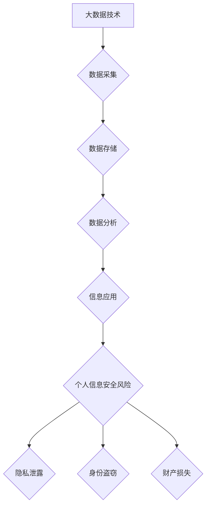

## 大数据背景下大学生个人信息安全问题及防护措施

> 关键词：大数据、个人信息安全、大学生、信息安全风险、防护措施、隐私保护、数据加密、身份认证、网络安全

## 1. 背景介绍

随着互联网和移动互联网技术的飞速发展，大数据时代已经到来。大数据技术以其强大的数据处理能力和分析能力，在各个领域都得到了广泛应用，为社会带来了巨大的进步。然而，大数据时代也带来了新的安全挑战，特别是对于大学生个人信息安全问题，其风险和隐患日益凸显。

大学生作为信息时代的重要组成部分，在学习、生活、社交等各个方面都离不开互联网和移动互联网。他们经常在网络上注册账号、使用社交平台、在线支付、参与在线学习等活动，在这些过程中会产生大量的个人信息，例如姓名、身份证号码、联系方式、学习成绩、兴趣爱好等。这些个人信息一旦泄露，将可能导致身份盗窃、财产损失、隐私侵犯等严重后果。

## 2. 核心概念与联系

### 2.1 大数据

大数据是指规模庞大、结构复杂、更新速度快、类型多样化的数据。其特征通常被概括为“五V”：

* **Volume (体积)**：数据量巨大，难以用传统方法处理。
* **Velocity (速度)**：数据生成和更新速度快，需要实时处理。
* **Variety (多样性)**：数据类型多样，包括结构化数据、非结构化数据和半结构化数据。
* **Veracity (真实性)**：数据质量参差不齐，需要进行清洗和验证。
* **Value (价值)**：数据蕴含着巨大的价值，需要进行挖掘和分析。

### 2.2 个人信息安全

个人信息安全是指保护个人身份信息、隐私信息和财产信息免受未经授权的访问、使用、披露、修改或删除等安全威胁。个人信息安全是信息社会的重要议题，关系到每个公民的基本权利和利益。

### 2.3 学生信息安全

学生信息安全是指保护学生个人信息安全，包括但不限于姓名、身份证号码、家庭地址、联系方式、学习成绩、照片、视频等信息。学生信息安全问题日益突出，需要学校、政府和社会各界共同努力，采取有效措施保障学生信息安全。

**Mermaid 流程图**



## 3. 核心算法原理 & 具体操作步骤

### 3.1 算法原理概述

为了保障大学生个人信息安全，需要采用多种算法和技术手段，例如数据加密、身份认证、访问控制等。这些算法和技术可以帮助保护个人信息免受未经授权的访问和使用。

### 3.2 算法步骤详解

**数据加密算法**

1. 选择合适的加密算法，例如AES、RSA等。
2. 生成密钥，密钥需要保密。
3. 对个人信息进行加密，使用密钥加密数据。
4. 将加密后的数据存储或传输。
5. 解密时，使用相同的密钥解密数据。

**身份认证算法**

1. 用户提供身份信息，例如用户名、密码、指纹等。
2. 系统验证用户身份信息，例如数据库查询、生物识别验证等。
3. 如果验证成功，系统授权用户访问系统资源。

**访问控制算法**

1. 定义访问权限规则，例如用户角色、权限级别等。
2. 系统根据访问权限规则控制用户对资源的访问。
3. 限制未经授权的用户访问敏感信息。

### 3.3 算法优缺点

**数据加密算法**

* **优点**: 可以有效保护个人信息免受未经授权的访问和使用。
* **缺点**: 加密和解密需要消耗计算资源，可能会影响系统性能。

**身份认证算法**

* **优点**: 可以验证用户的身份，确保只有授权用户才能访问系统资源。
* **缺点**: 密码容易被破解，生物识别技术成本较高。

**访问控制算法**

* **优点**: 可以细粒度地控制用户对资源的访问，提高信息安全。
* **缺点**: 需要复杂的权限管理机制，维护成本较高。

### 3.4 算法应用领域

* **数据加密算法**: 在线支付、电子邮箱、医疗信息系统等。
* **身份认证算法**: 社交平台、银行系统、电子政务等。
* **访问控制算法**: 企业内部网络、数据库管理系统等。

## 4. 数学模型和公式 & 详细讲解 & 举例说明

### 4.1 数学模型构建

**数据安全风险模型**

$$R = f(V, A, C, K)$$

其中：

* $R$：数据安全风险
* $V$：数据价值
* $A$：攻击可能性
* $C$：控制措施
* $K$：数据敏感度

### 4.2 公式推导过程

数据安全风险模型的推导过程基于以下假设：

* 数据价值越高，风险越大。
* 攻击可能性越高，风险越大。
* 控制措施越完善，风险越小。
* 数据敏感度越高，风险越大。

根据以上假设，可以构建数据安全风险模型，其中每个变量的权重可以通过专家评估或数据分析确定。

### 4.3 案例分析与讲解

假设一个大学图书馆的数据库中存储了大量学生的个人信息，例如姓名、身份证号码、学习成绩等。

* $V$：数据价值较高，因为学生个人信息具有重要的社会价值。
* $A$：攻击可能性较高，因为图书馆数据库可能存在漏洞，攻击者可以利用漏洞获取学生个人信息。
* $C$：控制措施较完善，图书馆已经采取了数据加密、身份认证、访问控制等措施。
* $K$：数据敏感度较高，因为学生个人信息涉及到隐私和安全。

根据以上分析，图书馆数据库的数据安全风险较高。

## 5. 项目实践：代码实例和详细解释说明

### 5.1 开发环境搭建

* 操作系统：Windows/Linux/macOS
* 编程语言：Python
* 开发工具：PyCharm/VS Code
* 库依赖：requests、BeautifulSoup、pandas

### 5.2 源代码详细实现

```python
import requests
from bs4 import BeautifulSoup
import pandas as pd

# 获取网页内容
url = 'https://www.example.com'
response = requests.get(url)
response.raise_for_status()

# 解析网页内容
soup = BeautifulSoup(response.content, 'html.parser')

# 提取数据
data = []
for item in soup.find_all('div', class_='student-info'):
    name = item.find('span', class_='name').text
    id_number = item.find('span', class_='id-number').text
    grade = item.find('span', class_='grade').text
    data.append({'name': name, 'id_number': id_number, 'grade': grade})

# 将数据保存到CSV文件
df = pd.DataFrame(data)
df.to_csv('student_info.csv', index=False)
```

### 5.3 代码解读与分析

这段代码演示了如何使用Python爬取网页数据并保存到CSV文件。

1. 使用requests库获取网页内容。
2. 使用BeautifulSoup库解析网页内容。
3. 使用循环遍历网页中的特定元素，提取数据。
4. 使用pandas库将数据存储到DataFrame中。
5. 使用DataFrame的to_csv方法将数据保存到CSV文件。

### 5.4 运行结果展示

运行这段代码后，将生成一个名为`student_info.csv`的CSV文件，其中包含学生姓名、身份证号码和成绩等信息。

## 6. 实际应用场景

### 6.1 学生信息管理系统

学生信息管理系统可以利用大数据技术对学生信息进行分析，例如分析学生的学习成绩、兴趣爱好、行为模式等，为学生提供个性化的学习建议和服务。

### 6.2 在线教育平台

在线教育平台可以利用大数据技术对学生的学习情况进行实时监控，例如分析学生的学习进度、学习效率、学习偏好等，为学生提供个性化的学习路径和辅导。

### 6.3 校园安全监控系统

校园安全监控系统可以利用大数据技术对校园环境进行实时监控，例如分析学生的流动轨迹、行为异常等，提高校园安全水平。

### 6.4 未来应用展望

随着大数据技术的不断发展，在大学生个人信息安全领域将会有更多新的应用场景和技术手段出现，例如：

* **人工智能驱动的隐私保护技术**: 利用人工智能技术对个人信息进行匿名化处理，保护个人隐私。
* **区块链技术保障数据安全**: 利用区块链技术的去中心化和不可篡改特性，保障学生个人信息的安全性。
* **联邦学习**: 利用联邦学习技术，在不泄露原始数据的情况下，对学生数据进行联合分析和训练。

## 7. 工具和资源推荐

### 7.1 学习资源推荐

* **书籍**:
    * 《大数据时代信息安全》
    * 《网络安全基础》
    * 《数据隐私保护》
* **在线课程**:
    * Coursera: 数据安全与隐私
    * edX: 网络安全基础
    * Udemy: 数据加密与安全

### 7.2 开发工具推荐

* **数据分析工具**:
    * Python: pandas, scikit-learn
    * R: dplyr, ggplot2
* **数据可视化工具**:
    * Tableau
    * Power BI
    * matplotlib

### 7.3 相关论文推荐

* **数据安全风险模型**:
    * "A Data Security Risk Model Based on Fuzzy Logic"
    * "A Framework for Data Security Risk Assessment"
* **隐私保护技术**:
    * "Differential Privacy"
    * "Homomorphic Encryption"

## 8. 总结：未来发展趋势与挑战

### 8.1 研究成果总结

大数据技术为大学生个人信息安全带来了新的挑战和机遇。通过采用数据加密、身份认证、访问控制等技术手段，可以有效保护大学生个人信息安全。未来，人工智能、区块链等新技术将为大学生个人信息安全提供新的解决方案。

### 8.2 未来发展趋势

* **人工智能驱动的隐私保护技术**: 利用人工智能技术对个人信息进行匿名化处理，保护个人隐私。
* **区块链技术保障数据安全**: 利用区块链技术的去中心化和不可篡改特性，保障学生个人信息的安全性。
* **联邦学习**: 利用联邦学习技术，在不泄露原始数据的情况下，对学生数据进行联合分析和训练。

### 8.3 面临的挑战

* **技术复杂性**: 大数据技术和隐私保护技术都比较复杂，需要专业的技术人员进行开发和维护。
* **数据安全意识**: 大学生对数据安全意识普遍较低，需要加强宣传教育。
* **法律法规**: 数据安全法律法规还在不断完善，需要政府和社会各界共同努力，制定完善的法律法规体系。

### 8.4 研究展望

未来，我们将继续关注大数据背景下大学生个人信息安全问题，研究新的技术手段和解决方案，为大学生提供更加安全可靠的信息环境。

## 9. 附录：常见问题与解答

**常见问题**:

* 如何保护我的个人信息安全？
* 大数据技术会侵犯我的隐私吗？
* 如何应对网络安全威胁？

**解答**:

* 保护个人信息安全，可以采取以下措施：
    * 使用强密码，定期更换密码。
    * 不要随意点击陌生链接，不要泄露个人信息。
    * 使用数据加密软件，保护敏感信息。
* 大数据技术本身不会侵犯隐私，但如果应用不当，可能会导致隐私泄露。
* 应对网络安全威胁，可以采取以下措施：
    * 安装杀毒软件，定期更新病毒库。
    * 使用防火墙，保护网络安全。
    * 注意网络安全意识，不要轻易相信陌生