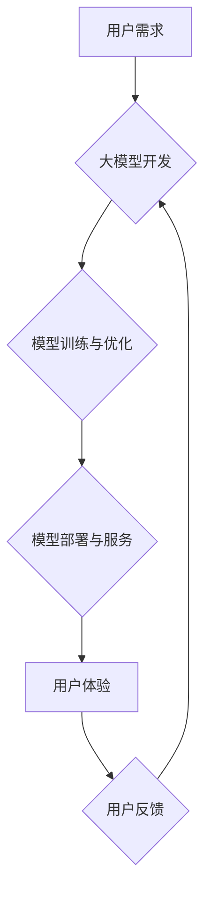

## 大模型的用户体验与市场推广

> 关键词：大模型、用户体验、市场推广、应用场景、技术挑战、未来趋势

### 1. 背景介绍

近年来，大模型技术蓬勃发展，其强大的泛化能力和应用潜力吸引了广泛关注。从文本生成、机器翻译到图像识别、语音合成，大模型在各个领域展现出令人瞩目的成果。然而，随着大模型规模的不断扩大，其部署和应用面临着新的挑战，其中用户体验和市场推广尤为重要。

传统的软件开发模式侧重于功能实现，而大模型的应用则更加注重用户体验和场景适配。用户需要能够便捷、高效地与大模型交互，并获得符合预期、有价值的结果。同时，大模型的商业化推广也需要考虑用户需求、市场竞争和技术可行性等因素。

### 2. 核心概念与联系

大模型的用户体验和市场推广是相互关联的两个方面。良好的用户体验可以提升用户满意度和粘性，从而促进大模型的市场推广。反之，市场推广可以为大模型提供更多应用场景和用户群体，进而推动用户体验的改进。

**大模型用户体验**

* **易用性:** 用户应该能够轻松理解并使用大模型，无需复杂的技术背景或操作步骤。
* **效率:** 用户应该能够快速获得所需的结果，避免长时间等待或繁琐的交互过程。
* **准确性:** 大模型的输出结果应该准确、可靠，能够满足用户的实际需求。
* **个性化:** 大模型应该能够根据用户的偏好和需求进行个性化定制，提供更贴心的服务。
* **安全性:** 用户的数据和隐私应该得到充分保护，避免信息泄露或滥用。

**大模型市场推广**

* **目标用户:** 明确大模型的目标用户群体，了解他们的需求和痛点。
* **价值主张:** 突出大模型的独特优势和价值，展示其能够为用户带来的实际益处。
* **营销策略:** 制定有效的营销策略，通过线上线下渠道推广大模型，提高用户认知度和使用率。
* **生态建设:** 构建完善的大模型生态系统，包括开发者社区、合作伙伴网络和应用平台，促进大模型的应用和发展。

**Mermaid 流程图**



### 3. 核心算法原理 & 具体操作步骤

#### 3.1  算法原理概述

大模型的核心算法原理是深度学习，特别是 Transformer 架构。Transformer 是一种基于注意力机制的神经网络架构，能够有效处理长序列数据，并具有强大的文本理解和生成能力。

#### 3.2  算法步骤详解

1. **数据预处理:** 收集和清洗大规模文本数据，将其转换为模型可理解的格式。
2. **模型构建:** 根据 Transformer 架构设计模型结构，包括编码器、解码器和注意力机制等模块。
3. **模型训练:** 使用训练数据训练模型，通过反向传播算法不断调整模型参数，使其能够准确地预测目标输出。
4. **模型评估:** 使用测试数据评估模型性能，并根据评估结果进行模型调优。
5. **模型部署:** 将训练好的模型部署到服务器或云平台，提供服务给用户。

#### 3.3  算法优缺点

**优点:**

* 强大的泛化能力，能够处理各种文本任务。
* 能够捕捉长序列数据中的语义关系。
* 训练效率高，能够在大型数据集上进行训练。

**缺点:**

* 模型规模庞大，需要大量的计算资源进行训练和部署。
* 训练数据对模型性能有很大影响，需要高质量的数据进行训练。
* 模型解释性较差，难以理解模型的决策过程。

#### 3.4  算法应用领域

* 文本生成：小说、诗歌、剧本、新闻报道等。
* 机器翻译：将一种语言翻译成另一种语言。
* 语音识别：将语音转换为文本。
* 图像识别：识别图像中的物体、场景和人物。
* 聊天机器人：与用户进行自然语言对话。

### 4. 数学模型和公式 & 详细讲解 & 举例说明

#### 4.1  数学模型构建

大模型的数学模型主要基于深度学习框架，例如 TensorFlow 和 PyTorch。这些框架提供了一系列预定义的层和激活函数，可以用来构建复杂的网络结构。

#### 4.2  公式推导过程

Transformer 架构的核心是注意力机制，其公式如下：

$$
Attention(Q, K, V) = \frac{exp(Q \cdot K^T / \sqrt{d_k})}{exp(Q \cdot K^T / \sqrt{d_k})} \cdot V
$$

其中：

* $Q$：查询矩阵
* $K$：键矩阵
* $V$：值矩阵
* $d_k$：键向量的维度

注意力机制能够计算不同词语之间的相关性，并根据相关性权重来生成输出。

#### 4.3  案例分析与讲解

例如，在机器翻译任务中，输入句子中的每个词语都会被转换为查询向量、键向量和值向量。注意力机制会计算每个词语之间的相关性，并根据相关性权重来生成输出句子。

### 5. 项目实践：代码实例和详细解释说明

#### 5.1  开发环境搭建

使用 Python 语言和深度学习框架（例如 TensorFlow 或 PyTorch）进行大模型开发。

#### 5.2  源代码详细实现

```python
# 使用 TensorFlow 构建一个简单的 Transformer 模型
import tensorflow as tf

# 定义模型结构
model = tf.keras.Sequential([
    #...
])

# 编译模型
model.compile(optimizer='adam',
              loss='sparse_categorical_crossentropy',
              metrics=['accuracy'])

# 训练模型
model.fit(train_data, train_labels, epochs=10)

# 评估模型
loss, accuracy = model.evaluate(test_data, test_labels)
```

#### 5.3  代码解读与分析

代码示例展示了使用 TensorFlow 构建一个简单的 Transformer 模型的基本步骤。

#### 5.4  运行结果展示

训练完成后，可以使用测试数据评估模型的性能，并根据评估结果进行模型调优。

### 6. 实际应用场景

#### 6.1  文本生成

* 自动生成新闻报道、小说、诗歌等文本内容。
* 为社交媒体平台生成个性化推荐内容。
* 自动生成代码、文档和报告等技术文档。

#### 6.2  机器翻译

* 将不同语言的文本进行实时翻译。
* 为跨语言沟通提供便利。
* 帮助用户理解不同文化背景的文本内容。

#### 6.3  语音识别

* 将语音转换为文本，用于语音搜索、语音助手等应用。
* 为听障人士提供语音转文字服务。
* 辅助用户进行语音输入和控制。

#### 6.4  未来应用展望

* 更智能、更个性化的用户体验。
* 更广泛的应用场景，例如医疗、教育、金融等领域。
* 与其他人工智能技术融合，例如计算机视觉、自然语言理解等，实现更复杂的应用场景。

### 7. 工具和资源推荐

#### 7.1  学习资源推荐

* **书籍:**
    * 《深度学习》
    * 《自然语言处理》
    * 《Transformer 详解》
* **在线课程:**
    * Coursera
    * edX
    * Udacity

#### 7.2  开发工具推荐

* **深度学习框架:** TensorFlow, PyTorch, Keras
* **编程语言:** Python
* **云平台:** AWS, Google Cloud, Azure

#### 7.3  相关论文推荐

* 《Attention Is All You Need》
* 《BERT: Pre-training of Deep Bidirectional Transformers for Language Understanding》
* 《GPT-3: Language Models are Few-Shot Learners》

### 8. 总结：未来发展趋势与挑战

#### 8.1  研究成果总结

大模型技术取得了显著进展，在文本生成、机器翻译、语音识别等领域展现出强大的应用潜力。

#### 8.2  未来发展趋势

* 模型规模的进一步扩大，提升模型性能和泛化能力。
* 更加高效的训练方法，降低训练成本和时间。
* 模型解释性和可控性的提升，增强用户信任和安全性。
* 与其他人工智能技术融合，实现更复杂的应用场景。

#### 8.3  面临的挑战

* 数据获取和隐私保护问题。
* 计算资源需求巨大，需要更强大的硬件支持。
* 模型训练和部署成本高昂。
* 模型的偏见和误差问题，需要进行更深入的研究和改进。

#### 8.4  研究展望

未来，大模型技术将继续朝着更智能、更安全、更可解释的方向发展，并将在更多领域发挥重要作用。


### 9. 附录：常见问题与解答

* **Q1: 大模型的训练需要多少数据？**

* **A1:** 大模型的训练需要大量的文本数据，通常需要数十亿甚至数千亿个词语。

* **Q2: 大模型的训练需要多少计算资源？**

* **A2:** 大模型的训练需要大量的计算资源，通常需要数百甚至数千个GPU。

* **Q3: 如何评估大模型的性能？**

* **A3:** 大模型的性能可以根据不同的任务进行评估，例如机器翻译的BLEU分数、文本生成的困惑度等。

* **Q4: 如何部署大模型？**

* **A4:** 大模型可以部署到服务器、云平台或边缘设备上，具体部署方式取决于应用场景和资源限制。


作者：禅与计算机程序设计艺术 / Zen and the Art of Computer Programming 
