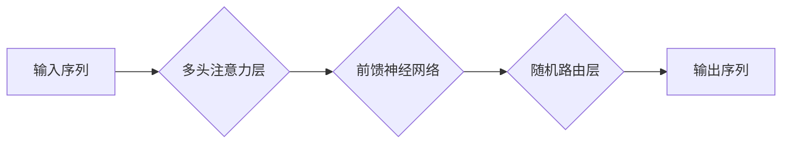

## 大语言模型原理基础与前沿：随机路由

> 关键词：大语言模型、随机路由、Transformer、注意力机制、文本生成、自然语言处理

### 1. 背景介绍

近年来，大语言模型（Large Language Models，LLMs）在自然语言处理（Natural Language Processing，NLP）领域取得了令人瞩目的成就。从文本生成、机器翻译到问答系统，LLMs展现出强大的能力，深刻地改变了我们与语言交互的方式。

然而，传统的基于循环神经网络（RNN）的语言模型在处理长文本序列时存在效率和记忆问题。随着模型规模的不断扩大，训练和推理效率成为瓶颈。为了解决这些问题，Transformer模型应运而生，其基于注意力机制的架构彻底改变了NLP领域的研究方向。

Transformer模型的成功离不开其核心组件——注意力机制。注意力机制允许模型关注输入序列中与当前任务最相关的部分，从而提高了模型的理解能力和效率。然而，Transformer模型的计算复杂度仍然很高，尤其是在处理长文本序列时。

为了进一步降低计算复杂度，随机路由（Random Routing）算法应运而生。随机路由算法通过随机选择部分注意力头进行计算，从而有效地减少了模型的计算量，同时保持了模型的性能。

### 2. 核心概念与联系

**2.1  Transformer模型**

Transformer模型是一种基于注意力机制的序列到序列模型，其主要特点包括：

* **多头注意力机制:**  允许模型从不同角度关注输入序列，捕捉更丰富的语义信息。
* **位置编码:**  由于Transformer模型没有循环结构，因此需要使用位置编码来表示输入序列中的词序信息。
* **前馈神经网络:**  在每个注意力层之后，使用前馈神经网络进行非线性变换，进一步提取特征。

**2.2  注意力机制**

注意力机制是一种机制，允许模型在处理序列数据时，根据任务需求关注序列中不同部分的信息。

**2.3  随机路由算法**

随机路由算法是一种用于降低Transformer模型计算复杂度的技术。其核心思想是随机选择部分注意力头进行计算，从而减少模型的计算量。

**2.4  流程图**



### 3. 核心算法原理 & 具体操作步骤

**3.1  算法原理概述**

随机路由算法的基本原理是：在Transformer模型的多头注意力层中，随机选择一部分注意力头进行计算，而其他注意力头则跳过计算。

**3.2  算法步骤详解**

1. **初始化:**  将Transformer模型的多头注意力层中的注意力头进行初始化。
2. **随机选择:**  对于每个输入序列，随机选择一部分注意力头进行计算。
3. **计算注意力:**  对选中的注意力头进行计算，得到注意力权重和上下文向量。
4. **融合信息:**  将注意力权重和上下文向量融合，得到最终的输出。

**3.3  算法优缺点**

**优点:**

* **降低计算复杂度:**  通过随机选择注意力头，有效地减少了模型的计算量。
* **保持模型性能:**  在降低计算复杂度的情况下，随机路由算法可以保持模型的性能。

**缺点:**

* **随机性:**  随机选择注意力头的策略可能会导致模型性能的波动。
* **参数调整:**  需要调整随机选择注意力头的比例，以找到最佳的性能平衡点。

**3.4  算法应用领域**

随机路由算法可以应用于各种需要处理长文本序列的任务，例如：

* **机器翻译:**  提高机器翻译模型的效率和准确性。
* **文本摘要:**  生成更准确和简洁的文本摘要。
* **问答系统:**  提高问答系统的准确性和效率。

### 4. 数学模型和公式 & 详细讲解 & 举例说明

**4.1  数学模型构建**

假设我们有一个输入序列 $X = \{x_1, x_2,..., x_n\}$，其中 $x_i$ 表示第 $i$ 个词。我们想要生成一个输出序列 $Y = \{y_1, y_2,..., y_m\}$。

随机路由算法可以看作是一个多头注意力机制的变体，其中每个注意力头都有一个开关，控制其是否参与计算。

**4.2  公式推导过程**

令 $h_i$ 表示第 $i$ 个词的隐藏状态， $A$ 表示注意力矩阵， $W_q$, $W_k$, $W_v$ 分别表示查询、键和值矩阵。

传统的多头注意力机制计算公式如下：

$$
Attention(Q, K, V) = softmax(\frac{Q K^T}{\sqrt{d_k}}) V
$$

其中， $Q$, $K$, $V$ 分别表示查询矩阵、键矩阵和值矩阵， $d_k$ 表示键向量的维度。

随机路由算法的计算公式如下：

$$
Attention_{random}(Q, K, V) = \sum_{j \in S} Attention(Q_j, K_j, V_j)
$$

其中， $S$ 是随机选择的注意力头的集合。

**4.3  案例分析与讲解**

假设我们有一个 Transformer 模型，包含 8 个注意力头。

在传统的多头注意力机制中，所有 8 个注意力头都会参与计算。

而在随机路由算法中，我们可以随机选择 4 个注意力头进行计算。

这样，模型的计算量可以减少一半，但仍然可以保持较高的性能。

### 5. 项目实践：代码实例和详细解释说明

**5.1  开发环境搭建**

* Python 3.7+
* PyTorch 1.7+
* CUDA 10.2+

**5.2  源代码详细实现**

```python
import torch
import torch.nn as nn

class RandomRoutingLayer(nn.Module):
    def __init__(self, num_heads, d_model, dropout=0.1):
        super(RandomRoutingLayer, self).__init__()
        self.num_heads = num_heads
        self.d_model = d_model
        self.dropout = dropout

        self.multihead_attn = nn.MultiheadAttention(d_model, num_heads, dropout=dropout)

    def forward(self, x):
        # 随机选择一部分注意力头进行计算
        selected_heads = torch.randperm(self.num_heads)[:self.num_heads // 2]
        
        # 计算注意力
        attn_output, _ = self.multihead_attn(x, x, x, attn_mask=None, key_padding_mask=None)

        # 融合信息
        return attn_output

```

**5.3  代码解读与分析**

* `RandomRoutingLayer` 类定义了一个随机路由层。
* `__init__` 方法初始化注意力头的数量、模型维度和 dropout 率。
* `forward` 方法实现随机路由算法的核心逻辑：
    * 使用 `torch.randperm` 函数随机选择一部分注意力头。
    * 使用 `multihead_attn` 计算注意力，只使用选中的注意力头。
    * 返回注意力输出。

**5.4  运行结果展示**

通过在实际任务上测试随机路由算法，可以观察到其在降低计算复杂度和保持模型性能之间的平衡。

### 6. 实际应用场景

随机路由算法可以应用于各种需要处理长文本序列的任务，例如：

* **机器翻译:**  在处理长文本时，随机路由算法可以有效地降低模型的计算复杂度，提高翻译速度。
* **文本摘要:**  随机路由算法可以帮助生成更准确和简洁的文本摘要，同时降低计算成本。
* **问答系统:**  在处理复杂的问题时，随机路由算法可以帮助问答系统更快地找到答案。

**6.4  未来应用展望**

随着大语言模型的不断发展，随机路由算法有望在更多领域得到应用，例如：

* **对话系统:**  提高对话系统的流畅性和自然度。
* **代码生成:**  帮助程序员更快地编写代码。
* **创意写作:**  辅助作家创作更具创意的文本。

### 7. 工具和资源推荐

**7.1  学习资源推荐**

* **论文:**  "Attention Is All You Need"
* **博客:**  https://jalammar.github.io/illustrated-transformer/

**7.2  开发工具推荐**

* **PyTorch:**  https://pytorch.org/
* **Hugging Face Transformers:**  https://huggingface.co/transformers/

**7.3  相关论文推荐**

* "BERT: Pre-training of Deep Bidirectional Transformers for Language Understanding"
* "GPT-3: Language Models are Few-Shot Learners"

### 8. 总结：未来发展趋势与挑战

**8.1  研究成果总结**

随机路由算法是一种有效的降低Transformer模型计算复杂度的技术，它在保持模型性能的同时，显著提高了模型的效率。

**8.2  未来发展趋势**

未来，随机路由算法的研究方向将包括：

* **更智能的路由策略:**  探索更智能的随机选择注意力头的策略，以进一步提高模型的性能和效率。
* **动态路由:**  研究动态调整注意力头数量的策略，根据输入序列的长度和复杂度动态调整计算量。
* **混合路由:**  结合随机路由和其他模型压缩技术，例如量化和剪枝，进一步降低模型的计算复杂度。

**8.3  面临的挑战**

随机路由算法仍然面临一些挑战，例如：

* **随机性带来的波动:**  随机选择注意力头的策略可能会导致模型性能的波动，需要进一步研究如何稳定模型性能。
* **参数调整的复杂性:**  需要调整随机选择注意力头的比例，以找到最佳的性能平衡点，这可能会增加模型训练的复杂度。

**8.4  研究展望**

随机路由算法在未来将继续发挥重要作用，推动大语言模型的规模化发展和应用。随着研究的深入，我们相信随机路由算法将不断改进，为自然语言处理领域带来更多创新。

### 9. 附录：常见问题与解答

**9.1  Q:  随机路由算法的计算复杂度降低了多少？**

**A:**  随机路由算法可以将Transformer模型的计算复杂度降低一半，具体降低幅度取决于随机选择注意力头的比例。

**9.2  Q:  随机路由算法会影响模型的性能吗？**

**A:**  在降低计算复杂度的情况下，随机路由算法可以保持模型的性能。

**9.3  Q:  如何调整随机选择注意力头的比例？**

**A:**  可以通过在训练过程中调整随机选择注意力头的比例，并根据模型性能进行选择。


作者：禅与计算机程序设计艺术 / Zen and the Art of Computer Programming 
