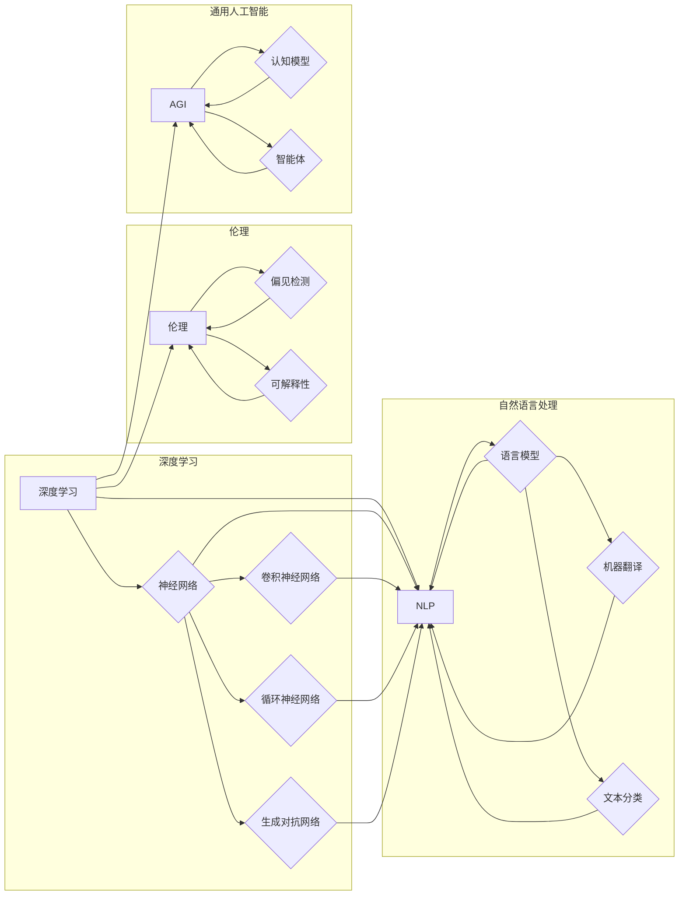

# Andrej Karpathy：人工智能的未来挑战

> 关键词：Andrej Karpathy，人工智能，深度学习，未来挑战，NLP，自动驾驶，伦理，通用人工智能

## 1. 背景介绍

Andrej Karpathy，Google Brain的前研究科学家，以其在自然语言处理（NLP）和深度学习领域的贡献而闻名。他的博客和文章经常引发对人工智能未来挑战的深刻思考。本文将基于Karpathy的观点，探讨人工智能领域面临的挑战，并展望其未来发展方向。

### 1.1 人工智能的崛起

近年来，随着深度学习的兴起，人工智能（AI）在多个领域取得了显著的进展。从图像识别到语言翻译，从游戏到自动驾驶，AI的应用无处不在。然而，随着技术的进步，我们也面临着一系列的挑战，需要认真思考和应对。

### 1.2 Karpathy的观点

Karpathy在他的文章中提出，尽管AI取得了巨大的成功，但仍然存在许多挑战，包括：

- **理解与解释**：AI模型的决策过程往往是不透明的，这引发了对其可靠性和可信度的担忧。
- **伦理与偏见**：AI系统可能会放大和传播数据中的偏见，对公平性和公正性构成威胁。
- **通用人工智能**：实现能够执行人类智能任务的通用人工智能（AGI）仍然是AI研究中的一个长期目标。
- **资源消耗**：训练大规模AI模型需要巨大的计算资源，这对环境造成了压力。

## 2. 核心概念与联系

### 2.1 核心概念原理

以下是人工智能领域的一些核心概念及其相互联系：



### 2.2 架构联系

这些概念在人工智能的架构中相互关联，共同构成了一个复杂而庞大的生态系统。例如，深度学习是NLP和图像识别等领域的核心技术；伦理和AGI是AI研究的终极目标，影响和指导整个领域的发展。

## 3. 核心算法原理 & 具体操作步骤

### 3.1 算法原理概述

人工智能的核心算法包括：

- **深度学习**：通过多层神经网络对数据进行学习，以实现复杂的特征提取和模式识别。
- **自然语言处理**：使用深度学习技术处理和理解自然语言数据。
- **自动驾驶**：结合计算机视觉、传感器数据处理和决策控制技术，实现无人驾驶汽车。

### 3.2 算法步骤详解

以下是一个简单的自动驾驶算法步骤：

1. 数据采集：使用摄像头、雷达等传感器收集道路、车辆和环境信息。
2. 数据处理：对采集到的数据进行预处理，如图像识别、目标检测等。
3. 决策控制：根据处理后的数据，使用机器学习模型做出行驶决策。
4. 执行操作：控制车辆执行相应的行驶动作。

### 3.3 算法优缺点

深度学习算法在图像识别、语音识别等任务上取得了显著成果，但存在以下缺点：

- **数据依赖**：需要大量标注数据进行训练。
- **模型复杂**：模型参数众多，训练和推理过程耗时。
- **可解释性差**：模型的决策过程难以解释。

### 3.4 算法应用领域

深度学习算法在以下领域应用广泛：

- **图像识别**：如人脸识别、物体检测等。
- **语音识别**：如语音转文本、语音合成等。
- **自然语言处理**：如机器翻译、情感分析等。
- **自动驾驶**：如车辆检测、路径规划等。

## 4. 数学模型和公式 & 详细讲解 & 举例说明

### 4.1 数学模型构建

深度学习中的核心数学模型是神经网络。以下是一个简单的神经网络结构：

$$
y = f(W_1 \cdot x_1 + b_1 + W_2 \cdot x_2 + b_2 + ... + W_n \cdot x_n + b_n)
$$

其中 $W$ 是权重，$x$ 是输入，$b$ 是偏置，$f$ 是激活函数。

### 4.2 公式推导过程

以下是一个感知机（Perceptron）的推导过程：

假设我们有一个线性可分的数据集，目标是找到一个直线 $w \cdot x + b = 0$ 将数据集划分为两类。

首先，计算权重 $w$：

$$
w = \frac{y_i (x_i - x_{\text{mean}})}{y_{\text{mean}}}
$$

其中 $x_i$ 是样本，$y_i$ 是标签，$x_{\text{mean}}$ 是所有样本的均值，$y_{\text{mean}}$ 是所有样本标签的均值。

然后，计算偏置 $b$：

$$
b = -\frac{w \cdot x_{\text{mean}}}{y_{\text{mean}}}
$$

最终，得到感知机的公式：

$$
y = w \cdot x + b
```

### 4.3 案例分析与讲解

以下是一个使用神经网络进行图像分类的案例：

1. **数据准备**：收集一个包含不同类别图像的数据集，如MNIST手写数字数据集。
2. **模型构建**：构建一个简单的卷积神经网络，包括卷积层、池化层和全连接层。
3. **模型训练**：使用训练数据集对模型进行训练，调整权重和偏置。
4. **模型评估**：使用测试数据集评估模型性能，计算分类准确率。

## 5. 项目实践：代码实例和详细解释说明

### 5.1 开发环境搭建

以下是一个使用TensorFlow和Keras构建图像分类模型的Python代码示例：

```python
import tensorflow as tf
from tensorflow.keras.models import Sequential
from tensorflow.keras.layers import Conv2D, MaxPooling2D, Flatten, Dense

# 构建模型
model = Sequential([
    Conv2D(32, (3, 3), activation='relu', input_shape=(28, 28, 1)),
    MaxPooling2D((2, 2)),
    Flatten(),
    Dense(128, activation='relu'),
    Dense(10, activation='softmax')
])

# 编译模型
model.compile(optimizer='adam', loss='sparse_categorical_crossentropy', metrics=['accuracy'])

# 训练模型
model.fit(train_images, train_labels, epochs=5)

# 评估模型
test_loss, test_acc = model.evaluate(test_images, test_labels)
print('Test accuracy:', test_acc)
```

### 5.2 源代码详细实现

上述代码中，我们首先导入了TensorFlow和Keras库，然后构建了一个简单的卷积神经网络模型。模型包括两个卷积层、两个池化层、一个全连接层和输出层。我们使用Adam优化器进行模型训练，并使用交叉熵损失函数评估模型性能。

### 5.3 代码解读与分析

- `Conv2D`：卷积层，用于提取图像特征。
- `MaxPooling2D`：池化层，用于降低特征的空间维度。
- `Flatten`：将多维特征展平为一维向量。
- `Dense`：全连接层，用于分类任务。
- `compile`：编译模型，设置优化器、损失函数和评估指标。
- `fit`：训练模型。
- `evaluate`：评估模型。

### 5.4 运行结果展示

运行上述代码后，我们可以在控制台看到模型的训练和评估结果，包括测试准确率等信息。

## 6. 实际应用场景

### 6.1 自动驾驶

自动驾驶是AI技术的重要应用场景之一。通过结合计算机视觉、传感器数据处理和决策控制技术，自动驾驶汽车可以自主感知环境、规划路径并控制车辆行驶。

### 6.2 自然语言处理

自然语言处理是AI技术的另一个重要应用场景。通过使用深度学习技术，我们可以构建能够理解和生成自然语言的模型，如机器翻译、情感分析、文本摘要等。

### 6.3 机器人

机器人技术可以利用AI技术实现更加智能的行为，如路径规划、物体识别、人机交互等。

## 7. 工具和资源推荐

### 7.1 学习资源推荐

- 《深度学习》（Ian Goodfellow、Yoshua Bengio、Aaron Courville 著）：深度学习领域的经典教材。
- 《Python机器学习》（Sebastian Raschka 著）：Python机器学习实践指南。
- 《自然语言处理实战》（Sahil Sukhija 著）：自然语言处理实践指南。

### 7.2 开发工具推荐

- TensorFlow：Google开源的深度学习框架。
- PyTorch：Facebook开源的深度学习框架。
- Keras：基于Theano和TensorFlow的Python深度学习库。

### 7.3 相关论文推荐

- "ImageNet Classification with Deep Convolutional Neural Networks"（Alex Krizhevsky et al., 2012）：图像识别领域的经典论文。
- "A Neural Probabilistic Language Model"（Bengio et al., 2003）：自然语言处理领域的经典论文。
- "Playing Atari with Deep Reinforcement Learning"（Vinyals et al., 2015）：深度强化学习的经典论文。

## 8. 总结：未来发展趋势与挑战

### 8.1 研究成果总结

本文从Andrej Karpathy的角度出发，探讨了人工智能领域面临的挑战和未来发展趋势。通过对核心算法、应用场景和工具资源的介绍，本文为读者提供了对人工智能领域的全面了解。

### 8.2 未来发展趋势

人工智能的未来发展趋势包括：

- **更强大的模型**：随着计算能力的提升，我们将能够训练更加复杂的模型，以实现更高级的任务。
- **更高效的学习算法**：开发更加高效的学习算法，以降低训练成本和时间。
- **更广泛的跨学科应用**：人工智能技术将在更多领域得到应用，如医疗、教育、交通等。
- **更加公平和可解释的AI**：开发更加公平和可解释的AI系统，以增强公众对AI技术的信任。

### 8.3 面临的挑战

人工智能面临的挑战包括：

- **数据隐私和安全**：如何保护用户数据隐私和安全，防止数据滥用。
- **偏见和歧视**：如何防止AI系统放大和传播数据中的偏见。
- **伦理和责任**：如何明确AI系统的责任，以及在出现问题时如何追溯责任。
- **通用人工智能**：如何实现能够执行人类智能任务的通用人工智能。

### 8.4 研究展望

为了应对这些挑战，我们需要：

- 加强跨学科合作，推动人工智能领域的创新。
- 制定相应的法律法规，规范人工智能的发展。
- 加强对AI技术的教育和培训，提高公众对AI技术的理解。
- 推动AI技术的伦理研究和实践，确保AI技术的可持续发展。

## 9. 附录：常见问题与解答

**Q1：什么是深度学习？**

A：深度学习是一种通过多层神经网络对数据进行学习的技术，以实现复杂的特征提取和模式识别。

**Q2：什么是自然语言处理？**

A：自然语言处理（NLP）是人工智能的一个分支，旨在使计算机能够理解、解释和生成人类语言。

**Q3：什么是自动驾驶？**

A：自动驾驶是指汽车能够在没有人类驾驶员干预的情况下自主行驶。

**Q4：什么是通用人工智能？**

A：通用人工智能（AGI）是指能够执行人类智能任务的智能系统。

**Q5：人工智能有哪些应用场景？**

A：人工智能的应用场景包括图像识别、自然语言处理、自动驾驶、机器人、医疗等。

作者：禅与计算机程序设计艺术 / Zen and the Art of Computer Programming