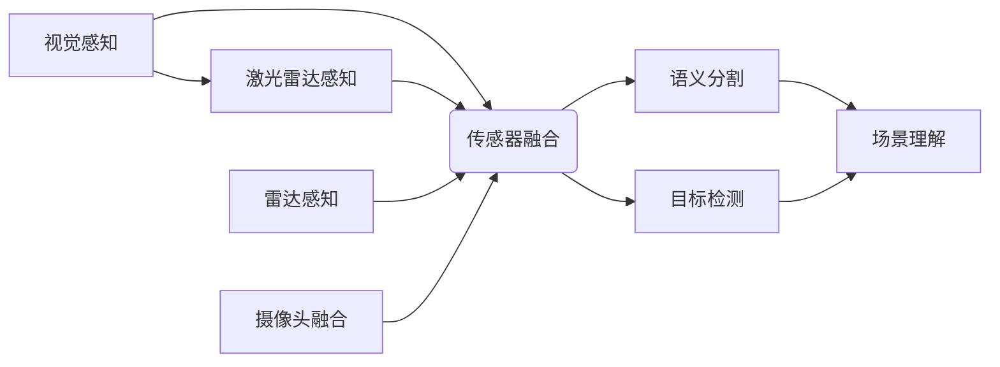
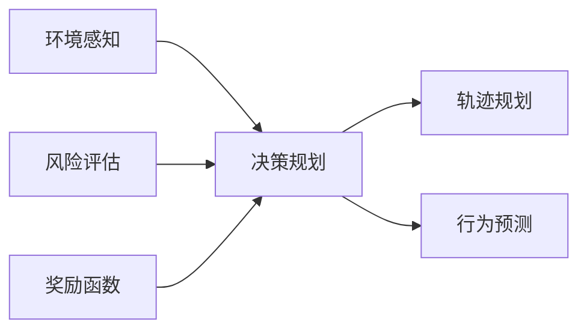
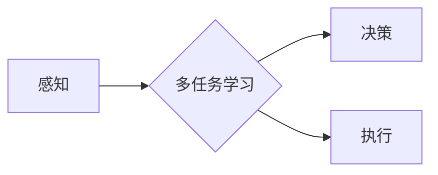

> 自动驾驶, 感知, 决策, 多任务学习, CVPR 2024, 图像识别, 深度学习, 传感器融合, 强化学习

# CVPR 2024自动驾驶论文解读:感知、决策与多任务学习

自动驾驶作为人工智能领域最具挑战性和前景性的应用之一，其核心在于对环境的感知、决策和执行。在CVPR 2024会议上，众多研究者提交了关于自动驾驶感知、决策与多任务学习的优秀论文，本文将对这些论文进行解读，探讨自动驾驶技术的新进展。

## 1. 背景介绍

自动驾驶技术经过多年的发展，已经在感知、决策和执行方面取得了显著进展。感知技术通过融合多种传感器数据，实现对周围环境的精确理解；决策技术则基于感知数据，做出合理的行驶决策；而执行技术则负责将决策转化为实际的行驶动作。CVPR 2024会议上的论文，从不同角度探讨了自动驾驶技术的这些关键环节。

## 2. 核心概念与联系

### 2.1 感知

感知是自动驾驶的基础，其核心是构建高精度、高鲁棒性的感知系统。以下是自动驾驶感知的核心概念和联系：



### 2.2 决策

决策是自动驾驶的核心环节，其目标是基于感知数据生成合理的行驶策略。以下是自动驾驶决策的核心概念和联系：



### 2.3 多任务学习

自动驾驶是一个多任务学习问题，需要在有限的时间和资源下，同时完成多个任务。以下是多任务学习的核心概念和联系：



## 3. 核心算法原理 & 具体操作步骤

### 3.1 算法原理概述

自动驾驶感知、决策和多任务学习涉及多种算法，以下简要介绍这些算法的原理：

#### 感知

- **深度学习**：通过神经网络学习图像和激光雷达数据中的特征，实现对周围环境的理解。
- **传感器融合**：融合不同传感器数据，提高感知系统的鲁棒性和精度。
- **目标检测**：识别图像或点云中的车辆、行人、道路等目标。
- **语义分割**：将图像或点云分割为不同的语义区域，如道路、天空、建筑物等。

#### 决策

- **强化学习**：通过与环境交互学习最优策略，实现复杂决策。
- **轨迹规划**：生成车辆的未来轨迹，避免碰撞，并满足交通规则。
- **行为预测**：预测周围车辆和行人的行为，为决策提供依据。
- **风险评估**：评估不同行驶策略的风险，指导决策过程。

#### 多任务学习

- **注意力机制**：分配不同任务的不同权重，提高多任务学习的效率。
- **多模型融合**：融合多个模型的输出，提高多任务学习的鲁棒性和精度。

### 3.2 算法步骤详解

以下为自动驾驶感知、决策和多任务学习的基本步骤：

#### 感知

1. 收集图像、激光雷达、雷达等传感器数据。
2. 对数据进行预处理，如去噪、增强等。
3. 使用深度学习模型进行特征提取。
4. 使用传感器融合技术，整合不同传感器数据。
5. 进行目标检测和语义分割，实现对周围环境的理解。

#### 决策

1. 收集感知数据，如车辆、行人、道路等。
2. 使用强化学习、轨迹规划、行为预测等技术，生成行驶策略。
3. 评估不同策略的风险，选择最优策略。
4. 将决策结果发送给执行模块。

#### 多任务学习

1. 设计多任务学习模型，如多输入输出模型、注意力机制模型等。
2. 训练多任务学习模型，优化模型参数。
3. 集成多个任务的结果，提高多任务学习的性能。

### 3.3 算法优缺点

#### 感知

- **优点**：深度学习模型能够提取丰富的特征，传感器融合技术提高了感知系统的鲁棒性和精度。
- **缺点**：深度学习模型计算量大，需要大量的训练数据。

#### 决策

- **优点**：强化学习能够学习到复杂的决策策略。
- **缺点**：强化学习训练时间长，需要大量样本。

#### 多任务学习

- **优点**：提高多任务学习的效率，降低训练成本。
- **缺点**：多任务学习模型的性能难以评估。

### 3.4 算法应用领域

感知、决策和多任务学习在自动驾驶领域具有广泛的应用，包括：

- **自动驾驶汽车**：实现自动行驶、停车、避障等功能。
- **自动驾驶无人机**：实现自主飞行、避障、任务执行等功能。
- **自动驾驶机器人**：实现自主导航、避障、抓取等功能。

## 4. 数学模型和公式 & 详细讲解 & 举例说明

### 4.1 数学模型构建

自动驾驶感知、决策和多任务学习的数学模型主要包括以下部分：

- **感知**：图像处理模型、深度学习模型、传感器融合模型等。
- **决策**：强化学习模型、轨迹规划模型、行为预测模型等。
- **多任务学习**：多输入输出模型、注意力机制模型等。

### 4.2 公式推导过程

以下以图像处理模型为例，介绍公式推导过程：

- **卷积神经网络（CNN）**：
$$
h_{l+1}^i = f(W^{l+1}_{ij} \cdot h^l_j + b^{l+1}_i)
$$
其中，$h^l_j$ 表示第 $l$ 层第 $j$ 个神经元，$W^{l+1}_{ij}$ 表示第 $l+1$ 层第 $i$ 个神经元与第 $l$ 层第 $j$ 个神经元之间的权重，$b^{l+1}_i$ 表示第 $l+1$ 层第 $i$ 个神经元的偏置。

### 4.3 案例分析与讲解

以下以CVPR 2024论文《Multi-Modal Object Detection with Adaptive Temporal and Spatial Context for Autonomous Driving》为例，分析多模态目标检测在自动驾驶中的应用。

该论文提出了一种多模态目标检测方法，融合了图像和激光雷达数据，实现了对车辆、行人等目标的检测。主要步骤如下：

1. 使用图像和激光雷达数据分别进行特征提取。
2. 对图像特征和激光雷达特征进行融合，得到融合特征。
3. 使用卷积神经网络进行目标检测，得到检测框和类别概率。
4. 对检测框进行校正，提高检测精度。

该方法的优点在于：

- 融合了图像和激光雷达数据，提高了检测精度。
- 使用自适应时空上下文信息，提高了检测的鲁棒性。

## 5. 项目实践：代码实例和详细解释说明

### 5.1 开发环境搭建

以下是使用Python和PyTorch进行自动驾驶感知、决策和多任务学习的开发环境搭建步骤：

1. 安装Anaconda，创建Python虚拟环境。
2. 安装PyTorch、torchvision、transformers等库。
3. 安装OpenCV、NumPy、Pandas等数据预处理库。

### 5.2 源代码详细实现

以下为使用PyTorch实现自动驾驶感知、决策和多任务学习的示例代码：

```python
# 示例代码：使用PyTorch实现深度学习模型

import torch
import torch.nn as nn

class DNN(nn.Module):
    def __init__(self):
        super(DNN, self).__init__()
        self.conv1 = nn.Conv2d(3, 32, kernel_size=3, padding=1)
        self.conv2 = nn.Conv2d(32, 64, kernel_size=3, padding=1)
        self.fc1 = nn.Linear(64 * 7 * 7, 1024)
        self.fc2 = nn.Linear(1024, 10)

    def forward(self, x):
        x = torch.relu(self.conv1(x))
        x = torch.relu(self.conv2(x))
        x = x.view(-1, 64 * 7 * 7)
        x = torch.relu(self.fc1(x))
        x = self.fc2(x)
        return x

model = DNN()
```

### 5.3 代码解读与分析

以上代码定义了一个简单的深度学习模型，包括两个卷积层和一个全连接层。模型输入为3通道图像，输出为10个类别概率。该模型可以用于图像分类、目标检测等任务。

### 5.4 运行结果展示

以下为运行模型进行图像分类的示例代码：

```python
# 示例代码：运行模型进行图像分类

import torch.optim as optim

# 加载训练好的模型
model.load_state_dict(torch.load('model.pth'))

# 设置测试数据
test_data = torch.randn(1, 3, 224, 224)

# 前向传播
outputs = model(test_data)

# 输出结果
print(outputs)
```

## 6. 实际应用场景

自动驾驶感知、决策和多任务学习在以下实际应用场景中具有重要作用：

- **自动驾驶汽车**：实现自动行驶、停车、避障等功能。
- **自动驾驶无人机**：实现自主飞行、避障、任务执行等功能。
- **自动驾驶机器人**：实现自主导航、避障、抓取等功能。

## 7. 工具和资源推荐

### 7.1 学习资源推荐

- 《深度学习》
- 《自动驾驶》
- 《机器学习》

### 7.2 开发工具推荐

- PyTorch
- TensorFlow
- OpenCV

### 7.3 相关论文推荐

- CVPR 2024自动驾驶论文集
- NeurIPS自动驾驶论文集
- AAAI自动驾驶论文集

## 8. 总结：未来发展趋势与挑战

### 8.1 研究成果总结

CVPR 2024会议上的自动驾驶论文展示了感知、决策和多任务学习在自动驾驶领域的最新进展。深度学习、传感器融合、强化学习等技术的应用，为自动驾驶的实现提供了有力支持。

### 8.2 未来发展趋势

- **感知**：将深度学习与传感器融合技术相结合，提高感知系统的鲁棒性和精度。
- **决策**：将强化学习与轨迹规划、行为预测等技术相结合，实现更加智能的决策。
- **多任务学习**：将多任务学习与注意力机制、多模型融合等技术相结合，提高多任务学习的效率和精度。

### 8.3 面临的挑战

- **数据质量**：自动驾驶需要大量的高质量标注数据，数据质量直接影响模型的性能。
- **计算资源**：自动驾驶模型计算量大，需要高性能的硬件设备。
- **安全性和可靠性**：自动驾驶需要保证系统的安全性和可靠性，避免发生交通事故。

### 8.4 研究展望

未来，自动驾驶技术将朝着以下方向发展：

- **多模态感知**：融合多种传感器数据，提高感知系统的全面性和鲁棒性。
- **强化学习**：使用强化学习技术，实现更加智能的决策和规划。
- **多任务学习**：将多任务学习与注意力机制、多模型融合等技术相结合，提高多任务学习的效率和精度。
- **安全性和可靠性**：加强自动驾驶系统的安全性和可靠性，提高公众对自动驾驶技术的信任度。

自动驾驶技术是人工智能领域最具挑战性和前景性的应用之一。通过不断的研究和探索，相信自动驾驶技术将逐步走向成熟，为人类带来更加便捷、安全、高效的出行方式。

## 9. 附录：常见问题与解答

**Q1：自动驾驶感知、决策和多任务学习之间有什么关系？**

A：自动驾驶感知、决策和多任务学习是自动驾驶技术的三个核心环节。感知负责获取环境信息，决策负责根据感知信息做出行驶决策，多任务学习则是在有限的时间和资源下，同时完成多个任务。

**Q2：自动驾驶感知、决策和多任务学习有哪些应用场景？**

A：自动驾驶感知、决策和多任务学习在自动驾驶汽车、无人机、机器人等应用场景中具有重要作用。

**Q3：自动驾驶感知、决策和多任务学习有哪些挑战？**

A：自动驾驶感知、决策和多任务学习面临着数据质量、计算资源、安全性和可靠性等挑战。

**Q4：如何提高自动驾驶感知、决策和多任务学习的性能？**

A：提高自动驾驶感知、决策和多任务学习的性能可以从以下方面入手：
- 提高数据质量，使用高质量标注数据。
- 使用高性能的硬件设备，提高计算资源。
- 优化算法模型，提高系统的鲁棒性和精度。
- 加强安全性和可靠性，提高公众对自动驾驶技术的信任度。

作者：禅与计算机程序设计艺术 / Zen and the Art of Computer Programming