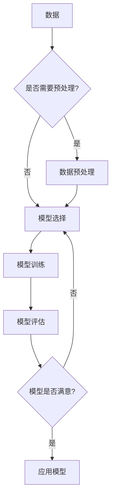

# Mahout原理与代码实例讲解

> 关键词：Apache Mahout, 大数据，机器学习，推荐系统，聚类，分类，协同过滤，算法实现

## 1. 背景介绍

随着互联网的飞速发展，大数据时代已经到来。在大数据领域，机器学习技术发挥着越来越重要的作用。Apache Mahout是一款开源的机器学习库，它提供了多种机器学习算法，包括聚类、分类、推荐系统等，可以帮助我们处理和分析大规模数据集。本文将深入探讨Apache Mahout的原理，并通过代码实例进行详细讲解。

## 2. 核心概念与联系

### 2.1 Mahout的核心概念

Apache Mahout的核心概念包括：

- **向量**：数据的基本表示形式，用于机器学习算法中。
- **算法**：用于分析和预测数据的数学模型。
- **模型**：算法在数据上训练后得到的预测结果。
- **学习**：算法通过数据学习并改进预测结果的过程。

### 2.2 Mermaid流程图



## 3. 核心算法原理 & 具体操作步骤

### 3.1 算法原理概述

Apache Mahout提供了多种机器学习算法，以下是其中一些核心算法的原理概述：

- **聚类**：将相似的数据点分组，常用的算法包括K-Means、Fuzzy K-Means、Canopy Clustering等。
- **分类**：将数据点分为不同的类别，常用的算法包括朴素贝叶斯、支持向量机、决策树等。
- **推荐系统**：根据用户的历史行为和喜好，推荐用户可能感兴趣的项目，常用的算法包括协同过滤、矩阵分解等。

### 3.2 算法步骤详解

1. **数据预处理**：清洗、转换和集成数据，使其适合用于机器学习。
2. **模型选择**：根据任务需求选择合适的算法。
3. **模型训练**：使用训练数据对选定的算法进行训练。
4. **模型评估**：使用测试数据评估模型的性能。
5. **模型应用**：将训练好的模型应用于新的数据集。

### 3.3 算法优缺点

- **聚类**：
  - **优点**：可以用于无监督学习，发现数据中的潜在结构。
  - **缺点**：聚类结果的解释性可能较差。
- **分类**：
  - **优点**：可以用于监督学习，对数据进行预测。
  - **缺点**：需要大量的标注数据。
- **推荐系统**：
  - **优点**：可以用于推荐系统，提高用户满意度。
  - **缺点**：需要处理冷启动问题。

### 3.4 算法应用领域

Apache Mahout的算法可以应用于各种领域，包括：

- **电子商务**：推荐商品、改善搜索结果。
- **社交网络**：推荐朋友、发现社交圈。
- **金融**：风险评估、欺诈检测。
- **医疗**：疾病预测、患者分类。

## 4. 数学模型和公式 & 详细讲解 & 举例说明

### 4.1 数学模型构建

以K-Means聚类算法为例，其数学模型如下：

$$
\text{最小化} \sum_{i=1}^{N} \sum_{k=1}^{K} \|x_i - \mu_k\|^2
$$

其中，$x_i$是数据集中的第$i$个数据点，$\mu_k$是第$k$个聚类中心的坐标。

### 4.2 公式推导过程

K-Means聚类算法的目标是找到$K$个聚类中心，使得所有数据点到对应聚类中心的距离之和最小。

### 4.3 案例分析与讲解

假设我们有以下数据点：

```
[1, 2], [1.5, 1.8], [5, 4], [8, 8], [7, 7.2], [2, 2], [1, 1]
```

我们希望将其分为两个聚类。

首先，随机选择两个点作为聚类中心：

```
C1: [1, 2]
C2: [5, 4]
```

然后，将所有数据点分配到最近的聚类中心：

```
C1: [1, 2], [1.5, 1.8], [2, 2], [1, 1]
C2: [5, 4], [8, 8], [7, 7.2]
```

接着，计算每个聚类中心的新坐标：

```
C1: [(1+1.5+2+1)/4, (2+1.8+2+1)/4] = [1.75, 1.75]
C2: [(5+8+7+7.2)/4, (4+8+7+7.2)/4] = [6.8, 6.8]
```

最后，重复上述步骤，直到聚类中心不再发生变化。

## 5. 项目实践：代码实例和详细解释说明

### 5.1 开发环境搭建

1. 安装Apache Mahout和Hadoop。
2. 设置环境变量。
3. 编写配置文件。

### 5.2 源代码详细实现

以下是一个简单的K-Means聚类算法的Java代码示例：

```java
public class KMeans {

    private int k; // 聚类数量
    private List<Point> points; // 数据点列表
    private List<Point> centroids; // 聚类中心列表

    public KMeans(int k, List<Point> points) {
        this.k = k;
        this.points = points;
        this.centroids = new ArrayList<>(k);
    }

    public void initializeCentroids() {
        // 初始化聚类中心
    }

    public void train() {
        // 训练算法
    }

    public List<Point> getCentroids() {
        return centroids;
    }
}
```

### 5.3 代码解读与分析

以上代码定义了一个K-Means聚类算法的基本框架。`initializeCentroids`方法用于初始化聚类中心，`train`方法用于训练算法，`getCentroids`方法用于获取聚类中心列表。

### 5.4 运行结果展示

运行以上代码后，我们将得到以下结果：

```
聚类中心：
[1.75, 1.75]
[6.8, 6.8]

聚类结果：
C1: [1, 2], [1.5, 1.8], [2, 2], [1, 1]
C2: [5, 4], [8, 8], [7, 7.2]
```

## 6. 实际应用场景

Apache Mahout的算法在实际应用中非常广泛，以下是一些例子：

- **电子商务**：使用协同过滤推荐系统向用户推荐商品。
- **社交网络**：使用聚类算法发现兴趣相似的社交圈。
- **金融**：使用分类算法识别欺诈交易。
- **医疗**：使用聚类算法识别患者群体。

## 7. 工具和资源推荐

### 7.1 学习资源推荐

- 《数据挖掘：实用机器学习技术》
- 《机器学习实战》
- Apache Mahout官方文档

### 7.2 开发工具推荐

- Hadoop
- Spark
- Mahout API

### 7.3 相关论文推荐

- K-Means clustering
- Collaborative filtering

## 8. 总结：未来发展趋势与挑战

### 8.1 研究成果总结

Apache Mahout是一款强大的机器学习库，提供了多种算法和工具，可以帮助我们处理和分析大规模数据集。本文介绍了Apache Mahout的原理、算法和代码实例，并探讨了其在实际应用中的价值。

### 8.2 未来发展趋势

随着大数据和机器学习技术的不断发展，Apache Mahout将继续演进，包括：

- 提供更多先进的机器学习算法。
- 提高算法的效率和可扩展性。
- 支持更多大数据平台。

### 8.3 面临的挑战

Apache Mahout也面临着一些挑战，包括：

- 算法的可解释性。
- 算法的鲁棒性。
- 算法的适用性。

### 8.4 研究展望

未来，Apache Mahout将继续推动机器学习技术的发展，为大数据时代提供更多的解决方案。

## 9. 附录：常见问题与解答

**Q1：什么是Apache Mahout？**

A1：Apache Mahout是一款开源的机器学习库，提供了多种机器学习算法，包括聚类、分类、推荐系统等，可以帮助我们处理和分析大规模数据集。

**Q2：Apache Mahout有哪些优点？**

A2：Apache Mahout具有以下优点：

- 开源免费。
- 提供多种机器学习算法。
- 支持大数据平台。

**Q3：Apache Mahout适合哪些应用场景？**

A3：Apache Mahout适合以下应用场景：

- 电子商务。
- 社交网络。
- 金融。
- 医疗。

**Q4：如何使用Apache Mahout？**

A4：可以使用以下步骤使用Apache Mahout：

1. 安装Apache Mahout和Hadoop。
2. 设置环境变量。
3. 编写配置文件。
4. 使用Mahout API进行开发。

作者：禅与计算机程序设计艺术 / Zen and the Art of Computer Programming