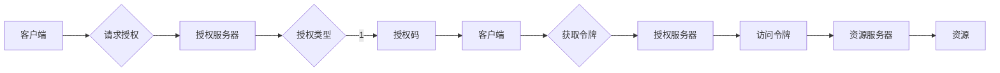

# OAuth 2.0 的实现细节

> 关键词：OAuth 2.0, 认证授权，API安全，授权码流程，客户端安全，资源服务器

## 1. 背景介绍

随着互联网的飞速发展，各种在线服务和应用程序层出不穷。这些应用程序往往需要访问用户的资源，例如社交媒体账号、个人数据等。为了保护用户的隐私和数据安全，同时允许第三方应用程序访问这些资源，OAuth 2.0 应运而生。OAuth 2.0 是一个开放标准，用于授权第三方应用访问服务器资源，而不需要将用户名和密码暴露给第三方。

## 2. 核心概念与联系

OAuth 2.0 的核心概念包括：

- **客户端**：请求访问资源的应用程序。
- **资源所有者**：拥有资源并授权客户端访问的用户。
- **资源服务器**：存储和保护用户资源的服务器。
- **授权服务器**：负责处理授权请求并发放令牌的服务器。

以下是 OAuth 2.0 的架构流程图：



在上述流程中，客户端通过授权服务器请求授权，用户同意后，授权服务器发放授权码给客户端。客户端使用授权码从授权服务器获取访问令牌。最后，客户端使用访问令牌访问资源服务器上的资源。

## 3. 核心算法原理 & 具体操作步骤

### 3.1 算法原理概述

OAuth 2.0 的核心原理是，客户端通过授权服务器获取授权码，再使用授权码换取访问令牌。访问令牌可以用来访问资源服务器上的资源。

### 3.2 算法步骤详解

1. 客户端向授权服务器发送授权请求，包括客户端ID、授权类型、重定向URI等参数。
2. 授权服务器验证客户端的身份和授权类型。
3. 如果客户端身份验证通过，授权服务器将用户重定向到客户端指定的重定向URI，并附上授权码。
4. 用户登录并同意授权。
5. 授权服务器将用户重定向回客户端指定的重定向URI，并附上授权码。
6. 客户端使用授权码向授权服务器请求访问令牌。
7. 授权服务器验证授权码的有效性，并发放访问令牌给客户端。
8. 客户端使用访问令牌访问资源服务器上的资源。

### 3.3 算法优缺点

**优点**：

- 提高了安全性，避免了用户名和密码泄露的风险。
- 客户端无需存储用户凭据，降低了安全风险。
- 适用于各种类型的资源和应用程序。

**缺点**：

- 客户端需要与授权服务器进行交互，增加了复杂度。
- 需要处理授权码和访问令牌的存储和分发。

### 3.4 算法应用领域

OAuth 2.0 在以下领域得到广泛应用：

- 第三方服务集成，例如社交媒体分享。
- 单点登录(Single Sign-On, SSO)。
- RESTful API 访问控制。
- 移动应用授权。

## 4. 数学模型和公式 & 详细讲解 & 举例说明

OAuth 2.0 本身不涉及复杂的数学模型和公式。然而，授权码和访问令牌的生成和验证过程中，通常会使用哈希函数和签名算法。

### 4.1 数学模型构建

OAuth 2.0 中的数学模型主要涉及以下内容：

- **哈希函数**：用于生成授权码和访问令牌的哈希值。
- **签名算法**：用于对授权请求和访问令牌进行签名，以确保其完整性和真实性。

### 4.2 公式推导过程

以下是一个简单的示例，说明如何使用哈希函数生成授权码：

$$
HMAC-SHA256(client_id + \text{timestamp} + \text{nonce} + \text{redirect_uri}) = \text{Authorization Code}
$$

其中，`client_id` 是客户端ID，`timestamp` 是时间戳，`nonce` 是随机数，`redirect_uri` 是重定向URI，`HMAC-SHA256` 是使用SHA-256算法生成的哈希值。

### 4.3 案例分析与讲解

假设一个客户端想要访问资源服务器上的用户照片，以下是使用OAuth 2.0进行授权的步骤：

1. 客户端向授权服务器发送授权请求，包括客户端ID、授权类型、重定向URI等参数。
2. 授权服务器验证客户端的身份和授权类型。
3. 授权服务器将用户重定向到客户端指定的重定向URI，并附上授权码。
4. 用户登录并同意授权。
5. 授权服务器将用户重定向回客户端指定的重定向URI，并附上授权码。
6. 客户端使用授权码向授权服务器请求访问令牌。
7. 授权服务器验证授权码的有效性，并发放访问令牌给客户端。
8. 客户端使用访问令牌访问资源服务器上的用户照片。

## 5. 项目实践：代码实例和详细解释说明

### 5.1 开发环境搭建

为了实现OAuth 2.0，我们需要以下开发环境：

- Python 3.6+
- Flask 或 Django 框架
- requests 库
- OAuthlib 库

### 5.2 源代码详细实现

以下是一个简单的Flask应用程序，演示了如何使用OAuthlib实现OAuth 2.0：

```python
from flask import Flask, redirect, request
from oauthlib.oauth2 import BackendApplicationClient
from requests_oauthlib import OAuth2Session

app = Flask(__name__)
client_id = 'YOUR_CLIENT_ID'
client_secret = 'YOUR_CLIENT_SECRET'
authorization_base_url = 'https://example.com/oauth/authorize'
token_url = 'https://example.com/oauth/token'

@app.route('/authorize')
def authorize():
    client = BackendApplicationClient(client_id=client_id)
    oauth_session = OAuth2Session(client=client)
    authorization_url, state = oauth_session.authorization_url(authorization_base_url, state='random_state')
    return redirect(authorization_url)

@app.route('/callback')
def callback():
    client = BackendApplicationClient(client_id=client_id)
    oauth_session = OAuth2Session(client=client)
    token = oauth_session.fetch_token(token_url, authorization_response=request.url, client_secret=client_secret)
    return 'Token: %s' % token

if __name__ == '__main__':
    app.run()
```

### 5.3 代码解读与分析

上述代码演示了如何使用Flask和OAuthlib库实现OAuth 2.0授权流程。首先，定义了客户端ID和客户端密钥。然后，创建了一个Flask应用程序，其中包括两个路由：

- `/authorize` 路由：发送授权请求，并重定向用户到授权服务器。
- `/callback` 路由：处理授权服务器的回调，获取访问令牌。

### 5.4 运行结果展示

1. 启动Flask应用程序。
2. 访问 `/authorize` 路由，用户将被重定向到授权服务器。
3. 用户登录并同意授权，授权服务器将用户重定向回 `/callback` 路由。
4. 应用程序获取访问令牌，并返回Token。

## 6. 实际应用场景

OAuth 2.0 在以下场景中得到广泛应用：

- **社交媒体集成**：允许用户通过社交媒体账号登录其他应用程序。
- **API访问控制**：允许第三方应用程序访问受保护的API资源。
- **移动应用程序**：允许移动应用程序访问云服务或第三方服务。

## 7. 工具和资源推荐

### 7.1 学习资源推荐

- OAuth 2.0 RFC：[RFC 6749](https://tools.ietf.org/html/rfc6749) - OAuth 2.0 标准规范。
- OAuth 2.0 简介：[OAuth 2.0 简介](https://oauth.net/2/) - OAuth 2.0 官方网站。
- OAuth 2.0 实战：[OAuth 2.0 实战](https://developer.okta.com/docs/reference/api/oauth2/) - Okta提供的OAuth 2.0 实战指南。

### 7.2 开发工具推荐

- Flask：[Flask](https://flask.palletsprojects.com/) - 一个轻量级的Python Web框架。
- Django：[Django](https://www.djangoproject.com/) - 一个高级的Python Web框架。
- OAuthlib：[OAuthlib](https://www.oauthlib.org/) - OAuth 2.0 客户端和服务器端库。

### 7.3 相关论文推荐

- OAuth 2.0 标准规范：[RFC 6749](https://tools.ietf.org/html/rfc6749) - OAuth 2.0 标准规范。

## 8. 总结：未来发展趋势与挑战

### 8.1 研究成果总结

OAuth 2.0 是一个成熟的安全授权协议，广泛应用于互联网应用程序中。它为第三方应用程序访问受保护资源提供了安全可靠的方式。

### 8.2 未来发展趋势

随着互联网的不断发展，OAuth 2.0 将继续演进，以适应新的应用场景和安全需求。以下是一些未来发展趋势：

- **标准化**：OAuth 2.0 将继续发展和完善，以适应更多的应用场景。
- **安全性**：OAuth 2.0 将更加注重安全性，以保护用户数据和隐私。
- **互操作性**：OAuth 2.0 将提高不同系统和应用程序之间的互操作性。

### 8.3 面临的挑战

OAuth 2.0 在应用过程中也面临着一些挑战：

- **安全性**：OAuth 2.0 的安全性依赖于客户端和授权服务器之间的信任。如果任一方泄露凭据，将导致安全风险。
- **互操作性**：不同厂商和平台的OAuth 2.0 实现可能存在差异，导致互操作性不足。

### 8.4 研究展望

为了应对这些挑战，未来的研究将重点关注以下几个方面：

- **安全性增强**：研究和开发更安全的OAuth 2.0 实现方法，例如使用多因素认证、令牌刷新等。
- **互操作性提升**：推动OAuth 2.0 的标准化和一致性，提高不同系统和应用程序之间的互操作性。
- **隐私保护**：研究和开发隐私保护技术，以保护用户数据和隐私。

## 9. 附录：常见问题与解答

**Q1：什么是OAuth 2.0？**

A: OAuth 2.0 是一个开放标准，用于授权第三方应用程序访问服务器资源，而不需要将用户名和密码暴露给第三方。

**Q2：OAuth 2.0 如何工作？**

A: OAuth 2.0 通过授权码和访问令牌来工作。客户端通过授权服务器请求授权，用户同意后，授权服务器发放授权码给客户端。客户端使用授权码换取访问令牌，然后使用访问令牌访问资源服务器上的资源。

**Q3：OAuth 2.0 的优势是什么？**

A: OAuth 2.0 提高了安全性，避免了用户名和密码泄露的风险。客户端无需存储用户凭据，降低了安全风险。它适用于各种类型的资源和应用程序。

**Q4：OAuth 2.0 的应用场景有哪些？**

A: OAuth 2.0 在社交媒体集成、API访问控制、移动应用程序等领域得到广泛应用。

**Q5：OAuth 2.0 面临哪些挑战？**

A: OAuth 2.0 的安全性依赖于客户端和授权服务器之间的信任。不同厂商和平台的OAuth 2.0 实现可能存在差异，导致互操作性不足。

作者：禅与计算机程序设计艺术 / Zen and the Art of Computer Programming