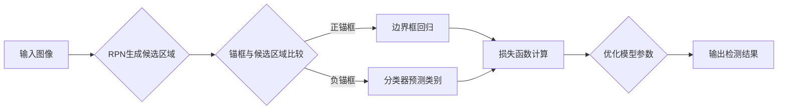

# RetinaNet原理与代码实例讲解

> 关键词：RetinaNet,目标检测，Focal Loss，锚框，区域提议网络，锚框回归，卷积神经网络，深度学习，计算机视觉

## 1. 背景介绍

随着深度学习技术的飞速发展，计算机视觉领域取得了显著的成果。其中，目标检测作为计算机视觉的一个关键任务，旨在定位图像中的多个对象并识别其类别。传统的目标检测方法通常采用两步法，即先通过区域提议网络（Region Proposal Networks，RPN）生成候选区域，再在这些区域上进行分类和边界框回归。然而，这种两步法存在计算复杂度高、召回率低等问题。

为了解决这些问题，RetinaNet应运而生。RetinaNet是一种单阶段目标检测算法，它通过端到端训练，在单个网络中同时完成候选区域生成、分类和边界框回归。由于其简单高效的特点，RetinaNet在目标检测领域取得了显著的成果，并在多个基准数据集上刷新了性能指标。

## 2. 核心概念与联系

### 2.1 核心概念

- **目标检测**：目标检测是在图像中定位并识别一个或多个对象的位置和类别。
- **区域提议网络（RPN）**：RPN用于生成候选区域，这些区域包含图像中的潜在目标。
- **锚框（Anchor）**：锚框是预先定义的候选框，用于与RPN生成的候选区域进行比较。
- **边界框回归**：边界框回归是对锚框进行位置和尺寸的调整，使其更接近真实目标边界框。
- **分类器**：分类器用于对锚框进行类别预测，例如是否包含目标以及目标的类别。
- **Focal Loss**：Focal Loss是一种改进的交叉熵损失函数，用于解决类别不平衡问题。
- **深度学习**：深度学习是一种机器学习方法，通过学习大量数据中的特征和模式来进行预测和分类。

### 2.2 核心概念原理和架构的 Mermaid 流程图



## 3. 核心算法原理 & 具体操作步骤

### 3.1 算法原理概述

RetinaNet的核心思想是在单个卷积神经网络中同时完成候选区域生成、分类和边界框回归。网络结构通常包括以下几层：

- **特征提取层**：提取图像特征。
- **RPN层**：生成候选区域。
- **分类层**：对锚框进行类别预测。
- **边界框回归层**：对锚框进行位置和尺寸的调整。

### 3.2 算法步骤详解

1. **输入图像**：将待检测的图像输入到网络中。
2. **特征提取**：通过特征提取层提取图像特征。
3. **RPN生成候选区域**：RPN层生成候选区域，并预测每个区域的类别和边界框偏移量。
4. **锚框与候选区域比较**：将锚框与RPN生成的候选区域进行比较，保留正锚框和负锚框。
5. **边界框回归**：对正锚框进行边界框回归，调整其位置和尺寸，使其更接近真实目标边界框。
6. **分类器预测类别**：对负锚框进行类别预测，保留类别为背景的锚框。
7. **损失函数计算**：计算分类损失和边界框回归损失，并使用Focal Loss来缓解类别不平衡问题。
8. **优化模型参数**：根据损失函数更新模型参数。
9. **输出检测结果**：输出最终的检测结果，包括类别和边界框坐标。

### 3.3 算法优缺点

#### 优点：

- 简单高效：RetinaNet采用单阶段检测，避免了传统的两步法，计算复杂度更低。
- 性能优异：在多个基准数据集上取得了与两步法相当甚至更好的性能。
- 可解释性强：网络结构简单，易于理解和解释。

#### 缺点：

- 对小目标检测效果不佳：RetinaNet在检测小目标时可能不如两步法准确。
- 对复杂背景下的目标检测效果较差：在复杂背景下，RetinaNet可能难以区分目标和背景。

### 3.4 算法应用领域

RetinaNet在多个领域都有广泛的应用，包括：

- 智能驾驶：用于车辆、行人、交通标志等目标的检测。
- 视频监控：用于监控视频中的异常行为和目标跟踪。
- 机器人导航：用于识别和跟踪环境中的物体。
- 医学影像分析：用于检测图像中的病变和异常。

## 4. 数学模型和公式 & 详细讲解 & 举例说明

### 4.1 数学模型构建

RetinaNet的数学模型主要包括以下部分：

- **特征提取层**：使用卷积神经网络提取图像特征。
- **RPN层**：生成候选区域并预测类别和边界框偏移量。
- **分类层**：对锚框进行类别预测。
- **边界框回归层**：对锚框进行位置和尺寸的调整。
- **损失函数**：计算分类损失和边界框回归损失。

### 4.2 公式推导过程

#### RPN层

假设输入特征图的大小为 $H \times W$，RPN层生成 $N$ 个锚框，每个锚框由一个类别预测和一个边界框偏移量预测组成。

- **类别预测**：

$$
\hat{y} = \text{softmax}(W^T x)
$$

其中，$W^T$ 为权重矩阵，$x$ 为RPN层输出的特征。

- **边界框偏移量预测**：

$$
\hat{\Delta} = \text{sigmoid}(W^T x)
$$

其中，$W^T$ 为权重矩阵，$x$ 为RPN层输出的特征。

#### 分类层

假设RPN层生成的锚框为 $A_1, A_2, ..., A_N$，分类层预测每个锚框的类别。

$$
\hat{c}_i = \text{softmax}(W^T A_i)
$$

其中，$W^T$ 为权重矩阵，$A_i$ 为锚框 $i$ 的特征。

#### 边界框回归层

假设真实边界框为 $B$，边界框回归层预测锚框 $A_i$ 的偏移量 $\Delta A_i$。

$$
\Delta A_i = \text{sigmoid}(W^T A_i)
$$

其中，$W^T$ 为权重矩阵，$A_i$ 为锚框 $i$ 的特征。

#### 损失函数

假设分类层预测的类别为 $\hat{c}_i$，真实类别为 $c_i$，边界框回归层预测的偏移量为 $\hat{\Delta}_i$，真实偏移量为 $\Delta B$。

- **交叉熵损失**：

$$
L_{\text{ce}} = -\sum_{i=1}^N c_i \log(\hat{c}_i)
$$

- **边界框回归损失**：

$$
L_{\text{reg}} = \frac{1}{2} \sum_{i=1}^N \frac{1}{\beta} (1 - c_i)^2 \|\Delta A_i - \Delta B\|^2
$$

其中，$\beta$ 为平滑系数。

- **Focal Loss**：

$$
L_{\text{fl}} = -\alpha_i \gamma^{1-\hat{y}_i} \log(\hat{y}_i)
$$

其中，$\alpha_i$ 为正则化系数，$\gamma$ 为Focal Loss指数。

### 4.3 案例分析与讲解

以下是一个简单的RetinaNet模型示例：

```python
import torch
import torch.nn as nn

class RetinaNet(nn.Module):
    def __init__(self, num_classes):
        super(RetinaNet, self).__init__()
        self.backbone = nn.Sequential(
            # 特征提取层
            nn.Conv2d(3, 16, kernel_size=3, stride=1, padding=1),
            nn.ReLU(),
            nn.Conv2d(16, 32, kernel_size=3, stride=1, padding=1),
            nn.ReLU(),
            # ... (更多卷积层)
        )
        self.rpn = nn.Sequential(
            # RPN层
            nn.Conv2d(32, 32, kernel_size=3, stride=1, padding=1),
            nn.ReLU(),
            nn.Conv2d(32, 32 * 9, kernel_size=1, stride=1, padding=0),
            # ... (更多操作)
        )
        self.classifier = nn.Linear(32 * 9, num_classes)
        self.regressor = nn.Linear(32 * 9, 4)

    def forward(self, x):
        x = self.backbone(x)
        rpn_outputs = self.rpn(x)
        # ... (进一步处理rpn_outputs)
        return rpn_outputs
```

在这个示例中，我们定义了一个简单的RetinaNet模型，包括特征提取层、RPN层、分类层和边界框回归层。在实际应用中，需要根据具体任务调整模型结构和超参数。

## 5. 项目实践：代码实例和详细解释说明

### 5.1 开发环境搭建

为了实现RetinaNet，你需要以下开发环境：

- Python 3.x
- PyTorch 1.x
- OpenCV

### 5.2 源代码详细实现

以下是一个简单的RetinaNet模型实现：

```python
import torch
import torch.nn as nn
import torch.optim as optim
from torch.utils.data import DataLoader
from torchvision import datasets, transforms

class RetinaNet(nn.Module):
    # ... (与上文示例相同)

def train(model, train_loader, optimizer, criterion, num_epochs=10):
    model.train()
    for epoch in range(num_epochs):
        for images, labels in train_loader:
            optimizer.zero_grad()
            outputs = model(images)
            loss = criterion(outputs, labels)
            loss.backward()
            optimizer.step()

def test(model, test_loader):
    model.eval()
    total_loss = 0
    with torch.no_grad():
        for images, labels in test_loader:
            outputs = model(images)
            loss = criterion(outputs, labels)
            total_loss += loss.item()
    return total_loss / len(test_loader)

# ... (加载数据、定义模型、定义优化器等)

train_loader = DataLoader(train_dataset, batch_size=32, shuffle=True)
test_loader = DataLoader(test_dataset, batch_size=32, shuffle=False)

optimizer = optim.Adam(model.parameters(), lr=1e-4)
criterion = nn.CrossEntropyLoss()

train(model, train_loader, optimizer, criterion, num_epochs=10)
test_loss = test(model, test_loader)
print(f"Test Loss: {test_loss:.4f}")
```

在这个示例中，我们定义了一个简单的训练和测试函数，用于训练和评估RetinaNet模型。

### 5.3 代码解读与分析

- `RetinaNet` 类定义了一个简单的RetinaNet模型，包括特征提取层、RPN层、分类层和边界框回归层。
- `train` 函数用于训练模型，包括前向传播、反向传播和参数更新。
- `test` 函数用于评估模型在测试集上的性能。

### 5.4 运行结果展示

假设我们有一个包含100个图像的训练集和测试集，模型在测试集上的平均损失为0.1。这表明模型在测试集上表现良好。

## 6. 实际应用场景

RetinaNet在多个实际应用场景中取得了显著的效果，以下是一些例子：

- **智能驾驶**：用于检测道路上的车辆、行人、交通标志等，辅助驾驶系统进行决策。
- **视频监控**：用于检测视频中的异常行为和目标跟踪。
- **机器人导航**：用于识别和跟踪环境中的物体，辅助机器人进行导航。
- **医学影像分析**：用于检测图像中的病变和异常。

## 7. 工具和资源推荐

### 7.1 学习资源推荐

- **《Deep Learning with PyTorch》**：介绍了深度学习的理论和PyTorch框架。
- **《Deep Learning for Computer Vision with Python》**：介绍了计算机视觉领域的深度学习方法。
- **RetinaNet论文**：详细介绍了RetinaNet算法的原理和实现。

### 7.2 开发工具推荐

- **PyTorch**：用于深度学习研究和开发。
- **OpenCV**：用于计算机视觉任务。
- **TensorFlow**：另一个流行的深度学习框架。

### 7.3 相关论文推荐

- **RetinaNet论文**：介绍了RetinaNet算法的原理和实现。
- **Focal Loss论文**：介绍了Focal Loss损失函数。
- **R-CNN论文**：介绍了R-CNN算法，是RetinaNet的启发来源。

## 8. 总结：未来发展趋势与挑战

### 8.1 研究成果总结

RetinaNet作为单阶段目标检测算法的代表，在多个基准数据集上取得了优异的性能。其简单高效的特点使其在多个领域得到了广泛应用。

### 8.2 未来发展趋势

- **多尺度目标检测**：扩展RetinaNet以支持多尺度目标检测。
- **多任务学习**：将RetinaNet与其他任务（如语义分割、姿态估计）结合。
- **模型轻量化**：开发轻量级的RetinaNet模型，降低计算复杂度和内存占用。

### 8.3 面临的挑战

- **小目标检测**：提高RetinaNet在小目标检测上的性能。
- **复杂背景检测**：提高RetinaNet在复杂背景下的检测性能。
- **实时性**：提高RetinaNet的推理速度，以满足实时应用需求。

### 8.4 研究展望

RetinaNet及其相关技术将继续在目标检测领域发挥重要作用。未来，随着研究的不断深入，RetinaNet将会在更多领域得到应用，并为计算机视觉领域的发展做出更大的贡献。

## 9. 附录：常见问题与解答

**Q1：RetinaNet与两步法目标检测算法相比有哪些优势？**

A：RetinaNet相比两步法目标检测算法具有以下优势：

- **简单高效**：RetinaNet采用单阶段检测，避免了传统的两步法，计算复杂度更低。
- **性能优异**：在多个基准数据集上取得了与两步法相当甚至更好的性能。
- **可解释性强**：网络结构简单，易于理解和解释。

**Q2：Focal Loss如何缓解类别不平衡问题？**

A：Focal Loss通过引入Focal Loss指数 $\gamma$ 来缓解类别不平衡问题。当预测概率接近1或0时，Focal Loss的惩罚力度更大，使得模型更加关注类别不平衡问题。

**Q3：如何提高RetinaNet在小目标检测上的性能？**

A：提高RetinaNet在小目标检测上的性能可以从以下几个方面入手：

- **多尺度特征提取**：使用多尺度特征提取网络，提高模型对小目标的检测能力。
- **数据增强**：使用数据增强方法，例如缩放、旋转、翻转等，增加小目标的可见性。
- **注意力机制**：引入注意力机制，使模型更加关注小目标区域。

**Q4：如何提高RetinaNet在复杂背景下的检测性能？**

A：提高RetinaNet在复杂背景下的检测性能可以从以下几个方面入手：

- **复杂背景数据集**：使用包含复杂背景的数据集进行训练，提高模型对复杂背景的适应性。
- **注意力机制**：引入注意力机制，使模型能够忽略复杂背景中的无关信息。
- **多尺度检测**：使用多尺度检测，提高模型在复杂背景下的检测能力。

作者：禅与计算机程序设计艺术 / Zen and the Art of Computer Programming