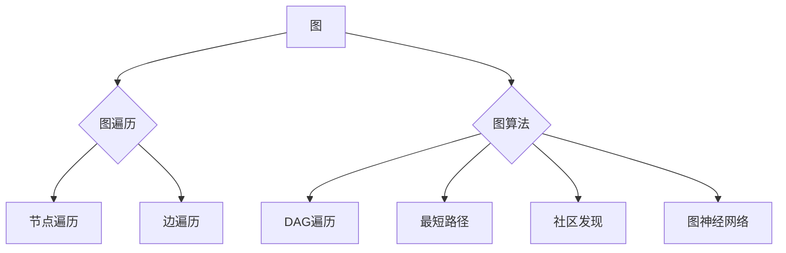

# Spark GraphX图计算引擎原理与代码实例讲解

> 关键词：Spark GraphX，图计算，图算法，分布式计算，图神经网络，社交网络分析，推荐系统，图遍历

## 1. 背景介绍

随着互联网和大数据时代的到来，数据规模呈指数级增长，结构化数据和非结构化数据并存。传统的计算框架在处理复杂的关系型数据时效率低下，难以满足大规模图计算的需求。Spark GraphX作为Apache Spark的图处理组件，凭借其高效、易用的特性，成为处理大规模图数据的利器。本文将深入讲解Spark GraphX图计算引擎的原理与代码实例，帮助读者理解其在图计算领域的应用。

### 1.1 问题的由来

在现实世界中，很多问题都可以抽象为图的形式，如图社交网络、交通网络、知识图谱等。传统的计算框架难以高效处理这些图数据，导致以下问题：

- 数据规模大：图数据往往包含数百万甚至数十亿个节点和边，传统计算框架难以高效处理。
- 关系复杂：图中的节点和边之间存在复杂的关联关系，需要高效的算法进行遍历和分析。
- 算法复杂：图计算算法复杂度高，传统计算框架难以高效实现。

### 1.2 研究现状

针对上述问题，图计算技术应运而生。Spark GraphX作为Apache Spark的图处理组件，具有以下特点：

- 集成于Spark：无缝集成Spark生态系统，利用Spark的强大数据处理能力。
- 易用性：提供简单易用的API，降低图算法开发门槛。
- 高效性：采用分布式计算架构，高效处理大规模图数据。
- 可扩展性：支持多种图算法，可扩展性强。

### 1.3 研究意义

研究Spark GraphX图计算引擎，对于以下领域具有重要意义：

- 数据分析和挖掘：利用图计算技术挖掘社交网络、知识图谱等数据中的隐藏关系。
- 推荐系统：利用图计算技术构建基于关系的推荐系统。
- 机器学习：利用图神经网络进行图数据的机器学习任务。
- 网络优化：利用图计算技术优化网络结构，提高网络性能。

## 2. 核心概念与联系

### 2.1 核心概念

- **图（Graph）**：由节点（Vertex）和边（Edge）组成的数据结构，节点代表实体，边代表实体之间的关系。
- **图遍历（Graph Traversal）**：遍历图中的所有节点和边，实现图的搜索和分析。
- **图算法（Graph Algorithm）**：针对图数据设计的算法，如DAG遍历、最短路径、社区发现等。
- **图神经网络（Graph Neural Network, GNN）**：基于图数据的神经网络，用于表示图结构和关系，进行图数据的机器学习任务。

### 2.2 核心概念原理和架构的 Mermaid 流程图



图中，图是所有图计算的基础，图遍历和图算法用于对图数据进行深入分析，而图神经网络则将图数据应用于机器学习任务。

## 3. 核心算法原理 & 具体操作步骤

### 3.1 算法原理概述

Spark GraphX的核心算法原理如下：

- **图数据结构**：使用弹性分布式数据集（RDD）存储图数据，包括节点、边和属性等信息。
- **图遍历**：采用深度优先搜索（DFS）或广度优先搜索（BFS）算法遍历图中的节点和边。
- **图算法**：提供多种图算法，如PageRank、社区发现、最短路径等，支持自定义算法。
- **图神经网络**：支持自定义GNN模型，实现图数据的机器学习任务。

### 3.2 算法步骤详解

1. **定义图数据**：使用GraphX API创建图对象，包含节点、边和属性等信息。
2. **图遍历**：根据任务需求选择合适的遍历算法，如DFS或BFS。
3. **执行图算法**：根据任务需求选择合适的图算法，如PageRank、社区发现等。
4. **GNN建模**：使用GraphX API构建GNN模型，进行图数据的机器学习任务。

### 3.3 算法优缺点

**优点**：

- 集成于Spark，可以利用Spark强大的数据处理能力。
- 易用性高，API简单易用。
- 高效性，支持分布式计算，能够处理大规模图数据。
- 可扩展性强，支持多种图算法和GNN模型。

**缺点**：

- 学习曲线较陡峭，需要一定的GraphX和Spark知识。
- 内存消耗较大，对于节点和边数量非常大的图数据，可能需要优化存储结构。

### 3.4 算法应用领域

Spark GraphX在以下领域具有广泛的应用：

- 社交网络分析：分析社交网络中的关系结构，识别关键节点和社区。
- 推荐系统：构建基于关系的推荐系统，提高推荐准确性。
- 机器学习：利用图神经网络进行图数据的机器学习任务。
- 网络优化：优化网络结构，提高网络性能。

## 4. 数学模型和公式 & 详细讲解 & 举例说明

### 4.1 数学模型构建

图计算中的常见数学模型包括：

- **节点度（Degree）**：节点连接的边数，表示节点的连接程度。
- **路径长度（Path Length）**：连接两个节点之间的最短路径长度。
- **PageRank**：根据节点之间的链接关系计算节点的重要性。

### 4.2 公式推导过程

以PageRank为例，其公式推导过程如下：

$$
r(v) = \left(1 - d\right)r_{\infty} + d\sum_{w \in \mathcal{N}(v)}\frac{r(w)}{|\mathcal{N}(w)|}
$$

其中，$r(v)$ 表示节点 $v$ 的PageRank值，$d$ 表示阻尼系数，$r_{\infty}$ 表示收敛时的PageRank值，$\mathcal{N}(v)$ 表示节点 $v$ 的邻接节点集合，$|\mathcal{N}(w)|$ 表示节点 $w$ 的邻接节点数量。

### 4.3 案例分析与讲解

以下是一个使用PageRank算法计算社交网络中节点重要性的示例：

```java
val graph = GraphLoader.loadGraph("path/to/social_network_graph")
val ranks = graph.pageRank(0.85).vertices
ranks.collect().foreach { case (vertex, rank) =>
  println(s"Vertex: $vertex, Rank: $rank")
}
```

这段代码首先加载社交网络图，然后使用PageRank算法计算每个节点的PageRank值，并将结果打印输出。

## 5. 项目实践：代码实例和详细解释说明

### 5.1 开发环境搭建

在开始编写Spark GraphX代码前，需要搭建以下开发环境：

1. 安装Java Development Kit（JDK）1.8或更高版本。
2. 安装Apache Spark 2.4.0或更高版本。
3. 创建Maven或SBT项目，并添加以下依赖：

```xml
<dependencies>
    <dependency>
        <groupId>org.apache.spark</groupId>
        <artifactId>spark-graphx_2.12</artifactId>
        <version>3.1.1</version>
    </dependency>
</dependencies>
```

### 5.2 源代码详细实现

以下是一个使用Spark GraphX实现PageRank算法的示例：

```scala
import org.apache.spark.graphx._

object PageRankExample {
  def main(args: Array[String]): Unit = {
    // 创建SparkContext
    val sc = SparkContext.getOrCreate(new SparkConf().setAppName("PageRankExample"))
    
    // 加载图数据
    val graph = GraphLoader.loadGraph("path/to/social_network_graph")
    
    // 计算PageRank
    val ranks = graph.pageRank(0.85).vertices
    ranks.collect().foreach { case (vertex, rank) =>
      println(s"Vertex: $vertex, Rank: $rank")
    }
    
    // 停止SparkContext
    sc.stop()
  }
}
```

### 5.3 代码解读与分析

- `SparkContext.getOrCreate` 创建SparkContext对象。
- `GraphLoader.loadGraph` 加载图数据。
- `graph.pageRank` 使用PageRank算法计算每个节点的PageRank值。
- `ranks.collect()` 收集PageRank结果。
- `println` 打印输出结果。

### 5.4 运行结果展示

运行上述代码后，将输出社交网络中每个节点的PageRank值，展示节点在社交网络中的重要性。

## 6. 实际应用场景

### 6.1 社交网络分析

Spark GraphX可以用于分析社交网络中的关系结构，识别关键节点和社区。例如，可以分析用户在社交网络中的影响力，识别意见领袖；可以分析社区成员的互动关系，发现潜在社区。

### 6.2 推荐系统

Spark GraphX可以用于构建基于关系的推荐系统，提高推荐准确性。例如，可以分析用户之间的相似性，推荐用户可能感兴趣的商品或内容。

### 6.3 机器学习

Spark GraphX可以用于图数据的机器学习任务，如节点分类、链接预测等。例如，可以使用图神经网络对节点进行分类，预测节点之间的链接关系。

### 6.4 网络优化

Spark GraphX可以用于优化网络结构，提高网络性能。例如，可以分析网络中的瓶颈节点，优化网络拓扑结构。

## 7. 工具和资源推荐

### 7.1 学习资源推荐

- Apache Spark官方文档：https://spark.apache.org/docs/
- Spark GraphX官方文档：https://spark.apache.org/docs/latest/graphx/
- 《Graph Mining》书籍：详细介绍图挖掘的理论和实践，包括Spark GraphX。

### 7.2 开发工具推荐

- IntelliJ IDEA：支持Scala和Java开发，提供丰富的Spark开发插件。
- PyCharm：支持Python和Scala开发，提供丰富的Spark开发插件。

### 7.3 相关论文推荐

- "GraphX: Large-Scale Graph-Parallel Computation System"：Spark GraphX的官方论文。
- "Deep Learning on Graphs: Methods and Applications"：介绍图神经网络及其在机器学习中的应用。

## 8. 总结：未来发展趋势与挑战

### 8.1 研究成果总结

本文详细讲解了Spark GraphX图计算引擎的原理与代码实例，涵盖了图数据结构、图遍历、图算法、图神经网络等内容。通过实例分析，展示了Spark GraphX在社交网络分析、推荐系统、机器学习和网络优化等领域的应用。

### 8.2 未来发展趋势

- **高效计算**：进一步提高图计算引擎的并行计算能力，降低计算成本。
- **可扩展性**：支持更大规模的图数据，适应不断增长的数据规模。
- **易用性**：简化图算法开发流程，降低使用门槛。
- **跨平台支持**：支持更多编程语言和计算框架。

### 8.3 面临的挑战

- **资源消耗**：图计算引擎对计算资源的需求较大，需要优化资源利用效率。
- **算法复杂度**：图算法复杂度高，需要开发高效算法。
- **可解释性**：图计算结果的可解释性较差，需要提高算法的可解释性。

### 8.4 研究展望

未来，Spark GraphX等图计算引擎将在以下方面取得突破：

- **图神经网络**：结合图神经网络的强大能力，实现更复杂的图数据处理和分析。
- **图数据挖掘**：开发新的图数据挖掘算法，发现图数据中的隐藏关系。
- **跨领域应用**：将图计算技术应用于更多领域，如生物信息学、地理信息系统等。

## 9. 附录：常见问题与解答

**Q1：什么是图计算？**

A：图计算是一种针对图数据结构进行计算和分析的方法，用于处理复杂的关系型数据。

**Q2：Spark GraphX与GraphX有什么区别？**

A：Spark GraphX是Apache Spark的一部分，GraphX是Spark GraphX的前身，现在已经成为Spark GraphX的代名词。

**Q3：如何选择合适的图算法？**

A：选择合适的图算法需要根据具体的应用场景和需求进行考虑，如社交网络分析可以使用PageRank，链接预测可以使用GNN。

**Q4：Spark GraphX与其他图计算框架相比有哪些优势？**

A：Spark GraphX具有以下优势：
- 集成于Spark，利用Spark强大的数据处理能力。
- 易用性高，API简单易用。
- 高效性，支持分布式计算，能够处理大规模图数据。
- 可扩展性强，支持多种图算法和GNN模型。

**Q5：Spark GraphX在哪些领域有应用？**

A：Spark GraphX在以下领域有广泛应用：
- 社交网络分析
- 推荐系统
- 机器学习
- 网络优化

作者：禅与计算机程序设计艺术 / Zen and the Art of Computer Programming