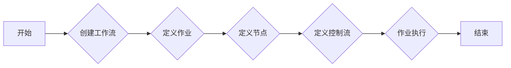

# Oozie原理与代码实例讲解

> 关键词：Oozie, Hadoop生态系统, 工作流管理, 调度系统, 作业编排, 代码示例, 脚本化任务, Yarn, MapReduce

## 1. 背景介绍

在Hadoop生态系统中的工作流管理和任务调度一直是数据处理和分析的关键环节。Oozie是一个开源的工作流管理系统，它允许用户以声明式的方式定义工作流作业，从而能够自动化处理一系列Hadoop作业，包括MapReduce、Hive、Pig、Spark等。Oozie通过提供一个统一的工作流API，简化了作业的创建、调度和管理，极大地提高了数据处理的效率。

### 1.1 问题的由来

随着大数据时代的到来，数据处理的复杂性日益增加。企业需要处理的数据量越来越大，数据处理任务也日趋复杂。如何高效地管理和调度这些作业成为了一个挑战。传统的手动操作不仅费时费力，而且容易出错。Oozie应运而生，解决了这一痛点。

### 1.2 研究现状

Oozie自2008年由Cloudera开源以来，已经发展成为一个成熟的工作流管理平台。它支持多种编程语言编写的脚本，包括Java、Python、Ruby等，并且可以轻松地与Hadoop生态系统中的其他工具集成。

### 1.3 研究意义

Oozie的主要意义在于：

- **自动化作业调度**：通过Oozie，用户可以自动化地调度和管理Hadoop作业，无需手动编写复杂的脚本。
- **提高数据处理效率**：Oozie可以帮助用户优化作业流程，减少重复性工作，提高数据处理效率。
- **简化开发过程**：Oozie提供了一个直观的界面和API，简化了工作流的开发过程。

### 1.4 本文结构

本文将分为以下几个部分：

- 核心概念与联系
- 核心算法原理与具体操作步骤
- 数学模型和公式
- 项目实践
- 实际应用场景
- 工具和资源推荐
- 总结：未来发展趋势与挑战
- 附录：常见问题与解答

## 2. 核心概念与联系

### 2.1 核心概念原理

Oozie的核心概念包括：

- **工作流（Workflow）**：一个工作流是由多个作业组成的序列，这些作业可以是Hadoop作业，也可以是其他系统作业。
- **作业（Job）**：工作流中的单个任务，可以是MapReduce、Hive、Pig等Hadoop作业，或者是外部作业，如Java、Python脚本。
- **节点（Node）**：工作流中的基本单元，可以是作业、控制流操作等。
- **控制流（Control Flow）**：用于控制工作流中作业的执行顺序，包括条件分支、循环等。

### 2.2 架构流程图



## 3. 核心算法原理 & 具体操作步骤

### 3.1 算法原理概述

Oozie使用以下原理来管理工作流：

- **事件驱动**：Oozie通过监听作业状态变化来驱动工作流的执行。
- **状态管理**：Oozie维护作业的状态，包括等待、运行、成功、失败等。
- **容错机制**：Oozie能够处理作业失败的情况，并尝试重新执行失败的作业。

### 3.2 算法步骤详解

Oozie的工作流程通常包括以下步骤：

1. **定义工作流**：使用Oozie的XML或Groovy脚本定义工作流。
2. **配置作业**：在Oozie中配置作业，包括作业类型、输入输出路径、环境变量等。
3. **调度工作流**：使用Oozie调度器调度工作流。
4. **监控工作流**：监控工作流的执行状态，包括实时日志查看、历史记录查询等。
5. **故障处理**：在工作流执行过程中，处理可能出现的故障，如作业失败、资源不足等。

### 3.3 算法优缺点

**优点**：

- **易于使用**：Oozie提供了简单的XML或Groovy脚本语法，易于学习和使用。
- **灵活性强**：Oozie支持多种作业类型，可以轻松地集成其他Hadoop生态系统中的工具。
- **高度可扩展**：Oozie可以处理大量的作业，并且可以部署在分布式环境中。

**缺点**：

- **学习曲线**：Oozie的XML和Groovy语法可能需要一定时间来学习。
- **配置复杂**：对于复杂的工作流，配置可能相对复杂。
- **性能瓶颈**：在处理大量作业时，Oozie的性能可能成为瓶颈。

### 3.4 算法应用领域

Oozie在以下领域得到广泛应用：

- **大数据处理**：Oozie可以用来调度和管理大规模的数据处理作业。
- **数据集成**：Oozie可以用来集成来自不同数据源的数据。
- **数据仓库**：Oozie可以用来管理数据仓库的ETL过程。

## 4. 数学模型和公式

Oozie本身不涉及复杂的数学模型，其核心是工作流管理和调度。以下是Oozie中可能用到的简单数学模型：

### 4.1 数学模型构建

- **作业完成时间预测**：使用简单的线性回归模型预测作业的完成时间。
- **资源需求估算**：使用历史数据估算作业的资源需求。

### 4.2 公式推导过程

- **作业完成时间预测**：设 $t$ 为作业的执行时间，$x_1, x_2, \ldots, x_n$ 为影响作业执行时间的因素，则线性回归模型可以表示为：

  $$
 t = w_0 + w_1x_1 + w_2x_2 + \ldots + w_nx_n
$$

- **资源需求估算**：设 $r$ 为资源需求，$y_1, y_2, \ldots, y_m$ 为影响资源需求的因素，则线性回归模型可以表示为：

  $$
 r = v_0 + v_1y_1 + v_2y_2 + \ldots + v_my_m
$$

### 4.3 案例分析与讲解

由于Oozie本身不涉及复杂的数学模型，这里不进行具体的案例分析与讲解。

## 5. 项目实践：代码实例和详细解释说明

### 5.1 开发环境搭建

为了实践Oozie，需要以下开发环境：

- Java开发环境
- Hadoop集群
- Oozie服务器

### 5.2 源代码详细实现

以下是一个简单的Oozie工作流示例：

```xml
<workflow-app xmlns="uri:oozie:workflow:0.4" name="example-workflow" xmlns:ns2="uri:oozie:wf:action:0.2">
    <start to="action1" />
    <action name="action1">
        <shell>
            <command>echo "Hello, Oozie!"</command>
        </shell>
    </action>
    <end name="end1" />
</workflow-app>
```

这个工作流包含一个shell作业，该作业执行一个简单的echo命令。

### 5.3 代码解读与分析

这个工作流定义了一个名为`example-workflow`的工作流，包含一个名为`action1`的shell作业和一个名为`end1`的结束节点。工作流从`start`节点开始，执行`action1`作业，然后到达`end1`节点结束。

### 5.4 运行结果展示

通过Oozie客户端提交这个工作流，可以在Oozie Web界面中查看作业的执行状态和日志。

## 6. 实际应用场景

### 6.1 大数据处理

Oozie可以用来调度和管理大规模的数据处理作业，如数据清洗、数据集成、数据仓库ETL等。

### 6.2 数据集成

Oozie可以用来集成来自不同数据源的数据，如关系数据库、NoSQL数据库、日志文件等。

### 6.3 数据仓库

Oozie可以用来管理数据仓库的ETL过程，如数据清洗、数据转换、数据加载等。

## 7. 工具和资源推荐

### 7.1 学习资源推荐

- Oozie官方文档
- Hadoop官方文档
- 《Hadoop权威指南》

### 7.2 开发工具推荐

- IntelliJ IDEA
- Eclipse
- Oozie客户端

### 7.3 相关论文推荐

- 《Hadoop权威指南》
- 《大数据技术原理与应用》

## 8. 总结：未来发展趋势与挑战

### 8.1 研究成果总结

Oozie作为一个成熟的工作流管理平台，已经在Hadoop生态系统中得到广泛应用。它为用户提供了便捷的工作流管理和调度工具，提高了数据处理效率。

### 8.2 未来发展趋势

随着大数据技术的不断发展，Oozie可能会朝着以下方向发展：

- 更好的集成能力
- 更强大的调度引擎
- 更易用的用户界面

### 8.3 面临的挑战

Oozie面临的挑战包括：

- 与新技术的集成
- 性能优化
- 用户界面改进

### 8.4 研究展望

未来，Oozie的研究将主要集中在以下几个方面：

- 与新兴大数据技术的集成
- 智能调度算法的研究
- 用户界面的优化

## 9. 附录：常见问题与解答

**Q1：Oozie与Airflow有什么区别？**

A: Oozie和Airflow都是工作流管理工具，但它们的设计理念和应用场景有所不同。Oozie更适合Hadoop生态系统，而Airflow则更通用，支持多种数据源和数据处理工具。

**Q2：如何优化Oozie的性能？**

A: 优化Oozie的性能可以从以下几个方面入手：

- 优化作业配置
- 使用合适的调度策略
- 优化资源分配

**Q3：Oozie可以与Spark集成吗？**

A: 是的，Oozie可以与Spark集成，通过定义Spark作业来处理数据。

**Q4：如何将Oozie工作流部署到生产环境？**

A: 将Oozie工作流部署到生产环境需要以下步骤：

- 安装Oozie服务器
- 配置Oozie服务器
- 将工作流部署到Oozie服务器
- 监控工作流的执行状态

作者：禅与计算机程序设计艺术 / Zen and the Art of Computer Programming