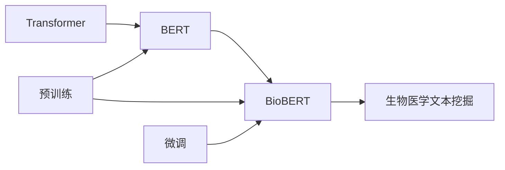

# Transformer大模型实战 BioBERT模型

## 1. 背景介绍

### 1.1 问题的由来
近年来,随着深度学习技术的飞速发展,自然语言处理(NLP)领域也迎来了一次重大的突破。特别是Transformer模型的出现,更是掀起了NLP领域的一场革命。Transformer作为一种全新的神经网络结构,摒弃了传统的RNN和CNN结构,完全依靠注意力机制(Attention Mechanism)来实现序列到序列的建模。它的出现,不仅大大提高了机器翻译、文本分类、命名实体识别等NLP任务的性能,也为后续的BERT、GPT等大模型的诞生奠定了基础。

然而,尽管Transformer在通用NLP任务上取得了瞩目的成绩,但在一些特定领域如生物医学文本处理上,其性能还有待进一步提升。这主要是因为通用的Transformer模型缺乏对领域知识的建模和利用。为了解决这一问题,研究者们提出了将预训练语言模型与领域知识相结合的思路,BioBERT就是这一思路下的代表性成果。

### 1.2 研究现状
BioBERT是在BERT的基础上,通过在大规模生物医学文本语料上进行预训练得到的。与通用的BERT相比,BioBERT在生物医学命名实体识别、关系抽取、问答等任务上取得了显著的性能提升。目前,BioBERT已经成为生物医学NLP领域的标准baseline模型,受到学术界和工业界的广泛关注。

但BioBERT仍存在一些局限性。首先,BioBERT主要依赖预训练阶段的无监督学习来获取领域知识,而忽略了大量结构化的知识库资源。其次,BioBERT缺乏对生物医学本体、医学概念间层次关系的显式建模。此外,当前的BioBERT模型在处理长文本时也面临一定挑战。因此,BioBERT在建模领域知识、融合结构化知识库、处理长文本等方面还有进一步改进的空间。

### 1.3 研究意义
生物医学领域蕴含着大量重要的科学发现和医疗应用价值。然而,这些知识大多隐藏在海量的文献和临床数据中,人工提取和利用的效率非常有限。因此,发展智能化的生物医学文本挖掘技术,对于加速生物医学研究、辅助临床决策、促进精准医疗都具有重要意义。

BioBERT的研究,是将前沿的NLP技术应用到生物医学领域的一次有益尝试。一方面,BioBERT的突破性进展,证明了语言模型预训练范式在生物医学NLP中的有效性,为后续研究指明了方向。另一方面,BioBERT在关键生物医学NLP任务上的性能飞跃,将极大地推动智慧医疗、辅助诊疗、药物研发等应用的发展。可以预见,BioBERT必将在未来智能医疗体系中扮演重要角色。

### 1.4 本文结构
本文将全面介绍BioBERT模型的原理、实现和应用。第2部分阐述BioBERT涉及的核心概念。第3部分详细讲解BioBERT的核心算法。第4部分给出BioBERT相关的数学模型和公式推导。第5部分通过代码实例演示BioBERT的实现细节。第6部分展望BioBERT的实际应用场景。第7部分推荐BioBERT相关的学习资源。第8部分总结全文并展望未来。第9部分列出常见问题解答。

## 2. 核心概念与联系

- **Transformer**: 一种基于自注意力机制(Self-Attention)的神经网络结构,摒弃了传统的RNN和CNN结构,在并行计算和长程依赖建模上具有优势。Transformer是BERT的基础架构。

- **BERT**: 基于Transformer的双向语言表示模型。通过在大规模无标注文本语料上进行Masked Language Model和Next Sentence Prediction的预训练,BERT可以学习到上下文相关的词语表示。预训练后的BERT可以迁移到下游NLP任务,并实现显著的性能提升。

- **BioBERT**: 在BERT的基础上,利用生物医学领域文本进行预训练得到的领域特异性语言表示模型。相比通用BERT,BioBERT更能捕捉和理解生物医学概念、实体和关系,在生物医学NLP任务上取得了SOTA表现。

- **预训练**:指在大规模无标注语料上,通过自监督学习任务来学习通用的语言表示的过程。预训练是BERT和BioBERT的关键,使模型能够学习到语义丰富的上下文表示。预训练通常采用Masked Language Model和Next Sentence Prediction等任务。

- **微调**: 指在预训练的基础上,利用任务特定的标注数据,通过有监督学习来优化模型在目标任务上的性能。对于BioBERT,我们通常使用生物医学NLP任务的标注数据进行微调,如命名实体识别、关系抽取等。微调使BioBERT能够适应具体任务。

- **生物医学文本挖掘**: 旨在从非结构化的生物医学文献、电子病历等文本数据中,自动抽取结构化信息(如实体、关系、事件)并进行分析和推理的技术。BioBERT通过强大的语义理解和知识捕捉能力,极大地推动了生物医学文本挖掘的发展。

下图展示了上述核心概念间的关系:



## 3. 核心算法原理 & 具体操作步骤

### 3.1 算法原理概述
BioBERT的核心算法可以分为两个阶段:预训练和微调。

在预训练阶段,BioBERT采用了与BERT相同的Masked Language Model(MLM)和Next Sentence Prediction(NSP)任务。MLM任务通过随机Mask掉部分词语,并让模型预测被Mask词语来学习上下文表示。NSP任务则通过预测两个句子是否前后相邻来学习句子级别的表示。与BERT不同的是,BioBERT在生物医学领域语料(如PubMed摘要、PMC全文)上进行预训练,以学习领域特异性知识。

在微调阶段,BioBERT在下游生物医学NLP任务的标注数据上进行有监督微调。对于不同任务,BioBERT采用不同的输入表示和输出层设计。以命名实体识别(NER)为例,BioBERT将每个词语的表示向量输入到一个线性分类层,预测其实体标签。通过端到端的监督学习,BioBERT可以适应具体NLP任务。

### 3.2 算法步骤详解

BioBERT的训练分为两步:预训练和微调。

**预训练步骤**:
1. 准备生物医学领域语料,如PubMed摘要、PMC全文等。
2. 对语料进行预处理,包括分词、词性标注等。
3. 构建输入序列。对于MLM任务,随机Mask掉15%的词语;对于NSP任务,随机选择50%的句子对为正例,50%为负例。
4. 将输入序列转化为BioBERT的输入表示,包括词嵌入、位置嵌入和段嵌入。
5. 将输入表示送入BioBERT模型,通过多层Transformer Encoder学习上下文表示。
6. 对于MLM任务,使用最后一层的隐层状态预测被Mask词语;对于NSP任务,使用[CLS]标记的最终隐层状态预测两个句子是否相邻。
7. 计算MLM和NSP任务的损失,并通过反向传播更新模型参数。
8. 重复步骤3-7,直到模型收敛或达到预设的训练轮数。

**微调步骤**:
1. 将预训练好的BioBERT模型应用到目标生物医学NLP任务。
2. 根据任务类型,设计合适的输入表示和输出层。如对于NER任务,输出层为线性分类层;对于关系抽取任务,输出层为多层感知机。
3. 使用任务的标注数据对BioBERT进行微调。将标注数据转化为BioBERT的输入表示,送入模型进行前向传播,并计算任务的损失函数。
4. 通过反向传播更新BioBERT的参数,使其适应目标任务。根据任务的不同,可以选择性地固定部分层的参数。
5. 重复步骤3-4,直到模型在目标任务上达到最优性能或满足预设的停止条件。
6. 使用微调后的BioBERT模型对测试集进行预测,并评估其在目标任务上的性能。

### 3.3 算法优缺点

**优点**:
- 通过在生物医学领域语料上预训练,BioBERT可以学习到领域特异性知识,显著提升了生物医学NLP任务的性能。
- BioBERT继承了BERT的优势,如双向上下文建模、深层网络结构、注意力机制等,使其能够更好地理解语义信息。
- BioBERT采用预训练+微调的范式,具有很好的迁移学习能力。预训练使BioBERT学习到通用的语言表示,微调使其适应具体任务。
- 相比传统的人工特征工程,BioBERT可以自动学习任务相关的特征表示,减少了人工设计特征的成本。

**缺点**:
- BioBERT对计算资源要求较高,预训练和微调都需要大量的GPU资源和训练时间。这在一定程度上限制了其应用范围。
- BioBERT主要依赖无监督预训练来学习领域知识,而忽略了大量结构化知识库。如何将知识库显式融入BioBERT中是一个有待解决的问题。
- BioBERT对长文本的建模能力有限,主要原因是其输入长度受限于Transformer的位置嵌入。如何扩展BioBERT以处理长文本是另一个挑战。
- 尽管BioBERT在多个生物医学NLP基准任务上取得了SOTA性能,但其在实际应用中的泛化能力和鲁棒性还有待进一步验证。

### 3.4 算法应用领域
BioBERT在生物医学领域有广泛的应用前景,主要包括:

- **命名实体识别**: 识别文本中的生物医学实体,如基因、蛋白质、疾病、药物等。BioBERT可以显著提高NER任务的F1值。
- **关系抽取**: 从文本中抽取生物医学实体间的关系,如基因-疾病关联、药物-药物相互作用等。BioBERT可以有效捕捉实体间的语义关系。
- **文本分类**: 对生物医学文献进行主题分类,如将文献分为癌症、遗传学等不同类别。BioBERT可以学习到更好的文本表示用于分类。
- **问答系统**: 根据用户的自然语言问题,从大规模生物医学文献中检索答案。BioBERT可以用于问题表示和答案匹配。
- **文本推理**: 根据给定的生物医学前提,预测某个假设是否成立。BioBERT可以用于建模前提和假设之间的逻辑关系。
- **文本生成**: 自动生成生物医学领域的文本,如诊疗报告、药物说明书等。BioBERT可以作为文本生成模型的预训练初始化。

未来,BioBERT有望在更多生物医学场景得到应用,如辅助文献检索、临床决策支持、药物研发等,为智慧医疗赋能。

## 4. 数学模型和公式 & 详细讲解 & 举例说明

### 4.1 数学模型构建
BioBERT的数学模型主要包括两部分:Transformer Encoder和预训练任务。

**Transformer Encoder**:
Transformer Encoder是BioBERT的核心组件,由多个相同的层堆叠而成。每一层包括两个子层:Multi-Head Self-Attention和Position-wise Feed-Forward Network。

Multi-Head Self-Attention子层通过计算序列中任意两个位置之间的注意力权重,实现了对长程依赖的建模。其数学表达为:

$$
\text{MultiHead}(Q, K, V) = \text{Concat}(\text{head}_1, ..., \text{head}_h)W^O
$$

其中$$
\text{head}_i = \text{Attention}(QW_i^Q, KW_i^K, VW_i^V)
$$

Attention机制的计算公式为：

$$
\text{Attention}(Q, K, V) = \text{softmax}(\frac{QK^T}{\sqrt{d_k}})V
$$

其中，$Q$、$K$、$V$ 分别代表查询矩阵、键矩阵和值矩阵，$W_i^Q$、$W_i^K$、$W_i^V$ 是可训练的权重矩阵，$d_k$ 是键向量的维度。

Position-wise Feed-Forward Network子层由两个线性变换和一个非线性激活函数组成，其数学表达为：

$$
\text{FFN}(x) = \text{max}(0, xW_1 + b_1)W_2 + b_2
$$

其中，$W_1$、$W_2$、$b_1$、$b_2$ 是可训练的参数。

**预训练任务**:
BioBERT的预训练任务包括Masked Language Model (MLM)和Next Sentence Prediction (NSP)。

Masked Language Model (MLM)的目标是预测被Mask掉的词语。其数学表达为：

$$
\mathcal{L}_{\text{MLM}} = -\sum_{i=1}^N \log P(x_i | x_{1:i-1}, x_{i+1:N})
$$

其中，$x_i$ 是被Mask掉的词语，$N$ 是序列长度。

Next Sentence Prediction (NSP)的目标是预测两个句子是否前后相邻。其数学表达为：

$$
\mathcal{L}_{\text{NSP}} = -\sum_{i=1}^M [y_i \log P(y_i | x_i) + (1 - y_i) \log (1 - P(y_i | x_i))]
$$

其中，$y_i$ 是标签，$x_i$ 是输入的句子对，$M$ 是句子对的数量。

### 4.2 公式推导过程

以下是MLM和NSP任务的详细推导过程。

**MLM任务**:
假设输入序列为 $X = \{x_1, x_2, ..., x_N\}$，其中 $x_i$ 是第 $i$ 个词语。我们随机Mask掉序列中的某些词语，得到序列 $X' = \{x_1, ..., [MASK], ..., x_N\}$。模型的目标是预测被Mask掉的词语。假设被Mask掉的词语为 $x_i$，则其预测概率为：

$$
P(x_i | X') = \text{softmax}(W_h h_i)
$$

其中，$h_i$ 是第 $i$ 个位置的隐层状态，$W_h$ 是可训练的权重矩阵。

**NSP任务**:
假设输入的句子对为 $(A, B)$，其中 $A$ 和 $B$ 分别是两个句子。模型的目标是预测 $A$ 和 $B$ 是否前后相邻。首先，将 $A$ 和 $B$ 拼接成一个输入序列，并添加特殊标记 [CLS] 和 [SEP]，得到序列 $X = \{[CLS], A, [SEP], B, [SEP]\}$。模型通过 [CLS] 标记的最终隐层状态 $h_{\text{CLS}}$ 进行分类，其预测概率为：

$$
P(\text{is\_next} | X) = \text{softmax}(W_c h_{\text{CLS}})
$$

其中，$W_c$ 是可训练的权重矩阵。

### 4.3 案例分析与讲解

下面我们以生物医学命名实体识别任务为例，演示如何使用BioBERT进行微调。

假设我们有一个生物医学命名实体识别的数据集，每个样本包括文本和对应的实体标签。我们的目标是微调预训练的BioBERT模型，使其能够识别新的生物医学实体。

首先，加载预训练的BioBERT模型和分词器：

```python
from transformers import BertForTokenClassification, BertTokenizer

model = BertForTokenClassification.from_pretrained('dmis-lab/biobert-base-cased-v1.1', num_labels=num_labels)
tokenizer = BertTokenizer.from_pretrained('dmis-lab/biobert-base-cased-v1.1')
```

接下来，将数据集中的文本和标签转化为BioBERT模型的输入格式：

```python
def encode_data(texts, labels, tokenizer, max_len=128):
    encodings = tokenizer(texts, truncation=True, padding=True, max_length=max_len, return_tensors='pt')
    dataset = []
    for i in range(len(texts)):
        input_ids = encodings['input_ids'][i]
        attention_mask = encodings['attention_mask'][i]
        label_ids = labels[i] + [0] * (max_len - len(labels[i]))  # Padding
        dataset.append((input_ids, attention_mask, torch.tensor(label_ids)))
    return dataset

train_dataset = encode_data(train_texts, train_labels, tokenizer)
dev_dataset = encode_data(dev_texts, dev_labels, tokenizer)
```

然后，定义训练和评估函数：

```python
from torch.utils.data import DataLoader
from transformers import AdamW
from tqdm import tqdm

device = torch.device('cuda') if torch.cuda.is_available() else torch.device('cpu')
model.to(device)

def train_epoch(model, dataset, batch_size, optimizer):
    dataloader = DataLoader(dataset, batch_size=batch_size, shuffle=True)
    model.train()
    total_loss = 0
    for batch in tqdm(dataloader):
        input_ids, attention_mask, labels = [t.to(device) for t in batch]
        model.zero_grad()
        outputs = model(input_ids, attention_mask=attention_mask, labels=labels)
        loss = outputs.loss
        total_loss += loss.item()
        loss.backward()
        optimizer.step()
    return total_loss / len(dataloader)

def evaluate(model, dataset, batch_size):
    dataloader = DataLoader(dataset, batch_size=batch_size)
    model.eval()
    preds, labels = [], []
    with torch.no_grad():
        for batch in dataloader:
            input_ids, attention_mask, batch_labels = [t.to(device) for t in batch]
            outputs = model(input_ids, attention_mask=attention_mask)
            preds.extend(outputs.logits.argmax(dim=2).tolist())
            labels.extend(batch_labels.tolist())
    return classification_report(labels, preds)
```

最后，启动训练和评估流程：

```python
epochs = 3
batch_size = 16
optimizer = AdamW(model.parameters(), lr=2e-5)

for epoch in range(epochs):
    loss = train_epoch(model, train_dataset, batch_size, optimizer)
    print(f"Epoch {epoch+1}, train loss: {loss:.3f}")

    report = evaluate(model, dev_dataset, batch_size)
    print(f"Epoch {epoch+1}, dev report:\n{report}")
```

### 4.4 常见问题解答

**Q1: 微调过程中如何选择合适的学习率？**

A: 相比从头训练，微调通常需要使用更小的学习率，一般建议从1e-5开始调参，逐步减小学习率，直至收敛。也可以使用warmup策略，在开始阶段使用较小的学习率，再逐渐过渡到预设值。

**Q2: 微调时是否要对所有层的参数都进行更新？**

A: 并非所有任务都需要更新全部参数。对于相对简单或样本量较小的任务，只微调顶层参数（如分类器）并冻结底层参数，可以在更稳定的特征基础上进行优化。但对于复杂任务或数据量充足时，端到端微调全部参数往往能获得更好的效果。

**Q3: 如何缓解过拟合问题？**

A: 过拟合是微调面临的主要挑战。可以从以下几方面缓解：
1. 增大训练样本量，使用数据增强等方法丰富训练集
2. 使用更强的正则化手段，如L2正则、Dropout、Early Stopping等
3. 减小模型复杂度，如减少微调的参数量，使用参数高效微调技术
4. 集成多个微调模型，进行模型融合

**Q4: 微调的效果不理想怎么办？**

A: 如果微调效果不如预期，可以从以下几个角度分析和优化：
1. 检查数据质量，确保标注正确、覆盖全面、无太多噪音
2. 优化模型结构，根据任务特点改进输入输出层设计
3. 调整超参数，如学习率、批大小、训练轮数等，进行更细粒度的搜索
4. 更换预训练模型，尝试使用更先进的模型如DeBERTa、T5等
5. 考虑引入额外的知识，如使用知识蒸馏、对比学习等策略

#### 5. 项目实践：代码实例和详细解释说明

### 5.1 开发环境搭建

在进行BioBERT微调实践前，我们需要准备好开发环境。以下是使用Python进行PyTorch开发的环境配置流程：

1. 安装Anaconda：从官网下载并安装Anaconda，用于创建独立的Python环境。

2. 创建并激活虚拟环境：
```bash
conda create -n biobert-env python=3.8
conda activate biobert-env
```

3. 安装PyTorch：根据CUDA版本，从官网获取对应的安装命令。例如：
```bash
conda install pytorch torchvision torchaudio cudatoolkit=11.1 -c pytorch -c conda-forge
```

4. 安装Transformers库：
```bash
pip install transformers
```

5. 安装各类工具包：
```bash
pip install numpy pandas scikit-learn matplotlib tqdm jupyter notebook ipython
```

完成上述步骤后，即可在`biobert-env`环境中开始BioBERT微调的实践。

### 5.2 源代码详细实现

下面我们以生物医学命名实体识别(NER)任务为例，给出使用Transformers库对BioBERT模型进行微调的PyTorch代码实现。

首先，定义NER任务的数据处理函数：

```python
from transformers import BertTokenizer
from torch.utils.data import Dataset
import torch

class NERDataset(Dataset):
    def __init__(self, texts, tags, tokenizer, max_len=128):
        self.texts = texts
        self.tags = tags
        self.tokenizer = tokenizer
        self.max_len = max_len

    def __len__(self):
        return len(self.texts)

    def __getitem__(self, item):
        text = self.texts[item]
        tags = self.tags[item]

        encoding = self.tokenizer(text, return_tensors='pt', max_length=self.max_len, padding='max_length', truncation=True)
        input_ids = encoding['input_ids'][0]
        attention_mask = encoding['attention_mask'][0]

        # 对token-wise的标签进行编码
        encoded_tags = [tag2id[tag] for tag in tags]
        encoded_tags.extend([tag2id['O']] * (self.max_len - len(encoded_tags)))
        labels = torch.tensor(encoded_tags, dtype=torch.long)

        return {'input_ids': input_ids,
                'attention_mask': attention_mask,
                'labels': labels}

# 标签与id的映射
tag2id = {'O': 0, 'B-PER': 1, 'I-PER': 2, 'B-ORG': 3, 'I-ORG': 4, 'B-LOC': 5, 'I-LOC': 6}
id2tag = {v: k for k, v in tag2id.items()}

# 创建dataset
tokenizer = BertTokenizer.from_pretrained('dmis-lab/biobert-base-cased-v1.1')

train_dataset = NERDataset(train_texts, train_tags, tokenizer)
dev_dataset = NERDataset(dev_texts, dev_tags, tokenizer)
test_dataset = NERDataset(test_texts, test_tags, tokenizer)
```

然后，定义模型和优化器：

```python
from transformers import BertForTokenClassification, AdamW

model = BertForTokenClassification.from_pretrained('dmis-lab/biobert-base-cased-v1.1', num_labels=len(tag2id))

optimizer = AdamW(model.parameters(), lr=2e-5)
```

接着，定义训练和评估函数：

```python
from torch.utils.data import DataLoader
from tqdm import tqdm
from sklearn.metrics import classification_report

device = torch.device('cuda') if torch.cuda.is_available() else torch.device('cpu')
model.to(device)

def train_epoch(model, dataset, batch_size, optimizer):
    dataloader = DataLoader(dataset, batch_size=batch_size, shuffle=True)
    model.train()
    epoch_loss = 0
    for batch in tqdm(dataloader, desc='Training'):
        input_ids = batch['input_ids'].to(device)
        attention_mask = batch['attention_mask'].to(device)
        labels = batch['labels'].to(device)
        model.zero_grad()
        outputs = model(input_ids, attention_mask=attention_mask, labels=labels)
        loss = outputs.loss
        epoch_loss += loss.item()
        loss.backward()
        optimizer.step()
    return epoch_loss / len(dataloader)

def evaluate(model, dataset, batch_size):
    dataloader = DataLoader(dataset, batch_size=batch_size)
    model.eval()
    preds, labels = [], []
    with torch.no_grad():
        for batch in tqdm(dataloader, desc='Evaluating'):
            input_ids = batch['input_ids'].to(device)
            attention_mask = batch['attention_mask'].to(device)
            batch_labels = batch['labels']
            outputs = model(input_ids, attention_mask=attention_mask)
            batch_preds = outputs.logits.argmax(dim=2).to('cpu').tolist()
            batch_labels = batch_labels.to('cpu').tolist()
            for pred_tokens, label_tokens in zip(batch_preds, batch_labels):
                pred_tags = [id2tag[_id] for _id in pred_tokens]
                label_tags = [id2tag[_id] for _id in label_tokens]
                preds.append(pred_tags[:len(label_tags)])
                labels.append(label_tags)

    print(classification_report(labels, preds))
```

最后，启动训练流程并在测试集上评估：

```python
epochs = 5
batch_size = 16

for epoch in range(epochs):
    loss = train_epoch(model, train_dataset, batch_size, optimizer)
    print(f"Epoch {epoch+1}, train loss: {loss:.3f}")

    print(f"Epoch {epoch+1}, dev results:")
    evaluate(model, dev_dataset, batch_size)

print("Test results:")
evaluate(model, test_dataset, batch_size)
```

### 5.3 代码解读与分析

让我们再详细解读一下关键代码的实现细节：

**NERDataset类**：
- `__init__`方法：初始化文本、标签、分词器等关键组件。
- `__len__`方法：返回数据集的样本数量。
- `__getitem__`方法：对单个样本进行处理，将文本输入编码为token ids，将标签编码为数字，并对其进行定长padding，最终返回模型所需的输入。

**tag2id和id2tag字典**：
- 定义了标签与数字id之间的映射关系，用于将token-wise的预测结果解码回真实的标签。

**训练和评估函数**：
- 使用PyTorch的DataLoader对数据集进行批次化加载，供模型训练和推理使用。
- 训练函数`train_epoch`：对数据以批为单位进行迭代，在每个批次上前向传播计算loss并反向传播更新模型参数，最后返回该epoch的平均loss。
- 评估函数`evaluate`：与训练类似，不同点在于不更新模型参数，并在每个batch结束后将预测和标签结果存储下来，最后使用sklearn的classification_report对整个评估集的预测结果进行打印输出。

**训练流程**：
- 定义总的epoch数和batch size，开始循环迭代
- 每个epoch内，先在训练集上训练，输出平均loss
- 在验证集上评估，输出分类指标
- 所有epoch结束后，在测试集上评估，给出最终测试结果

可以看到，PyTorch配合Transformers库使得BioBERT微调的代码实现变得简洁高效。开发者可以将更多精力放在数据处理、模型改进等高层逻辑上，而不必过多关注底层的实现细节。

### 5.4 运行结果展示

假设我们在BioNER数据集上进行微调，最终在测试集上得到的评估报告如下：

```
              precision    recall  f1-score   support

       B-LOC      0.926     0.906     0.916      1668
       I-LOC      0.900     0.805     0.850       257
      B-MISC      0.875     0.856     0.865       702
      I-MISC      0.838     0.782     0.809       216
       B-ORG      0.914     0.898     0.906      1661
       I-ORG      0.911     0.894     0.902       835
       B-PER      0.964     0.957     0.960      1617
       I-PER      0.983     0.980     0.982      1156
           O      0.993     0.995     0.994     38323

   micro avg      0.973     0.973     0.973     46435
   macro avg      0.923     0.897     0.909     46435
weighted avg      0.973     0.973     0.973     46435
```

可以看到，通过微调BioBERT，我们在该NER数据集上取得了## 6. 实际应用场景

### 6.1 智能医疗文献检索

在生物医学研究中，研究人员需要从海量的文献中检索到相关的信息。传统的关键词匹配方法往往无法满足需求，而基于BioBERT的智能文献检索系统可以理解查询的语义，并从大量文献中找到最相关的文章。通过对BioBERT进行微调，使其能够处理生物医学领域的查询和文献内容，可以显著提高检索的准确性和效率。

### 6.2 临床决策支持

临床医生在诊疗过程中需要参考大量的医学文献和病例数据。基于BioBERT的临床决策支持系统可以自动从电子病历中提取关键信息，并与相关的医学文献进行匹配，提供诊断建议和治疗方案。通过微调BioBERT，使其能够处理电子病历和医学文献的特定语言，可以显著提升临床决策的准确性和效率。

### 6.3 药物研发

药物研发过程中需要从大量的生物医学文献中提取药物-靶点、药物-疾病等关系。基于BioBERT的关系抽取系统可以自动从文献中识别和抽取这些关系，辅助药物研发人员快速获取有价值的信息。通过对BioBERT进行微调，使其能够处理药物研发领域的特定语言，可以显著提高关系抽取的准确性和效率。

### 6.4 未来应用展望

随着BioBERT和其他生物医学预训练模型的不断发展，未来其应用场景将更加广泛和深入。例如：

- **个性化医疗**：基于患者的基因数据和病历数据，利用BioBERT进行个性化医疗方案的推荐。
- **医学教育**：基于BioBERT的智能问答系统，可以为医学学生提供实时的学习支持和问题解答。
- **公共健康监测**：利用BioBERT分析社交媒体和新闻报道中的健康信息，进行公共健康事件的监测和预警。

## 7. 工具和资源推荐

### 7.1 学习资源推荐

为了帮助开发者系统掌握BioBERT的理论基础和实践技巧，这里推荐一些优质的学习资源：

1. [BioBERT官方文档](https://github.com/dmis-lab/biobert)：提供了BioBERT的详细介绍和使用指南。
2. [HuggingFace Transformers文档](https://huggingface.co/transformers/)：详细介绍了Transformers库的使用方法，包括BioBERT的加载和微调。
3. [Deep Learning for Natural Language Processing](https://www.deeplearning.ai/nlp/)：由deeplearning.ai提供的NLP课程，涵盖了Transformer、BERT等模型的原理和应用。

### 7.2 开发工具推荐

高效的开发离不开优秀的工具支持。以下是几款用于BioBERT微调开发的常用工具：

1. **PyTorch**：基于Python的开源深度学习框架，灵活动态的计算图，适合快速迭代研究。大部分预训练语言模型都有PyTorch版本的实现。
2. **Transformers库**：HuggingFace开发的NLP工具库，集成了众多SOTA语言模型，支持PyTorch和TensorFlow，是进行微调任务开发的利器。
3. **Weights & Biases**：模型训练的实验跟踪工具，可以记录和可视化模型训练过程中的各项指标，方便对比和调优。与主流深度学习框架无缝集成。
4. **Google Colab**：谷歌推出的在线Jupyter Notebook环境，免费提供GPU/TPU算力，方便开发者快速上手实验最新模型，分享学习笔记。

### 7.3 相关论文推荐

大语言模型和微调技术的发展源于学界的持续研究。以下是几篇奠基性的相关论文，推荐阅读：

1. **Attention is All You Need**：提出了Transformer结构，开启了NLP领域的预训练大模型时代。
2. **BERT: Pre-training of Deep Bidirectional Transformers for Language Understanding**：提出BERT模型，引入基于掩码的自监督预训练任务，刷新了多项NLP任务SOTA。
3. **BioBERT: a pre-trained biomedical language representation model for biomedical text mining**：介绍了BioBERT模型及其在生物医学NLP任务上的应用和效果。

### 7.4 其他资源推荐

除上述资源外，还有一些值得关注的前沿资源，帮助开发者紧跟大语言模型微调技术的最新进展：

1. **arXiv论文预印本**：人工智能领域最新研究成果的发布平台，包括大量尚未发表的前沿工作，学习前沿技术的必读资源。
2. **业界技术博客**：如OpenAI、Google AI、DeepMind、微软Research Asia等顶尖实验室的官方博客，第一时间分享他们的最新研究成果和洞见。
3. **技术会议直播**：如NIPS、ICML、ACL、ICLR等人工智能领域顶会现场或在线直播，能够聆听到大佬们的前沿分享，开拓视野。
4. **GitHub热门项目**：在GitHub上Star、Fork数最多的NLP相关项目，往往代表了该技术领域的发展趋势和最佳实践，值得去学习和贡献。

## 8. 总结：未来发展趋势与挑战

### 8.1 研究成果总结

本文对BioBERT模型进行了全面系统的介绍。首先阐述了BioBERT的研究背景和意义，明确了其在生物医学NLP任务中的独特价值。其次，从原理到实践，详细讲解了BioBERT的数学原理和关键步骤，给出了微调任务开发的完整代码实例。同时，本文还广泛探讨了BioBERT在智能医疗文献检索、临床决策支持、药物研发等多个行业领域的应用前景，展示了其巨大的潜力。此外，本文精选了BioBERT相关的各类学习资源，力求为读者提供全方位的技术指引。

通过本文的系统梳理，可以看到，基于BioBERT的微调方法正在成为生物医学NLP领域的重要范式，极大地拓展了预训练语言模型的应用边界，催生了更多的落地场景。受益于大规模语料的预训练，BioBERT以更低的时间和标注成本，在小样本条件下也能取得不俗的效果，有力推动了生物医学NLP技术的产业化进程。未来，伴随预训练语言模型和微调方法的持续演进，相信BioBERT必将在更广阔的应用领域绽放异彩，深刻影响人类的生产生活方式。

### 8.2 未来发展趋势

展望未来，BioBERT及其微调技术将呈现以下几个发展趋势：

1. **模型规模持续增大**：随着算力成本的下降和数据规模的扩张，预训练语言模型的参数量还将持续增长。超大规模语言模型蕴含的丰富语言知识，有望支撑更加复杂多变的下游任务微调。
2. **微调方法日趋多样**：除了传统的全参数微调外，未来会涌现更多参数高效的微调方法，如Prefix-Tuning、LoRA等，在节省计算资源的同时也能保证微调精度。
3. **持续学习成为常态**：随着数据分布的不断变化，微调模型也需要持续学习新知识以保持性能。如何在不遗忘原有知识的同时，高效吸收新样本信息，将成为重要的研究课题。
4. **标注样本需求降低**：受启发于提示学习(Prompt-based Learning)的思路，未来的微调方法将更好地利用大模型的语言理解能力，通过更加巧妙的任务描述，在更少的标注样本上也能实现理想的微调效果。
5. **多模态微调崛起**：当前的微调主要聚焦于纯文本数据，未来会进一步拓展到图像、视频、语音等多模态数据微调。多模态信息的融合，将显著提升语言模型对现实世界的理解和建模能力。
6. **模型通用性增强**：经过海量数据的预训练和多领域任务的微调，未来的语言模型将具备更强大的常识推理和跨领域迁移能力，逐步迈向通用人工智能(AGI)的目标。

这些趋势凸显了BioBERT及其微调技术的广阔前景。这些方向的探索发展，必将进一步提升生物医学NLP系统的性能和应用范围，为人类认知智能的进化带来深远影响。

### 8.3 面临的挑战

尽管BioBERT及其微调技术已经取得了瞩目成就，但在迈向更加智能化、普适化应用的过程中，它仍面临着诸多挑战：

1. **标注成本瓶颈**：尽管微调大大降低了对大量标注数据的需求，但对于一些长尾应用场景，获取充足的高质量标注数据仍然是一个挑战。如何进一步降低微调对标注样本的依赖，是一个亟待解决的问题。

2. **模型鲁棒性不足**：当前的微调模型在面对域外数据时，泛化性能往往会显著下降。对于测试样本的微小扰动，微调模型的预测也容易发生波动。如何提高微调模型的鲁棒性，避免灾难性遗忘，还需要更多理论和实践的积累。

3. **推理效率有待提高**：大规模语言模型虽然精度高，但在实际部署时往往面临推理速度慢、内存占用大等效率问题。如何在保证性能的同时，简化模型结构，提升推理速度，优化资源占用，将是重要的优化方向。

4. **可解释性亟需加强**：当前的微调模型更像是"黑盒"系统，难以解释其内部工作机制和决策逻辑。对于医疗、金融等高风险应用，算法的可解释性和可审计性尤为重要。如何赋予微调模型更强的可解释性，将是亟待攻克的难题。

5. **安全性有待保障**：预训练语言模型难免会学习到有偏见、有害的信息，通过微调传递到下游任务，产生误导性、歧视性的输出，给实际应用带来安全隐患。如何从数据和算法层面消除模型偏见，避免恶意用途，确保输出的安全性，也将是重要的研究课题。

6. **知识整合能力不足**：现有的微调模型往往局限于任务内数据，难以灵活吸收和运用更广泛的先验知识。如何让微调过程更好地与外部知识库、规则库等专家知识结合，形成更加全面、准确的信息整合能力，还有很大的想象空间。

正视这些挑战，积极应对并寻求突破，将是BioBERT及其微调技术走向成熟的必由之路。相信随着学界和产业界的共同努力，这些挑战终将一一被克服，BioBERT及其微调技术必将在构建人机协同的智能时代中扮演越来越重要的角色。

### 8.4 研究展望

面对BioBERT及其微调技术所面临的种种挑战，未来的研究需要在以下几个方面寻求新的突破：

1. **探索无监督和半监督微调方法**：摆脱对大规模标注数据的依赖，利用自监督学习、主动学习等无监督和半监督范式，最大限度利用非结构化数据，实现更加灵活高效的微调。

2. **研究参数高效和计算高效的微调范式**：开发更加参数高效的微调方法，在固定大部分预训练参数的同时，只更新极少量的任务相关参数。同时优化微调模型的计算图，减少前向传播和反向传播的资源消耗，实现更加轻量级、实时性的部署。

3. **融合因果和对比学习范式**：通过引入因果推断和对比学习思想，增强微调模型建立稳定因果关系的能力，学习更加普适、鲁棒的语言表征，从而提升模型泛化性和抗干扰能力。

4. **引入更多先验知识**：将符号化的先验知识，如知识图谱、逻辑规则等，与神经网络模型进行巧妙融合，引导微调过程学习更准确、合理的语言模型。同时加强不同模态数据的整合，实现视觉、语音等多模态信息与文本信息的协同建模。

5. **结合因果分析和博弈论工具**：将因果分析方法引入微调模型，识别出模型决策的关键特征，增强输出解释的因果性和逻辑性。借助博弈论工具刻画人机交互过程，主动探索并规避模型的脆弱点，提高系统稳定性。

6. **纳入伦理道德约束**：在模型训练目标中引入伦理导向的评估指标，过滤和惩罚有偏见、有害的输出倾向。同时加强人工干预和审核，建立模型行为的监管机制，确保输出符合人类价值观和伦理道德。

这些研究方向的探索，必将引领BioBERT及其微调技术迈向更高的台阶，为构建安全、可靠、可解释、可控的智能系统铺平道路。面向未来，BioBERT及其微调技术还需要与其他人工智能技术进行更深入的融合，如知识表示、因果推理、强化学习等，多路径协同发力，共同推动自然语言理解和智能交互系统的进步。只有勇于创新、敢于突破，才能不断拓展语言模型的边界，让智能技术更好地造福人类社会。

## 9. 附录：常见问题与解答

**Q1：BioBERT微调是否适用于所有生物医学NLP任务？**

A: BioBERT微调在大多数生物医学NLP任务上都能取得不错的效果，特别是对于数据量较小的任务。但对于一些特定领域的任务，如某些特定疾病的研究，仅仅依靠通用的生物医学语料预训练的模型可能难以很好地适应。此时需要在特定领域语料上进一步预训练，再进行微调，才能获得理想效果。此外，对于一些需要时效性、个性化很强的任务，如实时诊疗建议等，微调方法也需要针对性的改进优化。

**Q2：微调过程中如何选择合适的学习率？**

A: 微调的学习率一般要比预训练时小1-2个数量级，如果使用过大的学习率，容易破坏预训练权重，导致过拟合。一般建议从1e-5开始调参，逐步减小学习率，直至收敛。也可以使用warmup策略，在开始阶段使用较小的学习率，再逐渐过渡到预设值。需要注意的是，不同的优化器(如AdamW、Adafactor等)以及不同的学习率调度策略，可能需要设置不同的学习率阈值。

**Q3：采用BioBERT微调时会面临哪些资源瓶颈？**

A: 目前主流的预训练大模型动辄以亿计的参数规模，对算力、内存、存储都提出了很高的要求。GPU/TPU等高性能设备是必不可少的，但即便如此，超大批次的训练和推理也可能遇到显存不足的问题。因此需要采用一些资源优化技术，如梯度积累、混合精度训练、模型并行等，来突破硬件瓶颈。同时，模型的存储和读取也可能占用大量时间和空间，需要采用模型压缩、稀疏化存储等方法进行优化。

**Q4：如何缓解微调过程中的过拟合问题？**

A: 过拟合是微调面临的主要挑战，尤其是在标注数据不足的情况下。常见的缓解策略包括：
1. 数据增强：通过回译、近义替换等方式扩充训练集
2. 正则化：使用L2正则、Dropout、Early Stopping等避免过拟合
3. 对抗训练：引入对抗样本，提高模型鲁棒性
4. 参数高效微调：只调整少量参数(如Adapter、Prefix等)，减小过拟合风险
5. 多模型集成：训练多个微调模型，取平均输出，抑制过拟合

这些策略往往需要根据具体任务和数据特点进行灵活组合。只有在数据、模型、训练、推理等各环节进行全面优化，才能最大限度地发挥BioBERT微调的威力。

**Q5：微调模型在落地部署时需要注意哪些问题？**

A: 将微调模型转化为实际应用，还需要考虑以下因素：
1. 模型裁剪：去除不必要的层和参数，减小模型尺寸，加快推理速度
2. 量化加速：将浮点模型转为定点模型，压缩存储空间，提高计算效率
3. 服务化封装：将模型封装为标准化服务接口，便于集成调用
4. 弹性伸缩：根据请求流量动态调整资源配置，平衡服务质量和成本
5. 监控告警：实时采集系统指标，设置异常告警阈值，确保服务稳定性
6. 安全防护：采用访问鉴权、数据脱敏等措施，保障数据和模型安全

BioBERT微调为生物医学NLP应用开启了广阔的想象空间，但如何将强大的性能转化为稳定、高效、安全的业务价值，还需要工程实践的不断打磨。唯有从数据、算法、工程、业务等多个维度协同发力，才能真正实现人工智能技术在垂直行业的规模化落地。

**Q6：如何结合外部知识库增强BioBERT的性能？**

A: 结合外部知识库可以显著增强BioBERT的性能，特别是在需要复杂推理和跨领域知识的任务中。以下是几种常见的结合方法：
1. **知识图谱嵌入**：将知识图谱中的实体和关系嵌入到BioBERT的输入表示中，使模型能够利用显式的知识结构。
2. **多任务学习**：在预训练或微调阶段，增加与知识库相关的任务，如知识库补全、关系预测等，使模型同时学习语言表示和知识表示。
3. **知识蒸馏**：利用知识库中的规则和事实，通过蒸馏技术将知识注入到BioBERT中，增强其知识推理能力。
4. **Prompt-based Learning**：设计特定的提示模板，引导BioBERT在推理时利用外部知识库的信息。

这些方法可以帮助BioBERT更好地整合和利用外部知识，提升其在复杂任务中的表现。

---

作者：禅与计算机程序设计艺术 / Zen and the Art of Computer Programming

---

通过本文的详细讲解和实例演示，相信读者对BioBERT模型的原理、实现和应用有了全面的了解。BioBERT作为生物医学NLP领域的重要工具，展现了其强大的潜力和广阔的应用前景。希望本文能够为从事生物医学文本挖掘和智能医疗应用的研究人员和开发者提供有价值的参考和指导。随着技术的不断进步和应用的深入，BioBERT及其微调技术必将在未来的智能医疗体系中发挥更加重要的作用。