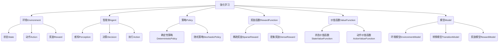

# 强化学习 原理与代码实例讲解

## 1. 背景介绍

### 1.1 问题的由来

在传统的机器学习领域中,监督学习和无监督学习占据了主导地位。监督学习需要大量标注好的训练数据,而无监督学习则试图从未标注的数据中发现隐藏的模式和结构。然而,这两种方法都有其局限性,无法很好地解决一些复杂的决策序列问题。

强化学习(Reinforcement Learning)作为机器学习的一个新兴分支,为解决这类问题提供了一种全新的思路。它模拟了人类和动物通过反复试错、获取经验并不断优化决策的过程,旨在让智能体(Agent)通过与环境(Environment)的交互来学习如何做出最优决策,从而获得最大化的累积奖励。

### 1.2 研究现状

近年来,强化学习在多个领域取得了突破性的进展,尤其是在游戏领域。2016年,DeepMind的AlphaGo系统通过强化学习战胜了世界顶尖的围棋手李世石,震惊了全球。2019年,OpenAI的人工智能系统在对抗性视频游戏中超越了人类的表现水平。此外,强化学习也在机器人控制、自动驾驶、自然语言处理等领域展现出巨大的潜力。

然而,强化学习仍然面临诸多挑战,如探索与利用的权衡(Exploration-Exploitation Tradeoff)、奖励函数的设计、样本效率低下等。研究人员正在不断探索新的算法和技术来解决这些问题,使强化学习能够更好地应用于更广泛的领域。

### 1.3 研究意义

强化学习为构建通用人工智能(Artificial General Intelligence, AGI)系统提供了一种有前景的途径。与监督学习和无监督学习不同,强化学习不需要大量标注数据,而是通过与环境的交互来学习,这更接近于人类和动物的学习方式。此外,强化学习还能够处理连续的决策序列问题,这对于解决复杂的现实世界问题至关重要。

从理论层面上,强化学习融合了多个领域的知识,包括机器学习、控制理论、博弈论、运筹学等,为这些领域的交叉研究提供了新的视角和方法。从应用层面上,强化学习在游戏、机器人、自动驾驶、金融等领域展现出广阔的应用前景,有望带来颠覆性的影响。

### 1.4 本文结构

本文将全面介绍强化学习的基本原理、核心算法、数学模型以及实际应用。文章将分为以下几个部分:

1. 背景介绍
2. 核心概念与联系
3. 核心算法原理与具体操作步骤
4. 数学模型和公式详细讲解与举例说明
5. 项目实践:代码实例和详细解释说明
6. 实际应用场景
7. 工具和资源推荐
8. 总结:未来发展趋势与挑战
9. 附录:常见问题与解答

## 2. 核心概念与联系

强化学习(Reinforcement Learning)是一种基于奖惩机制的机器学习范式,它由以下几个核心概念组成:

- **环境(Environment)**: 智能体所处的外部世界,包含了状态(State)、动作(Action)和奖励(Reward)三个基本元素。
- **智能体(Agent)**: 与环境进行交互的主体,通过感知(Perception)、决策(Decision)和执行动作(Action)来学习获取最大化的累积奖励。
- **策略(Policy)**: 智能体在给定状态下选择动作的策略,可以是确定性策略(Deterministic Policy)或随机策略(Stochastic Policy)。
- **奖励函数(Reward Function)**: 定义了智能体执行某个动作后所获得的奖励或惩罚,可以是稀疏奖励(Sparse Reward)或密集奖励(Dense Reward)。
- **价值函数(Value Function)**: 评估给定状态或状态-动作对的长期累积奖励,包括状态价值函数(State Value Function)和动作价值函数(Action Value Function)。
- **模型(Model)**: 对环境的数学描述,包括环境模型(Environment Model)、转移模型(Transition Model)和奖励模型(Reward Model)。

这些概念之间存在着紧密的联系,共同构成了强化学习的基本框架。智能体通过与环境的交互,不断优化策略,以获取最大化的累积奖励。价值函数和模型则为智能体提供了评估和预测的能力,指导其做出最优决策。

## 3. 核心算法原理与具体操作步骤

强化学习中存在多种经典算法,本节将重点介绍其中两种最具代表性的算法:Q-Learning和策略梯度(Policy Gradient)算法。

### 3.1 算法原理概述

#### Q-Learning算法

Q-Learning是一种基于价值函数(Value Function)的强化学习算法,它通过不断更新动作价值函数(Action Value Function)来逼近最优策略。算法的核心思想是:在每一个时间步,智能体根据当前状态选择一个动作执行,然后观察到新的状态和奖励,并更新相应的动作价值函数。

#### 策略梯度算法

策略梯度(Policy Gradient)算法是一种基于策略(Policy)的强化学习算法,它直接对策略进行参数化,并通过梯度上升(Gradient Ascent)的方式来优化策略参数,从而获得最大化的累积奖励。与Q-Learning不同,策略梯度算法不需要维护价值函数,而是直接学习策略参数。

### 3.2 算法步骤详解

#### Q-Learning算法步骤

1. 初始化动作价值函数 $Q(s, a)$,对于所有的状态-动作对,设置初始值(通常为0)。
2. 对于每一个时间步:
    a. 根据当前状态 $s$ 和策略 $\pi$ 选择动作 $a$。
    b. 执行动作 $a$,观察到新的状态 $s'$ 和奖励 $r$。
    c. 更新动作价值函数 $Q(s, a)$:
    $$Q(s, a) \leftarrow Q(s, a) + \alpha \left[ r + \gamma \max_{a'} Q(s', a') - Q(s, a) \right]$$
    其中 $\alpha$ 是学习率, $\gamma$ 是折现因子。
3. 重复步骤2,直到收敛或达到停止条件。
4. 根据最终的动作价值函数 $Q(s, a)$ 得到最优策略 $\pi^*(s) = \arg\max_a Q(s, a)$。

#### 策略梯度算法步骤

1. 初始化策略参数 $\theta$。
2. 对于每一个时间步:
    a. 根据当前策略 $\pi_\theta(a|s)$ 选择动作 $a$。
    b. 执行动作 $a$,观察到新的状态 $s'$ 和奖励 $r$。
    c. 计算累积奖励 $G_t = \sum_{k=t}^{T} \gamma^{k-t} r_k$。
    d. 更新策略参数 $\theta$ 沿着梯度方向:
    $$\theta \leftarrow \theta + \alpha \nabla_\theta \log \pi_\theta(a_t|s_t) G_t$$
    其中 $\alpha$ 是学习率。
3. 重复步骤2,直到收敛或达到停止条件。

### 3.3 算法优缺点

#### Q-Learning算法

优点:
- 算法相对简单,易于理解和实现。
- 无需建模环境的转移概率和奖励函数,具有更好的泛化能力。
- 可以处理离散和连续的状态空间和动作空间。

缺点:
- 存在维数灾难(Curse of Dimensionality)问题,当状态空间和动作空间非常大时,算法效率会急剧下降。
- 需要维护一个巨大的动作价值函数表,存储空间需求较高。
- 探索与利用的权衡(Exploration-Exploitation Tradeoff)问题。

#### 策略梯度算法

优点:
- 可以直接优化策略参数,避免了维护价值函数的需求。
- 可以处理连续的动作空间,适用于控制问题。
- 具有较好的收敛性和稳定性。

缺点:
- 算法相对复杂,需要计算梯度,实现难度较高。
- 存在高方差问题,需要使用各种方法(如基线、优势估计等)来减小方差。
- 探索与利用的权衡问题依然存在。

### 3.4 算法应用领域

Q-Learning算法和策略梯度算法都有着广泛的应用领域:

- 游戏AI: 如AlphaGo、Atari游戏等。
- 机器人控制: 如机械臂控制、无人机导航等。
- 自动驾驶: 如车辆决策、路径规划等。
- 自然语言处理: 如对话系统、机器翻译等。
- 金融领域: 如投资组合优化、交易策略等。
- 推荐系统: 如个性化推荐、网页排序等。

总的来说,强化学习算法在需要进行序列决策的领域都有潜在的应用前景。

## 4. 数学模型和公式详细讲解与举例说明

### 4.1 数学模型构建

强化学习问题可以用马尔可夫决策过程(Markov Decision Process, MDP)来建模。一个MDP由以下五元组构成:

$$\langle \mathcal{S}, \mathcal{A}, \mathcal{P}, \mathcal{R}, \gamma \rangle$$

- $\mathcal{S}$: 状态集合(State Space)
- $\mathcal{A}$: 动作集合(Action Space)
- $\mathcal{P}$: 状态转移概率函数(State Transition Probability Function)
- $\mathcal{R}$: 奖励函数(Reward Function)
- $\gamma$: 折现因子(Discount Factor)

其中,状态转移概率函数 $\mathcal{P}$ 定义了在当前状态 $s$ 下执行动作 $a$ 后,转移到新状态 $s'$ 的概率:

$$\mathcal{P}_{ss'}^a = \mathbb{P}(s_{t+1}=s'|s_t=s, a_t=a)$$

奖励函数 $\mathcal{R}$ 定义了在当前状态 $s$ 下执行动作 $a$ 后,获得的即时奖励:

$$\mathcal{R}_s^a = \mathbb{E}[r_{t+1}|s_t=s, a_t=a]$$

折现因子 $\gamma \in [0, 1)$ 用于平衡当前奖励和未来奖励的权重,值越小表示越注重当前奖励。

在MDP框架下,强化学习的目标是找到一个最优策略 $\pi^*$,使得在该策略下的累积折现奖励期望值最大化:

$$\pi^* = \arg\max_\pi \mathbb{E}_\pi \left[ \sum_{t=0}^\infty \gamma^t r_t \right]$$

### 4.2 公式推导过程

#### 贝尔曼方程

贝尔曼方程(Bellman Equation)是强化学习中一个非常重要的等式,它将价值函数与即时奖励和未来奖励联系起来。

对于状态价值函数 $V(s)$,贝尔曼方程为:

$$V(s) = \mathbb{E}_\pi \left[ r_t + \gamma V(s_{t+1}) | s_t=s \right]$$

对于动作价值函数 $Q(s, a)$,贝尔曼方程为:

$$Q(s, a) = \mathbb{E}_\pi \left[ r_t + \