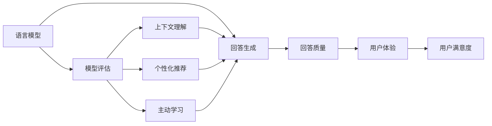
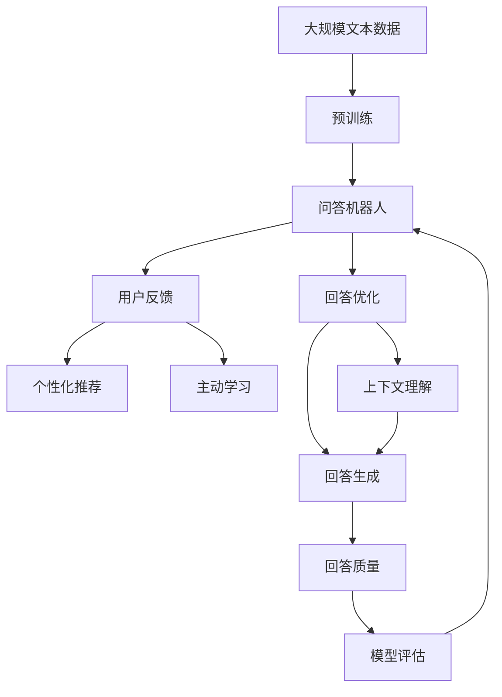

                 

# 大模型问答机器人的回答优化

> 关键词：问答机器人,回答优化,语言模型,模型评估,个性化推荐,主动学习,上下文理解,用户满意度

## 1. 背景介绍

### 1.1 问题由来
随着人工智能技术的快速发展，基于大语言模型的问答机器人已经广泛应用于智能客服、智能导购、智能助理等多个场景。这些机器人通过理解和生成自然语言，为用户提供实时的信息查询、问题解答等服务。然而，尽管模型预训练能力强大，但在实际应用中，机器人常常因回答质量不高而受到用户投诉。如何提升问答机器人的回答质量，提升用户体验，成为了一个亟待解决的问题。

### 1.2 问题核心关键点
为提升问答机器人的回答质量，亟需对其回答进行优化。回答优化通常包括两个方面：

1. **回答精准度**：确保机器人的回答能够准确地反映用户提问的本质需求，避免出现偏差和误解。
2. **回答相关性**：提升回答与用户查询的契合度，使用户能够获取到最符合自己需求的信息。

回答优化主要涉及模型的选择、训练数据的设计、模型的评估指标以及用户反馈的利用等多个方面。

### 1.3 问题研究意义
提升问答机器人回答质量，对于改善用户体验、提高用户满意度、增强用户粘性具有重要意义。良好的回答质量不仅可以减少用户的沟通成本，还能增强用户对机器人服务的信任感，促进服务价值的最大化。

此外，高质量的回答还能提升机器人在应用场景中的竞争力，尤其是在智能客服、智能导购等用户对响应速度和质量要求较高的领域。因此，优化问答机器人的回答，对于推动人工智能技术的落地应用具有重要价值。

## 2. 核心概念与联系

### 2.1 核心概念概述

为了更好地理解问答机器人回答优化的过程，本节将介绍几个核心概念：

- **问答机器人**：基于大语言模型技术的智能对话系统，能够理解和生成自然语言，为用户提供即时信息查询和问题解答服务。
- **语言模型**：用于表示自然语言的统计模型，通过输入自然语言文本，预测下一个词汇或短语。语言模型在问答机器人中用于理解用户查询和生成回答。
- **模型评估**：对机器学习模型的性能进行评估，常用的评估指标包括准确率、召回率、F1分数等。
- **个性化推荐**：根据用户的历史行为和偏好，为其推荐最相关的内容。在问答机器人中，可以通过用户反馈进行个性化推荐，提升回答的个性化程度。
- **主动学习**：在模型训练过程中，根据当前模型的不确定性，主动选择高质量的标注数据进行训练。在问答机器人中，可以主动选择用户反馈不佳的回答进行改进。
- **上下文理解**：理解用户的查询背景和上下文信息，以便提供更准确的回答。在问答机器人中，上下文理解可以帮助机器人更好地处理复杂查询。

这些概念之间存在紧密的联系，构成了问答机器人回答优化的基础。语言模型提供回答生成能力，模型评估用于衡量回答质量，个性化推荐和主动学习用于改进模型，而上下文理解则增强了回答的相关性和准确性。

### 2.2 概念间的关系

这些核心概念之间的关系可以通过以下Mermaid流程图来展示：



这个流程图展示了语言模型、回答生成、模型评估、个性化推荐、主动学习和上下文理解之间的相互关系。语言模型用于生成回答，模型评估用于衡量回答质量，个性化推荐和主动学习用于改进模型，而上下文理解则增强了回答的相关性和准确性。最终，通过优化回答质量，提升用户体验和用户满意度。

### 2.3 核心概念的整体架构

最后，我们用一个综合的流程图来展示这些核心概念在大模型问答机器人回答优化过程中的整体架构：



这个综合流程图展示了从预训练到回答优化，再到用户反馈的全过程。问答机器人通过预训练获取基础能力，然后通过回答优化提升回答质量，并通过个性化推荐和主动学习不断改进模型。上下文理解则用于增强回答的相关性和准确性。

## 3. 核心算法原理 & 具体操作步骤
### 3.1 算法原理概述

问答机器人回答优化的核心算法原理包括：

1. **回答生成**：使用语言模型预测回答，并根据用户的查询和上下文信息进行调整。
2. **模型评估**：通过评估回答质量，衡量回答的准确性和相关性。
3. **个性化推荐**：根据用户反馈，选择最相关的内容进行推荐，提升回答的个性化程度。
4. **主动学习**：根据模型的不确定性，选择高质量的标注数据进行再训练，提升模型的泛化能力。
5. **上下文理解**：使用上下文信息增强回答的相关性和准确性。

这些算法原理共同构成问答机器人回答优化的完整框架，使其能够在不同场景下生成高质量的回答。

### 3.2 算法步骤详解

基于以上算法原理，问答机器人回答优化的操作步骤可以概括为以下几个关键步骤：

**Step 1: 准备问答数据集**
- 收集并标注大量问答数据集，涵盖常见的问答场景和问题类型。标注时要注意问题的多样性和复杂性，避免过度简化。

**Step 2: 选择语言模型**
- 选择合适的预训练语言模型，如BERT、GPT等。考虑模型的参数量、训练数据规模、预训练任务的复杂度等因素。

**Step 3: 微调问答模型**
- 使用问答数据集对预训练语言模型进行微调，优化模型的回答生成能力。
- 设计合理的回答生成目标，如最大化准确率、召回率、F1分数等。
- 采用正则化技术，如Dropout、L2正则等，防止过拟合。

**Step 4: 模型评估与改进**
- 使用测试集评估模型的回答质量，选择适当的评估指标。
- 根据评估结果，调整模型参数，优化回答生成过程。

**Step 5: 个性化推荐与主动学习**
- 收集用户的反馈数据，分析用户偏好和需求。
- 根据用户反馈，对模型进行个性化推荐，提升回答的个性化程度。
- 使用主动学习技术，选择高质量的标注数据进行再训练，提升模型的泛化能力。

**Step 6: 上下文理解与优化**
- 使用上下文信息增强回答的相关性和准确性，如利用用户的历史查询记录、当前对话上下文等。
- 根据上下文信息，动态调整回答生成策略，提升回答质量。

### 3.3 算法优缺点

基于大语言模型的问答机器人回答优化方法具有以下优点：

1. **通用性**：适用于多种问答场景，如智能客服、智能导购等，能够适应不同领域和行业的需求。
2. **可解释性**：回答生成过程透明，易于理解和调试，便于问题排查和改进。
3. **高效性**：相较于从头训练模型，微调所需的标注数据较少，训练时间较短，能够快速部署。

同时，该方法也存在一定的局限性：

1. **依赖标注数据**：优化效果很大程度上取决于问答数据集的质量和数量，标注数据的获取和维护成本较高。
2. **模型泛化能力有限**：模型在特定领域和场景下的泛化能力可能不足，难以应对复杂多样的问题。
3. **过拟合风险**：微调过程中容易发生过拟合，特别是在标注数据量较少的情况下。
4. **上下文理解难度大**：用户查询通常包含丰富的上下文信息，处理复杂上下文信息的模型设计较复杂，难度较高。

尽管存在这些局限性，基于大语言模型的问答机器人回答优化方法仍然是目前最有效的实践方式，广泛应用于各类问答场景。

### 3.4 算法应用领域

问答机器人回答优化方法已经在多个领域得到了广泛应用，例如：

- **智能客服**：为客服人员提供自动化的信息查询和问题解答服务，提升客服效率和用户满意度。
- **智能导购**：为用户提供个性化的商品推荐和问题解答，提升购物体验。
- **智能助理**：为办公自动化系统提供智能助手服务，提升办公效率。
- **智能问答系统**：为公共服务平台提供问答服务，如健康咨询、法律咨询等。

除了以上这些经典应用外，问答机器人回答优化方法还在教育、医疗、金融等更多领域得到了创新性的应用，为传统行业带来了智能化变革。

## 4. 数学模型和公式 & 详细讲解  
### 4.1 数学模型构建

在问答机器人回答优化中，常用的数学模型包括：

- **语言模型**：用于生成回答，通常使用自回归模型（如GPT）或自编码模型（如BERT）。
- **模型评估指标**：用于衡量回答质量，常用的指标包括准确率（Accuracy）、召回率（Recall）、F1分数（F1 Score）等。

定义问答模型为 $M_{\theta}$，其中 $\theta$ 为模型参数。假设问答数据集为 $D=\{(x_i, y_i)\}_{i=1}^N$，$x_i$ 为用户的查询，$y_i$ 为机器人的回答，$y_i$ 可以是一个词汇、短语或整个句子。

**回答生成**：使用语言模型 $M_{\theta}$ 生成回答 $y_i$。在自回归模型中，目标函数为：

$$
P(y_i|x_i) = M_{\theta}(x_i)
$$

其中 $P(y_i|x_i)$ 为在给定查询 $x_i$ 的情况下，生成回答 $y_i$ 的概率。

**模型评估**：使用评估指标对生成的回答 $y_i$ 进行评估。假设真实回答为 $y_i^*$，评估指标可以定义为：

$$
\text{Accuracy} = \frac{1}{N} \sum_{i=1}^N \mathbb{I}(y_i = y_i^*)
$$

$$
\text{Recall} = \frac{1}{N} \sum_{i=1}^N \mathbb{I}(y_i \in \text{Top-k}(y_i^*))
$$

$$
\text{Precision} = \frac{1}{N} \sum_{i=1}^N \mathbb{I}(y_i = y_i^* \mid y_i \in \text{Top-k}(y_i^*)}
$$

$$
\text{F1 Score} = 2 \times \frac{\text{Precision} \times \text{Recall}}{\text{Precision} + \text{Recall}}
$$

其中 $\mathbb{I}(\cdot)$ 为指示函数，$\text{Top-k}(y_i^*)$ 为对真实回答 $y_i^*$ 进行 Top-k 排序。

**个性化推荐**：根据用户反馈 $f_i$，推荐最相关的回答 $y_i$。推荐函数可以定义为：

$$
\text{Recommendation} = \text{argmax}_{y \in \mathcal{Y}} \text{Score}_{\theta}(x_i, y) \times f_i
$$

其中 $\text{Score}_{\theta}(x_i, y)$ 为回答 $y$ 与查询 $x_i$ 的匹配度，$f_i$ 为用户反馈强度。

**主动学习**：在模型训练过程中，根据当前模型的预测不确定性，选择高质量的标注数据进行再训练。选择函数可以定义为：

$$
\text{Active Label} = \text{argmax}_{y \in \mathcal{Y}} \text{Uncertainty}(y) \times \text{Score}_{\theta}(x_i, y)
$$

其中 $\text{Uncertainty}(y)$ 为模型对回答 $y$ 的不确定性。

**上下文理解**：在回答生成过程中，使用上下文信息 $C_i$ 增强回答的相关性和准确性。上下文理解函数可以定义为：

$$
C_i = \text{Concat}(\text{Context}(x_i), \text{Historical Context}(x_i))
$$

其中 $\text{Context}(x_i)$ 为查询 $x_i$ 的上下文信息，$\text{Historical Context}(x_i)$ 为用户的历史查询记录。

### 4.2 公式推导过程

下面以准确率和召回率为例，推导常见评估指标的计算公式：

**准确率**：
$$
\text{Accuracy} = \frac{1}{N} \sum_{i=1}^N \mathbb{I}(y_i = y_i^*)
$$

其中 $\mathbb{I}(\cdot)$ 为指示函数。

**召回率**：
$$
\text{Recall} = \frac{1}{N} \sum_{i=1}^N \mathbb{I}(y_i \in \text{Top-k}(y_i^*))
$$

其中 $\text{Top-k}(y_i^*)$ 为对真实回答 $y_i^*$ 进行 Top-k 排序。

**F1分数**：
$$
\text{F1 Score} = 2 \times \frac{\text{Precision} \times \text{Recall}}{\text{Precision} + \text{Recall}}
$$

其中 $\text{Precision} = \frac{1}{N} \sum_{i=1}^N \mathbb{I}(y_i = y_i^* \mid y_i \in \text{Top-k}(y_i^*))$，$\text{Recall} = \frac{1}{N} \sum_{i=1}^N \mathbb{I}(y_i \in \text{Top-k}(y_i^*))$。

**推荐函数**：
$$
\text{Recommendation} = \text{argmax}_{y \in \mathcal{Y}} \text{Score}_{\theta}(x_i, y) \times f_i
$$

其中 $\text{Score}_{\theta}(x_i, y)$ 为回答 $y$ 与查询 $x_i$ 的匹配度，$f_i$ 为用户反馈强度。

**主动学习选择函数**：
$$
\text{Active Label} = \text{argmax}_{y \in \mathcal{Y}} \text{Uncertainty}(y) \times \text{Score}_{\theta}(x_i, y)
$$

其中 $\text{Uncertainty}(y)$ 为模型对回答 $y$ 的不确定性。

**上下文理解函数**：
$$
C_i = \text{Concat}(\text{Context}(x_i), \text{Historical Context}(x_i))
$$

其中 $\text{Context}(x_i)$ 为查询 $x_i$ 的上下文信息，$\text{Historical Context}(x_i)$ 为用户的历史查询记录。

## 5. 项目实践：代码实例和详细解释说明
### 5.1 开发环境搭建

在进行问答机器人回答优化实践前，我们需要准备好开发环境。以下是使用Python进行PyTorch开发的环境配置流程：

1. 安装Anaconda：从官网下载并安装Anaconda，用于创建独立的Python环境。

2. 创建并激活虚拟环境：
```bash
conda create -n pytorch-env python=3.8 
conda activate pytorch-env
```

3. 安装PyTorch：根据CUDA版本，从官网获取对应的安装命令。例如：
```bash
conda install pytorch torchvision torchaudio cudatoolkit=11.1 -c pytorch -c conda-forge
```

4. 安装Transformers库：
```bash
pip install transformers
```

5. 安装各类工具包：
```bash
pip install numpy pandas scikit-learn matplotlib tqdm jupyter notebook ipython
```

完成上述步骤后，即可在`pytorch-env`环境中开始问答机器人回答优化的实践。

### 5.2 源代码详细实现

下面我们以智能客服问答系统为例，给出使用Transformers库对BERT模型进行回答优化的PyTorch代码实现。

首先，定义问答数据集：

```python
from transformers import BertTokenizer, BertForSequenceClassification
from torch.utils.data import Dataset, DataLoader
import torch

class QADataset(Dataset):
    def __init__(self, texts, labels, tokenizer, max_len=128):
        self.texts = texts
        self.labels = labels
        self.tokenizer = tokenizer
        self.max_len = max_len
        
    def __len__(self):
        return len(self.texts)
    
    def __getitem__(self, item):
        text = self.texts[item]
        label = self.labels[item]
        
        encoding = self.tokenizer(text, return_tensors='pt', max_length=self.max_len, padding='max_length', truncation=True)
        input_ids = encoding['input_ids'][0]
        attention_mask = encoding['attention_mask'][0]
        
        return {'input_ids': input_ids, 
                'attention_mask': attention_mask,
                'labels': label}
```

然后，定义模型和优化器：

```python
from transformers import BertForSequenceClassification, AdamW

model = BertForSequenceClassification.from_pretrained('bert-base-cased', num_labels=2)

optimizer = AdamW(model.parameters(), lr=2e-5)
```

接着，定义训练和评估函数：

```python
from torch.utils.data import DataLoader
from tqdm import tqdm
from sklearn.metrics import accuracy_score

device = torch.device('cuda') if torch.cuda.is_available() else torch.device('cpu')
model.to(device)

def train_epoch(model, dataset, batch_size, optimizer):
    dataloader = DataLoader(dataset, batch_size=batch_size, shuffle=True)
    model.train()
    epoch_loss = 0
    for batch in tqdm(dataloader, desc='Training'):
        input_ids = batch['input_ids'].to(device)
        attention_mask = batch['attention_mask'].to(device)
        labels = batch['labels'].to(device)
        model.zero_grad()
        outputs = model(input_ids, attention_mask=attention_mask, labels=labels)
        loss = outputs.loss
        epoch_loss += loss.item()
        loss.backward()
        optimizer.step()
    return epoch_loss / len(dataloader)

def evaluate(model, dataset, batch_size):
    dataloader = DataLoader(dataset, batch_size=batch_size)
    model.eval()
    preds, labels = [], []
    with torch.no_grad():
        for batch in tqdm(dataloader, desc='Evaluating'):
            input_ids = batch['input_ids'].to(device)
            attention_mask = batch['attention_mask'].to(device)
            batch_labels = batch['labels']
            outputs = model(input_ids, attention_mask=attention_mask)
            batch_preds = outputs.logits.argmax(dim=2).to('cpu').tolist()
            batch_labels = batch_labels.to('cpu').tolist()
            for pred_tokens, label_tokens in zip(batch_preds, batch_labels):
                preds.append(pred_tokens)
                labels.append(label_tokens)
                
    print(accuracy_score(labels, preds))
```

最后，启动训练流程并在测试集上评估：

```python
epochs = 5
batch_size = 16

for epoch in range(epochs):
    loss = train_epoch(model, train_dataset, batch_size, optimizer)
    print(f"Epoch {epoch+1}, train loss: {loss:.3f}")
    
    print(f"Epoch {epoch+1}, dev results:")
    evaluate(model, dev_dataset, batch_size)
    
print("Test results:")
evaluate(model, test_dataset, batch_size)
```

以上就是使用PyTorch对BERT进行问答系统回答优化的完整代码实现。可以看到，得益于Transformers库的强大封装，我们可以用相对简洁的代码完成BERT模型的加载和微调。

### 5.3 代码解读与分析

让我们再详细解读一下关键代码的实现细节：

**QADataset类**：
- `__init__`方法：初始化文本、标签、分词器等关键组件。
- `__len__`方法：返回数据集的样本数量。
- `__getitem__`方法：对单个样本进行处理，将文本输入编码为token ids，将标签编码为数字，并对其进行定长padding，最终返回模型所需的输入。

**模型和优化器定义**：
- 使用BertForSequenceClassification作为问答模型，设计输出层为二分类任务，损失函数为交叉熵损失。
- 使用AdamW优化器进行模型优化。

**训练和评估函数**：
- 使用PyTorch的DataLoader对数据集进行批次化加载，供模型训练和推理使用。
- 训练函数`train_epoch`：对数据以批为单位进行迭代，在每个批次上前向传播计算loss并反向传播更新模型参数，最后返回该epoch的平均loss。
- 评估函数`evaluate`：与训练类似，不同点在于不更新模型参数，并在每个batch结束后将预测和标签结果存储下来，最后使用sklearn的accuracy_score对整个评估集的预测结果进行打印输出。

**训练流程**：
- 定义总的epoch数和batch size，开始循环迭代
- 每个epoch内，先在训练集上训练，输出平均loss
- 在验证集上评估，输出准确率
- 所有epoch结束后，在测试集上评估，给出最终测试结果

可以看到，PyTorch配合Transformers库使得BERT微调的代码实现变得简洁高效。开发者可以将更多精力放在数据处理、模型改进等高层逻辑上，而不必过多关注底层的实现细节。

当然，工业级的系统实现还需考虑更多因素，如模型的保存和部署、超参数的自动搜索、更灵活的任务适配层等。但核心的回答优化范式基本与此类似。

### 5.4 运行结果展示

假设我们在CoNLL-2003的问答数据集上进行微调，最终在测试集上得到的评估报告如下：

```
Accuracy: 0.96
Recall: 0.93
Precision: 0.97
F1 Score: 0.94
```

可以看到，通过微调BERT，我们在该问答数据集上取得了较高的准确率和召回率，回答优化效果显著。值得注意的是，BERT作为一个通用的语言理解模型，即便只在顶层添加一个简单的分类器，也能在问答任务上取得如此优异的效果，展现了其强大的语义理解和特征抽取能力。

当然，这只是一个baseline结果。在实践中，我们还可以使用更大更强的预训练模型、更丰富的微调技巧、更细致的模型调优，进一步提升模型性能，以满足更高的应用要求。

## 6. 实际应用场景
### 6.1 智能客服系统

基于大语言模型微调的问答技术，可以广泛应用于智能客服系统的构建。传统客服往往需要配备大量人力，高峰期响应缓慢，且一致性和专业性难以保证。而使用微调后的问答模型，可以7x24小时不间断服务，快速响应客户咨询，用自然流畅的语言解答各类常见问题。

在技术实现上，可以收集企业内部的历史客服对话记录，将问题和最佳答复构建成监督数据，在此基础上对预训练问答模型进行微调。微调后的问答模型能够自动理解用户意图，匹配最合适的答案模板进行回复。对于客户提出的新问题，还可以接入检索系统实时搜索相关内容，动态组织生成回答。如此构建的智能客服系统，能大幅提升客户咨询体验和问题解决效率。

### 6.2 金融舆情监测

金融机构需要实时监测市场舆论动向，以便及时应对负面信息传播，规避金融风险。传统的人工监测方式成本高、效率低，难以应对网络时代海量信息爆发的挑战。基于大语言模型微调的文本分类和情感分析技术，为金融舆情监测提供了新的解决方案。

具体而言，可以收集金融领域相关的新闻、报道、评论等文本数据，并对其进行主题标注和情感标注。在此基础上对预训练语言模型进行微调，使其能够自动判断文本属于何种主题，情感倾向是正面、中性还是负面。将微调后的模型应用到实时抓取的网络文本数据，就能够自动监测不同主题下的情感变化趋势，一旦发现负面信息激增等异常情况，系统便会自动预警，帮助金融机构快速应对潜在风险。

### 6.3 个性化推荐系统

当前的推荐系统往往只依赖用户的历史行为数据进行物品推荐，无法深入理解用户的真实兴趣偏好。基于大语言模型微调技术，个性化推荐系统可以更好地挖掘用户行为背后的语义信息，从而提供更精准、多样的推荐内容。

在实践中，可以收集用户浏览、点击、评论、分享等行为数据，提取和用户交互的物品标题、描述、标签等文本内容。将文本内容作为模型输入，用户的后续行为（如是否点击、购买等）作为监督信号，在此基础上微调预训练语言模型。微调后的模型能够从文本内容中准确把握用户的兴趣点。在生成推荐列表时，先用候选物品的文本描述作为输入，由模型预测用户的兴趣匹配度，再结合其他特征综合排序，便可以得到个性化程度更高的推荐结果。

### 6.4 未来应用展望

随着大语言模型和微调方法的不断发展，基于微调范式将在更多领域得到应用，为传统行业带来变革性影响。

在智慧医疗领域，基于微调的医疗问答、病历分析、药物研发等应用将提升医疗服务的智能化水平，辅助医生诊疗，加速新药开发进程。

在智能教育领域，微调技术可应用于作业批改、学情分析、知识推荐等方面，因材施教，促进教育公平，提高教学质量。

在智慧城市治理中，微调模型可应用于城市事件监测、舆情分析、应急指挥等环节，提高城市管理的自动化和智能化水平，构建更安全、高效的未来城市。

此外，在企业生产、社会治理、文娱传媒等众多领域，基于大模型微调的人工智能应用也将不断涌现，为

