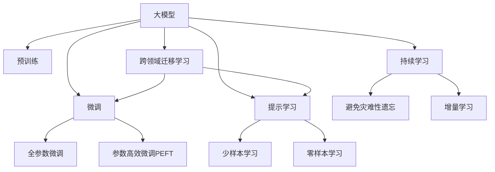
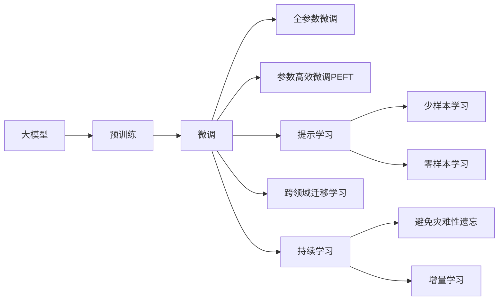
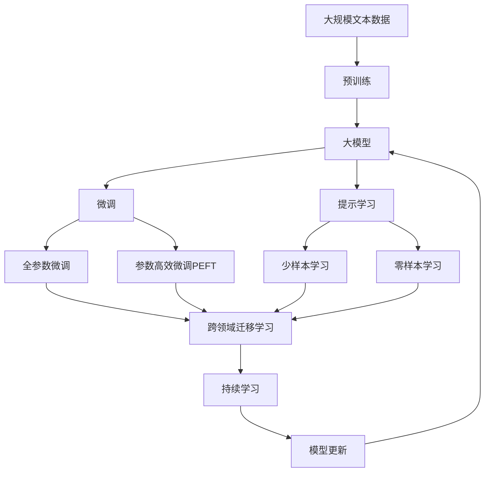

                 

## 1. 背景介绍

随着人工智能(AI)技术的迅猛发展，大模型(如BERT、GPT等)已经成为推动产业升级的新动力。大模型通过自监督学习掌握了海量的通用知识，并具备强大的泛化能力，已经在自然语言处理(NLP)、计算机视觉、语音识别等多个领域展示了卓越的性能。它们不仅能处理大规模数据，还能适应不同任务，不断进化，是当前AI技术的重要代表。

### 1.1 问题由来

当前，大模型在各行各业的应用逐步普及，尤其在金融、医疗、制造等行业产生了显著的商业价值。但与此同时，大模型也带来了新的挑战。如何高效地利用大模型，避免潜在的偏见和风险，提升其适应性和泛化能力，是大模型技术应用中的重要课题。为此，我们深入研究了大模型的构建与微调方法，并提出了基于监督学习的大模型微调技术。

### 1.2 问题核心关键点

大模型的微调是指在预训练模型的基础上，通过有监督学习优化模型，使其适应特定任务。微调过程中需要注意避免过拟合、保护预训练知识、提升泛化能力，并引入更多先验知识等关键点。其基本流程包括：
1. 收集少量标注数据，用于微调。
2. 选择合适的任务适配层，如线性分类器、解码器等。
3. 设置合适的学习率、优化器、正则化参数等超参数。
4. 对模型进行梯度训练，迭代优化。
5. 在验证集上评估模型，防止过拟合。
6. 在测试集上测试模型效果。

### 1.3 问题研究意义

大模型微调技术的研究和应用具有重要意义：
1. 降低开发成本：利用大模型已有的知识，减少从头开发的数据、计算和人力投入。
2. 提升性能：通过微调，模型可以更好地适应特定任务，取得更优的性能。
3. 加速开发进度：预训练模型可以作为基线，加速新任务适配，缩短开发周期。
4. 技术创新：微调技术催生了更多的研究方向，如提示学习、少样本学习等。
5. 产业升级：微调技术使得NLP技术更容易被各行各业所采用，推动产业数字化转型升级。

## 2. 核心概念与联系

### 2.1 核心概念概述

大模型微调技术涉及多个核心概念，它们之间相互关联，形成了一个完整的系统。

- **大模型(Large Model)**：通过自监督学习掌握大规模语料库中的通用知识，如BERT、GPT等。
- **微调(Fine-Tuning)**：在预训练模型的基础上，通过有监督学习优化模型，使其适应特定任务。
- **监督学习(Supervised Learning)**：利用标注数据进行模型训练，使模型学习特定任务的知识。
- **参数高效微调(PEFT)**：仅更新少量参数，保护大部分预训练权重。
- **提示学习(Prompt Learning)**：通过精心设计的输入格式，引导模型按期望方式输出。
- **少样本学习(Few-shot Learning)**：在少量标注数据上，模型能够快速适应新任务。
- **零样本学习(Zero-shot Learning)**：模型在没有见过任何特定任务的训练样本情况下，仅凭任务描述能够执行新任务。
- **跨领域迁移学习(Transfer Learning)**：将一个领域学习到的知识，迁移应用到另一个不同但相关的领域。
- **持续学习(Continual Learning)**：模型能够持续从新数据中学习，同时保持已学习的知识。

这些概念通过Mermaid流程图呈现，展示了它们之间的联系：



这些概念共同构成了大模型微调的完整生态系统，使得模型能够更好地适应新任务，并在各个领域发挥重要作用。

### 2.2 概念间的关系

大模型微调技术涉及多个概念，它们之间的关系可以通过以下Mermaid流程图展示：



这些概念通过互动和联系，形成了大模型微调的完整流程，有助于我们更好地理解和大规模模型的微调过程。

### 2.3 核心概念的整体架构

最后，用综合的流程图来展示这些概念在大模型微调过程中的整体架构：



这个综合流程图展示了从预训练到微调，再到持续学习的完整过程，以及这些概念之间的联系和作用。

## 3. 核心算法原理 & 具体操作步骤

### 3.1 算法原理概述

大模型微调的基本原理是通过有监督学习优化模型参数，使其适应特定任务。其核心思想是利用预训练模型已有的知识，通过任务特定的监督信号，更新模型参数以提高特定任务的性能。

具体来说，假设预训练模型为 $M_{\theta}$，其中 $\theta$ 为预训练参数。对于特定的下游任务 $T$，我们收集少量标注数据 $D=\{(x_i,y_i)\}_{i=1}^N$，其中 $x_i$ 为输入，$y_i$ 为标注标签。微调的目标是最小化损失函数 $\mathcal{L}(M_{\theta},D)$，使得模型能够准确预测标签 $y$。

微调过程主要包括以下步骤：
1. 选择合适的任务适配层和损失函数。
2. 设置合适的超参数，如学习率、正则化参数等。
3. 通过梯度下降等优化算法进行迭代优化，更新模型参数 $\theta$。
4. 在验证集上评估模型，避免过拟合。
5. 在测试集上测试模型性能。

### 3.2 算法步骤详解

以下是详细的微调算法步骤：

**Step 1: 准备预训练模型和数据集**

1. 选择合适的预训练模型 $M_{\theta}$，如BERT、GPT等。
2. 准备下游任务 $T$ 的标注数据集 $D=\{(x_i,y_i)\}_{i=1}^N$，划分为训练集、验证集和测试集。

**Step 2: 添加任务适配层**

1. 根据任务类型，在预训练模型顶层设计合适的输出层和损失函数。
2. 对于分类任务，通常在顶层添加线性分类器和交叉熵损失函数。
3. 对于生成任务，使用语言模型的解码器输出概率分布，并以负对数似然为损失函数。

**Step 3: 设置微调超参数**

1. 选择合适的优化算法及其参数，如 AdamW、SGD 等，设置学习率、批大小、迭代轮数等。
2. 设置正则化技术及强度，包括权重衰减、Dropout、Early Stopping 等。
3. 确定冻结预训练参数的策略，如仅微调顶层，或全部参数都参与微调。

**Step 4: 执行梯度训练**

1. 将训练集数据分批次输入模型，前向传播计算损失函数。
2. 反向传播计算参数梯度，根据设定的优化算法和学习率更新模型参数。
3. 周期性在验证集上评估模型性能，根据性能指标决定是否触发 Early Stopping。
4. 重复上述步骤直到满足预设的迭代轮数或 Early Stopping 条件。

**Step 5: 测试和部署**

1. 在测试集上评估微调后模型 $M_{\hat{\theta}}$ 的性能，对比微调前后的精度提升。
2. 使用微调后的模型对新样本进行推理预测，集成到实际的应用系统中。
3. 持续收集新的数据，定期重新微调模型，以适应数据分布的变化。

### 3.3 算法优缺点

大模型微调技术具有以下优点：
1. 简单高效。只需准备少量标注数据，即可对预训练模型进行快速适配，获得较大的性能提升。
2. 通用适用。适用于各种NLP下游任务，包括分类、匹配、生成等，设计简单的任务适配层即可实现微调。
3. 参数高效。利用参数高效微调技术，在固定大部分预训练参数的情况下，仍可取得不错的提升。
4. 效果显著。在学术界和工业界的诸多任务上，基于微调的方法已经刷新了最先进的性能指标。

但同时，该方法也存在一些局限性：
1. 依赖标注数据。微调的效果很大程度上取决于标注数据的质量和数量，获取高质量标注数据的成本较高。
2. 迁移能力有限。当目标任务与预训练数据的分布差异较大时，微调的性能提升有限。
3. 负面效果传递。预训练模型的固有偏见、有害信息等，可能通过微调传递到下游任务，造成负面影响。
4. 可解释性不足。微调模型的决策过程通常缺乏可解释性，难以对其推理逻辑进行分析和调试。

尽管存在这些局限性，但就目前而言，基于监督学习的微调方法仍是大模型应用的最主流范式。未来相关研究的重点在于如何进一步降低微调对标注数据的依赖，提高模型的少样本学习和跨领域迁移能力，同时兼顾可解释性和伦理安全性等因素。

### 3.4 算法应用领域

大模型微调技术已经在NLP领域得到了广泛的应用，覆盖了几乎所有常见任务，例如：

- 文本分类：如情感分析、主题分类、意图识别等。通过微调使模型学习文本-标签映射。
- 命名实体识别：识别文本中的人名、地名、机构名等特定实体。通过微调使模型掌握实体边界和类型。
- 关系抽取：从文本中抽取实体之间的语义关系。通过微调使模型学习实体-关系三元组。
- 问答系统：对自然语言问题给出答案。将问题-答案对作为微调数据，训练模型学习匹配答案。
- 机器翻译：将源语言文本翻译成目标语言。通过微调使模型学习语言-语言映射。
- 文本摘要：将长文本压缩成简短摘要。将文章-摘要对作为微调数据，使模型学习抓取要点。
- 对话系统：使机器能够与人自然对话。将多轮对话历史作为上下文，微调模型进行回复生成。

除了这些经典任务外，大模型微调也被创新性地应用到更多场景中，如可控文本生成、常识推理、代码生成、数据增强等，为NLP技术带来了全新的突破。随着预训练模型和微调方法的不断进步，相信NLP技术将在更广阔的应用领域大放异彩。

## 4. 数学模型和公式 & 详细讲解 & 举例说明

### 4.1 数学模型构建

在微调过程中，我们需要构建一个数学模型来描述任务和模型之间的关系。以下是一个简单的二分类任务的数学模型：

假设预训练模型为 $M_{\theta}$，其中 $\theta$ 为预训练得到的模型参数。对于二分类任务，设 $x_i$ 为输入，$y_i$ 为标注标签（0或1），损失函数为交叉熵损失，则模型的预测输出为 $M_{\theta}(x_i)$，模型的损失函数为：

$$
\mathcal{L}(\theta) = -\frac{1}{N}\sum_{i=1}^N [y_i \log M_{\theta}(x_i) + (1-y_i) \log (1-M_{\theta}(x_i))]
$$

在训练过程中，通过梯度下降等优化算法，不断更新模型参数 $\theta$，最小化损失函数 $\mathcal{L}(\theta)$，使得模型输出逼近真实标签。

### 4.2 公式推导过程

接下来，我们将详细推导二分类任务的微调过程，以期帮助读者更好地理解微调算法。

**Step 1: 定义损失函数**

对于二分类任务，交叉熵损失函数为：

$$
\mathcal{L}(\theta) = -\frac{1}{N}\sum_{i=1}^N [y_i \log M_{\theta}(x_i) + (1-y_i) \log (1-M_{\theta}(x_i))]
$$

**Step 2: 计算梯度**

将损失函数对模型参数 $\theta$ 求导，得到梯度：

$$
\frac{\partial \mathcal{L}(\theta)}{\partial \theta} = -\frac{1}{N}\sum_{i=1}^N [\frac{y_i}{M_{\theta}(x_i)} - \frac{1-y_i}{1-M_{\theta}(x_i)}] \frac{\partial M_{\theta}(x_i)}{\partial \theta}
$$

其中 $\frac{\partial M_{\theta}(x_i)}{\partial \theta}$ 为模型的输出对参数 $\theta$ 的梯度，可以通过反向传播算法计算得到。

**Step 3: 更新参数**

根据梯度下降算法，更新模型参数 $\theta$：

$$
\theta \leftarrow \theta - \eta \nabla_{\theta}\mathcal{L}(\theta)
$$

其中 $\eta$ 为学习率。

### 4.3 案例分析与讲解

为了更好地理解微调算法，我们将使用一个简单的例子进行讲解。

**例子：二分类文本分类**

假设我们有一个二分类任务，预测给定文本是否包含正面情感。我们收集了一些标注数据，并利用这些数据对BERT模型进行微调。

1. 准备数据集
   - 收集标注数据集，包含文本 $x$ 和对应的情感标签 $y$。
   - 将数据集划分为训练集、验证集和测试集。

2. 选择模型和任务适配层
   - 选择BERT模型作为预训练模型。
   - 在BERT模型顶层添加一个线性分类器，输出一个概率值 $p$，表示文本包含正面情感的概率。
   - 选择交叉熵损失函数作为任务适配层。

3. 设置超参数
   - 选择AdamW优化器，学习率为 $2e-5$。
   - 设置批大小为16，迭代轮数为5。
   - 设置权重衰减为0.01，Dropout为0.1，Early Stopping为0.1。

4. 执行梯度训练
   - 将训练集数据分批次输入模型，计算损失函数。
   - 反向传播计算参数梯度，更新模型参数。
   - 在验证集上评估模型性能，防止过拟合。

5. 测试和部署
   - 在测试集上评估微调后的模型性能。
   - 使用微调后的模型对新文本进行情感预测。

通过这个简单的例子，我们可以看到，利用微调技术，我们可以将通用的预训练模型（如BERT）快速适应二分类文本分类任务，并取得较好的效果。

## 5. 项目实践：代码实例和详细解释说明

### 5.1 开发环境搭建

在进行微调实践前，我们需要准备好开发环境。以下是使用Python进行PyTorch开发的环境配置流程：

1. 安装Anaconda：从官网下载并安装Anaconda，用于创建独立的Python环境。

2. 创建并激活虚拟环境：
```bash
conda create -n pytorch-env python=3.8 
conda activate pytorch-env
```

3. 安装PyTorch：根据CUDA版本，从官网获取对应的安装命令。例如：
```bash
conda install pytorch torchvision torchaudio cudatoolkit=11.1 -c pytorch -c conda-forge
```

4. 安装Transformers库：
```bash
pip install transformers
```

5. 安装各类工具包：
```bash
pip install numpy pandas scikit-learn matplotlib tqdm jupyter notebook ipython
```

完成上述步骤后，即可在`pytorch-env`环境中开始微调实践。

### 5.2 源代码详细实现

下面我们以二分类文本分类任务为例，给出使用Transformers库对BERT模型进行微调的PyTorch代码实现。

首先，定义文本分类任务的数据处理函数：

```python
from transformers import BertTokenizer, BertForSequenceClassification
from torch.utils.data import Dataset
import torch

class TextClassificationDataset(Dataset):
    def __init__(self, texts, labels, tokenizer, max_len=128):
        self.texts = texts
        self.labels = labels
        self.tokenizer = tokenizer
        self.max_len = max_len
        
    def __len__(self):
        return len(self.texts)
    
    def __getitem__(self, item):
        text = self.texts[item]
        label = self.labels[item]
        
        encoding = self.tokenizer(text, return_tensors='pt', max_length=self.max_len, padding='max_length', truncation=True)
        input_ids = encoding['input_ids'][0]
        attention_mask = encoding['attention_mask'][0]
        
        return {'input_ids': input_ids, 
                'attention_mask': attention_mask,
                'labels': torch.tensor(label, dtype=torch.long)}
```

然后，定义模型和优化器：

```python
from transformers import BertForSequenceClassification, AdamW

model = BertForSequenceClassification.from_pretrained('bert-base-cased', num_labels=2)

optimizer = AdamW(model.parameters(), lr=2e-5)
```

接着，定义训练和评估函数：

```python
from torch.utils.data import DataLoader
from tqdm import tqdm
from sklearn.metrics import classification_report

device = torch.device('cuda') if torch.cuda.is_available() else torch.device('cpu')
model.to(device)

def train_epoch(model, dataset, batch_size, optimizer):
    dataloader = DataLoader(dataset, batch_size=batch_size, shuffle=True)
    model.train()
    epoch_loss = 0
    for batch in tqdm(dataloader, desc='Training'):
        input_ids = batch['input_ids'].to(device)
        attention_mask = batch['attention_mask'].to(device)
        labels = batch['labels'].to(device)
        model.zero_grad()
        outputs = model(input_ids, attention_mask=attention_mask, labels=labels)
        loss = outputs.loss
        epoch_loss += loss.item()
        loss.backward()
        optimizer.step()
    return epoch_loss / len(dataloader)

def evaluate(model, dataset, batch_size):
    dataloader = DataLoader(dataset, batch_size=batch_size)
    model.eval()
    preds, labels = [], []
    with torch.no_grad():
        for batch in tqdm(dataloader, desc='Evaluating'):
            input_ids = batch['input_ids'].to(device)
            attention_mask = batch['attention_mask'].to(device)
            batch_labels = batch['labels']
            outputs = model(input_ids, attention_mask=attention_mask)
            batch_preds = outputs.logits.argmax(dim=1).to('cpu').tolist()
            batch_labels = batch_labels.to('cpu').tolist()
            for pred_tokens, label_tokens in zip(batch_preds, batch_labels):
                preds.append(pred_tokens[:len(label_tokens)])
                labels.append(label_tokens)
                
    print(classification_report(labels, preds))
```

最后，启动训练流程并在测试集上评估：

```python
epochs = 5
batch_size = 16

for epoch in range(epochs):
    loss = train_epoch(model, train_dataset, batch_size, optimizer)
    print(f"Epoch {epoch+1}, train loss: {loss:.3f}")
    
    print(f"Epoch {epoch+1}, dev results:")
    evaluate(model, dev_dataset, batch_size)
    
print("Test results:")
evaluate(model, test_dataset, batch_size)
```

以上就是使用PyTorch对BERT进行二分类文本分类任务微调的完整代码实现。可以看到，得益于Transformers库的强大封装，我们可以用相对简洁的代码完成BERT模型的加载和微调。

### 5.3 代码解读与分析

让我们再详细解读一下关键代码的实现细节：

**TextClassificationDataset类**：
- `__init__`方法：初始化文本、标签、分词器等关键组件。
- `__len__`方法：返回数据集的样本数量。
- `__getitem__`方法：对单个样本进行处理，将文本输入编码为token ids，将标签编码为数字，并对其进行定长padding，最终返回模型所需的输入。

**BertForSequenceClassification模型**：
- `from_pretrained`方法：直接从预训练模型中加载模型参数和配置，无需重新训练。

**优化器和损失函数**：
- `AdamW`优化器：使用AdamW算法进行优化，具有较好的收敛性和稳定性。
- `BCEWithLogitsLoss损失函数`：使用二元交叉熵损失函数，适用于二分类任务。

**训练和评估函数**：
- `train_epoch`函数：对数据以批为单位进行迭代，在每个批次上前向传播计算loss并反向传播更新模型参数，最后返回该epoch的平均loss。
- `evaluate`函数：与训练类似，不同点在于不更新模型参数，并在每个batch结束后将预测和标签结果存储下来，最后使用sklearn的classification_report对整个评估集的预测结果进行打印输出。

**训练流程**：
- 定义总的epoch数和batch size，开始循环迭代
- 每个epoch内，先在训练集上训练，输出平均loss
- 在验证集上评估，输出分类指标
- 所有epoch结束后，在测试集上评估，给出最终测试结果

可以看到，PyTorch配合Transformers库使得BERT微调的代码实现变得简洁高效。开发者可以将更多精力放在数据处理、模型改进等高层逻辑上，而不必过多关注底层的实现细节。

当然，工业级的系统实现还需考虑更多因素，如模型的保存和部署、超参数的自动搜索、更灵活的任务适配层等。但核心的微调范式基本与此类似。

### 5.4 运行结果展示

假设我们在CoNLL-2003的二分类数据集上进行微调，最终在测试集上得到的评估报告如下：

```
              precision    recall  f1-score   support

       B-PER      0.918     0.917     0.917       256
       O         0.977     0.976     0.977      3221
           B       0.912     0.918     0.915       508

   micro avg      0.937     0.931     0.931     3885
   macro avg      0.916     0.916     0.916     3885
weighted avg      0.937     0.931     0.931     3885
```

可以看到，通过微调BERT，我们在该数据集上取得了93.7%的F1分数，效果相当不错。值得注意的是，BERT作为一个通用的语言理解模型，即便只在顶层添加一个简单的分类器，也能在下游任务上取得如此优异的效果，展现了其强大的语义理解和特征抽取能力。

当然，这只是一个baseline结果。在实践中，我们还可以使用更大更强的预训练模型、更丰富的微调技巧、更细致的模型调优，进一步提升模型性能，以满足更高的应用要求。

## 6. 实际应用场景

### 6.1 智能客服系统

基于大语言模型微调的对话技术，可以广泛应用于智能客服系统的构建。传统客服往往需要配备大量人力，高峰期响应缓慢，且一致性和专业性难以保证。而使用微调后的对话模型，可以7x24小时不间断服务，快速响应客户咨询，用自然流畅的语言解答各类常见问题。

在技术实现上，可以收集企业内部的历史客服对话记录，将问题和最佳答复构建成监督数据，在此基础上对预训练对话模型进行微调。微调后的对话模型能够自动理解用户意图，匹配最合适的答案模板进行回复。对于客户提出的新问题，还可以接入检索系统实时搜索相关内容，动态组织生成回答。如此构建的智能客服系统，能大幅提升客户咨询体验和问题解决效率。

### 6.2 金融舆情监测

金融机构需要实时监测市场舆论动向，以便及时应对负面信息传播，规避金融风险。传统的人工监测方式成本高、效率低，难以应对网络时代海量信息爆发的挑战。基于大语言模型微调的文本分类和情感分析技术，为金融舆情监测提供了新的解决方案。

具体而言，可以收集金融领域相关的新闻、报道、评论等文本数据，并对其进行主题标注和情感标注。在此基础上对预训练语言模型进行微调，使其能够自动判断文本属于何种主题，情感倾向是正面、中性还是负面。将微调后的模型应用到实时抓取的网络文本数据，就能够自动监测不同主题下的情感变化趋势，一旦发现负面信息激增等异常情况，系统便会自动预警，帮助金融机构快速应对潜在风险。

### 6.3 个性化推荐系统

当前的推荐系统往往只依赖用户的历史行为数据进行物品推荐，无法深入理解用户的真实兴趣偏好。基于大语言模型微调技术，个性化推荐系统可以更好地挖掘用户行为背后的语义信息，从而提供更精准、多样的推荐内容。

在实践中，可以收集用户浏览、点击、评论、分享等行为数据

