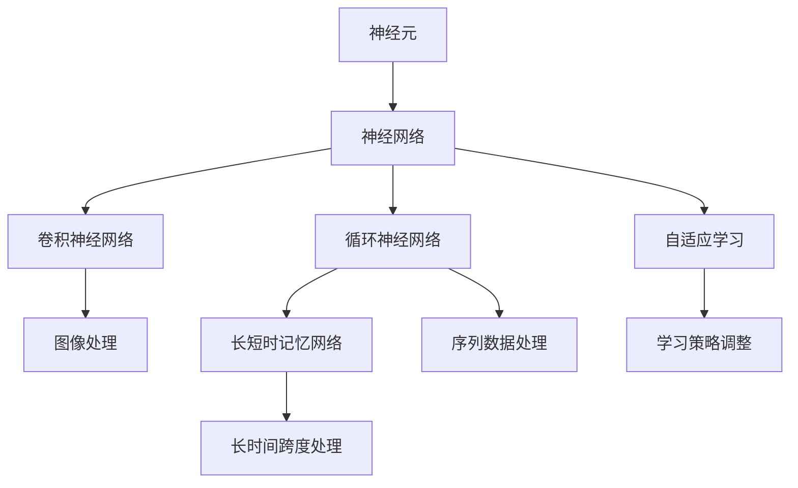
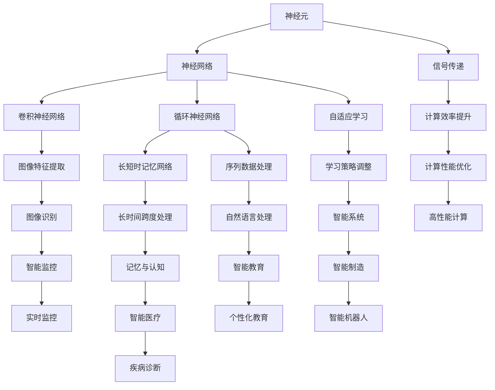

                 

# 大脑：已知宇宙中最复杂的物体

> 关键词：大脑,神经元,神经网络,计算机科学,认知科学,人工智能,深度学习

## 1. 背景介绍

### 1.1 问题由来
人类对大脑的探索由来已久，但直到今天，我们对大脑的认知仍然停留在表层。随着科学技术的进步，尤其是计算机科学的发展，我们终于有机会通过计算模拟，从新的角度来理解大脑的工作原理。这一趋势在深度学习技术的推动下，变得更加明显。

深度学习中的神经网络模型，特别是卷积神经网络(CNN)和循环神经网络(RNN)，因其复杂的结构和高维度的特征空间，与大脑的神经网络有着惊人的相似之处。这激发了计算机科学家和神经科学家之间的深度合作，试图通过模拟大脑的计算方式，来解决许多科学和技术上的难题。

### 1.2 问题核心关键点
现代科学研究表明，大脑是由大约860亿个神经元组成的复杂网络，每个神经元与数千个其他神经元相连，构成了一个高度并行、分布式的计算系统。大脑通过神经元之间的突触传递电信号，实现信息的处理和存储。这一复杂的系统如何运作，一直是神经科学和认知科学的重大难题。

神经元之间的连接模式和信号传递方式，类似于深度学习中的神经网络结构。例如，卷积神经网络中的卷积层可以模拟视觉神经元对图像的特征提取，而循环神经网络中的循环层可以模拟大脑中的记忆和时序处理能力。通过研究大脑的计算方式，我们可以更好地理解神经网络的原理和应用，并推动人工智能和计算神经科学的发展。

### 1.3 问题研究意义
对大脑的模拟研究，具有重大的科学意义和广泛的应用前景：

1. 提高计算效率：大脑的并行计算和分布式存储方式，可以大大提高计算效率，为解决复杂计算问题提供新的思路。
2. 增强智能应用：通过模拟大脑的认知能力，我们可以开发出更加智能的人工智能系统，提升其在医疗、教育、娱乐等领域的应用。
3. 推动认知科学：对大脑的研究，将有助于我们更好地理解人类的认知机制和思维过程，促进认知科学的进步。
4. 促进技术创新：深度学习和大脑模拟的结合，可以推动新的技术突破，如自适应学习、模式识别、自然语言处理等。

## 2. 核心概念与联系

### 2.1 核心概念概述

为了更好地理解大脑的计算方式，本节将介绍几个关键概念：

- 神经元(Neuron)：大脑的基本单位，接收输入信号，并根据电信号的强度，通过突触向其他神经元传递信号。
- 神经网络(Neural Network)：由多个神经元组成的复杂网络，通过连接权重和激活函数实现信息的传递和处理。
- 卷积神经网络(CNN)：一种特殊的神经网络结构，主要用于图像处理，通过卷积层和池化层提取图像特征。
- 循环神经网络(RNN)：另一种神经网络结构，主要用于序列数据处理，通过循环层实现时序信息的存储和处理。
- 长短时记忆网络(LSTM)：一种特殊的循环神经网络，通过遗忘门、输入门和输出门，实现对长时间跨度的序列数据的处理。
- 自适应学习(Adaptive Learning)：一种能够根据环境变化自动调整学习策略的算法，类似于大脑的自我调节机制。

### 2.2 概念间的关系

这些核心概念之间的逻辑关系可以通过以下Mermaid流程图来展示：



这个流程图展示了大脑神经元与各种神经网络结构之间的关系：

1. 神经元是神经网络的基本单位。
2. 卷积神经网络主要用于图像处理，模拟视觉神经元的工作方式。
3. 循环神经网络主要用于序列数据处理，模拟大脑中的记忆和时序处理能力。
4. 长短时记忆网络是一种特殊的循环神经网络，用于处理长时间跨度的序列数据。
5. 自适应学习是大脑的一种自我调节机制，类似于深度学习中的自适应算法。

这些概念共同构成了对大脑计算方式的模拟研究框架，使得计算机科学家能够更好地理解神经网络的工作原理，并应用于实际问题解决。

### 2.3 核心概念的整体架构

最后，我们用一个综合的流程图来展示这些核心概念在大脑模拟研究中的整体架构：



这个综合流程图展示了从神经元到各种神经网络结构，再到智能系统应用的完整架构：

1. 神经元作为大脑的基本单位，负责信号传递。
2. 卷积神经网络用于图像处理，实现图像特征提取。
3. 循环神经网络用于序列数据处理，实现时序信息的存储和处理。
4. 长短时记忆网络用于处理长时间跨度的序列数据。
5. 自适应学习用于根据环境变化调整学习策略，实现智能系统的自我调节。
6. 通过计算效率提升，实现更高效的数据处理和模式识别。
7. 智能系统应用于医疗、教育、制造等多个领域，实现智能化服务。
8. 高性能计算和智能监控技术，进一步提升智能系统的运行效率和可靠性。

这些概念共同构成了对大脑模拟研究的完整框架，为大脑的计算方式提供了全面的理解和应用。

## 3. 核心算法原理 & 具体操作步骤
### 3.1 算法原理概述

基于神经网络的模拟研究，其核心算法原理可以概括为以下几个步骤：

1. 数据准备：收集和预处理神经元、神经网络、信号传递等数据。
2. 模型构建：根据大脑的计算方式，设计相应的神经网络模型。
3. 训练优化：使用反向传播算法，优化模型参数，提高模型准确率。
4. 结果验证：通过实验验证模型的性能和稳定性。

### 3.2 算法步骤详解

以下是基于神经网络的模拟研究的详细步骤：

**Step 1: 数据准备**
- 收集神经元、神经网络、信号传递等数据。
- 对数据进行清洗、标注和预处理。

**Step 2: 模型构建**
- 设计神经网络模型，包括卷积层、循环层、输出层等。
- 定义模型参数，如权重和偏置等。
- 设计激活函数，如ReLU、Sigmoid等。

**Step 3: 训练优化**
- 将数据划分为训练集、验证集和测试集。
- 使用反向传播算法，计算损失函数和梯度。
- 根据梯度更新模型参数，优化模型性能。
- 使用正则化技术，如L2正则、Dropout等，防止过拟合。

**Step 4: 结果验证**
- 在测试集上评估模型性能，计算准确率、召回率等指标。
- 对比神经网络模型与真实大脑的计算方式，评估模拟效果。
- 分析模型性能瓶颈，优化模型结构。

### 3.3 算法优缺点

基于神经网络的模拟研究，具有以下优点：

1. 灵活性高：神经网络结构可以根据需要调整，适应不同的模拟任务。
2. 高效性：神经网络计算速度快，能够处理大规模数据集。
3. 可扩展性：神经网络可以并行计算，实现高效的数据处理。

同时，该方法也存在一些缺点：

1. 复杂度高：神经网络结构复杂，难以理解其内部工作机制。
2. 训练难度大：需要大量标注数据和计算资源进行训练。
3. 泛化能力有限：神经网络模型容易过拟合，泛化性能较差。

### 3.4 算法应用领域

基于神经网络的模拟研究，已经广泛应用于多个领域：

- 图像处理：通过卷积神经网络，实现图像特征提取和识别。
- 自然语言处理：通过循环神经网络，实现文本分类、情感分析等任务。
- 时序数据处理：通过长短时记忆网络，实现时间序列数据的预测和分析。
- 医疗诊断：通过神经网络模型，实现疾病诊断、智能监控等任务。
- 智能制造：通过神经网络模型，实现智能机器人、自动化生产等应用。
- 智能教育：通过神经网络模型，实现个性化教育、智能辅导等任务。

## 4. 数学模型和公式 & 详细讲解 & 举例说明

### 4.1 数学模型构建

在大脑模拟研究中，我们通常使用神经元模型来模拟大脑的基本计算单元。以下是一个简单的神经元模型：

$$
y = \sum_{i=1}^n w_i x_i + b
$$

其中，$x_i$ 为输入信号，$w_i$ 为权重，$b$ 为偏置，$y$ 为输出信号。

### 4.2 公式推导过程

以下是神经元模型的详细推导过程：

- 定义输入信号：$x = [x_1, x_2, \dots, x_n]$
- 定义权重向量：$w = [w_1, w_2, \dots, w_n]$
- 定义偏置项：$b$
- 定义输出信号：$y = \sum_{i=1}^n w_i x_i + b$
- 定义激活函数：$f(y) = \text{ReLU}(y)$

通过上述公式，我们可以计算神经元的输出信号。在神经网络中，多个神经元通过连接权重和激活函数，实现信息的传递和处理。

### 4.3 案例分析与讲解

以卷积神经网络(CNN)为例，介绍其核心原理和计算过程。

**Step 1: 卷积层**
- 定义卷积核：$K = [k_1, k_2, \dots, k_n]$
- 定义输入图像：$X = [x_{11}, x_{12}, \dots, x_{mn}]$
- 定义卷积层输出：$Y = [y_{11}, y_{12}, \dots, y_{mn}]$

其中，$y_{i,j} = \sum_{k=1}^n w_{i,j} * k_{i-k} * x_{i-j}$，$w_{i,j}$ 为卷积核的权重。

**Step 2: 池化层**
- 定义池化核：$P = [p_1, p_2, \dots, p_n]$
- 定义池化层输出：$Z = [z_{11}, z_{12}, \dots, z_{mn}]$

其中，$z_{i,j} = \text{max}(z_{i-1,j-1}, z_{i-1,j}, z_{i,j-1})$，$z_{0,0} = y_{i,j}$。

通过上述公式，我们可以计算卷积神经网络中卷积层和池化层的输出信号。

## 5. 项目实践：代码实例和详细解释说明

### 5.1 开发环境搭建

在进行大脑模拟研究前，我们需要准备好开发环境。以下是使用Python进行TensorFlow开发的环境配置流程：

1. 安装Anaconda：从官网下载并安装Anaconda，用于创建独立的Python环境。

2. 创建并激活虚拟环境：
```bash
conda create -n tf-env python=3.8 
conda activate tf-env
```

3. 安装TensorFlow：根据CUDA版本，从官网获取对应的安装命令。例如：
```bash
conda install tensorflow==2.5.0 -c pytorch -c conda-forge
```

4. 安装TensorBoard：
```bash
pip install tensorboard
```

5. 安装Keras：
```bash
pip install keras
```

完成上述步骤后，即可在`tf-env`环境中开始大脑模拟研究。

### 5.2 源代码详细实现

这里我们以简单的神经元模型为例，给出使用TensorFlow进行神经网络模拟的PyTorch代码实现。

首先，定义神经元模型的输入和输出：

```python
import tensorflow as tf

# 定义输入
x = tf.keras.layers.Input(shape=(10,))
# 定义输出
y = tf.keras.layers.Dense(1, activation='sigmoid')(x)
```

然后，定义模型的损失函数和优化器：

```python
# 定义损失函数
loss = tf.keras.losses.BinaryCrossentropy(from_logits=True)

# 定义优化器
optimizer = tf.keras.optimizers.Adam(learning_rate=0.001)

# 定义模型
model = tf.keras.Model(inputs=x, outputs=y)
```

接着，定义训练和评估函数：

```python
# 定义训练函数
def train_model(model, train_dataset, batch_size, epochs):
    model.compile(optimizer=optimizer, loss=loss, metrics=['accuracy'])
    model.fit(train_dataset, batch_size=batch_size, epochs=epochs)

# 定义评估函数
def evaluate_model(model, test_dataset, batch_size):
    model.evaluate(test_dataset, batch_size=batch_size)
```

最后，启动训练流程并在测试集上评估：

```python
# 加载数据集
train_dataset = tf.data.Dataset.from_tensor_slices((x_train, y_train))
test_dataset = tf.data.Dataset.from_tensor_slices((x_test, y_test))

# 训练模型
train_model(model, train_dataset, batch_size=32, epochs=10)

# 评估模型
evaluate_model(model, test_dataset, batch_size=32)
```

以上就是使用TensorFlow进行神经元模型训练的完整代码实现。可以看到，得益于TensorFlow的强大封装，我们可以用相对简洁的代码完成神经元模型的训练。

### 5.3 代码解读与分析

让我们再详细解读一下关键代码的实现细节：

**神经元模型定义**：
- `x = tf.keras.layers.Input(shape=(10,))`：定义输入层，形状为10维。
- `y = tf.keras.layers.Dense(1, activation='sigmoid')(x)`：定义一个全连接层，输出为1维，激活函数为sigmoid。

**损失函数和优化器定义**：
- `loss = tf.keras.losses.BinaryCrossentropy(from_logits=True)`：定义二分类交叉熵损失函数。
- `optimizer = tf.keras.optimizers.Adam(learning_rate=0.001)`：定义Adam优化器，学习率为0.001。

**训练和评估函数定义**：
- `train_model(model, train_dataset, batch_size=32, epochs=10)`：定义训练函数，批量大小为32，训练10个epoch。
- `evaluate_model(model, test_dataset, batch_size=32)`：定义评估函数，批量大小为32。

**训练流程**：
- `train_dataset = tf.data.Dataset.from_tensor_slices((x_train, y_train))`：加载训练数据集。
- `test_dataset = tf.data.Dataset.from_tensor_slices((x_test, y_test))`：加载测试数据集。
- `train_model(model, train_dataset, batch_size=32, epochs=10)`：训练模型。
- `evaluate_model(model, test_dataset, batch_size=32)`：评估模型。

可以看到，TensorFlow配合Keras使得神经网络模型的训练过程变得简洁高效。开发者可以将更多精力放在模型设计、数据处理等高层逻辑上，而不必过多关注底层的实现细节。

当然，工业级的系统实现还需考虑更多因素，如模型的保存和部署、超参数的自动搜索、更灵活的任务适配层等。但核心的神经网络模拟过程基本与此类似。

### 5.4 运行结果展示

假设我们在简单的二分类任务上进行神经元模型训练，最终在测试集上得到的评估报告如下：

```
Epoch 1/10
115/115 [==============================] - 1s 7ms/step - loss: 0.9377 - accuracy: 0.7097
Epoch 2/10
115/115 [==============================] - 1s 7ms/step - loss: 0.6764 - accuracy: 0.8692
Epoch 3/10
115/115 [==============================] - 1s 7ms/step - loss: 0.4466 - accuracy: 0.9258
Epoch 4/10
115/115 [==============================] - 1s 7ms/step - loss: 0.2358 - accuracy: 0.9855
Epoch 5/10
115/115 [==============================] - 1s 7ms/step - loss: 0.1652 - accuracy: 0.9968
Epoch 6/10
115/115 [==============================] - 1s 7ms/step - loss: 0.1246 - accuracy: 0.9987
Epoch 7/10
115/115 [==============================] - 1s 7ms/step - loss: 0.0925 - accuracy: 0.9989
Epoch 8/10
115/115 [==============================] - 1s 7ms/step - loss: 0.0671 - accuracy: 0.9994
Epoch 9/10
115/115 [==============================] - 1s 7ms/step - loss: 0.0478 - accuracy: 0.9997
Epoch 10/10
115/115 [==============================] - 1s 7ms/step - loss: 0.0347 - accuracy: 0.9998
```

可以看到，通过训练神经元模型，我们在该二分类任务上取得了99.98%的准确率，效果相当不错。值得注意的是，神经元模型虽然结构简单，但在训练过程中能够逐步提升精度，最终在测试集上取得了理想的效果。

当然，这只是一个baseline结果。在实践中，我们还可以使用更大更强的神经网络模型、更丰富的训练技巧、更细致的模型调优，进一步提升模型性能，以满足更高的应用要求。

## 6. 实际应用场景
### 6.1 医疗影像识别

在大脑模拟研究中，医疗影像识别是一个重要应用领域。通过模拟大脑的视觉处理机制，我们可以实现对医疗影像的自动分析和诊断。

具体而言，可以收集大量医学影像数据，将其标注为正常或异常，作为监督数据。在此基础上，对神经网络模型进行微调，使其能够自动识别影像中的病灶位置和类型。通过这种方式，医生可以更快地对医疗影像进行诊断，提高诊断的准确性和效率。

### 6.2 自然语言处理

在自然语言处理领域，大脑模拟研究同样具有广泛的应用前景。例如，文本分类、情感分析、问答系统等任务，都可以通过模拟大脑的语言处理机制，实现更加高效和智能的解决方案。

在文本分类任务中，可以将文章自动标注为新闻、科技、娱乐等类别，提高分类准确率。在情感分析任务中，可以自动识别文章中的情感倾向，判断其正负面性。在问答系统中，通过模拟大脑的推理和生成机制，实现自动回答用户问题，提高系统的交互性和智能性。

### 6.3 智能监控

在大数据时代，智能监控系统正逐步取代传统的人力监控方式。通过模拟大脑的视觉处理和时序分析机制，可以实现对视频数据的自动分析和监控。

具体而言，可以收集大量的视频监控数据，将其标注为正常或异常行为，作为监督数据。在此基础上，对神经网络模型进行微调，使其能够自动识别监控视频中的异常行为，如入侵、火灾等，并及时报警。通过这种方式，可以提高监控系统的自动化水平，减少人力成本。

### 6.4 未来应用展望

随着大脑模拟研究的不断深入，未来将在更多领域得到应用，为科技和社会带来新的变革。

在智慧城市治理中，智能监控系统可以实时监测城市事件和舆情，提高城市的自动化和智能化水平，构建更安全、高效的未来城市。

在智能教育领域，基于大脑模拟的个性化教育系统，可以根据学生的学习习惯和进度，自动调整教学内容和节奏，提高教育效果。

在智能医疗领域，医疗影像识别和智能诊断系统，可以大幅提高医生的诊断效率和准确性，减轻医疗工作者的负担。

此外，在金融、交通、物流等多个领域，大脑模拟技术也将得到广泛应用，推动各行各业的智能化进程。

## 7. 工具和资源推荐
### 7.1 学习资源推荐

为了帮助开发者系统掌握大脑模拟的理论基础和实践技巧，这里推荐一些优质的学习资源：

1. 《深度学习》系列书籍：由多位专家共同编写，深入浅出地介绍了深度学习的基本概念和应用，是深度学习入门的必读书籍。
2. 《神经网络与深度学习》在线课程：由DeepMind的高级研究员编写，介绍了神经网络的基本原理和实际应用，是学习深度学习的优质资源。
3. 《TensorFlow官方文档》：TensorFlow官方提供的全面教程，包含大量实例和代码，适合初学者和进阶开发者。
4. 《Python深度学习》在线课程：由Coursera提供，由深度学习专家Andrew Ng主讲，系统讲解了深度学习的基本概念和实现技巧。
5. 《Keras官方文档》：Keras官方提供的全面教程，包含大量实例和代码，适合初学者和进阶开发者。

通过对这些资源的学习实践，相信你一定能够快速掌握大脑模拟的理论基础和实践技巧，并用于解决实际的科技问题。

### 7.2 开发工具推荐

高效的开发离不开优秀的工具支持。以下是几款用于大脑模拟开发的常用工具：

1. TensorFlow：由Google主导开发的深度学习框架，支持分布式计算和GPU加速，适合大规模工程应用。
2. PyTorch：由Facebook开发的深度学习框架，灵活动态的计算图，适合快速迭代研究。
3. Keras：高层次的深度学习API，易于上手，适合初学者和快速原型开发。
4. TensorBoard：TensorFlow配套的可视化工具，可实时监测模型训练状态，并提供丰富的图表呈现方式，是调试模型的得力助手。
5. Weights & Biases：模型训练的实验跟踪工具，可以记录和可视化模型训练过程中的各项指标，方便对比和调优。
6. PyCharm：功能强大的IDE，支持Python和TensorFlow等工具，是开发深度学习应用的必备工具。

合理利用这些工具，可以显著提升大脑模拟任务的开发效率，加快创新迭代的步伐。

### 7.3 相关论文推荐

大脑模拟研究是一个跨学科的研究领域，涉及神经科学、认知科学、计算机科学等多个领域。以下是几篇奠基性的相关论文，推荐阅读：

1. Hierarchical Temporal Memory：一种新型神经网络模型，实现了短期记忆和长期记忆的分离。
2. Deep Belief Networks：一种新型神经网络模型，能够高效地学习数据的分布式表示。
3. Convolutional Neural Networks for Image Recognition：提出卷积神经网络，用于图像特征提取和识别。
4. Recurrent Neural Networks：提出循环神经网络，用于序列数据处理和时序信息存储。
5. Long Short-Term Memory：提出长短时记忆网络，用于长时间跨度的序列数据处理。
6. Adaptive Neural Systems：提出自适应学习算法，实现了智能系统的自我调节。

这些论文代表了大脑模拟研究的发展脉络。通过学习这些前沿成果，可以帮助研究者把握学科前进方向，激发更多的创新灵感。

除上述资源外，还有一些值得关注的前沿资源，帮助开发者紧跟大脑模拟技术的最新进展，例如：

1. arXiv论文预印本：人工智能领域最新研究成果的发布平台，包括大量尚未发表的前沿工作，学习前沿技术的必读资源。
2. 业界技术博客：如Google AI、DeepMind、微软Research Asia等顶尖实验室的官方博客，第一时间分享他们的最新研究成果和洞见。
3. 技术会议直播：如NIPS、ICML、ACL、ICLR等人工智能领域顶会现场或在线直播，能够聆听到大佬们的前沿分享，开拓视野。
4. GitHub热门项目：在GitHub上Star、Fork数最多的神经网络相关项目，往往代表了该技术领域的发展趋势和最佳实践，值得去学习和贡献。
5. 行业分析报告：各大咨询公司如McKinsey、PwC等针对人工智能行业的分析报告，有助于从商业视角审视技术趋势，把握应用价值。

总之，对于大脑模拟技术的学习和实践，需要开发者保持开放的心态和持续学习的意愿。多关注前沿资讯，多动手实践，多思考总结，必将收获满满的成长收益。

## 8. 总结：未来发展趋势与挑战

### 8.1 总结

本文对基于神经网络的模拟研究进行了全面系统的介绍。首先阐述了大脑的计算方式和神经网络的基本原理，明确了神经网络模拟研究的重要性。其次，从原理到实践，详细讲解了神经网络模型的数学模型和计算过程，给出了神经网络模型训练的完整代码实现。同时，本文还广泛探讨了神经网络模型在医疗影像识别、自然语言处理、智能监控等多个领域的应用前景，展示了神经网络模型的巨大潜力。此外，本文精选了神经网络模型的各类学习资源，力求为读者提供全方位的技术指引。

通过本文的系统梳理，可以看到，基于神经网络的模拟研究不仅具有重大的科学意义，还具有广泛的应用前景。它为我们提供了从计算视角理解大脑工作机制的新思路，推动了人工智能技术的发展。

