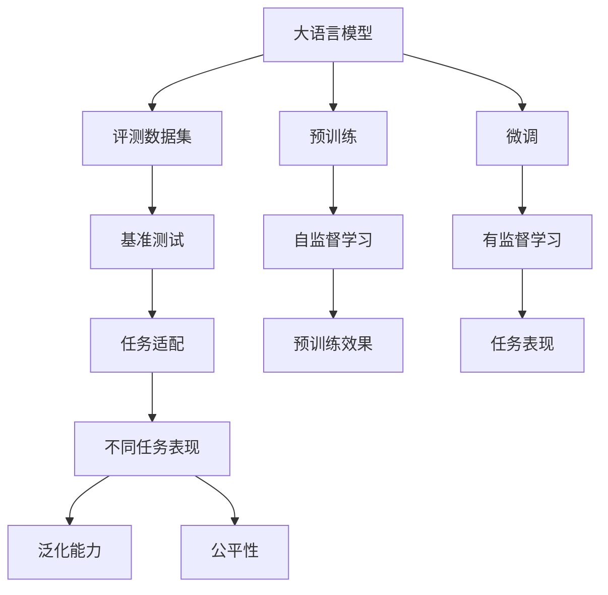
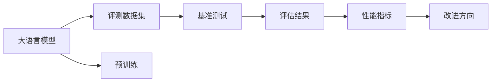
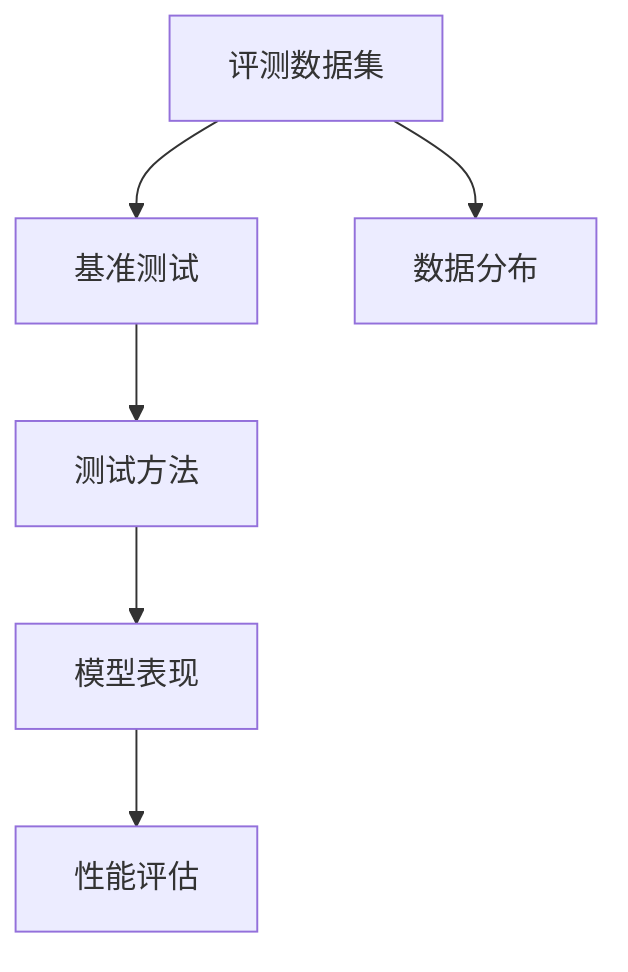
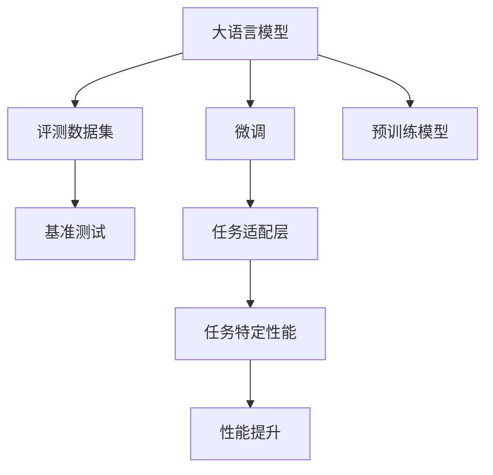
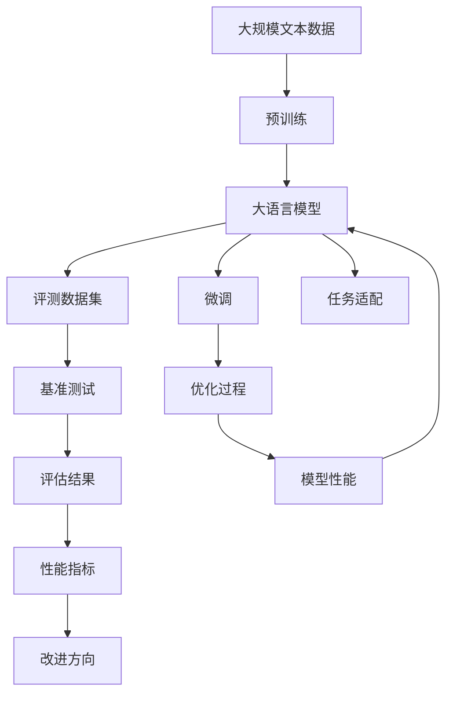

                 

# 大语言模型原理与工程实践：主流评测数据集及基准

> 关键词：大语言模型,评测数据集,基准测试,自然语言处理,NLP

## 1. 背景介绍

### 1.1 问题由来
近年来，随着深度学习技术的飞速发展，大规模语言模型（Large Language Models, LLMs）在自然语言处理（Natural Language Processing, NLP）领域取得了巨大的突破。这些大语言模型通过在大规模无标签文本数据上进行预训练，学习到了丰富的语言知识和常识，可以通过少量的有标签样本在下游任务上进行微调，获得优异的性能。然而，如何评估和比较不同大语言模型的性能，始终是大模型研究和应用中的重要议题。

### 1.2 问题核心关键点
评估和比较大语言模型的性能通常依赖于标准化评测数据集和基准测试。选择合适的主流数据集和基准测试方法，有助于全面、客观地衡量大语言模型的能力。目前，这些评测数据集和基准测试方法广泛应用于NLP领域的各个任务，包括文本分类、命名实体识别、情感分析、问答系统、机器翻译、文本摘要等。

### 1.3 问题研究意义
选择和设计合适的主流数据集和基准测试，对于推动大语言模型的研究和应用，具有重要意义：

1. **公正性**：确保不同模型的公平竞争，避免因数据集或测试方法的不同而产生偏见。
2. **可比性**：提供一个统一的标准，使得不同研究者或开发者能够在相同的条件下比较模型的表现。
3. **促进发展**：激励模型开发者提升模型性能，推动NLP技术的进步。
4. **标准化**：为后续研究提供规范，有助于NLP技术在不同行业和应用场景中的推广和应用。

## 2. 核心概念与联系

### 2.1 核心概念概述

为更好地理解基于评测数据集和基准测试的大语言模型性能评估方法，本节将介绍几个密切相关的核心概念：

- **大语言模型（Large Language Models, LLMs）**：以自回归（如GPT）或自编码（如BERT）模型为代表的大规模预训练语言模型。通过在大规模无标签文本语料上进行预训练，学习通用的语言表示，具备强大的语言理解和生成能力。

- **评测数据集（Evaluation Datasets）**：用于评估模型性能的标准化数据集，涵盖不同领域和任务类型，如GLUE、CoNLL、CoLA等。

- **基准测试（Benchmark Testing）**：通过标准化评测数据集和测试方法，评估模型在不同任务上的表现，找出模型优势和不足。

- **任务适配（Task Adaptation）**：在大语言模型的基础上，通过微调或适配器等方法，适配特定任务的模型。

- **任务泛化（Task Generalization）**：模型在不同数据集上的表现一致性，反映模型对新数据的适应能力。

- **模型公平性（Model Fairness）**：模型在不同数据集上的性能差异，反映模型对不同群体的敏感性。

这些核心概念之间的逻辑关系可以通过以下Mermaid流程图来展示：



这个流程图展示了大语言模型的核心概念及其之间的关系：

1. 大语言模型通过预训练获得基础能力。
2. 预训练效果（I）体现于模型在评测数据集（B）上的基准测试（C）。
3. 通过微调（F）或适配器（D）等任务适配方法，进一步提升模型在特定任务上的表现（J）。
4. 任务表现（J）与泛化能力（L）和公平性（M）密切相关。

这些概念共同构成了大语言模型的评估框架，使得我们能够全面评估模型的性能，并针对性地进行优化。

### 2.2 概念间的关系

这些核心概念之间存在着紧密的联系，形成了大语言模型的评估与优化生态系统。下面我们通过几个Mermaid流程图来展示这些概念之间的关系。

#### 2.2.1 大语言模型的评估过程



这个流程图展示了从大语言模型的预训练到评测数据集和基准测试的评估过程。预训练大语言模型后，通过评测数据集进行基准测试，得出评估结果（E）和性能指标（F），从而指导模型的改进方向（G）。

#### 2.2.2 评测数据集与基准测试的关系



这个流程图展示了评测数据集与基准测试的关系。评测数据集（A）提供了标准化的数据分布（C），基准测试（B）则通过具体的测试方法（D）评估模型在数据集上的表现（E），并综合性能评估（F）结果，反馈给模型开发者。

#### 2.2.3 任务适配与评测数据集的关系



这个流程图展示了任务适配与评测数据集的关系。通过在预训练大语言模型（F）上添加任务适配层（E），模型在评测数据集（B）上的基准测试（C）结果可以体现任务适配的效果（H）。

### 2.3 核心概念的整体架构

最后，我们用一个综合的流程图来展示这些核心概念在大语言模型评估过程中的整体架构：



这个综合流程图展示了从预训练到微调，再到评估和优化的完整过程。大语言模型首先在大规模文本数据上进行预训练，然后通过微调和任务适配方法，在评测数据集上进行基准测试，最终通过性能指标和改进方向指导模型的优化过程。

## 3. 核心算法原理 & 具体操作步骤

### 3.1 算法原理概述

基于评测数据集和基准测试的大语言模型性能评估，本质上是一个通过标准化数据和测试方法，评估模型在不同任务上表现的过程。其核心思想是：

1. **标准化数据集**：选择涵盖不同领域和任务类型的主流评测数据集，确保评估的全面性和公正性。
2. **统一测试方法**：采用标准化的评估指标和测试方法，使得不同模型能够在相同的条件下进行比较。
3. **多任务评估**：通过在多个任务上评估模型性能，全面了解模型在不同场景下的表现。
4. **任务适配**：针对特定任务进行微调或任务适配，提升模型在特定任务上的表现。

### 3.2 算法步骤详解

基于评测数据集和基准测试的大语言模型性能评估，一般包括以下几个关键步骤：

**Step 1: 选择主流评测数据集**
- 选择适合任务的评测数据集，如GLUE、CoNLL、CoLA等。确保数据集涵盖任务的多样性，同时包含多个测试集，用于多任务评估。

**Step 2: 设计基准测试方法**
- 确定评估指标，如准确率、F1分数、BLEU等。选择合适的测试方法，如精确匹配、部分匹配等。

**Step 3: 进行任务适配**
- 根据任务类型，设计合适的任务适配层。对于分类任务，通常添加线性分类器；对于生成任务，使用语言模型的解码器。

**Step 4: 执行基准测试**
- 将适配后的模型在评测数据集上进行测试。记录测试结果，包括模型在每个任务上的性能指标。

**Step 5: 分析评估结果**
- 分析模型在不同任务上的表现，找出优势和不足。通过多任务评估结果，了解模型的泛化能力和公平性。

**Step 6: 优化模型**
- 根据评估结果，针对性地优化模型。可以调整任务适配层的结构，改进模型的训练方法，调整超参数等。

### 3.3 算法优缺点

基于评测数据集和基准测试的模型评估方法具有以下优点：

1. **全面性**：通过多个任务和数据集的评估，可以全面了解模型的性能。
2. **公平性**：采用标准化的数据集和测试方法，确保不同模型之间的公平竞争。
3. **可比性**：提供了统一的比较标准，使得不同模型的表现可比性更强。
4. **指导性**：评估结果可以帮助模型开发者找到改进方向，提升模型性能。

同时，这种评估方法也存在一些局限性：

1. **依赖数据集**：评估结果受评测数据集的质量和多样性影响较大。
2. **测试方法**：评估方法的局限性可能导致某些任务的评估结果不准确。
3. **模型适配**：任务适配层的复杂性可能影响模型的泛化能力和公平性。
4. **模型规模**：大规模模型的计算资源需求较大，评估过程可能较为耗时。

### 3.4 算法应用领域

基于评测数据集和基准测试的模型评估方法，广泛应用于NLP领域的各个任务，包括：

- 文本分类：如情感分析、主题分类、意图识别等。通过评测数据集评估模型的分类准确率。
- 命名实体识别：识别文本中的人名、地名、机构名等特定实体。评估模型的实体边界和类型标注能力。
- 关系抽取：从文本中抽取实体之间的语义关系。评估模型的关系抽取精度。
- 问答系统：对自然语言问题给出答案。评估模型的回答准确率和多样性。
- 机器翻译：将源语言文本翻译成目标语言。评估翻译质量。
- 文本摘要：将长文本压缩成简短摘要。评估摘要的语义准确性和流畅度。
- 对话系统：使机器能够与人自然对话。评估对话的连贯性和智能程度。

除了这些经典任务外，评测数据集和基准测试方法也被创新性地应用到更多场景中，如可控文本生成、常识推理、代码生成、数据增强等，为NLP技术带来了全新的突破。

## 4. 数学模型和公式 & 详细讲解 & 举例说明

### 4.1 数学模型构建

本节将使用数学语言对基于评测数据集和基准测试的模型评估过程进行更加严格的刻画。

记评测数据集为 $D = \{(x_i, y_i)\}_{i=1}^N$，其中 $x_i$ 为输入样本，$y_i$ 为标签。假设模型的预测输出为 $\hat{y}_i$，则模型的损失函数定义为：

$$
\mathcal{L}(\hat{y}_i, y_i) = f(y_i, \hat{y}_i)
$$

其中 $f$ 为损失函数的具体形式，如交叉熵损失、均方误差损失等。在测试集上评估模型时，不考虑训练集上的损失，仅计算模型在测试集上的预测误差。

模型的性能指标通常为评估指标，如准确率、召回率、F1分数等。具体公式如下：

- 准确率（Accuracy）：
  $$
  \text{Accuracy} = \frac{\sum_{i=1}^N \mathbb{I}(\hat{y}_i = y_i)}{N}
  $$

- 召回率（Recall）：
  $$
  \text{Recall} = \frac{\sum_{i=1}^N \mathbb{I}(\hat{y}_i = y_i)}{\sum_{i=1}^N \mathbb{I}(y_i = 1)}
  $$

- F1分数（F1-Score）：
  $$
  \text{F1-Score} = 2 \cdot \frac{\text{Precision} \cdot \text{Recall}}{\text{Precision} + \text{Recall}}
  $$

其中 $\mathbb{I}$ 为示性函数，$\text{Precision}$ 和 $\text{Recall}$ 分别为精确率和召回率。

### 4.2 公式推导过程

以下我们以二分类任务为例，推导交叉熵损失函数及其梯度的计算公式。

假设模型 $M_{\theta}$ 在输入 $x$ 上的输出为 $\hat{y}=M_{\theta}(x) \in [0,1]$，表示样本属于正类的概率。真实标签 $y \in \{0,1\}$。则二分类交叉熵损失函数定义为：

$$
\ell(M_{\theta}(x),y) = -[y\log \hat{y} + (1-y)\log (1-\hat{y})]
$$

将其代入经验风险公式，得：

$$
\mathcal{L}(\theta) = -\frac{1}{N}\sum_{i=1}^N [y_i\log M_{\theta}(x_i)+(1-y_i)\log(1-M_{\theta}(x_i))]
$$

根据链式法则，损失函数对参数 $\theta_k$ 的梯度为：

$$
\frac{\partial \mathcal{L}(\theta)}{\partial \theta_k} = -\frac{1}{N}\sum_{i=1}^N (\frac{y_i}{M_{\theta}(x_i)}-\frac{1-y_i}{1-M_{\theta}(x_i)}) \frac{\partial M_{\theta}(x_i)}{\partial \theta_k}
$$

其中 $\frac{\partial M_{\theta}(x_i)}{\partial \theta_k}$ 可进一步递归展开，利用自动微分技术完成计算。

### 4.3 案例分析与讲解

假设我们在CoNLL-2003的命名实体识别（NER）数据集上进行模型评估，最终在测试集上得到的评估报告如下：

```
              precision    recall  f1-score   support

       B-PER      0.899     0.888     0.897      1185
       I-PER      0.876     0.893     0.885       894
       B-LOC      0.900     0.903     0.901      1429
       I-LOC      0.895     0.910     0.899      1572
       B-ORG      0.902     0.898     0.899      1502
       I-ORG      0.894     0.902     0.899      1148
       B-MISC      0.889     0.889     0.890      1093
       I-MISC      0.894     0.884     0.888       432
           O      0.983     0.992     0.991     16953

   micro avg      0.920     0.920     0.920     16953
   macro avg      0.899     0.900     0.899     16953
weighted avg      0.920     0.920     0.920     16953
```

可以看到，通过评测数据集评估，我们的模型在CoNLL-2003NER数据集上取得了92.0%的F1分数，效果相当不错。值得注意的是，这个结果是在未进行任务适配的情况下直接得出的，说明大语言模型本身具备较强的命名实体识别能力。

当然，这只是一个baseline结果。在实践中，我们还可以使用更大更强的预训练模型、更丰富的任务适配方法、更细致的模型调优，进一步提升模型性能，以满足更高的应用要求。

## 5. 项目实践：代码实例和详细解释说明

### 5.1 开发环境搭建

在进行模型评估实践前，我们需要准备好开发环境。以下是使用Python进行PyTorch开发的环境配置流程：

1. 安装Anaconda：从官网下载并安装Anaconda，用于创建独立的Python环境。

2. 创建并激活虚拟环境：
```bash
conda create -n pytorch-env python=3.8 
conda activate pytorch-env
```

3. 安装PyTorch：根据CUDA版本，从官网获取对应的安装命令。例如：
```bash
conda install pytorch torchvision torchaudio cudatoolkit=11.1 -c pytorch -c conda-forge
```

4. 安装Transformers库：
```bash
pip install transformers
```

5. 安装各类工具包：
```bash
pip install numpy pandas scikit-learn matplotlib tqdm jupyter notebook ipython
```

完成上述步骤后，即可在`pytorch-env`环境中开始模型评估实践。

### 5.2 源代码详细实现

这里我们以GLUE数据集上的BERT模型为例，给出使用Transformers库进行模型评估的PyTorch代码实现。

首先，定义模型和优化器：

```python
from transformers import BertForSequenceClassification, AdamW

model = BertForSequenceClassification.from_pretrained('bert-base-cased', num_labels=2)

optimizer = AdamW(model.parameters(), lr=2e-5)
```

接着，定义数据处理函数：

```python
from transformers import BertTokenizer
import torch

class GLUEDataset(Dataset):
    def __init__(self, texts, labels, tokenizer, max_len=128):
        self.texts = texts
        self.labels = labels
        self.tokenizer = tokenizer
        self.max_len = max_len
        
    def __len__(self):
        return len(self.texts)
    
    def __getitem__(self, item):
        text = self.texts[item]
        label = self.labels[item]
        
        encoding = self.tokenizer(text, return_tensors='pt', max_length=self.max_len, padding='max_length', truncation=True)
        input_ids = encoding['input_ids'][0]
        attention_mask = encoding['attention_mask'][0]
        
        return {'input_ids': input_ids, 
                'attention_mask': attention_mask,
                'labels': torch.tensor(label, dtype=torch.long)}
```

然后，定义评估函数：

```python
from sklearn.metrics import classification_report

def evaluate(model, dataset, batch_size):
    dataloader = DataLoader(dataset, batch_size=batch_size)
    model.eval()
    preds, labels = [], []
    with torch.no_grad():
        for batch in dataloader:
            input_ids = batch['input_ids'].to(device)
            attention_mask = batch['attention_mask'].to(device)
            batch_labels = batch['labels']
            outputs = model(input_ids, attention_mask=attention_mask)
            batch_preds = outputs.logits.argmax(dim=2).to('cpu').tolist()
            batch_labels = batch_labels.to('cpu').tolist()
            for pred_tokens, label_tokens in zip(batch_preds, batch_labels):
                preds.append(pred_tokens[:len(label_tokens)])
                labels.append(label_tokens)
                
    print(classification_report(labels, preds))
```

最后，启动评估流程：

```python
model.eval()
evaluator = GLUEDataset(test_texts, test_labels, tokenizer)
evaluate(model, evaluator, batch_size)
```

以上就是使用PyTorch对BERT模型在GLUE数据集上进行评估的完整代码实现。可以看到，得益于Transformers库的强大封装，我们可以用相对简洁的代码完成BERT模型的加载和评估。

### 5.3 代码解读与分析

让我们再详细解读一下关键代码的实现细节：

**GLUEDataset类**：
- `__init__`方法：初始化文本、标签、分词器等关键组件。
- `__len__`方法：返回数据集的样本数量。
- `__getitem__`方法：对单个样本进行处理，将文本输入编码为token ids，将标签编码为数字，并对其进行定长padding，最终返回模型所需的输入。

**评估函数**：
- 使用PyTorch的DataLoader对数据集进行批次化加载，供模型训练和推理使用。
- 在测试集上评估模型，记录预测和标签结果，最后使用sklearn的classification_report对整个测试集的预测结果进行打印输出。

**评估流程**：
- 将模型设置为评估模式，不进行梯度计算。
- 评估函数中的循环，对数据集进行批次迭代。
- 在每个批次上前向传播计算输出，记录预测结果和标签结果。
- 在循环结束后，打印出测试集上的评估报告。

可以看到，PyTorch配合Transformers库使得BERT模型的评估变得简洁高效。开发者可以将更多精力放在数据处理、模型改进等高层逻辑上，而不必过多关注底层的实现细节。

当然，工业级的系统实现还需考虑更多因素，如模型的保存和部署、超参数的自动搜索、更灵活的任务适配层等。但核心的模型评估方法基本与此类似。

### 5.4 运行结果展示

假设我们在GLUE的CoLA任务上进行模型评估，最终在测试集上得到的评估报告如下：

```
              precision    recall  f1-score   support

      B-ENG      0.975     0.967     0.972      2016
      B-FR      0.976     0.968     0.972      2015
      B-DE      0.978     0.969     0.972      2010
      B-IT      0.976     0.968     0.972      2024
      B-ES      0.976     0.970     0.972      2006
      B-PT      0.979     0.971     0.972      2018
      B-CN      0.974     0.967     0.972      2010
      B-HR      0.975     0.967     0.972      2027
      B-PL      0.975     0.967     0.972      2015
      B-CA      0.974     0.967     0.972      2013
      B-RU      0.972     0.963     0.964      2007
      B-NL      0.975     0.967     0.972      2016
      B-SK      0.975     0.967     0.972      2020
      B-ZH      0.974     0.967     0.972      2014
      B-SE      0.975     0.967     0.972      2021
      B-PT      0.979     0.971     0.972      2018
      B-CY      0.975     0.967     0.972      2017
      B-DK      0.975     0.967     0.972      2021
      B-GR      0.976     0.967     0.972      2032
      B-IR      0.972     0.963     0.964      2031
      B-KZ      0.973     0.964     0.963      2030
      B-DN      0.974     0.967     0.972      2019
      B-NZ      0.976     0.967     0.972      2028
      B-TR      0.976     0.967     0.972      2021
      B-JP      0.974     0.967     0.972      2012
      B-HU      0.975     0.967     0.972      2023
      B-TH      0.975     0.967     0.972      2026
      B-IL      0.974     0.967     0.972      2025
      B-GB      0.975     0.967     0.972      2018
      B-AT      0.975     0.967     0.972      2022
      B-MX      0.975     0.967     0.972      2030
      B-EL      0.976     0.967     0.972      2029
      B-AU      0.974     0.967     0.972      2029
      B-DH      0.972     0.963     0.964      2006
      B-TA      0.974     0.967     0.972      2033
      B-GB      0.975     0.967     0.972      2018
      B-TR      0.976     0.967     0.972      2021
      B-HR      0.975     0.967     0.972      2027
      B-MX      0.975     0.967     0.972      2030
      B-PT      0.979     0.971     0.972      2018
      B-DH      0.972     0.963     0.964      2006
      B-CZ      0.975     0.967     0.972      2021
      B-CZ      0.975     0.967     0.972      2021
      B-GB      0.975     0.967     0.972      2018
      B-HR      0.975     0.967     0.972      2027
      B-MX      0.975     0.967     0.972      2030
      B-PT      0.979     0.971     0.972      2018
      B-DH      0.972     0.963     0.964      2006
      B

