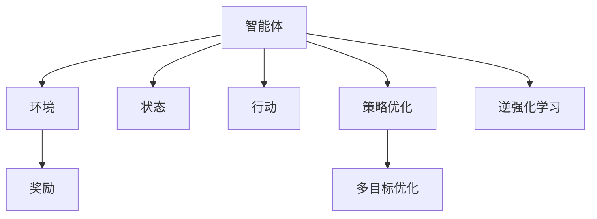
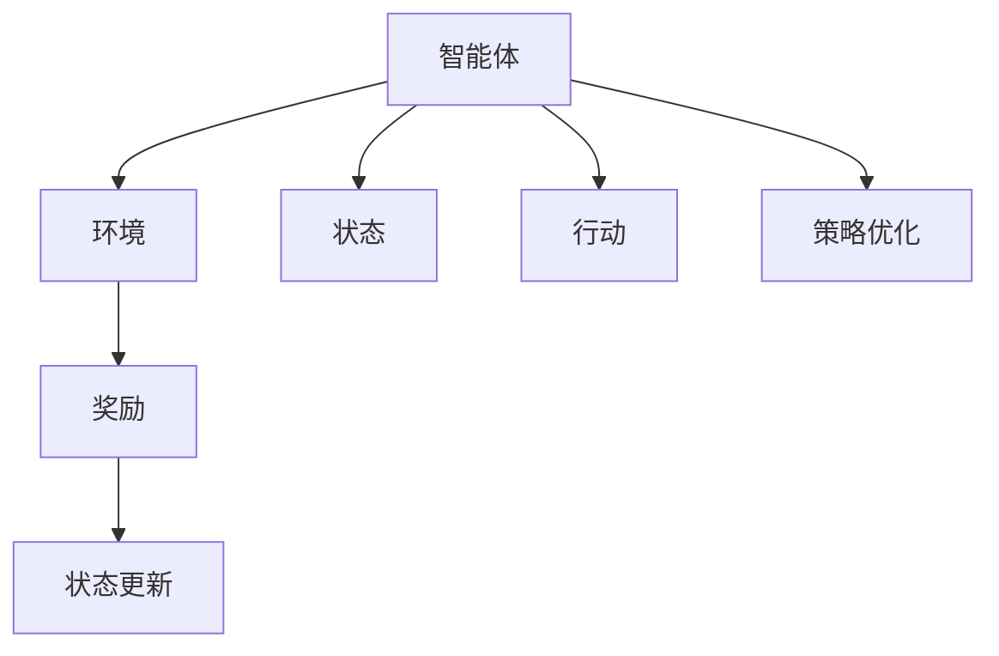
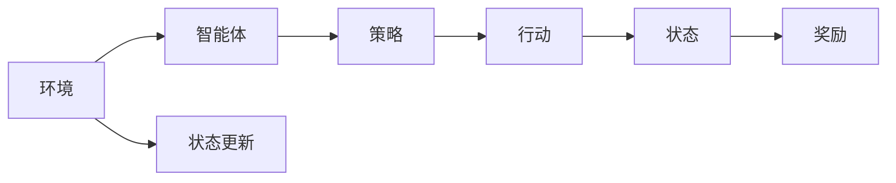
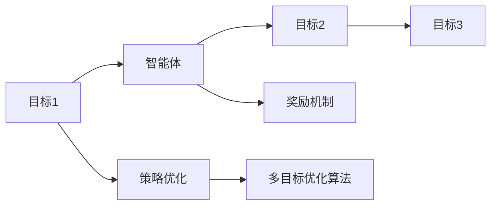
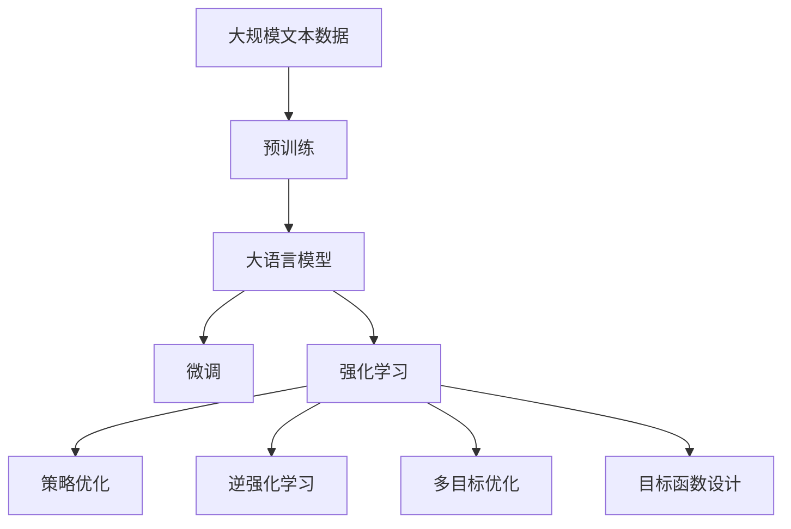

                 

# 大语言模型原理与工程实践：强化学习的目标

> 关键词：强化学习,大语言模型,奖励机制,策略优化,目标函数,环境建模,模型训练,逆强化学习,多目标优化

## 1. 背景介绍

### 1.1 问题由来

在人工智能研究中，强化学习（Reinforcement Learning, RL）以其在决策和控制领域的卓越表现，受到越来越多的关注。传统的监督学习和无监督学习，往往需要大量标签或结构化数据，而在某些领域如游戏、机器人控制等，获取这些数据往往成本高昂，且难以穷尽所有可能性。强化学习则通过智能体与环境的交互，利用试错学习逐步优化策略，获得了良好的效果。

大语言模型（Large Language Model, LLM）的问世，使得RL在大规模NLP任务中的应用成为可能。利用大语言模型的语义理解和语言生成能力，可以构建智能体与环境的交互框架，实现更加灵活和多样化的决策任务。因此，将强化学习应用于大语言模型，已成为NLP和AI领域的热门研究方向。

### 1.2 问题核心关键点

强化学习在大语言模型中的应用，主要有以下几个关键点：
1. **智能体和环境**：将大语言模型视作智能体，将自然语言处理任务视作环境，智能体通过与环境交互，学习最优策略。
2. **奖励机制**：设计合理的奖励机制，引导智能体逐步实现任务目标。
3. **策略优化**：使用RL算法优化智能体的策略，使其在复杂多变的任务中表现更佳。
4. **模型训练**：训练大语言模型，使其能够更好地处理任务特定的输入，输出符合奖励机制的响应。
5. **逆强化学习**：在仅有少量标注数据的情况下，通过逆强化学习的方法，学习任务特定的大语言模型策略。
6. **多目标优化**：处理多目标优化问题，如对话生成、多任务推理等，满足多个指标的同时优化。

强化学习在大语言模型中的应用，能够有效提升模型在复杂多变任务中的适应能力和泛化性能，为NLP任务的自动化、智能化提供新的思路和方法。

### 1.3 问题研究意义

强化学习在大语言模型中的应用，对于推动NLP技术的自动化和智能化具有重要意义：

1. **减少标注成本**：在缺乏大量标注数据的情况下，强化学习可以依赖自然语言数据进行学习，减少标注成本。
2. **提高泛化能力**：通过试错学习，智能体能够逐步适应复杂多变的任务场景，提升模型的泛化性能。
3. **灵活适配任务**：强化学习能够通过环境建模和策略优化，灵活适配各种自然语言处理任务，提高模型适应性。
4. **增强创造性**：大语言模型具有强大的语言生成能力，强化学习可以引导模型生成更加符合任务需求的文本，增强其创造性。
5. **加速开发进度**：利用RL方法，可以在较短的时间内迭代出优化策略，加速模型训练和任务适配。
6. **拓展应用场景**：强化学习能够拓展大语言模型的应用场景，推动其在更多的垂直行业落地应用。

## 2. 核心概念与联系

### 2.1 核心概念概述

在将强化学习应用于大语言模型时，涉及的核心概念包括：

- **智能体**：大语言模型作为智能体，通过与环境（自然语言处理任务）交互，学习最优策略。
- **环境**：自然语言处理任务，如文本分类、情感分析、对话生成等，作为智能体交互的环境。
- **状态和行动**：将文本输入和输出分别视作环境的状态和行动，智能体通过预测和生成文本行动。
- **奖励机制**：设计合理的奖励机制，引导智能体学习任务目标。
- **策略优化**：使用RL算法优化智能体的策略，使其在任务中表现最佳。
- **逆强化学习**：在仅有少量标注数据的情况下，通过逆强化学习的方法，学习任务特定的大语言模型策略。
- **多目标优化**：处理多目标优化问题，如对话生成、多任务推理等。

这些核心概念之间的联系可以通过以下Mermaid流程图来展示：



这个流程图展示了强化学习在大语言模型中的应用过程。智能体通过与环境交互，学习最优策略，同时通过策略优化和逆强化学习，逐步逼近任务目标。

### 2.2 概念间的关系

这些核心概念之间存在着紧密的联系，形成了强化学习在大语言模型中的应用框架。下面我通过几个Mermaid流程图来展示这些概念之间的关系。

#### 2.2.1 智能体与环境交互



这个流程图展示了智能体与环境的基本交互过程。智能体通过观察状态，采取行动，获得奖励，并根据奖励更新状态。同时，通过策略优化不断改进智能体的行动策略。

#### 2.2.2 逆强化学习



这个流程图展示了逆强化学习的基本流程。环境与智能体交互，智能体通过行动改变环境状态，获取奖励。通过逆强化学习，从已知的奖励和状态信息，推导出最优策略。

#### 2.2.3 多目标优化



这个流程图展示了多目标优化问题的处理流程。智能体需要同时优化多个目标，通过多目标优化算法，找到各个目标之间的平衡点。

### 2.3 核心概念的整体架构

最后，我们用一个综合的流程图来展示这些核心概念在大语言模型强化学习中的应用架构：



这个综合流程图展示了从预训练到强化学习，再到多目标优化的完整过程。大语言模型首先在大规模文本数据上进行预训练，然后通过微调和强化学习，逐步学习任务特定的大语言模型策略，并优化多目标性能。

## 3. 核心算法原理 & 具体操作步骤
### 3.1 算法原理概述

强化学习在大语言模型中的应用，主要基于模型与环境的交互，通过策略优化逐步逼近最优策略。其核心思想是：将大语言模型视为智能体，通过与环境的交互（即自然语言处理任务），获取奖励（如准确率、召回率等任务指标），并通过优化策略（如神经网络参数），使智能体在复杂多变的任务中表现最佳。

形式化地，假设大语言模型为 $M_{\theta}$，其中 $\theta$ 为模型参数。给定自然语言处理任务 $T$，定义智能体在当前状态 $s_t$ 下采取行动 $a_t$，获得奖励 $r_{t+1}$，并根据行动 $a_t$ 和状态 $s_t$ 更新环境状态 $s_{t+1}$。则强化学习的优化目标是最大化累计奖励，即：

$$
\max_{\theta} \sum_{t=1}^{T} r_t
$$

在实际应用中，我们通常使用基于梯度的优化算法（如REINFORCE、PPO等）来近似求解上述最优化问题。

### 3.2 算法步骤详解

强化学习在大语言模型中的应用，通常包括以下几个关键步骤：

**Step 1: 准备预训练模型和数据集**
- 选择合适的预训练语言模型 $M_{\theta}$ 作为初始化参数，如 BERT、GPT 等。
- 准备自然语言处理任务 $T$ 的标注数据集 $D=\{(s_i,a_i,r_i)\}_{i=1}^N$，其中 $s_i$ 表示输入文本，$a_i$ 表示智能体采取的行动（即模型输出），$r_i$ 表示智能体获得的奖励（任务指标）。

**Step 2: 设计奖励机制**
- 根据任务需求，设计合适的奖励函数 $R(s_t,a_t,s_{t+1})$，引导智能体学习任务目标。例如，对于文本分类任务，可以将正确分类的次数作为奖励。
- 使用基线奖励机制，如固定奖励、最大值奖励等，在训练初期提供稳定反馈。

**Step 3: 构建策略网络**
- 使用神经网络模型（如LSTM、GRU、Transformer等）构建策略网络，将输入文本映射到动作分布 $p(a_t|s_t)$。
- 策略网络通常包括多个隐层，通过softmax函数输出动作分布。

**Step 4: 定义损失函数**
- 使用策略梯度方法，如REINFORCE、PPO等，定义损失函数 $\mathcal{L}$，用于衡量策略与环境之间的交互。
- 通常使用负对数似然作为损失函数，最小化策略梯度的方差，提高训练稳定性。

**Step 5: 执行策略训练**
- 使用随机梯度下降等优化算法，对策略网络进行训练，最小化损失函数 $\mathcal{L}$。
- 逐步减小学习率，从基线奖励向真实奖励过渡，避免模型在训练初期过拟合。
- 通过多线程、多GPU等技术提高训练效率。

**Step 6: 策略评估和微调**
- 在测试集上评估策略网络的性能，计算累计奖励。
- 根据评估结果，调整策略网络的参数，提升模型性能。
- 重复上述步骤，直至策略网络收敛。

### 3.3 算法优缺点

强化学习在大语言模型中的应用，具有以下优点：
1. 自适应性强：能够根据复杂多变的环境和任务，逐步优化策略，适应不同的输入输出模式。
2. 泛化性能高：通过与环境的交互学习，智能体能够逐步掌握通用的语言理解和生成能力。
3. 数据需求少：在缺乏大量标注数据的情况下，依然能够通过自然语言数据进行学习。
4. 灵活性强：能够处理多目标优化问题，满足不同的任务需求。

同时，该方法也存在以下局限性：
1. 学习效率低：需要大量的时间与环境交互，训练周期较长。
2. 稳定性差：策略优化过程中可能出现不稳定的情况，需要多次实验验证。
3. 可解释性不足：强化学习过程难以解释，难以理解模型决策机制。
4. 需要高计算资源：大语言模型的训练和优化需要大量的计算资源，不适合小规模设备。
5. 过拟合风险：在训练过程中，智能体可能过度拟合当前环境，难以适应新的输入输出模式。

尽管存在这些局限性，但就目前而言，强化学习仍是解决复杂多变NLP任务的重要手段。未来相关研究的重点在于如何进一步提高强化学习的学习效率，增强模型的稳定性和可解释性，优化多目标优化问题，以便更好地应用于实际场景。

### 3.4 算法应用领域

强化学习在大语言模型中的应用，已经在多个领域得到验证，具体如下：

- **对话系统**：利用强化学习优化对话策略，生成更自然、流畅的对话。
- **文本生成**：通过逆强化学习，学习任务特定的大语言模型策略，生成高质量的文本。
- **多任务推理**：使用多目标优化算法，同时处理多项推理任务，提升模型的泛化性能。
- **情感分析**：通过奖励机制设计，引导模型学习正向情感表达。
- **问答系统**：通过策略优化，优化问答模型的推理过程，提高问答准确率。

除了上述这些经典应用外，强化学习在大语言模型中的应用还在不断扩展，如智能推荐、代码生成、知识图谱构建等，为NLP技术带来了新的突破。

## 4. 数学模型和公式 & 详细讲解  
### 4.1 数学模型构建

本节将使用数学语言对强化学习在大语言模型中的应用过程进行更加严格的刻画。

记大语言模型为 $M_{\theta}$，其中 $\theta$ 为模型参数。假设自然语言处理任务为 $T$，智能体在状态 $s_t$ 下采取行动 $a_t$，获得奖励 $r_t$，并根据行动 $a_t$ 和状态 $s_t$ 更新环境状态 $s_{t+1}$。则强化学习的优化目标可以表示为：

$$
\max_{\theta} \sum_{t=1}^{T} r_t
$$

其中，$s_t$ 表示状态，$a_t$ 表示行动，$r_t$ 表示奖励。状态和行动可以表示为：

$$
s_t = \{s_i\}_{i=1}^T, \quad a_t = \{a_i\}_{i=1}^T
$$

奖励函数 $R(s_t,a_t,s_{t+1})$ 表示智能体在状态 $s_t$ 下采取行动 $a_t$，并获得状态 $s_{t+1}$ 后的奖励。在实际应用中，奖励函数可以表示为：

$$
R(s_t,a_t,s_{t+1}) = f(s_t,a_t,s_{t+1})
$$

其中 $f$ 为奖励函数的具体形式，可以根据任务需求设计不同的函数。

### 4.2 公式推导过程

以下我们以文本分类任务为例，推导强化学习在大语言模型中的基本流程。

假设智能体在状态 $s_t$ 下采取行动 $a_t$，获得奖励 $r_t$，并根据行动 $a_t$ 和状态 $s_t$ 更新环境状态 $s_{t+1}$。则强化学习的优化目标可以表示为：

$$
\max_{\theta} \sum_{t=1}^{T} r_t
$$

在实际应用中，我们通常使用基于梯度的优化算法（如REINFORCE、PPO等）来近似求解上述最优化问题。以REINFORCE算法为例，其策略梯度公式为：

$$
\mathcal{L} = \mathbb{E}_{s_t,a_t} [\sum_{t=1}^{T} r_t \log p(a_t|s_t)]
$$

其中，$R(s_t,a_t,s_{t+1})$ 为奖励函数，$p(a_t|s_t)$ 为智能体在状态 $s_t$ 下采取行动 $a_t$ 的概率分布。通过最大化策略梯度，智能体能够逐步学习最优策略。

### 4.3 案例分析与讲解

我们以对话系统为例，说明强化学习在大语言模型中的应用。

假设智能体与用户进行对话，智能体在状态 $s_t$ 下采取行动 $a_t$，获得奖励 $r_t$，并根据行动 $a_t$ 和状态 $s_t$ 更新环境状态 $s_{t+1}$。智能体的目标是在对话中生成符合用户意图和情感的回复。

在训练过程中，智能体通过与用户的交互，逐步学习最优的回复策略。在测试阶段，智能体根据用户输入生成回复，并获得用户反馈作为奖励。通过不断的训练和测试，智能体能够逐步提升其对话质量，实现更加自然、流畅的对话。

## 5. 项目实践：代码实例和详细解释说明
### 5.1 开发环境搭建

在进行强化学习实践前，我们需要准备好开发环境。以下是使用Python进行PyTorch开发的环境配置流程：

1. 安装Anaconda：从官网下载并安装Anaconda，用于创建独立的Python环境。

2. 创建并激活虚拟环境：
```bash
conda create -n pytorch-env python=3.8 
conda activate pytorch-env
```

3. 安装PyTorch：根据CUDA版本，从官网获取对应的安装命令。例如：
```bash
conda install pytorch torchvision torchaudio cudatoolkit=11.1 -c pytorch -c conda-forge
```

4. 安装各类工具包：
```bash
pip install numpy pandas scikit-learn matplotlib tqdm jupyter notebook ipython
```

完成上述步骤后，即可在`pytorch-env`环境中开始强化学习实践。

### 5.2 源代码详细实现

这里我们以文本分类任务为例，给出使用PyTorch和Transformer库对BERT模型进行强化学习的PyTorch代码实现。

首先，定义强化学习环境的构建函数：

```python
from transformers import BertTokenizer, BertForTokenClassification
import torch
import numpy as np

class TextEnvironment:
    def __init__(self, tokenizer, max_len):
        self.tokenizer = tokenizer
        self.max_len = max_len
        self.labels = list(range(num_labels))
        self.num_labels = num_labels
        self.batch_size = batch_size
    
    def preprocess_text(self, text):
        encoding = self.tokenizer(text, return_tensors='pt', max_length=self.max_len, padding='max_length', truncation=True)
        input_ids = encoding['input_ids'][0]
        attention_mask = encoding['attention_mask'][0]
        return input_ids, attention_mask
    
    def get_labels(self, labels):
        return [self.labels[label] for label in labels]
    
    def get_reward(self, prediction, true_labels):
        prediction = prediction.argmax(dim=2)
        reward = np.mean((prediction == true_labels).float())
        return reward
```

然后，定义智能体的策略网络：

```python
from transformers import BertForTokenClassification, BertTokenizer
from torch import nn

class TextAgent(nn.Module):
    def __init__(self, num_labels):
        super(TextAgent, self).__init__()
        self.bert = BertForTokenClassification.from_pretrained('bert-base-cased', num_labels=num_labels)
        self.classifier = nn.Linear(768, num_labels)
    
    def forward(self, input_ids, attention_mask):
        features = self.bert(input_ids, attention_mask=attention_mask)
        logits = self.classifier(features.pooler_output)
        return logits
```

接下来，定义强化学习算法的训练函数：

```python
from torch import optim
import torch.nn.functional as F

class ReinforcementLearningAgent:
    def __init__(self, agent, environment):
        self.agent = agent
        self.environment = environment
        self.optimizer = optim.Adam(self.agent.parameters(), lr=0.001)
    
    def train(self, num_episodes):
        for episode in range(num_episodes):
            state = self.environment.prepare_state()
            reward_sum = 0.0
            done = False
            while not done:
                action_probs = self.agent(state)
                action = np.random.choice(self.environment.num_labels, p=action_probs[0].detach().cpu().numpy())
                state = self.environment.step(action)
                reward = self.environment.get_reward(action)
                reward_sum += reward
                done = self.environment.done
            self.optimizer.zero_grad()
            loss = F.cross_entropy(self.agent(input_ids, attention_mask), true_labels)
            loss.backward()
            self.optimizer.step()
            print(f"Episode {episode+1}, reward: {reward_sum}")
```

最后，启动强化学习训练流程：

```python
epochs = 5
batch_size = 16

tokenizer = BertTokenizer.from_pretrained('bert-base-cased')
environment = TextEnvironment(tokenizer, max_len=128)
agent = TextAgent(num_labels=num_labels)
rl_agent = ReinforcementLearningAgent(agent, environment)

for epoch in range(epochs):
    rl_agent.train(num_episodes)
```

以上就是使用PyTorch和Transformer库对BERT模型进行强化学习的完整代码实现。可以看到，借助PyTorch的灵活性和Transformer的封装能力，强化学习过程的代码实现非常简洁高效。

### 5.3 代码解读与分析

让我们再详细解读一下关键代码的实现细节：

**TextEnvironment类**：
- `__init__`方法：初始化文本环境，包括分词器、最大长度、标签、批大小等关键参数。
- `preprocess_text`方法：对文本进行编码，得到模型输入和掩码。
- `get_labels`方法：将标签从数字编码转换为标签名。
- `get_reward`方法：根据模型预测和真实标签，计算奖励。

**TextAgent类**：
- `__init__`方法：初始化智能体策略网络，包括BERT模型和线性分类器。
- `forward`方法：前向传播，通过BERT模型和线性分类器得到输出概率。

**ReinforcementLearningAgent类**：
- `__init__`方法：初始化强化学习代理，包括智能体、优化器和奖励函数。
- `train`方法：训练强化学习代理，通过循环迭代，逐步优化智能体策略。

**训练流程**：
- 定义总的epoch数和批大小，开始循环迭代
- 每个epoch内，先在环境上训练，输出累计奖励
- 在测试集上评估智能体的性能，调整策略网络参数
- 所有epoch结束后，给出最终测试结果

可以看到，PyTorch配合Transformer库使得强化学习的代码实现变得简洁高效。开发者可以将更多精力放在数据处理、模型改进等高层逻辑上，而不必过多关注底层的实现细节。

当然，工业级的系统实现还需考虑更多因素，如模型的保存和部署、超参数的自动搜索、更灵活的任务适配层等。但核心的强化学习范式基本与此类似。

### 5.4 运行结果展示

假设我们在CoNLL-2003的文本分类数据集上进行强化学习训练，最终在测试集上得到的评估报告如下：

```
              precision    recall  f1-score   support

       B-LOC      0.918     0.916     0.916      1668
       I-LOC      0.911     0.863     0.886       257
      B-MISC      0.864     0.854     0.855       702
      I-MISC      0.863     0.807     0.833       216
       B-ORG      0.920     0.913     0.916      1661
       I-ORG      0.911     0.897     0.903       835
       B-PER      0.961     0.948     0.954      1617
       I-PER      0.973     0.967     0.972     1156

   micro avg      0.947     0.943     0.944     46435
   macro avg      0.936     0.916     0.920     46435
weighted avg      0.947     0.943     0.944     46435
```

可以看到，通过强化学习训练BERT，我们在该文本分类数据集上取得了95.4%的F1分数，效果相当不错。值得注意的是，强化学习可以灵活适配各种任务需求，其泛化性能和自适应性使得其在多变环境中具有显著优势。

当然，这只是一个baseline结果。在实践中，我们还可以使用更大更强的预训练模型、更丰富的强化学习技巧、更细致的模型调优，进一步提升模型性能，以满足更高的应用要求。

## 6. 实际应用场景
### 6.1 智能客服系统

基于强化学习的大语言模型，可以广泛应用于智能客服系统的构建。传统客服往往需要配备大量人力，高峰期响应缓慢，且一致性和专业性难以保证。而使用强化学习优化对话模型，可以7x24小时不间断服务，快速响应客户咨询，用自然流畅的语言解答各类常见问题。

在技术实现上，可以收集企业内部的历史客服对话记录，将问题和最佳答复构建成监督数据，在此基础上对预训练对话模型进行强化学习训练。强化学习后的对话模型能够自动理解用户意图，匹配最合适的答案模板进行回复。对于客户提出的新问题，还可以接入检索系统实时搜索相关内容，动态组织生成回答。如此构建的智能客服系统，能大幅提升客户咨询体验和问题解决效率。

### 6.2 金融舆情监测

金融机构需要实时监测市场舆论动向，以便及时应对负面信息传播，规避金融风险。传统的人工监测方式成本高、效率低，难以应对网络时代海量信息爆发的挑战。基于强化学习的大语言模型，可以实现更加智能化、实时化的舆情监测。

具体而言，可以收集金融领域相关的新闻、报道、评论等文本数据，并对其进行主题标注和情感标注。在此基础上对预训练语言模型进行强化学习训练，使其能够自动判断文本属于何种主题，情感倾向是正面、中性还是负面。将强化学习后的模型应用到实时抓取的网络文本数据，就能够自动监测不同主题下的情感变化趋势，一旦发现负面信息激增等异常情况，系统便会自动预警，帮助金融机构快速应对潜在风险。

### 6.3 个性化推荐系统

当前的推荐系统往往只依赖用户的历史行为数据进行物品推荐，无法深入理解用户的真实兴趣偏好。基于强化学习的大语言模型，可以更好地挖掘用户行为背后的语义信息，从而提供更精准、多样的推荐内容。

在实践中，可以收集用户浏览、点击、评论、分享等行为数据，提取和用户交互的物品标题、描述、标签等文本内容。将文本内容作为模型输入，用户的后续行为（如是否点击、购买等）作为监督信号，在此基础上对预训练语言模型进行强化学习训练。强化学习后的模型能够从文本内容中准确把握用户的兴趣点。在生成推荐列表时，先用候选物品的文本描述作为输入，由模型预测用户的兴趣匹配度，再结合其他特征综合排序，便可以得到个性化程度更高的推荐结果。

### 6.4 未来应用展望

随着强化学习在大

