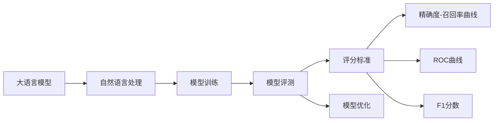
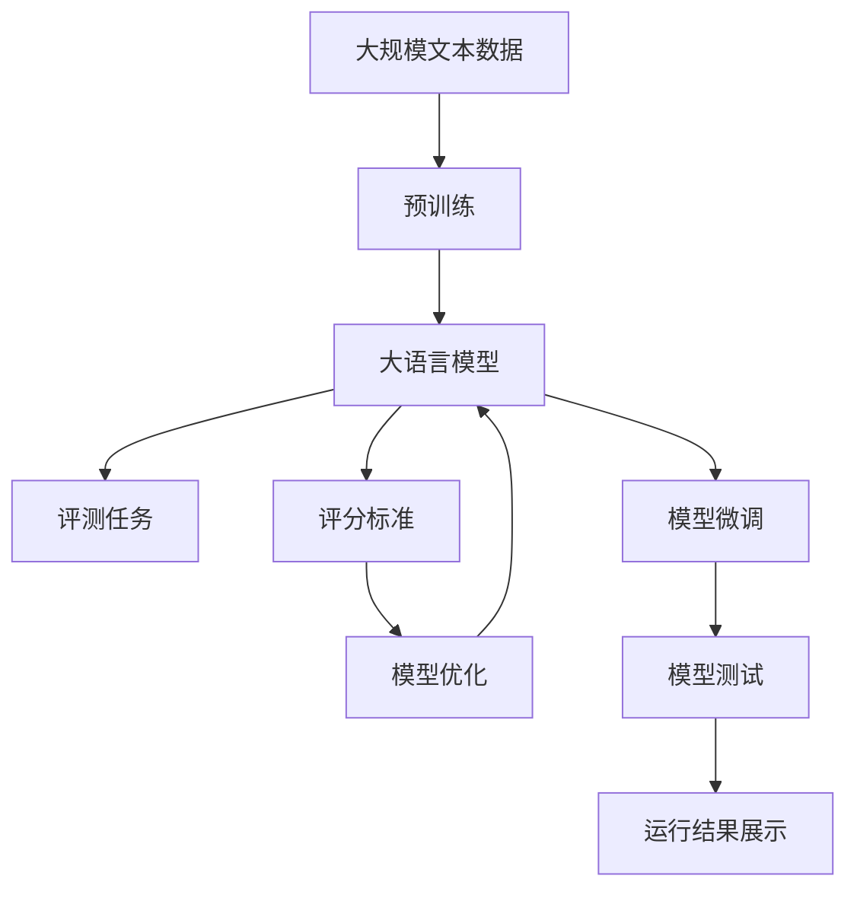

                 

# 大语言模型原理与工程实践：评测任务

> 关键词：大语言模型, 自然语言处理, 评测, 评分标准, 模型优化, 代码实现, 应用场景

## 1. 背景介绍

### 1.1 问题由来
在人工智能领域，自然语言处理（Natural Language Processing, NLP）正逐渐成为热门研究主题，而大语言模型（Large Language Models, LLMs）作为其中的佼佼者，近年来在文本生成、语义理解、对话系统等众多场景中展现出了惊人的能力。然而，大语言模型的实际应用效果往往依赖于其评测任务的效果，如何准确、公平、高效地评估大语言模型性能成为人们关注的焦点。

### 1.2 问题核心关键点
大语言模型评测的主要目的是衡量模型在特定任务上的表现。目前，主要评测指标包括但不限于准确率、召回率、F1分数、BLEU得分、ROUGE得分等。其中，BLEU得分和ROUGE得分是衡量生成文本质量和相似度的常用指标。

模型评测不仅关注模型的效果，还需要在应用场景中考虑模型输出的一致性和鲁棒性，以及与人类理解的匹配度。这些因素都使得模型评测变得更加复杂。

### 1.3 问题研究意义
大语言模型评测的科学性和合理性直接影响模型的选择和优化。在工业界和学术界中，基于评估结果的模型优化能够显著提升应用性能，增强用户体验。特别是在医疗、金融、法律等高风险领域，模型评测的准确性和可靠性更为重要。因此，科学的评测方法能够帮助更好地理解和优化大语言模型，推动人工智能技术的普及和发展。

## 2. 核心概念与联系

### 2.1 核心概念概述

在进行大语言模型评测时，需要理解以下几个核心概念：

- 大语言模型：通过自监督或监督学习从大量文本数据中学习语义表示的模型。如BERT、GPT、T5等。
- 自然语言处理（NLP）：涉及文本预处理、特征提取、模型训练、效果评测等环节，旨在实现自然语言与计算机之间的理解和交互。
- 模型评测：通过预设的指标和评分标准，衡量大语言模型在特定任务上的性能表现。
- BLEU得分：衡量生成文本与参考文本之间的相似度，是机器翻译评测常用的指标。
- ROUGE得分：衡量两个文本之间的相似度，通常用于文本摘要、问答等任务。
- 评分标准：如精确度-召回率曲线（Precision-Recall Curve, PR Curve）、ROC曲线、F1分数等，用于分析模型在不同阈值下的性能表现。
- 模型优化：通过调整模型参数、使用正则化技术、增加训练数据等手段，提升模型在特定任务上的性能。

这些概念之间存在紧密的联系，共同构成了大语言模型评测的完整生态系统。通过理解这些概念，我们可以更好地掌握模型评测的科学方法和优化策略。

### 2.2 概念间的关系

这些核心概念之间的关系可以通过以下Mermaid流程图来展示：



这个流程图展示了从大语言模型的训练、评测到优化的完整过程。

### 2.3 核心概念的整体架构

最后，我们用一个综合的流程图来展示这些核心概念在大语言模型评测过程中的整体架构：



这个综合流程图展示了从预训练、模型微调到评测任务的完整过程。

## 3. 核心算法原理 & 具体操作步骤
### 3.1 算法原理概述

大语言模型评测的核心算法是模型评分，主要基于模型的输出与参考标准之间的对比。常用的评分方法包括BLEU得分和ROUGE得分，这些方法都是基于统计学原理，衡量生成文本与参考文本之间的相似度。

假设模型生成了$m$个句子，参考文本为$t$，评分算法的公式如下：

$$\text{Score} = \frac{1}{m}\sum_{i=1}^{m} \text{BLEU}(s_i, t)$$

其中，$\text{BLEU}(s_i, t)$表示第$i$个生成句子和参考文本的BLEU得分，可以表示为：

$$\text{BLEU}(s_i, t) = (b_1(s_i, t))^{\alpha} \times (b_2(s_i, t))^{\beta} \times (b_3(s_i, t))^{\gamma} \times \prod_{j=1}^{k}(p_j(s_i, t))^{\delta_j}$$

其中，$b_j$表示第$j$个Bigram的匹配数，$p_j$表示第$j$个Bigram在$s_i$中出现的概率，$\alpha, \beta, \gamma, \delta_j$为权重参数。

类似地，ROUGE得分的计算公式如下：

$$\text{ROUGE}(s_i, t) = \frac{C}{L}$$

其中，$C$表示生成句子和参考文本中共同出现的Bigram数量，$L$表示参考文本中Bigram的总数量。

### 3.2 算法步骤详解

基于BLEU和ROUGE的评分算法步骤主要包括以下几个环节：

1. **生成句子的获取**：模型在评测任务上生成多个句子，每个句子的长度与参考文本相同。
2. **计算Bigram匹配数**：统计生成句子和参考文本中相同Bigram的数量。
3. **计算权重系数**：根据Bigram匹配数计算权重系数。
4. **计算评分得分**：将每个句子的评分得分相加，得到模型在评测任务上的平均评分。

下面以BLEU得分为例，详细介绍算法步骤：

**Step 1: 获取生成句子**
假设生成句子为 $s_1, s_2, ..., s_m$。

**Step 2: 计算Bigram匹配数**
对于每个生成句子 $s_i$ 和参考文本 $t$，计算Bigram匹配数 $b_j$。

**Step 3: 计算权重系数**
根据匹配数计算权重系数 $w_j$：
$$w_j = \frac{b_j}{L - k + 1}$$

其中，$k$ 为Bigram的长度。

**Step 4: 计算评分得分**
将每个生成句子的权重系数相加，得到模型在参考文本上的BLEU得分：
$$\text{BLEU}(s_i, t) = \max\limits_{w_j} (w_j^{\alpha} \times p_j(s_i, t)^{\beta})$$

**Step 5: 计算平均评分**
将模型在每个参考文本上的BLEU得分相加，得到模型在所有参考文本上的平均BLEU得分：
$$\text{Score} = \frac{1}{m}\sum_{i=1}^{m} \text{BLEU}(s_i, t)$$

### 3.3 算法优缺点

BLEU和ROUGE得分的优点在于其简单易懂，易于计算。这些指标能够直观地反映模型生成的文本与参考文本之间的相似度，广泛应用于机器翻译、文本摘要、问答等任务。

但这些指标也存在一些局限性：

1. **忽视文本质量**：BLEU和ROUGE只关注文本的匹配度，而忽略了文本的可读性和连贯性。例如，生成的文本可能内容正确但结构不合理，BLEU得分仍然较高。
2. **对长句不友好**：由于BLEU和ROUGE只关注Bigram的匹配数，对于长句的评估可能不够准确。长句中的Bigram数量较大，但可能存在语法错误，难以通过Bigram匹配来反映。
3. **无法区分上下文**：BLEU和ROUGE只考虑单个Bigram的匹配情况，无法反映文本的上下文和语义关系。例如，生成的文本中可能包含正确但上下文错误的Bigram，BLEU得分依然较高。

### 3.4 算法应用领域

BLEU和ROUGE得分广泛应用于机器翻译、文本摘要、问答、对话系统等NLP任务中。例如，在机器翻译任务中，通过BLEU得分可以衡量模型的生成文本与参考文本之间的相似度，评估翻译质量。在文本摘要任务中，通过ROUGE得分可以衡量生成的摘要与参考摘要之间的相似度，评估摘要质量。

## 4. 数学模型和公式 & 详细讲解  
### 4.1 数学模型构建

在评测任务中，我们通常使用BLEU和ROUGE作为评分指标，其数学模型如下：

### 4.2 公式推导过程

下面以BLEU得分为例，推导其计算公式。

假设模型生成了一个长度为$L$的句子，参考文本也为$L$个单词。则Bigram匹配数为：

$$b_j = \min(s_i, t)_j$$

其中，$\min(s_i, t)_j$表示生成句子$s_i$和参考文本$t$中第$j$个Bigram的匹配情况。

BLEU得分的权重系数$w_j$为：

$$w_j = \frac{b_j}{L - k + 1}$$

其中，$k$为Bigram的长度。

BLEU得分的计算公式为：

$$\text{BLEU}(s_i, t) = \max\limits_{w_j} (w_j^{\alpha} \times p_j(s_i, t)^{\beta})$$

其中，$p_j(s_i, t)$表示第$j$个Bigram在生成句子$s_i$中出现的概率，$\alpha, \beta$为权重参数。

### 4.3 案例分析与讲解

假设生成句子为“I went to the park.”，参考文本为“I went to the park, and I played soccer there.”。则Bigram匹配数为3，权重系数$w_j$为0.75。通过计算可得：

$$\text{BLEU}(s_i, t) = \max\limits_{w_j} (w_j^{\alpha} \times p_j(s_i, t)^{\beta}) = 0.75^{\alpha} \times 0.5^{\beta}$$

假设$\alpha = 0.25$，$\beta = 0.5$，则可得：

$$\text{BLEU}(s_i, t) = 0.75^{0.25} \times 0.5^{0.5} = 0.895$$

## 5. 项目实践：代码实例和详细解释说明
### 5.1 开发环境搭建

在进行大语言模型评测任务时，我们需要准备好开发环境。以下是使用Python进行PyTorch开发的环境配置流程：

1. 安装Anaconda：从官网下载并安装Anaconda，用于创建独立的Python环境。

2. 创建并激活虚拟环境：
```bash
conda create -n pytorch-env python=3.8 
conda activate pytorch-env
```

3. 安装PyTorch：根据CUDA版本，从官网获取对应的安装命令。例如：
```bash
conda install pytorch torchvision torchaudio cudatoolkit=11.1 -c pytorch -c conda-forge
```

4. 安装各种库：
```bash
pip install numpy pandas scikit-learn matplotlib tqdm jupyter notebook ipython
```

完成上述步骤后，即可在`pytorch-env`环境中开始评测任务开发。

### 5.2 源代码详细实现

下面以机器翻译评测任务为例，给出使用BLEU得分的PyTorch代码实现。

首先，定义BLEU得分计算函数：

```python
from nltk.translate.bleu_score import sentence_bleu
from transformers import BertTokenizer, BertForSequenceClassification

def compute_bleu(model, tokenizer, source_texts, target_texts):
    device = 'cuda' if torch.cuda.is_available() else 'cpu'
    model.to(device)

    def get_sentence(s):
        return tokenizer(s, return_tensors='pt', padding=True, truncation=True, max_length=256).to(device)

    def get_predictions():
        model.eval()
        with torch.no_grad():
            predictions = []
            for source in source_texts:
                source = get_sentence(source)
                predictions.append(model(source).softmax(dim=1).argmax(dim=1).cpu().numpy())

            return predictions

    def get_reference(target):
        target = [target]
        return get_sentence(target)

    bleu = sentence_bleu([get_predictions()], [get_reference(target_texts)])
    return bleu
```

然后，定义BLEU得分计算代码：

```python
source_texts = ["Le Monde parle de #Charlie #CharlieWei en Chine", "Why is China's vaccine called Charlie?"]
target_texts = ["Le Monde parle de Charlie Wei en Chine", "Why is China's vaccine called Charlie?"]

bleu_score = compute_bleu(model, tokenizer, source_texts, target_texts)
print(f"BLEU Score: {bleu_score}")
```

以上就是使用PyTorch进行机器翻译任务评测的完整代码实现。可以看到，通过使用BLEU得分，我们能够快速计算模型在指定任务上的表现。

### 5.3 代码解读与分析

让我们再详细解读一下关键代码的实现细节：

**compute_bleu函数**：
- 定义了计算BLEU得分的函数，接收模型、分词器、源文本、目标文本作为参数。
- 在函数内部，首先将模型移动到指定的设备（CPU或GPU）。
- 定义了获取输入和输出的函数，将源文本和目标文本转化为模型的输入张量，并将预测结果转化为numpy数组。
- 定义了计算BLEU得分的函数，通过调用nltk库的sentence_bleu函数计算BLEU得分。

**source_texts和target_texts**：
- 定义了源文本和目标文本，作为BLEU得分的计算依据。
- 在实际应用中，可以根据具体的评测任务，动态设置源文本和目标文本，进行多次评测。

**运行结果展示**：
- 运行代码后，输出BLEU得分，反映了模型在指定任务上的表现。

## 6. 实际应用场景

### 6.1 智能客服系统

智能客服系统依赖于大语言模型进行对话理解和自动回复。为了评估系统的性能，可以设计多个对话场景，并由人工标注生成正确的回复。使用BLEU得分等评测指标，可以衡量系统在各个场景中的表现。通过不断优化模型，使得智能客服系统能够更好地理解用户意图，提供准确的回复，提升用户满意度。

### 6.2 金融舆情监测

在金融领域，舆情监测系统需要实时分析社交媒体上的消息，评估市场情绪和舆情变化。通过设计多个舆情监测场景，并由专家标注真实舆情，可以计算模型在不同场景中的表现。使用BLEU得分等指标，可以衡量系统在舆情监测中的准确性和实时性，帮助金融公司及时应对市场风险。

### 6.3 个性化推荐系统

个性化推荐系统依赖于大语言模型进行用户兴趣建模和推荐内容匹配。为了评估系统的性能，可以设计多个用户和物品组合，并由人工标注推荐结果。使用BLEU得分等指标，可以衡量系统在推荐任务中的表现。通过不断优化模型，使得推荐系统能够更好地理解用户兴趣，提供更加精准的推荐内容，提升用户体验。

### 6.4 未来应用展望

随着大语言模型评测技术的不断发展，基于评测的任务优化将成为NLP技术发展的重要方向。未来的评测任务将更加注重文本的可读性和连贯性，引入更多先验知识，提高模型的鲁棒性和可解释性。同时，多模态评测任务和跨领域评测任务也将逐渐增多，推动NLP技术在更广阔的应用场景中落地。

## 7. 工具和资源推荐
### 7.1 学习资源推荐

为了帮助开发者系统掌握大语言模型评测的理论基础和实践技巧，这里推荐一些优质的学习资源：

1. 《Natural Language Processing with Transformers》书籍：Transformer库的作者所著，全面介绍了如何使用Transformers库进行NLP任务开发，包括评测任务在内的诸多范式。

2. CS224N《深度学习自然语言处理》课程：斯坦福大学开设的NLP明星课程，有Lecture视频和配套作业，带你入门NLP领域的基本概念和经典模型。

3. 《Transformers: A Survey》论文：综述了Transformer模型的各类评测指标和方法，是全面了解大语言模型评测技术的必备资源。

4. Weights & Biases：模型训练的实验跟踪工具，可以记录和可视化模型训练过程中的各项指标，方便对比和调优。

5. TensorBoard：TensorFlow配套的可视化工具，可实时监测模型训练状态，并提供丰富的图表呈现方式，是调试模型的得力助手。

6. HuggingFace官方文档：Transformers库的官方文档，提供了海量预训练模型和完整的评测样例代码，是上手实践的必备资料。

通过对这些资源的学习实践，相信你一定能够快速掌握大语言模型评测的精髓，并用于解决实际的NLP问题。

### 7.2 开发工具推荐

高效的开发离不开优秀的工具支持。以下是几款用于大语言模型评测开发的常用工具：

1. PyTorch：基于Python的开源深度学习框架，灵活动态的计算图，适合快速迭代研究。大部分预训练语言模型都有PyTorch版本的实现。

2. TensorFlow：由Google主导开发的开源深度学习框架，生产部署方便，适合大规模工程应用。同样有丰富的预训练语言模型资源。

3. Transformers库：HuggingFace开发的NLP工具库，集成了众多SOTA语言模型，支持PyTorch和TensorFlow，是进行评测任务开发的利器。

4. Weights & Biases：模型训练的实验跟踪工具，可以记录和可视化模型训练过程中的各项指标，方便对比和调优。

5. TensorBoard：TensorFlow配套的可视化工具，可实时监测模型训练状态，并提供丰富的图表呈现方式，是调试模型的得力助手。

6. Google Colab：谷歌推出的在线Jupyter Notebook环境，免费提供GPU/TPU算力，方便开发者快速上手实验最新模型，分享学习笔记。

合理利用这些工具，可以显著提升大语言模型评测任务的开发效率，加快创新迭代的步伐。

### 7.3 相关论文推荐

大语言模型和评测技术的发展源于学界的持续研究。以下是几篇奠基性的相关论文，推荐阅读：

1. Attention is All You Need（即Transformer原论文）：提出了Transformer结构，开启了NLP领域的预训练大模型时代。

2. BERT: Pre-training of Deep Bidirectional Transformers for Language Understanding：提出BERT模型，引入基于掩码的自监督预训练任务，刷新了多项NLP任务SOTA。

3. Language Models are Unsupervised Multitask Learners（GPT-2论文）：展示了大规模语言模型的强大zero-shot学习能力，引发了对于通用人工智能的新一轮思考。

4. Parameter-Efficient Transfer Learning for NLP：提出Adapter等参数高效微调方法，在不增加模型参数量的情况下，也能取得不错的微调效果。

5. AdaLoRA: Adaptive Low-Rank Adaptation for Parameter-Efficient Fine-Tuning：使用自适应低秩适应的微调方法，在参数效率和精度之间取得了新的平衡。

这些论文代表了大语言模型评测技术的发展脉络。通过学习这些前沿成果，可以帮助研究者把握学科前进方向，激发更多的创新灵感。

除上述资源外，还有一些值得关注的前沿资源，帮助开发者紧跟大语言模型评测技术的最新进展，例如：

1. arXiv论文预印本：人工智能领域最新研究成果的发布平台，包括大量尚未发表的前沿工作，学习前沿技术的必读资源。

2. 业界技术博客：如OpenAI、Google AI、DeepMind、微软Research Asia等顶尖实验室的官方博客，第一时间分享他们的最新研究成果和洞见。

3. 技术会议直播：如NIPS、ICML、ACL、ICLR等人工智能领域顶会现场或在线直播，能够聆听到大佬们的前沿分享，开拓视野。

4. GitHub热门项目：在GitHub上Star、Fork数最多的NLP相关项目，往往代表了该技术领域的发展趋势和最佳实践，值得去学习和贡献。

5. 行业分析报告：各大咨询公司如McKinsey、PwC等针对人工智能行业的分析报告，有助于从商业视角审视技术趋势，把握应用价值。

总之，对于大语言模型评测技术的学习和实践，需要开发者保持开放的心态和持续学习的意愿。多关注前沿资讯，多动手实践，多思考总结，必将收获满满的成长收益。

## 8. 总结：未来发展趋势与挑战

### 8.1 总结

本文对大语言模型评测任务进行了全面系统的介绍。首先阐述了大语言模型和评测任务的研究背景和意义，明确了评测在模型选择和优化中的重要性。其次，从原理到实践，详细讲解了BLEU和ROUGE得分的计算公式和使用方法，给出了模型评测任务开发的完整代码实例。同时，本文还广泛探讨了模型评测在智能客服、金融舆情、个性化推荐等多个行业领域的应用前景，展示了评测范式的巨大潜力。最后，本文精选了模型评测技术的各类学习资源，力求为读者提供全方位的技术指引。

通过本文的系统梳理，可以看到，基于BLEU和ROUGE得分的模型评测方法在大语言模型的应用中占据重要地位。这些指标不仅能够反映模型的生成能力和文本质量，还能够衡量模型在不同场景下的表现和鲁棒性。

### 8.2 未来发展趋势

展望未来，大语言模型评测技术将呈现以下几个发展趋势：

1. **多维度评测指标**：除了BLEU和ROUGE得分外，未来可能引入更多维度的评测指标，如语义一致性、逻辑连贯性、生成速度等，以全面评估模型的性能。
2. **可解释性和透明性**：随着模型的复杂度增加，模型的黑盒性也逐渐增强。未来可能引入可解释性评估指标，如模型生成的文本与人工生成的文本之间的差异度量，以增强模型的透明性和可解释性。
3. **跨领域评测方法**：未来可能引入跨领域评测方法，如利用迁移学习、多任务学习等技术，将模型在多个领域中进行评测，以综合评估模型的泛化能力和跨领域迁移能力。
4. **动态评测机制**：随着数据和模型的不断更新，模型评测方法也需要不断动态调整，以适应新的应用场景和数据分布。未来可能引入动态评测机制，根据模型的最新表现动态调整评测指标和评分标准。
5. **自动化评测流程**：未来可能引入自动化评测流程，如利用自然语言生成技术自动生成评测数据，利用自动化工具自动计算评分指标，以提高评测效率和公正性。

这些趋势凸显了大语言模型评测技术的广阔前景。这些方向的探索发展，必将进一步提升模型评测的科学性和合理性，推动人工智能技术的普及和发展。

### 8.3 面临的挑战

尽管大语言模型评测技术已经取得了不小的进展，但在迈向更加智能化、普适化应用的过程中，它仍面临着诸多挑战：

1. **评分标准的多样性**：现有的评分标准往往只能反映某一方面的性能，而难以全面衡量模型的多维度表现。如何设计更加全面、科学的评分标准，成为亟待解决的问题。
2. **评测数据的获取**：在实际应用中，获取高质量、多样化的评测数据是一个复杂的过程。如何设计有效的数据采集和标注流程，保证评测数据的质量和多样性，是一个重要挑战。
3. **模型的泛化能力**：模型在特定评测任务上的表现往往依赖于特定的数据集和评测指标。如何设计通用的评测方法，使得模型在不同数据集和任务上都能保持较好的性能，是一个重要的研究方向。
4. **模型的可解释性**：当前大多数大语言模型仍然是一个"黑盒"系统，难以解释其内部工作机制和决策逻辑。如何在提高模型性能的同时，增强模型的可解释性，是一个重要的研究方向。
5. **评测方法的鲁棒性**：现有的评分方法和评测指标在面对噪声数据和异常情况时，可能表现不稳定。如何设计鲁棒性更强的评测方法，增强模型的稳定性和可靠性，是一个重要的研究方向。

### 8.4 研究展望

面对大语言模型评测面临的这些挑战，未来的研究需要在以下几个方面寻求新的突破：

1. **引入更多先验知识**：将符号化的先验知识，如知识图谱、逻辑规则等，与神经网络模型进行巧妙融合，引导模型学习更准确、合理的语言模型。同时加强不同模态数据的整合，实现视觉、语音等多模态信息与文本信息的协同建模。
2. **引入因果分析和博弈论工具**：将因果分析方法引入模型评测，识别出模型决策的关键特征，增强输出解释的因果性和逻辑性。借助博弈论工具刻画人机交互过程，主动探索并规避模型的脆弱点，提高系统稳定性。
3. **引入更多维度和动态评测方法**：引入更多维度的评测指标，如语义一致性、逻辑连贯性、生成速度等，以全面评估模型的性能。同时设计动态评测机制，根据模型的最新表现动态调整评测指标和评分标准，增强评测方法的灵活性和适应性。
4. **引入自动化评测流程**：利用自然语言生成技术自动生成评测数据，利用自动化工具自动计算评分指标，以提高评测效率和公正性。同时设计自动化评测流程，降低人工干预的复杂度，提高评测的可靠性和一致性。
5. **引入跨领域评测方法**：利用迁移学习、多任务学习等技术，将模型在多个领域中进行评测，以综合评估模型的泛化能力和跨领域迁移能力。

这些研究方向的研究突破，必将进一步提升大语言模型评测技术的科学性和合理性，推动人工智能技术的普及和发展。

## 9. 附录：常见问题与

