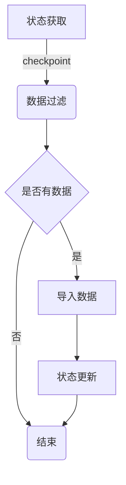

# Sqoop增量导入原理与代码实例讲解

## 1. 背景介绍

### 1.1 问题的由来

在大数据时代,数据量呈指数级增长,传统的数据处理方式已经无法满足现有需求。大数据技术应运而生,旨在解决海量数据的存储、计算和分析等问题。数据集成作为大数据处理的第一步,将数据从不同的源系统抽取并加载到大数据平台中,是确保后续数据处理和分析的基础。

传统的数据集成工具如ETL(Extract-Transform-Load),在处理大数据时存在诸多弊端:

1. 性能低下:ETL工具在处理TB甚至PB级数据时,效率极低。
2. 可扩展性差:ETL工具通常是基于单机架构,无法利用分布式计算资源。
3. 数据格式兼容性差:ETL工具主要针对结构化数据,对于半结构化和非结构化数据支持不佳。

为解决上述问题,Apache Sqoop应运而生。Sqoop是一款开源的数据集成工具,专门用于在大数据平台(如Hadoop)和结构化数据存储(如关系型数据库)之间高效传输批量数据。它基于并行处理架构,可实现高吞吐量的数据传输,并支持全量和增量两种导入模式。

### 1.2 研究现状

Sqoop作为连接关系数据库和Hadoop的桥梁,在大数据生态系统中扮演着重要角色。目前,Sqoop已被广泛应用于各行业的数据集成场景,如电商、金融、运营商等。

然而,Sqoop的增量导入功能一直是研究的热点和难点。由于增量导入需要保存数据的状态信息,并根据状态信息判断哪些数据需要导入,因此实现机制较为复杂。目前,Sqoop支持多种增量导入方式,包括基于时间戳、基于增量键和基于元数据等。每种方式都有其适用场景和局限性,需要根据具体需求选择合适的方案。

### 1.3 研究意义

掌握Sqoop增量导入的原理和实现方式,对于高效构建大数据平台至关重要。通过增量导入,可以避免全量导入所带来的数据冗余和资源浪费,提高数据处理效率。同时,增量导入也是实现数据实时同步的基础,可支持实时数据分析等应用场景。

因此,深入研究Sqoop增量导入机制,对于提高大数据处理能力、优化资源利用率、支持实时数据处理等方面都有重要意义。

### 1.4 本文结构

本文将全面介绍Sqoop增量导入的原理、实现方式和代码实例,内容安排如下:

1. 背景介绍
2. 核心概念与联系
3. 核心算法原理与具体操作步骤
4. 数学模型和公式及详细讲解
5. 项目实践:代码实例和详细解释说明
6. 实际应用场景
7. 工具和资源推荐
8. 总结:未来发展趋势与挑战
9. 附录:常见问题与解答

## 2. 核心概念与联系

在深入探讨Sqoop增量导入原理之前,我们先介绍几个核心概念:

1. **全量导入(Full Import)**: 将数据源中的全部数据导入到目标系统,通常作为第一次导入的方式。

2. **增量导入(Incremental Import)**: 只导入自上次导入后新增或更新的数据,避免重复导入,提高效率。

3. **检查点(Checkpoint)**: 增量导入的关键,用于记录上次导入的状态,如时间戳、增量键值等,作为下次导入的起点。

4. **增量键(Incremental Key)**: 一个或多个列的组合,用于唯一标识每条记录,判断记录是新增还是更新。

5. **元数据(Metadata)**: 描述数据的数据,如表结构、列信息等,在增量导入中用于判断表的变化。

这些概念相互关联、环环相扣,构成了Sqoop增量导入的基础。下面我们将详细介绍它们的原理和实现方式。

## 3. 核心算法原理与具体操作步骤

Sqoop增量导入的核心算法原理可概括为三个步骤:状态获取、数据过滤和状态更新。我们用一个流程图来直观地展示:

### 3.1 算法原理概述

1. **状态获取**:从检查点中获取上次导入的状态信息,如时间戳、增量键值等。
2. **数据过滤**:根据状态信息,过滤出自上次导入后新增或更新的数据。
3. **导入数据**:将过滤后的数据导入到目标系统(如HDFS)。
4. **状态更新**:更新检查点,保存本次导入的状态信息,为下次增量导入做准备。

不同的增量导入方式,在具体实现上会有所不同,但总体思路是一致的。下面我们分别介绍基于时间戳、基于增量键和基于元数据三种增量导入方式的实现细节。

### 3.2 算法步骤详解

#### 3.2.1 基于时间戳的增量导入

该方式依赖于数据源表中的一个或多个时间戳列,通过比较时间戳值来判断记录是否为新增或更新。算法步骤如下:

1. 获取检查点中保存的最新时间戳值。
2. 从数据源表中过滤出时间戳大于检查点值的记录。
3. 将过滤后的记录导入到目标系统。
4. 更新检查点,保存本次导入的最大时间戳值。

优点是实现简单,只需指定时间戳列即可。缺点是如果记录的时间戳值被修改,可能会导致数据丢失或重复导入。

#### 3.2.2 基于增量键的增量导入

该方式需要在数据源表中指定一个或多个列作为增量键,通过比较增量键值来判断记录是新增还是更新。算法步骤如下:

1. 获取检查点中保存的最新增量键值。
2. 从数据源表中过滤出增量键大于检查点值的记录,作为新增数据。
3. 对于增量键小于等于检查点值的记录,与检查点中的记录进行比对,将不同的记录作为更新数据。
4. 将新增和更新数据导入到目标系统。
5. 更新检查点,保存本次导入的最大增量键值。

优点是能够完整捕获新增和更新数据。缺点是实现较为复杂,需要指定合适的增量键,并进行数据比对。

#### 3.2.3 基于元数据的增量导入

该方式通过分析数据源表的元数据变化(如表结构、列信息等)来判断哪些数据需要导入。算法步骤如下:

1. 获取检查点中保存的元数据信息。
2. 分析数据源表的当前元数据,与检查点中的元数据进行比对。
3. 如果元数据发生变化,则进行全量导入;否则执行增量导入。
4. 增量导入时,过滤出自上次导入后新增或更新的数据。
5. 将过滤后的数据导入到目标系统。
6. 更新检查点,保存本次导入的元数据信息。

优点是能够自动检测表结构变化,确保数据的完整性。缺点是实现较为复杂,需要解析和比对元数据信息。

### 3.3 算法优缺点

每种增量导入方式都有其优缺点,具体如下:

1. **基于时间戳**:
   - 优点:实现简单,只需指定时间戳列。
   - 缺点:如果时间戳值被修改,可能导致数据丢失或重复导入。
2. **基于增量键**:
   - 优点:能够完整捕获新增和更新数据。
   - 缺点:实现较为复杂,需要指定合适的增量键并进行数据比对。
3. **基于元数据**:
   - 优点:能够自动检测表结构变化,确保数据的完整性。
   - 缺点:实现较为复杂,需要解析和比对元数据信息。

在实际应用中,需要根据具体场景选择合适的增量导入方式,或者结合多种方式以获得更好的效果。

### 3.4 算法应用领域

Sqoop增量导入算法广泛应用于以下领域:

1. **数据集成**:将关系型数据库中的数据增量导入到Hadoop等大数据平台,为后续的数据处理和分析做准备。
2. **数据同步**:实时或准实时地将数据源中的变更数据同步到目标系统,确保数据的实时性。
3. **数据备份**:定期将数据源中的新增或更新数据备份到另一个存储系统,实现数据的冗余备份。
4. **数据迁移**:在系统迁移或升级时,将原有系统中的增量数据迁移到新系统,避免全量迁移所带来的资源浪费。

总之,任何需要高效、增量式地传输数据的场景,都可以应用Sqoop增量导入算法。

## 4. 数学模型和公式及详细讲解

在实现Sqoop增量导入算法时,我们需要构建一些数学模型和公式来描述和计算相关指标,下面将详细介绍。

### 4.1 数学模型构建

我们将数据源表记为 $D$,包含 $n$ 条记录 $\{r_1, r_2, \cdots, r_n\}$。每条记录 $r_i$ 由 $m$ 个属性组成,记为 $\{a_{i1}, a_{i2}, \cdots, a_{im}\}$。

对于基于时间戳的增量导入,我们假设数据源表包含一个时间戳列 $t$,记为 $D(t)$。上次导入的最新时间戳值记为 $t_0$。本次需要导入的记录集合可表示为:

$$I_t = \{r_i | r_i \in D(t), t_i > t_0\}$$

其中 $t_i$ 表示记录 $r_i$ 的时间戳值。

对于基于增量键的增量导入,我们假设数据源表包含一个或多个增量键列,记为 $K = \{k_1, k_2, \cdots, k_p\}$。上次导入的最新增量键值记为 $K_0 = \{k_{01}, k_{02}, \cdots, k_{0p}\}$。本次需要导入的新增记录集合可表示为:

$$I_n = \{r_i | r_i \in D(K), K_i > K_0\}$$

其中 $K_i = \{k_{i1}, k_{i2}, \cdots, k_{ip}\}$ 表示记录 $r_i$ 的增量键值。

对于可能更新的记录,我们需要将其与上次导入的记录进行比对,得到更新记录集合:

$$I_u = \{r_i | r_i \in D(K), K_i \leq K_0, r_i \neq r_0\}$$

其中 $r_0$ 表示上次导入的对应记录。

综上所述,本次需要导入的记录集合为新增记录和更新记录的并集:

$$I = I_n \cup I_u$$

对于基于元数据的增量导入,我们需要比较数据源表的当前元数据 $M$ 与上次导入时的元数据 $M_0$。如果 $M \neq M_0$,则需要进行全量导入;否则执行增量导入,过滤出自上次导入后新增或更新的数据。

### 4.2 公式推导过程

下面我们推导一下,在基于增量键的增量导入中,如何计算新增记录集合 $I_n$ 和更新记录集合 $I_u$ 的大小。

假设数据源表 $D$ 包含 $n$ 条记录,增量键 $K$ 是一个单列主键。上次导入的最新增量键值为 $k_0$,则有:

$$|I_n| = |\{r_i | r_i \in D(K), k_i > k_0\}| = n - |\{r_i | r_i \in D(K), k_i \leq k_0\}|$$

令 $n_0 = |\{r_i | r_i \in D(K), k_i