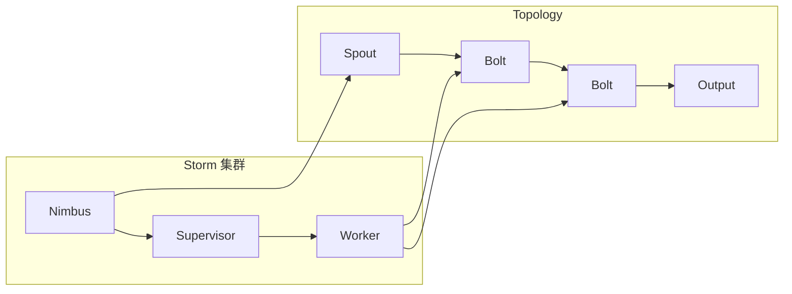

# Storm Topology原理与代码实例讲解

作者：禅与计算机程序设计艺术 / Zen and the Art of Computer Programming

## 1. 背景介绍

### 1.1 问题的由来

在当今大数据时代，实时数据处理的需求日益增长。传统的数据处理方式往往无法满足实时性要求，因此，分布式实时计算框架应运而生。Storm 作为一款开源的分布式实时计算框架，凭借其高吞吐量、低延迟、容错性强等特点，在实时数据处理领域得到了广泛应用。

### 1.2 研究现状

目前，业界已经涌现出许多优秀的分布式实时计算框架，例如 Apache Storm、Apache Flink、Apache Spark Streaming 等。Storm 作为最早出现的框架之一，在实时数据处理领域积累了丰富的经验，并拥有庞大的社区和生态系统。

### 1.3 研究意义

深入理解 Storm Topology 的原理和代码实现，对于开发者进行实时数据处理应用开发具有重要意义。本文将从 Storm Topology 的核心概念、架构、算法原理、代码实现等方面进行详细讲解，并结合实际案例进行分析，帮助读者更好地理解和应用 Storm 框架。

### 1.4 本文结构

本文将从以下几个方面展开：

- **背景介绍：** 概述 Storm 的背景、研究现状和意义。
- **核心概念与联系：** 介绍 Storm Topology 的核心概念和相关概念。
- **核心算法原理 & 具体操作步骤：** 详细讲解 Storm Topology 的算法原理和操作步骤。
- **数学模型和公式 & 详细讲解 & 举例说明：** 从数学角度分析 Storm Topology 的模型和算法。
- **项目实践：代码实例和详细解释说明：** 通过代码实例演示 Storm Topology 的实现和应用。
- **实际应用场景：** 探讨 Storm Topology 在实际应用中的场景和案例。
- **工具和资源推荐：** 推荐一些学习 Storm Topology 的工具和资源。
- **总结：未来发展趋势与挑战：** 总结 Storm Topology 的发展趋势和面临的挑战。
- **附录：常见问题与解答：** 回答一些常见的关于 Storm Topology 的问题。

## 2. 核心概念与联系

### 2.1 Storm Topology

Storm Topology 是 Storm 中的核心概念，它定义了实时数据处理的逻辑流程。一个 Topology 由一系列 Spout 和 Bolt 组成，它们之间通过 Stream 进行数据传递。

### 2.2 Spout

Spout 是 Topology 的数据源，它负责从外部系统获取数据并发送到 Topology 中。Spout 可以从各种数据源获取数据，例如消息队列、数据库、文件系统等。

### 2.3 Bolt

Bolt 是 Topology 的数据处理单元，它负责对来自 Spout 或其他 Bolt 的数据进行处理。Bolt 可以执行各种数据处理操作，例如过滤、聚合、统计等。

### 2.4 Stream

Stream 是数据在 Topology 中传递的媒介。数据从 Spout 发送到 Bolt，然后在 Bolt 之间传递，最终到达输出端。

### 2.5 Nimbus

Nimbus 是 Storm 集群的管理节点，它负责管理 Topology 的生命周期，包括部署、监控、故障恢复等。

### 2.6 Supervisor

Supervisor 是 Storm 集群的工作节点，它负责运行 Topology 的任务。每个 Supervisor 可以运行多个任务。

### 2.7 Worker

Worker 是 Supervisor 上运行的进程，它负责执行 Topology 的任务。每个 Worker 可以运行多个任务。

### 2.8 Task

Task 是 Topology 的最小执行单元，它负责处理来自 Spout 或其他 Bolt 的数据。每个 Task 运行在一个特定的 Worker 上。

### 2.9 Executor

Executor 是 Task 的执行线程，它负责执行 Task 的逻辑。每个 Executor 可以运行多个 Task。

### 2.10  Storm 概念关系图



## 3. 核心算法原理 & 具体操作步骤

### 3.1 算法原理概述

Storm Topology 的核心算法是基于 **数据流图** 和 **任务调度** 的。数据流图定义了数据在 Topology 中的流动路径，而任务调度则负责将 Task 分配到不同的 Worker 上运行。

### 3.2 算法步骤详解

Storm Topology 的算法步骤如下：

1. **数据源：** Spout 从外部系统获取数据。
2. **数据处理：** Bolt 对来自 Spout 或其他 Bolt 的数据进行处理。
3. **数据传递：** 数据通过 Stream 在 Spout 和 Bolt 之间传递。
4. **任务调度：** Nimbus 将 Task 分配到不同的 Worker 上运行。
5. **任务执行：** Worker 上的 Executor 执行 Task 的逻辑。
6. **数据输出：** 数据最终输出到外部系统。

### 3.3 算法优缺点

**优点：**

- **高吞吐量：** Storm 可以处理大量的数据。
- **低延迟：** Storm 的数据处理速度很快。
- **容错性强：** Storm 可以自动检测和恢复故障。
- **可扩展性：** Storm 可以轻松扩展到多个节点。

**缺点：**

- **复杂性：** Storm 的配置和管理比较复杂。
- **调试困难：** Storm 的调试比较困难。

### 3.4 算法应用领域

Storm Topology 适用于各种实时数据处理场景，例如：

- **实时数据分析：** 对实时数据进行分析，例如用户行为分析、趋势预测等。
- **实时监控：** 实时监控系统运行状态，例如服务器监控、网络监控等。
- **实时消息处理：** 实时处理消息，例如聊天消息、订单消息等。
- **实时数据同步：** 实时同步数据，例如数据库同步、文件同步等。

## 4. 数学模型和公式 & 详细讲解 & 举例说明

### 4.1 数学模型构建

Storm Topology 可以用 **有向图** 来表示，其中节点代表 Spout 或 Bolt，边代表数据流。每个节点可以有多个输入边和输出边，代表数据流的来源和去向。

### 4.2 公式推导过程

Storm Topology 的数据处理过程可以用以下公式来表示：

$$
Output = f(Input)
$$

其中：

- $Output$ 代表 Bolt 的输出数据。
- $Input$ 代表 Bolt 的输入数据。
- $f$ 代表 Bolt 的数据处理函数。

### 4.3 案例分析与讲解

假设我们要构建一个实时数据分析系统，用于分析用户行为数据。该系统包含以下组件：

- **Spout：** 从消息队列中获取用户行为数据。
- **Bolt 1：** 对用户行为数据进行过滤，只保留有效数据。
- **Bolt 2：** 对过滤后的数据进行聚合，统计每个用户的行为次数。
- **Bolt 3：** 将聚合结果输出到数据库。

该系统可以用以下有向图来表示：


### 4.4 常见问题解答

**Q：如何保证 Storm Topology 的可靠性？**

**A：** Storm 通过 **ACK 机制** 来保证数据处理的可靠性。当 Spout 发送数据到 Bolt 时，会生成一个消息 ID，并将其发送给 Bolt。Bolt 处理完数据后，会向 Spout 发送 ACK 消息，表示数据处理成功。如果 Bolt 在处理数据时失败，则会向 Spout 发送 FAIL 消息，表示数据处理失败。Spout 收到 ACK 或 FAIL 消息后，会根据消息类型进行相应的处理。

**Q：如何提高 Storm Topology 的性能？**

**A：** 可以通过以下方法提高 Storm Topology 的性能：

- **优化数据流图：** 合理设计数据流图，减少数据传输次数。
- **优化数据处理逻辑：** 优化 Bolt 的数据处理逻辑，提高处理速度。
- **增加 Worker 和 Executor：** 增加 Worker 和 Executor，提高并行处理能力。
- **使用缓存：** 使用缓存，减少数据访问次数。

## 5. 项目实践：代码实例和详细解释说明

### 5.1 开发环境搭建

**1. 安装 Java 开发环境：** 确保系统已安装 Java 开发环境。

**2. 安装 Maven：** Maven 是 Java 项目的构建工具，用于管理项目依赖。

**3. 下载 Storm：** 从 Storm 官网下载 Storm 的安装包。

**4. 配置 Storm：** 解压 Storm 安装包，并配置 Storm 的环境变量。

**5. 启动 Storm 集群：** 启动 Nimbus 和 Supervisor 节点，启动 Storm 集群。

### 5.2 源代码详细实现

```java
import backtype.storm.Config;
import backtype.storm.LocalCluster;
import backtype.storm.StormSubmitter;
import backtype.storm.task.OutputCollector;
import backtype.storm.task.TopologyContext;
import backtype.storm.topology.BasicOutputCollector;
import backtype.storm.topology.OutputFieldsDeclarer;
import backtype.storm.topology.TopologyBuilder;
import backtype.storm.topology.base.BaseBasicBolt;
import backtype.storm.topology.base.BaseRichBolt;
import backtype.storm.topology.base.BaseRichSpout;
import backtype.storm.tuple.Fields;
import backtype.storm.tuple.Tuple;
import backtype.storm.tuple.Values;

import java.util.Map;
import java.util.Random;

/**
 * Storm Topology 示例
 */
public class StormTopologyExample {

    public static class WordSpout extends BaseRichSpout {

        private OutputCollector collector;
        private Random random = new Random();

        @Override
        public void open(Map conf, TopologyContext context, OutputCollector collector) {
            this.collector = collector;
        }

        @Override
        public void nextTuple() {
            String[] words = {"hello", "world", "storm", "topology"};
            String word = words[random.nextInt(words.length)];
            collector.emit(new Values(word));
        }

        @Override
        public void declareOutputFields(OutputFieldsDeclarer declarer) {
            declarer.declare(new Fields("word"));
        }
    }

    public static class WordCountBolt extends BaseRichBolt {

        private OutputCollector collector;
        private Map<String, Integer> counts = new HashMap<>();

        @Override
        public void prepare(Map conf, TopologyContext context, OutputCollector collector) {
            this.collector = collector;
        }

        @Override
        public void execute(Tuple tuple) {
            String word = tuple.getStringByField("word");
            if (counts.containsKey(word)) {
                counts.put(word, counts.get(word) + 1);
            } else {
                counts.put(word, 1);
            }
            collector.emit(tuple, new Values(word, counts.get(word)));
        }

        @Override
        public void declareOutputFields(OutputFieldsDeclarer declarer) {
            declarer.declare(new Fields("word", "count"));
        }
    }

    public static void main(String[] args) throws Exception {
        TopologyBuilder builder = new TopologyBuilder();
        builder.setSpout("word-spout", new WordSpout(), 1);
        builder.setBolt("word-count", new WordCountBolt(), 2).shuffleGrouping("word-spout");

        Config conf = new Config();
        conf.setDebug(true);

        if (args.length == 0) {
            // 本地模式运行
            LocalCluster cluster = new LocalCluster();
            cluster.submitTopology("word-count-topology", conf, builder.createTopology());
            Thread.sleep(10000);
            cluster.shutdown();
        } else {
            // 集群模式运行
            StormSubmitter.submitTopology(args[0], conf, builder.createTopology());
        }
    }
}
```

### 5.3 代码解读与分析

该代码实例演示了如何使用 Storm 构建一个简单的词频统计 Topology。

- **WordSpout:** 该 Spout 随机生成单词，并将其发送到 WordCountBolt。
- **WordCountBolt:** 该 Bolt 接收来自 WordSpout 的单词，并统计每个单词出现的次数。
- **main 方法:** 该方法创建 Topology，并将其提交到 Storm 集群运行。

### 5.4 运行结果展示

运行该代码实例后，可以在 Storm 的 UI 界面中查看 Topology 的运行状态，以及每个 Bolt 的统计结果。

## 6. 实际应用场景

### 6.1 实时数据分析

Storm Topology 可以用于实时数据分析，例如：

- **用户行为分析：** 分析用户的浏览行为、购买行为等，为个性化推荐提供数据支持。
- **趋势预测：** 分析实时数据，预测未来趋势，例如股票价格预测、商品销量预测等。

### 6.2 实时监控

Storm Topology 可以用于实时监控系统运行状态，例如：

- **服务器监控：** 监控服务器的 CPU、内存、磁盘等资源使用情况，及时发现问题。
- **网络监控：** 监控网络流量、连接状态等，及时发现网络故障。

### 6.3 实时消息处理

Storm Topology 可以用于实时处理消息，例如：

- **聊天消息：** 实时处理聊天消息，例如消息转发、消息过滤等。
- **订单消息：** 实时处理订单消息，例如订单确认、订单支付等。

### 6.4 未来应用展望

随着大数据技术的不断发展，Storm Topology 的应用场景将更加广泛。未来，Storm Topology 将在以下领域发挥更大的作用：

- **物联网：** 处理来自物联网设备的实时数据，例如传感器数据、位置数据等。
- **人工智能：** 为人工智能算法提供实时数据，例如图像识别、语音识别等。
- **金融领域：** 实时分析金融数据，进行风险控制、欺诈检测等。

## 7. 工具和资源推荐

### 7.1 学习资源推荐

- **Storm 官网：** [https://storm.apache.org/](https://storm.apache.org/)
- **Storm 文档：** [https://storm.apache.org/documentation/](https://storm.apache.org/documentation/)
- **Storm 教程：** [https://www.tutorialspoint.com/storm/](https://www.tutorialspoint.com/storm/)
- **Storm 示例代码：** [https://github.com/apache/storm/tree/master/storm-starter](https://github.com/apache/storm/tree/master/storm-starter)

### 7.2 开发工具推荐

- **IntelliJ IDEA：** 一款强大的 Java 开发工具，支持 Storm 开发。
- **Eclipse：** 一款开源的 Java 开发工具，支持 Storm 开发。

### 7.3 相关论文推荐

- **Storm: Distributed and Fault-Tolerant Real-Time Computation.** Nathan Marz, et al. 2011.

### 7.4 其他资源推荐

- **Storm 社区：** [https://groups.google.com/forum/#!forum/storm-user](https://groups.google.com/forum/#!forum/storm-user)
- **Storm 论坛：** [https://stackoverflow.com/questions/tagged/apache-storm](https://stackoverflow.com/questions/tagged/apache-storm)

## 8. 总结：未来发展趋势与挑战

### 8.1 研究成果总结

Storm Topology 是 Storm 框架的核心概念，它定义了实时数据处理的逻辑流程。Storm Topology 通过 Spout、Bolt、Stream 等组件实现数据的获取、处理和传递，并通过 Nimbus、Supervisor、Worker 等节点实现任务调度和执行。

### 8.2 未来发展趋势

未来，Storm Topology 将继续朝着以下方向发展：

- **更强大的数据处理能力：** 提高 Storm Topology 的数据处理能力，支持更复杂的数据处理逻辑。
- **更灵活的配置和管理：** 简化 Storm Topology 的配置和管理，提高开发效率。
- **更丰富的应用场景：** 扩展 Storm Topology 的应用场景，支持更多类型的实时数据处理应用。

### 8.3 面临的挑战

Storm Topology 面临着以下挑战：

- **复杂性：** Storm Topology 的配置和管理比较复杂，需要一定的学习成本。
- **调试困难：** Storm Topology 的调试比较困难，需要使用专门的工具和技巧。
- **性能优化：** 提高 Storm Topology 的性能需要进行细致的优化，例如数据流图优化、数据处理逻辑优化等。

### 8.4 研究展望

未来，Storm Topology 的研究将集中在以下几个方面：

- **数据流图优化：** 研究如何优化数据流图，提高数据处理效率。
- **数据处理逻辑优化：** 研究如何优化 Bolt 的数据处理逻辑，提高处理速度。
- **任务调度优化：** 研究如何优化任务调度算法，提高资源利用率。
- **容错性增强：** 研究如何增强 Storm Topology 的容错性，提高系统稳定性。

## 9. 附录：常见问题与解答

**Q：如何选择合适的 Storm Topology？**

**A：** 选择合适的 Storm Topology 需要根据具体的数据处理需求进行选择。例如，如果需要处理大量的数据，可以选择使用高吞吐量的 Topology；如果需要低延迟的处理，可以选择使用低延迟的 Topology。

**Q：如何调试 Storm Topology？**

**A：** 可以使用 Storm 的 UI 界面进行调试，也可以使用日志文件进行调试。

**Q：如何监控 Storm Topology？**

**A：** 可以使用 Storm 的 UI 界面进行监控，也可以使用第三方监控工具进行监控。

**Q：如何优化 Storm Topology 的性能？**

**A：** 可以通过以下方法优化 Storm Topology 的性能：

- **优化数据流图：** 合理设计数据流图，减少数据传输次数。
- **优化数据处理逻辑：** 优化 Bolt 的数据处理逻辑，提高处理速度。
- **增加 Worker 和 Executor：** 增加 Worker 和 Executor，提高并行处理能力。
- **使用缓存：** 使用缓存，减少数据访问次数。

**Q：如何保证 Storm Topology 的可靠性？**

**A：** Storm 通过 **ACK 机制** 来保证数据处理的可靠性。当 Spout 发送数据到 Bolt 时，会生成一个消息 ID，并将其发送给 Bolt。Bolt 处理完数据后，会向 Spout 发送 ACK 消息，表示数据处理成功。如果 Bolt 在处理数据时失败，则会向 Spout 发送 FAIL 消息，表示数据处理失败。Spout 收到 ACK 或 FAIL 消息后，会根据消息类型进行相应的处理。
