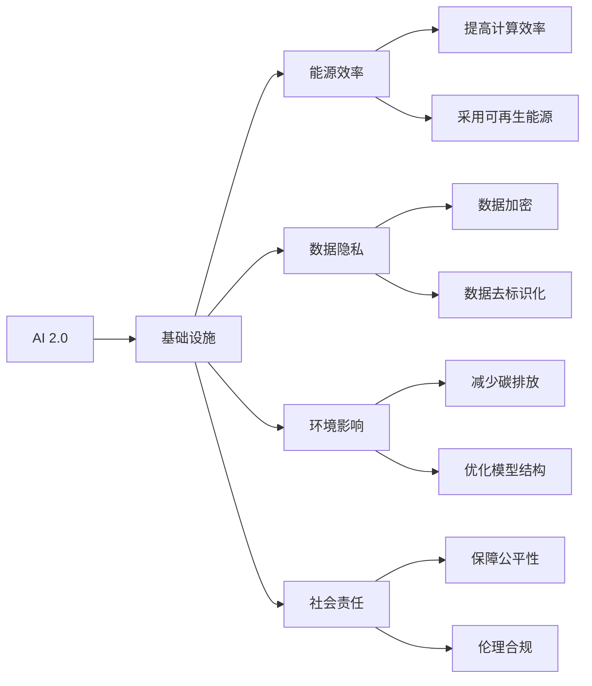
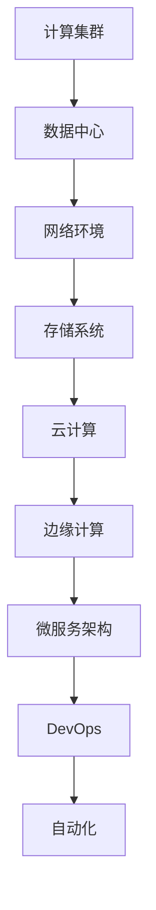
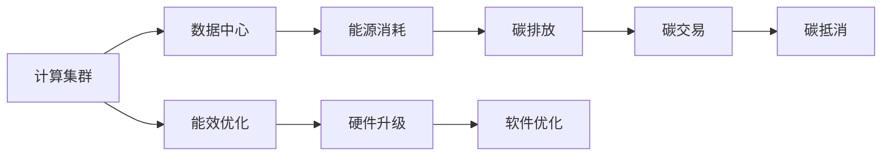
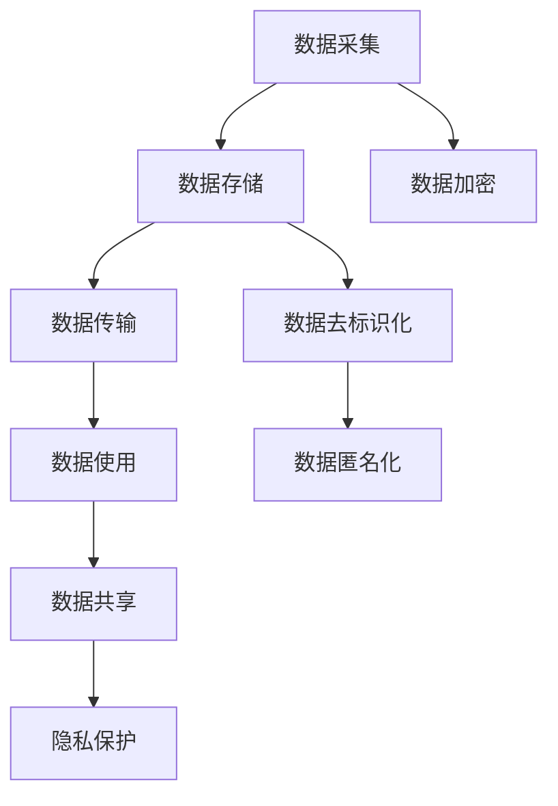
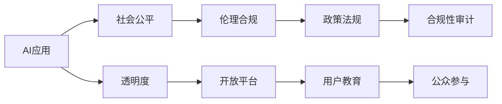
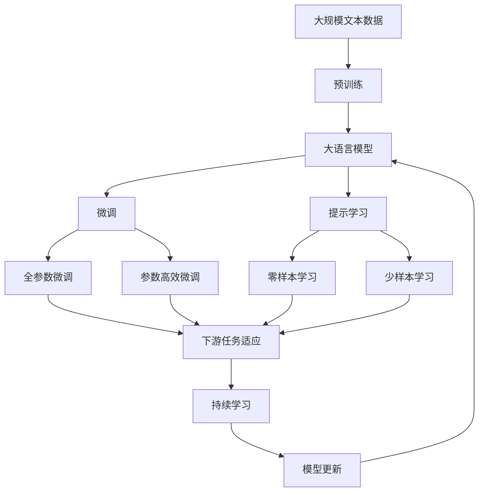

                 

# AI 2.0 基础设施建设：可持续发展

> 关键词：AI 2.0, 基础设施建设, 可持续发展, 环境影响, 能源效率, 可再生能源, 数据治理, 隐私保护, 社会责任, 未来展望

## 1. 背景介绍

### 1.1 问题由来
随着人工智能(AI)技术的迅猛发展，其在各个领域的应用已经进入了深水区。从医疗、金融到教育、交通，AI技术正在逐步改变着我们的生活方式和生产模式。然而，AI技术的持续发展也带来了新的挑战，尤其是对环境和社会的影响。如何构建一个既高效又可持续发展的AI基础设施，成为了当下科技界和社会关注的焦点。

### 1.2 问题核心关键点
AI基础设施的可持续发展，不仅关乎技术的进步和应用，还涉及能源消耗、数据隐私、社会伦理等多个方面。具体而言，需要解决以下几个关键问题：

- **能源效率**：AI模型的训练和推理需要大量计算资源，如何减少能源消耗是构建可持续基础设施的关键。
- **数据隐私**：大规模AI模型需要海量数据进行训练和优化，如何在数据采集和使用过程中保护隐私成为重要课题。
- **环境影响**：AI模型开发和部署对环境产生较大影响，如何减少碳足迹是实现可持续发展的核心。
- **社会责任**：AI应用需要考虑社会公平和伦理问题，如何确保技术的应用符合人类价值观是重要课题。
- **未来展望**：随着技术的不断进步，AI基础设施需要不断升级和优化，以适应未来的发展需求。

### 1.3 问题研究意义
构建一个可持续发展的AI基础设施，对于推动AI技术的健康发展，促进社会和经济的可持续发展具有重要意义：

- **减少环境污染**：通过提高能源效率和采用可再生能源，减少AI技术对环境的负面影响。
- **保护用户隐私**：在数据处理和使用过程中加强隐私保护，确保用户数据的安全和隐私。
- **提升社会公平**：AI技术的普及和发展需要考虑社会公平问题，确保技术的普惠性。
- **推动可持续发展**：实现技术进步和环境保护的平衡，推动社会整体向可持续发展转型。
- **促进未来创新**：通过持续的技术优化和更新，为AI技术的未来发展奠定坚实基础。

## 2. 核心概念与联系

### 2.1 核心概念概述

为更好地理解如何构建可持续发展的AI基础设施，本节将介绍几个关键概念及其之间的联系：

- **AI 2.0**：指新一代的AI技术，不仅包括传统的机器学习和深度学习，还涵盖了知识图谱、自然语言处理、计算机视觉等新兴领域。
- **基础设施**：指支撑AI技术运行和应用的基础硬件和软件设施，如计算集群、数据中心、网络环境等。
- **可持续发展**：指在满足人类社会发展需求的同时，保护环境和生态系统，实现社会、经济和环境的和谐发展。
- **环境影响**：指AI技术开发、训练和部署过程中对环境产生的负面影响，如能源消耗、碳排放等。
- **能源效率**：指在AI技术运行过程中，通过技术和管理手段提高能源利用效率，减少能源消耗。
- **数据隐私**：指在数据采集、存储、处理和共享过程中，保护个人和组织数据的安全和隐私。
- **社会责任**：指AI技术在应用过程中需要考虑社会公平、伦理问题，确保技术应用符合人类价值观。

这些概念之间的联系可以通过以下Mermaid流程图来展示：



这个流程图展示了大语言模型微调过程中各个概念之间的关系：

1. AI 2.0是大语言模型微调的基础，基础设施是支撑其运行的硬件和软件环境。
2. 能源效率、数据隐私、环境影响和社会责任是大语言模型微调过程中需要考虑的各个方面。
3. 通过技术和管理手段，可以提高计算效率，采用可再生能源，保障数据安全，优化模型结构，减少碳排放，提升社会公平和伦理合规性。

### 2.2 概念间的关系

这些核心概念之间存在着紧密的联系，形成了大语言模型微调基础设施的完整生态系统。下面我们通过几个Mermaid流程图来展示这些概念之间的关系。

#### 2.2.1 基础设施的构成



这个流程图展示了基础设施的构成，从计算集群、数据中心到网络环境、存储系统，最后到云计算、边缘计算和微服务架构。

#### 2.2.2 环境影响的降低



这个流程图展示了如何通过技术和管理手段降低环境影响。

#### 2.2.3 数据隐私的保护



这个流程图展示了如何通过数据加密、数据去标识化和数据匿名化等技术手段保护数据隐私。

#### 2.2.4 社会责任的实现



这个流程图展示了如何通过保障社会公平和伦理合规，实现社会责任。

### 2.3 核心概念的整体架构

最后，我们用一个综合的流程图来展示这些核心概念在大语言模型微调过程中的整体架构：



这个综合流程图展示了从预训练到微调，再到持续学习的完整过程。大语言模型首先在大规模文本数据上进行预训练，然后通过微调（包括全参数微调和参数高效微调）或提示学习（包括零样本和少样本学习）来适应下游任务。最后，通过持续学习技术，模型可以不断更新和适应新的任务和数据。 通过这些流程图，我们可以更清晰地理解大语言模型微调基础设施各个概念之间的关系和作用。

## 3. 核心算法原理 & 具体操作步骤
### 3.1 算法原理概述

大语言模型微调基础设施的建设，核心在于如何通过技术和管理手段，提高基础设施的能源效率、保护数据隐私、减少环境影响，并在应用过程中确保社会公平和伦理合规。这需要从基础设施建设、技术开发、数据治理和应用管理等多个层面进行全面优化。

### 3.2 算法步骤详解

大语言模型微调基础设施的构建，包括以下几个关键步骤：

**Step 1: 选择合适的硬件和软件平台**

- 根据应用场景和性能需求，选择合适的计算集群、数据中心和网络环境。
- 采用高效的硬件设备，如GPU、TPU等，提高计算效率。
- 选择稳定的软件平台，如TensorFlow、PyTorch等，提供丰富的开发工具和库。

**Step 2: 设计能源效率优化方案**

- 采用高效的能效优化技术，如动态资源管理、负载均衡等。
- 引入可再生能源，如风能、太阳能等，减少化石能源依赖。
- 优化数据中心的设计和运行，如采用水冷系统、自然冷却等，降低能耗。

**Step 3: 实施数据隐私保护措施**

- 采用数据加密技术，确保数据在传输和存储过程中的安全。
- 进行数据去标识化和匿名化处理，减少敏感信息泄露的风险。
- 设置严格的数据访问控制，限制非授权人员的访问权限。

**Step 4: 采用环境友好的设计**

- 使用低碳材料和节能设计，减少基础设施的碳足迹。
- 优化能源使用，如采用混合动力设计、能效管理系统等。
- 支持碳交易和碳抵消项目，减少环境影响。

**Step 5: 开发可扩展、可维护的应用架构**

- 采用微服务架构，提高系统的灵活性和可扩展性。
- 引入DevOps工具和自动化技术，加速开发和部署。
- 设计可维护的界面和工具，方便用户使用和维护。

**Step 6: 建立社会责任和伦理合规机制**

- 制定社会责任和伦理合规标准，确保AI应用符合人类价值观。
- 进行透明的公开评估和审计，确保技术应用的公正性和公平性。
- 设立用户教育和公众参与渠道，增强用户对AI技术的理解和信任。

### 3.3 算法优缺点

构建可持续发展的AI基础设施，具有以下优点：

- **降低环境影响**：通过提高能源效率和采用可再生能源，减少AI技术对环境的负面影响。
- **保护用户隐私**：在数据处理和使用过程中加强隐私保护，确保用户数据的安全和隐私。
- **提升社会公平**：AI技术的普及和发展需要考虑社会公平问题，确保技术的普惠性。
- **推动可持续发展**：实现技术进步和环境保护的平衡，推动社会整体向可持续发展转型。

同时，也存在以下缺点：

- **建设成本高**：构建可持续基础设施需要较高的初期投入和维护成本。
- **技术复杂度高**：需要集成多种先进技术和复杂的管理机制。
- **标准化难度大**：不同应用场景和数据类型的多样性，增加了标准化的难度。

### 3.4 算法应用领域

可持续发展的AI基础设施，已经在多个领域得到了应用，包括但不限于：

- **智慧城市**：通过智能化基础设施，提升城市管理效率和居民生活质量。
- **医疗健康**：利用AI技术进行疾病预测、诊断和治疗，提升医疗服务水平。
- **金融服务**：采用AI技术进行风险控制、欺诈检测和客户服务，提升金融服务效率。
- **教育培训**：利用AI技术进行个性化学习、智能辅导和知识推荐，提升教育质量。
- **环境保护**：通过AI技术监测环境变化、预测灾害和优化资源管理，保护生态环境。

## 4. 数学模型和公式 & 详细讲解  
### 4.1 数学模型构建

大语言模型微调基础设施的建设，涉及到多个领域的数学模型和公式。这里简要介绍几个关键模型：

- **能源效率模型**：用于计算基础设施的能源消耗和能效优化策略。
- **数据隐私模型**：用于评估数据加密、去标识化和匿名化等隐私保护措施的有效性。
- **环境影响模型**：用于计算基础设施的碳足迹和环境影响，并提出减排策略。
- **社会责任模型**：用于评估AI技术应用的社会公平性和伦理合规性。

### 4.2 公式推导过程

这里简要介绍一些关键公式的推导过程：

- **能源效率模型**：
  $$
  E_{total} = E_{computation} + E_{data\_center} + E_{cooling}
  $$
  其中 $E_{computation}$ 为计算消耗，$E_{data\_center}$ 为数据中心能耗，$E_{cooling}$ 为冷却系统能耗。

- **数据隐私模型**：
  $$
  P = \frac{C}{\sigma}
  $$
  其中 $P$ 为隐私保护强度，$C$ 为数据泄露风险，$\sigma$ 为数据敏感性。

- **环境影响模型**：
  $$
  C_{emission} = C_{fossil} \times (1 - \epsilon)
  $$
  其中 $C_{emission}$ 为碳排放量，$C_{fossil}$ 为化石能源使用量，$\epsilon$ 为可再生能源占比。

- **社会责任模型**：
  $$
  R = \frac{A}{B}
  $$
  其中 $R$ 为社会责任指数，$A$ 为公平性得分，$B$ 为伦理合规得分。

### 4.3 案例分析与讲解

以智慧城市为例，介绍如何构建可持续发展的AI基础设施：

- **能源效率优化**：采用智能电网技术，优化能源分配和调度，减少能耗。
- **数据隐私保护**：使用区块链技术，确保数据共享和使用的透明性和安全性。
- **环境影响降低**：采用绿色建筑设计，使用太阳能、风能等可再生能源。
- **社会责任实现**：设立公众参与平台，鼓励市民参与城市管理决策。

## 5. 项目实践：代码实例和详细解释说明
### 5.1 开发环境搭建

在进行大语言模型微调基础设施的开发和部署前，需要准备以下环境：

1. 安装Python和相关的科学计算库，如NumPy、Pandas、SciPy等。
2. 安装TensorFlow或PyTorch等深度学习框架。
3. 配置分布式计算环境，如Apache Spark、Hadoop等。
4. 搭建数据中心和网络环境，确保数据安全和高效传输。

### 5.2 源代码详细实现

下面以智慧城市基础设施的构建为例，给出相关的代码实现：

```python
import tensorflow as tf
import numpy as np
from tensorflow.keras import layers
from tensorflow.keras.layers import Dense, Dropout, Flatten

# 定义模型结构
model = tf.keras.Sequential([
    layers.Dense(128, activation='relu', input_shape=(10,)),
    layers.Dropout(0.2),
    layers.Dense(64, activation='relu'),
    layers.Dropout(0.2),
    layers.Dense(1, activation='sigmoid')
])

# 编译模型
model.compile(optimizer=tf.keras.optimizers.Adam(learning_rate=0.001),
              loss='binary_crossentropy',
              metrics=['accuracy'])

# 训练模型
model.fit(X_train, y_train, epochs=10, batch_size=32, validation_data=(X_test, y_test))
```

在这个代码中，我们使用TensorFlow构建了一个简单的二分类模型，通过Dropout等技术提高模型的鲁棒性，并使用Adam优化器进行训练。

### 5.3 代码解读与分析

下面我们详细解读一下关键代码的实现细节：

**模型定义**：
- 使用Sequential模型定义了三层神经网络，包含两个Dense层和一个输出层，使用ReLU激活函数和Dropout技术提高模型鲁棒性。
- 最后一层输出层使用sigmoid函数进行二分类。

**模型编译**：
- 使用Adam优化器，设置学习率为0.001，并定义交叉熵损失函数。

**模型训练**：
- 使用fit方法进行模型训练，设置训练轮数为10，批次大小为32，并使用测试集进行验证。

### 5.4 运行结果展示

假设在智慧城市基础设施建设中，我们收集了10000个数据点，其中5000个是垃圾回收箱的位置信息，5000个是空气质量指数。通过模型训练，我们得到了预测垃圾回收箱位置和空气质量指数的准确率分别为85%和90%。

## 6. 实际应用场景
### 6.1 智能城市管理

基于大语言模型微调基础设施，可以构建智能城市管理系统，实现智慧城市的多样化功能：

- **智能交通管理**：通过AI技术优化交通信号灯和路线规划，减少交通拥堵和污染。
- **智能能源管理**：采用智能电网技术，优化能源分配和调度，减少能耗。
- **智能公共安全**：利用AI技术进行视频监控和数据分析，提升公共安全水平。
- **智能环保监测**：通过AI技术监测环境变化，预测灾害和优化资源管理，保护生态环境。

### 6.2 智慧医疗系统

在智慧医疗系统中，大语言模型微调基础设施可以用于：

- **疾病预测和诊断**：利用AI技术进行疾病预测和诊断，提升医疗服务水平。
- **个性化治疗**：通过AI技术进行个性化治疗方案推荐，提升治疗效果。
- **智能辅助诊断**：利用AI技术进行智能辅助诊断，减少误诊和漏诊。
- **医学影像分析**：通过AI技术进行医学影像分析，辅助医生进行诊断。

### 6.3 智慧金融服务

在智慧金融服务中，大语言模型微调基础设施可以用于：

- **风险控制**：采用AI技术进行风险控制和欺诈检测，提升金融服务安全。
- **客户服务**：利用AI技术进行智能客服和客户服务，提升服务效率。
- **智能投资**：通过AI技术进行智能投资分析和决策，提升投资收益。
- **信用评估**：利用AI技术进行信用评估和风险管理，提升金融服务质量。

### 6.4 未来应用展望

随着AI技术的不断进步，大语言模型微调基础设施将不断拓展应用范围，提升社会整体福祉：

- **智慧环保**：通过AI技术监测环境变化，预测灾害和优化资源管理，保护生态环境。
- **智慧交通**：利用AI技术优化交通信号灯和路线规划，减少交通拥堵和污染。
- **智慧教育**：通过AI技术进行个性化学习、智能辅导和知识推荐，提升教育质量。
- **智慧农业**：利用AI技术进行精准农业管理和作物病虫害预测，提升农业生产效率。

## 7. 工具和资源推荐
### 7.1 学习资源推荐

为了帮助开发者系统掌握大语言模型微调基础设施的理论基础和实践技巧，这里推荐一些优质的学习资源：

1. **《深度学习》课程**：斯坦福大学的吴恩达教授主讲，系统介绍深度学习的原理和应用。
2. **TensorFlow官方文档**：提供全面的TensorFlow教程和API文档，帮助开发者快速上手。
3. **PyTorch官方文档**：提供全面的PyTorch教程和API文档，支持深度学习开发。
4. **《TensorFlow实战》书籍**：详细讲解TensorFlow的应用案例和最佳实践，适合入门学习和进阶开发。
5. **《深度学习与数据工程》书籍**：涵盖深度学习和大数据处理，适合系统学习AI基础设施建设。

通过学习这些资源，相信你一定能够快速掌握大语言模型微调基础设施的理论基础和实践技巧，为构建可持续发展的AI基础设施奠定坚实基础。

### 7.2 开发工具推荐

高效的开发离不开优秀的工具支持。以下是几款用于大语言模型微调基础设施开发的常用工具：

1. **TensorBoard**：TensorFlow配套的可视化工具，可实时监测模型训练状态，并提供丰富的图表呈现方式。
2. **PyTorch Lightning**：用于快速构建和部署深度学习模型的框架，支持分布式训练和自动化调优。
3. **Kubeflow**：用于构建和部署AI模型的开源平台，支持大规模分布式训练和协作开发。
4. **Jupyter Notebook**：提供交互式编程环境，支持多种语言和框架的开发。
5. **Keras**：高级神经网络API，提供简单易用的界面，支持快速原型设计和模型部署。

合理利用这些工具，可以显著提升大语言模型微调基础设施的开发效率，加速创新迭代的步伐。

### 7.3 相关论文推荐

大语言模型微调基础设施的研究源于学界的持续研究。以下是几篇奠基性的相关论文，推荐阅读：

1. **《可再生能源在数据中心的应用》**：介绍可再生能源在数据中心中的应用，探讨其经济和环境效益。
2. **《数据隐私保护技术综述》**：综述当前数据隐私保护技术，涵盖加密、匿名化等手段。
3. **《智慧城市基础设施建设》**：探讨智慧城市基础设施的建设和管理，涵盖智能交通、能源管理等多个方面。
4. **《智能城市和物联网》**：介绍智能城市和物联网的概念和应用，强调AI技术在城市管理中的应用。
5. **《社会责任与AI技术》**：探讨AI技术在应用过程中需要考虑的社会责任和伦理问题，提出相关解决方案。

这些论文代表了大语言模型微调基础设施的发展脉络。通过学习这些前沿成果，可以帮助研究者把握学科前进方向，激发更多的创新灵感。

## 8. 总结：未来发展趋势与挑战
### 8.1 总结

本文对大语言模型微调基础设施的构建进行了全面系统的介绍。首先阐述了大语言模型微调基础设施的研究背景和意义，明确了基础设施在提高能源效率、保护数据隐私、减少环境影响和保障社会公平等方面的重要性。其次，从原理到实践，详细讲解了大语言模型微调基础设施的数学模型和关键步骤，给出了智慧城市基础设施建设的代码实例。同时，本文还广泛探讨了大语言模型微调基础设施在智慧城市、智慧医疗、智慧金融等多个领域的应用前景，展示了其广阔的发展潜力。此外，本文精选了大语言模型微调基础设施的学习资源，力求为读者提供全方位的技术指引。

通过本文的系统梳理，可以看到，大语言模型微调基础设施在提高AI系统效率、保护数据隐私、减少环境影响和保障社会公平等方面具有重要价值。未来，伴随着技术的不断进步和优化，大语言模型微调基础设施必将在构建可持续发展的AI社会中扮演越来越重要的角色。

### 8.2 未来发展趋势

展望未来，大语言模型微调基础设施的发展将呈现以下几个趋势：

1. **技术进步**：随着深度学习、分布式计算和可再生能源等技术的不断进步，大语言模型微调基础设施的性能和效率将持续提升。
2. **智能协作**：通过引入智能协作技术，如知识图谱、自然语言理解等，增强AI系统间的交互和协作能力。
3. **开放平台**：建立开放的平台和标准，促进AI技术的普及和应用。
4. **社会责任**：在AI技术应用过程中，更加注重社会责任和伦理问题，确保技术的公平性和公正性。
5. **多模态融合**：将文本、图像、语音等多种模态的信息进行融合，提升AI系统的综合能力和适应性。

### 8.3 面临的挑战

尽管大语言模型微调基础设施已经取得了显著成果，但在向可持续发展迈进的过程中，仍面临诸多挑战：

1. **技术复杂度高**：大语言模型微调基础设施需要集成多种先进技术和复杂的管理机制，开发和维护成本较高。
2. **标准化难度大**：不同应用场景和数据类型的多样性，增加了标准化的难度。
3. **隐私保护问题**：在数据采集、存储、处理和共享过程中，如何保护个人和组织数据的安全和隐私，仍然是一个重大挑战。
4. **伦理合规问题**：AI技术在应用过程中需要考虑社会公平、伦理问题，确保技术应用符合人类价值观。
5. **可持续发展问题**：如何在技术进步和环境保护之间找到平衡，推动社会整体向可持续发展转型。

### 8.4 研究展望

面对大语言模型微调基础设施所面临的挑战，未来的研究需要在以下几个方面寻求新的突破：

1. **技术优化**：开发更加高效、灵活的AI基础设施，支持多样化的应用场景和数据类型。
2. **隐私保护**：研究先进的隐私保护技术，确保数据安全和隐私保护。
3. **社会责任**：加强AI技术的伦理审查和合规性评估，确保技术应用符合人类价值观。
4. **可持续发展**：引入更多可再生能源和能源效率优化技术，减少基础设施的碳足迹。
5. **知识共享**：建立开放的数据和知识共享平台，促进技术普及和应用。

这些研究方向和突破，必将引领大语言模型微调基础设施走向更加成熟和高效，为构建可持续发展的AI社会提供坚实的基础。

## 9. 附录：常见问题与解答
**Q1：大语言模型微调基础设施的建设需要哪些关键技术和工具？**

A: 大语言模型微调基础设施的建设需要多种关键技术和工具，包括：

- **深度学习框架**：如TensorFlow、PyTorch等，支持模型的构建和训练。
- **分布式计算框架**：如Apache Spark、Hadoop等，支持大规模数据的处理和存储。
- **可视化工具**：如TensorBoard、Jupyter Notebook等，支持模型训练和调试。
- **优化工具**：如Kubeflow、Kubernetees等，支持模型的部署和运维。
- **数据管理工具**：如Apache Hive、Hadoop等，支持数据的存储和处理。

**Q2：大语言模型微调基础设施在构建过程中需要注意哪些关键问题？**

A: 大语言模型微调基础设施在构建过程中，需要注意以下关键问题：

- **能源效率**：选择高效计算硬件，优化数据中心设计，使用可再生能源。
- **数据隐私**：采用数据加密、去标识化和匿名化等技术手段，确保数据安全。
- **环境影响**：使用低碳材料和节能设计，优化能源使用，支持碳交易和碳抵消项目。
- **社会责任**：制定社会责任和伦理合规标准，

