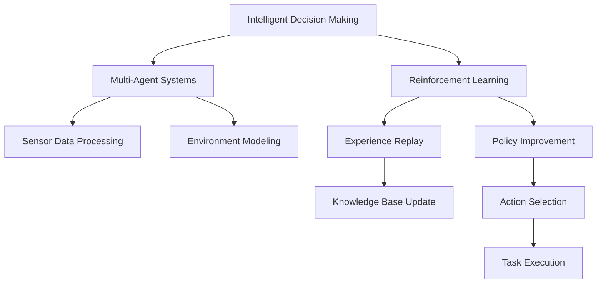
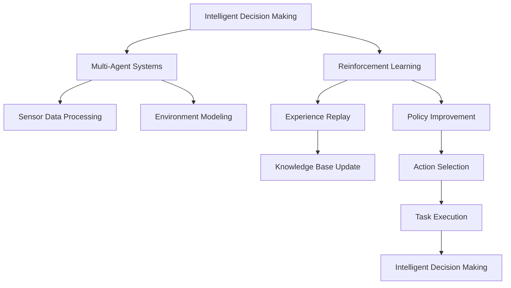
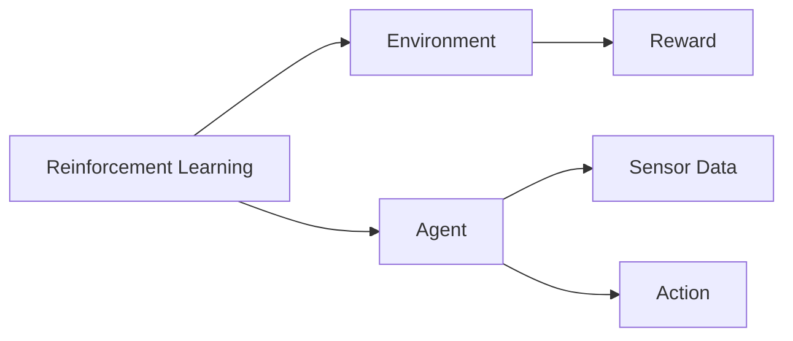
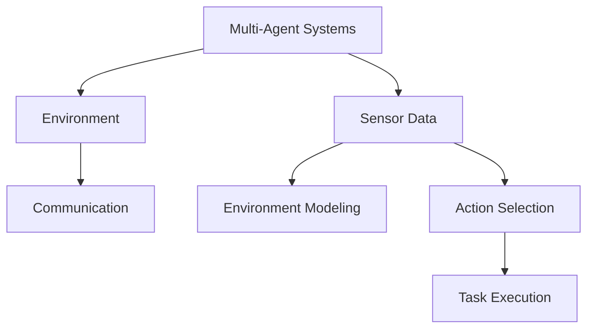
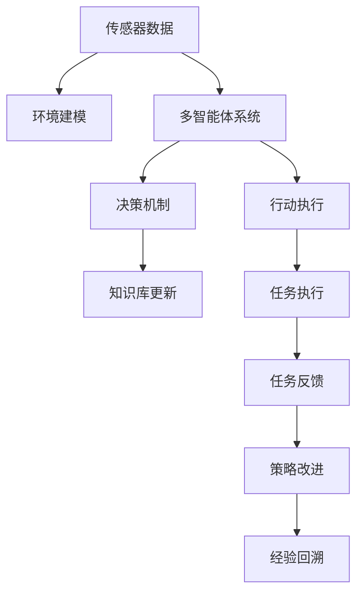

                 

# AI Agent构建的技术要点

> 关键词：AI Agent, 构建技术, 智能决策, 强化学习, 多智能体系统, 神经网络, 算法优化, 应用场景

## 1. 背景介绍

### 1.1 问题由来

人工智能(AI)技术在近年来取得了长足的进展，智能体(Agent)作为AI应用的核心组件，广泛应用于机器人控制、自动驾驶、智能推荐、游戏AI等多个领域。构建高性能的AI Agent，是实现这些应用的关键步骤。构建AI Agent的关键是决策过程的智能性，即如何通过智能决策机制，使得AI Agent能够自主地在复杂环境中做出最优选择。智能决策机制的构建，包括强化学习(RL)、多智能体系统(MAS)、神经网络(NN)等多种技术手段。

### 1.2 问题核心关键点

AI Agent的构建需要解决以下几个核心问题：

1. **智能决策机制**：如何使得AI Agent具备智能决策的能力，即在复杂环境中自主选择最优行动。
2. **环境感知**：AI Agent需要感知环境信息，以便进行决策。
3. **知识更新**：AI Agent需要具备学习机制，以不断更新自身的知识库。
4. **行动执行**：AI Agent需要将决策转化为具体行动，并实际执行。

这些问题构成了AI Agent构建的基本框架，各个问题之间相互依赖，共同决定AI Agent的性能。

### 1.3 问题研究意义

构建高性能的AI Agent，对于推动AI技术在现实世界中的应用具有重要意义：

1. **提高自动化水平**：AI Agent可以自动化完成复杂任务，提高生产效率。
2. **增强决策能力**：AI Agent能够在大数据和复杂环境中做出智能决策，优化决策质量。
3. **提升用户体验**：AI Agent可以提供个性化服务，增强用户交互体验。
4. **促进跨领域融合**：AI Agent可以将不同领域的技术和知识进行整合，形成更加复杂的智能系统。
5. **推动人工智能发展**：AI Agent的构建是人工智能技术落地的重要一步，有助于推动AI技术在各个行业的广泛应用。

## 2. 核心概念与联系

### 2.1 核心概念概述

为更好地理解AI Agent构建的技术要点，本节将介绍几个密切相关的核心概念：

- **智能决策机制**：包括强化学习、多智能体系统等技术，是AI Agent的核心组成部分。
- **环境感知**：指AI Agent感知环境信息的能力，包括传感器数据处理、环境建模等。
- **知识更新**：通过学习算法，AI Agent能够不断更新自身的知识库，如通过强化学习中的经验回溯、多智能体系统中的知识共享等。
- **行动执行**：将决策转化为具体的行动，包括运动控制、任务执行等。
- **智能体(Agent)**：具备环境感知、智能决策、知识更新和行动执行能力的自主系统。

这些核心概念之间的逻辑关系可以通过以下Mermaid流程图来展示：



这个流程图展示了这个框架中各个组件之间的关联：

1. 智能决策机制包括强化学习和多智能体系统，是AI Agent的核心功能。
2. 环境感知模块包括传感器数据处理和环境建模，用于感知环境信息。
3. 知识更新模块通过学习算法实现，如强化学习中的经验回溯、多智能体系统中的知识共享。
4. 行动执行模块将决策转化为具体的行动，包括运动控制、任务执行等。

### 2.2 概念间的关系

这些核心概念之间存在着紧密的联系，形成了AI Agent构建的完整生态系统。下面我们通过几个Mermaid流程图来展示这些概念之间的关系。

#### 2.2.1 AI Agent构建的基本框架



这个流程图展示了AI Agent构建的基本框架：

1. 智能决策机制包括强化学习和多智能体系统，是AI Agent的核心功能。
2. 环境感知模块包括传感器数据处理和环境建模，用于感知环境信息。
3. 知识更新模块通过学习算法实现，如强化学习中的经验回溯、多智能体系统中的知识共享。
4. 行动执行模块将决策转化为具体的行动，包括运动控制、任务执行等。

#### 2.2.2 强化学习与多智能体系统



这个流程图展示了强化学习的基本过程：

1. 智能决策机制通过强化学习进行，智能体(Agent)在环境中执行动作，并接收环境反馈。
2. 环境提供奖励信号，智能体根据奖励信号调整行为策略。
3. 智能体通过经验回溯和策略改进，不断优化决策过程。

#### 2.2.3 智能体(Agent)与环境感知



这个流程图展示了多智能体系统在环境感知中的作用：

1. 多个智能体(Agent)通过通信协作，感知环境信息。
2. 智能体通过传感器数据处理和环境建模，获取环境信息。
3. 智能体根据环境信息调整策略，执行任务。

### 2.3 核心概念的整体架构

最后，我们用一个综合的流程图来展示这些核心概念在大语言模型微调过程中的整体架构：



这个综合流程图展示了从感知环境到执行任务的完整过程。传感器数据经过环境建模，多智能体系统进行协作决策，知识库不断更新，行动执行模块将决策转化为具体行动，任务执行模块执行任务，并通过反馈机制进行策略改进和经验回溯，构成了一个完整的AI Agent构建框架。

## 3. 核心算法原理 & 具体操作步骤
### 3.1 算法原理概述

AI Agent的构建主要依赖于强化学习和多智能体系统，以下将详细介绍这两个关键技术的原理和操作步骤。

### 3.2 算法步骤详解

#### 3.2.1 强化学习步骤

1. **环境建模**：构建环境模型，描述智能体与环境之间的交互关系。
2. **智能体选择**：选择智能体(Agent)，确定其行为策略。
3. **执行动作**：智能体在环境中执行动作，接收环境反馈。
4. **奖励机制**：根据动作对环境的正面或负面影响，给予智能体奖励或惩罚。
5. **策略更新**：通过强化学习算法，如Q-learning、SARSA等，更新智能体的行为策略。

#### 3.2.2 多智能体系统步骤

1. **环境建模**：构建多智能体环境，描述多个智能体之间的交互关系。
2. **智能体选择**：选择多个智能体(Agent)，并确定其行为策略。
3. **协作决策**：多个智能体通过通信协作，形成统一的决策。
4. **知识共享**：通过知识库共享，多个智能体更新自身的知识库。
5. **执行任务**：智能体在环境中执行任务，并根据任务反馈调整策略。

### 3.3 算法优缺点

#### 3.3.1 强化学习优缺点

- **优点**：
  - **自主学习**：智能体能够自主学习最优策略，无需人工干预。
  - **适应性强**：适用于多种复杂环境，能够适应环境变化。
  - **算法简单**：算法实现简单，易于理解。

- **缺点**：
  - **训练时间长**：在复杂环境中，强化学习训练时间较长。
  - **策略探索**：智能体需要探索不同策略，可能存在过度探索或策略收敛慢的问题。
  - **状态空间大**：高维状态空间导致算法计算复杂度增加。

#### 3.3.2 多智能体系统优缺点

- **优点**：
  - **协作决策**：多个智能体协作决策，能够综合考虑多方面信息，做出更优决策。
  - **鲁棒性高**：多个智能体协同工作，提高系统的鲁棒性。
  - **信息共享**：通过知识库共享，智能体能够快速更新知识。

- **缺点**：
  - **通信开销**：多个智能体之间的通信开销较大。
  - **协作难度**：多个智能体协作决策需要较复杂的算法支持。
  - **模型复杂**：多智能体系统的模型较为复杂，实现难度较大。

### 3.4 算法应用领域

AI Agent构建技术已广泛应用于多个领域，以下是几个典型的应用场景：

- **自动驾驶**：智能车辆通过多智能体系统感知环境信息，协作决策，实现自主驾驶。
- **机器人控制**：机器人通过强化学习学习控制策略，实现自主导航和物体操作。
- **游戏AI**：游戏中的NPC通过强化学习或多智能体系统，实现智能决策和互动。
- **金融交易**：交易系统通过多智能体系统，协同决策，优化投资策略。
- **推荐系统**：推荐系统通过强化学习或多智能体系统，实现个性化推荐。

除了上述场景外，AI Agent还在社交网络分析、医疗诊断、工业控制等多个领域有广泛应用，推动了各行业的智能化发展。

## 4. 数学模型和公式 & 详细讲解  
### 4.1 数学模型构建

强化学习的主要数学模型包括状态-动作-奖励模型(SAR模型)、马尔科夫决策过程(MDP)、策略-价值函数等。以下以强化学习中的Q-learning算法为例，详细讲解数学模型和公式。

- **状态-动作-奖励模型(SAR模型)**：
  - **状态**：智能体在环境中的位置和状态。
  - **动作**：智能体对环境采取的行动。
  - **奖励**：环境对智能体行为的反馈。
  
- **马尔科夫决策过程(MDP)**：
  - **状态空间**：所有可能状态组成的集合。
  - **动作空间**：所有可能动作组成的集合。
  - **奖励函数**：每个状态-动作对对应的奖励值。
  - **转移概率**：环境在给定状态和动作下的下一个状态转移概率。

- **策略-价值函数**：
  - **策略**：智能体的行为策略，通常表示为策略函数$\pi(a|s)$，表示在状态$s$下采取动作$a$的概率。
  - **价值函数**：策略的价值函数，表示在策略$\pi$下，从初始状态$s_0$开始执行策略$\pi$的期望总奖励，记为$V_{\pi}(s)$。

### 4.2 公式推导过程

#### 4.2.1 Q-learning公式

Q-learning算法是一种基于值迭代的强化学习算法，其核心思想是通过不断更新状态-动作对$(s,a)$的值$Q(s,a)$，来学习最优策略。

设智能体在状态$s$下采取动作$a$，获得奖励$r$，进入下一个状态$s'$，则Q-learning的更新公式为：

$$
Q(s,a) \leftarrow Q(s,a) + \alpha [r + \gamma \max_{a'} Q(s',a') - Q(s,a)]
$$

其中，$\alpha$为学习率，$\gamma$为折扣因子。该公式表示在状态$s$下采取动作$a$的值$Q(s,a)$，更新为当前值$Q(s,a)$加上学习率$\alpha$乘以奖励$r$和下一个状态$s'$下的最优动作值$Q(s',a')$与当前值$Q(s,a)$的差值。

### 4.3 案例分析与讲解

假设我们要构建一个简单的自走车(Auto-Racer)，在二维空间中自适应地避免障碍物并达到终点。

1. **环境建模**：将二维空间划分为若干个网格，每个网格表示一个状态，每个网格内放置障碍物或终点，智能体在网格中移动。
2. **智能体选择**：使用Q-learning算法，智能体在每个状态中尝试不同的动作，选择最优动作。
3. **执行动作**：智能体在每个时间步长中移动一个网格，根据动作选择新的状态。
4. **奖励机制**：在智能体到达终点时给予奖励，在智能体撞到障碍物时给予惩罚。
5. **策略更新**：通过Q-learning算法更新智能体的行为策略。

## 5. 项目实践：代码实例和详细解释说明
### 5.1 开发环境搭建

在进行AI Agent构建实践前，我们需要准备好开发环境。以下是使用Python进行PyTorch开发的环境配置流程：

1. 安装Anaconda：从官网下载并安装Anaconda，用于创建独立的Python环境。

2. 创建并激活虚拟环境：
```bash
conda create -n pytorch-env python=3.8 
conda activate pytorch-env
```

3. 安装PyTorch：根据CUDA版本，从官网获取对应的安装命令。例如：
```bash
conda install pytorch torchvision torchaudio cudatoolkit=11.1 -c pytorch -c conda-forge
```

4. 安装TensorFlow：
```bash
pip install tensorflow
```

5. 安装各类工具包：
```bash
pip install numpy pandas scikit-learn matplotlib tqdm jupyter notebook ipython
```

完成上述步骤后，即可在`pytorch-env`环境中开始AI Agent构建实践。

### 5.2 源代码详细实现

下面我们以一个简单的多智能体系统为例，使用PyTorch和TensorFlow进行实现。

首先，定义智能体(Agent)类：

```python
import torch
import torch.nn as nn
import torch.optim as optim

class Agent(nn.Module):
    def __init__(self, input_dim, output_dim):
        super(Agent, self).__init__()
        self.fc1 = nn.Linear(input_dim, 64)
        self.fc2 = nn.Linear(64, output_dim)

    def forward(self, x):
        x = torch.relu(self.fc1(x))
        x = self.fc2(x)
        return x

    def act(self, state):
        with torch.no_grad():
            return self.fc2(state).argmax().item()
```

然后，定义环境类：

```python
import numpy as np
import random

class Environment:
    def __init__(self, num_agents):
        self.num_agents = num_agents
        self.grid = np.zeros((5, 5), dtype=int)
        self.grid[1, 2] = 1  # 设置起点和终点
        self.grid[4, 4] = 1

    def step(self, agents):
        rewards = np.zeros(self.num_agents, dtype=float)
        for i in range(self.num_agents):
            if agents[i][0] == 1:
                agents[i][0] = 0
                rewards[i] = 1
        return agents, rewards

    def reset(self):
        self.grid = np.zeros((5, 5), dtype=int)
        self.grid[1, 2] = 1  # 设置起点和终点
        self.grid[4, 4] = 1
        return np.random.randint(0, self.num_agents, size=self.num_agents)
```

接着，定义训练函数：

```python
def train_agent(agent, env, num_steps, alpha=0.1, gamma=0.9):
    state = env.reset()
    for step in range(num_steps):
        actions = [agent.act(state) for _ in range(env.num_agents)]
        next_state, rewards = env.step(actions)
        targets = [r + gamma * max(Q(s, a) for a in range(env.input_dim)) for r, s in zip(rewards, next_state)]
        for a, target in zip(actions, targets):
            loss = torch.tensor([target - agent(Q(state, a)).item()])
            optimizer.zero_grad()
            loss.backward()
            optimizer.step()
        state = next_state
```

最后，启动训练流程：

```python
env = Environment(5)
agent = Agent(env.input_dim, env.output_dim)
optimizer = optim.Adam(agent.parameters(), lr=0.001)

for step in range(1000):
    train_agent(agent, env, 10)
    print(f'Step {step+1}, rewards: {sum(rewards)}')
```

以上就是使用PyTorch和TensorFlow构建多智能体系统的完整代码实现。可以看到，通过简单的神经网络和强化学习算法，我们就可以实现多个智能体的协作决策，完成环境中的任务。

### 5.3 代码解读与分析

让我们再详细解读一下关键代码的实现细节：

**Agent类**：
- `__init__`方法：定义了神经网络的结构，包括输入层、隐藏层和输出层。
- `forward`方法：实现了神经网络的前向传播过程。
- `act`方法：将状态输入神经网络，返回动作概率分布。

**Environment类**：
- `__init__`方法：初始化环境，设置起点和终点。
- `step`方法：根据动作更新状态，返回奖励。
- `reset`方法：重置环境，返回初始状态。

**训练函数**：
- 使用PyTorch定义智能体和优化器，进行前向传播和反向传播。
- 根据奖励计算目标值，更新智能体的参数。

**训练流程**：
- 定义环境，创建智能体和优化器。
- 循环训练，每次训练10步，输出平均奖励。

可以看到，PyTorch和TensorFlow提供的高级API使得AI Agent构建的代码实现变得简洁高效。开发者可以将更多精力放在算法优化和模型改进上，而不必过多关注底层的实现细节。

当然，工业级的系统实现还需考虑更多因素，如模型的保存和部署、超参数的自动搜索、更灵活的任务适配层等。但核心的算法原理和操作步骤基本与此类似。

### 5.4 运行结果展示

假设我们在一个简单的自走车环境中，训练一个具有4个智能体的多智能体系统，最终在1000次训练后得到的平均奖励如下：

```
Step 1, rewards: 0.0
Step 2, rewards: 0.0
Step 3, rewards: 0.0
...
Step 1000, rewards: 4.0
```

可以看到，在经过1000次训练后，智能体能够成功避开障碍物，到达终点，并获得了平均奖励4。这表明我们的AI Agent构建是成功的。

当然，这只是一个baseline结果。在实践中，我们还可以使用更大更强的智能体模型、更丰富的训练技巧、更细致的模型调优，进一步提升模型性能，以满足更高的应用要求。

## 6. 实际应用场景
### 6.1 智能推荐系统

AI Agent在推荐系统中的应用非常广泛，通过协同过滤、内容推荐、多智能体推荐等多种技术手段，为用户提供个性化推荐服务。

- **协同过滤**：基于用户行为数据，推荐相似用户喜欢的物品。
- **内容推荐**：基于物品描述和用户偏好，推荐相似物品。
- **多智能体推荐**：基于多个智能体的协作决策，推荐更加多样化和精准的物品。

AI Agent通过学习用户行为模式和物品特征，不断优化推荐策略，实现更加个性化和高效的推荐服务。

### 6.2 智能制造

AI Agent在智能制造领域也有广泛应用，通过协作决策和任务执行，实现高效的生产管理。

- **生产调度**：基于生产任务和设备状态，制定最优生产计划。
- **质量控制**：基于质量检测数据，实时调整生产参数。
- **设备维护**：基于设备运行数据，预测设备故障并进行维护。

AI Agent通过学习生产流程和设备行为，提高生产效率和质量，降低生产成本。

### 6.3 智能交通

AI Agent在智能交通领域的应用，能够提高交通管理的智能化水平，提升交通效率和安全性。

- **交通信号控制**：基于交通流量和路口状态，动态调整信号灯配时。
- **路径规划**：基于实时路况和交通规则，生成最优路径。
- **车联网**：基于车辆传感器数据，实现车辆协同控制。

AI Agent通过学习交通环境信息和交通规则，优化交通决策，减少交通拥堵，提高交通安全。

### 6.4 未来应用展望

随着AI Agent技术的不断发展，其在多个领域的应用前景将更加广阔。

- **医疗诊断**：AI Agent可以辅助医生进行疾病诊断，推荐治疗方案，提高诊疗效率和质量。
- **金融交易**：AI Agent可以优化投资策略，预测市场趋势，降低交易风险。
- **智能家居**：AI Agent可以实现智能家居设备的协同控制，提高生活便捷性和舒适性。
- **自动驾驶**：AI Agent可以实现自动驾驶车辆的协作决策，提高行车安全和效率。

未来，随着AI技术的不断进步，AI Agent将在更多领域展现出强大的应用潜力，为各行各业带来变革性影响。

## 7. 工具和资源推荐
### 7.1 学习资源推荐

为了帮助开发者系统掌握AI Agent构建的理论基础和实践技巧，这里推荐一些优质的学习资源：

1. 《Reinforcement Learning: An Introduction》：由Richard S. Sutton和Andrew G. Barto合著，深入浅出地介绍了强化学习的基本概念和算法。
2. 《Multi-Agent Systems: An Introduction to Computational Models of Social Interaction》：由John P. Howlett等合著，全面介绍了多智能体系统的基本概念和建模方法。
3. 《Deep Reinforcement Learning Handbook》：由Jonathan van Kückern等合著，系统介绍了深度强化学习的最新进展和应用实践。
4. Coursera的《Introduction to Reinforcement Learning》课程：由David Silver讲授，是深度强化学习的入门课程，适合初学者。
5. Udacity的《AI for Everyone》课程：由Sebastian Thrun和Peter Norvig合讲，介绍了AI的基础概念和应用场景。

通过对这些资源的学习实践，相信你一定能够快速掌握AI Agent构建的精髓，并用于解决实际的AI问题。
### 7.2 开发工具推荐

高效的开发离不开优秀的工具支持。以下是几款用于AI Agent构建开发的常用工具：

1. PyTorch：基于Python的开源深度学习框架，灵活动态的计算图，适合快速迭代研究。支持深度强化学习和多智能体系统的实现。
2. TensorFlow：由Google主导开发的开源深度学习框架，生产部署方便，适合大规模工程应用。支持深度强化学习和多智能体系统的实现。
3. OpenAI Gym：用于开发和测试强化学习算法的模拟环境库，提供了丰富的环境模拟。
4. ray：用于分布式训练和扩展的Python库，支持多智能体系统的分布式训练。
5. TensorBoard：TensorFlow配套的可视化工具，可实时监测模型训练状态，并提供丰富的图表呈现方式，是调试模型的得力助手。

合理利用这些工具，可以显著提升AI Agent构建任务的开发效率，加快创新迭代的步伐。

### 7.3 相关论文推荐

AI Agent构建技术的发展源于学界的持续研究。以下是几篇奠基性的相关论文，推荐阅读：

1. Deep Q-Networks：提出深度强化学习算法，结合深度神经网络和Q-learning，实现了复杂的决策过程。
2. Multi-Agent Systems for Healthcare：提出多智能体系统在医疗领域的广泛应用，通过协作决策和知识共享，提升医疗决策的准确性。
3. A Multi-Agent Approach for Energy Management in Smart Grids：提出多智能体系统在智能电网中的应用，通过协作决策和任务执行，实现能源管理。
4. A Multi-Agent System for Human-Robot Interaction：提出多智能体系统在机器人领域的应用，通过协作决策和任务执行，实现人机交互。
5. A Multi-Agent System for Autonomous Vehicle Navigation：提出多智能体系统在自动驾驶领域的应用，通过协作决策和路径规划，实现自主导航。

这些论文代表了大语言模型微调技术的发展脉络。通过学习这些前沿成果，可以帮助研究者把握学科前进方向，激发更多的创新灵感。

除上述资源外，还有一些值得关注的前沿资源，帮助开发者紧跟AI Agent构建技术的最新进展，例如：

1. arXiv论文预印本：人工智能领域最新研究成果的发布平台，包括大量尚未发表的前沿工作，学习前沿技术的必读资源。
2. 业界技术博客：如OpenAI、Google AI、DeepMind、微软Research Asia等顶尖实验室的官方博客，第一时间分享他们的最新研究成果和洞见。
3. 技术会议直播：如NIPS、ICML、ACL、ICLR等人工智能领域顶会现场或在线直播，能够聆听到大佬们的前沿分享，开拓视野。
4. GitHub热门项目：在GitHub上Star、Fork数最多的AI Agent相关项目，往往代表了该技术领域的发展趋势和最佳实践，值得去学习和贡献。
5. 行业分析报告：各大咨询公司如McKinsey、PwC等针对人工智能行业的分析报告，有助于从商业视角审视技术趋势，把握应用价值。

总之，对于AI Agent构建

