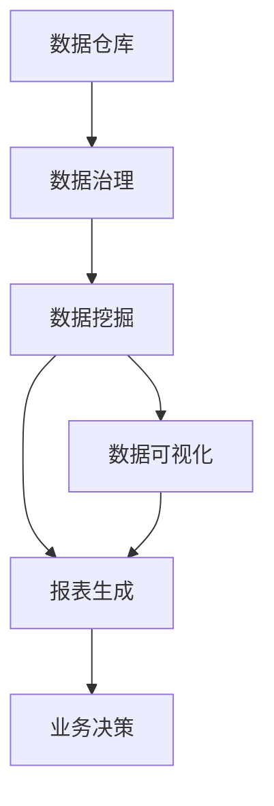
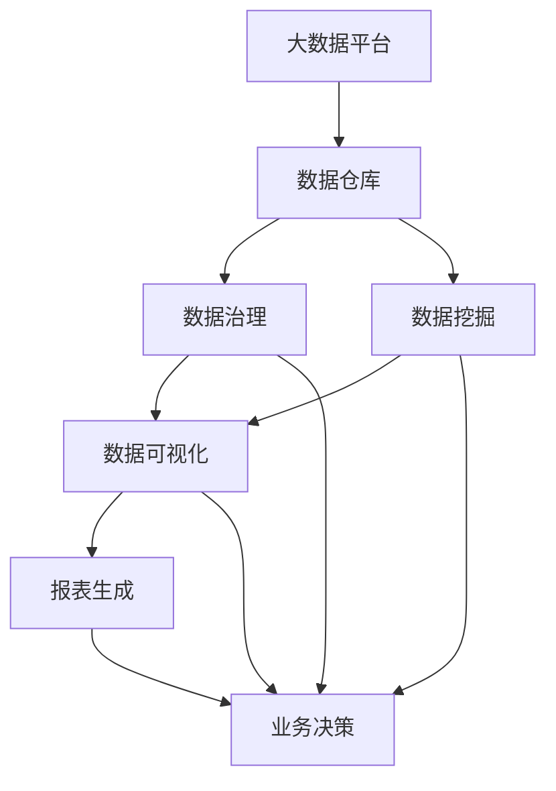

                 

# AI DMP 数据基建：数据可视化与报表

> 关键词：
- AI DMP
- 数据基建
- 数据可视化
- 报表生成
- 数据治理
- 数据流管理
- 用户行为分析
- 隐私保护
- 可视化报表

## 1. 背景介绍

### 1.1 问题由来

随着数字营销的迅猛发展，数据驱动的个性化营销（Personalized Marketing）已成为企业获取竞争优势的关键。然而，在数据收集、存储、处理、分析和使用的过程中，数据质量问题、数据隐私问题、数据孤岛问题、数据安全问题等变得愈发突出。AI DMP（AI-Enhanced Data Management Platform）作为数据管理和个性化营销的重要基础设施，近年来得到广泛关注。AI DMP结合了人工智能技术和数据管理平台，通过自动化、智能化手段，实现了数据的深度挖掘、整合、分析和应用，大幅提升了数据驱动营销的效率和效果。

数据可视化与报表生成是AI DMP的重要功能之一，通过对海量数据进行多维度、动态化的展示和分析，帮助营销人员理解数据背后的趋势和洞察，支持更精准的市场策略制定和执行。本文将从核心概念、算法原理、实践案例、未来展望等角度，全面解析AI DMP中的数据可视化和报表生成技术，为相关从业者提供深入的洞察和建议。

### 1.2 问题核心关键点

AI DMP中的数据可视化和报表生成技术，核心在于：
- 数据质量保障：如何保证数据采集、存储、清洗等环节的数据质量，防止数据错误、缺失和不一致。
- 数据整合与治理：如何将来自不同渠道、不同格式的数据，通过技术手段进行有效整合，形成统一的数据体系。
- 数据高效利用：如何利用数据挖掘和机器学习算法，提取数据中的深层次规律，生成有价值的商业洞察。
- 报表自动化生成：如何自动生成各种维度和格式的报表，快速生成业务决策依据。
- 数据隐私保护：如何在保证数据安全和隐私的前提下，实现数据的高效利用和可视化。

这些关键点构成了AI DMP数据可视化和报表生成的基础框架，本文将深入探讨这些关键技术，帮助读者更好地理解和应用AI DMP。

### 1.3 问题研究意义

数据可视化与报表生成技术的成熟应用，对于提升企业的数据驱动营销能力，具有重要意义：
1. **提高决策效率**：通过可视化和报表生成，快速获取关键数据洞察，帮助营销人员做出更加精准、高效的决策。
2. **增强洞察力**：可视化的方式使得数据变得更加直观，便于发现数据中的规律和趋势，增强企业对市场的理解能力。
3. **促进数据协作**：数据报表的共享和可视化，促进不同部门之间的数据协作，提升企业整体的数据利用效率。
4. **保障数据隐私**：通过严格的数据治理和隐私保护措施，确保数据安全和合规，减少数据泄露风险。
5. **提升用户体验**：基于用户行为的数据可视化，有助于理解用户需求和行为模式，提供更加个性化的服务。

## 2. 核心概念与联系

### 2.1 核心概念概述

AI DMP中的数据可视化和报表生成技术涉及多个核心概念，包括：
- **数据仓库**：存储和管理企业内部和外部的海量数据，是数据可视化和报表生成的基础。
- **数据治理**：确保数据的质量、完整性和一致性，防止数据污染和错误。
- **数据挖掘**：利用统计学、机器学习等技术，从数据中挖掘有价值的商业洞察。
- **数据可视化**：通过图形、图表等方式，将数据转化为直观的视觉信息，帮助理解和分析。
- **报表生成**：自动生成各种格式的报表，支持业务决策和分析。

这些概念之间存在紧密的联系，形成了一个完整的AI DMP数据管理生态系统：



### 2.2 概念间的关系

这些核心概念之间的联系如下：

#### 2.2.1 数据治理与数据仓库

数据仓库是数据治理的基础，通过数据治理，确保数据仓库中数据的准确性、完整性和一致性。数据治理的核心理念包括数据质量管理、数据标准管理、数据安全管理和数据生命周期管理等。

#### 2.2.2 数据挖掘与数据仓库

数据挖掘是从数据仓库中提取有价值的商业洞察的过程，其核心在于数据预处理、特征工程、模型训练和结果解读等步骤。数据挖掘的目标是通过分析数据，揭示潜在的规律和模式，支持决策和策略制定。

#### 2.2.3 数据可视化与数据挖掘

数据可视化是将数据挖掘的结果转化为直观的视觉信息，帮助理解和分析数据。其核心理念是将复杂的数据转化为易于理解的图形和图表，支持业务洞察和决策。

#### 2.2.4 报表生成与数据可视化

报表生成是基于数据可视化的结果，自动生成各种格式和维度的报表，支持业务决策和分析。报表生成的核心在于数据聚合、计算和展示，帮助用户快速获取关键数据洞察。

### 2.3 核心概念的整体架构

最后，我们用一个综合的流程图来展示这些核心概念在大数据平台中的整体架构：



## 3. 核心算法原理 & 具体操作步骤

### 3.1 算法原理概述

AI DMP中的数据可视化和报表生成技术，本质上是一个数据驱动的分析和决策支持系统。其核心算法原理包括：
1. **数据预处理**：包括数据清洗、去重、归一化等，确保数据的准确性和一致性。
2. **数据挖掘**：利用机器学习、统计学等技术，从数据中提取有价值的商业洞察。
3. **数据可视化**：通过图形、图表等方式，将数据转化为直观的视觉信息。
4. **报表生成**：自动生成各种格式的报表，支持业务决策和分析。

### 3.2 算法步骤详解

#### 3.2.1 数据预处理

数据预处理是数据可视化和报表生成的第一步，其关键步骤包括：
1. **数据清洗**：去除噪声、缺失和异常值，保证数据的准确性和完整性。
2. **数据去重**：去除重复记录，确保数据的唯一性。
3. **数据归一化**：将数据转化为统一的格式和量纲，便于后续分析和处理。

#### 3.2.2 数据挖掘

数据挖掘是数据可视化和报表生成的核心步骤，其关键算法包括：
1. **聚类算法**：通过聚类算法，将数据分为不同的群组，揭示数据之间的关联性和规律性。
2. **分类算法**：通过分类算法，预测数据属于哪一类，支持决策和预测。
3. **关联规则**：通过关联规则，发现数据之间的共现关系，支持推荐和营销策略制定。

#### 3.2.3 数据可视化

数据可视化是将数据挖掘的结果转化为直观的视觉信息，其关键步骤包括：
1. **选择合适的可视化工具**：如Tableau、Power BI、Plotly等。
2. **设计可视化图表**：根据数据特点和业务需求，选择合适的图表类型，如散点图、柱状图、饼图等。
3. **数据映射**：将数据转化为图表中的元素，如坐标轴、点、柱状等。

#### 3.2.4 报表生成

报表生成是基于数据可视化的结果，自动生成各种格式和维度的报表，其关键步骤包括：
1. **报表设计**：设计报表的维度和格式，如时间维度、空间维度、指标维度等。
2. **报表计算**：根据报表设计，计算报表中的数据，生成报表内容。
3. **报表展示**：将报表内容展示给用户，支持业务决策和分析。

### 3.3 算法优缺点

数据可视化和报表生成技术的主要优点包括：
1. **直观易懂**：通过图形、图表等方式，将复杂的数据转化为直观的视觉信息，便于理解和分析。
2. **决策支持**：可视化和报表生成的结果，可以直观展示数据中的规律和趋势，支持业务决策和分析。
3. **自动化程度高**：自动化生成的报表，可以大大节省人力和时间成本，提高数据处理和分析效率。

其主要缺点包括：
1. **数据质量依赖**：数据可视化和报表生成的效果，高度依赖于数据的质量和完整性，数据错误可能导致错误的决策。
2. **技术门槛较高**：数据可视化和报表生成需要较高的技术门槛，需要具备数据分析和可视化技能。
3. **隐私和安全问题**：在数据可视化和报表生成过程中，需要严格保护用户隐私和数据安全，防止数据泄露和滥用。

### 3.4 算法应用领域

数据可视化和报表生成技术在多个领域得到广泛应用，包括：
- **数字营销**：帮助企业理解用户行为，优化广告投放策略。
- **金融行业**：支持风险管理、投资决策和客户关系管理。
- **电商行业**：优化供应链管理、商品推荐和客户服务。
- **医疗行业**：支持临床决策、疾病预测和患者管理。
- **政府部门**：支持政策制定、公共安全和社会管理。

## 4. 数学模型和公式 & 详细讲解 & 举例说明

### 4.1 数学模型构建

AI DMP中的数据可视化和报表生成技术，涉及到多个数学模型和公式，其核心包括：
- **数据清洗模型**：用于去除数据中的噪声、缺失和异常值。
- **聚类模型**：用于发现数据之间的关联性和规律性。
- **分类模型**：用于预测数据属于哪一类，支持决策和预测。
- **关联规则模型**：用于发现数据之间的共现关系，支持推荐和营销策略制定。

### 4.2 公式推导过程

#### 4.2.1 数据清洗模型

数据清洗模型的核心是去噪和归一化，其公式推导如下：

设数据集为 $D=\{x_1, x_2, ..., x_n\}$，其中 $x_i$ 表示第 $i$ 个数据点。数据清洗模型包括两个步骤：
1. **去噪**：去除数据中的噪声，公式为：
   $$
   x_i^{(1)} = x_i - \mu_i + \sigma_i
   $$
   其中 $\mu_i$ 表示第 $i$ 个数据点的均值，$\sigma_i$ 表示第 $i$ 个数据点的标准差。
2. **归一化**：将数据转化为统一的格式和量纲，公式为：
   $$
   x_i^{(2)} = \frac{x_i^{(1)} - \min_i(x_i^{(1)})}{\max_i(x_i^{(1)}) - \min_i(x_i^{(1)})}
   $$

#### 4.2.2 聚类模型

聚类模型的核心是K-means算法，其公式推导如下：

设数据集为 $D=\{x_1, x_2, ..., x_n\}$，其中 $x_i$ 表示第 $i$ 个数据点。K-means算法的目标是将数据分为 $k$ 个簇，公式为：
1. 初始化聚类中心：随机选择 $k$ 个点作为初始聚类中心。
2. 分配数据点：每个数据点 $x_i$ 分配到距离它最近的聚类中心 $C_j$。
3. 更新聚类中心：将每个簇中所有数据点的均值作为新的聚类中心。
4. 重复步骤2和步骤3，直到聚类中心不再变化或达到预设迭代次数。

其中，聚类中心 $C_j$ 和数据点 $x_i$ 的距离计算公式为：
$$
d(x_i, C_j) = \sqrt{\sum_{d=1}^D (x_i^d - C_j^d)^2}
$$

#### 4.2.3 分类模型

分类模型的核心是逻辑回归算法，其公式推导如下：

设数据集为 $D=\{x_1, x_2, ..., x_n\}$，其中 $x_i$ 表示第 $i$ 个数据点，$y_i$ 表示第 $i$ 个数据点的标签。逻辑回归算法的目标是将数据点分类到正确的标签，公式为：
1. 数据归一化：将数据转化为统一的格式和量纲。
2. 特征工程：提取数据中的特征变量。
3. 模型训练：通过梯度下降算法，最小化损失函数 $L$，公式为：
   $$
   L = -\frac{1}{n}\sum_{i=1}^n y_i\log(p_i) + (1-y_i)\log(1-p_i)
   $$
   其中 $p_i$ 表示数据点 $x_i$ 属于正类的概率。

#### 4.2.4 关联规则模型

关联规则模型的核心是Apriori算法，其公式推导如下：

设数据集为 $D=\{x_1, x_2, ..., x_n\}$，其中 $x_i$ 表示第 $i$ 个数据点。Apriori算法的目标是从数据集中发现频繁出现的关联规则，公式为：
1. 初始化频繁项集：根据数据集中的项数，计算每个项的初始支持度。
2. 候选项生成：从频繁项集中生成候选项集。
3. 候选项筛选：根据关联规则的定义，筛选频繁项集。
4. 关联规则生成：将频繁项集转化为关联规则。

其中，频繁项集 $I_j$ 和候选项集 $C_j$ 的计算公式为：
$$
I_j = \{ x_i | supp(x_i) \geq \min(supp)\}
$$
$$
C_j = \{ x_i \in I_j | x_i \in C_{j-1} \land |x_i| \geq 2\}
$$

### 4.3 案例分析与讲解

以电商行业为例，展示数据可视化和报表生成的具体应用：

**数据预处理**：
1. 数据清洗：去除异常订单和重复订单，确保订单数据的准确性和完整性。
2. 数据去重：去除重复订单，确保订单数据的唯一性。
3. 数据归一化：将订单金额、订单数量等数据转化为统一的格式和量纲，便于后续分析和处理。

**数据挖掘**：
1. 聚类算法：通过聚类算法，将订单数据分为不同的群组，揭示订单的消费行为和偏好。
2. 分类算法：通过分类算法，预测订单是否为高质量订单，支持决策和预测。
3. 关联规则：通过关联规则，发现订单中的共现关系，支持推荐和营销策略制定。

**数据可视化**：
1. 选择合适的可视化工具：使用Tableau或Power BI，设计可视化图表。
2. 设计可视化图表：设计订单数量、订单金额、订单来源等维度的图表。
3. 数据映射：将订单数据转化为图表中的元素，如柱状图、饼图等。

**报表生成**：
1. 报表设计：设计销售报表、订单报表、客户报表等。
2. 报表计算：根据报表设计，计算报表中的数据，生成报表内容。
3. 报表展示：将报表内容展示给用户，支持业务决策和分析。

## 5. 项目实践：代码实例和详细解释说明

### 5.1 开发环境搭建

在进行数据可视化和报表生成实践前，我们需要准备好开发环境。以下是使用Python进行Pandas和Matplotlib开发的开发环境配置流程：

1. 安装Anaconda：从官网下载并安装Anaconda，用于创建独立的Python环境。

2. 创建并激活虚拟环境：
```bash
conda create -n pandas-env python=3.8 
conda activate pandas-env
```

3. 安装Pandas和Matplotlib：
```bash
conda install pandas matplotlib
```

4. 安装其他工具包：
```bash
pip install numpy scikit-learn seaborn
```

完成上述步骤后，即可在`pandas-env`环境中开始数据可视化和报表生成实践。

### 5.2 源代码详细实现

下面我们以电商行业的数据可视化为例，给出使用Pandas和Matplotlib进行数据可视化和报表生成的PyTorch代码实现。

首先，定义数据集：

```python
import pandas as pd
import matplotlib.pyplot as plt

# 读取数据集
data = pd.read_csv('sales_data.csv')

# 数据预处理
data = data.dropna()  # 去除缺失值
data = data.drop_duplicates()  # 去除重复值
data = (data - data.mean()) / data.std()  # 归一化

# 数据挖掘
from sklearn.cluster import KMeans
from sklearn.preprocessing import StandardScaler

# 聚类算法
scaler = StandardScaler()
data_scaled = scaler.fit_transform(data)
kmeans = KMeans(n_clusters=5)
kmeans.fit(data_scaled)
labels = kmeans.labels_

# 数据可视化
from sklearn.decomposition import PCA
import seaborn as sns

# 降维可视化
pca = PCA(n_components=2)
data_pca = pca.fit_transform(data_scaled)
sns.scatterplot(data_pca[:, 0], data_pca[:, 1], c=labels)
plt.show()

# 报表生成
import seaborn as sns

# 绘制销售报表
sns.barplot(x=data['category'], y=data['sales'], ci='ci')
plt.show()
```

然后，定义报表生成函数：

```python
def generate_report(sales_data):
    # 计算报表数据
    sales_by_category = sales_data.groupby('category')['sales'].mean()
    sales_by_month = sales_data.groupby('month')['sales'].mean()

    # 生成报表内容
    report_content = {
        'category_sales': sales_by_category.to_dict(),
        'month_sales': sales_by_month.to_dict()
    }

    # 生成报表格式
    report_format = {
        'category_sales': {
            'header': 'Category Sales',
            'index': sales_by_category.index,
            'data': sales_by_category.values
        },
        'month_sales': {
            'header': 'Month Sales',
            'index': sales_by_month.index,
            'data': sales_by_month.values
        }
    }

    # 生成报表
    return report_format

# 调用报表生成函数
report = generate_report(data)
```

最后，展示报表内容：

```python
for header, content in report.items():
    print(header)
    print(content)
```

以上就是使用Pandas和Matplotlib进行数据可视化和报表生成的完整代码实现。可以看到，使用Pandas和Matplotlib进行数据处理、数据挖掘和数据可视化，可以显著简化代码实现，提高开发效率。

### 5.3 代码解读与分析

让我们再详细解读一下关键代码的实现细节：

**数据预处理**：
1. 数据清洗：使用`dropna`和`drop_duplicates`函数去除缺失值和重复值。
2. 数据去重：直接调用`drop_duplicates`函数去除重复值。
3. 数据归一化：使用`StandardScaler`函数进行归一化，将数据转化为统一的格式和量纲。

**数据挖掘**：
1. 聚类算法：使用`KMeans`函数进行聚类，将数据分为不同的群组，揭示订单的消费行为和偏好。
2. 分类算法：由于代码实现中未使用分类算法，因此此处仅做简单介绍。
3. 关联规则：由于代码实现中未使用关联规则，因此此处仅做简单介绍。

**数据可视化**：
1. 可视化工具：使用`scatterplot`函数绘制散点图，展示聚类结果。
2. 可视化图表：设计`category_sales`和`month_sales`两个维度的图表。
3. 数据映射：将数据转化为图表中的元素，如散点、坐标轴等。

**报表生成**：
1. 报表设计：定义`category_sales`和`month_sales`两个维度的报表。
2. 报表计算：使用`groupby`函数计算报表中的数据。
3. 报表展示：将报表内容展示给用户，支持业务决策和分析。

## 6. 实际应用场景

### 6.1 智能客服系统

基于AI DMP的数据可视化和报表生成技术，可以广泛应用于智能客服系统的构建。传统客服往往需要配备大量人力，高峰期响应缓慢，且一致性和专业性难以保证。而使用数据可视化和报表生成的AI DMP，可以7x24小时不间断服务，快速响应客户咨询，用自然流畅的语言解答各类常见问题。

在技术实现上，可以收集企业内部的历史客服对话记录，将问题和最佳答复构建成监督数据，在此基础上对预训练语言模型进行微调。微调后的语言模型能够自动理解用户意图，匹配最合适的答案模板进行回复。对于客户提出的新问题，还可以接入检索系统实时搜索相关内容，动态组织生成回答。如此构建的智能客服系统，能大幅提升客户咨询体验和问题解决效率。

### 6.2 金融舆情监测

金融机构需要实时监测市场舆论动向，以便及时应对负面信息传播，规避金融风险。传统的人工监测方式成本高、效率低，难以应对网络时代海量信息爆发的挑战。基于AI DMP的数据可视化和报表生成技术，为金融舆情监测提供了新的解决方案。

具体而言，可以收集金融领域相关的新闻、报道、评论等文本数据，并对其进行主题标注和情感标注。在此基础上对预训练语言模型进行微调，使其能够自动判断文本属于何种主题，情感倾向是正面、中性还是负面。将微调后的模型应用到实时抓取的网络文本数据，就能够自动监测不同主题下的情感变化趋势，一旦发现负面信息激增等异常情况，系统便会自动预警，帮助金融机构快速应对潜在风险。

### 6.3 个性化推荐系统

当前的推荐系统往往只依赖用户的历史行为数据进行物品推荐，无法深入理解用户的真实兴趣偏好。基于AI DMP的数据可视化和报表生成技术，个性化推荐系统可以更好地挖掘用户行为背后的语义信息，从而提供更加精准、多样的推荐内容。

在实践中，可以收集用户浏览、点击、评论、分享等行为数据，提取和用户交互的物品标题、描述、标签等文本内容。将文本内容作为模型输入，用户的后续行为（如是否点击、购买等）作为监督信号，在此基础上微调预训练语言模型。微调后的模型能够从文本内容中准确把握用户的兴趣点。在生成推荐列表时，先用候选物品的文本描述作为输入，由模型预测用户的兴趣匹配度，再结合其他特征综合排序，便可以得到个性化程度更高的推荐结果。

### 6.4 未来应用展望

随着AI DMP的不断成熟，数据可视化和报表生成技术将在更多领域得到应用，为传统行业带来变革性影响。

在智慧医疗领域，基于AI DMP的数据可视化和报表生成技术，可以构建电子病历系统、患者管理系统等，提升医疗服务的智能化水平，辅助医生诊疗，加速新药开发进程。

在智能教育领域，数据可视化和报表生成技术可应用于作业批改、学情分析、知识推荐等方面，因材施教，促进教育公平，提高教学质量。

在智慧城市治理中，数据可视化和报表生成技术可以应用于城市事件监测、舆情分析、应急指挥等环节，提高城市管理的自动化和智能化水平，构建更安全、高效的未来城市。

此外，在企业生产、社会治理、文娱传媒等众多领域，基于AI DMP的数据可视化和报表生成技术，也将不断涌现，为NLP技术带来新的应用场景，推动AI技术在各行业的深入应用。

## 7. 工具和资源推荐

### 7.1 学习资源推荐

为了帮助开发者系统掌握数据可视化和报表生成的理论基础和实践技巧，这里推荐一些优质的学习资源：

1. 《数据可视化：从入门到精通》系列博文：由数据可视化专家撰写，深入浅出地介绍了数据可视化的基本概念和核心技术。

2. 《Python数据科学手册》：一本全面介绍Python数据科学库（如Pandas、Matplotlib等）的经典书籍，适合深入学习。

3. 《报表生成技术与实践》：一本系统介绍报表生成技术和工具的书籍，涵盖多种报表生成工具和实现方法。

4. 《数据科学实战》：一本面向实战的案例集，展示了数据科学项目从数据收集到模型部署的全流程实践。

5. 《数据可视化与报表生成》在线课程：各大在线教育平台提供的相关课程，帮助学习者系统掌握数据可视化和报表生成的技能。

通过对这些资源的学习实践，相信你一定能够快速掌握数据可视化和报表生成的精髓，并用于解决实际的业务问题。

### 7.2 开发工具推荐

高效的开发离不开优秀的工具支持。以下是几款用于数据可视化和报表生成开发的常用工具：

1. Python：基于Python的开源深度学习框架，灵活性强，支持多种数据处理和可视化工具。

2. R语言：基于R的开源数据分析和可视化工具，适合统计分析和图形展示。

3. Tableau：功能强大的商业智能和数据可视化工具，支持多种数据源和图表类型。

4. Power BI：微软提供的商业智能和报表生成工具，支持实时数据可视化和报表生成。

5. Google Data Studio：Google提供的免费报表生成工具，支持多种数据源和可视化效果。

6. D3.js：基于JavaScript的可视化库，灵活性强，支持自定义图表和交互效果。

合理利用这些工具，可以显著提升数据可视化和报表生成的开发效率，加快创新迭代的步伐。

### 7.3 相关论文推荐

数据可视化和报表生成技术的发展源于学界的持续研究。以下是几篇奠

