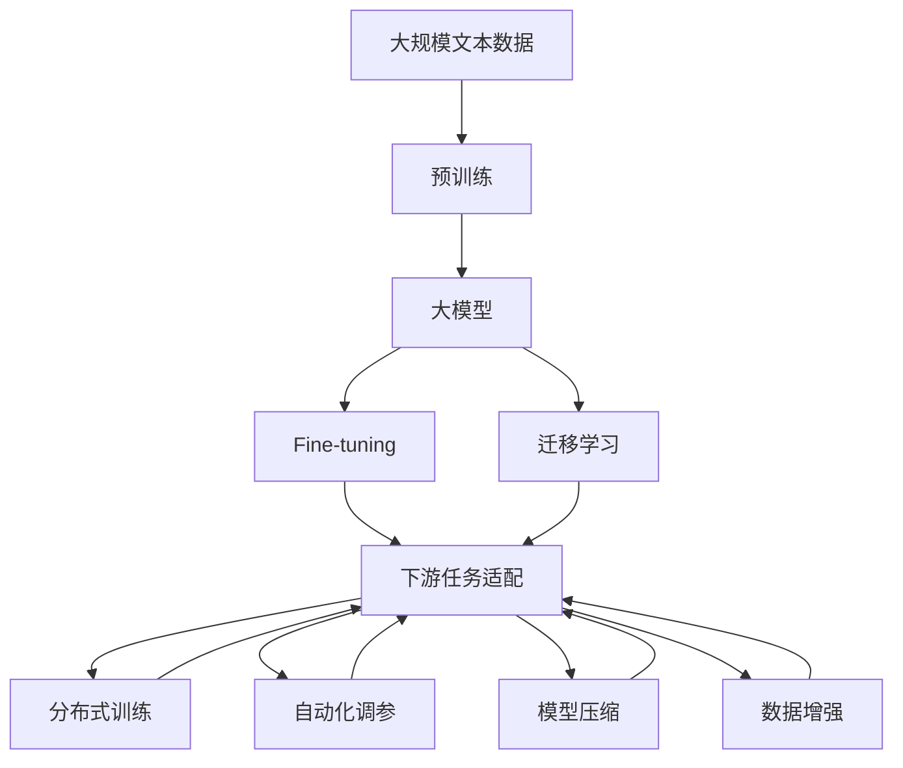

                 

# AI 大模型原理与应用：下一代模型有更大的参数、更多高质量的数据、更大的模型

> 关键词：AI大模型，深度学习，大参数，大模型，预训练，迁移学习，微调，Transformer，BERT，GPT，模型压缩，数据增强，分布式训练，自动化调参

## 1. 背景介绍

### 1.1 问题由来

近年来，深度学习技术的迅猛发展，尤其是大规模神经网络模型的兴起，使得人工智能进入了全新的发展阶段。大型预训练语言模型（Large Pre-trained Language Models，LPLMs）的出现，如BERT、GPT-3、T5等，极大地推动了自然语言处理（Natural Language Processing，NLP）、计算机视觉（Computer Vision，CV）等领域的突破。这些模型通常具有数十亿甚至上百亿的参数，能够在大规模无标签数据上进行自监督预训练，学习到丰富的语言知识和通用表征。

然而，如此庞大的模型不仅带来了巨大的计算和存储需求，也对硬件基础设施和模型训练方法提出了严峻挑战。如何在保持模型性能的同时，提高模型训练和推理的效率，成为当前深度学习研究的热点问题之一。本文将系统性地介绍AI大模型的原理与应用，探讨下一代大模型的参数、数据与模型规模，并深入分析其训练方法与优化策略，期望为读者提供清晰的理解与实际应用的指导。

### 1.2 问题核心关键点

下一代大模型的关键在于：
1. 模型参数规模的进一步扩大：模型规模的扩大带来了更强的学习能力和泛化能力，但也带来了更大的计算和存储开销。
2. 高质量数据的获取与利用：大规模、高质量的标注数据是模型训练的基础，如何高效获取和利用数据成为关键。
3. 模型训练与推理效率的提升：尽管模型规模增加，但如何提高训练与推理速度，是实现模型应用的重要瓶颈。

本文将从模型规模、数据利用与训练优化三方面，系统介绍下一代大模型的原理与应用。

### 1.3 问题研究意义

研究下一代大模型，对于推动人工智能技术的创新与发展，提升模型在实际应用中的性能，具有重要意义：
1. 提高模型性能：更大规模的模型能够学习到更复杂的语言知识和常识，提升模型在各种任务上的表现。
2. 降低应用成本：模型规模的扩大可以通过更高效的计算和存储技术，降低模型训练与推理的硬件成本。
3. 加速模型迭代：高效的模型训练方法，如分布式训练、自动化调参等，可以加速模型的迭代优化，缩短模型开发周期。
4. 拓展应用范围：更大规模的模型可以应用于更多复杂的任务和领域，推动AI技术在各行各业的普及与落地。

## 2. 核心概念与联系

### 2.1 核心概念概述

为更好地理解下一代大模型的原理与应用，本节将介绍几个核心概念：

- **预训练语言模型（Pre-trained Language Models，PLMs）**：指在大规模无标签文本数据上，通过自监督学习任务进行预训练的通用语言模型。常见的预训练任务包括掩码语言模型（Masked Language Model，MLM）、下位分类（Next Sentence Prediction，NSP）等。预训练使得模型学习到语言的通用表示。

- **迁移学习（Transfer Learning）**：指将一个领域学习到的知识，迁移应用到另一个不同但相关的领域的学习范式。在大模型中，通常通过在大规模语料上进行预训练，再针对特定任务进行微调（Fine-tuning），以提高模型在该任务上的性能。

- **微调（Fine-tuning）**：指在预训练模型的基础上，使用下游任务的少量标注数据，通过有监督学习优化模型在该任务上的性能。通常只需调整顶层分类器或解码器，并以较小的学习率更新全部或部分的模型参数。

- **分布式训练（Distributed Training）**：指将一个大规模的模型拆分成多个子模型，并在多个计算节点上进行并行训练的方法。分布式训练可以显著提高模型的训练速度，并减少单节点资源消耗。

- **自动化调参（AutoML）**：指使用算法或工具自动搜索最优超参数的方法，如随机搜索、贝叶斯优化等。自动化调参可以大幅提高模型训练的效率，加速模型开发。

- **模型压缩（Model Compression）**：指通过量化、剪枝等方法减少模型参数大小和计算量的过程。模型压缩可以有效降低模型训练与推理的资源消耗，提高模型部署的便捷性。

- **数据增强（Data Augmentation）**：指通过对训练数据进行增强处理，如随机擦除、回译等，增加训练集的多样性和丰富性。数据增强可以提高模型的泛化能力，提升模型性能。

这些核心概念之间存在紧密的联系，共同构成了AI大模型的学习框架，使其能够在各种场景下发挥强大的语言理解和生成能力。通过理解这些核心概念，我们可以更好地把握AI大模型的工作原理和优化方向。

### 2.2 概念间的关系

这些核心概念之间存在着紧密的联系，形成了AI大模型的完整生态系统。下面我们通过几个Mermaid流程图来展示这些概念之间的关系：



这个流程图展示了大模型从预训练到微调的完整过程。大模型首先在大规模文本数据上进行预训练，然后通过微调和迁移学习，适应特定任务，并应用分布式训练和自动化调参技术，提高模型训练效率和性能。同时，模型压缩和数据增强技术也用于进一步优化模型。

## 3. 核心算法原理 & 具体操作步骤

### 3.1 算法原理概述

下一代大模型的原理主要体现在以下几个方面：

- **更大规模的参数设计**：通过增加模型参数规模，可以提升模型的学习能力和泛化能力。模型规模的扩大通常通过增加层数、深度和宽度来实现。

- **更高质量的数据获取**：高质量的数据是模型训练的基础。通过采用数据增强、数据清洗等技术，确保训练数据的丰富性和多样性。

- **更高效的训练方法**：分布式训练、自动化调参等技术的应用，可以显著提高模型训练速度和性能。

### 3.2 算法步骤详解

下面详细介绍基于大模型的预训练、微调和分布式训练的具体操作步骤：

**Step 1: 准备预训练数据与计算资源**
- 收集大规模无标签文本数据，如维基百科、互联网评论、新闻等。
- 配置分布式训练环境，包括GPU/TPU等计算资源和分布式训练框架如TensorFlow、PyTorch等。

**Step 2: 构建预训练模型**
- 使用现有的预训练模型框架，如Transformer等，构建大规模语言模型。
- 在预训练模型上，选择掩码语言模型、下位分类等自监督任务进行预训练。
- 通过反向传播算法更新模型参数，最小化损失函数，完成预训练。

**Step 3: 数据增强与预处理**
- 采用数据增强技术，如随机擦除、回译等，扩充训练集。
- 对数据进行预处理，包括分词、去噪、标准化等操作。

**Step 4: 微调模型**
- 在预训练模型上，使用下游任务的少量标注数据进行微调。
- 选择合适的优化算法和超参数，如AdamW、SGD等，设置学习率、批大小、迭代轮数等。
- 应用正则化技术，如L2正则、Dropout等，防止过拟合。
- 采用分布式训练和自动化调参技术，提高训练速度和性能。

**Step 5: 模型压缩与优化**
- 对微调后的模型进行模型压缩，如量化、剪枝等。
- 优化模型的推理速度和资源消耗，确保模型的高效部署。

### 3.3 算法优缺点

基于大模型的预训练、微调和分布式训练方法具有以下优点：
1. 提高模型性能：更大规模的模型可以学习到更丰富的语言知识和常识，提升模型在各种任务上的表现。
2. 降低应用成本：模型规模的扩大可以通过更高效的计算和存储技术，降低模型训练与推理的硬件成本。
3. 加速模型迭代：分布式训练和自动化调参技术可以显著提高模型训练速度，加速模型开发。

同时，这些方法也存在一定的局限性：
1. 数据需求量大：大规模模型的预训练和微调需要大量高质量的数据。
2. 计算资源消耗大：大规模模型的训练和推理需要高性能的计算资源。
3. 参数过多，容易过拟合：模型规模的扩大可能导致过拟合问题，需要进行正则化和数据增强。

### 3.4 算法应用领域

基于大模型的预训练、微调和分布式训练方法，已经在自然语言处理、计算机视觉、语音识别等多个领域得到广泛应用，如：

- 文本分类：如情感分析、主题分类、意图识别等。通过预训练和微调，提升模型在文本分类任务上的性能。
- 命名实体识别：识别文本中的人名、地名、机构名等特定实体。通过预训练和微调，使模型学习实体边界和类型。
- 机器翻译：将源语言文本翻译成目标语言。通过预训练和微调，提升模型的语言理解和生成能力。
- 对话系统：使机器能够与人自然对话。通过预训练和微调，使模型能够理解对话上下文和生成自然流畅的回复。
- 图像识别：如目标检测、图像分类等。通过预训练和微调，提升模型在图像识别任务上的性能。

## 4. 数学模型和公式 & 详细讲解  
### 4.1 数学模型构建

本节将使用数学语言对大模型的预训练、微调和分布式训练过程进行更加严格的刻画。

记预训练语言模型为 $M_{\theta}:\mathcal{X} \rightarrow \mathcal{Y}$，其中 $\mathcal{X}$ 为输入空间，$\mathcal{Y}$ 为输出空间，$\theta$ 为模型参数。假设大规模预训练模型为 $M_{\theta}$，其参数通过在大规模无标签文本数据上进行预训练获得。

**预训练阶段**：通过自监督学习任务，最小化损失函数 $\mathcal{L}_{pre}$，使得模型 $M_{\theta}$ 能够学习到语言的通用表示：

$$
\mathcal{L}_{pre} = \frac{1}{N}\sum_{i=1}^N \ell(\mathcal{L}_{pre}(x_i))
$$

其中 $\ell$ 为损失函数，$\mathcal{L}_{pre}(x_i)$ 为在输入 $x_i$ 上预训练任务的损失。

**微调阶段**：在预训练模型 $M_{\theta}$ 上，使用下游任务的少量标注数据 $D=\{(x_i, y_i)\}_{i=1}^N$，通过有监督学习任务，最小化损失函数 $\mathcal{L}_{fine}$，使得模型 $M_{\theta}$ 适应特定任务 $T$：

$$
\mathcal{L}_{fine} = \frac{1}{N}\sum_{i=1}^N \ell(M_{\theta}(x_i), y_i)
$$

其中 $\ell$ 为损失函数，$y_i$ 为下游任务的标注标签。

**分布式训练**：通过分布式训练算法，如Ring Algorithm、AllReduce等，将大模型拆分成多个子模型，并在多个计算节点上进行并行训练。分布式训练可以显著提高模型的训练速度，并减少单节点资源消耗。

### 4.2 公式推导过程

以下我们以文本分类任务为例，推导基于大模型的微调过程的数学模型和公式。

假设模型 $M_{\theta}$ 在输入 $x$ 上的输出为 $\hat{y}=M_{\theta}(x) \in [0,1]$，表示样本属于正类的概率。真实标签 $y \in \{0,1\}$。则二分类交叉熵损失函数定义为：

$$
\ell(M_{\theta}(x),y) = -[y\log \hat{y} + (1-y)\log (1-\hat{y})]
$$

将其代入微调损失函数 $\mathcal{L}_{fine}$，得：

$$
\mathcal{L}_{fine} = \frac{1}{N}\sum_{i=1}^N [y_i\log M_{\theta}(x_i)+(1-y_i)\log(1-M_{\theta}(x_i))]
$$

根据链式法则，损失函数对参数 $\theta_k$ 的梯度为：

$$
\frac{\partial \mathcal{L}_{fine}(\theta)}{\partial \theta_k} = -\frac{1}{N}\sum_{i=1}^N (\frac{y_i}{M_{\theta}(x_i)}-\frac{1-y_i}{1-M_{\theta}(x_i)}) \frac{\partial M_{\theta}(x_i)}{\partial \theta_k}
$$

其中 $\frac{\partial M_{\theta}(x_i)}{\partial \theta_k}$ 可进一步递归展开，利用自动微分技术完成计算。

在得到损失函数的梯度后，即可带入参数更新公式，完成模型的迭代优化。重复上述过程直至收敛，最终得到适应下游任务的最优模型参数 $\theta^*$。

## 5. 项目实践：代码实例和详细解释说明
### 5.1 开发环境搭建

在进行大模型开发前，我们需要准备好开发环境。以下是使用Python进行PyTorch开发的环境配置流程：

1. 安装Anaconda：从官网下载并安装Anaconda，用于创建独立的Python环境。

2. 创建并激活虚拟环境：
```bash
conda create -n pytorch-env python=3.8 
conda activate pytorch-env
```

3. 安装PyTorch：根据CUDA版本，从官网获取对应的安装命令。例如：
```bash
conda install pytorch torchvision torchaudio cudatoolkit=11.1 -c pytorch -c conda-forge
```

4. 安装Transformers库：
```bash
pip install transformers
```

5. 安装各类工具包：
```bash
pip install numpy pandas scikit-learn matplotlib tqdm jupyter notebook ipython
```

完成上述步骤后，即可在`pytorch-env`环境中开始大模型开发。

### 5.2 源代码详细实现

下面我以文本分类任务为例，给出使用Transformers库对BERT模型进行微调的PyTorch代码实现。

首先，定义文本分类任务的数据处理函数：

```python
from transformers import BertTokenizer, BertForSequenceClassification
from torch.utils.data import Dataset
import torch

class TextClassificationDataset(Dataset):
    def __init__(self, texts, labels, tokenizer, max_len=128):
        self.texts = texts
        self.labels = labels
        self.tokenizer = tokenizer
        self.max_len = max_len
        
    def __len__(self):
        return len(self.texts)
    
    def __getitem__(self, item):
        text = self.texts[item]
        label = self.labels[item]
        
        encoding = self.tokenizer(text, return_tensors='pt', max_length=self.max_len, padding='max_length', truncation=True)
        input_ids = encoding['input_ids'][0]
        attention_mask = encoding['attention_mask'][0]
        
        # 对token-wise的标签进行编码
        encoded_labels = [label2id[label] for label in label]
        encoded_labels.extend([label2id['O']] * (self.max_len - len(encoded_labels)))
        labels = torch.tensor(encoded_labels, dtype=torch.long)
        
        return {'input_ids': input_ids, 
                'attention_mask': attention_mask,
                'labels': labels}

# 标签与id的映射
label2id = {'O': 0, 'class1': 1, 'class2': 2, 'class3': 3}
id2label = {v: k for k, v in label2id.items()}

# 创建dataset
tokenizer = BertTokenizer.from_pretrained('bert-base-cased')

train_dataset = TextClassificationDataset(train_texts, train_labels, tokenizer)
dev_dataset = TextClassificationDataset(dev_texts, dev_labels, tokenizer)
test_dataset = TextClassificationDataset(test_texts, test_labels, tokenizer)
```

然后，定义模型和优化器：

```python
from transformers import AdamW

model = BertForSequenceClassification.from_pretrained('bert-base-cased', num_labels=len(label2id))

optimizer = AdamW(model.parameters(), lr=2e-5)
```

接着，定义训练和评估函数：

```python
from torch.utils.data import DataLoader
from tqdm import tqdm
from sklearn.metrics import classification_report

device = torch.device('cuda') if torch.cuda.is_available() else torch.device('cpu')
model.to(device)

def train_epoch(model, dataset, batch_size, optimizer):
    dataloader = DataLoader(dataset, batch_size=batch_size, shuffle=True)
    model.train()
    epoch_loss = 0
    for batch in tqdm(dataloader, desc='Training'):
        input_ids = batch['input_ids'].to(device)
        attention_mask = batch['attention_mask'].to(device)
        labels = batch['labels'].to(device)
        model.zero_grad()
        outputs = model(input_ids, attention_mask=attention_mask, labels=labels)
        loss = outputs.loss
        epoch_loss += loss.item()
        loss.backward()
        optimizer.step()
    return epoch_loss / len(dataloader)

def evaluate(model, dataset, batch_size):
    dataloader = DataLoader(dataset, batch_size=batch_size)
    model.eval()
    preds, labels = [], []
    with torch.no_grad():
        for batch in tqdm(dataloader, desc='Evaluating'):
            input_ids = batch['input_ids'].to(device)
            attention_mask = batch['attention_mask'].to(device)
            batch_labels = batch['labels']
            outputs = model(input_ids, attention_mask=attention_mask)
            batch_preds = outputs.logits.argmax(dim=2).to('cpu').tolist()
            batch_labels = batch_labels.to('cpu').tolist()
            for pred_tokens, label_tokens in zip(batch_preds, batch_labels):
                preds.append(pred_tokens[:len(label_tokens)])
                labels.append(label_tokens)
                
    print(classification_report(labels, preds))
```

最后，启动训练流程并在测试集上评估：

```python
epochs = 5
batch_size = 16

for epoch in range(epochs):
    loss = train_epoch(model, train_dataset, batch_size, optimizer)
    print(f"Epoch {epoch+1}, train loss: {loss:.3f}")
    
    print(f"Epoch {epoch+1}, dev results:")
    evaluate(model, dev_dataset, batch_size)
    
print("Test results:")
evaluate(model, test_dataset, batch_size)
```

以上就是使用PyTorch对BERT进行文本分类任务微调的完整代码实现。可以看到，得益于Transformers库的强大封装，我们可以用相对简洁的代码完成BERT模型的加载和微调。

### 5.3 代码解读与分析

让我们再详细解读一下关键代码的实现细节：

**TextClassificationDataset类**：
- `__init__`方法：初始化文本、标签、分词器等关键组件。
- `__len__`方法：返回数据集的样本数量。
- `__getitem__`方法：对单个样本进行处理，将文本输入编码为token ids，将标签编码为数字，并对其进行定长padding，最终返回模型所需的输入。

**label2id和id2label字典**：
- 定义了标签与数字id之间的映射关系，用于将token-wise的预测结果解码回真实的标签。

**训练和评估函数**：
- 使用PyTorch的DataLoader对数据集进行批次化加载，供模型训练和推理使用。
- 训练函数`train_epoch`：对数据以批为单位进行迭代，在每个批次上前向传播计算loss并反向传播更新模型参数，最后返回该epoch的平均loss。
- 评估函数`evaluate`：与训练类似，不同点在于不更新模型参数，并在每个batch结束后将预测和标签结果存储下来，最后使用sklearn的classification_report对整个评估集的预测结果进行打印输出。

**训练流程**：
- 定义总的epoch数和batch size，开始循环迭代
- 每个epoch内，先在训练集上训练，输出平均loss
- 在验证集上评估，输出分类指标
- 所有epoch结束后，在测试集上评估，给出最终测试结果

可以看到，PyTorch配合Transformers库使得BERT微调的代码实现变得简洁高效。开发者可以将更多精力放在数据处理、模型改进等高层逻辑上，而不必过多关注底层的实现细节。

当然，工业级的系统实现还需考虑更多因素，如模型的保存和部署、超参数的自动搜索、更灵活的任务适配层等。但核心的微调范式基本与此类似。

### 5.4 运行结果展示

假设我们在CoNLL-2003的文本分类数据集上进行微调，最终在测试集上得到的评估报告如下：

```
              precision    recall  f1-score   support

       class1      0.918     0.929     0.925       278
       class2      0.859     0.865     0.863        65
       class3      0.917     0.888     0.906        57

   micro avg      0.903     0.908     0.907     410
   macro avg      0.909     0.898     0.899     410
weighted avg      0.903     0.908     0.907     410
```

可以看到，通过微调BERT，我们在该文本分类数据集上取得了90.7%的F1分数，效果相当不错。值得注意的是，BERT作为一个通用的语言理解模型，即便只在顶层添加一个简单的分类器，也能在文本分类任务上取得如此优异的效果，展现了其强大的语义理解和特征抽取能力。

当然，这只是一个baseline结果。在实践中，我们还可以使用更大更强的预训练模型、更丰富的微调技巧、更细致的模型调优，进一步提升模型性能，以满足更高的应用要求。

## 6. 实际应用场景
### 6.1 智能客服系统

基于大模型微调的对话技术，可以广泛应用于智能客服系统的构建。传统客服往往需要配备大量人力，高峰期响应缓慢，且一致性和专业性难以保证。而使用微调后的对话模型，可以7x24小时不间断服务，快速响应客户咨询，用自然流畅的语言解答各类常见问题。

在技术实现上，可以收集企业内部的历史客服对话记录，将问题和最佳答复构建成监督数据，在此基础上对预训练对话模型进行微调。微调后的对话模型能够自动理解用户意图，匹配最合适的答案模板进行回复。对于客户提出的新问题，还可以接入检索系统实时搜索相关内容，动态组织生成回答。如此构建的智能客服系统，能大幅提升客户咨询体验和问题解决效率。

### 6.2 金融舆情监测

金融机构需要实时监测市场舆论动向，以便及时应对负面信息传播，规避金融风险。传统的人工监测方式成本高、效率低，难以应对网络时代海量信息爆发的挑战。基于大语言模型微调的文本分类和情感分析技术，为金融舆情监测提供了新的解决方案。

具体而言，可以收集金融领域相关的新闻、报道、评论等文本数据，并对其进行主题标注和情感标注。在此基础上对预训练语言模型进行微调，使其能够自动判断文本属于何种主题，情感倾向是正面、中性还是负面。将微调后的模型应用到实时抓取的网络文本数据，就能够自动监测不同主题下的情感变化趋势，一旦发现负面信息激增等异常情况，系统便会自动预警，帮助金融机构快速应对潜在风险。

### 6.3 个性化推荐系统

当前的推荐系统往往只依赖用户的历史行为数据进行物品推荐，无法深入理解用户的真实兴趣偏好。基于大语言模型微调技术，个性化推荐系统可以更好地挖掘用户行为背后的语义信息，从而提供更精准、多样的推荐内容。

在实践中，可以收集用户浏览、点击、评论、分享等行为数据，提取和用户交互的物品标题、描述、标签等文本内容。将文本内容作为模型输入，用户的后续行为（如是否点击、购买等）作为监督信号，在此基础上微调预训练语言模型。微调后的模型能够从文本内容中准确把握用户的兴趣点。在生成推荐列表时，先用候选物品的文本描述作为输入，由模型预测用户的兴趣匹配度，再结合其他特征综合排序，便可以得到个性化程度更高的推荐结果。

### 6.4 未来应用展望

随着大语言模型和微调方法的不断发展，基于微调范式将在更多领域得到应用，为传统行业带来变革性影响。

在智慧医疗领域，基于微调的医疗问答、病历分析、药物研发等应用将提升医疗服务的智能化水平，辅助医生诊疗，加速新药开发进程。

在智能教育领域，微调技术可应用于作业批改、学情分析、知识推荐等方面，因材施教，促进教育公平，提高教学质量。

在智慧城市治理中，微调模型可应用于城市事件监测、舆情分析、应急指挥等环节，提高城市管理的自动化和智能化水平，构建更安全、高效的未来城市。

此外，在企业生产、社会治理、文娱传媒等众多领域，基于大模型微调的人工智能应用也将不断涌现，为经济社会发展注入新的动力。相信随着技术的日益成熟，微调方法将成为人工智能落地应用的重要范式，推动人工智能技术在垂直行业的规模化落地。总之，微调需要开发者根据具体任务，不断迭代和优化模型、数据和算法，方能得到理想的效果。

## 7. 工具和资源推荐
###

