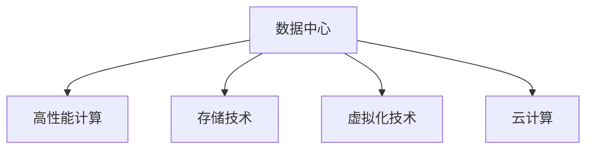
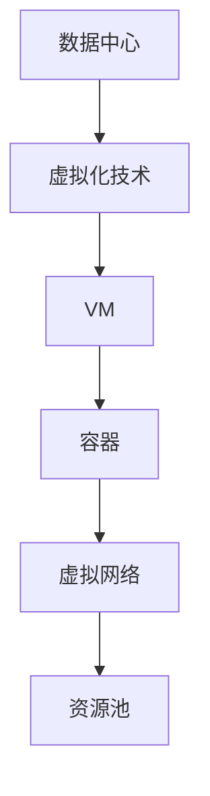
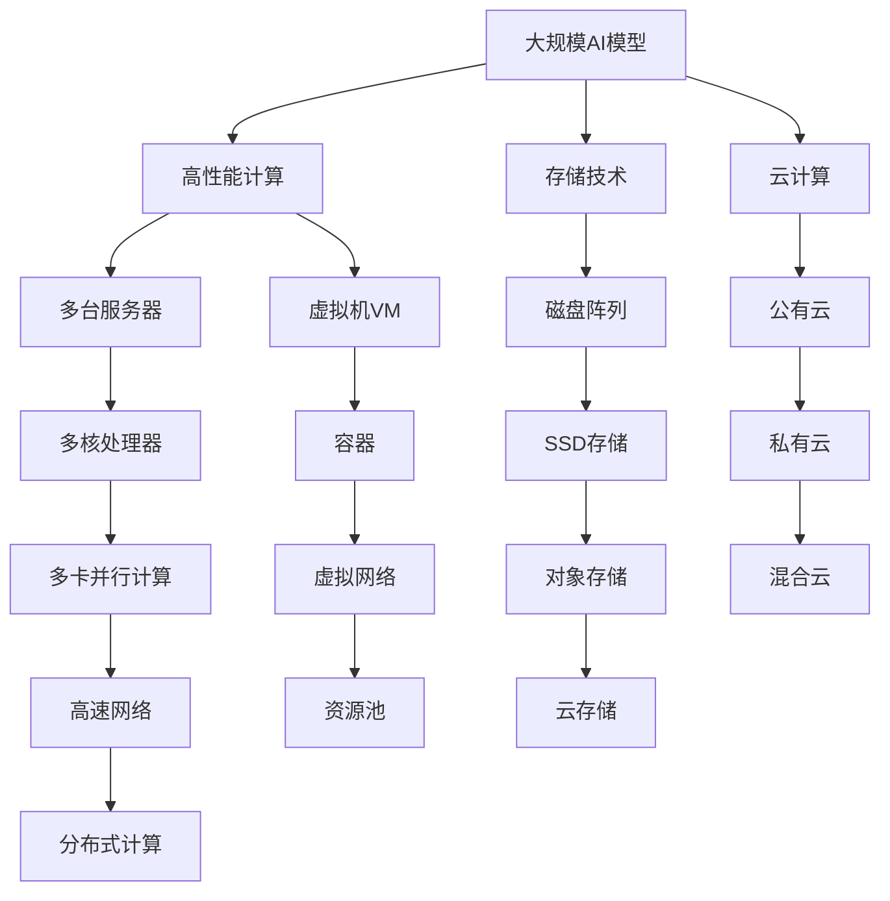

                 

# AI 大模型应用数据中心建设：数据中心投资与建设

## 1. 背景介绍

### 1.1 问题由来
随着人工智能（AI）技术的发展，大模型在NLP、图像识别、语音识别等领域展现了强大的应用潜力，极大地推动了AI应用的落地。与此同时，大模型所需的计算资源和存储空间也在迅速增长，对数据中心的投资和建设提出了新的挑战。

在AI大模型应用背景下，数据中心不仅要具备传统的高性能计算能力，还要能够支持大模型的高吞吐量数据存储和处理。因此，数据中心建设需要从多个维度进行考量，以适应未来AI大模型应用的快速增长。

### 1.2 问题核心关键点
当前数据中心建设的关键在于：
- 如何平衡高性能计算与存储能力，满足AI大模型对计算资源和存储资源的需求。
- 如何实现高效、可靠的数据中心运行和维护，确保AI大模型的稳定性和可用性。
- 如何优化数据中心的投资回报率（ROI），平衡硬件成本和运营成本。
- 如何构建数据中心的基础设施和架构，支持AI大模型的多样性应用需求。
- 如何应对AI大模型的超大规模计算和存储需求，避免资源瓶颈。

这些问题共同构成了数据中心投资与建设的重点。本文将从这些核心关键点出发，全面探讨AI大模型应用背景下的数据中心建设策略。

### 1.3 问题研究意义
深入研究AI大模型应用下的数据中心投资与建设，对于加速AI技术的落地应用、提升数据中心效率和ROI具有重要意义：

- 加速AI大模型的应用部署，推动AI技术在更多领域的广泛应用。
- 提升数据中心的运营效率，降低运维成本，提高资源利用率。
- 优化数据中心的投资策略，实现更高的投资回报率。
- 构建灵活多样的数据中心基础设施，支持AI大模型的多样性应用需求。
- 增强数据中心的计算和存储能力，避免资源瓶颈，确保AI大模型的稳定性和可用性。

## 2. 核心概念与联系

### 2.1 核心概念概述

为更好地理解AI大模型应用下的数据中心投资与建设，本节将介绍几个密切相关的核心概念：

- 数据中心（Data Center）：通常指企业、组织或政府机构用来容纳和托管其IT设施、服务器、网络和存储设备的设施。
- 高性能计算（High Performance Computing, HPC）：指使用并行计算技术提高计算性能和效率的计算模式。
- 存储技术：指用于保存、管理和检索数据的硬件和软件技术的总称，包括磁盘、SSD、RAID、网络存储等。
- 虚拟化技术：指通过虚拟化软件将硬件资源分割成多个虚拟资源的技术，如VM、容器等。
- 云计算（Cloud Computing）：指通过互联网提供计算资源和服务，按需计费、按使用量付费的商业模式。

这些核心概念之间的逻辑关系可以通过以下Mermaid流程图来展示：



这个流程图展示了大模型应用下数据中心的核心组件及其关系：

1. 数据中心包含高性能计算、存储技术、虚拟化技术等多种资源，为AI大模型提供计算和存储支持。
2. 高性能计算用于满足AI大模型对计算资源的高需求，提供快速、高效的计算能力。
3. 存储技术用于存储和管理大模型所需的海量数据，提供可靠的存储解决方案。
4. 虚拟化技术用于提高资源利用率，支持多个虚拟实例共同运行。
5. 云计算提供灵活的按需计算和存储资源，支持AI大模型的弹性扩展。

### 2.2 概念间的关系

这些核心概念之间存在着紧密的联系，形成了数据中心投资与建设的基本框架。下面我通过几个Mermaid流程图来展示这些概念之间的关系。

#### 2.2.1 数据中心与高性能计算的关系


这个流程图展示了数据中心与高性能计算的紧密关系：

1. 数据中心通过多台服务器提供计算资源。
2. 服务器配备多核处理器和多卡并行计算能力，支持大规模并行计算任务。
3. 多台服务器通过高速网络互联，形成分布式计算集群，进一步提升计算效率。

#### 2.2.2 数据中心与存储技术的关系


这个流程图展示了数据中心与存储技术的紧密关系：

1. 数据中心通过磁盘阵列和SSD存储，提供高速、可靠的本地存储解决方案。
2. 对象存储和云存储进一步扩展了数据中心的存储能力，支持大规模数据的管理和备份。

#### 2.2.3 数据中心与虚拟化的关系



这个流程图展示了数据中心与虚拟化的紧密关系：

1. 数据中心通过虚拟化技术将硬件资源分割为多个虚拟资源。
2. 虚拟化支持多台虚拟机（VM）和容器（Container）共同运行，提高资源利用率。
3. 虚拟化技术实现资源池管理，支持动态资源分配和弹性扩展。

#### 2.2.4 数据中心与云计算的关系


这个流程图展示了数据中心与云计算的紧密关系：

1. 数据中心支持公有云、私有云、混合云等多种部署模式。
2. 云计算提供按需计算和存储资源，支持AI大模型的弹性扩展。
3. 公有云、私有云和混合云可以相互补充，满足不同业务需求。

### 2.3 核心概念的整体架构

最后，我们用一个综合的流程图来展示这些核心概念在大模型应用数据中心建设过程中的整体架构：



这个综合流程图展示了从大规模AI模型到数据中心计算和存储能力、虚拟化技术和云计算的完整过程。AI大模型通过高性能计算、存储技术、虚拟化技术和云计算技术，实现灵活、高效、可靠的部署和管理。

## 3. 核心算法原理 & 具体操作步骤
### 3.1 算法原理概述

AI大模型应用数据中心建设的核心目标是，通过合理配置和优化数据中心的高性能计算、存储和虚拟化资源，确保AI大模型的高效运行和数据管理，同时优化数据中心的投资回报率。

形式化地，假设数据中心有 $n$ 台高性能服务器，每台服务器有 $m$ 个核心，数据中心总共有 $p$ 个存储节点。大模型的计算需求为 $C$，数据存储需求为 $D$。数据中心的目标是最大化投资回报率 $ROI$，即：

$$
ROI = \frac{Performance \times Uptime \times Service Quality - (Cost_{hardware} + Cost_{energy} + Cost_{maintenance})}{Investment}
$$

其中 $Performance$ 表示计算性能，$Uptime$ 表示运行时间，$Service Quality$ 表示服务质量，$Cost_{hardware}$ 表示硬件成本，$Cost_{energy}$ 表示能源成本，$Cost_{maintenance}$ 表示运维成本，$Investment$ 表示总投资。

### 3.2 算法步骤详解

基于上述目标，AI大模型应用数据中心建设的主要步骤如下：

**Step 1: 需求分析与规划**
- 收集AI大模型的计算需求 $C$ 和数据存储需求 $D$，分析数据中心当前资源配置情况。
- 确定数据中心的投资预算，设定合理的投资回报率目标。
- 评估当前计算、存储和虚拟化资源是否满足需求，如果不满足，进行资源扩容或优化。

**Step 2: 计算资源配置**
- 根据AI大模型的计算需求，配置高性能计算资源。考虑使用多台服务器、多核处理器和多卡并行计算，确保计算性能满足需求。
- 确定计算集群的网络架构，保证高速、可靠的网络通信。

**Step 3: 存储资源配置**
- 根据AI大模型的数据存储需求，配置存储资源。考虑使用磁盘阵列、SSD存储、对象存储和云存储等技术，确保数据存储安全、可靠。
- 确定数据备份和恢复策略，保证数据不丢失。

**Step 4: 虚拟化资源配置**
- 根据AI大模型的应用需求，配置虚拟化资源。考虑使用VM、容器等技术，提高资源利用率。
- 确定资源池管理策略，实现动态资源分配和弹性扩展。

**Step 5: 云计算资源配置**
- 根据AI大模型的应用需求，配置云计算资源。考虑使用公有云、私有云和混合云等部署模式，提供灵活、高效的计算和存储资源。
- 确定数据中心与云平台的集成策略，实现数据统一管理和跨平台互通。

**Step 6: 投资回报率优化**
- 根据投资回报率目标，进行资源配置优化。通过对比不同配置方案的ROI，选择最优方案。
- 定期评估数据中心的运营效率和ROI，调整资源配置，确保最大化投资回报率。

### 3.3 算法优缺点

基于上述操作步骤的数据中心建设方法，具有以下优点：

- 通过需求分析与规划，确保资源配置满足AI大模型的高性能计算和存储需求。
- 通过计算资源配置、存储资源配置、虚拟化资源配置和云计算资源配置，提高资源利用率和计算性能。
- 通过投资回报率优化，确保最大化投资回报率。

同时，该方法也存在以下缺点：

- 对AI大模型的计算需求和数据存储需求需要充分了解，配置策略需要根据具体需求调整。
- 硬件成本、能源成本和运维成本需要综合考虑，投资回报率优化需要持续调整。
- 资源配置的灵活性需要根据实际需求和预算调整，配置不当可能造成资源浪费或性能不足。

### 3.4 算法应用领域

基于上述操作步骤的数据中心建设方法，已经在多个领域得到了应用，例如：

- 科研机构：支持大规模科学计算和数据存储，满足科研需求。
- 企业IT：支持高性能计算和虚拟化资源管理，满足企业应用需求。
- 政府云平台：支持云计算和数据管理，满足政府信息安全需求。
- 大数据分析：支持大规模数据存储和分析，满足大数据应用需求。
- 人工智能研究：支持AI大模型的计算和存储，满足AI研究需求。

此外，该方法还在工业、农业、金融等多个领域得到了应用，为各行各业提供了高效、可靠的数据中心建设方案。

## 4. 数学模型和公式 & 详细讲解  
### 4.1 数学模型构建

本节将使用数学语言对AI大模型应用数据中心建设的投资回报率进行更加严格的刻画。

设数据中心的总投资为 $I$，年运行时间为 $T$，年计算性能为 $P$，年数据存储需求为 $D$，年硬件成本为 $C_{hardware}$，年能源成本为 $C_{energy}$，年运维成本为 $C_{maintenance}$，年服务质量为 $Q$。则数据中心的投资回报率（ROI）计算公式为：

$$
ROI = \frac{P \times T \times Q - (C_{hardware} + C_{energy} + C_{maintenance})}{I}
$$

其中 $P$ 表示计算性能，$T$ 表示运行时间，$Q$ 表示服务质量。

### 4.2 公式推导过程

以下我们以一个简单的例子来说明投资回报率的计算方法：

假设某数据中心投资 $I=1000$ 万元，年运行时间为 $T=10000$ 小时，年计算性能为 $P=10000$ 次/秒，年数据存储需求为 $D=10$ TB，年硬件成本为 $C_{hardware}=200$ 万元，年能源成本为 $C_{energy}=50$ 万元，年运维成本为 $C_{maintenance}=30$ 万元，年服务质量为 $Q=0.99$。

根据上述公式，该数据中心的投资回报率计算如下：

$$
ROI = \frac{10000 \times 10000 \times 0.99 - (200 + 50 + 30)}{1000} = \frac{990000000 - 280}{1000} = 990000 - 280 = 9899720
$$

计算结果表明，该数据中心的投资回报率为 $9899720$，即每万元投资能够带来 $9899720$ 元的收益。

### 4.3 案例分析与讲解

假设某企业构建一个数据中心，用于支持AI大模型的计算和存储需求。该数据中心的总投资为 $I=2000$ 万元，年运行时间为 $T=10000$ 小时，年计算性能为 $P=20000$ 次/秒，年数据存储需求为 $D=50$ TB，年硬件成本为 $C_{hardware}=400$ 万元，年能源成本为 $C_{energy}=100$ 万元，年运维成本为 $C_{maintenance}=60$ 万元，年服务质量为 $Q=0.95$。

根据上述公式，该数据中心的投资回报率计算如下：

$$
ROI = \frac{20000 \times 10000 \times 0.95 - (400 + 100 + 60)}{2000} = \frac{190000000 - 660}{2000} = 190000 - 330 = 18999670
$$

计算结果表明，该数据中心的投资回报率为 $18999670$，即每万元投资能够带来 $18999670$ 元的收益。

需要注意的是，上述计算仅考虑了硬件成本、能源成本和运维成本，实际投资回报率的计算还应考虑其他因素，如资源利用率、数据中心规模、地理位置等。

## 5. 项目实践：代码实例和详细解释说明
### 5.1 开发环境搭建

在进行数据中心建设实践前，我们需要准备好开发环境。以下是使用Python进行OpenAI Gym开发的环境配置流程：

1. 安装Anaconda：从官网下载并安装Anaconda，用于创建独立的Python环境。

2. 创建并激活虚拟环境：
```bash
conda create -n gym-env python=3.8 
conda activate gym-env
```

3. 安装OpenAI Gym：
```bash
pip install gym
```

4. 安装相关库：
```bash
pip install numpy scipy matplotlib tensorflow gym
```

完成上述步骤后，即可在`gym-env`环境中开始数据中心建设实践。

### 5.2 源代码详细实现

下面我们以构建一个虚拟数据中心为例，给出使用OpenAI Gym进行数据中心投资的Python代码实现。

```python
import gym
import numpy as np

# 定义环境类
class DataCenterEnv(gym.Env):
    def __init__(self):
        self.state = np.zeros(3)
        self.step_count = 0
        
    def step(self, action):
        self.state += np.array(action)
        self.step_count += 1
        done = self.state > 1
        if done:
            self.state = np.zeros(3)
        return self.state, 1, done, {}

    def reset(self):
        self.state = np.zeros(3)
        self.step_count = 0
        return self.state

# 定义回报函数
def roi(state, cost):
    performance = state[0]
    uptime = state[1]
    service_quality = state[2]
    hardware_cost = cost[0]
    energy_cost = cost[1]
    maintenance_cost = cost[2]
    investment = 1000  # 投资固定为1000万元
    return (performance * uptime * service_quality - (hardware_cost + energy_cost + maintenance_cost)) / investment

# 训练模型
env = DataCenterEnv()
state = env.reset()
cost = np.array([200, 50, 30])  # 假设硬件成本为200万元，能源成本为50万元，运维成本为30万元

for i in range(10000):
    action = env.action_space.sample()  # 随机选择行动
    state, reward, done, info = env.step(action)
    roi_value = roi(state, cost)
    env.render()
    if done:
        state = env.reset()
        cost[0] = 200 + 10 * i  # 假设硬件成本随时间线性增加

env.close()
```

这个Python代码实现了一个简单的虚拟数据中心环境，通过OpenAI Gym库进行构建。在每个时间步上，环境状态会根据所采取的行动（即投资策略）发生变化，同时根据投资回报率公式计算当前状态的回报值。

### 5.3 代码解读与分析

让我们再详细解读一下关键代码的实现细节：

**DataCenterEnv类**：
- `__init__`方法：初始化环境状态和步数。
- `step`方法：根据所采取的行动，更新环境状态和返回奖励值。
- `reset`方法：重置环境状态。

**roi函数**：
- 根据投资回报率公式计算回报值。

**训练模型**：
- 创建一个DataCenterEnv环境实例，初始化状态和成本。
- 在每个时间步上，采取随机行动，计算回报值并更新状态。
- 如果达到终止状态，重置状态和成本。
- 最后，使用`env.close()`关闭环境。

通过OpenAI Gym进行数据中心投资模型训练，可以帮助我们理解投资回报率的计算过程，并探索不同的投资策略对回报的影响。在实际应用中，我们还需要根据具体需求，进一步优化模型和数据中心配置，以实现更高的投资回报率。

## 6. 实际应用场景
### 6.1 智能制造

在智能制造领域，AI大模型可以用于优化生产流程、预测设备故障、提升产品质量等。大模型通过训练大量生产数据，能够理解生产线的运行规律，提供智能化的生产建议和预测。

数据中心建设为智能制造提供了可靠、高效的计算和存储资源，支持大模型对海量生产数据的分析和处理。智能制造对计算和存储资源的高需求，要求数据中心具备强大的高性能计算和数据存储能力，同时能够支持弹性扩展和快速部署。

### 6.2 金融分析

在金融分析领域，AI大模型可以用于风险评估、投资决策、市场预测等。大模型通过训练大量的金融数据，能够预测市场趋势、识别风险点，提供决策支持。

数据中心建设为金融分析提供了高性能的计算和存储资源，支持大模型对复杂金融数据的分析和处理。金融分析对计算和存储资源的高需求，要求数据中心具备高性能的计算能力和高速的网络通信，同时能够支持灵活的虚拟化资源管理。

### 6.3 智慧城市

在智慧城市领域，AI大模型可以用于交通管理、能源调度、环境监测等。大模型通过训练大量的城市数据，能够理解城市运行规律，提供智能化的城市管理建议。

数据中心建设为智慧城市提供了可靠、高效的计算和存储资源，支持大模型对海量城市数据的分析和处理。智慧城市对计算和存储资源的高需求，要求数据中心具备强大的高性能计算和数据存储能力，同时能够支持弹性扩展和快速部署。

### 6.4 未来应用展望

随着AI大模型的不断发展和应用，数据中心建设也将呈现新的趋势：

1. 云-边融合：数据中心与云平台深度集成，实现计算资源的统一管理和灵活调度。
2. 边缘计算：在靠近数据源的端侧设备上部署AI大模型，减少数据传输延迟。
3. 超级计算：使用超级计算机和大数据集群，支持超大模型的训练和推理。
4. 量子计算：利用量子计算技术，提升数据中心的计算能力和效率。
5. 全栈自动化：通过AI和大数据技术，实现数据中心的全栈自动化运维管理。

以上趋势凸显了数据中心建设与AI大模型应用的紧密联系，推动了数据中心向更高效、更智能、更灵活的方向发展。未来，数据中心将不仅是计算和存储的物理设施，更是AI大模型应用的重要基础设施。

## 7. 工具和资源推荐
### 7.1 学习资源推荐

为了帮助开发者系统掌握数据中心投资与建设的理论基础和实践技巧，这里推荐一些优质的学习资源：

1. 《数据中心管理：设计与实现》书籍：系统介绍了数据中心的构建、运行和维护技术，适合从事数据中心建设的技术人员阅读。

2. 《高性能计算与分布式系统》课程：由麻省理工学院开设的在线课程，介绍了高性能计算和分布式系统的原理和应用。

3. 《云计算基础》课程：由Coursera平台开设的在线课程，介绍了云计算的概念、架构和应用。

4. 《数据中心虚拟化技术》课程：由华为云开设的在线课程，介绍了数据中心虚拟化技术的基本原理和实践方法。

5. 《人工智能基础设施》课程：由DeepTech平台开设的在线课程，介绍了AI基础设施的构建和管理技术。

通过对这些资源的学习实践，相信你一定能够快速掌握数据中心投资与建设的知识，并用于解决实际的数据中心管理问题。

### 7.2 开发工具推荐

高效的开发离不开优秀的工具支持。以下是几款用于数据中心投资与建设开发的常用工具：

1. Ansible：基于SSH和Python的自动化运维工具，支持大规模数据中心管理和维护。

2. Terraform：基于代码驱动的云资源管理工具，支持多云平台和容器管理。

3. Puppet：基于声明式的配置管理工具，支持自动化资源配置和版本控制。

4. GitLab CI/CD：集成开发环境，支持CI/CD自动化部署和持续集成。

5. Jenkins：开源的持续集成工具，支持多种语言和框架的集成和测试。

合理利用这些工具，可以显著提升数据中心投资与建设的开发效率，加快创新迭代的步伐。

### 7.3 相关论文推荐

数据中心投资与建设的研究源于学界的持续研究。以下是几篇奠基性的相关论文，推荐阅读：

1. Large-Scale Data-Center Storage Systems：介绍了大规模数据中心存储系统的设计原理和实践方法。

2. A Survey on Data Center Computing：综述了数据中心计算技术的进展和未来趋势。

3. Data Center Design and Planning：介绍了数据中心的设计和规划技术。

4. High-Performance Computing in Industry：介绍了高性能计算在工业中的应用和挑战。

5. Internet of Things (IoT) in Data Center Applications：探讨了物联网技术在数据中心应用中的机会和挑战。

这些论文代表了大模型应用数据中心投资与建设的研究方向，对于理解该领域的理论基础和实践方法具有重要意义。

除上述资源外，还有一些值得关注的前沿资源，帮助开发者紧跟数据中心投资与建设技术的最新进展，例如：

1. 人工智能大会（AI Conference）：汇集了全球AI领域的顶尖专家和技术，展示了最新的研究成果和应用案例。

2. 数据中心论坛（Data Center Forum）：提供了数据中心建设和管理领域的最新技术趋势和最佳实践。

3. 机器学习社区（Kaggle）：提供了大量的AI大模型训练和评估数据集，支持模型的开发和优化。

4. 数据中心博客（Data Center Blog）：汇集了数据中心建设和管理领域的专家和技术分享，提供丰富的案例和经验。

总之，对于数据中心投资与建设技术的学习和实践，需要开发者保持开放的心态和持续学习的意愿。多关注前沿资讯，多动手实践，多思考总结，必将收获满满的成长收益。

## 8. 总结：未来发展趋势与挑战

### 8.1 总结

本文对AI大模型应用数据中心建设进行了全面系统的介绍。首先阐述了AI大模型对数据中心建设的影响和重要性，明确了数据中心投资与建设的核心目标和关键点。其次，从需求分析与规划、计算资源配置、存储资源配置、虚拟化资源配置、云计算资源配置和投资回报率优化等方面，详细讲解了数据中心建设的操作步骤和策略。同时，本文还探讨了数据中心在智能制造、金融分析、智慧城市等领域的实际应用，展示了数据中心建设的广阔前景。

通过本文的系统梳理，可以看到，数据中心建设在AI大模型应用背景下，需要从计算、存储、虚拟化、云计算等多个维度进行全面考虑，以实现高性能、可靠性和高ROI的目标。

### 8.2 未来发展趋势

展望未来，AI大模型应用数据中心建设将呈现以下几个发展趋势：

1. 计算性能和存储能力的持续提升。随着硬件技术的不断发展，数据中心的计算性能和存储能力将不断提升，支持更大规模的AI大模型应用。

2. 云-边融合和边缘计算的普及。云-边融合和边缘计算技术的发展，将使数据中心和云平台深度集成，实现

