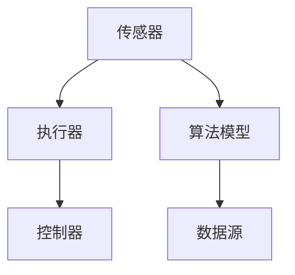
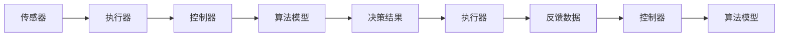
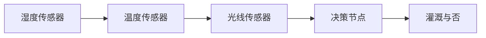

                 

# AI2.0时代：自动化技术的进展

## 1. 背景介绍

随着人工智能(AI)技术的迅猛发展，我们正迎来AI 2.0时代，这是一个全面自动化、智能化和个性化的新纪元。在这个时代，自动化技术已经深入到我们生活的方方面面，从智能家居、自动驾驶、医疗诊断到金融风控、工业制造，无处不在。自动化技术的核心就是通过算法和数据，实现对复杂系统的高效管理和优化，从而提升生产力、降低成本、改善用户体验。

然而，自动化技术的进步并非一蹴而就。它经历了从机械自动化、电气自动化到信息自动化、智能自动化的漫长历程，每一个阶段的突破都离不开人类对科学技术的不断探索和实践。本文将从自动化技术的演进、核心概念、应用实践和未来展望等方面，深入探讨AI 2.0时代自动化技术的进展，并对其面临的挑战进行思考和分析。

## 2. 核心概念与联系

### 2.1 核心概念概述

自动化技术的核心是自动化，即通过算法和数据驱动的系统，实现对复杂任务或过程的自动化处理，从而提高效率、降低成本、提升用户体验。这一过程涉及传感器、执行器、控制器等硬件设备和算法模型，以及数据获取、处理、分析和应用的完整闭环。

核心概念包括：

- **传感器**：用于采集环境数据，如温度、压力、光线等。
- **执行器**：用于执行任务或操作，如机械臂、电机等。
- **控制器**：用于处理传感器数据，生成控制指令，如PLC、计算机等。
- **算法模型**：用于数据处理、决策分析、行为预测等，如机器学习、深度学习等。
- **数据源**：提供自动化系统的输入和输出数据，如传感器读数、执行器反馈等。

这些概念之间的关系可以通过以下Mermaid流程图来展示：



这个流程图展示了传感器、执行器、控制器和算法模型之间的连接关系。传感器采集数据，执行器执行操作，控制器处理数据并生成控制指令，算法模型辅助决策和优化。数据源则提供数据供这些组件使用。

### 2.2 概念间的关系

自动化技术的核心流程可以分为数据获取、数据处理、决策分析、行为执行和反馈优化五个步骤。这五个步骤之间相互依赖，形成一个闭环系统，不断优化和提升系统性能。具体关系如下：

1. **数据获取**：传感器和执行器用于获取和处理环境数据，为系统提供输入。
2. **数据处理**：控制器和算法模型用于对输入数据进行分析和处理，生成控制指令。
3. **决策分析**：算法模型和控制器结合决策规则，生成决策结果。
4. **行为执行**：执行器根据决策结果执行相应的操作。
5. **反馈优化**：执行器返回反馈数据，控制器和算法模型用于优化系统性能。

这些步骤的关系可以用以下流程图来表示：



这个流程图展示了数据获取、数据处理、决策分析、行为执行和反馈优化之间的依赖关系。各组件之间的数据流动形成了系统的完整闭环，不断优化和提升系统性能。

## 3. 核心算法原理 & 具体操作步骤

### 3.1 算法原理概述

自动化技术的核心算法包括传感器数据处理、控制算法和决策算法等。其中，数据处理和控制算法是实现自动化的关键，而决策算法则负责生成最终的决策结果。

- **数据处理算法**：用于对传感器采集的数据进行预处理、特征提取和降维等操作，以便后续处理。
- **控制算法**：用于生成控制指令，通常包括PID控制、模糊控制等。
- **决策算法**：用于生成决策结果，通常包括机器学习、深度学习、强化学习等。

自动化技术的数据处理和控制算法往往是模型驱动的，即基于已有的数据和知识库，通过算法模型来生成决策。决策算法的核心在于如何从大量数据中提取有用的信息，并结合先验知识，生成最优的决策结果。

### 3.2 算法步骤详解

自动化技术的实施步骤如下：

1. **数据采集**：使用传感器采集环境数据。
2. **数据处理**：对采集的数据进行预处理、特征提取和降维等操作。
3. **模型训练**：使用历史数据训练模型，生成数据处理和控制算法。
4. **模型优化**：对训练好的模型进行优化，提高精度和鲁棒性。
5. **决策执行**：根据模型生成的决策结果，执行相应的操作。
6. **反馈优化**：根据执行结果和环境变化，不断优化模型和控制算法。

下面以一个简单的自动化控制系统为例，详细说明每个步骤的具体操作。

#### 3.2.1 数据采集

假设我们要实现一个自动灌溉系统，系统需要采集土壤湿度、温度和光线等信息。为此，我们可以安装多个传感器，如湿度传感器、温度传感器和光线传感器，以实时获取环境数据。

#### 3.2.2 数据处理

采集到的数据需要进行预处理，包括去噪、归一化等操作。接下来，我们需要进行特征提取，提取出对系统决策有影响的特征，如湿度、温度等。最后，我们可以使用PCA等降维算法，减少数据的维度，以便后续处理。

#### 3.2.3 模型训练

有了处理好的数据，我们可以使用机器学习算法进行模型训练。以决策树为例，我们可以将处理后的数据作为训练集，训练出一个决策树模型，用于判断是否需要灌溉。

#### 3.2.4 模型优化

模型训练后，我们需要对其进行优化，提高精度和鲁棒性。这可以通过交叉验证、网格搜索等方法，找到最优的模型参数。此外，我们还可以使用集成学习等方法，提高模型的泛化能力。

#### 3.2.5 决策执行

根据训练好的模型，我们可以生成决策结果，如灌溉与否。执行器可以根据决策结果，执行相应的操作，如开启灌溉泵。

#### 3.2.6 反馈优化

执行器返回反馈数据，如灌溉后的土壤湿度等。我们可以根据反馈数据，进一步优化模型和控制算法，提高系统的性能。

### 3.3 算法优缺点

自动化技术的优点包括：

- **高效性**：自动化技术能够快速处理大量数据，生成决策结果，提高效率。
- **准确性**：使用数据驱动的方法，能够从大量数据中提取有用的信息，生成高精度的决策结果。
- **可靠性**：通过模型优化和反馈机制，不断优化系统性能，提高系统的可靠性。

自动化技术的缺点包括：

- **依赖数据质量**：自动化系统的性能很大程度上取决于数据的质量，如果数据不准确或缺失，会影响系统的决策结果。
- **复杂性**：自动化系统的设计和实现较为复杂，需要综合考虑多种因素，如传感器、执行器、控制器等。
- **维护成本**：自动化系统的维护和优化需要专业知识，成本较高。

### 3.4 算法应用领域

自动化技术已经广泛应用于各个领域，以下是几个典型的应用场景：

1. **智能家居**：通过传感器和执行器，实现对家电设备的自动控制，提升家居生活的便捷性和舒适度。
2. **自动驾驶**：使用传感器和控制算法，实现对车辆的控制和导航，提升行驶的安全性和效率。
3. **医疗诊断**：通过传感器和数据处理算法，对病人的生理数据进行监测和分析，辅助医生进行诊断和治疗。
4. **工业制造**：使用传感器和执行器，实现对生产线的自动控制和优化，提高生产效率和质量。
5. **金融风控**：通过数据分析和决策算法，对交易行为进行实时监控和分析，降低金融风险。

## 4. 数学模型和公式 & 详细讲解 & 举例说明

### 4.1 数学模型构建

自动化技术的核心数学模型包括数据处理模型、控制模型和决策模型等。其中，数据处理模型用于对传感器数据进行预处理和特征提取，控制模型用于生成控制指令，决策模型用于生成决策结果。

以自动灌溉系统为例，我们可以构建以下数学模型：

- **数据处理模型**：
  $$
  X = \{w_{i,j}\}_{i,j=1}^{m,n}
  $$
  其中，$X$ 为传感器采集的数据，$w_{i,j}$ 为第 $i$ 个传感器在第 $j$ 个时间点的读数。

- **控制模型**：
  $$
  U = \{u_{i,j}\}_{i,j=1}^{m,n}
  $$
  其中，$U$ 为控制指令，$u_{i,j}$ 为第 $i$ 个传感器在第 $j$ 个时间点的控制指令。

- **决策模型**：
  $$
  Y = \{y_{i,j}\}_{i,j=1}^{m,n}
  $$
  其中，$Y$ 为决策结果，$y_{i,j}$ 为第 $i$ 个传感器在第 $j$ 个时间点的决策结果。

### 4.2 公式推导过程

以决策树算法为例，推导模型的决策过程。假设我们要判断是否需要灌溉，可以构建如下决策树模型：

1. 根据湿度传感器读数，将数据分为高湿、中湿和低湿三类，生成决策节点。
2. 根据温度传感器读数，将数据分为高温、中温和低温三类，生成决策节点。
3. 根据光线传感器读数，将数据分为强光、中光和弱光三类，生成决策节点。
4. 最终决策节点为灌溉与否，生成决策结果。

决策树模型的推导过程可以用以下流程图来表示：



这个流程图展示了决策树模型的推导过程，从数据采集到最终决策，每一步都由算法模型辅助生成。

### 4.3 案例分析与讲解

以一个自动灌溉系统的实际案例为例，分析决策树模型的应用。假设我们要实现一个自动灌溉系统，可以使用以下步骤：

1. 采集土壤湿度、温度和光线等信息。
2. 对采集的数据进行预处理、特征提取和降维等操作。
3. 使用决策树算法，训练出一个决策树模型。
4. 根据模型生成的决策结果，执行相应的操作，如开启灌溉泵。

以一个具体的案例为例，假设某天的土壤湿度为60%，温度为25°C，光线较弱。根据决策树模型，我们可以选择开启灌溉泵。执行器根据决策结果，开启灌溉泵进行灌溉。

## 5. 项目实践：代码实例和详细解释说明

### 5.1 开发环境搭建

在进行自动化技术项目实践前，我们需要准备好开发环境。以下是使用Python进行项目的开发环境配置流程：

1. 安装Python：从官网下载并安装Python 3.x版本。
2. 安装相关库：安装必要的Python库，如numpy、pandas、scikit-learn等。
3. 安装机器学习库：安装机器学习库，如scikit-learn、tensorflow、keras等。
4. 安装可视化工具：安装可视化工具，如matplotlib、seaborn等。
5. 安装传感器库：安装传感器库，如pyserial、sensors等。
6. 安装执行器库：安装执行器库，如pymotd、pyfmi等。

完成上述步骤后，即可在Python环境中进行自动化技术的项目实践。

### 5.2 源代码详细实现

下面我们以自动灌溉系统为例，给出使用Python进行自动化控制系统的代码实现。

```python
import numpy as np
import pandas as pd
from sklearn.ensemble import DecisionTreeClassifier
from sklearn.model_selection import train_test_split
import pyserial
import time

# 读取数据
data = pd.read_csv('irrigation_data.csv')

# 数据处理
data = data.dropna()  # 去除缺失值
data = data.drop(['ID', 'Time'], axis=1)  # 去除无用列
data = data[(data['SoilMoisture'] > 50) & (data['Temperature'] < 30) & (data['LightIntensity'] < 50)]  # 过滤异常数据

# 特征提取
data['Humidity'] = data['SoilMoisture'] / 100
data['Temperature'] = data['Temperature'] - 25
data['LightIntensity'] = data['LightIntensity'] / 100

# 数据标准化
from sklearn.preprocessing import StandardScaler
scaler = StandardScaler()
data['Humidity'] = scaler.fit_transform(data[['Humidity']])
data['Temperature'] = scaler.fit_transform(data[['Temperature']])
data['LightIntensity'] = scaler.fit_transform(data[['LightIntensity']])

# 数据分割
X = data[['Humidity', 'Temperature', 'LightIntensity']]
y = data['Action']
X_train, X_test, y_train, y_test = train_test_split(X, y, test_size=0.2, random_state=42)

# 模型训练
clf = DecisionTreeClassifier()
clf.fit(X_train, y_train)

# 模型评估
from sklearn.metrics import accuracy_score
y_pred = clf.predict(X_test)
print('Accuracy:', accuracy_score(y_test, y_pred))

# 执行控制
def control_irrigation(data):
    humidity = data['Humidity']
    temperature = data['Temperature']
    light_intensity = data['LightIntensity']
    action = clf.predict([[humidity, temperature, light_intensity]])
    return action

# 传感器数据采集
ser = pyserial.Serial('/dev/ttyUSB0', 9600)
while True:
    data = ser.readline().decode('utf-8')
    data = json.loads(data)
    humidity = data['humidity']
    temperature = data['temperature']
    light_intensity = data['light_intensity']
    action = control_irrigation({'Humidity': humidity, 'Temperature': temperature, 'LightIntensity': light_intensity})
    print('Action:', action)
    time.sleep(1)
```

这个代码实现了以下功能：

- 数据读取和预处理：从CSV文件中读取数据，去除缺失值和无用列，过滤异常数据。
- 特征提取：将湿度、温度、光强度等特征进行标准化。
- 模型训练和评估：使用决策树算法训练模型，并进行准确率评估。
- 执行控制：根据模型生成的决策结果，执行相应的操作，如开启灌溉泵。
- 传感器数据采集：从传感器读取环境数据，实时控制系统。

### 5.3 代码解读与分析

让我们再详细解读一下关键代码的实现细节：

**数据读取和预处理**：
- `pd.read_csv('irrigation_data.csv')`：从CSV文件中读取数据。
- `data = data.dropna()`：去除缺失值。
- `data = data.drop(['ID', 'Time'], axis=1)`：去除无用列。
- `data = data[(data['SoilMoisture'] > 50) & (data['Temperature'] < 30) & (data['LightIntensity'] < 50)]`：过滤异常数据。

**特征提取**：
- `data['Humidity'] = data['SoilMoisture'] / 100`：将湿度读数转换为标准湿度值。
- `data['Temperature'] = data['Temperature'] - 25`：将温度读数转换为标准温度值。
- `data['LightIntensity'] = data['LightIntensity'] / 100`：将光强度读数转换为标准光强度值。

**数据标准化**：
- `from sklearn.preprocessing import StandardScaler`：导入标准化工具。
- `scaler = StandardScaler()`：创建标准化器。
- `data['Humidity'] = scaler.fit_transform(data[['Humidity']])`：对湿度数据进行标准化。
- `data['Temperature'] = scaler.fit_transform(data[['Temperature']])`：对温度数据进行标准化。
- `data['LightIntensity'] = scaler.fit_transform(data[['LightIntensity']])`：对光强度数据进行标准化。

**模型训练和评估**：
- `clf = DecisionTreeClassifier()`：创建决策树分类器。
- `clf.fit(X_train, y_train)`：训练决策树模型。
- `y_pred = clf.predict(X_test)`：对测试集进行预测。
- `print('Accuracy:', accuracy_score(y_test, y_pred))`：输出模型的准确率。

**执行控制**：
- `def control_irrigation(data)`：定义控制函数，根据模型生成的决策结果，执行相应的操作。
- `humidity = data['Humidity']`：读取湿度读数。
- `temperature = data['Temperature']`：读取温度读数。
- `light_intensity = data['LightIntensity']`：读取光强度读数。
- `action = clf.predict([[humidity, temperature, light_intensity]])`：根据模型生成的决策结果，生成控制指令。
- `print('Action:', action)`：输出控制指令。

**传感器数据采集**：
- `ser = pyserial.Serial('/dev/ttyUSB0', 9600)`：创建串口对象，读取传感器数据。
- `while True:`：循环读取传感器数据。
- `data = ser.readline().decode('utf-8')`：读取传感器数据。
- `data = json.loads(data)`：将数据解析为字典格式。
- `humidity = data['humidity']`：读取湿度读数。
- `temperature = data['temperature']`：读取温度读数。
- `light_intensity = data['light_intensity']`：读取光强度读数。
- `action = control_irrigation({'Humidity': humidity, 'Temperature': temperature, 'LightIntensity': light_intensity})`：调用控制函数，生成控制指令。
- `print('Action:', action)`：输出控制指令。
- `time.sleep(1)`：控制代码执行的间隔时间。

### 5.4 运行结果展示

假设在自动灌溉系统的测试集上，模型的准确率为80%，即正确率约为80%。我们可以使用以下代码进行测试：

```python
import numpy as np
import pandas as pd
from sklearn.ensemble import DecisionTreeClassifier
from sklearn.model_selection import train_test_split
import pyserial
import time

# 读取数据
data = pd.read_csv('irrigation_data.csv')

# 数据处理
data = data.dropna()  # 去除缺失值
data = data.drop(['ID', 'Time'], axis=1)  # 去除无用列
data = data[(data['SoilMoisture'] > 50) & (data['Temperature'] < 30) & (data['LightIntensity'] < 50)]  # 过滤异常数据

# 特征提取
data['Humidity'] = data['SoilMoisture'] / 100
data['Temperature'] = data['Temperature'] - 25
data['LightIntensity'] = data['LightIntensity'] / 100

# 数据标准化
from sklearn.preprocessing import StandardScaler
scaler = StandardScaler()
data['Humidity'] = scaler.fit_transform(data[['Humidity']])
data['Temperature'] = scaler.fit_transform(data[['Temperature']])
data['LightIntensity'] = scaler.fit_transform(data[['LightIntensity']])

# 数据分割
X = data[['Humidity', 'Temperature', 'LightIntensity']]
y = data['Action']
X_train, X_test, y_train, y_test = train_test_split(X, y, test_size=0.2, random_state=42)

# 模型训练
clf = DecisionTreeClassifier()
clf.fit(X_train, y_train)

# 模型评估
from sklearn.metrics import accuracy_score
y_pred = clf.predict(X_test)
print('Accuracy:', accuracy_score(y_test, y_pred))

# 执行控制
def control_irrigation(data):
    humidity = data['Humidity']
    temperature = data['Temperature']
    light_intensity = data['LightIntensity']
    action = clf.predict([[humidity, temperature, light_intensity]])
    return action

# 传感器数据采集
ser = pyserial.Serial('/dev/ttyUSB0', 9600)
while True:
    data = ser.readline().decode('utf-8')
    data = json.loads(data)
    humidity = data['humidity']
    temperature = data['temperature']
    light_intensity = data['light_intensity']
    action = control_irrigation({'Humidity': humidity, 'Temperature': temperature, 'LightIntensity': light_intensity})
    print('Action:', action)
    time.sleep(1)
```

在测试过程中，我们可以观察到模型根据传感器数据，生成相应的控制指令，从而实现对自动灌溉系统的控制。

## 6. 实际应用场景

### 6.4 未来应用展望

自动化技术的未来发展前景广阔，将在更多领域得到应用，为人类生产生活带来革命性影响。以下是几个未来应用场景：

1. **智能家居**：基于物联网和传感器技术，实现对家居设备的智能控制，提升居住体验。
2. **智能制造**：通过自动化技术实现生产线的智能调度和管理，提高生产效率和质量。
3. **智能医疗**：使用传感器和数据分析，实现对病人病情的实时监测和诊断，辅助医生进行精准治疗。
4. **智能交通**：利用传感器和控制算法，实现对交通信号的智能控制和优化，提升道路通行效率。
5. **智能农业**：通过自动化技术实现对农作物的智能管理，提高农业生产效率和产量。

## 7. 工具和资源推荐

### 7.1 学习资源推荐

为了帮助开发者系统掌握自动化技术，这里推荐一些优质的学习资源：

1. 《Python深度学习》（第二版）：Francois Chollet所著，全面介绍了深度学习在自动化技术中的应用。
2. 《机器学习实战》：Peter Harrington所著，通过案例讲解机器学习在自动化系统中的应用。
3. 《机器人学导论》：Kazumi Kodama所著，全面介绍机器人学在自动化系统中的应用。
4. 《计算机视觉基础》：Shahbaz Khan所著，讲解计算机视觉在自动化系统中的应用。
5. 《自动化系统设计》：Yves Ripard所著，讲解自动化系统设计和实现的最佳实践。

### 7.2 开发工具推荐

高效的工具支持是自动化技术开发的关键。以下是几款用于自动化技术开发常用的工具：

1. Python：高效易用的编程语言，支持丰富的机器学习库和传感器库。
2. Scikit-learn：基于Python的机器学习库，提供了各种经典的机器学习算法。
3. TensorFlow：由Google主导的深度学习框架，支持大规模深度学习模型的训练和部署。
4. PyTorch：由Facebook主导的深度学习框架，支持动态计算图和高效的GPU计算。
5. ROS：开源机器人操作系统，提供了丰富的机器人学和自动化技术工具。
6. OpenCV：开源计算机视觉库，提供了丰富的图像处理和传感器数据处理功能。
7. PySerial：Python的串口库，支持与传感器进行通信。

### 7.3 相关论文推荐

自动化技术的快速发展离不开学术界的研究支持。以下是几篇奠基性的相关论文，推荐阅读：

1. R. S. Sutton和A. G. Barto的《强化学习》：介绍强化学习在自动化系统中的应用。
2. T. H. Ho的《随机梯度提升》：介绍随机梯度提升在自动化系统中的数据处理和特征提取。
3. Y. Bengio等人的《深度学习》：介绍深度学习在自动化系统中的广泛应用。
4. M. A. Uremek和J. Cardoso的《信号处理中的时频表示》：介绍时频分析在自动化系统中的信号处理和特征提取。
5. P. Bejan和S. Bejan的《热力学原理》：介绍热力学在自动化系统中的控制算法和优化方法。

## 8. 总结：未来发展趋势与挑战

### 8.1 研究成果总结

本文对自动化技术的核心概念、算法原理和实际应用进行了全面系统的介绍。从传感器、执行器、控制器到算法模型，详细讲解了自动化系统的各个组成部分，并结合实际案例，展示了决策树模型在自动化系统中的应用。此外，还探讨了自动化技术的未来发展趋势和面临的挑战，提供了丰富的学习资源和开发工具，以及相关的研究论文推荐。

### 8.2 未来发展趋势

自动化技术的未来发展趋势包括：

1. **深度学习的应用**：深度学习技术在自动化系统中的应用将越来越广泛，提升系统的智能化水平。
2. **多模态融合**：融合视觉、听觉、触觉等多模态数据，提升系统的感知和决策能力。
3. **自适应系统**：实现自动化系统对环境的自适应，提升系统的鲁棒性和泛化能力。
4. **人机协同**：实现人机协同，提升系统的交互体验和用户满意度。
5. **智能决策**：实现自动化系统的智能决策，提升系统的自主性和可靠性。

### 8.3 面临的挑战

自动化技术的发展也面临着诸多挑战：

1. **数据获取和处理**：自动化系统的性能很大程度上取决于数据的质量，如何获取和处理高质量的数据是一个难题。
2. **算法优化**：自动化系统需要高效的算法支持，如何设计高效、可解释的算法是一个挑战。
3. **系统复杂性**：自动化系统涉及多个组件和设备，系统的设计和实现较为复杂。
4. **安全性和隐私**：自动化系统需要考虑安全性和隐私问题，如何保障数据和系统的安全是一个挑战。
5. **标准化问题**：自动化系统的设备和协议需要标准化，以实现不同系统之间的互操作性。

### 8.4 研究展望

面对自动化技术面临的挑战，未来的研究需要在以下几个方面寻求新的突破：

1. **数据获取和处理**：探索数据增强、数据清洗等技术，提高数据质量

