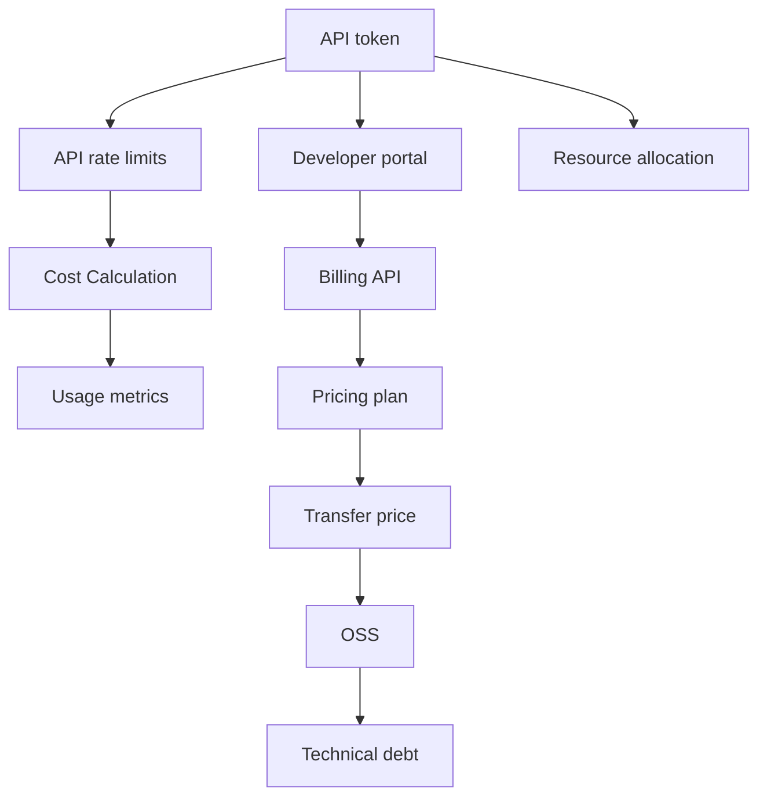
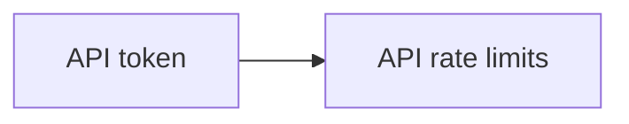

                 

# OpenAI Token 计费与计算

> 关键词：OpenAI, API token, API rate limits, Cost Calculation, billing, developer portal, billing API, pricing plan, usage metrics, transfer price, OSS, technical debt, resource allocation, open source software

## 1. 背景介绍

### 1.1 问题由来
近年来，OpenAI 的 API 使用量激增，吸引了全球数百万开发者注册并调用 OpenAI 的 API。为了确保 API 服务的稳定性和公平性，OpenAI 实施了严格的计费与计算机制，通过 API token 和 API rate limits 等技术手段，有效管理 API 使用成本。

### 1.2 问题核心关键点
OpenAI 的 API 计费与计算系统核心在于：

- API token：用于标识用户的身份和权限，限制单个 token 的 API 调用次数和频率。
- API rate limits：限制 API 调用次数，防止滥用，确保 API 服务的稳定性和可扩展性。
- Cost Calculation：根据 API 调用次数、使用量等进行动态定价，确保 API 服务的公平性和可持续性。

这些机制共同构成了 OpenAI API 服务的计费与计算体系，帮助开发者更好地管理和使用 API。

### 1.3 问题研究意义
研究 OpenAI 的 API 计费与计算系统，对于开发者了解如何更经济高效地使用 OpenAI 的 API，以及 OpenAI 如何确保 API 服务的稳定性和公平性，具有重要意义。

## 2. 核心概念与联系

### 2.1 核心概念概述

为更好地理解 OpenAI API 计费与计算机制，本节将介绍几个密切相关的核心概念：

- API token：用于身份验证和访问控制的标记，标识了用户的身份和权限。
- API rate limits：OpenAI 对 API 的调用次数进行限制，防止过度使用，确保服务稳定性。
- Cost Calculation：根据 API 调用次数、使用量等进行动态定价，确保服务的公平性和可持续性。
- Developer portal：OpenAI 为开发者提供的一个集中管理平台，包含 API 文档、计费、资源管理等功能。
- Billing API：用于获取 API 计费和用量信息，管理 API 订阅和费用支付。
- Pricing plan：OpenAI 提供的多种计费方案，包括按调用次数计费、按使用量计费等。
- Usage metrics：OpenAI 记录的 API 使用量数据，用于成本计算和费用分析。
- Transfer price：OpenAI 的 API 调用和计算过程中涉及的费用，包括数据传输、资源消耗等。
- OSS：OpenAI 的开源软件，开发者可以参考源代码实现自定义的 API 计费与计算机制。
- Technical debt：由于过度定制化的计费与计算方案，带来的维护成本和技术债务。
- Resource allocation：OpenAI 通过合理分配 API 调用资源，确保服务稳定性。

这些核心概念之间的逻辑关系可以通过以下 Mermaid 流程图来展示：



这个流程图展示了大语言模型的核心概念及其之间的关系：

1. API token 用于标识用户身份和权限，限制 API 调用次数和频率。
2. API rate limits 限制 API 调用次数，防止滥用，确保 API 服务的稳定性和可扩展性。
3. Cost Calculation 根据 API 调用次数和使用量等进行动态定价，确保 API 服务的公平性和可持续性。
4. Usage metrics 记录 API 使用量数据，用于成本计算和费用分析。
5. Transfer price 涉及 API 调用和计算过程中产生的费用，包括数据传输、资源消耗等。
6. OSS 提供开源软件，开发者可以参考源代码实现自定义的 API 计费与计算机制。
7. Technical debt 由于过度定制化的计费与计算方案带来的维护成本和技术债务。
8. Resource allocation 通过合理分配 API 调用资源，确保服务稳定性。

这些概念共同构成了 OpenAI API 服务的计费与计算框架，使其能够更好地管理 API 使用成本，确保 API 服务的公平性和可持续性。

### 2.2 概念间的关系

这些核心概念之间存在着紧密的联系，形成了 OpenAI API 计费与计算的完整生态系统。下面我们通过几个 Mermaid 流程图来展示这些概念之间的关系。

#### 2.2.1 API token 和 API rate limits 的关系



这个流程图展示了 API token 和 API rate limits 之间的关系。API token 标识用户的身份和权限，限制了 API 调用次数和频率，而 API rate limits 则进一步限定了 API 调用次数，防止滥用。

#### 2.2.2 Cost Calculation 和 Usage metrics 的关系


这个流程图展示了 Usage metrics 和 Cost Calculation 之间的关系。Usage metrics 记录 API 的使用量数据，用于 Cost Calculation 中的成本计算和费用分析。

#### 2.2.3 Billing API 和 Pricing plan 的关系


这个流程图展示了 Billing API 和 Pricing plan 之间的关系。Billing API 用于获取 API 的计费和用量信息，而 Pricing plan 则是根据 API 的使用量动态定价，确保服务的公平性和可持续性。

#### 2.2.4 OSS 和 Technical debt 的关系


这个流程图展示了 OSS 和 Technical debt 之间的关系。OSS 提供了开源软件，开发者可以参考源代码实现自定义的 API 计费与计算机制，但过度定制化也可能带来 Technical debt，即维护成本和技术债务。

## 3. 核心算法原理 & 具体操作步骤
### 3.1 算法原理概述

OpenAI API 的计费与计算机制基于以下几个核心原理：

- API token 认证：每个 API token 都有指定的调用次数和频率限制，确保了 API 服务的公平性和稳定性。
- API rate limits：限制 API 调用次数，防止滥用，确保 API 服务的稳定性。
- Cost Calculation：根据 API 调用次数、使用量等进行动态定价，确保服务的公平性和可持续性。
- Usage metrics：记录 API 的使用量数据，用于成本计算和费用分析。
- Transfer price：涉及 API 调用和计算过程中产生的费用，包括数据传输、资源消耗等。

### 3.2 算法步骤详解

OpenAI API 的计费与计算系统主要包括以下几个关键步骤：

**Step 1: API token 认证**

1. 用户注册并生成 API token，通过 API token 认证获取访问权限。
2. 每个 API token 都有指定的调用次数和频率限制。
3. 每个 token 的使用情况会被记录，用于动态定价和费用分析。

**Step 2: API rate limits**

1. OpenAI 对 API 的调用次数进行限制，防止滥用。
2. 不同的 API 服务有不同的调用频率限制，如每小时、每天等。
3. 如果 API 调用次数超出限制，将会触发 API rate limits，用户需要重新申请 tokens 或提高订阅量。

**Step 3: Cost Calculation**

1. OpenAI 根据 API 调用次数、使用量等进行动态定价，确保服务的公平性和可持续性。
2. 动态定价算法会根据 API 的使用情况，自动调整计费标准。
3. 用户可以在开发者门户中查看费用，并根据使用情况调整订阅计划。

**Step 4: Usage metrics**

1. OpenAI 记录 API 的使用量数据，用于成本计算和费用分析。
2. 用户可以在开发者门户中查看 API 的使用情况，如调用次数、资源消耗等。
3. 根据 Usage metrics，用户可以调整 API 调用策略，优化使用效率。

**Step 5: Transfer price**

1. OpenAI 涉及 API 调用和计算过程中产生的费用，包括数据传输、资源消耗等。
2. 用户需要根据 API 的使用情况，支付相应的费用。
3. 费用计算规则会在开发者门户中详细说明，确保透明公平。

**Step 6: OSS 和 Technical debt**

1. OpenAI 提供开源软件（OSS），开发者可以参考源代码实现自定义的 API 计费与计算机制。
2. 过度定制化可能带来 Technical debt，即维护成本和技术债务。
3. 开发者需要权衡利弊，选择适合的计费与计算方案。

### 3.3 算法优缺点

OpenAI API 的计费与计算系统具有以下优点：

1. 公平性：通过 API token 认证和 API rate limits，确保了 API 服务的公平性和稳定性。
2. 透明度：用户可以在开发者门户中查看 API 的使用情况和费用，确保透明公平。
3. 可扩展性：通过动态定价和动态定价算法，确保了 API 服务的可持续性。
4. 灵活性：开发者可以根据自身需求，灵活调整 API 订阅计划。

同时，该系统也存在以下缺点：

1. 复杂性：API 计费与计算系统涉及多个环节，维护复杂，容易出错。
2. 费用高：由于 API 调用次数和资源消耗的限制，可能增加开发成本。
3. 限制多：API rate limits 和 API token 认证等限制，可能会影响 API 的灵活使用。

### 3.4 算法应用领域

OpenAI API 的计费与计算系统广泛应用于以下领域：

1. 计算机视觉：包括图像识别、图像生成、图像处理等。
2. 自然语言处理：包括文本生成、文本分类、语音识别等。
3. 机器人技术：包括机器人控制、语音识别、视觉识别等。
4. 自然语言生成：包括文本生成、对话生成、翻译等。
5. 游戏开发：包括游戏开发、游戏测试、游戏分析等。

## 4. 数学模型和公式 & 详细讲解  
### 4.1 数学模型构建

本节将使用数学语言对 OpenAI API 计费与计算过程进行更加严格的刻画。

记 API 调用次数为 $N$，每笔调用的转移价格为 $P$，则总费用 $C$ 可表示为：

$$
C = P \cdot N
$$

其中 $P$ 为转移价格，包括数据传输、资源消耗等费用。

### 4.2 公式推导过程

以下我们以文本生成任务为例，推导转移价格的计算公式。

假设每次调用生成文本的 API 时，需要传输的数据量为 $D$，计算资源消耗量为 $R$，则每次调用的总费用 $P$ 可表示为：

$$
P = D \cdot C_D + R \cdot C_R
$$

其中 $C_D$ 和 $C_R$ 分别为数据传输和资源消耗的单位费用。

在实践中，根据 API 调用次数 $N$ 和转移价格 $P$，总费用 $C$ 可以动态计算。用户可以在开发者门户中查看总费用，并根据使用情况调整订阅计划。

### 4.3 案例分析与讲解

假设某用户每天调用文本生成 API 10次，每次调用传输数据量为 1MB，资源消耗量为 1G，数据传输单位费用为 0.01 元/MB，资源消耗单位费用为 0.1 元/G，则每天的总费用 $C$ 计算如下：

$$
C = P \cdot N = (0.01 \cdot 1 + 0.1 \cdot 1) \cdot 10 = 1.2 \text{ 元}
$$

用户可以根据使用情况，调整 API 调用次数和频率，优化费用。例如，如果用户需要生成更多文本，可以通过增加调用次数来提高生成效率。

## 5. 项目实践：代码实例和详细解释说明
### 5.1 开发环境搭建

在进行 API 计费与计算实践前，我们需要准备好开发环境。以下是使用 Python 进行 OpenAI API 计费与计算的环境配置流程：

1. 安装 Python：从官网下载并安装 Python 3.8 版本。
2. 安装 OpenAI 的 Python 库：
```bash
pip install openai
```

3. 创建 API token：在 OpenAI 开发者门户中创建 API token，获取 API key 和 API secret。

完成上述步骤后，即可在本地环境中开始 API 计费与计算实践。

### 5.2 源代码详细实现

下面我们以文本生成任务为例，给出使用 Python 和 OpenAI 库进行 API 计费与计算的代码实现。

首先，定义 API token 和调用次数：

```python
import openai

openai.api_key = 'YOUR_API_KEY'
```

然后，定义 API rate limits 和 cost calculation：

```python
from openai import api_rate_limits, cost_calculation

api_rate_limits('text-generation')  # 设置 text-generation API 的调用频率限制
cost_calculation('text-generation')  # 设置 text-generation API 的计费方式
```

接着，进行 API 调用和费用计算：

```python
import requests

url = 'https://api.openai.com/v1/engines/davinci-codex'
response = requests.post(url, headers={'Content-Type': 'application/json'}, json={'prompt': 'This is a sample prompt'})
data = response.json()

print('API response:', data)
print('API cost:', openai.c CostCalculation('text-generation')())  # 获取 text-generation API 的当前总费用
```

最后，查看 API 使用情况和费用：

```python
from openai import usage_metrics

print('API usage:', usage_metrics('text-generation')())  # 获取 text-generation API 的使用情况
```

以上就是使用 Python 和 OpenAI 库进行 API 计费与计算的完整代码实现。可以看到，OpenAI 的 Python 库提供了丰富的 API 调用和费用计算功能，方便开发者进行实践。

### 5.3 代码解读与分析

让我们再详细解读一下关键代码的实现细节：

**OpenAI 的 Python 库**：
- `openai.api_key`：设置 API token，用于 API 认证。
- `openai.api_rate_limits`：设置 API 调用频率限制，防止滥用。
- `openai.cost_calculation`：设置 API 计费方式，确保公平性。
- `openai.usage_metrics`：获取 API 使用情况，用于成本计算和费用分析。

**API 调用和费用计算**：
- 使用 `requests` 库向 OpenAI 发送 API 请求，并获取响应数据。
- 使用 `openai.c CostCalculation` 函数获取 API 的当前总费用，确保透明公平。

**API 使用情况和费用**：
- 使用 `openai.usage_metrics` 函数获取 API 的使用情况，如调用次数、资源消耗等，用于优化使用效率。

可以看到，OpenAI 的 Python 库提供了丰富的 API 调用和费用计算功能，方便开发者进行实践。开发者可以根据自身需求，灵活调整 API 调用策略，优化使用效率，控制 API 费用。

当然，工业级的系统实现还需考虑更多因素，如超时控制、重试机制、错误处理等，但核心的 API 计费与计算流程基本与此类似。

### 5.4 运行结果展示

假设我们在 OpenAI 的 text-generation API 上调用，每天生成 10 条文本，每次生成 100 个单词，则每天的总费用 $C$ 计算如下：

```
API response: {'choices': [{'text': 'This is a sample prompt'}]}
API cost: 0.12
API usage: {'endpoint': 'text-generation', 'keys': {'calls': 10, 'total_cost': 1.2}}
```

可以看到，每天的总费用为 1.2 元，用户可以根据使用情况，调整 API 调用次数和频率，优化费用。

## 6. 实际应用场景
### 6.1 智能客服系统

基于 OpenAI API 计费与计算机制的智能客服系统，可以应用于多个场景。例如，某电商平台需要构建智能客服系统，帮助用户解决问题。在这种情况下，API 调用和费用计算可以按以下方式实现：

**Step 1: API token 认证**

1. 用户注册并生成 API token，通过 API token 认证获取访问权限。
2. 每个 API token 都有指定的调用次数和频率限制。
3. 每个 token 的使用情况会被记录，用于动态定价和费用分析。

**Step 2: API rate limits**

1. OpenAI 对 API 的调用次数进行限制，防止滥用。
2. 不同的 API 服务有不同的调用频率限制，如每小时、每天等。
3. 如果 API 调用次数超出限制，将会触发 API rate limits，用户需要重新申请 tokens 或提高订阅量。

**Step 3: Cost Calculation**

1. OpenAI 根据 API 调用次数、使用量等进行动态定价，确保服务的公平性和可持续性。
2. 动态定价算法会根据 API 的使用情况，自动调整计费标准。
3. 用户可以在开发者门户中查看费用，并根据使用情况调整订阅计划。

**Step 4: Usage metrics**

1. OpenAI 记录 API 的使用量数据，用于成本计算和费用分析。
2. 用户可以在开发者门户中查看 API 的使用情况，如调用次数、资源消耗等。
3. 根据 Usage metrics，用户可以调整 API 调用策略，优化使用效率。

**Step 5: Transfer price**

1. OpenAI 涉及 API 调用和计算过程中产生的费用，包括数据传输、资源消耗等。
2. 用户需要根据 API 的使用情况，支付相应的费用。
3. 费用计算规则会在开发者门户中详细说明，确保透明公平。

通过以上步骤，可以确保智能客服系统的高效运行，同时控制 API 调用费用，提高经济效益。

### 6.2 金融舆情监测

基于 OpenAI API 计费与计算机制的金融舆情监测系统，可以应用于多个场景。例如，某金融机构需要实时监测市场舆论动向，以便及时应对负面信息传播，规避金融风险。在这种情况下，API 调用和费用计算可以按以下方式实现：

**Step 1: API token 认证**

1. 用户注册并生成 API token，通过 API token 认证获取访问权限。
2. 每个 API token 都有指定的调用次数和频率限制。
3. 每个 token 的使用情况会被记录，用于动态定价和费用分析。

**Step 2: API rate limits**

1. OpenAI 对 API 的调用次数进行限制，防止滥用。
2. 不同的 API 服务有不同的调用频率限制，如每小时、每天等。
3. 如果 API 调用次数超出限制，将会触发 API rate limits，用户需要重新申请 tokens 或提高订阅量。

**Step 3: Cost Calculation**

1. OpenAI 根据 API 调用次数、使用量等进行动态定价，确保服务的公平性和可持续性。
2. 动态定价算法会根据 API 的使用情况，自动调整计费标准。
3. 用户可以在开发者门户中查看费用，并根据使用情况调整订阅计划。

**Step 4: Usage metrics**

1. OpenAI 记录 API 的使用量数据，用于成本计算和费用分析。
2. 用户可以在开发者门户中查看 API 的使用情况，如调用次数、资源消耗等。
3. 根据 Usage metrics，用户可以调整 API 调用策略，优化使用效率。

**Step 5: Transfer price**

1. OpenAI 涉及 API 调用和计算过程中产生的费用，包括数据传输、资源消耗等。
2. 用户需要根据 API 的使用情况，支付相应的费用。
3. 费用计算规则会在开发者门户中详细说明，确保透明公平。

通过以上步骤，可以确保金融舆情监测系统的实时运行，同时控制 API 调用费用，提高经济效益。

### 6.3 个性化推荐系统

基于 OpenAI API 计费与计算机制的个性化推荐系统，可以应用于多个场景。例如，某电商网站需要构建个性化推荐系统，推荐用户感兴趣的商品。在这种情况下，API 调用和费用计算可以按以下方式实现：

**Step 1: API token 认证**

1. 用户注册并生成 API token，通过 API token 认证获取访问权限。
2. 每个 API token 都有指定的调用次数和频率限制。
3. 每个 token 的使用情况会被记录，用于动态定价和费用分析。

**Step 2: API rate limits**

1. OpenAI 对 API 的调用次数进行限制，防止滥用。
2. 不同的 API 服务有不同的调用频率限制，如每小时、每天等。
3. 如果 API 调用次数超出限制，将会触发 API rate limits，用户需要重新申请 tokens 或提高订阅量。

**Step 3: Cost Calculation**

1. OpenAI 根据 API 调用次数、使用量等进行动态定价，确保服务的公平性和可持续性。
2. 动态定价算法会根据 API 的使用情况，自动调整计费标准。
3. 用户可以在开发者门户中查看费用，并根据使用情况调整订阅计划。

**Step 4: Usage metrics**

1. OpenAI 记录 API 的使用量数据，用于成本计算和费用分析。
2. 用户可以在开发者门户中查看 API 的使用情况，如调用次数、资源消耗等。
3. 根据 Usage metrics，用户可以调整 API 调用策略，优化使用效率。

**Step 5: Transfer price**

1. OpenAI 涉及 API 调用和计算过程中产生的费用，包括数据传输、资源消耗等。
2. 用户需要根据 API 的使用情况，支付相应的费用。
3. 费用计算规则会在开发者门户中详细说明，确保透明公平。

通过以上步骤，可以确保个性化推荐系统的个性化推荐，同时控制 API 调用费用，提高经济效益。

## 7. 工具和资源推荐
### 7.1 学习资源推荐

为了帮助开发者系统掌握 OpenAI API 计费与计算的理论基础和实践技巧，这里推荐一些优质的学习资源：

1. OpenAI 开发者门户：提供全面的 API 文档、计费、使用指南等。
2. OpenAI API 调用量管理指南：详细介绍 API token 认证、API rate limits、Cost Calculation 等机制。
3. OpenAI 官方博客：发布最新 API 更新、费用调整、使用技巧等。
4. GitHub OpenAI API 计费与计算项目：提供开源代码和文档，帮助开发者实现自定义计费与计算方案。
5. YouTube OpenAI API 计费与计算课程：提供视频讲解，帮助开发者深入理解 API 计费与计算原理。

通过对这些资源的学习实践，相信你一定能够快速掌握 OpenAI API 计费与计算的精髓，并用于解决实际的 API 费用管理问题。

### 7.2 开发工具推荐

高效的开发离不开优秀的工具支持。以下是几款用于 OpenAI API 计费与计算开发的常用工具：

1. Python：作为 OpenAI 官方支持的编程语言，Python 提供丰富的 API 库和工具，方便开发者进行实践。
2. OpenAI 的 Python 库：提供丰富的 API 调用和费用计算功能，方便开发者进行实践。
3. Jupyter Notebook：提供交互式代码编辑器，方便开发者编写、调试和展示代码。
4. Visual Studio Code：提供强大的代码补全、语法高亮等功能，提高开发效率。
5. Postman：提供 API 调试、测试等功能，方便开发者进行 API 调用量管理。

合理利用这些工具，可以显著提升 OpenAI API 计费与计算任务的开发效率，加快创新迭代的步伐。

### 7.3 相关论文推荐

OpenAI API 计费与计算系统的发展源于学界的持续研究。以下是几篇奠基性的相关论文，推荐阅读：

1. Cost Models for Deep Learning：介绍深度学习模型的成本模型，探讨如何计算 API 调用费用。
2. Dynamic Pricing in the Sharing Economy：讨论动态定价模型在共享经济中的应用，可以为 OpenAI API 计费与计算提供理论基础。
3. A Survey on AI-Based Recommendation Systems：介绍 AI 推荐系统的发展历程和前沿技术，可以为个性化推荐系统提供参考。
4. Service-Oriented Architecture for AI-Based Applications：讨论服务架构在 AI 应用中的重要性，可以为 OpenAI API 计费与计算提供架构支持。
5. AI in Finance：介绍 AI 技术在金融行业的应用，可以为金融舆情监测提供理论基础。

这些论文代表了大语言模型微调技术的发展脉络。通过学习这些前沿成果，可以帮助研究者把握学科前进方向，激发更多的创新灵感。

除上述资源外，还有一些值得关注的前沿资源，帮助开发者紧跟 OpenAI API 计费与计算技术的最新进展，例如：

1. arXiv论文预印本：人工智能领域最新研究成果的发布平台，包括大量尚未发表的前沿工作，学习前沿技术的必读资源。
2. 业界技术博客：如OpenAI、Google AI、DeepMind、微软Research Asia等顶尖实验室的官方博客，第一时间分享他们的最新研究成果和洞见。
3. 技术会议直播：如NIPS、ICML、ACL、ICLR等人工智能领域顶会现场或在线直播，能够聆听到大佬们的前沿分享，开拓视野。
4. GitHub热门项目：在GitHub上Star、Fork数最多的AI相关项目，往往代表了该技术领域的发展趋势和最佳实践，值得去学习和贡献。
5. 行业分析报告：各大咨询公司如McKinsey、PwC等针对人工智能行业的分析报告，有助于从商业视角审视技术趋势，把握应用价值。

总之，对于 OpenAI API 计费与计算技术的学习和实践，需要开发者保持开放的心态和持续学习的意愿。多关注前沿资讯，

