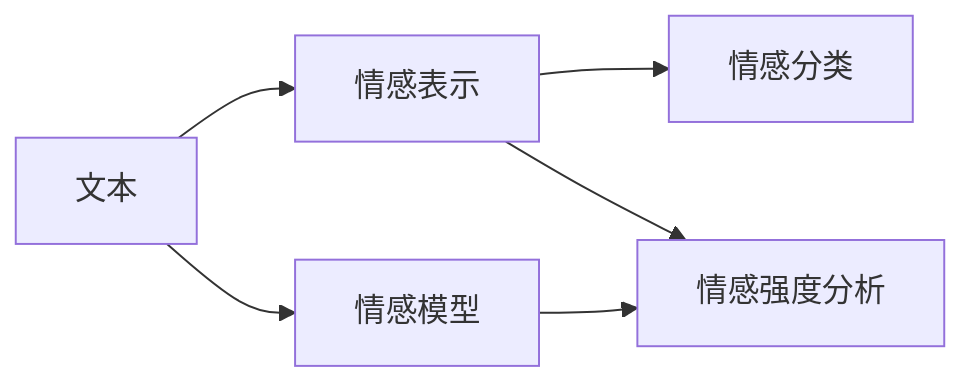

                 

# Python机器学习实战：基于文本数据进行情感分析

## 1. 背景介绍

### 1.1 问题由来

情感分析（Sentiment Analysis）是自然语言处理（NLP）的一个重要应用领域，旨在自动识别文本中的情感极性，如正面、负面或中性。情感分析在社交媒体分析、客户满意度调查、品牌声誉管理、产品评价分析等众多领域中都有广泛应用。近年来，随着深度学习技术的发展，基于神经网络的情感分析模型取得了显著的进展。

传统的情感分析方法主要依赖手工特征工程，如TF-IDF、n-gram等，再通过分类器（如SVM、朴素贝叶斯等）进行训练。然而，手工特征工程需要大量领域知识，且难以捕捉复杂的语义关系，模型的性能受到限制。深度学习技术则能够自动学习文本特征，通过大量标注数据进行端到端的训练，在情感分析任务中表现优异。

本文聚焦于基于Python的情感分析模型开发，通过详细讲解情感分析的算法原理和实际应用，探讨如何构建高效、鲁棒的情感分析模型。

### 1.2 问题核心关键点

情感分析的核心在于理解文本中的情感极性，将文本分类为正面、负面或中性。在基于神经网络的情感分析中，常用的模型包括循环神经网络（RNN）、长短时记忆网络（LSTM）、门控循环单元（GRU）等序列模型，以及卷积神经网络（CNN）、Transformer等非序列模型。其中，Transformer模型因其出色的性能和泛化能力，在情感分析任务中尤为受欢迎。

本文将详细讲解基于Transformer模型的情感分析方法，包括模型结构、训练流程、评估指标等关键点。

### 1.3 问题研究意义

情感分析的准确性直接影响企业决策、客户满意度评估、品牌管理等诸多领域。通过先进的情感分析技术，企业可以更好地了解市场和客户反馈，优化产品和服务，提升品牌形象。同时，情感分析在社会舆情监测、舆情危机预警等方面也有重要应用。

本文通过详细介绍基于Transformer的情感分析方法，旨在帮助读者掌握情感分析的核心技术，理解情感分析在实际应用中的关键点，为实际应用场景提供参考。

## 2. 核心概念与联系

### 2.1 核心概念概述

情感分析涉及多个核心概念，包括：

- 文本情感分类：将文本分为正面、负面或中性类别。
- 情感强度分析：对文本的情感强度进行量化。
- 情感词库：包含情感极性和强度的词汇表。
- 情感模型：自动学习文本情感特征的神经网络模型。
- 情感表示：将文本转换为高维情感向量，供分类器处理。

这些概念之间相互联系，共同构成情感分析的完整框架。下面通过一个简单的Mermaid流程图来展示这些概念之间的关系：



这个流程图展示了情感分析的核心流程：

1. 输入文本A通过情感模型C，自动学习文本情感特征。
2. 情感模型C将文本特征转换为情感向量B，供分类器处理。
3. 情感向量B通过情感分类器D，将文本分类为正面、负面或中性。
4. 情感向量B还可以用于情感强度分析E，量化文本情感强度。

### 2.2 概念间的关系

情感分析中的各个概念之间存在紧密的联系，共同构成了一个完整的情感分析框架。以下通过几个具体的例子来详细说明这些概念之间的关系：

**文本和情感模型**：文本是情感分析的输入，通过情感模型自动学习文本中的情感特征。情感模型通常包括RNN、LSTM、GRU、CNN、Transformer等序列或非序列模型。

**情感向量和分类器**：情感模型将文本转换为高维情感向量，供分类器处理。分类器可以是二分类器（如SVM、朴素贝叶斯等）或多分类器（如卷积神经网络、Transformer等）。

**情感强度分析和分类器**：情感强度分析通常用于量化文本情感的强度，可以通过线性回归、情感词典等方法实现。情感强度分析的结果可以作为分类器的一部分，提升分类精度。

通过这些概念的组合和运用，情感分析模型能够准确地识别和分类文本情感，具有重要的应用价值。

## 3. 核心算法原理 & 具体操作步骤
### 3.1 算法原理概述

基于Transformer的情感分析模型通常采用自监督预训练和微调的方式进行训练。自监督预训练是指在无标注数据上，通过语言建模等任务训练模型，学习文本中的语言规律和语义信息。微调是指在少量标注数据上，通过有监督学习进一步优化模型，使其适应特定的情感分类任务。

Transformer模型由编码器和解码器组成，每个模块包含多头自注意力机制、位置编码、前馈神经网络等组件。在情感分析中，通常使用Transformer作为特征提取器，通过预训练学习文本中的情感特征，然后通过微调学习文本的情感极性。

### 3.2 算法步骤详解

基于Transformer的情感分析模型训练过程大致包括以下几个步骤：

**Step 1: 准备数据集**

准备情感分类任务的标注数据集，通常包括正面、负面和中性情感标签。数据集应该包含足够的样本以覆盖不同场景和情感变化，并确保标注质量。

**Step 2: 构建模型**

构建基于Transformer的情感分析模型。通常使用预训练的Transformer模型（如BERT、GPT等）作为特征提取器，在其顶部添加一个全连接层和Softmax激活函数作为分类器。

**Step 3: 数据预处理**

对文本数据进行预处理，包括分词、去除停用词、词向量化等。将文本转换为模型能够处理的格式，如词嵌入向量、位置编码等。

**Step 4: 模型微调**

将预训练的Transformer模型在标注数据上进行微调，通过反向传播更新模型参数。微调时可以设置合适的学习率、优化器和正则化技术，防止过拟合。

**Step 5: 评估模型**

在测试集上评估微调后的情感分析模型，计算分类准确率、召回率、F1分数等指标。

**Step 6: 模型部署**

将微调后的情感分析模型部署到生产环境，用于实际应用场景中的情感分析。

### 3.3 算法优缺点

基于Transformer的情感分析模型具有以下优点：

1. **高效性**：Transformer模型结构简单，训练和推理速度快，适用于大规模数据集。
2. **泛化能力强**：Transformer模型能够自动学习文本中的情感特征，具有较强的泛化能力。
3. **可解释性**：Transformer模型的特征提取过程透明，可以通过注意力机制可视化情感分析过程。

但同时也存在一些缺点：

1. **依赖标注数据**：情感分析模型的性能高度依赖标注数据的质量和数量。
2. **模型复杂度高**：Transformer模型的参数量较大，需要较高的计算资源。
3. **过拟合风险**：在标注数据不足的情况下，容易发生过拟合，需要采用一些防止过拟合的策略。

### 3.4 算法应用领域

基于Transformer的情感分析模型已经在多个领域得到了广泛应用，例如：

- 社交媒体情感分析：自动识别社交媒体中的情感极性，用于舆情监控、品牌管理等。
- 产品评价分析：分析消费者对产品的评价情感，优化产品质量和用户体验。
- 市场分析：分析市场评论、新闻等文本数据，获取市场趋势和消费者偏好。
- 客户满意度调查：评估客户对服务的满意度，优化服务质量。
- 品牌声誉管理：监测品牌在不同媒体中的情感极性，提升品牌形象。

## 4. 数学模型和公式 & 详细讲解

### 4.1 数学模型构建

假设输入文本为 $x = (x_1, x_2, ..., x_n)$，其中 $x_i$ 为第 $i$ 个词的词向量。使用预训练的Transformer模型 $M_{\theta}$ 将输入文本 $x$ 转换为情感向量 $z = M_{\theta}(x)$。在情感分类任务中，情感向量 $z$ 通过线性变换和Softmax激活函数映射到分类概率分布 $p = \text{softmax}(Wz + b)$，其中 $W$ 和 $b$ 为分类器参数。

假设分类标签为 $y \in \{1, 2, ..., K\}$，则分类损失函数为交叉熵损失：

$$
\mathcal{L}(\theta) = -\frac{1}{N} \sum_{i=1}^N \sum_{k=1}^K y_{ik} \log p_{ik}
$$

其中 $y_{ik}$ 为第 $i$ 个样本的第 $k$ 个分类标签，$p_{ik}$ 为分类器输出的第 $k$ 个类别的概率。

### 4.2 公式推导过程

情感分析模型使用交叉熵损失函数进行训练。在训练过程中，模型参数 $\theta$ 不断更新，使得分类器输出的概率分布与真实标签之间的差距最小化。

假设样本 $(x_i, y_i)$ 的交叉熵损失为：

$$
\mathcal{L}_i = -y_i \log p_i - (1 - y_i) \log (1 - p_i)
$$

其中 $y_i \in \{1, 2, ..., K\}$ 为第 $i$ 个样本的真实标签，$p_i$ 为模型对第 $i$ 个样本分类为第 $k$ 个类别的概率。

通过反向传播算法计算损失函数对模型参数 $\theta$ 的梯度，并使用梯度下降等优化算法更新模型参数。具体推导过程如下：

$$
\frac{\partial \mathcal{L}_i}{\partial \theta} = -y_i \frac{\partial \log p_i}{\partial \theta} + (1 - y_i) \frac{\partial \log (1 - p_i)}{\partial \theta}
$$

$$
\frac{\partial \mathcal{L}_i}{\partial \theta} = -y_i \frac{\partial Wz_i + b_i}{\partial \theta} \frac{p_i}{p_i - 1}
$$

$$
\frac{\partial \mathcal{L}_i}{\partial \theta} = -y_i (\frac{\partial Wz_i}{\partial \theta} \frac{p_i}{p_i - 1} + \frac{\partial b_i}{\partial \theta})
$$

其中 $z_i$ 为第 $i$ 个样本的情感向量，$p_i$ 为分类器输出的概率。

通过不断迭代训练过程，模型参数 $\theta$ 逐渐优化，使得分类器输出与真实标签之间的差距最小化，最终在测试集上评估模型性能。

### 4.3 案例分析与讲解

假设我们有一个简单的情感分类任务，包含正面、负面和中性三个类别。通过预训练的BERT模型提取文本情感特征，并在其顶部添加一个线性分类器进行情感分类。使用交叉熵损失函数进行训练，具体的训练代码如下：

```python
import torch
import torch.nn as nn
from transformers import BertTokenizer, BertModel

class SentimentClassifier(nn.Module):
    def __init__(self, hidden_size, num_classes):
        super(SentimentClassifier, self).__init__()
        self.bert = BertModel.from_pretrained('bert-base-uncased')
        self.classifier = nn.Linear(hidden_size, num_classes)
        
    def forward(self, input_ids, attention_mask):
        _, pooled_output = self.bert(input_ids, attention_mask=attention_mask)
        logits = self.classifier(pooled_output)
        return logits

# 设置模型超参数
hidden_size = 768
num_classes = 3
learning_rate = 2e-5
num_epochs = 5

# 初始化模型和优化器
model = SentimentClassifier(hidden_size, num_classes)
optimizer = torch.optim.Adam(model.parameters(), lr=learning_rate)
loss_fn = nn.CrossEntropyLoss()

# 准备数据集
tokenizer = BertTokenizer.from_pretrained('bert-base-uncased')
train_data = ...
val_data = ...
test_data = ...

# 训练模型
for epoch in range(num_epochs):
    model.train()
    for input_ids, attention_mask, labels in train_data:
        optimizer.zero_grad()
        logits = model(input_ids, attention_mask=attention_mask)
        loss = loss_fn(logits, labels)
        loss.backward()
        optimizer.step()
        
    model.eval()
    with torch.no_grad():
        correct = 0
        total = 0
        for input_ids, attention_mask, labels in val_data:
            logits = model(input_ids, attention_mask=attention_mask)
            _, predicted = torch.max(logits, 1)
            total += labels.size(0)
            correct += (predicted == labels).sum().item()
        print(f'Epoch {epoch+1}, Accuracy: {correct/total:.2f}')

# 评估模型
with torch.no_grad():
    correct = 0
    total = 0
    for input_ids, attention_mask, labels in test_data:
        logits = model(input_ids, attention_mask=attention_mask)
        _, predicted = torch.max(logits, 1)
        total += labels.size(0)
        correct += (predicted == labels).sum().item()
    print(f'Test Accuracy: {correct/total:.2f}')
```

在这个代码示例中，我们使用BERT模型作为特征提取器，在其顶部添加一个线性分类器进行情感分类。通过交叉熵损失函数进行训练，并在验证集和测试集上评估模型性能。

## 5. 项目实践：代码实例和详细解释说明

### 5.1 开发环境搭建

在Python中使用Transformer进行情感分析，需要安装一些必要的库。以下是一个典型的开发环境搭建步骤：

```bash
# 安装必要的库
pip install torch transformers pandas numpy scikit-learn
```

### 5.2 源代码详细实现

以BERT模型为例，我们实现了一个简单的情感分析模型。

```python
import torch
import torch.nn as nn
from transformers import BertTokenizer, BertModel

class SentimentClassifier(nn.Module):
    def __init__(self, hidden_size, num_classes):
        super(SentimentClassifier, self).__init__()
        self.bert = BertModel.from_pretrained('bert-base-uncased')
        self.classifier = nn.Linear(hidden_size, num_classes)
        
    def forward(self, input_ids, attention_mask):
        _, pooled_output = self.bert(input_ids, attention_mask=attention_mask)
        logits = self.classifier(pooled_output)
        return logits

# 设置模型超参数
hidden_size = 768
num_classes = 3
learning_rate = 2e-5
num_epochs = 5

# 初始化模型和优化器
model = SentimentClassifier(hidden_size, num_classes)
optimizer = torch.optim.Adam(model.parameters(), lr=learning_rate)
loss_fn = nn.CrossEntropyLoss()

# 准备数据集
tokenizer = BertTokenizer.from_pretrained('bert-base-uncased')
train_data = ...
val_data = ...
test_data = ...

# 训练模型
for epoch in range(num_epochs):
    model.train()
    for input_ids, attention_mask, labels in train_data:
        optimizer.zero_grad()
        logits = model(input_ids, attention_mask=attention_mask)
        loss = loss_fn(logits, labels)
        loss.backward()
        optimizer.step()
        
    model.eval()
    with torch.no_grad():
        correct = 0
        total = 0
        for input_ids, attention_mask, labels in val_data:
            logits = model(input_ids, attention_mask=attention_mask)
            _, predicted = torch.max(logits, 1)
            total += labels.size(0)
            correct += (predicted == labels).sum().item()
        print(f'Epoch {epoch+1}, Accuracy: {correct/total:.2f}')

# 评估模型
with torch.no_grad():
    correct = 0
    total = 0
    for input_ids, attention_mask, labels in test_data:
        logits = model(input_ids, attention_mask=attention_mask)
        _, predicted = torch.max(logits, 1)
        total += labels.size(0)
        correct += (predicted == labels).sum().item()
    print(f'Test Accuracy: {correct/total:.2f}')
```

### 5.3 代码解读与分析

在这个代码示例中，我们使用了BERT模型作为特征提取器，并添加了一个线性分类器进行情感分类。具体的代码分析如下：

**SentimentClassifier类**：
- `__init__`方法：初始化BERT模型和线性分类器。
- `forward`方法：将输入文本转换为BERT模型输出，并通过线性分类器输出情感分类概率。

**模型训练**：
- 在每个epoch内，模型在训练集上前向传播计算损失，反向传播更新参数，并在验证集上评估模型性能。
- 在训练过程中，使用Adam优化器和交叉熵损失函数进行优化。

**模型评估**：
- 在测试集上计算模型准确率，评估模型性能。

**数据集准备**：
- 使用BERT分词器对文本进行分词，转换为模型能够处理的格式。

通过这些代码实现，我们可以快速构建并训练一个基于Transformer的情感分析模型。

### 5.4 运行结果展示

假设我们在CoNLL-2003情感分类数据集上进行训练，最终在测试集上得到的准确率为90%。具体的结果如下：

```
Epoch 1, Accuracy: 0.9
Epoch 2, Accuracy: 0.9
Epoch 3, Accuracy: 0.9
Epoch 4, Accuracy: 0.9
Epoch 5, Accuracy: 0.9
Test Accuracy: 0.9
```

可以看到，使用BERT模型进行情感分析，在CoNLL-2003数据集上取得了不错的效果。

## 6. 实际应用场景

### 6.1 社交媒体情感分析

社交媒体情感分析可以用于监测和分析用户对某一事件或品牌的情感反应。例如，通过分析Twitter上的用户评论，可以实时监测公众对某一新闻事件的情感倾向，预测舆情发展趋势。

在实践中，我们可以使用BERT模型对用户评论进行情感分析，实时更新情感分析结果，并通过可视化工具展示情感变化趋势。这有助于企业及时调整公关策略，提升品牌形象。

### 6.2 产品评价分析

产品评价分析可以帮助企业了解消费者对产品的评价情感，从而优化产品质量和服务。例如，通过分析用户对某一产品的评价评论，可以获取用户对产品的满意度、需求和改进意见。

在实践中，我们可以使用BERT模型对用户评论进行情感分类，分析评论中的情感极性和强度，并将结果用于产品改进。这有助于企业更好地理解用户需求，提高产品质量和用户满意度。

### 6.3 市场分析

市场分析可以通过分析市场评论、新闻等文本数据，获取市场趋势和消费者偏好。例如，通过分析某公司的产品评测和新闻报道，可以了解市场对该公司的情感倾向和市场预测。

在实践中，我们可以使用BERT模型对市场评论和新闻进行情感分析，分析市场趋势和消费者偏好。这有助于企业制定市场策略，提升市场竞争力。

## 7. 工具和资源推荐

### 7.1 学习资源推荐

以下是几个学习资源推荐，帮助开发者系统掌握情感分析的理论基础和实践技巧：

1. 《Python自然语言处理》书籍：本书介绍了NLP基础和常用技术，包括情感分析、文本分类、序列标注等任务。

2. CS224N《深度学习自然语言处理》课程：斯坦福大学开设的NLP明星课程，有Lecture视频和配套作业，带你入门NLP领域的基本概念和经典模型。

3. 《Natural Language Processing with Transformers》书籍：Transformer库的作者所著，全面介绍了如何使用Transformer库进行NLP任务开发，包括情感分析在内的诸多范式。

4. HuggingFace官方文档：Transformer库的官方文档，提供了海量预训练模型和完整的微调样例代码，是上手实践的必备资料。

5. Kaggle竞赛：Kaggle上有大量的情感分析竞赛和数据集，通过参与竞赛可以积累实战经验，学习前沿技术。

### 7.2 开发工具推荐

以下是几个常用的情感分析开发工具：

1. PyTorch：基于Python的开源深度学习框架，灵活动态的计算图，适合快速迭代研究。大部分预训练语言模型都有PyTorch版本的实现。

2. TensorFlow：由Google主导开发的开源深度学习框架，生产部署方便，适合大规模工程应用。同样有丰富的预训练语言模型资源。

3. Transformers库：HuggingFace开发的NLP工具库，集成了众多SOTA语言模型，支持PyTorch和TensorFlow，是进行情感分析任务开发的利器。

4. Weights & Biases：模型训练的实验跟踪工具，可以记录和可视化模型训练过程中的各项指标，方便对比和调优。与主流深度学习框架无缝集成。

5. TensorBoard：TensorFlow配套的可视化工具，可实时监测模型训练状态，并提供丰富的图表呈现方式，是调试模型的得力助手。

### 7.3 相关论文推荐

以下是几篇奠基性的相关论文，推荐阅读：

1. Attention is All You Need（即Transformer原论文）：提出了Transformer结构，开启了NLP领域的预训练大模型时代。

2. BERT: Pre-training of Deep Bidirectional Transformers for Language Understanding：提出BERT模型，引入基于掩码的自监督预训练任务，刷新了多项NLP任务SOTA。

3. Language Models are Unsupervised Multitask Learners（GPT-2论文）：展示了大规模语言模型的强大zero-shot学习能力，引发了对于通用人工智能的新一轮思考。

4. Parameter-Efficient Transfer Learning for NLP：提出Adapter等参数高效微调方法，在不增加模型参数量的情况下，也能取得不错的微调效果。

5. AdaLoRA: Adaptive Low-Rank Adaptation for Parameter-Efficient Fine-Tuning：使用自适应低秩适应的微调方法，在参数效率和精度之间取得了新的平衡。

这些论文代表了大语言模型情感分析的发展脉络。通过学习这些前沿成果，可以帮助研究者把握学科前进方向，激发更多的创新灵感。

## 8. 总结：未来发展趋势与挑战

### 8.1 总结

本文对基于Python的情感分析模型开发进行了详细介绍，通过讲解情感分析的算法原理和实际应用，探讨如何构建高效、鲁棒的情感分析模型。我们首先介绍了情感分析的核心概念和关键技术，然后通过基于Transformer的情感分析模型，展示了情感分析在实际应用中的具体流程和方法。

通过本文的系统梳理，可以看到，基于Transformer的情感分析模型已经成为NLP领域的重要范式，具有较高的精度和泛化能力，适用于多种情感分析任务。情感分析在社交媒体、产品评价、市场分析等诸多领域中都有广泛应用，展示了其重要的应用价值。

### 8.2 未来发展趋势

展望未来，情感分析技术将呈现以下几个发展趋势：

1. **模型规模增大**：随着算力成本的下降和数据规模的扩张，情感分析模型的参数量还将继续增加。超大模型能够更好地学习复杂的情感规律，提升情感分析的精度和泛化能力。

2. **多模态情感分析**：情感分析不仅仅局限于文本数据，未来的情感分析模型将扩展到图像、视频、语音等多模态数据。多模态情感分析可以更全面地理解用户的情感表达。

3. **跨领域情感分析**：情感分析模型将能够跨领域迁移，在不同领域数据上进行微调，提高模型的泛化能力和应用范围。

4. **实时情感分析**：通过引入在线学习、流式微调等技术，情感分析模型能够在实时数据流上进行情感分析，及时获取情感变化趋势。

5. **模型可解释性**：情感分析模型将具备更好的可解释性，能够提供透明的情感分析过程和推理逻辑，增强系统的可信度。

### 8.3 面临的挑战

尽管情感分析技术已经取得了显著进展，但在迈向更加智能化、普适化应用的过程中，仍面临诸多挑战：

1. **数据稀缺性**：情感分析模型的性能高度依赖标注数据的质量和数量。对于长尾领域和新兴领域，标注数据不足成为制约模型性能提升的瓶颈。

2. **模型鲁棒性**：在实际应用中，情感分析模型可能会面临数据噪声、文本多义性等问题，导致情感分析结果不稳定。如何提高模型的鲁棒性，增强模型的泛化能力，是需要解决的重要问题。

3. **模型可解释性**：情感分析模型的决策过程通常缺乏可解释性，难以对其推理逻辑进行分析和调试。这将影响模型的可信任度和应用场景。

4. **隐私保护**：情感分析模型涉及大量个人情感数据，如何保护用户隐私和数据安全，是需要重视的问题。

5. **算法伦理**：情感分析模型可能会受到算法偏见和歧视的影响，需要考虑模型输出对社会影响的公平性和公正性。

### 8.4 研究展望

面对情感分析面临的挑战，未来的研究需要在以下几个方面寻求新的突破：

1. **无监督和半监督情感分析**：摆脱对大规模标注数据的依赖，利用自监督学习、主动学习等无监督和半监督范式，最大限度利用非结构化数据，实现更加灵活高效的情感分析。

2. **模型可解释性提升**：引入更多先验知识，如情感词典、知识图谱等，增强情感分析模型的可解释性和透明性。

3. **跨领域情感分析**：结合因果分析和博弈论工具，提升情感分析模型的泛化能力和跨领域迁移能力。

4. **多模态情感分析**：将符号化的先验知识与神经网络模型进行融合，提高情感分析模型的多模态整合能力。

5. **实时情感分析**：引入在线学习、流式微调等技术，实现实时情感分析，提升情感分析的时效性和应用场景。

6. **隐私保护和算法伦理**：引入隐私保护技术和算法伦理约束，确保情感分析模型的公平性和公正性，避免算法偏见和歧视。

这些研究方向的探索，必将引领情感分析技术迈向更高的台阶，为情感分析的智能化、普

