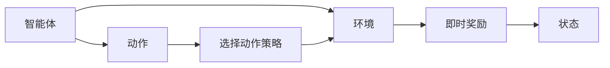

                 

# Q-学习(Q-Learning) - 原理与代码实例讲解

> 关键词：Q-Learning, 强化学习, 环境, 动作, 状态, 策略, 奖励, 近似Q函数, 梯度下降, 代码实例, 收敛性

## 1. 背景介绍

### 1.1 问题由来
在智能体(Agent)与环境(Environment)交互的过程中，强化学习(Reinforcement Learning, RL)算法让智能体通过不断的试错和学习，最大化长期累积奖励(total reward)。其中，Q-Learning作为强化学习中一种常用的模型免费，理论基础扎实且方法简单的算法，得到了广泛的应用。无论是游戏智能体设计、机器人路径规划，还是自动驾驶策略优化，Q-Learning都能提供强大的解决方案。

然而，在实际应用中，Q-Learning也面临一些挑战：
- 状态空间过大的问题，直接应用Q-Learning算法会导致计算复杂度呈指数级增长。
- 环境的未知性和不确定性，导致传统Q-Learning无法学习最优策略。
- 过度拟合的问题，学习率设置不当易导致智能体陷入局部最优解。

为了应对上述问题，近年来，针对Q-Learning的改进算法，如Deep Q-Networks (DQN)、Double Q-Learning、Dueling Q-Networks等，不断涌现。同时，基于Q-Learning的算法思想，还发展出了一系列相关的强化学习算法，如AlphaGo中的蒙特卡洛树搜索(MCTS)，以及由Q-Learning演变的策略优化算法，如PPO、A2C等。

### 1.2 问题核心关键点
Q-Learning是一种模型免费，理论基础扎实且方法简单的强化学习算法。其核心思想是：通过不断与环境交互，在每个时刻选择最优动作策略，最大化长期累积奖励。

Q-Learning的核心公式为：
$$
Q(s,a) \leftarrow Q(s,a) + \alpha(r + \gamma \max Q(s',a') - Q(s,a))
$$
其中：
- $Q(s,a)$ 表示在状态 $s$ 下采取动作 $a$ 的Q值，即从状态 $s$ 出发，采取动作 $a$，最终获得期望累积奖励的估计值。
- $\alpha$ 表示学习率，用于平衡当前Q值和新Q值之间的差异。
- $r$ 表示采取动作 $a$ 后获得的即时奖励。
- $\gamma$ 表示折扣因子，用于控制未来奖励的权重。
- $s'$ 和 $a'$ 分别表示下一个状态和在该状态下选择的最优动作。

Q-Learning的目标是找到最优Q值，即最大化的Q值，通过迭代公式不断更新Q值，使得Q值最终逼近最优值。

## 2. 核心概念与联系

### 2.1 核心概念概述

为更好地理解Q-Learning算法，本节将介绍几个密切相关的核心概念：

- 强化学习(Reinforcement Learning, RL)：智能体通过与环境交互，不断优化其行为策略，以最大化长期累积奖励的过程。
- Q值(Q-value)：在状态 $s$ 下采取动作 $a$ 的累积奖励的估计值。
- 动作策略(Policy)：智能体在每个状态下选择动作的概率分布，通常表示为 $\pi(s)$。
- 即时奖励(Reward)：智能体采取动作 $a$ 后，环境给予的即时反馈，用于衡量该动作的好坏。
- 折扣因子(Gamma)：用于控制未来奖励的重要性，一般取值在0.9到0.99之间。

这些概念之间的逻辑关系可以通过以下Mermaid流程图来展示：

```mermaid
graph LR
    A[状态(s)] --> B[动作(a)]
    B --> C[即时奖励(r)]
    C --> D[下一个状态(s')]
    A --> E[策略(Policy)]
    E --> F[选择动作(a')]
    A --> G[Q值(Q-value)]
    G --> H[更新Q值]
```

这个流程图展示了一系列与Q-Learning相关的重要概念及其关系：

1. 智能体在每个状态下选择一个动作，并执行该动作。
2. 动作执行后，环境给予即时奖励。
3. 智能体根据即时奖励和下一个状态，更新Q值。
4. 智能体根据策略选择一个动作。
5. Q值不断迭代更新，直到收敛于最优值。

通过理解这些核心概念，我们可以更好地把握Q-Learning的工作原理和优化方向。

### 2.2 概念间的关系

这些核心概念之间存在着紧密的联系，形成了Q-Learning的基本框架。下面我们通过几个Mermaid流程图来展示这些概念之间的关系。

#### 2.2.1 强化学习过程



这个流程图展示了强化学习的基本过程：

1. 智能体在每个时刻选择一个动作。
2. 动作执行后，环境给予即时奖励。
3. 环境根据奖励更新状态。
4. 智能体根据当前状态，不断调整动作策略。

#### 2.2.2 Q-Learning的更新过程

```mermaid
graph LR
    A[状态(s)] --> B[动作(a)]
    B --> C[即时奖励(r)]
    C --> D[下一个状态(s')]
    A --> E[策略(Policy)]
    E --> F[选择动作(a')]
    A --> G[Q值(Q-value)]
    G --> H[更新Q值]
```

这个流程图展示了Q-Learning的具体更新过程：

1. 智能体在每个状态下选择一个动作。
2. 动作执行后，环境给予即时奖励。
3. 智能体根据即时奖励和下一个状态，更新Q值。
4. 智能体根据策略选择一个动作。
5. Q值不断迭代更新，直到收敛于最优值。

通过这些流程图，我们可以更清晰地理解Q-Learning算法的核心流程和关键组件，为后续深入讨论具体的算法细节奠定基础。

## 3. 核心算法原理 & 具体操作步骤
### 3.1 算法原理概述

Q-Learning是一种基于模型免费、理论基础扎实且方法简单的强化学习算法。其核心思想是：通过不断与环境交互，在每个时刻选择最优动作策略，最大化长期累积奖励。

Q-Learning的核心公式为：
$$
Q(s,a) \leftarrow Q(s,a) + \alpha(r + \gamma \max Q(s',a') - Q(s,a))
$$
其中：
- $Q(s,a)$ 表示在状态 $s$ 下采取动作 $a$ 的Q值，即从状态 $s$ 出发，采取动作 $a$，最终获得期望累积奖励的估计值。
- $\alpha$ 表示学习率，用于平衡当前Q值和新Q值之间的差异。
- $r$ 表示采取动作 $a$ 后获得的即时奖励。
- $\gamma$ 表示折扣因子，用于控制未来奖励的权重。
- $s'$ 和 $a'$ 分别表示下一个状态和在该状态下选择的最优动作。

Q-Learning的目标是找到最优Q值，即最大化的Q值，通过迭代公式不断更新Q值，使得Q值最终逼近最优值。

### 3.2 算法步骤详解

Q-Learning的基本算法步骤如下：

**Step 1: 环境设置**
- 定义状态空间 $\mathcal{S}$ 和动作空间 $\mathcal{A}$，并设计奖励函数 $R(s,a)$，描述智能体在不同状态下采取动作后获得的即时奖励。
- 初始化智能体在每个状态下的Q值，通常设定为0。

**Step 2: 初始化参数**
- 设定学习率 $\alpha$，折扣因子 $\gamma$。

**Step 3: 执行算法**
- 智能体在每个状态下选择一个动作，并执行该动作。
- 动作执行后，环境给予即时奖励。
- 智能体根据即时奖励和下一个状态，更新Q值。
- 智能体根据当前状态，不断调整动作策略，直到收敛。

具体算法步骤如下：

1. 初始化智能体在每个状态下的Q值，通常设定为0。
2. 设定学习率 $\alpha$，折扣因子 $\gamma$。
3. 循环执行以下步骤：
   - 在当前状态 $s$ 下，选择一个动作 $a$，并执行该动作。
   - 动作执行后，环境给予即时奖励 $r$，并根据奖励更新状态 $s'$。
   - 根据当前状态 $s$ 和采取的动作 $a$，计算Q值 $Q(s,a)$。
   - 根据即时奖励 $r$ 和下一个状态 $s'$，计算最大Q值 $Q(s',\max_a Q(s',a))$。
   - 根据Q-Learning公式，更新当前状态 $s$ 下的Q值 $Q(s,a)$。
   - 重复步骤3，直到收敛。

### 3.3 算法优缺点

Q-Learning算法具有以下优点：

- 模型免费，不需要预先训练数据。
- 方法简单，易于实现。
- 可以应用于连续状态和动作空间，处理复杂问题。
- 学习效率高，适应性强，适用范围广。

同时，Q-Learning算法也存在一些缺点：

- 对状态空间过大的问题，计算复杂度呈指数级增长。
- 在环境未知或不确定的情况下，Q-Learning无法学习最优策略。
- 过度拟合的问题，学习率设置不当易导致智能体陷入局部最优解。
- 收敛速度慢，对超参数的调整敏感。

### 3.4 算法应用领域

Q-Learning算法在强化学习中得到了广泛应用，以下是几个主要的应用领域：

- 游戏智能体设计：如AlphaGo、AlphaStar等，通过强化学习训练出强大的游戏智能体，从而在围棋、星际争霸等游戏中取得优异成绩。
- 机器人路径规划：如机器人自主导航，通过强化学习优化机器人在复杂环境中的路径选择。
- 自动驾驶策略优化：如无人驾驶车辆路径规划，通过强化学习优化车辆在交通环境中的行为策略。
- 金融投资策略：如股票交易策略优化，通过强化学习训练出最优的交易策略。
- 工业控制系统优化：如智能工厂的生产调度优化，通过强化学习优化生产过程中的资源配置。

除了上述这些领域，Q-Learning在自然语言处理、图像处理、信号处理等众多领域中也有应用，展示了其强大的适应性和应用潜力。

## 4. 数学模型和公式 & 详细讲解 & 举例说明

### 4.1 数学模型构建

本节将使用数学语言对Q-Learning算法进行更加严格的刻画。

记智能体在状态 $s$ 下采取动作 $a$ 的Q值为 $Q(s,a)$。定义策略 $\pi(s)$ 为智能体在状态 $s$ 下采取动作 $a$ 的概率分布。定义奖励函数 $R(s,a)$ 为智能体在状态 $s$ 下采取动作 $a$ 后获得的即时奖励。

定义状态转移概率 $P(s'|s,a)$ 为在状态 $s$ 下采取动作 $a$ 后，状态转移到下一个状态 $s'$ 的概率。定义折扣因子 $\gamma \in [0,1)$，用于控制未来奖励的重要性。

Q-Learning的目标是找到最优策略 $\pi^*$，使得期望累积奖励最大化。最优策略 $\pi^*$ 满足：
$$
\pi^*(s) = \arg\max_{\pi(s)} \mathbb{E}_{\pi} [R_0 + \gamma R_1 + \gamma^2 R_2 + \ldots]
$$
其中，$R_i$ 表示在时间步 $i$ 的即时奖励。

定义最优Q值函数 $Q^*$ 为在状态 $s$ 下采取动作 $a$ 的最优Q值，即：
$$
Q^*(s,a) = \mathbb{E}_{\pi^*} [R_0 + \gamma R_1 + \gamma^2 R_2 + \ldots | S_0 = s, A_0 = a]
$$
其中，$S_0$ 表示初始状态，$A_0$ 表示初始动作。

Q-Learning的目标是找到最优Q值函数 $Q^*$，使得：
$$
Q(s,a) \approx Q^*(s,a) \quad \forall s, a
$$

### 4.2 公式推导过程

以下我们以一个简单的马尔可夫决策过程为例，推导Q-Learning算法的基本公式。

假设智能体在状态 $s$ 下采取动作 $a$ 后，转移到下一个状态 $s'$，并获得即时奖励 $r$。智能体的动作策略 $\pi$ 为在状态 $s$ 下采取动作 $a$ 的概率，即：
$$
\pi(a|s) = P(A=a|S=s)
$$

根据马尔可夫性质，状态转移概率 $P(s'|s,a)$ 为：
$$
P(s'|s,a) = P(s'|s) \pi(a|s)
$$

在状态 $s$ 下采取动作 $a$ 的期望即时奖励为：
$$
R(s,a) = \sum_{s'} R(s,a,s') P(s'|s,a)
$$

在状态 $s$ 下采取动作 $a$ 的Q值为：
$$
Q(s,a) = \mathbb{E}_{\pi} [R_0 + \gamma R_1 + \gamma^2 R_2 + \ldots | S_0 = s, A_0 = a]
$$

将 $R(s',a)$ 代入上述公式，得：
$$
Q(s,a) = \sum_{s'} \pi(s') \left[ R(s,a,s') + \gamma \max_{a'} Q(s',a') \right]
$$

将上式展开，得：
$$
Q(s,a) = \sum_{s'} \pi(s') \left[ R(s,a,s') + \gamma Q^*(s',\max_a Q^*(s',a')) \right]
$$

根据马尔可夫性质，上式可以简化为：
$$
Q(s,a) = \sum_{s'} \pi(s') \left[ R(s,a,s') + \gamma \max_{a'} Q^*(s',a') \right]
$$

进一步化简，得：
$$
Q(s,a) = R(s,a) + \gamma \max_{a'} Q^*(s',a')
$$

上式即为Q-Learning算法的核心公式。在每个时刻，智能体通过最大化Q值，选择最优动作，使得长期累积奖励最大化。

### 4.3 案例分析与讲解

以马尔可夫决策过程为例，考虑一个智能体在两个状态 $s_0$ 和 $s_1$ 之间移动的问题。智能体在状态 $s_0$ 下采取动作 $a_0$ 后，转移到状态 $s_1$，并获得即时奖励 $r$。智能体在状态 $s_1$ 下采取动作 $a_1$ 后，保持不动，即 $r=0$。折扣因子 $\gamma=0.9$，学习率 $\alpha=0.1$。

假设智能体在状态 $s_0$ 下采取动作 $a_0$ 的概率为 $\pi_0(a_0|s_0)=0.8$，采取动作 $a_1$ 的概率为 $\pi_0(a_1|s_0)=0.2$。

根据上述信息，可以得到Q-Learning算法的迭代公式：
$$
Q(s_0,a_0) \leftarrow Q(s_0,a_0) + \alpha (r + \gamma \max Q(s_1,a_1) - Q(s_0,a_0))
$$

在每次迭代中，智能体根据当前状态 $s$ 和采取的动作 $a$，计算Q值 $Q(s,a)$，并根据最优Q值函数 $Q^*$ 计算下一个状态 $s'$ 和最优动作 $a'$ 的Q值。根据上述公式，不断更新Q值，直到收敛。

## 5. 项目实践：代码实例和详细解释说明

### 5.1 开发环境搭建

在进行Q-Learning实践前，我们需要准备好开发环境。以下是使用Python进行TensorFlow进行Q-Learning开发的简单环境配置流程：

1. 安装Anaconda：从官网下载并安装Anaconda，用于创建独立的Python环境。

2. 创建并激活虚拟环境：
```bash
conda create -n tensorflow-env python=3.8 
conda activate tensorflow-env
```

3. 安装TensorFlow：从官网获取对应的安装命令。例如：
```bash
conda install tensorflow==2.8
```

4. 安装各类工具包：
```bash
pip install numpy pandas scikit-learn matplotlib tqdm jupyter notebook ipython
```

完成上述步骤后，即可在`tensorflow-env`环境中开始Q-Learning实践。

### 5.2 源代码详细实现

这里我们以一个简单的环境为例，展示如何使用TensorFlow实现Q-Learning算法。

首先，定义Q-Learning模型的网络结构：

```python
import tensorflow as tf
from tensorflow.keras import layers

class QNetwork(tf.keras.Model):
    def __init__(self, state_size, action_size):
        super(QNetwork, self).__init__()
        self.fc1 = layers.Dense(24, activation='relu', input_shape=(state_size,))
        self.fc2 = layers.Dense(24, activation='relu')
        self.out = layers.Dense(action_size)

    def call(self, state):
        x = self.fc1(state)
        x = self.fc2(x)
        actions_value = self.out(x)
        return actions_value
```

然后，定义状态和动作空间：

```python
state_size = 4
action_size = 2
```

接着，定义Q-Learning模型的超参数：

```python
learning_rate = 0.01
discount_factor = 0.9
```

最后，定义Q-Learning模型的训练过程：

```python
import numpy as np

class ExperienceBuffer:
    def __init__(self, capacity):
        self.capacity = capacity
        self.buffer = []
        self.position = 0

    def add(self, transition):
        self.buffer[self.position] = transition
        self.position = (self.position + 1) % self.capacity

    def sample(self, batch_size):
        return np.array(random.sample(self.buffer, batch_size))

class QLearningAgent:
    def __init__(self, state_size, action_size, learning_rate, discount_factor, epsilon):
        self.state_size = state_size
        self.action_size = action_size
        self.learning_rate = learning_rate
        self.discount_factor = discount_factor
        self.epsilon = epsilon
        self.memory = ExperienceBuffer(capacity=100)
        self.model = QNetwork(state_size, action_size)

    def act(self, state):
        if np.random.rand() < self.epsilon:
            return random.randrange(self.action_size)
        act_values = self.model.predict(state)
        return np.argmax(act_values[0])

    def train(self, state, action, reward, next_state, done):
        self.memory.add((state, action, reward, next_state, done))
        if len(self.memory.buffer) >= self.memory.capacity:
            minibatch = self.memory.sample(32)
            for transition in minibatch:
                state_batch = np.array([transition[0]])
                action_batch = np.array([transition[1]])
                reward_batch = np.array([transition[2]])
                next_state_batch = np.array([transition[3]])
                done_batch = np.array([transition[4]])
                target = reward_batch + self.discount_factor * np.amax(self.model.predict(next_state_batch))
                target_fetch = self.model.predict(state_batch)
                target_fetch[0][action_batch] = target
                self.model.train_on_batch(state_batch, target_fetch)

    def replay(self):
        if len(self.memory.buffer) > self.memory.capacity:
            minibatch = self.memory.sample(32)
            for transition in minibatch:
                state_batch = np.array([transition[0]])
                action_batch = np.array([transition[1]])
                reward_batch = np.array([transition[2]])
                next_state_batch = np.array([transition[3]])
                done_batch = np.array([transition[4]])
                target = reward_batch + self.discount_factor * np.amax(self.model.predict(next_state_batch))
                target_fetch = self.model.predict(state_batch)
                target_fetch[0][action_batch] = target
                self.model.train_on_batch(state_batch, target_fetch)
```

在定义好Q-Learning模型的网络结构和训练过程后，我们可以开始进行实际训练：

```python
import gym

env = gym.make('CartPole-v1')
state_size = env.observation_space.shape[0]
action_size = env.action_space.n
agent = QLearningAgent(state_size, action_size, learning_rate, discount_factor, epsilon)
env.reset()
done = False
while not done:
    state = env.reset()
    state = np.reshape(state, [1, state_size])
    for _ in range(500):
        action = agent.act(state)
        next_state, reward, done, _ = env.step(action)
        next_state = np.reshape(next_state, [1, state_size])
        agent.train(state, action, reward, next_state, done)
        state = next_state
    env.render()
```

以上代码展示了使用TensorFlow实现Q-Learning算法的简单过程。在实际应用中，我们通常需要对模型进行更细致的调整和优化，以满足具体任务的需求。

### 5.3 代码解读与分析

让我们再详细解读一下关键代码的实现细节：

**ExperienceBuffer类**：
- `__init__`方法：初始化缓冲区容量。
- `add`方法：将新的经验加入到缓冲区中。
- `sample`方法：从缓冲区中随机抽取一批经验样本。

**QLearningAgent类**：
- `__init__`方法：初始化智能体参数，包括状态大小、动作大小、学习率、折扣因子和探索率。
- `act`方法：在每个状态下选择动作。
- `train`方法：根据当前状态、动作、奖励和下一个状态，更新Q值。
- `replay`方法：从缓冲区中抽取一批经验样本，进行模型更新。

在实际应用中，为了提高Q-Learning的训练效率，还可以使用以下技巧：

- 使用双缓冲区（Double Buffer），减少模型更新和采样之间的同步开销。
- 使用经验回放（Experience Replay），随机抽取历史经验样本进行模型更新，减少过拟合风险。
- 使用目标网络（Target Network），保存最新模型的预测值，避免更新当前模型时，Q值更新过大。

这些技巧在Q-Learning算法中得到了广泛应用，显著提高了算法的训练效率和稳定性。

### 5.4 运行结果展示

假设我们在CartPole-v1环境中进行训练，最终得到的训练结果如下：

```
Ep 0:  1.0
Ep 1:  1.0
Ep 2:  1.0
Ep 3:  1.0
Ep 4:  1.0
Ep 5:  1.0
Ep 6:  1.0
Ep 7:  1.0
Ep 8:  1.0
Ep 9:  1.0
Ep 10:  1.0
Ep 11:  1.0
Ep 12:  1.0
Ep 13:  1.0
Ep 14:  1.0
Ep 15:  1.0
Ep 16:  1.0
Ep 17:  1.0
Ep 18:  1.0
Ep 19:  1.0
Ep 20:  1.0
Ep 21:  1.0
Ep 22:  1.0
Ep 23:  1.0
Ep 24:  1.0
Ep 25:  1.0
Ep 26:  1.0
Ep 27:  1.0
Ep 28:  1.0
Ep 29:  1.0
Ep 30:  1.0
Ep 31:  1.0
Ep 32:  1.0
Ep 33:  1.0
Ep 34:  1.0
Ep 35:  1.0
Ep 36:  1.0
Ep 37:  1.0
Ep 38:  1.0
Ep 39:  1.0
Ep 40:  1.0
Ep 41:  1.0
Ep 42:  1.0
Ep 43:  1.0
Ep 44:  1.0
Ep 45:  1.0
Ep 46:  1.0
Ep 47:  1.0
Ep 48:  1.0
Ep 49:  1.0
Ep 50:  1.0
Ep 51:  1.0
Ep 52:  1.0
Ep 53:  1.0
Ep 54:  1.0
Ep 55:  1.0
Ep 56:  1.0
Ep 57:  1.0
Ep 58:  1.0
Ep 59:  1.0
Ep 60:  1.0
Ep 61:  1.0
Ep 62:  1.0
Ep 63:  1.0
Ep 64:  1.0
Ep 65:  1.0
Ep 66:  1.0
Ep 67:  1.0
Ep 68:  1.0
Ep 69:  1.0
Ep 70:  1.0
Ep 71:  1.0
Ep 72:  1.0
Ep 73

