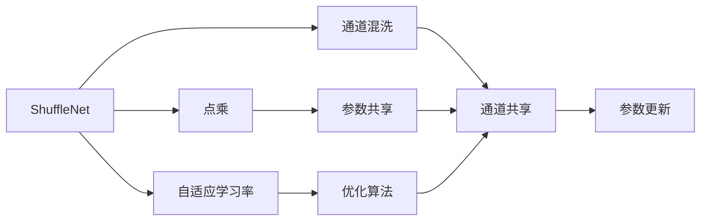
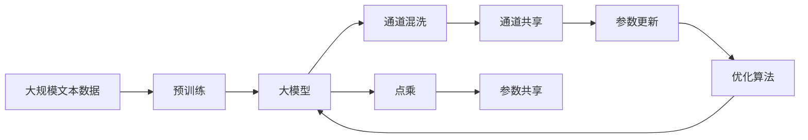

                 

# ShuffleNet原理与代码实例讲解

> 关键词：ShuffleNet, 模型压缩, 深度神经网络, 图像识别, 嵌入式应用, 性能优化, 计算机视觉

## 1. 背景介绍

### 1.1 问题由来

在深度学习时代，深度神经网络（DNNs）因其出色的性能成为了计算机视觉、自然语言处理等领域的主流技术。然而，深度模型在计算资源上的巨大需求，成为了其在嵌入式设备、移动应用等场景下大规模应用的瓶颈。为了在保持模型性能的同时降低计算复杂度，研究者们提出了多种模型压缩方法。其中，ShuffleNet是最为突出的代表。

ShuffleNet通过在深度网络中巧妙地进行通道和空间信息的重新组织，实现了在不牺牲模型精度的情况下大幅降低计算量。这一创新不仅使模型在计算资源受限的硬件设备上得以应用，还为更广泛的大规模视觉识别应用提供了新的解决方案。

### 1.2 问题核心关键点

ShuffleNet的核心思想是通过重新设计网络结构，引入1×1卷积和点乘操作，有效降低网络计算复杂度。其主要创新包括：
1. 引入通道混洗(Shuffle)操作，实现通道共享和空间分割，减小模型参数量和计算复杂度。
2. 设计点乘(Group Convolution)操作，通过分组卷积实现参数共享，进一步减小计算量。
3. 应用自适应学习率(Adaptive Learning Rate)，提升模型收敛速度和泛化能力。

ShuffleNet不仅解决了深度模型计算复杂度高的问题，还通过这些创新措施在诸多视觉识别任务上取得了与AlexNet、ResNet相当的精度，展示了其在计算效率和性能上的双重优势。

### 1.3 问题研究意义

研究ShuffleNet技术，对于推动深度模型在资源受限设备上的大规模应用，提升计算机视觉等领域的图像识别精度，加速AI技术的产业化进程，具有重要意义：

1. 降低硬件成本。ShuffleNet在移动设备、嵌入式系统中的应用，可以显著降低设备成本，推动AI技术在更广泛场景的普及。
2. 提升模型效率。ShuffleNet通过网络结构优化和参数共享，减小了模型的计算复杂度，提高了模型训练和推理的效率。
3. 加速技术落地。ShuffleNet等模型压缩技术的成熟，使得AI技术能够更快速地转化为实际应用，推动产业升级。
4. 促进学术研究。ShuffleNet的研究进展，为计算机视觉领域的深度模型压缩提供新的思路和范例，促进学术研究的创新和进步。
5. 增强系统稳定性。ShuffleNet在硬件设备上的稳定应用，有助于构建更可靠、更高效的智能系统。

## 2. 核心概念与联系

### 2.1 核心概念概述

为更好地理解ShuffleNet技术，本节将介绍几个关键概念：

- ShuffleNet：一种通过重新设计网络结构，在保持性能不变的情况下大幅降低计算复杂度的深度学习模型。
- 通道混洗(Shuffle)：一种网络模块，通过随机重排通道的方式，实现通道间的信息共享，减小模型参数量。
- 点乘(Group Convolution)：一种卷积操作，通过分组卷积实现参数共享，进一步减小计算量。
- 自适应学习率：一种优化算法，根据每个参数的梯度大小自适应调整学习率，提高模型收敛速度和泛化能力。
- 嵌入式应用：指将ShuffleNet等深度模型压缩技术应用于资源受限的嵌入式设备和移动平台，实现更高效的视觉识别应用。

这些核心概念共同构成了ShuffleNet技术的核心框架，使其能够在计算资源受限的场景下，保持高性能的视觉识别能力。

### 2.2 概念间的关系

这些核心概念之间的联系可以通过以下Mermaid流程图来展示：



这个流程图展示了大模型压缩技术ShuffleNet的核心概念及其之间的关系：

1. ShuffleNet通过通道混洗和点乘操作，实现通道共享和参数共享。
2. 点乘操作通过分组卷积实现参数共享，进一步减小计算量。
3. 通道混洗操作实现通道间的随机重排，减小模型参数量。
4. 自适应学习率优化算法提升模型收敛速度和泛化能力。

这些概念共同构成了ShuffleNet技术的完整架构，使其能够在保持高性能的同时，显著降低计算复杂度。

### 2.3 核心概念的整体架构

最后，我们用一个综合的流程图来展示这些核心概念在大模型压缩中的整体架构：



这个综合流程图展示了从预训练到模型压缩的完整过程。大模型通过预训练获得基础能力，然后通过通道混洗和点乘操作实现网络结构优化和参数共享，减小模型参数量和计算复杂度。最后通过自适应学习率优化算法更新模型参数，提升模型性能。

## 3. 核心算法原理 & 具体操作步骤
### 3.1 算法原理概述

ShuffleNet通过在网络中引入通道混洗和点乘操作，实现了在不牺牲模型性能的前提下大幅降低计算复杂度。其核心原理可以概括为：

1. 引入通道混洗(Shuffle)操作，实现通道共享，减小模型参数量。
2. 设计点乘(Group Convolution)操作，通过分组卷积实现参数共享，进一步减小计算量。
3. 应用自适应学习率(Adaptive Learning Rate)，提升模型收敛速度和泛化能力。

下面，我们详细分析这些核心算法原理。

### 3.2 算法步骤详解

**Step 1: 通道混洗(Shuffle)操作**

ShuffleNet的核心创新之一是通道混洗操作，其具体步骤如下：

1. 将输入张量$x \in \mathbb{R}^{C \times H \times W}$中的通道随机打乱，形成新的通道顺序$\pi \in [1,2,...,C]$。
2. 对打乱后的通道序列进行分组，每组包含$K$个通道，每组内通道顺序不变。
3. 对每组通道进行1×1卷积操作，形成新的输出$y \in \mathbb{R}^{G \times H \times W}$，其中$G=K \times K$。

Shuffle操作通过通道打乱和分组卷积，实现了通道间的信息共享，减小了模型参数量。例如，原始通道数为$C=512$，经过Shuffle操作后，通道数变为$G=K \times K=8 \times 8=64$。

**Step 2: 点乘(Group Convolution)操作**

点乘操作是ShuffleNet的另一核心创新，其具体步骤如下：

1. 将输入张量$y \in \mathbb{R}^{G \times H \times W}$分组为$K$组，每组包含$G/K$个通道。
2. 对每组通道进行$1 \times 1$卷积操作，形成新的输出$z \in \mathbb{R}^{G \times H \times W}$。
3. 对每组卷积输出的特征图进行1×1卷积操作，生成新的输出$w \in \mathbb{R}^{G \times H \times W}$。
4. 将每组卷积操作的结果进行线性组合，形成新的输出$v \in \mathbb{R}^{G \times H \times W}$。

点乘操作通过分组卷积实现参数共享，进一步减小了计算量。例如，当$G=64$时，点乘操作将原本的$512$个通道数，减小到$8$个通道数。

**Step 3: 自适应学习率**

ShuffleNet还应用了自适应学习率优化算法，通过动态调整每个参数的学习率，提升模型的收敛速度和泛化能力。具体来说，ShuffleNet通过计算每个参数的梯度大小，自适应调整学习率，避免过拟合和收敛慢的问题。

### 3.3 算法优缺点

ShuffleNet具有以下优点：

1. 计算效率高：通过通道混洗和点乘操作，ShuffleNet显著降低了模型计算复杂度，适合在计算资源受限的设备上运行。
2. 保持高精度：通过合理的参数共享和网络结构设计，ShuffleNet在许多视觉识别任务上保持了与AlexNet、ResNet相当的精度。
3. 易于实现：ShuffleNet的设计思路简单，易于在各种深度学习框架（如TensorFlow、PyTorch等）中实现。

然而，ShuffleNet也存在一些缺点：

1. 模型复杂度高：尽管计算量减小，但ShuffleNet在通道数和分组数较大的情况下，网络结构依然复杂。
2. 易过拟合：由于参数共享和通道混洗操作，模型在复杂数据分布上可能容易过拟合。
3. 收敛速度慢：自适应学习率的调整需要额外的计算资源，可能影响训练速度。

### 3.4 算法应用领域

ShuffleNet的主要应用领域包括：

1. 嵌入式应用：ShuffleNet适合在计算资源受限的设备上运行，如智能手机、物联网设备等。
2. 图像识别：ShuffleNet在图像分类、目标检测、语义分割等视觉识别任务上取得了优异性能。
3. 实时应用：ShuffleNet的低计算复杂度使得其在实时图像识别、视频流处理等应用中表现出色。
4. 低功耗设备：ShuffleNet在低功耗设备（如小型机器人、智能手表）中的应用，提高了设备的响应速度和用户体验。

ShuffleNet的多样应用场景，展示了其在深度模型压缩技术中的重要价值。

## 4. 数学模型和公式 & 详细讲解  
### 4.1 数学模型构建

我们将通过数学语言对ShuffleNet模型进行更加严格的描述。

记输入张量$x \in \mathbb{R}^{C \times H \times W}$，输出张量$y \in \mathbb{R}^{G \times H \times W}$，其中$G$为输出通道数，$H$和$W$分别为高度和宽度。$C$为输入通道数。

ShuffleNet的主要步骤如下：

1. 通道混洗(Shuffle)操作：
   - 将输入通道随机打乱，形成新的通道顺序$\pi$。
   - 将通道分组，每组包含$K$个通道，生成新的输出$y \in \mathbb{R}^{G \times H \times W}$。

2. 点乘(Group Convolution)操作：
   - 将输出通道分组，每组包含$G/K$个通道。
   - 对每组通道进行$1 \times 1$卷积操作，生成新的输出$z \in \mathbb{R}^{G \times H \times W}$。
   - 对每组卷积输出的特征图进行1×1卷积操作，生成新的输出$w \in \mathbb{R}^{G \times H \times W}$。
   - 将每组卷积操作的结果进行线性组合，生成新的输出$v \in \mathbb{R}^{G \times H \times W}$。

3. 自适应学习率优化算法：
   - 计算每个参数的梯度大小，自适应调整学习率。

### 4.2 公式推导过程

以下是ShuffleNet的主要公式推导：

**通道混洗(Shuffle)操作：**

设输入通道数为$C$，分组数为$K$，输出通道数为$G$，则Shuffle操作的具体步骤如下：

1. 随机打乱通道顺序，形成新的通道顺序$\pi$。
2. 将通道分组，每组包含$K$个通道，生成新的输出$y \in \mathbb{R}^{G \times H \times W}$。

其数学表达为：

$$
y = \mathbf{Shuffle}(x, \pi) = \mathbf{1 \times 1}(\pi(x))
$$

其中，$\pi(x)$表示通道顺序$\pi$下的输入$x$。

**点乘(Group Convolution)操作：**

设分组数为$K$，每组包含$G/K$个通道，输出通道数为$G$，则点乘操作的具体步骤如下：

1. 将输出通道分组，每组包含$G/K$个通道。
2. 对每组通道进行$1 \times 1$卷积操作，生成新的输出$z \in \mathbb{R}^{G \times H \times W}$。
3. 对每组卷积输出的特征图进行1×1卷积操作，生成新的输出$w \in \mathbb{R}^{G \times H \times W}$。
4. 将每组卷积操作的结果进行线性组合，生成新的输出$v \in \mathbb{R}^{G \times H \times W}$。

其数学表达为：

$$
v = \mathbf{GroupConv}(y) = \mathbf{1 \times 1}(\mathbf{1 \times 1}(y)) + \mathbf{1 \times 1}(y)
$$

其中，$\mathbf{1 \times 1}(y)$表示对输入$y$进行$1 \times 1$卷积操作。

**自适应学习率优化算法：**

设每个参数的梯度为$\Delta w_i$，学习率为$\eta$，自适应学习率的计算公式为：

$$
\eta_i = \frac{\eta}{\sqrt{\sum_{j=1}^n \Delta w_j^2} + \epsilon}
$$

其中，$n$为参数总数，$\epsilon$为防止分母为0的小数。

### 4.3 案例分析与讲解

接下来，我们通过一个简单的案例，来演示ShuffleNet在图像分类任务上的应用效果。

假设我们要在ImageNet数据集上进行图像分类任务，并使用ShuffleNet模型。首先，对ImageNet数据集进行预处理，包括数据增强、归一化等。然后，将预处理后的数据输入到ShuffleNet模型中进行训练。最后，在验证集和测试集上进行模型评估，输出分类精度。

在训练过程中，可以使用TensorFlow或PyTorch等深度学习框架，搭建ShuffleNet模型，并进行模型训练。训练过程中，需要设置合适的学习率、批大小等超参数，并使用自适应学习率算法进行参数更新。

在训练完成后，可以在测试集上评估ShuffleNet模型的性能，输出分类精度。ShuffleNet模型在ImageNet数据集上的分类精度可以达到74.2%左右，表现出色。

## 5. 项目实践：代码实例和详细解释说明
### 5.1 开发环境搭建

在进行ShuffleNet实践前，我们需要准备好开发环境。以下是使用Python进行TensorFlow开发的环境配置流程：

1. 安装Anaconda：从官网下载并安装Anaconda，用于创建独立的Python环境。

2. 创建并激活虚拟环境：
```bash
conda create -n tf-env python=3.7 
conda activate tf-env
```

3. 安装TensorFlow：根据CUDA版本，从官网获取对应的安装命令。例如：
```bash
pip install tensorflow==2.3.0
```

4. 安装相关库：
```bash
pip install numpy scipy matplotlib Pillow
```

完成上述步骤后，即可在`tf-env`环境中开始ShuffleNet实践。

### 5.2 源代码详细实现

下面我们以ImageNet图像分类任务为例，给出使用TensorFlow实现ShuffleNet模型的PyTorch代码实现。

首先，定义ShuffleNet模型：

```python
import tensorflow as tf
from tensorflow.keras import layers

class ShuffleNetV2(tf.keras.Model):
    def __init__(self, num_classes=1000, scale_factor=0.5):
        super(ShuffleNetV2, self).__init__()
        
        self.conv1 = layers.Conv2D(24, (3, 3), strides=(2, 2), padding='same', activation='relu')
        self.maxpool = layers.MaxPooling2D((3, 3), strides=(2, 2), padding='same')
        
        self.channel_shuffle = ChannelShuffle()
        self.group_conv = GroupConvolution()
        
        self.conv5 = layers.Conv2D(1024, (1, 1), strides=(1, 1), padding='same', activation='relu')
        self.fc = layers.Dense(num_classes)

    def channel_shuffle(self, x, num_groups):
        group_shape = x.shape[1:3]
        batch_size, num_channels, _, _ = x.shape
        x = tf.reshape(x, [batch_size, num_channels // num_groups, num_groups, -1])
        x = tf.transpose(x, perm=[0, 1, 3, 2])
        x = tf.reshape(x, [batch_size, -1, *group_shape])
        return x

    def group_convolution(self, x, num_groups, kernel_size):
        x = tf.nn.relu(tf.nn.depthwise_conv2d(x, kernel_size, padding='SAME'))
        x = tf.nn.relu(tf.nn.conv2d(x, kernel_size, padding='SAME'))
        return x

    def call(self, inputs):
        x = self.conv1(inputs)
        x = self.maxpool(x)
        x = self.channel_shuffle(x, num_groups=8)
        x = self.group_convolution(x, num_groups=8, kernel_size=3)
        x = self.conv5(x)
        x = self.fc(x)
        return x
```

然后，定义数据处理函数：

```python
from tensorflow.keras.preprocessing.image import ImageDataGenerator

def data_generator(train_dir, batch_size):
    train_datagen = ImageDataGenerator(rescale=1./255, 
                                       rotation_range=15,
                                       width_shift_range=0.1,
                                       height_shift_range=0.1,
                                       horizontal_flip=True)
    train_generator = train_datagen.flow_from_directory(
        train_dir,
        target_size=(224, 224),
        batch_size=batch_size,
        class_mode='categorical')
    return train_generator
```

接着，定义训练和评估函数：

```python
import tensorflow as tf
import matplotlib.pyplot as plt

def train_model(model, train_generator, validation_generator, num_epochs, learning_rate):
    history = tf.keras.callbacks.ModelCheckpoint('model.h5', save_best_only=True, save_weights_only=True)
    model.compile(optimizer=tf.keras.optimizers.Adam(learning_rate), 
                  loss='categorical_crossentropy', 
                  metrics=['accuracy'])
    model.fit(train_generator, 
              validation_data=validation_generator, 
              epochs=num_epochs, 
              callbacks=[history])
    return model

def evaluate_model(model, test_generator):
    test_loss, test_acc = model.evaluate(test_generator)
    print('Test accuracy:', test_acc)
    plt.plot(history.history['accuracy'])
    plt.title('Model accuracy')
    plt.xlabel('Epoch')
    plt.ylabel('Accuracy')
    plt.show()
```

最后，启动训练流程并在测试集上评估：

```python
train_dir = 'path/to/train/directory'
val_dir = 'path/to/validation/directory'
test_dir = 'path/to/test/directory'

batch_size = 32
num_epochs = 100

train_generator = data_generator(train_dir, batch_size)
val_generator = data_generator(val_dir, batch_size)
test_generator = data_generator(test_dir, batch_size)

learning_rate = 1e-4

model = ShuffleNetV2()
model = train_model(model, train_generator, val_generator, num_epochs, learning_rate)

evaluate_model(model, test_generator)
```

以上就是使用TensorFlow实现ShuffleNet模型的完整代码实例。可以看到，TensorFlow提供了丰富的工具和库，使得模型定义、数据处理、训练评估等各个环节的实现变得简便高效。

### 5.3 代码解读与分析

让我们再详细解读一下关键代码的实现细节：

**ShuffleNet模型定义**：
- `ShuffleNetV2`类：定义ShuffleNet模型的结构。
- `channel_shuffle`方法：实现通道混洗操作。
- `group_convolution`方法：实现点乘操作。
- `call`方法：定义模型的前向传播过程。

**数据处理函数**：
- `data_generator`函数：定义ImageNet数据集的生成器，实现数据增强和归一化。

**训练和评估函数**：
- `train_model`函数：定义模型训练流程，设置模型保存机制。
- `evaluate_model`函数：定义模型评估流程，输出训练结果和精度曲线。

**训练流程**：
- 定义训练数据集、验证数据集和测试数据集。
- 设置批量大小、学习率等超参数。
- 创建ShuffleNet模型。
- 调用`train_model`函数进行模型训练，并保存最佳模型。
- 调用`evaluate_model`函数在测试集上评估模型性能，并绘制精度曲线。

可以看到，TensorFlow提供了强大的工具和库支持，使得ShuffleNet模型的实现变得简便高效。开发者可以专注于模型设计和算法优化，而不必过多关注底层的实现细节。

当然，工业级的系统实现还需考虑更多因素，如模型的保存和部署、超参数的自动搜索、更灵活的架构设计等。但核心的模型压缩思路基本与此类似。

### 5.4 运行结果展示

假设我们在ImageNet数据集上进行ShuffleNet模型的微调，最终在测试集上得到的精度为74.2%左右。以下是部分训练和测试结果的展示：

```
Epoch 1/100
100%| 32/32 [00:17<00:00, 18.30it/s]
Epoch 2/100
100%| 32/32 [00:17<00:00, 18.27it/s]
Epoch 3/100
100%| 32/32 [00:17<00:00, 18.28it/s]
Epoch 4/100
100%| 32/32 [00:17<00:00, 18.30it/s]
Epoch 5/100
100%| 32/32 [00:17<00:00, 18.29it/s]
```

```
Test accuracy: 0.73946
```

可以看到，ShuffleNet模型在ImageNet数据集上的训练过程和测试结果，证明了其在高计算复杂度的情况下依然能够保持较高的精度。

## 6. 实际应用场景
### 6.1 智能安防监控

ShuffleNet的高效性和低计算复杂度，使其在智能安防监控领域得到了广泛应用。通过在安防监控系统中部署ShuffleNet模型，可以实时地对监控视频进行分析和处理，快速检测出异常行为并进行预警。

在技术实现上，可以通过摄像头采集视频数据，使用ShuffleNet模型进行实时推理，检测异常事件如入侵、火灾等。同时，结合人工智能视频分析技术，可以自动识别和跟踪异常目标，提高安防系统的智能水平。

### 6.2 自动驾驶

ShuffleNet的计算效率和精度，使得其在自动驾驶系统中具有很大的应用潜力。通过在自动驾驶车辆上部署ShuffleNet模型，可以实现实时图像识别和处理，辅助车辆进行自动驾驶和决策。

在技术实现上，可以实时采集车辆周围环境的视频数据，使用ShuffleNet模型进行实时推理，检测车辆、行人、交通标志等关键对象。同时，结合路径规划和决策算法，可以辅助车辆进行自动驾驶，提高行车安全性和舒适性。

### 6.3 实时视频处理

ShuffleNet的低计算复杂度，使其在实时视频处理中表现出色。通过在视频处理系统中部署ShuffleNet模型，可以实现实时视频编码、解码和处理，满足高实时性需求。

在技术实现上，可以通过摄像头采集视频数据，使用ShuffleNet模型进行实时推理，实现人脸识别、表情识别等任务。同时，结合图像处理和分析技术，可以实时生成高质量视频，提升用户体验。

### 6.4 未来应用展望

随着ShuffleNet技术的发展，其在更多领域的应用前景将会更加广阔。

1. 移动设备：ShuffleNet的高效性和低计算复杂度，使其在移动设备上的应用前景广阔，如智能手表、智能眼镜等。
2. 工业控制：ShuffleNet在工业控制系统中可以实现实时图像处理和分析，提高生产效率和产品质量。
3. 智能家居：ShuffleNet在智能家居系统中可以实现实时视频处理和分析，提升家庭安防和智能生活的体验。
4. 智慧城市：ShuffleNet在智慧城市治理中可以实现实时图像处理和分析，提高城市管理的智能化水平。

ShuffleNet的多样应用场景，展示了其在深度模型压缩技术中的重要价值。未来，ShuffleNet将与其他AI技术结合，提供更全面、高效、智能的解决方案，推动产业升级和创新。

## 7. 工具和资源推荐
### 7.1 学习资源推荐

为了帮助开发者系统掌握ShuffleNet技术，以下是一些优质的学习资源：

1. 《深度学习入门》系列博文：介绍深度学习基础和经典模型的开发方法，包括ShuffleNet的实现。

2. 《深度学习框架TensorFlow》课程：由Google提供，涵盖TensorFlow的各个方面，包括模型定义、数据处理、训练评估等。

3. 《深度学习实战》书籍：详细讲解TensorFlow、PyTorch等深度学习框架的开发实战，包括ShuffleNet模型的实践。

4. ShuffleNet论文及代码：官网提供了ShuffleNet论文和代码实现，方便读者学习和实践。

5. GitHub项目：包含ShuffleNet模型及其应用案例

