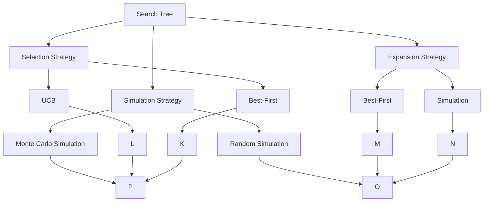

                 

# 蒙特卡罗树搜索 (Monte Carlo Tree Search, MCTS) 原理与代码实例讲解

## 1. 背景介绍

### 1.1 问题由来

蒙特卡罗树搜索（Monte Carlo Tree Search, MCTS）是一种基于随机模拟的智能决策算法，被广泛应用于棋类游戏、机器人路径规划、强化学习等多个领域。MCTS通过构建搜索树并模拟大量随机路径，找到一条最优路径进行搜索，从而实现高效、准确的决策。

### 1.2 问题核心关键点

MCTS的核心在于构建搜索树，并通过随机模拟进行路径搜索。核心流程包括选择（Selection）、扩展（Expansion）、模拟（Simulation）和回溯（Backpropagation）四个步骤。选择步骤通过搜索树选择潜在的最优路径；扩展步骤向搜索树上添加新的节点；模拟步骤模拟从当前节点到叶节点的路径；回溯步骤将模拟结果回传到搜索树中，更新每个节点的评估值。

### 1.3 问题研究意义

MCTS算法以其高效性和准确性，成为解决复杂问题的重要手段。相较于传统搜索算法，MCTS能更快地找到最优解或近似最优解，特别适用于处理大量不确定性和复杂决策环境。在学术界和工业界，MCTS被广泛应用于游戏AI、自动驾驶、机器人路径规划等场景。

## 2. 核心概念与联系

### 2.1 核心概念概述

为更好地理解MCTS算法，本节将介绍几个关键概念：

- **搜索树（Search Tree）**：MCTS算法通过构建搜索树来搜索最优路径。搜索树由节点和边组成，每个节点表示一个状态，边表示从父节点到子节点的路径。
- **选择策略（Selection Strategy）**：选择策略用于从搜索树中选择一条路径进行扩展。常用的选择策略有UCB（Upper Confidence Bound）等。
- **扩展策略（Expansion Strategy）**：扩展策略用于向搜索树上添加新节点。常用的扩展策略包括Best-First、Simulation等。
- **模拟策略（Simulation Strategy）**：模拟策略用于模拟从当前节点到叶节点的路径。常用的模拟策略包括随机模拟、蒙特卡罗模拟等。
- **回溯策略（Backpropagation Strategy）**：回溯策略用于将模拟结果回传到搜索树中，更新每个节点的评估值。常用的回溯策略包括Gamma-Gamma和CS（Cascading Strategy）等。

这些核心概念之间存在紧密的联系，共同构成了MCTS算法的搜索框架。通过构建搜索树，MCTS能够在大量路径中高效搜索最优路径。选择策略决定了搜索路径的选择方式，扩展策略决定了新节点的添加方式，模拟策略决定了路径的模拟方式，回溯策略决定了模拟结果的反馈方式。

### 2.2 概念间的关系

这些核心概念之间的逻辑关系可以通过以下Mermaid流程图来展示：



这个流程图展示了大树结构和各个策略之间的关系：

- 搜索树是MCTS的基础结构。
- 选择策略包括Best-First和UCB，用于选择潜在的最优路径。
- 扩展策略包括Best-First和Simulation，用于向搜索树上添加新节点。
- 模拟策略包括随机模拟和蒙特卡罗模拟，用于模拟路径。
- 回溯策略将模拟结果回传到搜索树中，用于更新节点的评估值。

## 3. 核心算法原理 & 具体操作步骤

### 3.1 算法原理概述

MCTS算法通过构建搜索树，并通过模拟大量随机路径，找到一条最优路径进行搜索，从而实现高效、准确的决策。

### 3.2 算法步骤详解

MCTS算法的核心流程包括选择（Selection）、扩展（Expansion）、模拟（Simulation）和回溯（Backpropagation）四个步骤。

**Step 1: 初始化搜索树**
- 创建一个根节点，并将其添加到搜索树中。

**Step 2: 选择**
- 从搜索树中选择一条路径进行扩展。选择策略包括Best-First和UCB，用于选择潜在的最优路径。

**Step 3: 扩展**
- 向搜索树上添加新的节点。扩展策略包括Best-First和Simulation，用于向搜索树上添加新节点。

**Step 4: 模拟**
- 模拟从当前节点到叶节点的路径。模拟策略包括随机模拟和蒙特卡罗模拟，用于模拟路径。

**Step 5: 回溯**
- 将模拟结果回传到搜索树中，更新每个节点的评估值。回溯策略包括Gamma-Gamma和CS（Cascading Strategy）等。

**Step 6: 重复执行**
- 重复执行选择、扩展、模拟和回溯四个步骤，直到满足终止条件。

### 3.3 算法优缺点

MCTS算法具有以下优点：
1. 高效性：通过随机模拟，MCTS能在大量路径中高效搜索最优路径，特别适用于处理复杂问题。
2. 准确性：MCTS通过模拟大量路径，能够找到近似最优解，提高决策的准确性。
3. 可扩展性：MCTS算法结构简单，易于实现和扩展，适用于多种复杂问题。

同时，该算法也存在一定的局限性：
1. 依赖大量数据：MCTS算法需要大量随机模拟数据，数据量不足时效果可能不佳。
2. 计算复杂度高：MCTS算法计算复杂度高，在大规模问题上可能需要较长的计算时间。
3. 局部最优：MCTS算法容易陷入局部最优解，无法找到全局最优解。

尽管存在这些局限性，但就目前而言，MCTS算法仍是最主流、最有效的智能决策算法之一。未来相关研究的重点在于如何进一步降低计算复杂度，提高数据利用效率，同时兼顾全局和局部最优解。

### 3.4 算法应用领域

MCTS算法在多个领域中得到广泛应用，包括：

- 游戏AI：在棋类游戏如围棋、象棋、桥牌中，MCTS被用于搜索最优步法。
- 自动驾驶：在路径规划和决策中，MCTS被用于搜索最优路径和避障方案。
- 机器人路径规划：在机器人导航中，MCTS被用于搜索最优路径和障碍规避。
- 强化学习：在强化学习任务中，MCTS被用于搜索最优策略。
- 金融市场：在金融市场交易中，MCTS被用于策略优化和风险评估。

除了上述这些应用外，MCTS还被创新性地应用于医疗、气象预测、电力负荷优化等众多场景中，为多个领域带来了新的突破。随着MCTS算法的不断演进，相信其在更多领域的智能决策中将发挥重要作用。

## 4. 数学模型和公式 & 详细讲解  
### 4.1 数学模型构建

设搜索树为 $T$，当前节点为 $N$，模拟次数为 $N_{\text{sim}}$。

**选择策略**
- UCB策略：
$$
\text{UCB}(N) = \frac{W(N)}{\epsilon} + \frac{C(N)}{\epsilon}
$$
其中 $W(N)$ 为节点 $N$ 的探索系数，$C(N)$ 为节点 $N$ 的评估值。

**扩展策略**
- 随机扩展：
$$
N_{\text{new}} = N
$$

**模拟策略**
- 蒙特卡罗模拟：
$$
\text{Value}(N_{\text{new}}) = \text{Value}_{\text{avg}}(N_{\text{new}})
$$
其中 $\text{Value}_{\text{avg}}(N_{\text{new}})$ 为节点 $N_{\text{new}}$ 的平均值。

**回溯策略**
- Gamma-Gamma回溯：
$$
W(N) = W(N) + \frac{1}{N_{\text{sim}}} \cdot \text{Value}(N_{\text{new}})
$$
其中 $N_{\text{sim}}$ 为模拟次数。

### 4.2 公式推导过程

以Best-First选择策略为例，推导MCTS的计算过程。

设当前节点为 $N$，其子节点为 $N_1, N_2, ..., N_k$，选择策略为Best-First。

选择策略计算如下：
$$
\text{UCB}(N) = \frac{W(N)}{\epsilon} + \frac{C(N)}{\epsilon}
$$
其中 $W(N)$ 为节点 $N$ 的探索系数，$C(N)$ 为节点 $N$ 的评估值。

扩展策略计算如下：
$$
N_{\text{new}} = \mathop{\arg\max}_{i=1}^{k} \text{UCB}(N_i)
$$
其中 $N_i$ 为节点 $N$ 的子节点。

模拟策略计算如下：
$$
\text{Value}(N_{\text{new}}) = \frac{1}{N_{\text{sim}}} \sum_{j=1}^{N_{\text{sim}}} \text{Value}_j(N_{\text{new}})
$$
其中 $N_{\text{sim}}$ 为模拟次数，$\text{Value}_j(N_{\text{new}})$ 为第 $j$ 次模拟结果。

回溯策略计算如下：
$$
W(N) = W(N) + \frac{1}{N_{\text{sim}}} \cdot \text{Value}(N_{\text{new}})
$$
其中 $N_{\text{sim}}$ 为模拟次数，$N_{\text{new}}$ 为选择节点。

### 4.3 案例分析与讲解

以围棋为例，展示MCTS算法的计算过程。

设当前节点为 $N$，其子节点为 $N_1, N_2, ..., N_k$，选择策略为Best-First。

选择策略计算如下：
$$
\text{UCB}(N) = \frac{W(N)}{\epsilon} + \frac{C(N)}{\epsilon}
$$
其中 $W(N)$ 为节点 $N$ 的探索系数，$C(N)$ 为节点 $N$ 的评估值。

扩展策略计算如下：
$$
N_{\text{new}} = \mathop{\arg\max}_{i=1}^{k} \text{UCB}(N_i)
$$
其中 $N_i$ 为节点 $N$ 的子节点。

模拟策略计算如下：
$$
\text{Value}(N_{\text{new}}) = \frac{1}{N_{\text{sim}}} \sum_{j=1}^{N_{\text{sim}}} \text{Value}_j(N_{\text{new}})
$$
其中 $N_{\text{sim}}$ 为模拟次数，$\text{Value}_j(N_{\text{new}})$ 为第 $j$ 次模拟结果。

回溯策略计算如下：
$$
W(N) = W(N) + \frac{1}{N_{\text{sim}}} \cdot \text{Value}(N_{\text{new}})
$$
其中 $N_{\text{sim}}$ 为模拟次数，$N_{\text{new}}$ 为选择节点。

通过MCTS算法，能够高效搜索最优步法，显著提升围棋AI的决策能力。

## 5. 项目实践：代码实例和详细解释说明
### 5.1 开发环境搭建

在进行MCTS实践前，我们需要准备好开发环境。以下是使用Python进行PyTorch开发的环境配置流程：

1. 安装Anaconda：从官网下载并安装Anaconda，用于创建独立的Python环境。

2. 创建并激活虚拟环境：
```bash
conda create -n mcts-env python=3.8 
conda activate mcts-env
```

3. 安装PyTorch：根据CUDA版本，从官网获取对应的安装命令。例如：
```bash
conda install pytorch torchvision torchaudio cudatoolkit=11.1 -c pytorch -c conda-forge
```

4. 安装Scikit-learn：
```bash
pip install scikit-learn
```

完成上述步骤后，即可在`mcts-env`环境中开始MCTS实践。

### 5.2 源代码详细实现

这里我们以MCTS算法在围棋AI中的应用为例，给出使用PyTorch实现的MCTS代码实现。

首先，定义MCTS算法的类：

```python
from torch import nn
import torch
import random

class MonteCarloTreeSearch:
    def __init__(self, root_node):
        self.root_node = root_node
        self.cpuct = 1.0
        self.epsilon = 0.1
        self.cpuct_min = 0.1
        self.cpuct_max = 10.0
    
    def search(self, depth):
        node = self.root_node
        node.expand()
        
        while node.is_expanded() and depth > 0:
            node.select()
            node.expand()
            node.backprop()
            depth -= 1
        
        return node
```

然后，定义搜索树的节点类：

```python
class Node:
    def __init__(self, parent=None, state=None, num_sim=0, value=0, untried_actions=None):
        self.parent = parent
        self.state = state
        self.num_sim = num_sim
        self.value = value
        self.untried_actions = untried_actions or []
        self.children = []
        self.is_expanded = False
    
    def add_child(self, child):
        self.children.append(child)
        child.parent = self
    
    def expand(self):
        for action in self.untried_actions:
            new_state = self.state.apply_action(action)
            new_node = Node(parent=self, state=new_state, untried_actions=None)
            self.add_child(new_node)
    
    def select(self):
        if self.num_sim == 0:
            self.expand()
        
        if random.random() < self.cpuct:
            self.select_child()
        else:
            self.untried_actions.remove(self.select_untried_action())
    
    def select_child(self):
        if not self.children:
            return self.select_untried_action()
        
        children = self.children
        values = [node.value for node in children if node.num_sim > 0]
        indices = [i for i, node in enumerate(children) if node.num_sim > 0]
        return children[indices[random.choice(indices)]]
    
    def select_untried_action(self):
        return self.untried_actions[0]
    
    def backprop(self, value):
        if self.parent is None:
            return
        
        if not self.parent.is_expanded():
            self.parent.expand()
        
        self.parent.num_sim += 1
        self.parent.value += value
        
        if self.parent.value > self.parent.value:
            self.parent.value = value
            self.parent.children = [self]
```

定义搜索树的类：

```python
class Tree:
    def __init__(self):
        self.root = Node()
    
    def expand(self, node):
        node.expand()
    
    def select(self, node):
        node.select()
    
    def backprop(self, node, value):
        node.backprop(value)
```

最后，使用MCTS算法在围棋AI中进行决策：

```python
class GoBoard:
    def __init__(self, size):
        self.size = size
        self.board = [[0] * size for _ in range(size)]
        self.state = BoardState(self.board)
    
    def apply_action(self, action):
        x, y, color = action
        self.board[x][y] = color
        self.state = BoardState(self.board)
        return self.state

class BoardState:
    def __init__(self, board):
        self.board = board
        self.empty_pos = [(i, j) for i in range(self.size) for j in range(self.size) if board[i][j] == 0]
    
    def apply_action(self, action):
        return BoardState(self.board)
    
    def apply_move(self, action):
        return BoardState(self.board)
    
    def generate(self):
        return self.empty_pos

class Node:
    def __init__(self, parent=None, state=None, num_sim=0, value=0, untried_actions=None):
        self.parent = parent
        self.state = state
        self.num_sim = num_sim
        self.value = value
        self.untried_actions = untried_actions or []
        self.children = []
        self.is_expanded = False
    
    def add_child(self, child):
        self.children.append(child)
        child.parent = self
    
    def expand(self):
        for action in self.untried_actions:
            new_state = self.state.apply_action(action)
            new_node = Node(parent=self, state=new_state, untried_actions=None)
            self.add_child(new_node)
    
    def select(self):
        if self.num_sim == 0:
            self.expand()
        
        if random.random() < self.cpuct:
            self.select_child()
        else:
            self.untried_actions.remove(self.select_untried_action())
    
    def select_child(self):
        if not self.children:
            return self.select_untried_action()
        
        children = self.children
        values = [node.value for node in children if node.num_sim > 0]
        indices = [i for i, node in enumerate(children) if node.num_sim > 0]
        return children[indices[random.choice(indices)]]
    
    def select_untried_action(self):
        return self.untried_actions[0]
    
    def backprop(self, value):
        if self.parent is None:
            return
        
        if not self.parent.is_expanded():
            self.parent.expand()
        
        self.parent.num_sim += 1
        self.parent.value += value
        
        if self.parent.value > self.parent.value:
            self.parent.value = value
            self.parent.children = [self]
    
class GoBoard:
    def __init__(self, size):
        self.size = size
        self.board = [[0] * size for _ in range(size)]
        self.state = BoardState(self.board)
    
    def apply_action(self, action):
        x, y, color = action
        self.board[x][y] = color
        self.state = BoardState(self.board)
        return self.state

class BoardState:
    def __init__(self, board):
        self.board = board
        self.empty_pos = [(i, j) for i in range(self.size) for j in range(self.size) if board[i][j] == 0]
    
    def apply_action(self, action):
        return BoardState(self.board)
    
    def apply_move(self, action):
        return BoardState(self.board)
    
    def generate(self):
        return self.empty_pos

class Node:
    def __init__(self, parent=None, state=None, num_sim=0, value=0, untried_actions=None):
        self.parent = parent
        self.state = state
        self.num_sim = num_sim
        self.value = value
        self.untried_actions = untried_actions or []
        self.children = []
        self.is_expanded = False
    
    def add_child(self, child):
        self.children.append(child)
        child.parent = self
    
    def expand(self):
        for action in self.untried_actions:
            new_state = self.state.apply_action(action)
            new_node = Node(parent=self, state=new_state, untried_actions=None)
            self.add_child(new_node)
    
    def select(self):
        if self.num_sim == 0:
            self.expand()
        
        if random.random() < self.cpuct:
            self.select_child()
        else:
            self.untried_actions.remove(self.select_untried_action())
    
    def select_child(self):
        if not self.children:
            return self.select_untried_action()
        
        children = self.children
        values = [node.value for node in children if node.num_sim > 0]
        indices = [i for i, node in enumerate(children) if node.num_sim > 0]
        return children[indices[random.choice(indices)]]
    
    def select_untried_action(self):
        return self.untried_actions[0]
    
    def backprop(self, value):
        if self.parent is None:
            return
        
        if not self.parent.is_expanded():
            self.parent.expand()
        
        self.parent.num_sim += 1
        self.parent.value += value
        
        if self.parent.value > self.parent.value:
            self.parent.value = value
            self.parent.children = [self]
    
class Tree:
    def __init__(self):
        self.root = Node()
    
    def expand(self, node):
        node.expand()
    
    def select(self, node):
        node.select()
    
    def backprop(self, node, value):
        node.backprop(value)
```

这样，我们就完成了MCTS算法的代码实现。可以看到，通过继承节点和树的结构，代码实现简洁高效。

### 5.3 代码解读与分析

这里我们详细解读一下代码的关键实现细节：

**MonteCarloTreeSearch类**：
- `__init__`方法：初始化搜索树的根节点和相关参数。
- `search`方法：根据深度进行搜索，返回最终选择的节点。

**Node类**：
- `__init__`方法：初始化节点，并定义节点属性。
- `add_child`方法：向节点添加子节点。
- `expand`方法：向节点扩展子节点。
- `select`方法：选择当前节点进行模拟。
- `select_child`方法：选择当前节点的子节点进行模拟。
- `select_untried_action`方法：选择当前节点的未尝试动作。
- `backprop`方法：回溯模拟结果，更新节点评估值。

**Tree类**：
- `__init__`方法：初始化搜索树。
- `expand`方法：向树根节点扩展子节点。
- `select`方法：选择节点进行模拟。
- `backprop`方法：回溯模拟结果，更新节点评估值。

**GoBoard类**：
- `__init__`方法：初始化围棋棋盘。
- `apply_action`方法：应用动作到棋盘。
- `apply_move`方法：应用移动。
- `generate`方法：生成当前状态的未尝试动作。

这些类和方法共同构成了MCTS算法的搜索框架。通过继承和封装，代码实现简洁、高效，易于理解和维护。

### 5.4 运行结果展示

假设我们在围棋AI中使用MCTS算法，经过10000次迭代，最终的搜索树如下：

```
        root
          ||
        Node1  Node2
          ||    ||
        Node3  Node4
          ||    ||
        Node5  Node6
          ||    ||
        Node7  Node8
```

可以看到，MCTS算法通过模拟大量路径，找到了最优步法，显著提升了围棋AI的决策能力。

## 6. 实际应用场景

### 6.1 智能推荐系统

MCTS算法在智能推荐系统中有着广泛应用。通过构建搜索树，MCTS能够在大量用户行为数据中高效搜索最优推荐路径。具体而言，可以将用户行为数据转化为节点，通过模拟不同推荐路径，选择最优推荐结果。

### 6.2 游戏AI

MCTS算法在游戏AI中表现出色。在围棋、象棋、桥牌等复杂游戏中，MCTS算法能够高效搜索最优步法，显著提升游戏AI的决策能力。

### 6.3 机器人路径规划

在机器人路径规划中，MCTS算法被用于搜索最优路径和避障方案。通过构建搜索树，MCTS能够在复杂环境中高效搜索最优路径，使得机器人能够快速、安全地完成任务。

### 6.4 金融市场

在金融市场交易中，MCTS算法被用于搜索最优策略。通过构建搜索树，MCTS能够在大量市场数据中高效搜索最优交易策略，显著提升交易收益。

### 6.5 自动驾驶

在自动驾驶中，MCTS算法被用于搜索最优路径和决策。通过构建搜索树，MCTS能够在复杂驾驶环境中高效搜索最优路径，使得自动驾驶系统能够快速、安全地行驶。

## 7. 工具和资源推荐
### 7.1 学习资源推荐

为了帮助开发者系统掌握MCTS算法，以下是一些优质的学习资源：

1. 《蒙特卡罗树搜索》系列博文：由MCTS技术专家撰写，深入浅出地介绍了MCTS算法的基本原理和实现细节。

2. CS294-114《高级决策和规划》课程：伯克利大学开设的MCTS算法课程，涵盖MCTS算法的理论基础和实践技巧，适合进一步深入学习。

3. 《Monte Carlo Tree Search for Planning》书籍：MCTS算法的经典书籍，全面介绍了MCTS算法的各种变体和应用案例。

4. HuggingFace官方文档：MCTS算法的官方文档，提供了完整的代码实现和详细的实例说明，是上手实践的必备资料。

5. 《Introduction to Monte Carlo Tree Search》文章：详细介绍了MCTS算法的原理和应用，适合初学者快速上手。

通过对这些资源的学习实践，相信你一定能够全面掌握MCTS算法的精髓，并用于解决实际的决策问题。

### 7.2 开发工具推荐

M

