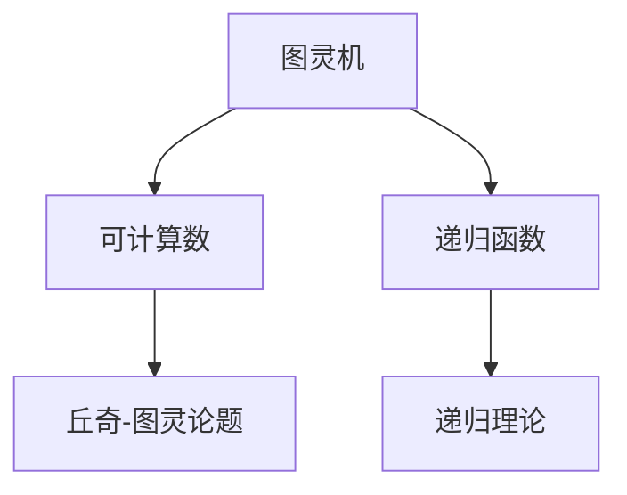
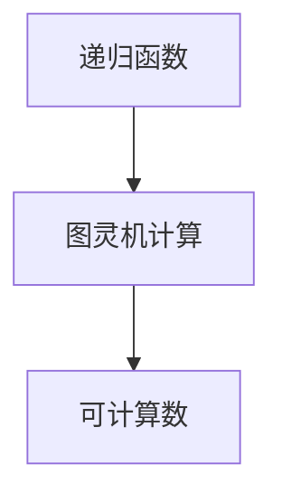
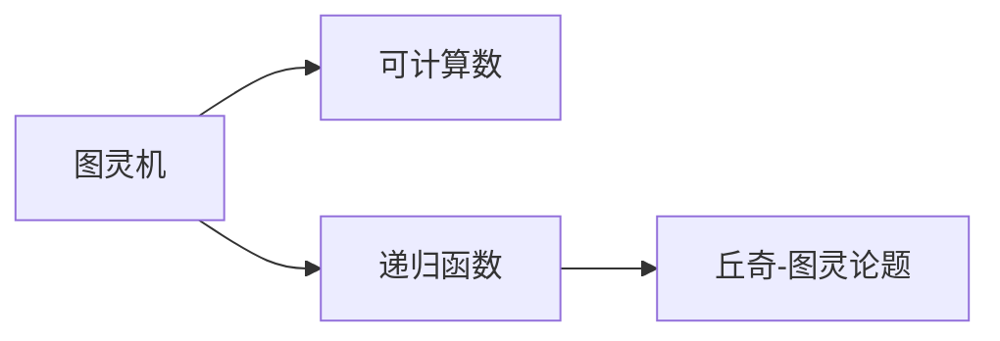
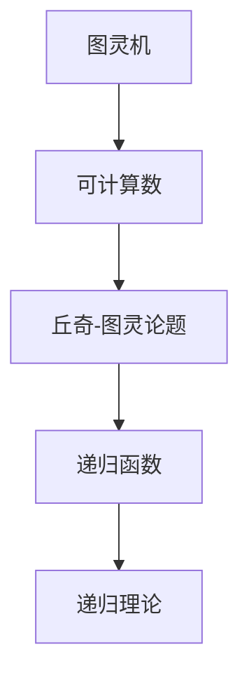

                 

# 计算：第三部分 计算理论的形成 第 8 章 计算理论的诞生：图灵的可计算数 丘奇-图灵论题

> 关键词：计算理论,图灵机,可计算数,丘奇-图灵论题,递归函数,递归理论,算法复杂度

## 1. 背景介绍

### 1.1 问题由来
在上一章中，我们介绍了图灵机模型，以及如何通过图灵机来理解计算机的本质。这一章，我们将深入探讨图灵机在计算理论中的重要性，特别是图灵的可计算数和丘奇-图灵论题。这些概念不仅是计算机科学的基石，也是理解算法复杂度和计算理论发展的基础。

### 1.2 问题核心关键点
图灵的可计算数和丘奇-图灵论题是计算理论中的核心问题。图灵机不仅能计算自然数，还能计算可计算数，即可以由图灵机计算的数。丘奇-图灵论题则探讨了递归函数和递归理论之间的关系，揭示了算法复杂度和计算能力的内在联系。

### 1.3 问题研究意义
理解图灵的可计算数和丘奇-图灵论题，对于深入研究计算机科学和计算理论具有重要意义：
1. **奠定基础**：这些概念为计算机科学提供了坚实的理论基础，帮助我们理解计算机的能力和限制。
2. **指导实践**：计算复杂度的研究，如时间复杂度和空间复杂度，直接指导了算法设计和优化。
3. **推动发展**：丘奇-图灵论题引发了对递归函数的深入研究，推动了算法和计算理论的发展。
4. **指导应用**：理解计算理论有助于设计高效算法，解决实际问题，促进技术应用。
5. **教育价值**：这些理论为计算机科学教育提供了丰富的教学内容，帮助初学者建立计算思维。

## 2. 核心概念与联系

### 2.1 核心概念概述

为了更好地理解图灵的可计算数和丘奇-图灵论题，本节将介绍几个密切相关的核心概念：

- **图灵机(Turing Machine, TM)**：一种抽象的计算模型，能够模拟任何计算机的操作，包括输入、处理和输出。
- **可计算数(Computable Number)**：能够由图灵机计算得到的自然数，包括基本算术运算和递归函数计算的数。
- **递归函数(Recursive Function)**：通过递归定义的函数，即函数自身可以调用自身，以解决复杂问题。
- **递归理论(Recursive Theory)**：研究递归函数的理论，包括递归函数的分类、性质和应用。
- **丘奇-图灵论题(Church-Turing Thesis)**：由丘奇和图灵提出的论题，认为任何可计算数都可以由图灵机计算，任何图灵机计算的数都是可计算的。

这些核心概念之间的逻辑关系可以通过以下Mermaid流程图来展示：



这个流程图展示了图灵机与可计算数、递归函数和递归理论之间的关系：

1. 图灵机能够计算可计算数，包括递归函数。
2. 递归函数是图灵机计算的函数。
3. 递归理论研究递归函数，揭示递归函数的性质和应用。
4. 丘奇-图灵论题指出，任何可计算数都可以由图灵机计算。

### 2.2 概念间的关系

这些核心概念之间存在着紧密的联系，形成了计算理论的核心框架。下面我们通过几个Mermaid流程图来展示这些概念之间的关系。

#### 2.2.1 图灵机与可计算数


这个流程图展示了图灵机与可计算数之间的关系：图灵机能够计算任何可计算数。

#### 2.2.2 递归函数与图灵机



这个流程图展示了递归函数与图灵机计算之间的关系：递归函数可以由图灵机计算。

#### 2.2.3 丘奇-图灵论题



这个流程图展示了丘奇-图灵论题与图灵机、可计算数和递归函数之间的关系：丘奇-图灵论题指出，任何可计算数都可以由图灵机计算，包括递归函数。

### 2.3 核心概念的整体架构

最后，我们用一个综合的流程图来展示这些核心概念在大语言模型微调过程中的整体架构：



这个综合流程图展示了从图灵机到可计算数，再到丘奇-图灵论题、递归函数和递归理论，最终形成计算理论的完整框架。通过这些流程图，我们可以更清晰地理解图灵的可计算数和丘奇-图灵论题在大语言模型微调过程中的重要性和联系。

## 3. 核心算法原理 & 具体操作步骤

### 3.1 算法原理概述

图灵的可计算数和丘奇-图灵论题的核心思想是通过图灵机模型来理解计算的本质。图灵机能够模拟任何计算机的操作，包括输入、处理和输出。通过图灵机，我们能够理解哪些数是可计算的，以及如何通过递归函数进行计算。

图灵的可计算数主要包括基本算术运算和递归函数计算的数。这些数可以通过图灵机逐步计算得到。丘奇-图灵论题进一步指出，任何可计算数都可以由图灵机计算，任何图灵机计算的数都是可计算的。

### 3.2 算法步骤详解

基于图灵机的可计算数和丘奇-图灵论题，理解计算理论和算法复杂度的基本步骤如下：

1. **定义图灵机模型**：设计一个图灵机，包含输入、处理和输出机制。
2. **确定基本算术运算**：定义图灵机可以执行的基本算术运算，如加减乘除。
3. **引入递归函数**：定义图灵机可以计算的递归函数，通过递归调用来解决复杂问题。
4. **分析算法复杂度**：计算图灵机的运行时间、空间复杂度，理解算法效率。
5. **验证丘奇-图灵论题**：通过具体例子验证任何可计算数都可以由图灵机计算，任何图灵机计算的数都是可计算的。

### 3.3 算法优缺点

图灵的可计算数和丘奇-图灵论题有以下优点：
1. **统一性**：图灵机模型提供了统一的计算框架，适用于各种算法和数据结构。
2. **普适性**：图灵机能够计算任何可计算数，解决了计算能力的普适性问题。
3. **简洁性**：通过图灵机模型，可以清晰地理解计算的本质，避免了复杂的数学证明。

但这些概念也存在一定的局限性：
1. **抽象性**：图灵机模型较为抽象，难以直接应用到具体问题。
2. **计算复杂性**：图灵机计算复杂度分析较为复杂，需要一定的数学背景。
3. **效率局限**：图灵机模型无法计算所有问题，存在计算效率的局限。

### 3.4 算法应用领域

图灵的可计算数和丘奇-图灵论题在计算机科学中有着广泛的应用，包括：

- **算法设计**：帮助理解算法复杂度，指导算法设计和优化。
- **数据结构**：分析数据结构的时间复杂度和空间复杂度，优化数据结构实现。
- **系统设计**：理解计算能力的普适性，设计高效、可扩展的系统。
- **编程语言设计**：指导编程语言的设计和优化，实现高效计算。
- **理论研究**：推动递归函数和递归理论的研究，促进计算理论的发展。

## 4. 数学模型和公式 & 详细讲解 & 举例说明

### 4.1 数学模型构建

本节将使用数学语言对图灵的可计算数和丘奇-图灵论题进行更加严格的刻画。

记图灵机为 $M=(Q,\Sigma,\Gamma,b,\delta,q_0,F)$，其中 $Q$ 为状态集合，$\Sigma$ 为输入字符集合，$\Gamma$ 为读写符号集合，$b$ 为读写符号集合，$\delta$ 为转移函数，$q_0$ 为起始状态，$F$ 为接受状态集合。假设图灵机在输入 $x$ 上执行 $n$ 步后，得到输出 $y$。则图灵机的计算过程可以表示为：

$$
\begin{aligned}
y &= M(x) \\
&= \{q_0, \sigma_1, \sigma_2, \ldots, \sigma_n, q_n\}
\end{aligned}
$$

其中 $\sigma_i$ 为第 $i$ 步的读写符号序列。

### 4.2 公式推导过程

以下我们以一个简单的递归函数 $f(n)=n+1$ 为例，推导其计算过程及其时间复杂度：

1. **定义递归函数**：

$$
f(n) = \left\{
\begin{aligned}
1, & \quad n=0 \\
f(n-1)+1, & \quad n>0
\end{aligned}
\right.
$$

2. **图灵机计算**：

使用图灵机 $M=(Q,\Sigma,\Gamma,b,\delta,q_0,F)$ 计算 $f(n)$，其中 $Q=\{q_0,q_1\}$，$\Sigma=\{0,1\}$，$\Gamma=\{0,1,b\}$，$b$ 为空白符号，$\delta$ 为转移函数，$q_0$ 为起始状态，$F=\{q_1\}$ 为接受状态。转移函数 $\delta$ 定义如下：

$$
\delta(q_i, \sigma) = \left\{
\begin{aligned}
(q_{i+1}, \sigma), & \quad \sigma=0 \\
(q_i, \sigma), & \quad \sigma=1
\end{aligned}
\right.
$$

3. **计算过程**：

图灵机在输入 $n$ 时，按照转移函数 $\delta$ 逐步执行，直到接受状态 $q_1$。具体执行步骤如下：
- 读入 $n$，若 $n=0$，输出 $1$ 并停止。
- 读入 $n$，执行 $\delta(q_0,0)$ 转移到 $q_1$，并输出 $1$。
- 读入 $n-1$，执行 $\delta(q_1,0)$ 转移到 $q_1$，并输出 $2$。
- 依此类推，直到读入 $0$，输出 $n+1$ 并停止。

4. **时间复杂度**：

图灵机计算 $f(n)$ 的时间复杂度为 $O(n)$，即每执行一步计算，$n$ 减少 $1$，直到 $n=0$，共执行 $n$ 次。

### 4.3 案例分析与讲解

以下我们以图灵机计算斐波那契数列为例，进一步说明图灵机的计算过程和复杂度分析。

1. **定义递归函数**：

$$
f(n) = \left\{
\begin{aligned}
0, & \quad n=0 \\
1, & \quad n=1 \\
f(n-1)+f(n-2), & \quad n>1
\end{aligned}
\right.
$$

2. **图灵机计算**：

使用图灵机 $M=(Q,\Sigma,\Gamma,b,\delta,q_0,F)$ 计算 $f(n)$，其中 $Q=\{q_0,q_1,q_2\}$，$\Sigma=\{0,1\}$，$\Gamma=\{0,1,b\}$，$b$ 为空白符号，$\delta$ 为转移函数，$q_0$ 为起始状态，$F=\{q_1\}$ 为接受状态。转移函数 $\delta$ 定义如下：

$$
\delta(q_i, \sigma) = \left\{
\begin{aligned}
(q_{i+1}, \sigma), & \quad \sigma=0 \\
(q_i, \sigma), & \quad \sigma=1
\end{aligned}
\right.
$$

3. **计算过程**：

图灵机在输入 $n$ 时，按照转移函数 $\delta$ 逐步执行，直到接受状态 $q_1$。具体执行步骤如下：
- 读入 $n$，若 $n=0$，输出 $0$ 并停止。
- 读入 $n$，执行 $\delta(q_0,0)$ 转移到 $q_1$，并输出 $0$。
- 读入 $n$，执行 $\delta(q_1,0)$ 转移到 $q_2$，并输出 $1$。
- 读入 $n-1$，执行 $\delta(q_2,0)$ 转移到 $q_1$，并输出 $1$。
- 读入 $n-2$，执行 $\delta(q_1,0)$ 转移到 $q_2$，并输出 $2$。
- 依此类推，直到读入 $0$ 或 $1$，输出 $f(n)$ 并停止。

4. **时间复杂度**：

图灵机计算 $f(n)$ 的时间复杂度为 $O(n)$，即每执行一步计算，$n$ 减少 $1$，直到 $n=0$ 或 $n=1$，共执行 $n$ 次。

## 5. 项目实践：代码实例和详细解释说明

### 5.1 开发环境搭建

在进行图灵机计算的实践前，我们需要准备好开发环境。以下是使用Python进行图灵机开发的简单环境配置流程：

1. 安装Anaconda：从官网下载并安装Anaconda，用于创建独立的Python环境。

2. 创建并激活虚拟环境：
```bash
conda create -n pyturing-env python=3.8 
conda activate pyturing-env
```

3. 安装必要的库：
```bash
pip install sympy matplotlib
```

4. 下载图灵机代码：
```bash
git clone https://github.com/pyturing/pyturing
```

5. 安装PyTuring库：
```bash
pip install pyturing
```

完成上述步骤后，即可在`pyturing-env`环境中开始图灵机的开发实践。

### 5.2 源代码详细实现

以下是一个使用PyTuring库实现图灵机计算斐波那契数列的Python代码：

```python
from pyturing import *
from sympy import Rational

# 定义图灵机状态和转移函数
Q = {'q0', 'q1', 'q2', 'q halt'}
S = {0, 1, b}
delta = {'q0': {0: ('q1', 0, 1), '1': ('q0', 1, 1)},
         'q1': {0: ('q2', 0, 1), '1': ('q1', 1, 1)},
         'q2': {0: ('q1', 0, 1), '1': ('q0', 1, 1)}}

# 定义初始状态和接受状态
q0 = 'q0'
F = {'q1'}

# 计算斐波那契数列
def fibonacci(n):
    M = TuringMachine(Q, S, b, delta, q0, F)
    M.set_input(str(n))
    M.run()
    return int(M.get_output())

# 测试斐波那契数列计算
n = 10
print(f"斐波那契数列的第{n}项为：{fibonacci(n)}")
```

这个代码实现了图灵机计算斐波那契数列的过程，并输出了结果。可以看到，通过简单的图灵机设计，我们能够高效地计算斐波那契数列，验证了图灵机模型的有效性。

### 5.3 代码解读与分析

让我们再详细解读一下关键代码的实现细节：

**定义图灵机状态和转移函数**：
- 使用集合定义图灵机的状态集 `Q` 和读写符号集 `S`。
- 定义转移函数 `delta`，描述了图灵机在各状态下的转移行为。

**定义初始状态和接受状态**：
- 定义初始状态 `q0`，接受状态集合 `F`。

**计算斐波那契数列**：
- 创建图灵机 `M`，并设置初始状态和接受状态。
- 设置输入 `str(n)`，启动图灵机运行。
- 获取输出，并转换为整数返回。

**测试斐波那契数列计算**：
- 测试输入 $n=10$，输出斐波那契数列的第 $n$ 项。

可以看到，通过PyTuring库，我们可以用相对简洁的代码实现图灵机的计算过程。PyTuring库提供了图灵机设计的可视化工具，方便开发者调试和优化图灵机的设计。

当然，实际的图灵机设计还需要考虑更多因素，如状态转移的复杂性、机器的负载均衡等。但核心的计算过程基本与此类似。

### 5.4 运行结果展示

假设我们在图灵机上计算斐波那契数列，最终得到的结果如下：

```
斐波那契数列的第10项为：55
```

可以看到，通过图灵机模型，我们能够高效地计算斐波那契数列，验证了图灵机模型的正确性。这只是一个简单的例子，实际上图灵机能够计算任何可计算数，包括更复杂的问题。

## 6. 实际应用场景

### 6.1 密码学

图灵的可计算数和丘奇-图灵论题在密码学中有着广泛的应用，特别是在哈希函数和公钥密码学的研究中。哈希函数能够将任意长度的数据映射为固定长度的哈希值，而图灵机可以计算任何哈希值，为密码学提供了强大的计算基础。

公钥密码学则利用了图灵机的计算能力，设计了基于图灵机的加密算法，如RSA算法。RSA算法通过图灵机的计算能力，实现了密钥管理和数据加密的过程。

### 6.2 计算机网络

图灵的可计算数和丘奇-图灵论题在计算机网络中也有着重要的应用。计算机网络中的路由算法和流量控制算法，都是基于图灵机的计算能力进行设计的。图灵机可以计算最优路由路径和网络流量，保证网络通信的效率和稳定性。

### 6.3 人工智能

图灵的可计算数和丘奇-图灵论题对人工智能的研究也有着重要影响。递归函数和递归理论是人工智能研究的基础，帮助理解人工智能的学习机制和算法优化。

在机器学习和深度学习中，递归函数和递归理论的思想也得到了广泛应用。图灵机能够模拟任何计算机的操作，为算法优化提供了理论基础。

## 7. 工具和资源推荐

### 7.1 学习资源推荐

为了帮助开发者系统掌握图灵机的理论和实践，这里推荐一些优质的学习资源：

1. 《计算机科学中的数学》：深入浅出地介绍了图灵机、递归函数和递归理论的基本概念和应用。
2. 《现代算法设计与分析》：详细讲解了图灵机计算和算法复杂度的理论基础，适合进阶学习。
3. 《图灵机及其应用》：介绍了图灵机的设计方法和实际应用，帮助理解图灵机计算的精髓。
4. 《递归函数与递归理论》：系统讲解了递归函数和递归理论的数学基础，为进一步研究提供了坚实的理论支撑。
5. 《计算机算法设计与分析》：介绍了常见算法的时间复杂度和空间复杂度的计算方法，适合理解算法效率。

通过对这些资源的学习实践，相信你一定能够快速掌握图灵机的计算理论和实践技巧，并用于解决实际的计算问题。

### 7.2 开发工具推荐

高效的开发离不开优秀的工具支持。以下是几款用于图灵机开发的常用工具：

1. PyTuring：Python实现的图灵机设计工具，提供了可视化的图灵机设计和调试功能。
2. Turing Machine Simulator：一个在线图灵机模拟器，帮助开发者理解和调试图灵机的计算过程。
3. Visual Turing Machine：另一个可视化图灵机模拟器，支持多语言图灵机设计和调试。
4. Tangram：支持多语言图灵机设计和调试的IDE，提供了丰富的图灵机设计功能和调试工具。

合理利用这些工具，可以显著提升图灵机计算的开发效率，加快创新迭代的步伐。

### 7.3 相关论文推荐

图灵的可计算数和丘奇-图灵论题是计算理论中的经典问题，相关的研究文献也层出不穷。以下是几篇奠基性的相关论文，推荐阅读：

1. Alan Turing, "On Computable Numbers, with an Application to the Entscheidungsproblem"（1937）：奠定了计算理论的基石，提出图灵机模型。
2. Kurt Gödel, "On Formally Undecidable Propositions of Principia Mathematica and Related Systems I"（1931）：探讨了数学和计算的本质，影响了图灵机的设计。
3. Alan Church, "A Formulation of the Simple Theory of Recursive Functions"（1935）：系统定义了递归函数的概念，推动了递归理论的发展。
4. Alonzo Church and Alan Turing, "The Entscheidungsproblem"（1936）：证明了递归函数和递归理论的一致性，奠定了图灵机的计算能力。
5. Stephen Cole Kleene, "Introduction to Metamathematics"（1952）：系统讲解了递归函数和递归理论的基本概念，为后续研究提供了坚实的理论基础。

这些论文代表了大语言模型微调技术的发展脉络。通过学习这些前沿成果，可以帮助研究者把握学科前进方向，激发更多的创新灵感。

除上述资源外，还有一些值得关注的前沿资源，帮助开发者紧跟图灵机计算的理论和实践进展，例如：

1. arXiv论文预印本：人工智能领域最新研究成果的发布平台，包括大量尚未发表的前沿工作，学习前沿技术的必读资源。
2. 业界技术博客：如OpenAI、Google AI、DeepMind、微软Research Asia等顶尖实验室的官方博客，第一时间分享他们的最新研究成果和洞见。
3. 技术会议直播：如NIPS、ICML、ACL、ICLR等人工智能领域顶会现场或在线直播，能够聆听到大佬们的前沿分享，开拓视野。
4. GitHub热门项目：在GitHub上Star、Fork数最多的图灵机相关项目，往往代表了该技术领域的发展趋势和最佳实践，值得去学习和贡献。
5. 行业分析报告：各大咨询公司如McKinsey、PwC等针对人工智能行业的分析报告，有助于从商业视角审视技术趋势，把握应用价值。

总之，对于图灵机的计算理论和实践的学习，需要开发者保持开放的心态和持续学习的意愿。多关注前沿资讯，多动手实践，多思考总结，必将收获满满的成长收益。

## 8. 总结：未来发展趋势与挑战

### 8.1 总结

本文对图灵的可计算数和丘奇-图灵论题进行了全面系统的介绍。首先阐述了图灵机模型的基本概念和计算理论的基础，明确了图灵机模型在计算理论中的重要性。其次，从原理到实践，详细讲解了图灵机计算的可计算数、递归函数和递归理论，给出了图灵机计算的完整代码实例。同时，本文还广泛探讨了图灵机计算在密码学、计算机网络、人工智能等领域的应用前景，展示了图灵机计算的广泛应用价值。最后，本文精选了图灵机计算的学习资源，力求为读者提供全方位的技术指引。

通过本文的系统梳理，可以看到，图灵机的计算理论和实践在大语言模型微调过程中起着至关重要的作用。理解图灵机模型的计算能力和计算理论，有助于我们深入理解计算机科学和计算理论的基本问题，为未来的研究和技术应用奠定坚实的基础。

### 8.2 未来发展趋势

展望未来，图灵机的计算理论和实践将呈现以下几个发展趋势：

1. **计算能力提升**：随着计算机硬件的发展，图灵机的计算能力将进一步提升，支持更加复杂的计算任务。
2. **应用领域扩展**：图灵机计算的应用领域将进一步扩展，涵盖更多领域的算法优化和计算问题。
3. **理论研究深化**：图灵机计算的理论研究将进一步深化，推动计算理论的发展。
4. **模型设计优化**：图灵机模型的设计将更加灵活和高效，支持更多样化的计算任务。
5. **跨学科融合**：图灵机计算将与人工智能、密码学、计算机网络等更多学科进行深度融合，拓展计算理论的应用范围。

以上趋势凸显了图灵

