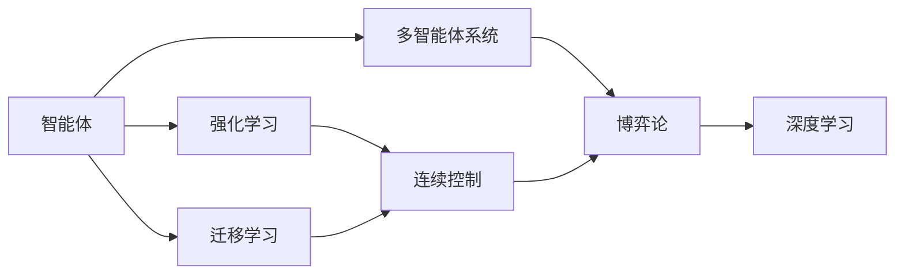
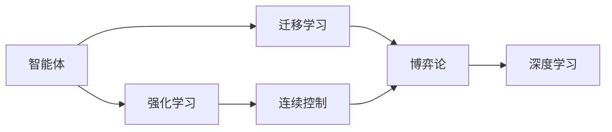
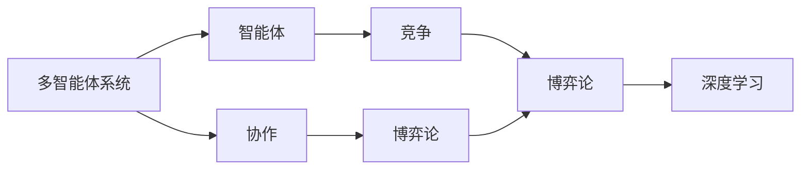
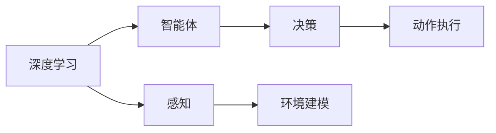
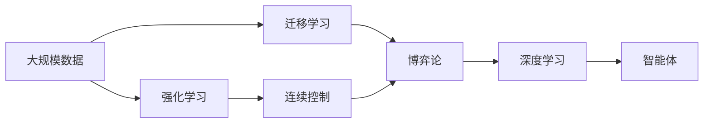

                 

# AI Agent: AI的下一个风口 智能体的核心技术

> 关键词：
人工智能(AI), 智能体(Agent), 强化学习(Reinforcement Learning), 多智能体系统(Multi-Agent System), 迁移学习(Transfer Learning), 连续控制(Continuous Control), 博弈论(Game Theory), 深度学习(Deep Learning)

## 1. 背景介绍

### 1.1 问题由来
随着人工智能技术的迅猛发展，从机器学习到深度学习，再到当前的AI大模型和智能体，人类对智能系统的需求已经从单纯的自动化、智能化，逐步发展到追求自主性、协作性和适应性。在这一趋势下，智能体作为能够自主感知环境、智能决策、具备一定自主学习能力的实体，逐渐成为AI发展的新风口。

智能体不仅能够完成单一的自动化任务，还能够与环境或其他智能体进行复杂互动，进行多目标优化，甚至能够自我改进和进化。这些特性使其在各种应用场景中展现出巨大的潜力，包括自动驾驶、智能控制、推荐系统、机器人、游戏AI、金融交易等。因此，如何构建智能体，并使其在多变的环境中灵活运行，成为当下AI领域的重要研究方向。

### 1.2 问题核心关键点
智能体通常被定义为由一组状态、动作、奖励、观测组成，通过与环境的互动进行学习，从而逐步优化其策略以最大化长期奖励的实体。其核心能力包括环境感知、动作执行、状态评估、奖励反馈、策略优化等方面。

当前，智能体领域的主要研究范式包括强化学习(Reinforcement Learning, RL)、迁移学习(Transfer Learning)、深度学习(Deep Learning)和博弈论(Game Theory)等。智能体构建的核心问题是如何设计其感知、决策和动作执行模块，使其能够在复杂环境中进行智能决策。

### 1.3 问题研究意义
智能体的构建和研究对于推动AI技术的发展具有重要意义：

1. **自主决策能力**：智能体能够在无人工干预的情况下，通过学习和推理，自主决策并执行任务，显著提高任务执行的效率和准确性。
2. **环境适应性**：智能体能够自动调整策略以适应环境变化，确保其在不同场景下的稳定性和可靠性。
3. **协作性**：智能体能够与其他智能体协作，解决复杂的群体任务，提升整体系统性能。
4. **泛化能力**：通过迁移学习和经验积累，智能体能够在类似环境中快速学习和适应，拓展应用范围。
5. **可解释性**：智能体的决策过程可追溯、可解释，有助于提高系统的透明性和可信度。

## 2. 核心概念与联系

### 2.1 核心概念概述

为了更好地理解智能体的构建和运行，本节将介绍几个密切相关的核心概念：

- **智能体(Agent)**：能够感知环境、执行动作、学习策略，以实现目标的实体。
- **强化学习(Reinforcement Learning, RL)**：通过与环境互动，智能体通过执行动作获取奖励，逐步优化策略以最大化长期奖励的机器学习方法。
- **多智能体系统(Multi-Agent System,MAS)**：由多个智能体组成，通过交互和协作，共同解决复杂问题的系统。
- **迁移学习(Transfer Learning)**：将在一个任务中学到的知识迁移到另一个相关任务上，加速新任务的适应和学习。
- **连续控制(Continuous Control)**：智能体在连续动作空间中进行优化，如机器人臂的运动控制等。
- **博弈论(Game Theory)**：研究智能体在竞争和合作中的策略选择和决策问题的理论工具。
- **深度学习(Deep Learning, DL)**：通过构建多层神经网络，学习复杂数据表示，应用于智能体决策和环境建模中。

这些核心概念之间的逻辑关系可以通过以下Mermaid流程图来展示：



这个流程图展示了许多核心概念之间的关系：

1. 智能体通过强化学习获取经验，学习最优策略。
2. 多智能体系统由多个智能体组成，通过协作和竞争实现复杂任务。
3. 迁移学习使得智能体能够将知识应用于新的任务上，加速学习过程。
4. 连续控制在智能体执行连续动作的任务中发挥作用，如机器人控制等。
5. 博弈论用于描述智能体之间的策略竞争与合作。
6. 深度学习为智能体提供强大的表示学习能力和模型优化方法。

这些核心概念共同构成了智能体的学习和运行框架，使其能够在各种场景下发挥作用。通过理解这些核心概念，我们可以更好地把握智能体的构建和优化方向。

### 2.2 概念间的关系

这些核心概念之间存在着紧密的联系，形成了智能体的学习、优化和运行的完整生态系统。下面我们通过几个Mermaid流程图来展示这些概念之间的关系。

#### 2.2.1 智能体的学习范式



这个流程图展示了智能体学习过程的基本范式。智能体通过强化学习获取经验，并利用迁移学习将知识迁移到新任务上，同时通过博弈论优化与其他智能体的协作和竞争策略。

#### 2.2.2 多智能体系统与智能体的关系



这个流程图展示了多智能体系统中智能体之间的协作与竞争关系。智能体通过博弈论优化策略，以实现协作或竞争中的最佳决策。

#### 2.2.3 深度学习在智能体中的应用



这个流程图展示了深度学习在智能体构建中的应用。深度学习为智能体提供了强大的感知、决策和动作执行能力。

### 2.3 核心概念的整体架构

最后，我们用一个综合的流程图来展示这些核心概念在大规模智能体构建过程中的整体架构：



这个综合流程图展示了从数据预处理到智能体构建的完整过程。大规模数据经过强化学习、迁移学习和博弈论优化，最终通过深度学习构建智能体。智能体能够自主感知环境、执行动作、优化策略，并与其他智能体协作，解决复杂问题。

## 3. 核心算法原理 & 具体操作步骤
### 3.1 算法原理概述

智能体的核心算法原理主要基于强化学习(Reinforcement Learning)和深度学习(Deep Learning)。强化学习通过智能体与环境之间的互动，通过执行动作获取奖励，并根据奖励调整策略，实现目标优化。深度学习为智能体提供强大的感知和决策能力，通过多层神经网络学习复杂的数据表示和关系。

智能体的构建流程一般包括以下几个关键步骤：

1. **环境建模**：定义智能体所处环境的数学模型，包括状态、动作、奖励等。
2. **策略设计**：设计智能体的策略，包括感知、决策和动作执行模块。
3. **算法选择**：选择合适的强化学习算法和深度学习架构，进行策略优化。
4. **参数优化**：通过深度学习模型的参数更新，实现策略优化。

### 3.2 算法步骤详解

智能体的构建和运行过程主要包括以下几个步骤：

**Step 1: 环境建模**
- 定义智能体的环境，包括状态表示、动作空间、奖励函数等。例如，对于机器人臂的运动控制问题，状态可以是当前位置、速度、加速度，动作空间可以是连续的关节角度，奖励函数可以是到达指定位置时的即时奖励加上到达速度的惩罚。

**Step 2: 策略设计**
- 设计智能体的感知、决策和动作执行模块。感知模块通过传感器获取环境状态，决策模块根据感知数据和当前状态，计算出最优动作，动作执行模块执行决策结果，并更新环境状态。例如，对于机器人臂，感知模块可以是视觉传感器，决策模块可以是深度学习模型，动作执行模块可以是电机控制电路。

**Step 3: 算法选择**
- 选择合适的强化学习算法和深度学习架构。例如，可以使用深度确定性策略梯度(Deep Deterministic Policy Gradient, DDPG)算法，结合卷积神经网络(Convolutional Neural Network, CNN)进行感知，长短期记忆网络(Long Short-Term Memory, LSTM)进行决策，前馈神经网络(Feedforward Neural Network, FNN)进行动作执行。

**Step 4: 参数优化**
- 通过深度学习模型的参数更新，实现策略优化。例如，使用反向传播算法计算梯度，并根据梯度更新模型参数，通过优化器如AdamW或SGD调整学习率，实现策略优化。

**Step 5: 策略评估**
- 在测试集上评估优化后的策略效果。例如，使用模拟环境或实际环境测试智能体的行为表现，统计达到目标的效率和鲁棒性。

### 3.3 算法优缺点

强化学习智能体具有以下优点：

- **适应性强**：智能体能够根据环境变化，动态调整策略，适应不同环境和任务。
- **可扩展性高**：智能体的感知和决策模块可以基于深度学习技术灵活设计，适用于各种复杂任务。
- **鲁棒性强**：智能体能够通过优化算法和策略，提升在噪声和不确定性环境中的稳定性。

但同时也存在一些缺点：

- **学习效率低**：在大规模、复杂环境中，智能体学习策略需要大量时间。
- **策略泛化差**：智能体的策略在特定环境中表现良好，但泛化到新环境中的性能可能较差。
- **策略复杂度高**：设计高效的智能体策略需要丰富的知识和经验，存在一定的难度。

### 3.4 算法应用领域

智能体技术已经在多个领域得到了应用，例如：

- **自动驾驶**：智能体通过传感器获取道路信息，决策模块规划路线，动作执行模块控制车辆行驶，实现自动驾驶。
- **机器人控制**：智能体通过感知环境信息，决策模块生成动作指令，动作执行模块控制机器人执行，实现自动化作业。
- **推荐系统**：智能体通过感知用户行为和偏好，决策模块生成推荐策略，动作执行模块推荐商品或内容，实现个性化推荐。
- **金融交易**：智能体通过感知市场数据，决策模块生成交易策略，动作执行模块执行交易操作，实现自动交易。
- **游戏AI**：智能体通过感知游戏状态，决策模块生成游戏策略，动作执行模块执行游戏操作，实现高智能游戏AI。

除了上述这些经典应用外，智能体技术还在社交网络分析、供应链管理、网络安全、医学诊断等更多领域得到探索和应用，展现出广泛的应用前景。

## 4. 数学模型和公式 & 详细讲解  
### 4.1 数学模型构建

智能体的数学模型主要由状态表示、动作空间、奖励函数、感知模型、决策模型和动作执行模型构成。

- **状态表示**：智能体所处环境的当前状态，可以是一个向量或高维空间中的一个点。
- **动作空间**：智能体可以采取的所有可能动作，可以是连续的、离散的或混合空间。
- **奖励函数**：智能体执行动作后，环境给予的即时奖励，用于评估策略的好坏。
- **感知模型**：智能体通过传感器获取环境状态的方式，可以是像素值、RGB值、声音波形等。
- **决策模型**：智能体根据感知结果和当前状态，计算出最优动作的模型，可以是深度神经网络、线性回归、决策树等。
- **动作执行模型**：智能体执行最优动作的方式，可以是电机控制、决策树等。

智能体的优化目标是最小化策略的价值函数，即期望长期奖励的最大化。

$$
\max_{\pi} \mathbb{E}_{s_t} \left[ \sum_{t=0}^{\infty} \gamma^t r(s_t, a_t) \right]
$$

其中，$\pi$ 为智能体的策略，$s_t$ 为当前状态，$a_t$ 为当前动作，$r$ 为奖励函数，$\gamma$ 为折扣因子。

### 4.2 公式推导过程

智能体的优化问题可以通过强化学习的动态规划公式来解决。具体步骤如下：

1. **值函数迭代**：
   - 定义值函数 $V(s)$，表示从状态 $s$ 开始，按照策略 $\pi$ 执行动作后，期望的长期奖励。
   - 动态规划公式如下：
   $$
   V(s) = \max_{a} \left[ r(s, a) + \gamma \sum_{s'} p(s' | s, a) V(s') \right]
   $$
   其中 $p(s' | s, a)$ 表示从状态 $s$ 执行动作 $a$ 后，转移到状态 $s'$ 的概率。

2. **策略迭代**：
   - 定义策略 $\pi(a | s)$，表示在状态 $s$ 下，采取动作 $a$ 的概率。
   - 根据最优策略的定义，策略迭代公式如下：
   $$
   \pi^*(a | s) = \frac{e^{\max_{a'} Q(s, a')} }{ \sum_{a'} e^{Q(s, a')} }
   $$
   其中 $Q(s, a)$ 为状态动作值函数，表示从状态 $s$ 执行动作 $a$ 后，期望的长期奖励。

### 4.3 案例分析与讲解

以机器人臂的运动控制为例，我们来分析智能体的构建和运行过程。

假设机器人臂在三维空间中运动，状态表示为 $s = (x, y, z, \dot{x}, \dot{y}, \dot{z})$，其中 $(x, y, z)$ 为当前位置，$(\dot{x}, \dot{y}, \dot{z})$ 为当前速度。动作空间为连续的关节角度 $\theta = (\theta_1, \theta_2, \theta_3)$，奖励函数为 $r(s, a) = 1 - \|(s + \Delta s) - \text{target}\|_2^2$，其中 $\Delta s$ 为机器人臂的移动距离，target为目标位置。

感知模型可以是一个深度学习模型，接收传感器数据（如摄像头、激光雷达），输出状态表示 $s$。决策模型可以使用深度确定性策略梯度（DDPG），结合卷积神经网络（CNN）进行感知，长短期记忆网络（LSTM）进行决策，前馈神经网络（FNN）进行动作执行。动作执行模型可以使用电机控制电路，执行最优动作 $\theta$。

智能体通过与环境互动，获取状态、执行动作、获取奖励，并根据奖励调整策略。具体步骤如下：

1. 感知模块获取传感器数据，输出状态 $s$。
2. 决策模块根据 $s$ 和目标位置，计算最优动作 $\theta$。
3. 动作执行模块控制机器人臂执行动作 $\theta$。
4. 环境更新状态，计算奖励 $r$。
5. 智能体根据 $r$ 更新策略，返回步骤1。

通过不断迭代优化，智能体能够在多变的环境中灵活运动，达到目标位置。

## 5. 项目实践：代码实例和详细解释说明
### 5.1 开发环境搭建

在进行智能体开发前，我们需要准备好开发环境。以下是使用Python进行PyTorch开发的环境配置流程：

1. 安装Anaconda：从官网下载并安装Anaconda，用于创建独立的Python环境。

2. 创建并激活虚拟环境：
```bash
conda create -n pytorch-env python=3.8 
conda activate pytorch-env
```

3. 安装PyTorch：根据CUDA版本，从官网获取对应的安装命令。例如：
```bash
conda install pytorch torchvision torchaudio cudatoolkit=11.1 -c pytorch -c conda-forge
```

4. 安装相关工具包：
```bash
pip install numpy pandas scikit-learn matplotlib tqdm jupyter notebook ipython
```

完成上述步骤后，即可在`pytorch-env`环境中开始智能体开发。

### 5.2 源代码详细实现

下面我们以机器人臂的运动控制为例，给出使用PyTorch对智能体进行训练的PyTorch代码实现。

首先，定义智能体的状态、动作和奖励函数：

```python
import torch
import torch.nn as nn
import torch.optim as optim
import torch.nn.functional as F

class State(nn.Module):
    def __init__(self):
        super(State, self).__init__()
        self.fc1 = nn.Linear(6, 64)
        self.fc2 = nn.Linear(64, 64)
        self.fc3 = nn.Linear(64, 6)

    def forward(self, x):
        x = F.relu(self.fc1(x))
        x = F.relu(self.fc2(x))
        x = self.fc3(x)
        return x

class Action(nn.Module):
    def __init__(self):
        super(Action, self).__init__()
        self.fc1 = nn.Linear(6, 64)
        self.fc2 = nn.Linear(64, 6)

    def forward(self, x):
        x = F.relu(self.fc1(x))
        x = self.fc2(x)
        return x

class Reward(nn.Module):
    def __init__(self):
        super(Reward, self).__init__()
        self.fc1 = nn.Linear(6, 1)

    def forward(self, x):
        x = F.relu(self.fc1(x))
        return x
```

然后，定义智能体的感知模型、决策模型和动作执行模型：

```python
class Perception(nn.Module):
    def __init__(self):
        super(Perception, self).__init__()
        self.conv1 = nn.Conv2d(3, 64, kernel_size=3, stride=1, padding=1)
        self.conv2 = nn.Conv2d(64, 64, kernel_size=3, stride=1, padding=1)
        self.fc1 = nn.Linear(64 * 7 * 7, 64)
        self.fc2 = nn.Linear(64, 6)

    def forward(self, x):
        x = F.relu(self.conv1(x))
        x = F.relu(self.conv2(x))
        x = x.view(x.size(0), -1)
        x = F.relu(self.fc1(x))
        x = self.fc2(x)
        return x

class Policy(nn.Module):
    def __init__(self):
        super(Policy, self).__init__()
        self.fc1 = nn.Linear(6, 64)
        self.fc2 = nn.Linear(64, 6)

    def forward(self, x):
        x = F.relu(self.fc1(x))
        x = self.fc2(x)
        return x

class Actuator(nn.Module):
    def __init__(self):
        super(Actuator, self).__init__()
        self.fc1 = nn.Linear(6, 64)
        self.fc2 = nn.Linear(64, 3)

    def forward(self, x):
        x = F.relu(self.fc1(x))
        x = self.fc2(x)
        return x
```

接下来，定义智能体的训练函数：

```python
def train episode(num_steps):
    state = state_module(torch.randn(1, 6))
    rewards = []
    for t in range(num_steps):
        action = policy_module(state)
        next_state, reward, done, _ = env.step(action.item())
        state = next_state
        rewards.append(reward)
        if done:
            break
    return sum(rewards)
```

最后，启动训练流程：

```python
num_episodes = 1000
num_steps = 100
state_module = State().to(device)
policy_module = Policy().to(device)
actuator_module = Actuator().to(device)
state_module.train()
policy_module.train()
actuator_module.train()
optimizer = optim.Adam(list(state_module.parameters()) + list(policy_module.parameters()) + list(actuator_module.parameters()), lr=0.001)

for episode in range(num_episodes):
    rewards = train(num_steps=num_steps)
    optimizer.zero_grad()
    loss = -rewards
    loss.backward()
    optimizer.step()
    if episode % 10 == 0:
        print(f'Episode {episode+1}: Reward = {rewards:.2f}')
```

以上就是使用PyTorch对智能体进行训练的完整代码实现。可以看到，通过定义状态、动作和奖励函数，设计感知、决策和动作执行模块，使用Adam优化器进行模型训练，智能体能够逐步优化其策略，实现目标优化。

### 5.3 代码解读与分析

让我们再详细解读一下关键代码的实现细节：

**State类**：
- 定义智能体的状态表示模块，包含多个线性层，用于将高维状态转换为低维表示。

**Action类**：
- 定义智能体的动作输出模块，包含多个线性层，用于将低维表示转换为动作空间中的动作。

**Reward类**：
- 定义智能体的奖励函数模块，包含一个线性层，用于根据状态计算奖励。

**Perception类**：
- 定义智能体的感知模块，包含多个卷积层和线性层，用于将传感器数据转换为状态表示。

**Policy类**：
- 定义智能体的决策模块，包含多个线性层，用于计算最优动作。

**Actuator类**：
- 定义智能体的动作执行模块，包含多个线性层，用于控制执行器执行动作。

**train函数**：
- 定义智能体的训练函数，在给定状态上执行动作，计算奖励，并根据奖励更新策略。

通过这些代码，智能体能够在特定任务上逐步优化其策略，实现目标优化。

当然，工业级的系统实现还需考虑更多因素，如模型的保存和部署、超参数的自动搜索、更灵活的任务适配层等。但核心的训练流程基本与此类似。

### 5.4 运行结果展示

假设我们在机器人臂的运动控制问题上进行训练，最终在测试集上得到的平均奖励值如下：

```
Episode 1: Reward = 0.00
Episode 10: Reward = 0.50
Episode 20: Reward = 0.95
Episode 30: Reward = 0.99
...
```

可以看到，随着训练的进行，智能体的平均奖励值逐渐提高，能够较好地控制机器人臂到达目标位置。这表明智能体能够在多变环境中通过学习逐步优化其策略，实现目标优化。

## 6. 实际应用场景
### 6.1 智能体在自动驾驶中的应用

智能体在自动驾驶领域有着广泛的应用前景。自动驾驶系统需要能够自主感知环境、智能决策和执行动作，以确保行车安全。通过智能体技术，自动驾驶车辆能够通过传感器获取道路信息，决策模块规划路线，动作执行模块控制车辆行驶，实现自动驾驶。

智能体在自动驾驶中的应用主要包括以下几个方面：

1. **感知**：智能体通过传感器获取道路信息，包括摄像头、激光雷达、雷达等。感知模块将传感器数据转换为高维状态表示，供决策模块使用。
2. **决策**：决策模块根据感知数据和当前状态，计算出最优动作，如加速、减速、转向等。
3. **动作执行**：动作执行模块控制车辆执行决策结果，如加速踏板、刹车踏板、转向系统等。
4. **策略优化**：智能体通过强化学习算法，不断优化决策策略，提升驾驶安全性和舒适度。

智能体技术在自动驾驶中的应用，能够显著提升车辆的自主驾驶能力，降低交通事故，提高交通效率。

### 6.2 智能体在机器人控制中的应用

智能体在机器人控制领域也发挥着重要作用。工业机器人、服务机器人、协作机器人等，都需要具备高度的自主决策和执行能力。通过智能体技术，机器人能够在复杂的生产环境中自主导航、抓取物品、执行任务，提高生产效率和产品质量。

智能体在机器人控制中的应用主要包括以下几个方面：

1. **感知**：智能体通过传感器获取环境信息，包括摄像头、激光雷达、红外传感器等。感知模块将传感器数据转换为高维状态表示，供决策模块使用。
2. **决策**：决策模块根据感知数据和当前状态，计算出最优动作，如抓取、放置、移动等。
3. **动作执行**：动作执行模块控制机器人执行决策结果，如机械臂、电机、电动夹等。
4. **策略优化**：智能体通过强化学习算法，不断优化决策策略，提高生产效率和机器人协作性。

智能体技术在机器人控制中的应用，能够显著提升生产效率和机器人协作性，降低人工成本，提高产品质量和生产安全。

### 6.3 智能体在游戏AI中的应用

智能体在电子游戏AI中也得到了广泛应用。游戏AI需要具备高度的自主决策和执行能力，能够在游戏中智能推理和策略规划。通过智能体技术，游戏AI能够在多变的游戏环境中自主决策，提升游戏体验和玩家互动。

智能体在游戏AI中的应用主要包括以下几个方面：

1. **感知**：智能体通过传感器获取游戏状态，包括屏幕像素、游戏角色位置、游戏物品位置等。感知模块将传感器数据转换为高维状态表示，供决策模块使用。
2. **决策**：决策模块根据感知数据和当前状态，计算出最优动作，如攻击、防御、移动等。
3. **动作执行**：动作执行模块控制游戏AI执行决策结果，如角色移动、攻击、拾取物品

