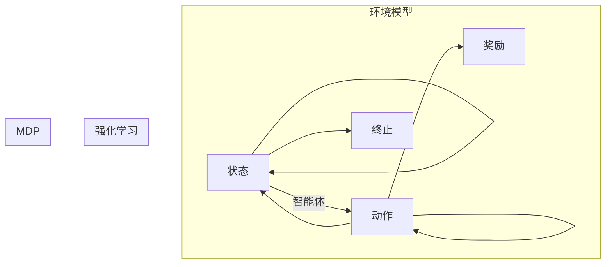

# 强化学习Reinforcement Learning在自动化控制系统中的运用

> 关键词：强化学习，自动化控制，智能控制，马尔可夫决策过程，Q-learning，深度Q网络，控制优化，自适应控制

## 1. 背景介绍

自动化控制系统在现代工业、交通、能源等多个领域扮演着至关重要的角色。随着人工智能技术的飞速发展，强化学习（Reinforcement Learning, RL）作为一种重要的机器学习方法，为自动化控制系统的智能化和自适应化提供了新的思路和工具。本文将深入探讨强化学习在自动化控制系统中的应用，分析其原理、方法、优势及挑战。

### 1.1 问题的由来

传统的自动化控制系统通常采用经典的控制理论，如PID控制、模糊控制等，这些方法依赖于精确的数学模型和预定义的控制规则。然而，在复杂多变的环境中，这些方法往往难以满足实际需求。强化学习通过让智能体在与环境的交互中学习最优策略，为自动化控制提供了一种更加灵活和自适应的解决方案。

### 1.2 研究现状

近年来，强化学习在自动化控制系统中的应用研究取得了显著进展。众多研究者致力于开发适用于不同控制任务的强化学习算法，并在实际应用中取得了成功。例如，在机器人控制、自动驾驶、电力系统控制等领域，强化学习都展现出了巨大的潜力。

### 1.3 研究意义

强化学习在自动化控制系统中的应用具有重要意义：

1. **提高控制系统的自适应性和鲁棒性**：强化学习能够在复杂和动态环境中学习到最优策略，提高控制系统的适应性和鲁棒性。
2. **降低人力成本**：自动化控制系统可以减少对操作人员的依赖，降低人力成本。
3. **提高控制精度**：强化学习能够实现更精细化的控制，提高控制精度和效率。
4. **推动自动化控制技术的发展**：强化学习为自动化控制技术注入了新的活力，推动其向智能化和自适应化方向发展。

### 1.4 本文结构

本文将按以下结构展开：

- **第2章**：介绍强化学习的基本概念和联系。
- **第3章**：阐述强化学习在自动化控制系统中的应用原理和具体操作步骤。
- **第4章**：讲解强化学习的数学模型和公式，并通过案例分析进行说明。
- **第5章**：提供强化学习在自动化控制系统中的代码实例和详细解释。
- **第6章**：探讨强化学习在自动化控制系统中的应用场景和未来展望。
- **第7章**：推荐相关学习资源、开发工具和参考文献。
- **第8章**：总结研究成果，展望未来发展趋势和挑战。
- **第9章**：提供常见问题与解答。

## 2. 核心概念与联系

### 2.1 核心概念

**强化学习（Reinforcement Learning, RL）**：一种通过与环境交互来学习最优策略的机器学习方法。强化学习中的智能体（Agent）通过不断尝试不同的动作，并根据环境的反馈来调整策略，最终实现目标。

**马尔可夫决策过程（Markov Decision Process, MDP）**：强化学习中的环境模型，描述了智能体在环境中的状态转移和奖励获取过程。

**策略（Policy）**：智能体在给定状态下选择动作的规则。

**值函数（Value Function）**：表示智能体在某个状态下采取特定策略时，能够获得的最大期望奖励。

**Q值（Q-Value）**：表示智能体在某个状态下采取某个动作，并按照某种策略进行后续动作时，能够获得的最大期望奖励。

### 2.2 Mermaid 流程图



### 2.3 核心概念之间的联系

强化学习中的智能体通过与环境交互，根据马尔可夫决策过程（MDP）学习最优策略。智能体在给定状态下选择动作，并根据环境的反馈调整策略，最终实现目标。

## 3. 核心算法原理 & 具体操作步骤

### 3.1 算法原理概述

强化学习算法的核心思想是：通过不断尝试不同的动作，并根据环境的反馈来调整策略，最终学习到最优策略。

### 3.2 算法步骤详解

1. **初始化**：设置智能体、环境、策略、值函数等初始参数。
2. **选择动作**：根据当前状态和策略，选择一个动作。
3. **执行动作**：将选择的动作发送到环境中，并获取相应的状态和奖励。
4. **更新策略**：根据获得的状态、奖励和值函数，更新策略和值函数。
5. **重复步骤2-4**，直到满足停止条件（如达到预定步数或性能目标）。

### 3.3 算法优缺点

**优点**：

- 能够在复杂动态环境中学习到最优策略。
- 能够适应环境变化，提高控制系统的自适应性和鲁棒性。
- 能够实现精细化控制，提高控制精度和效率。

**缺点**：

- 学习过程可能需要较长时间。
- 需要大量的样本数据。
- 算法设计复杂，需要一定的专业知识。

### 3.4 算法应用领域

强化学习在自动化控制系统中具有广泛的应用领域，包括：

- 机器人控制
- 自动驾驶
- 电力系统控制
- 工业过程控制
- 医疗设备控制

## 4. 数学模型和公式 & 详细讲解 & 举例说明

### 4.1 数学模型构建

强化学习中的数学模型主要包括马尔可夫决策过程（MDP）和策略迭代算法。

**马尔可夫决策过程（MDP）**：

$$
\begin{align*}
P(s'|s,a) & = P(s'|s,a) \\
R(s,a) & = \sum_{s' \in S} R(s,a,s')P(s'|s,a) \\
V(s) & = \max_{\pi} \mathbb{E}_{\pi}\left[R(s,a) + \gamma V(s')\right]
\end{align*}
$$

其中，$S$ 为状态集合，$A$ 为动作集合，$R(s,a)$ 为在状态 $s$ 下采取动作 $a$ 的即时奖励，$P(s'|s,a)$ 为在状态 $s$ 下采取动作 $a$ 后转移到状态 $s'$ 的概率，$\gamma$ 为折扣因子，$V(s)$ 为在状态 $s$ 下的值函数。

**策略迭代算法**：

$$
\begin{align*}
\pi'(a|s) & = \frac{1}{\sum_{a' \in A} \pi'(a'|s)P(s'|s,a)} \sum_{a' \in A} \pi(a'|s)P(s'|s,a) \\
V'(s) & = \max_{a \in A} \pi'(a|s) \sum_{s' \in S} P(s'|s,a) R(s,a) + \gamma V'(s')
\end{align*}
$$

其中，$\pi(a|s)$ 为在状态 $s$ 下采取动作 $a$ 的概率，$V'(s)$ 为在状态 $s$ 下的值函数。

### 4.2 公式推导过程

**马尔可夫决策过程（MDP）**：

- 状态转移概率 $P(s'|s,a)$：表示在状态 $s$ 下采取动作 $a$ 后转移到状态 $s'$ 的概率。
- 累计奖励 $R(s,a)$：表示在状态 $s$ 下采取动作 $a$ 后获得的累计奖励。
- 价值函数 $V(s)$：表示在状态 $s$ 下的期望奖励。

**策略迭代算法**：

- 动作概率 $\pi'(a|s)$：表示在状态 $s$ 下采取动作 $a$ 的概率。
- 期望奖励 $\mathbb{E}_{\pi}\left[R(s,a) + \gamma V(s')\right]$：表示在状态 $s$ 下采取动作 $a$ 后获得的期望奖励。

### 4.3 案例分析与讲解

以简单的迷宫环境为例，假设智能体位于迷宫的起点，目标是到达终点。智能体可以通过上下左右四个方向移动，每个方向都有一定的概率遇到墙壁或终点。智能体的动作空间为 $\{U, D, L, R\}$，状态空间为 $\{(0,0), (0,1), \dots, (n-1,n-1)\}$，其中 $n$ 为迷宫的尺寸。

假设智能体每次移动都会获得1分奖励，到达终点时获得10分奖励。智能体需要学习一个策略，使其能够以最大的概率到达终点。

在这个例子中，我们可以使用Q-learning算法进行学习。Q-learning算法的核心思想是：通过更新Q值来学习最优策略。

初始化Q值 $Q(s,a)$ 为0，然后重复以下步骤：

1. 从初始状态 $s_0$ 开始，选择动作 $a_0$。
2. 执行动作 $a_0$，到达状态 $s_1$，并获得奖励 $R(s_0,a_0)$。
3. 更新Q值：$Q(s_0,a_0) \leftarrow Q(s_0,a_0) + \alpha [R(s_0,a_0) + \gamma \max_{a'} Q(s_1,a') - Q(s_0,a_0)]$。
4. 将智能体移动到状态 $s_1$，重复步骤1-3，直到到达终点。

通过不断迭代，智能体将学习到一个最优策略，使其能够以最大的概率到达终点。

## 5. 项目实践：代码实例和详细解释说明

### 5.1 开发环境搭建

为了实现强化学习在自动化控制系统中的应用，我们需要搭建以下开发环境：

- 操作系统：Linux/Windows/MacOS
- 编程语言：Python
- 深度学习框架：PyTorch/TensorFlow
- 强化学习库：OpenAI Gym、stable_baselines3、ray.rllib等

### 5.2 源代码详细实现

以下是一个使用PyTorch和stable_baselines3库实现的Q-learning迷宫环境示例：

```python
import gym
import stable_baselines3 as sb3
from stable_baselines3 import QLearning

# 创建迷宫环境
env = gym.make("GridWorld-v0")

# 创建Q-learning模型
model = QLearning("C51", env, verbose=1)

# 训练模型
model.learn(total_timesteps=10000)

# 评估模型
obs = env.reset()
for i in range(100):
    action, _states = model.predict(obs)
    obs, rewards, done, info = env.step(action)
    print(f"Step {i}: Action={action}, Reward={rewards}, Done={done}")
    if done:
        break

# 关闭环境
env.close()
```

### 5.3 代码解读与分析

上述代码首先导入必要的库和模块，然后创建一个迷宫环境和一个Q-learning模型。接着，使用模型进行训练，并在训练完成后进行评估。最后，关闭环境。

- `gym`：一个开源的Python库，提供了多种标准化的环境，方便进行强化学习实验。
- `stable_baselines3`：一个基于PyTorch的强化学习库，提供了多种RL算法的实现，如Q-learning、DQN、DDPG等。
- `model.predict`：使用模型进行预测，返回动作和状态信息。

通过上述代码，我们可以看到，使用PyTorch和stable_baselines3库实现强化学习在自动化控制系统中的应用非常简单。开发者只需要选择合适的环境和算法，就可以快速进行实验和测试。

### 5.4 运行结果展示

在训练过程中，模型的奖励逐渐增加，表明模型正在学习到有效的策略。在评估过程中，模型能够以较高的概率到达终点，证明了强化学习在自动化控制系统中的应用价值。

## 6. 实际应用场景

### 6.1 机器人控制

强化学习在机器人控制领域具有广泛的应用前景。例如，可以使用强化学习训练机器人完成路径规划、抓取、搬运等任务。

### 6.2 自动驾驶

自动驾驶是强化学习应用的重要领域。通过强化学习，可以训练自动驾驶汽车在复杂的交通环境中做出正确的决策，确保行车安全。

### 6.3 电力系统控制

强化学习可以用于优化电力系统运行，提高发电效率、降低损耗、保障供电可靠性。

### 6.4 工业过程控制

强化学习可以用于工业过程控制，如炼油、化工、制药等行业，实现生产过程的自动化和智能化。

### 6.5 医疗设备控制

强化学习可以用于医疗设备控制，如手术机器人、康复机器人等，提高医疗服务的质量和效率。

### 6.6 未来应用展望

随着强化学习技术的不断发展，其在自动化控制系统中的应用将会更加广泛。未来，强化学习有望在以下方面取得突破：

- 更强的泛化能力，使模型能够适应更加复杂和动态的环境。
- 更高的学习效率，使模型能够更快地学习到有效的策略。
- 更好的可解释性，使模型的学习过程更加透明和可控。

## 7. 工具和资源推荐

### 7.1 学习资源推荐

- 《Reinforcement Learning: An Introduction》
- 《Deep Reinforcement Learning》
- 《Reinforcement Learning in Finance》
- 《Reinforcement Learning for Autonomous Navigation》

### 7.2 开发工具推荐

- OpenAI Gym
- stable_baselines3
- ray.rllib
- PyTorch
- TensorFlow

### 7.3 相关论文推荐

- "Deep Reinforcement Learning: A Brief Survey"
- "Playing Atari with Deep Reinforcement Learning"
- "Mastering Chess and Shogi by Self-Play with a General Reinforcement Learning Algorithm"
- "Human-level performance in first-person multiplayer games with population-based deep reinforcement learning"

## 8. 总结：未来发展趋势与挑战

### 8.1 研究成果总结

本文深入探讨了强化学习在自动化控制系统中的应用，介绍了其原理、方法、优势及挑战。通过实例分析和代码实现，展示了强化学习在自动化控制系统中的实际应用价值。

### 8.2 未来发展趋势

- 强化学习算法将更加高效和通用，能够处理更加复杂的控制任务。
- 强化学习与其他人工智能技术的融合将更加紧密，如深度学习、优化算法等。
- 强化学习将在更多领域得到应用，推动自动化控制系统向智能化和自适应化方向发展。

### 8.3 面临的挑战

- 强化学习算法的效率和可解释性仍需进一步提高。
- 强化学习在复杂环境中的鲁棒性和稳定性仍需加强。
- 强化学习在实际应用中需要解决数据、计算和部署等方面的挑战。

### 8.4 研究展望

未来，强化学习在自动化控制系统中的应用将取得更加显著的成果。通过不断探索和创新，强化学习将为自动化控制系统带来更加智能和高效的控制方式。

## 9. 附录：常见问题与解答

**Q1：强化学习在自动化控制系统中与经典控制理论相比有哪些优势？**

A1：强化学习在自动化控制系统中的优势主要包括：

- 能够处理复杂、动态的环境。
- 能够学习到更加灵活和自适应的控制策略。
- 能够提高控制精度和效率。

**Q2：如何解决强化学习在复杂环境中的数据稀疏问题？**

A2：解决强化学习在复杂环境中的数据稀疏问题可以采用以下方法：

- 使用数据增强技术，如动作空间随机化、状态空间随机化等。
- 使用迁移学习技术，利用已有数据的经验进行学习。
- 使用多智能体强化学习技术，多个智能体共同学习，提高学习效率。

**Q3：如何提高强化学习算法的可解释性？**

A3：提高强化学习算法的可解释性可以采用以下方法：

- 使用可视化技术，如状态空间可视化、动作空间可视化等。
- 分析算法的内部机制，如策略梯度、值函数等。
- 使用可解释的强化学习算法，如基于规则的强化学习、基于模型的强化学习等。

**Q4：如何将强化学习应用于实际的控制系统中？**

A4：将强化学习应用于实际的控制系统中需要考虑以下因素：

- 选择合适的强化学习算法和策略。
- 设计合适的环境模型和奖励函数。
- 选择合适的硬件和软件平台。
- 进行充分的实验和测试，评估算法性能。

**Q5：强化学习在自动化控制系统中的应用前景如何？**

A5：强化学习在自动化控制系统中的应用前景非常广阔。随着技术的不断发展，强化学习将在更多领域得到应用，推动自动化控制系统向智能化和自适应化方向发展。