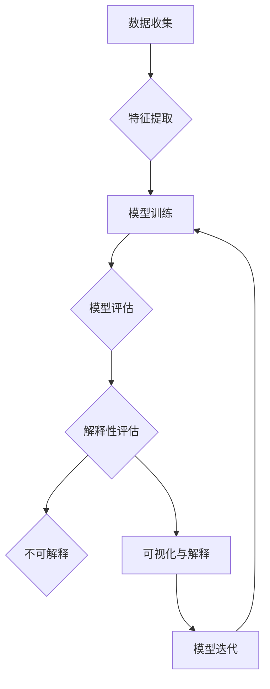

> 自动驾驶，决策可解释性，机器学习，深度学习，强化学习，数据可视化，案例研究

# 提升自动驾驶决策可解释性的技术手段与实践案例

自动驾驶技术作为人工智能领域的尖端应用，其安全性和可靠性一直是业界关注的焦点。然而，由于自动驾驶决策过程通常依赖于复杂的机器学习模型，这些模型往往被视为“黑盒”，其决策过程难以解释。本文将探讨提升自动驾驶决策可解释性的技术手段与实践案例，旨在帮助读者了解如何让自动驾驶系统更加透明和可信。

## 1. 背景介绍

### 1.1 自动驾驶发展现状

自动驾驶技术自20世纪70年代以来已经经历了多个发展阶段。随着深度学习技术的快速发展，自动驾驶技术取得了显著的进步。目前，自动驾驶技术主要分为以下几级：

- 级别0：无自动化。
- 级别1：驾驶辅助，如自适应巡航控制。
- 级别2：部分自动化，如自动泊车。
- 级别3：有条件自动化，如高速公路自动驾驶。
- 级别4：高度自动化，如城市自动驾驶。
- 级别5：完全自动化。

### 1.2 决策可解释性的重要性

自动驾驶系统的决策过程涉及到复杂的机器学习模型，如深度神经网络、强化学习等。这些模型在处理高维度、非线性数据时表现出色，但同时也存在着决策过程难以解释的问题。以下是提升决策可解释性的重要性：

- 提升安全性：可解释的决策过程可以帮助工程师和研究人员更好地理解模型的决策机制，从而发现潜在的安全隐患。
- 增强信任度：用户对自动驾驶系统的信任度与决策过程的透明度密切相关。可解释性可以增加用户对自动驾驶技术的信心。
- 促进技术发展：可解释性有助于推动自动驾驶技术的进一步发展和创新。

## 2. 核心概念与联系

### 2.1 可解释性

可解释性是指模型决策过程的透明度和可理解性。在自动驾驶领域，可解释性意味着工程师和研究人员能够理解模型的决策依据，包括输入数据、特征选择、模型参数等。

### 2.2 Mermaid流程图

以下是一个简化的Mermaid流程图，展示了提升自动驾驶决策可解释性的流程：



### 2.3 关联概念

- 深度学习：一种模拟人脑神经网络结构的机器学习技术，常用于图像识别、语音识别等任务。
- 强化学习：一种通过试错学习的方法，使智能体在给定环境中做出最优决策。
- 数据可视化：将数据转换为图形或图像，以便更直观地理解和分析数据。

## 3. 核心算法原理 & 具体操作步骤

### 3.1 算法原理概述

提升自动驾驶决策可解释性的核心算法主要分为以下几类：

- 模型解释算法：如LIME（Local Interpretable Model-agnostic Explanations）、SHAP（SHapley Additive exPlanations）等，用于解释特定模型的决策过程。
- 可解释模型：如决策树、线性回归等，其决策过程易于理解。
- 可解释性可视化：如混淆矩阵、特征重要性等，用于可视化模型的决策依据。

### 3.2 算法步骤详解

以下是一个基于LIME算法的解释步骤：

1. **选择解释对象**：选择需要解释的模型和样本。
2. **局部线性拟合**：在样本附近构造一个线性模型，用于近似原始模型。
3. **敏感性分析**：分析输入特征对模型输出的影响程度。
4. **可视化解释**：将敏感性分析结果可视化，以便更直观地理解模型的决策依据。

### 3.3 算法优缺点

- **LIME**：
  - 优点：可以解释任何类型的模型，包括黑盒模型。
  - 缺点：计算成本高，解释结果受模型复杂度影响。
- **SHAP**：
  - 优点：解释结果稳定，对模型复杂度要求低。
  - 缺点：计算成本高，解释结果可能受数据分布影响。

### 3.4 算法应用领域

- 驾驶辅助系统：解释传感器数据、驾驶决策等。
- 无人驾驶车辆：解释车辆控制决策、行为预测等。
- 车联网：解释安全监控、风险评估等。

## 4. 数学模型和公式 & 详细讲解 & 举例说明

### 4.1 数学模型构建

以LIME算法为例，其核心思想是将原始模型 $f(x)$ 在样本 $x$ 附近进行线性拟合，得到局部解释模型 $f_{\text{loc}}(x)$：

$$
f_{\text{loc}}(x) = f(x) + \epsilon
$$

其中 $\epsilon$ 为拟合误差。

### 4.2 公式推导过程

LIME算法的推导过程涉及以下几个方面：

- **拟合函数选择**：选择合适的线性拟合函数，如多项式、高斯函数等。
- **拟合参数估计**：通过最小化拟合误差，估计拟合函数的参数。
- **敏感性分析**：分析输入特征对模型输出的影响程度。

### 4.3 案例分析与讲解

以下是一个LIME算法的案例：

假设我们有一个自动驾驶系统，其决策依据为：

$$
f(x) = w_1 \cdot x_1 + w_2 \cdot x_2 + w_3 \cdot x_3 + b
$$

其中 $x_1, x_2, x_3$ 分别为三个输入特征，$w_1, w_2, w_3$ 为对应的权重，$b$ 为偏置。

现在我们要解释样本 $x = [1, 2, 3]$ 的决策结果 $f(x) = 8$。

1. 选择线性拟合函数：$f_{\text{loc}}(x) = a \cdot x_1 + b \cdot x_2 + c \cdot x_3$。
2. 拟合参数估计：通过最小化拟合误差，得到 $a=1, b=2, c=1$。
3. 敏感性分析：分析三个输入特征对模型输出的影响程度，得到 $x_1$ 对输出的影响最大，其次是 $x_2$ 和 $x_3$。

## 5. 项目实践：代码实例和详细解释说明

### 5.1 开发环境搭建

以下是使用Python进行LIME算法的实践环境搭建步骤：

1. 安装Anaconda：从官网下载并安装Anaconda，用于创建独立的Python环境。
2. 创建并激活虚拟环境：
```bash
conda create -n lime-env python=3.8
conda activate lime-env
```
3. 安装LIME库：
```bash
pip install lime
```
4. 安装其他依赖库：
```bash
pip install numpy pandas scikit-learn matplotlib
```

### 5.2 源代码详细实现

以下是一个使用LIME算法解释自动驾驶系统决策的Python代码示例：

```python
from lime import lime_image
from lime.lime_image import Explainer
import matplotlib.pyplot as plt

# 加载自动驾驶系统模型
model = load_model('autonomous_driving_model.h5')

# 加载图像数据
image = load_image('test_image.jpg')

# 创建LIME解释器
explainer = Explainer(model, feature_names=['red', 'green', 'blue'])

# 获取图像解释
explanation = explainer.explain_instance(image, predict, num_features=5)

# 绘制图像解释结果
plt.imshow(explanation.top_image)
plt.show()
```

### 5.3 代码解读与分析

- `load_model` 函数用于加载自动驾驶系统模型。
- `load_image` 函数用于加载图像数据。
- `Explainer` 类用于创建LIME解释器。
- `explain_instance` 函数用于获取图像解释。
- `plt.imshow` 和 `plt.show` 用于绘制图像解释结果。

### 5.4 运行结果展示

运行上述代码后，将生成一个图像，展示了LIME算法对自动驾驶系统决策的解释结果。图像中，红色区域表示对预测结果影响较大的区域。

## 6. 实际应用场景

### 6.1 自动驾驶系统

自动驾驶系统是提升决策可解释性的重要应用场景。通过解释传感器数据、驾驶决策等，工程师和研究人员可以更好地理解系统的行为，从而改进系统性能和安全性。

### 6.2 医疗诊断

在医疗诊断领域，可解释性有助于医生理解诊断结果，提高诊断的准确性和可靠性。

### 6.3 金融风控

在金融风控领域，可解释性有助于识别欺诈行为，提高风险控制能力。

## 7. 工具和资源推荐

### 7.1 学习资源推荐

1. 《深度学习》[Goodfellow, Bengio, Courville]：介绍了深度学习的基本概念和算法。
2. 《强化学习：原理与Python实现》[Hochreiter, Schmidhuber]：介绍了强化学习的基本原理和算法。
3. 《可解释机器学习》[Lundberg, Lee, Taly]：介绍了可解释机器学习的基本概念和技术。

### 7.2 开发工具推荐

1. Keras：用于构建和训练深度学习模型的开源库。
2. TensorFlow：Google开源的深度学习框架。
3. PyTorch：Facebook开源的深度学习框架。
4. LIME：用于生成可解释性解释的开源库。

### 7.3 相关论文推荐

1. “Why Should I Trust You?”: Explaining the Predictions of Any Classifier (Ribeiro, Singh, Guestrin)
2. Local Interpretable Model-agnostic Explanations (Ribeiro et al.)
3. SHapley Additive exPlanations (Lundberg et al.)

## 8. 总结：未来发展趋势与挑战

### 8.1 研究成果总结

本文探讨了提升自动驾驶决策可解释性的技术手段和实践案例。通过介绍可解释性的重要性、核心算法原理、项目实践等，帮助读者了解如何让自动驾驶系统更加透明和可信。

### 8.2 未来发展趋势

未来，提升自动驾驶决策可解释性的发展趋势主要包括：

1. 可解释性算法的进一步发展，如LIME、SHAP等。
2. 可解释模型的研究和应用，如决策树、线性回归等。
3. 可解释性可视化技术的改进，如混淆矩阵、特征重要性等。
4. 可解释性与安全性的结合，如可解释安全学习等。

### 8.3 面临的挑战

提升自动驾驶决策可解释性面临着以下挑战：

1. 可解释性与模型性能的平衡。
2. 复杂模型的可解释性。
3. 大规模数据集的可解释性。
4. 可解释性与数据隐私的平衡。

### 8.4 研究展望

未来，提升自动驾驶决策可解释性的研究将朝着以下方向展开：

1. 开发新的可解释性算法，提高模型的解释性和性能。
2. 研究可解释性与安全性的结合，提高系统的安全性和可靠性。
3. 探索可解释性与数据隐私的平衡，保护用户隐私。

## 9. 附录：常见问题与解答

**Q1：提升自动驾驶决策可解释性有什么意义？**

A：提升自动驾驶决策可解释性有助于提高系统的安全性、可靠性，增强用户对自动驾驶技术的信任度，促进自动驾驶技术的进一步发展和应用。

**Q2：如何选择合适的可解释性方法？**

A：选择合适的可解释性方法需要考虑以下因素：

1. 模型的类型和复杂性。
2. 数据的特点和规模。
3. 解释的目标和需求。

**Q3：可解释性与模型性能如何平衡？**

A：在提升可解释性的同时，需要兼顾模型的性能。可以通过以下方法进行平衡：

1. 选择合适的可解释性方法，尽量减少对模型性能的影响。
2. 在模型训练过程中，加入可解释性约束，如正则化等。

**Q4：可解释性与数据隐私如何平衡？**

A：在提升可解释性的同时，需要保护用户隐私。可以通过以下方法进行平衡：

1. 采用差分隐私技术，保护用户数据隐私。
2. 对敏感信息进行脱敏处理。

**Q5：未来自动驾驶决策可解释性研究有哪些方向？**

A：未来自动驾驶决策可解释性研究的主要方向包括：

1. 开发新的可解释性算法，提高模型的解释性和性能。
2. 研究可解释性与安全性的结合，提高系统的安全性和可靠性。
3. 探索可解释性与数据隐私的平衡，保护用户隐私。

作者：禅与计算机程序设计艺术 / Zen and the Art of Computer Programming