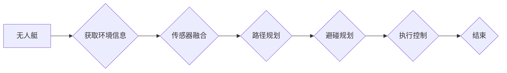

# 无人艇的避碰规划原理与方法

> 关键词：无人艇，避碰规划，路径规划，机器学习，传感器融合，多智能体系统

## 1. 背景介绍

随着科技的飞速发展，无人艇作为一种新兴的智能航行器，在海洋资源勘探、海上巡逻、环境监测等领域展现出巨大的应用潜力。然而，无人艇在自主航行过程中，面临着复杂的海洋环境和多目标避碰的挑战。如何实现无人艇的智能避碰规划，成为推动无人艇技术发展的重要课题。

## 2. 核心概念与联系

### 2.1 无人艇避碰规划核心概念

#### 2.1.1 无人艇

无人艇，即无人驾驶船舶，是一种无需人工操控，能够自主航行、执行任务的船舶。根据动力方式，无人艇可分为电动无人艇、燃油无人艇等；根据航行环境，可分为水面无人艇、水下无人艇等。

#### 2.1.2 避碰规划

避碰规划是指无人艇在航行过程中，根据自身状态、环境信息和其他航行器的状态，规划出一条安全、高效的航行路径，避免与周围航行器发生碰撞。

#### 2.1.3 路径规划

路径规划是指为无人艇在复杂环境中规划一条从起点到终点的可行路径。路径规划的目的是确保无人艇能够安全、高效地到达目的地。

#### 2.1.4 传感器融合

传感器融合是指将多个传感器获取的原始数据进行处理、融合，以获得更准确、更全面的环境信息。在无人艇避碰规划中，传感器融合技术可以帮助无人艇获取更精确的障碍物位置、速度等信息。

#### 2.1.5 多智能体系统

多智能体系统是指由多个智能体组成的系统，各智能体之间可以相互通信、协同完成任务。在无人艇避碰规划中，多智能体系统可以协同规划航行路径，提高避碰成功率。

### 2.2 Mermaid 流程图



## 3. 核心算法原理 & 具体操作步骤

### 3.1 算法原理概述

无人艇避碰规划算法通常采用以下步骤：

1. 获取环境信息：通过传感器获取障碍物位置、速度等信息。
2. 传感器融合：对传感器数据进行处理、融合，以获得更准确、更全面的环境信息。
3. 路径规划：根据环境信息和无人艇状态，规划出一条安全、高效的航行路径。
4. 避碰规划：在路径规划的基础上，进一步优化路径，确保无人艇不会与障碍物发生碰撞。
5. 执行控制：根据避碰规划结果，控制无人艇的航行方向和速度，确保其安全航行。

### 3.2 算法步骤详解

#### 3.2.1 获取环境信息

无人艇通过多种传感器获取环境信息，如：

- 船载雷达：获取周围船舶的位置、速度等信息。
- 激光雷达（Lidar）：获取周围障碍物的三维位置和形状信息。
- 水声传感器：获取水下障碍物的位置信息。
- 视觉传感器：获取周围环境的图像信息。

#### 3.2.2 传感器融合

传感器融合技术可以将不同传感器获取的原始数据进行处理、融合，以获得更准确、更全面的环境信息。常见的传感器融合方法包括：

- 卡尔曼滤波：通过线性卡尔曼滤波器对传感器数据进行滤波，去除噪声。
- 传感器融合算法：如粒子滤波、无迹卡尔曼滤波等，适用于非线性非高斯问题。

#### 3.2.3 路径规划

路径规划算法可以根据不同的任务需求选择不同的规划方法，如：

- 启发式搜索算法：如A*、Dijkstra等。
- 碰撞检测算法：如RRT、RRT*等。
- 模糊逻辑算法：如模糊PID控制等。

#### 3.2.4 避碰规划

在路径规划的基础上，进一步优化路径，确保无人艇不会与障碍物发生碰撞。常见的避碰规划方法包括：

- 动态窗口法：根据无人艇的速度和加速度，计算无人艇在一段时间内与障碍物的相对位置。
- 轨迹优化：通过优化无人艇的轨迹，使其在满足避碰要求的同时，尽量减少能耗和航行时间。

#### 3.2.5 执行控制

根据避碰规划结果，控制无人艇的航行方向和速度，确保其安全航行。常见的执行控制方法包括：

- PID控制：通过PID控制器调整无人艇的航行方向和速度。
- 模糊控制：通过模糊逻辑控制器调整无人艇的航行方向和速度。

### 3.3 算法优缺点

#### 3.3.1 优点

- 安全性：通过避碰规划，可以避免无人艇与障碍物发生碰撞，确保航行安全。
- 高效性：通过优化路径，可以提高无人艇的航行速度和效率。
- 智能性：通过传感器融合和智能控制，可以使无人艇具备更强的自主航行能力。

#### 3.3.2 缺点

- 复杂性：无人艇避碰规划算法涉及多个学科领域，算法设计较为复杂。
- 实时性：在实时性要求较高的场景下，算法的实时性难以保证。
- 可扩展性：算法的可扩展性较差，难以适应复杂多变的航行环境。

### 3.4 算法应用领域

无人艇避碰规划算法可应用于以下领域：

- 海洋资源勘探
- 海上巡逻
- 环境监测
- 航运物流
- 军事应用

## 4. 数学模型和公式 & 详细讲解 & 举例说明

### 4.1 数学模型构建

无人艇避碰规划数学模型主要包括以下部分：

- 无人艇运动学模型：描述无人艇的运动状态和运动方程。
- 障碍物模型：描述障碍物的位置、速度、形状等信息。
- 动力模型：描述无人艇的推进力和阻力。

### 4.2 公式推导过程

#### 4.2.1 无人艇运动学模型

无人艇在二维平面上的运动学模型可表示为：

$$
\begin{cases}
x(t) = x_0 + v_t \cos\theta \\
y(t) = y_0 + v_t \sin\theta
\end{cases}
$$

其中，$x_0$、$y_0$ 为无人艇初始位置，$v_t$ 为无人艇速度，$\theta$ 为无人艇航向角。

#### 4.2.2 障碍物模型

障碍物在二维平面上的模型可表示为：

$$
\text{障碍物} = \{ (x_i, y_i) \mid (x_i - x)^2 + (y_i - y)^2 \leq R^2 \}
$$

其中，$R$ 为障碍物半径。

#### 4.2.3 动力模型

无人艇的动力模型可表示为：

$$
F = k_1 v_t + k_2 v_t^2
$$

其中，$F$ 为无人艇推进力，$k_1$ 和 $k_2$ 为动力系数。

### 4.3 案例分析与讲解

假设一个简单的避碰场景：无人艇与一个固定障碍物相遇，需要规划一条避碰路径。

#### 4.3.1 环境信息

- 无人艇初始位置 $(x_0, y_0)$、航向角 $\theta$、速度 $v_t$。
- 障碍物位置 $(x_i, y_i)$、半径 $R$。

#### 4.3.2 路径规划

采用A*算法进行路径规划，寻找一条从无人艇当前位置到障碍物外侧的安全路径。

#### 4.3.3 避碰规划

在路径规划的基础上，进一步优化路径，确保无人艇不会与障碍物发生碰撞。

#### 4.3.4 执行控制

根据避碰规划结果，控制无人艇的航行方向和速度，确保其安全航行。

## 5. 项目实践：代码实例和详细解释说明

### 5.1 开发环境搭建

1. 安装Python环境：从官网下载并安装Python。
2. 安装必要的库：使用pip安装numpy、matplotlib、numpy-financial、pandas等库。

### 5.2 源代码详细实现

```python
import numpy as np
import matplotlib.pyplot as plt

# 无人艇运动学模型
def get_new_position(x, y, theta, v_t, dt):
    x_new = x + v_t * np.cos(theta) * dt
    y_new = y + v_t * np.sin(theta) * dt
    return x_new, y_new

# 障碍物模型
def is_within_obstacle(x, y, x_i, y_i, R):
    distance = np.sqrt((x - x_i)**2 + (y - y_i)**2)
    return distance <= R

# A* 算法
def a_star(start, goal):
    open_set = set()
    closed_set = set()
    open_set.add(start)
    came_from = {}
    g_score = {start: 0}
    f_score = {start: heuristic(start, goal)}
    while open_set:
        current = min(open_set, key=lambda o: f_score[o])
        open_set.remove(current)
        closed_set.add(current)
        if current == goal:
            break
        for neighbor in get_neighbors(current):
            tentative_g_score = g_score[current] + heuristic(current, neighbor)
            if neighbor in closed_set and tentative_g_score >= g_score.get(neighbor, 0):
                continue
            if neighbor not in open_set:
                open_set.add(neighbor)
            came_from[neighbor] = current
            g_score[neighbor] = tentative_g_score
            f_score[neighbor] = tentative_g_score + heuristic(neighbor, goal)
    return came_from, g_score, f_score

# 获取邻居节点
def get_neighbors(node):
    neighbors = []
    for dx, dy in [(-1, 0), (1, 0), (0, -1), (0, 1)]:
        neighbor = (node[0] + dx, node[1] + dy)
        if 0 <= neighbor[0] <= 100 and 0 <= neighbor[1] <= 100:
            neighbors.append(neighbor)
    return neighbors

# 计算启发式函数
def heuristic(a, b):
    return abs(a[0] - b[0]) + abs(a[1] - b[1])

# 演示
start = (10, 10)
goal = (90, 90)
came_from, g_score, f_score = a_star(start, goal)

# 绘制路径
plt.figure(figsize=(8, 8))
plt.imshow(np.zeros((100, 100)), cmap='gray')
plt.scatter(start[0], start[1], color='red')
plt.scatter(goal[0], goal[1], color='green')
for point in came_from.keys():
    plt.scatter(point[0], point[1], color='blue')
for point in f_score.keys():
    if point != start:
        plt.annotate(f_score[point], (point[0], point[1]))
plt.show()
```

### 5.3 代码解读与分析

- `get_new_position` 函数：根据无人艇的当前状态和速度，计算无人艇在下一个时间步的位移。
- `is_within_obstacle` 函数：判断无人艇是否在障碍物内。
- `a_star` 函数：实现A*算法，寻找从起点到终点的路径。
- `get_neighbors` 函数：获取当前节点的邻居节点。
- `heuristic` 函数：计算启发式函数，用于评估路径的优劣。
- 演示部分：创建一个10x10的网格，展示A*算法在网格上寻找路径的过程。

## 6. 实际应用场景

### 6.1 海洋资源勘探

无人艇可以搭载各种探测设备，进行海底地形、油气、矿物等资源的勘探。通过避碰规划，无人艇可以自主规划航线，提高勘探效率和安全性。

### 6.2 海上巡逻

无人艇可以用于海上巡逻、反恐、搜救等任务。通过避碰规划，无人艇可以自主识别和避开障碍物，确保巡逻任务的顺利进行。

### 6.3 环境监测

无人艇可以搭载监测设备，对海洋环境、水质、水质等进行实时监测。通过避碰规划，无人艇可以自主规划航线，对重点区域进行重点监测。

### 6.4 航运物流

无人艇可以用于海上运输、物流配送等任务。通过避碰规划，无人艇可以自主规划航线，提高运输效率和安全性。

### 6.5 军事应用

无人艇可以用于侦察、反潜、布雷、扫雷等军事任务。通过避碰规划，无人艇可以自主识别和避开障碍物，提高作战效率。

## 7. 工具和资源推荐

### 7.1 学习资源推荐

1. 《无人艇技术》
2. 《无人艇避碰规划》
3. 《机器人路径规划》
4. 《机器学习》
5. 《传感器融合》

### 7.2 开发工具推荐

1. Python
2. ROS（Robot Operating System）
3. Simulink
4. Matlab
5. C++（用于嵌入式系统开发）

### 7.3 相关论文推荐

1. "An Efficient Collision Avoidance Algorithm for Autonomous Underwater Vehicles"
2. "A Study on Collision Avoidance and Path Planning for Unmanned Surface Vehicles"
3. "A Multi-Agent Collision Avoidance Algorithm for Autonomous Surface Vessels"
4. "A Survey of Sensor Fusion Techniques for Autonomous Vehicles"
5. "A Review of Path Planning Algorithms for Autonomous Vehicles"

## 8. 总结：未来发展趋势与挑战

### 8.1 研究成果总结

无人艇避碰规划技术已经取得了显著进展，在海洋资源勘探、海上巡逻、环境监测等领域展现出巨大潜力。然而，仍有许多挑战需要克服。

### 8.2 未来发展趋势

1. 基于深度学习的避碰规划算法
2. 基于强化学习的避碰规划算法
3. 多智能体协同避碰规划
4. 融合传感器融合和多源数据的避碰规划

### 8.3 面临的挑战

1. 复杂海洋环境的建模和仿真
2. 传感器融合算法的优化
3. 避碰规划的实时性和鲁棒性
4. 多智能体系统的协调与控制

### 8.4 研究展望

无人艇避碰规划技术是推动无人艇产业发展的关键环节。未来，随着人工智能、传感器技术和控制理论的不断发展，无人艇避碰规划技术将取得更大的突破，为无人艇的应用带来更多可能性。

## 9. 附录：常见问题与解答

**Q1：什么是无人艇避碰规划？**

A：无人艇避碰规划是指无人艇在航行过程中，根据自身状态、环境信息和其他航行器的状态，规划出一条安全、高效的航行路径，避免与周围航行器发生碰撞。

**Q2：无人艇避碰规划有哪些应用场景？**

A：无人艇避碰规划可应用于海洋资源勘探、海上巡逻、环境监测、航运物流、军事应用等多个领域。

**Q3：如何优化无人艇避碰规划算法的实时性和鲁棒性？**

A：可以通过以下方法优化无人艇避碰规划算法的实时性和鲁棒性：

- 选择合适的算法和算法参数
- 使用高效的数据结构和算法
- 优化传感器融合算法
- 采用多智能体协同避碰规划

**Q4：无人艇避碰规划算法的难点是什么？**

A：无人艇避碰规划算法的难点包括：

- 复杂海洋环境的建模和仿真
- 传感器融合算法的优化
- 避碰规划的实时性和鲁棒性
- 多智能体系统的协调与控制

**Q5：无人艇避碰规划算法的未来发展方向是什么？**

A：无人艇避碰规划算法的未来发展方向包括：

- 基于深度学习的避碰规划算法
- 基于强化学习的避碰规划算法
- 多智能体协同避碰规划
- 融合传感器融合和多源数据的避碰规划

---

作者：禅与计算机程序设计艺术 / Zen and the Art of Computer Programming