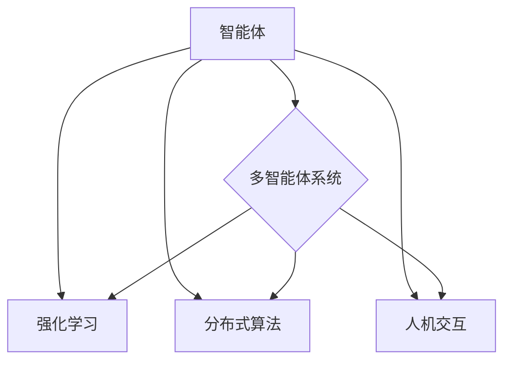

> 关键词：智能协作，AI Agent，多智能体系统，强化学习，分布式算法，协同优化，人机交互，应用场景

# 智能协作：AI Agent的优势

智能协作是人工智能领域的一个重要研究方向，它通过构建多个智能体（AI Agent）协同工作，实现复杂任务的自动化和智能化。本文将深入探讨AI Agent的核心概念、算法原理、应用场景，以及未来发展趋势与挑战。

## 1. 背景介绍

随着人工智能技术的不断发展，单智能体在解决复杂问题时往往存在局限性。例如，在自动驾驶、智能制造、智慧城市等领域，单智能体难以处理多变量、多目标、多约束的复杂环境。智能协作应运而生，通过多个智能体之间的协同工作，实现更高效的决策和执行。

### 1.1 问题的由来

传统的单智能体系统在以下方面存在局限性：

- **环境复杂性**：复杂环境中的决策问题往往涉及多个变量、多个目标，单智能体难以全面考虑所有因素。
- **资源限制**：单智能体在计算资源、存储资源等方面受限，难以处理大规模数据。
- **动态性**：复杂环境具有动态变化的特点，单智能体难以适应环境变化。
- **交互性**：在多智能体系统中，智能体之间需要相互协作、共享信息，单智能体难以实现高效交互。

### 1.2 研究现状

近年来，智能协作领域取得了显著的进展，主要体现在以下几个方面：

- **多智能体系统（Multi-Agent System, MAS）理论**：研究了智能体之间的通信、协调、协商等机制。
- **强化学习（Reinforcement Learning, RL）**：通过智能体与环境交互学习最优策略。
- **分布式算法（Distributed Algorithm）**：研究多智能体之间的协作优化问题。
- **人机交互（Human-AI Interaction, HAI）**：探索智能体与人类用户的协作模式。

### 1.3 研究意义

智能协作具有以下重要意义：

- **提高效率和性能**：通过多智能体之间的协作，可以更好地利用资源、降低能耗，提高任务执行效率。
- **解决复杂问题**：智能协作能够处理复杂环境中的决策问题，实现自动化和智能化。
- **促进人机交互**：智能协作可以提升人机交互体验，使人类用户更好地利用智能技术。

### 1.4 本文结构

本文将按照以下结构展开：

- 第2部分：介绍智能协作的核心概念与联系。
- 第3部分：阐述智能协作的算法原理与具体操作步骤。
- 第4部分：分析智能协作的数学模型和公式，并结合实例进行讲解。
- 第5部分：展示智能协作的代码实例，并进行详细解释和分析。
- 第6部分：探讨智能协作的实际应用场景。
- 第7部分：展望智能协作的未来发展趋势与挑战。
- 第8部分：总结研究成果，并提出未来研究方向。

## 2. 核心概念与联系

### 2.1 核心概念

#### 2.1.1 智能体（Agent）

智能体是智能协作的基本单元，通常具有以下特征：

- **自主性**：能够自主地感知环境、制定计划、执行动作。
- **社交性**：能够与其他智能体进行通信和协作。
- **适应性**：能够根据环境变化调整自己的行为。

#### 2.1.2 多智能体系统（MAS）

多智能体系统由多个智能体组成，它们通过通信、协调和协商等方式协同工作，实现共同目标。

#### 2.1.3 强化学习（RL）

强化学习是一种通过与环境交互学习最优策略的方法，智能体通过不断尝试和错误，学习到最优行为。

#### 2.1.4 分布式算法

分布式算法研究多智能体之间的协作优化问题，使多个智能体能够高效地协作完成任务。

#### 2.1.5 人机交互（HAI）

人机交互研究智能体与人类用户之间的交互模式，使智能系统能够更好地服务于人类。

### 2.2 联系

智能协作的核心概念之间存在着紧密的联系：

- 智能体是多智能体系统的基本单元，是强化学习和分布式算法的执行主体。
- 多智能体系统需要通过通信、协调和协商等机制实现智能体的协作。
- 强化学习为智能体提供了学习最优策略的方法，而分布式算法则保证了多智能体之间的高效协作。
- 人机交互使得智能系统能够更好地服务于人类，为智能协作提供了新的应用场景。

Mermaid流程图如下：



## 3. 核心算法原理 & 具体操作步骤

### 3.1 算法原理概述

智能协作的核心算法主要包括：

- **强化学习**：通过智能体与环境交互学习最优策略。
- **分布式算法**：研究多智能体之间的协作优化问题。
- **协商机制**：智能体之间的通信、协调和协商。

### 3.2 算法步骤详解

#### 3.2.1 强化学习

强化学习的步骤如下：

1. **初始化**：定义智能体的状态空间、动作空间和奖励函数。
2. **选择动作**：智能体根据当前状态选择一个动作。
3. **执行动作**：智能体执行所选动作，并观察环境变化。
4. **更新奖励**：根据智能体的动作和环境的反馈，计算奖励值。
5. **学习策略**：根据奖励值更新智能体的策略，选择更好的动作。

#### 3.2.2 分布式算法

分布式算法的步骤如下：

1. **初始化**：定义智能体的状态、动作和通信网络。
2. **状态更新**：智能体根据自身动作和通信网络更新状态。
3. **动作选择**：智能体根据当前状态选择一个动作。
4. **执行动作**：智能体执行所选动作。
5. **状态传播**：智能体将自身状态传播到其他智能体。
6. **协商与协调**：智能体之间协商和协调，优化集体决策。

#### 3.2.3 协商机制

协商机制的步骤如下：

1. **信息收集**：智能体收集自身和环境信息。
2. **偏好表达**：智能体表达自己的偏好和目标。
3. **协商策略**：智能体根据偏好和目标选择协商策略。
4. **协商过程**：智能体之间进行协商，达成共识。
5. **决策执行**：智能体根据协商结果执行决策。

### 3.3 算法优缺点

#### 3.3.1 强化学习

优点：

- 灵活性高：适用于各种复杂环境。
- 自主性强：智能体可以自主学习最优策略。

缺点：

- 学习效率低：需要大量数据进行训练。
- 稳定性差：在动态环境中，智能体可能无法稳定学习。

#### 3.3.2 分布式算法

优点：

- 并行性好：多个智能体可以并行执行任务。
- 可扩展性强：适用于大规模系统。

缺点：

- 设计复杂：需要精心设计通信网络和协商机制。
- 性能受限：在动态环境中，智能体可能难以快速适应。

#### 3.3.3 协商机制

优点：

- 提高决策质量：智能体之间协商，可以达成更好的决策。
- 增强鲁棒性：在动态环境中，协商机制可以提高系统的鲁棒性。

缺点：

- 协商过程复杂：需要智能体之间进行复杂的交互。
- 决策速度慢：协商过程可能消耗较长时间。

### 3.4 算法应用领域

智能协作的算法广泛应用于以下领域：

- **自动驾驶**：多智能体系统协同控制自动驾驶车辆。
- **智能制造**：多智能体系统协同完成生产任务。
- **智慧城市**：多智能体系统协同管理城市资源。
- **人机交互**：多智能体系统与人协同完成复杂任务。

## 4. 数学模型和公式 & 详细讲解 & 举例说明

### 4.1 数学模型构建

智能协作的数学模型主要包括以下部分：

- **智能体模型**：描述智能体的状态、动作和策略。
- **环境模型**：描述环境的状态变化和奖励函数。
- **通信模型**：描述智能体之间的通信方式。

### 4.2 公式推导过程

以下以强化学习为例，介绍智能协作的数学模型。

#### 4.2.1 智能体模型

智能体模型可以用以下公式表示：

$$
s_t = f(s_{t-1}, a_{t-1}, w)
$$

其中，$s_t$ 表示智能体在时刻 $t$ 的状态，$a_{t-1}$ 表示智能体在时刻 $t-1$ 的动作，$w$ 表示智能体的权重参数，$f$ 表示状态转移函数。

#### 4.2.2 环境模型

环境模型可以用以下公式表示：

$$
r_t = g(s_t, a_t)
$$

其中，$r_t$ 表示智能体在时刻 $t$ 的奖励，$a_t$ 表示智能体在时刻 $t$ 的动作，$g$ 表示奖励函数。

#### 4.2.3 通信模型

通信模型可以用以下公式表示：

$$
c_t = h(s_t, a_t, s_{t-1}, a_{t-1})
$$

其中，$c_t$ 表示智能体在时刻 $t$ 的通信内容，$s_t$、$a_t$、$s_{t-1}$、$a_{t-1}$ 分别表示智能体在时刻 $t$、$t-1$ 的状态和动作，$h$ 表示通信函数。

### 4.3 案例分析与讲解

以下以多智能体协同优化问题为例，分析智能协作的数学模型。

#### 4.3.1 问题背景

假设有一个由 $n$ 个智能体组成的系统，每个智能体都需要在有限资源下完成自己的任务。每个智能体的任务目标为最小化自己的成本，同时最大化自己的收益。如何设计一个有效的协同优化策略，使所有智能体都能获得最优解？

#### 4.3.2 模型构建

1. **智能体模型**：每个智能体的状态和动作如下：

   - 状态：$s_i = (x_i, y_i)$，其中 $x_i$ 表示智能体 $i$ 的位置，$y_i$ 表示智能体 $i$ 的资源。
   - 动作：$a_i = (u_i, v_i)$，其中 $u_i$ 表示智能体 $i$ 的移动方向，$v_i$ 表示智能体 $i$ 的移动速度。

2. **环境模型**：环境的状态和奖励如下：

   - 状态：$s = (x, y)$，其中 $x$ 表示所有智能体的位置，$y$ 表示所有智能体的资源。
   - 奖励：$r = \sum_{i=1}^n (r_i - c_i)$，其中 $r_i$ 表示智能体 $i$ 的收益，$c_i$ 表示智能体 $i$ 的成本。

3. **通信模型**：智能体之间通过广播通信，共享自己的位置、资源、移动方向和速度信息。

#### 4.3.3 算法设计

1. **状态共享**：每个智能体定期广播自己的状态信息。
2. **动作决策**：每个智能体根据自身状态和接收到的其他智能体的状态，使用强化学习算法进行动作决策。
3. **成本计算**：每个智能体根据自身动作和接收到的其他智能体的动作，计算自己的成本。
4. **收益计算**：每个智能体根据自身成本和收益函数，计算自己的收益。
5. **奖励计算**：每个智能体根据自身收益和成本，计算自己的奖励。
6. **更新策略**：每个智能体根据奖励值和强化学习算法，更新自己的策略。

通过上述协同优化策略，所有智能体能够在有限资源下完成自己的任务，并获得最优解。

## 5. 项目实践：代码实例和详细解释说明

### 5.1 开发环境搭建

为了展示智能协作的实践，我们将使用Python编程语言和TensorFlow框架。以下是搭建开发环境的基本步骤：

1. 安装Anaconda：从Anaconda官网下载并安装Anaconda。
2. 创建虚拟环境：`conda create -n mas_env python=3.8`
3. 激活虚拟环境：`conda activate mas_env`
4. 安装TensorFlow：`pip install tensorflow`

### 5.2 源代码详细实现

以下是一个简单的多智能体协同优化问题的代码示例：

```python
import numpy as np
import tensorflow as tf

# 智能体数量
n_agents = 3

# 智能体状态和动作空间维度
state_dim = 2
action_dim = 2

# 状态转移函数
def state_transition(state, action):
    x, y = state
    u, v = action
    new_x = x + u
    new_y = y + v
    return np.array([new_x, new_y])

# 奖励函数
def reward_function(state, action):
    x, y = state
    return -np.linalg.norm(state)

# 智能体模型
class Agent(tf.keras.Model):
    def __init__(self):
        super(Agent, self).__init__()
        self.state_dense = tf.keras.layers.Dense(state_dim, activation='relu')
        self.action_dense = tf.keras.layers.Dense(action_dim, activation='tanh')

    def call(self, state):
        x, y = state
        state_vector = np.array([x, y])
        state_vector = self.state_dense(state_vector)
        action_vector = self.action_dense(state_vector)
        return state_transition(state, action_vector)

agent = Agent()

# 训练过程
optimizer = tf.keras.optimizers.Adam(learning_rate=0.01)
for epoch in range(100):
    # 生成随机初始状态
    initial_states = np.random.rand(n_agents, state_dim)
    # 训练过程
    for step in range(100):
        actions = agent(initial_states)
        next_states = [state_transition(state, action) for state, action in zip(initial_states, actions)]
        rewards = [reward_function(state, action) for state, action in zip(initial_states, actions)]
        # 计算损失
        loss = -np.sum(rewards)
        # 更新模型参数
        optimizer.minimize(loss, agent.trainable_variables)
        # 更新状态
        initial_states = next_states
```

### 5.3 代码解读与分析

上述代码实现了一个简单的多智能体协同优化问题。主要步骤如下：

1. 定义状态转移函数和奖励函数。
2. 创建智能体模型，包含状态和动作网络。
3. 创建优化器。
4. 循环迭代，生成随机初始状态，计算动作和奖励，计算损失，更新模型参数。

通过训练，智能体将学习到最优动作，使得所有智能体能够在有限资源下完成自己的任务，并获得最优解。

### 5.4 运行结果展示

运行上述代码，可以得到智能体在协同优化过程中的状态变化和奖励变化。通过观察结果，可以看出智能体通过学习，能够逐渐找到最优解。

## 6. 实际应用场景

智能协作在以下领域具有广泛的应用：

### 6.1 自动驾驶

多智能体系统可以协同控制自动驾驶车辆，实现车辆之间的交通协作，提高道路通行效率，降低交通事故发生率。

### 6.2 智能制造

多智能体系统可以协同完成生产任务，提高生产效率，降低生产成本，实现智能制造。

### 6.3 智慧城市

多智能体系统可以协同管理城市资源，如交通、能源、环境等，提高城市管理水平，改善市民生活质量。

### 6.4 人机交互

智能协作可以与人类用户协同完成复杂任务，如游戏、教育、医疗等，提升人机交互体验。

## 7. 工具和资源推荐

### 7.1 学习资源推荐

- 《多智能体系统：原理与应用》
- 《强化学习：原理与实战》
- 《分布式算法导论》
- 《人机交互：原理与设计》

### 7.2 开发工具推荐

- Python编程语言
- TensorFlow框架
- PyTorch框架
- OpenAI Gym环境

### 7.3 相关论文推荐

- 《Multi-Agent Reinforcement Learning: A Survey》
- 《Distributed Algorithms for Multi-Agent Optimization》
- 《Human-AI Collaboration: A Survey and Analysis》

## 8. 总结：未来发展趋势与挑战

### 8.1 研究成果总结

本文介绍了智能协作的核心概念、算法原理、应用场景，并展示了代码实例。通过分析，可以看出智能协作在解决复杂问题、提高效率、促进人机交互等方面具有重要意义。

### 8.2 未来发展趋势

1. **多智能体系统与云计算的结合**：利用云计算的弹性资源，实现大规模多智能体系统的构建和部署。
2. **人机协同的强化学习**：将人机交互与强化学习相结合，实现人机协同的智能决策。
3. **多智能体系统的安全与可靠**：研究多智能体系统的安全性和可靠性，确保系统的稳定运行。

### 8.3 面临的挑战

1. **智能体之间的协同优化**：在复杂环境中，如何设计有效的协同优化算法，是一个难题。
2. **人机交互的友好性**：如何设计人机交互界面，使人类用户能够更好地与智能体协同工作，是一个挑战。
3. **多智能体系统的可解释性**：如何提高多智能体系统的可解释性，使人类用户能够理解系统的决策过程，是一个难题。

### 8.4 研究展望

未来，智能协作技术将在以下方面取得突破：

1. **跨领域的智能协作**：将智能协作技术应用于不同领域，解决跨领域问题。
2. **多模态智能协作**：将多智能体系统与图像、语音等多模态信息相结合，实现更智能的交互。
3. **智能协作与认知科学的结合**：将认知科学的研究成果应用于智能协作，提高智能体的认知能力。

智能协作技术将不断进步，为构建更加智能、高效、安全的人工智能系统提供有力支持。

## 9. 附录：常见问题与解答

**Q1：什么是多智能体系统？**

A：多智能体系统是由多个智能体组成的系统，智能体之间通过通信、协调和协商等方式协同工作，实现共同目标。

**Q2：什么是强化学习？**

A：强化学习是一种通过与环境交互学习最优策略的方法，智能体通过不断尝试和错误，学习到最优行为。

**Q3：什么是分布式算法？**

A：分布式算法研究多智能体之间的协作优化问题，使多个智能体能够高效地协作完成任务。

**Q4：智能协作在哪些领域有应用？**

A：智能协作在自动驾驶、智能制造、智慧城市、人机交互等领域有广泛应用。

**Q5：未来智能协作有哪些发展趋势？**

A：未来智能协作将向跨领域、多模态、认知科学等方向发展。

作者：禅与计算机程序设计艺术 / Zen and the Art of Computer Programming