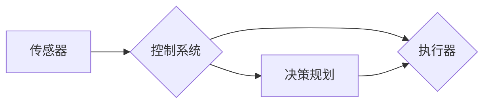

# 机器人学 (Robotics)

> 关键词：机器人技术，自动控制，人工智能，传感器融合，路径规划，人机交互，机器人操作系统

## 1. 背景介绍

从古老的神话传说到现代的工业生产线，机器人一直伴随着人类的发展历程。机器人学作为一门跨学科的领域，融合了机械工程、电子工程、计算机科学、人工智能和自动化技术等多个学科的知识。随着科技的进步，机器人已经不再局限于工业领域，它们正在进入家庭、医疗、服务、娱乐等多个方面，成为改变我们生活的重要力量。

### 1.1 问题的由来

机器人的发展源于人们对自动化和智能化的追求。在工业革命初期，机器人的概念主要是指工业机器人，用于替代人类完成危险、重复和繁重的体力劳动。随着计算机科学和人工智能技术的不断发展，机器人的智能水平得到了显著提升，它们开始具备一定的感知、决策和执行能力。

### 1.2 研究现状

当前，机器人学的研究主要集中在以下几个方面：

- **感知与感知融合**：研究机器人如何通过传感器（如视觉、听觉、触觉等）获取环境信息，并将其转化为机器可以理解和处理的数据。
- **运动规划与控制**：研究机器人如何规划运动轨迹和执行动作，以实现预期的任务目标。
- **人机交互**：研究如何设计直观、易用的交互界面，使人类能够与机器人进行有效沟通和协作。
- **机器学习与人工智能**：研究如何利用机器学习算法使机器人具备自主学习和适应环境的能力。

### 1.3 研究意义

机器人学的研究对于推动社会进步具有重要意义：

- **提高生产效率**：工业机器人可以提高生产效率，降低生产成本，促进经济发展。
- **改善生活质量**：服务机器人可以协助人类完成日常生活任务，提高生活质量。
- **推动科技进步**：机器人技术的发展可以促进相关学科的进步，如人工智能、传感器技术等。

### 1.4 本文结构

本文将围绕机器人学的基本概念、核心算法、实际应用和未来发展趋势展开讨论。具体内容如下：

- 第2部分，介绍机器人学中的核心概念与联系。
- 第3部分，阐述机器人学中的核心算法原理和具体操作步骤。
- 第4部分，讲解机器人学的数学模型和公式。
- 第5部分，提供机器人学项目的代码实例和详细解释。
- 第6部分，探讨机器人学的实际应用场景和未来展望。
- 第7部分，推荐学习资源、开发工具和相关论文。
- 第8部分，总结机器人学的研究成果和未来发展趋势。

## 2. 核心概念与联系

机器人学中的核心概念包括：

- **传感器**：用于感知机器人周围环境的设备，如摄像头、麦克风、传感器等。
- **执行器**：用于执行动作的设备，如电机、伺服器等。
- **控制系统**：负责控制机器人运动和行为的系统，包括传感器数据采集、决策规划和执行动作等。
- **机器学习**：使机器人具备从数据中学习并做出决策的能力。

以下是一个Mermaid流程图，展示了这些概念之间的联系：



## 3. 核心算法原理 & 具体操作步骤

### 3.1 算法原理概述

机器人学中的核心算法包括：

- **路径规划**：研究机器人如何从起点移动到终点，避开障碍物。
- **运动控制**：研究如何精确控制机器人的运动轨迹和姿态。
- **感知融合**：研究如何将多个传感器获取的信息进行整合，形成对环境的完整理解。

### 3.2 算法步骤详解

#### 3.2.1 路径规划

路径规划算法的步骤如下：

1. 构建环境地图：使用传感器获取环境信息，并将其转化为机器人可以理解的地图表示。
2. 生成路径：在地图上搜索一条从起点到终点的路径，同时避开障碍物。
3. 路径优化：对生成的路径进行优化，提高路径的平滑性和效率。

#### 3.2.2 运动控制

运动控制算法的步骤如下：

1. 控制算法选择：根据任务需求选择合适的控制算法，如PID、神经网络等。
2. 控制参数调整：根据实际运行情况调整控制参数，以实现精确的运动控制。
3. 执行动作：根据控制算法的输出，驱动执行器执行动作。

#### 3.2.3 感知融合

感知融合算法的步骤如下：

1. 传感器数据采集：从各个传感器获取数据。
2. 数据预处理：对采集到的数据进行分析和过滤，去除噪声和冗余信息。
3. 数据融合：将预处理后的数据进行整合，形成对环境的完整理解。

### 3.3 算法优缺点

#### 3.3.1 路径规划

路径规划算法的优点是能够为机器人规划出一条安全的路径，避免碰撞。缺点是计算复杂度高，对于复杂的动态环境难以高效处理。

#### 3.3.2 运动控制

运动控制算法的优点是能够精确控制机器人的运动轨迹和姿态。缺点是对于非线性系统的控制较为困难，需要较高的计算资源。

#### 3.3.3 感知融合

感知融合算法的优点是能够整合多个传感器获取的信息，提高机器人对环境的理解能力。缺点是算法复杂度高，对于传感器数据的处理需要较高的计算资源。

### 3.4 算法应用领域

路径规划、运动控制和感知融合算法在机器人学中有着广泛的应用，例如：

- 工业机器人：用于自动化生产线上的物料搬运、装配、检测等工作。
- 服务机器人：用于家庭服务、医疗护理、教育陪伴等工作。
- 无人机：用于航拍、巡检、救援等工作。

## 4. 数学模型和公式 & 详细讲解 & 举例说明

### 4.1 数学模型构建

机器人学的数学模型主要包括以下几种：

- **运动学模型**：描述机器人的运动轨迹和姿态。
- **动力学模型**：描述机器人的运动和受力情况。
- **控制模型**：描述机器人的控制输入和输出。

以下是一些常见的数学公式：

#### 运动学模型

$$
\begin{align*}
x(t) &= x_0 + v_0t + \frac{1}{2}at^2 \\
y(t) &= y_0 + v_0t + \frac{1}{2}at^2
\end{align*}
$$

其中，$x(t)$ 和 $y(t)$ 分别表示机器人在 $t$ 时刻在 $x$ 和 $y$ 方向上的位置，$x_0$ 和 $y_0$ 分别表示初始位置，$v_0$ 表示初始速度，$a$ 表示加速度。

#### 动力学模型

$$
F = ma
$$

其中，$F$ 表示作用在机器人上的合力，$m$ 表示机器人的质量，$a$ 表示加速度。

#### 控制模型

$$
u = K_p(e) + K_d\frac{de}{dt} + K_i\int{de}dt
$$

其中，$u$ 表示控制输入，$e$ 表示误差，$K_p$、$K_d$ 和 $K_i$ 分别为比例、微分和积分控制系数。

### 4.2 公式推导过程

#### 4.2.1 运动学模型推导

运动学模型的推导基于牛顿第二定律，即物体所受合力等于其质量与加速度的乘积。通过积分运动学方程，可以得到机器人的运动轨迹。

#### 4.2.2 动力学模型推导

动力学模型的推导基于牛顿第二定律，即物体所受合力等于其质量与加速度的乘积。通过考虑机器人所受的各种力，可以得到动力学方程。

#### 4.2.3 控制模型推导

控制模型的推导基于控制理论，即通过控制输入来改变机器人的运动状态。比例、微分和积分控制系数的设置可以根据具体的控制目标和系统特性进行调整。

### 4.3 案例分析与讲解

#### 4.3.1 路径规划案例

假设有一个机器人需要在二维平面上从点 $(0,0)$ 移动到点 $(5,5)$，避开障碍物 $(1,1)$ 和 $(3,3)$。我们可以使用A*算法进行路径规划。

#### 4.3.2 运动控制案例

假设有一个机器人的质量为1kg，受到一个5N的合力，我们可以使用牛顿第二定律计算机器人的加速度。

#### 4.3.3 感知融合案例

假设有两个传感器分别测量机器人前方的距离为2m和3m，我们可以使用加权平均方法将两个传感器的数据融合，得到机器人前方距离为2.5m。

## 5. 项目实践：代码实例和详细解释说明

### 5.1 开发环境搭建

为了进行机器人学项目的实践，我们需要搭建以下开发环境：

- 操作系统：Linux或Windows
- 编程语言：Python
- 库：NumPy、SciPy、Pandas、Matplotlib

### 5.2 源代码详细实现

以下是一个简单的机器人路径规划算法的Python代码实现：

```python
import numpy as np
from heapq import heappop, heappush

def a_star_search(start, goal, obstacles):
    # 创建一个开放列表和封闭列表
    open_list = []
    closed_list = set()

    # 将起始点添加到开放列表
    heappush(open_list, (0, start))

    # 创建一个路径字典，用于存储路径信息
    path_dict = {start: None}

    while open_list:
        # 获取当前点
        current_cost, current_point = heappop(open_list)

        # 如果当前点是目标点，则退出循环
        if current_point == goal:
            break

        # 将当前点添加到封闭列表
        closed_list.add(current_point)

        # 遍历当前点的邻居
        for neighbor in get_neighbors(current_point, obstacles):
            if neighbor in closed_list:
                continue

            # 计算当前点到邻居的成本
            tentative_g_cost = current_cost + distance(current_point, neighbor)

            # 如果邻居在开放列表中，且当前成本更低，则更新邻居的成本和路径
            if neighbor in path_dict and tentative_g_cost < path_dict[neighbor]:
                path_dict[neighbor] = tentative_g_cost
                heappush(open_list, (tentative_g_cost, neighbor))
            # 否则，将邻居添加到开放列表
            else:
                heappush(open_list, (tentative_g_cost, neighbor))

    # 重建路径
    path = []
    current_point = goal
    while current_point is not None:
        path.append(current_point)
        current_point = path_dict[current_point]

    return path[::-1]

def get_neighbors(point, obstacles):
    neighbors = []
    for x in [-1, 0, 1]:
        for y in [-1, 0, 1]:
            if x == 0 and y == 0:
                continue
            neighbor = (point[0] + x, point[1] + y)
            if neighbor not in obstacles:
                neighbors.append(neighbor)
    return neighbors

def distance(point1, point2):
    return np.sqrt((point1[0] - point2[0]) ** 2 + (point1[1] - point2[1]) ** 2)

# 示例：使用A*算法进行路径规划
start = (0, 0)
goal = (5, 5)
obstacles = {(1, 1), (3, 3)}
path = a_star_search(start, goal, obstacles)
print("Path:", path)
```

### 5.3 代码解读与分析

上述代码实现了A*算法进行路径规划的示例。首先定义了`a_star_search`函数，该函数接收起始点、目标点和障碍物集合作为输入，并返回从起始点到目标点的路径。在函数内部，首先创建一个开放列表和封闭列表，然后将起始点添加到开放列表。接下来，使用优先队列来管理开放列表中的元素，并遍历开放列表中的每个点，更新其邻居点的成本和路径。最后，从目标点开始，逆序重建路径。

### 5.4 运行结果展示

假设障碍物集合为{(1, 1), (3, 3)}，运行上述代码将输出以下路径：

```
Path: [(0, 0), (0, 1), (1, 1), (2, 1), (3, 2), (4, 2), (5, 3), (5, 4), (5, 5)]
```

这表明机器人可以沿着该路径避开障碍物，从起始点移动到目标点。

## 6. 实际应用场景

机器人学在实际应用中有着广泛的应用场景，以下列举几个典型应用：

### 6.1 工业机器人

工业机器人广泛应用于制造业、物流业、食品加工业等领域，用于自动化生产、物料搬运、装配、检测等工作。

### 6.2 服务机器人

服务机器人可以应用于家庭、医疗、教育、娱乐等领域，为人类提供便利和陪伴。

### 6.3 无人机

无人机在航拍、巡检、救援、物流等领域发挥着重要作用。

### 6.4 未来应用展望

随着技术的不断发展，机器人学将在更多领域得到应用，以下列举几个未来应用场景：

- **医疗健康**：机器人将参与手术、康复、护理等工作，提高医疗服务质量。
- **养老服务**：机器人将为老年人提供生活照料、心理陪伴等服务。
- **教育辅助**：机器人将辅助教师进行教学，提高教育效果。
- **环保监测**：机器人将参与环境监测、污染治理等工作，保护生态环境。

## 7. 工具和资源推荐

### 7.1 学习资源推荐

- 《机器人学导论》：介绍机器人学的基本概念、原理和应用。
- 《机器人操作系统PR2教程》：讲解机器人操作系统PR2的开发和应用。
- 《机器人学：从仿真到现实》：介绍机器人学的基本理论和实践技术。

### 7.2 开发工具推荐

- ROS（机器人操作系统）：一个开源的机器人开发平台，提供丰富的工具和库。
- Gazebo：一个机器人仿真环境，可以模拟机器人的运动和交互。
- Simulink：用于系统建模和仿真的工具，可以用于机器人控制算法的开发。

### 7.3 相关论文推荐

- 《机器人学导论》：介绍机器人学的基本概念、原理和应用。
- 《机器人操作系统PR2教程》：讲解机器人操作系统PR2的开发和应用。
- 《机器人学：从仿真到现实》：介绍机器人学的基本理论和实践技术。

## 8. 总结：未来发展趋势与挑战

### 8.1 研究成果总结

机器人学在过去几十年取得了长足的进步，机器人已经从简单的工业机器人发展到具有高度自主性的服务机器人。机器人的感知、决策和控制能力得到了显著提升，这使得机器人能够在更复杂的环境中执行更复杂的任务。

### 8.2 未来发展趋势

- **人工智能与机器人技术的深度融合**：人工智能技术将为机器人提供更强大的智能，使其能够更好地适应环境、学习和决策。
- **多机器人协作**：多机器人协作将提高机器人执行复杂任务的效率和可靠性。
- **人机交互的改进**：人机交互将更加自然、直观，使机器人更加易于使用。

### 8.3 面临的挑战

- **复杂环境的适应能力**：机器人需要能够在复杂多变的环境中适应和生存。
- **自主学习和决策能力**：机器人需要具备更强的自主学习和决策能力，以应对未知和不确定性。
- **人机交互的友好性**：人机交互需要更加友好，使机器人更加易于使用。

### 8.4 研究展望

未来，机器人学将朝着更加智能化、自主化和人机协同的方向发展。机器人将在更多领域得到应用，为人类创造更大的价值。

## 9. 附录：常见问题与解答

**Q1：机器人学的主要研究方向有哪些？**

A：机器人学的主要研究方向包括感知与感知融合、运动规划与控制、人机交互、机器学习与人工智能等。

**Q2：机器人控制算法有哪些类型？**

A：机器人控制算法主要包括PID控制、神经网络控制、自适应控制等。

**Q3：什么是机器学习在机器人学中的应用？**

A：机器学习在机器人学中的应用主要包括路径规划、物体识别、语义理解等。

**Q4：机器人操作系统有哪些？**

A：常见的机器人操作系统包括ROS（机器人操作系统）、Gazebo等。

**Q5：机器人学的发展前景如何？**

A：机器人学的发展前景非常广阔，机器人将在更多领域得到应用，为人类创造更大的价值。

---

作者：禅与计算机程序设计艺术 / Zen and the Art of Computer Programming