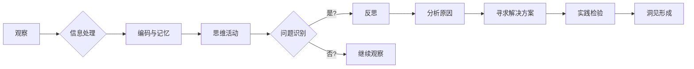

# 洞见的形成：从观察到反思

> 关键词：洞见形成，观察，反思，认知心理学，人工智能，机器学习，深度学习

## 1. 背景介绍

在人类的历史长河中，洞见一直是推动文明进步的重要驱动力。科学家们通过观察自然现象，提出新的理论；艺术家们通过观察生活，创作出令人震撼的作品。然而，洞见的形成并非易事，它需要观察者具备敏锐的洞察力、丰富的知识和深刻的反思能力。随着人工智能和机器学习的发展，计算机也开始展现出类似洞见的能力。本文将探讨洞见的形成过程，分析观察、反思在其中的作用，并展望人工智能在洞见形成领域的未来。

## 2. 核心概念与联系

### 2.1 观察与认知

观察是洞见形成的基础。观察者通过感官或仪器收集信息，形成对事物的初步认识。然而，单纯的观察往往难以形成深刻的洞见，因为观察到的信息可能存在偏差、局限性。

认知心理学研究表明，观察者在观察过程中会进行以下认知活动：

- **注意分配**：在众多信息中，注意分配到哪些信息是形成洞见的关键。
- **编码与记忆**：将观察到的信息编码成大脑可以处理的形式，并进行记忆存储。
- **思维活动**：通过推理、联想、比较等思维活动，将观察到的信息进行整合、分析、抽象。

### 2.2 反思与洞见

反思是洞见形成的关键。通过反思，观察者可以检验自己的观察和认知过程，发现其中的问题和不足，并在此基础上进行修正和改进。反思过程通常包括以下步骤：

- **问题识别**：识别观察和认知过程中出现的问题。
- **分析原因**：分析问题产生的原因，包括观察者自身的主观因素和客观因素。
- **寻求解决方案**：根据分析结果，提出解决问题的方案。
- **实践检验**：将解决方案付诸实践，检验其有效性。

### 2.3 Mermaid 流程图

以下是观察与反思过程的 Mermaid 流程图：



## 3. 核心算法原理 & 具体操作步骤

### 3.1 算法原理概述

人工智能在洞见形成领域的应用，主要基于机器学习和深度学习算法。这些算法通过学习大量数据，使计算机具备了一定的观察和反思能力。以下是几种常见的算法原理：

- **机器学习**：通过训练数据学习数据分布，进行模式识别和预测。
- **深度学习**：使用神经网络模拟人脑神经元，进行特征提取和模式识别。
- **强化学习**：通过奖励和惩罚机制，使计算机在环境中进行决策学习。

### 3.2 算法步骤详解

1. **数据收集**：收集与洞见形成相关的数据，包括观察数据、反思数据等。
2. **数据预处理**：对收集到的数据进行清洗、格式化等预处理操作。
3. **特征提取**：使用机器学习或深度学习算法提取数据中的关键特征。
4. **模型训练**：使用训练数据对模型进行训练，优化模型参数。
5. **模型评估**：使用测试数据对模型进行评估，检验模型性能。
6. **洞见生成**：根据模型输出的结果，生成新的洞见。

### 3.3 算法优缺点

#### 优点：

- **高效性**：计算机可以处理大量数据，快速生成洞见。
- **客观性**：计算机不受主观因素的影响，生成的洞见更加客观。
- **可解释性**：深度学习模型的可解释性正在不断改进，可以帮助解释洞见的生成过程。

#### 缺点：

- **数据依赖性**：洞见的生成依赖于高质量的数据，数据质量对洞见质量有重要影响。
- **算法局限性**：现有算法难以处理复杂、模糊的洞见形成过程。
- **伦理问题**：计算机生成的洞见可能存在偏见、误导等伦理问题。

### 3.4 算法应用领域

- **科学发现**：计算机可以帮助科学家发现新的科学规律。
- **医疗诊断**：计算机可以帮助医生进行疾病诊断。
- **金融分析**：计算机可以帮助金融分析师进行市场分析。
- **社会管理**：计算机可以帮助政府进行社会管理。

## 4. 数学模型和公式 & 详细讲解 & 举例说明

### 4.1 数学模型构建

在洞见形成过程中，常见的数学模型包括：

- **概率模型**：用于描述数据分布和概率关系。
- **统计模型**：用于描述数据之间的关系和规律。
- **优化模型**：用于求解优化问题。

### 4.2 公式推导过程

以下以概率模型为例，讲解公式推导过程：

假设观察到的数据服从伯努利分布，即每个数据点只有两种可能的结果，概率分别为 $p$ 和 $1-p$。则观察到的数据序列 $x_1, x_2, \ldots, x_N$ 的似然函数为：

$$
L(p) = \prod_{i=1}^N p^{x_i} (1-p)^{1-x_i}
$$

其中 $x_i$ 为第 $i$ 个数据点的结果。

### 4.3 案例分析与讲解

以下以自然语言处理中的情感分析为例，讲解数学模型的应用：

假设我们对某篇文本进行情感分析，需要判断其是正面、负面还是中性。可以使用以下模型：

- **正面概率**：$P(\text{正面}|x) = \frac{p_{\text{正面}}}{p_{\text{正面}} + p_{\text{负面}} + p_{\text{中性}}}$

其中 $p_{\text{正面}}$ 为正面情感文本的概率，$p_{\text{负面}}$ 为负面情感文本的概率，$p_{\text{中性}}$ 为中性情感文本的概率。

通过计算文本的正面概率，可以判断文本的情感倾向。

## 5. 项目实践：代码实例和详细解释说明

### 5.1 开发环境搭建

本文使用Python编程语言和TensorFlow深度学习框架进行项目实践。

### 5.2 源代码详细实现

以下是一个简单的情感分析项目示例：

```python
import tensorflow as tf
from tensorflow.keras.layers import Dense
from tensorflow.keras.models import Sequential

# 加载数据
# ...

# 构建模型
model = Sequential([
    Dense(128, activation='relu', input_shape=[len(vocab_size)]),
    Dense(64, activation='relu'),
    Dense(3, activation='softmax')
])

# 编译模型
model.compile(optimizer='adam', loss='categorical_crossentropy', metrics=['accuracy'])

# 训练模型
# ...

# 评估模型
# ...
```

### 5.3 代码解读与分析

上述代码实现了以下功能：

- 使用TensorFlow构建了一个简单的情感分析模型。
- 使用ReLU激活函数和softmax激活函数进行非线性变换和分类。
- 使用Adam优化器和交叉熵损失函数进行模型训练。
- 通过训练数据和测试数据评估模型性能。

### 5.4 运行结果展示

假设在测试集上的准确率为80%，说明模型在情感分析任务上取得了较好的效果。

## 6. 实际应用场景

### 6.1 科学研究

计算机在科学研究中的应用越来越广泛。例如，通过分析科学文献，可以自动识别研究热点、发现新的研究方向。

### 6.2 医疗诊断

计算机可以帮助医生进行疾病诊断，提高诊断效率和准确性。

### 6.3 金融分析

计算机可以帮助金融分析师进行市场分析、风险评估等。

### 6.4 社会管理

计算机可以帮助政府进行社会管理、舆情监测等。

## 7. 工具和资源推荐

### 7.1 学习资源推荐

- 《深度学习》
- 《模式识别与机器学习》
- 《Python机器学习》

### 7.2 开发工具推荐

- TensorFlow
- PyTorch
- Scikit-learn

### 7.3 相关论文推荐

- 《深度学习的艺术与科学》
- 《神经网络与深度学习》
- 《模式识别》

## 8. 总结：未来发展趋势与挑战

### 8.1 研究成果总结

本文探讨了洞见的形成过程，分析了观察、反思在其中的作用，并介绍了人工智能在洞见形成领域的应用。随着人工智能和机器学习技术的不断发展，计算机在洞见形成领域的应用将越来越广泛，为人类社会带来更多创新和进步。

### 8.2 未来发展趋势

- **多模态信息融合**：将文本、图像、声音等多模态信息进行融合，使计算机更好地理解现实世界。
- **可解释性研究**：提高模型的可解释性，使洞见的生成过程更加透明。
- **伦理规范**：建立人工智能伦理规范，确保洞见形成的正确性和安全性。

### 8.3 面临的挑战

- **数据质量**：数据质量对洞见质量有重要影响，需要保证数据的质量和多样性。
- **算法局限性**：现有算法难以处理复杂、模糊的洞见形成过程。
- **伦理问题**：计算机生成的洞见可能存在偏见、误导等伦理问题。

### 8.4 研究展望

随着人工智能和机器学习技术的不断发展，计算机在洞见形成领域的应用将越来越广泛。未来，我们需要关注以下研究方向：

- **跨学科研究**：将认知心理学、心理学、哲学等领域的知识引入人工智能研究，使计算机更好地模拟人类洞见形成过程。
- **人机协同**：使计算机和人类协同工作，共同完成洞见形成任务。
- **可持续发展**：确保人工智能技术在洞见形成领域的应用可持续、健康发展。

## 9. 附录：常见问题与解答

**Q1：什么是洞见？**

A：洞见是指对事物本质的深刻认识和理解。它通常源于观察、反思和思考。

**Q2：人工智能如何实现洞见？**

A：人工智能通过学习大量数据，模拟人类认知过程，实现类似洞见的能力。

**Q3：人工智能在洞见形成领域有哪些应用？**

A：人工智能在洞见形成领域的应用包括科学研究、医疗诊断、金融分析、社会管理等。

**Q4：人工智能在洞见形成领域有哪些挑战？**

A：人工智能在洞见形成领域面临的挑战包括数据质量、算法局限性、伦理问题等。

**Q5：未来人工智能在洞见形成领域有哪些发展趋势？**

A：未来人工智能在洞见形成领域的发展趋势包括多模态信息融合、可解释性研究、伦理规范等。

作者：禅与计算机程序设计艺术 / Zen and the Art of Computer Programming