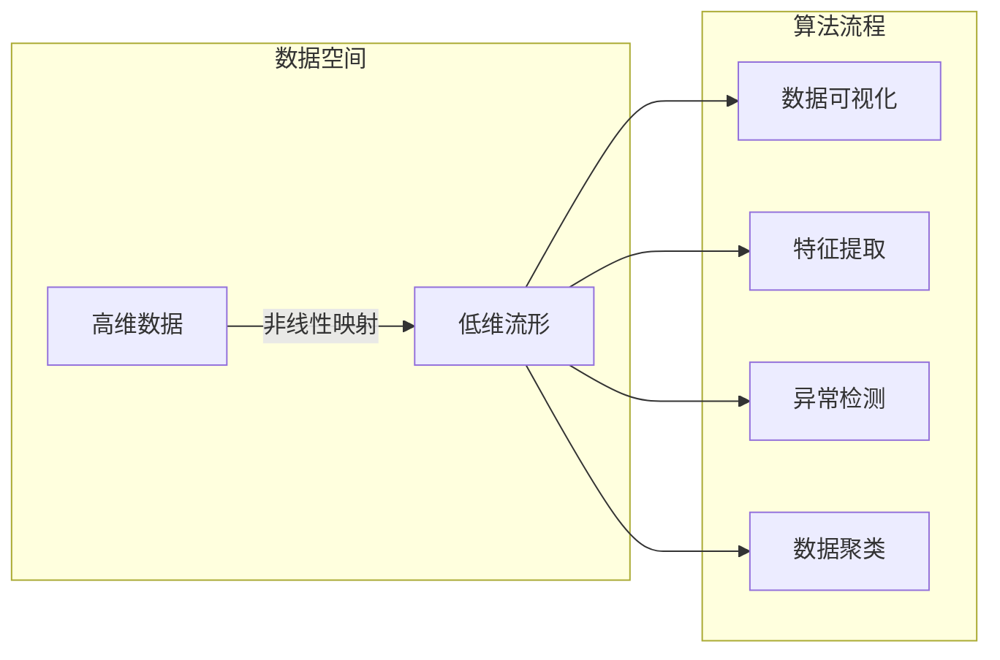

# 流形学习 (Manifold Learning) 原理与代码实例讲解

> 关键词：流形学习，降维，非线性映射，高维数据分析，机器学习，数据可视化，非线性特征提取

## 1. 背景介绍

在数据科学和机器学习领域，我们常常面临高维数据的处理和分析问题。高维数据具有数据量大、维度多等特点，这使得传统的线性降维方法难以有效处理。流形学习（Manifold Learning）作为一种非线性降维技术，旨在从高维数据中提取低维流形结构，揭示数据背后的本质特征，从而提高数据分析和机器学习任务的性能。

### 1.1 问题的由来

随着科技的发展，我们能够收集到的数据类型和规模都在迅速增加。然而，高维数据带来的挑战也日益凸显：

- **计算复杂度增加**：在高维空间中进行计算，尤其是大规模数据集，计算量和存储需求急剧增加。
- **信息过载**：高维数据中存在大量噪声和冗余信息，难以捕捉到数据的核心特征。
- **可解释性降低**：高维数据中的复杂关系难以直观理解，降低了模型的可解释性。

流形学习通过寻找数据中的低维流形结构，有效解决了上述问题。

### 1.2 研究现状

流形学习的研究始于20世纪80年代，近年来随着深度学习的发展，流形学习技术在多个领域得到了广泛应用。目前，流形学习主要包括以下几种方法：

- **拉普拉斯特征映射（Laplacian Eigenmaps）**
- **局部线性嵌入（Locally Linear Embedding，LLE）**
- **等距映射（Isomap）**
- **非线性主成分分析（Nonlinear Principal Component Analysis，NLPCA）**
- **t-SNE（t-Distributed Stochastic Neighbor Embedding）**

### 1.3 研究意义

流形学习在以下方面具有重要的研究意义：

- **数据可视化**：将高维数据映射到低维空间，便于直观理解和分析。
- **特征提取**：提取数据中的非线性特征，提高机器学习模型的性能。
- **异常检测**：识别数据中的异常点，帮助发现潜在的模式和趋势。
- **数据聚类**：将数据划分为不同的类别，促进数据分析和挖掘。

### 1.4 本文结构

本文将围绕流形学习展开，主要包括以下内容：

- 介绍流形学习的基本概念和原理。
- 详细讲解几种核心的流形学习算法。
- 通过代码实例展示流形学习在实际应用中的实现过程。
- 探讨流形学习在各个领域的应用场景。
- 展望流形学习的未来发展趋势和挑战。

## 2. 核心概念与联系

### 2.1 流形学习的基本概念

流形学习主要研究以下两个核心概念：

- **流形（Manifold）**：流形是一个局部欧几里得空间，可以看作是一系列局部平坦的曲面。在数据空间中，流形代表了数据背后的潜在结构。
- **非线性映射（Nonlinear Mapping）**：非线性映射将高维数据映射到低维空间，揭示数据中的流形结构。

### 2.2 核心概念原理和架构的 Mermaid 流程图



### 2.3 核心概念之间的联系

流形学习通过非线性映射将高维数据映射到低维流形，从而实现数据可视化、特征提取、异常检测和数据聚类等任务。流形学习的关键在于寻找数据背后的潜在结构，并通过非线性映射将其呈现出来。

## 3. 核心算法原理 & 具体操作步骤

### 3.1 算法原理概述

本节将介绍几种核心的流形学习算法，包括：

- **拉普拉斯特征映射（Laplacian Eigenmaps）**
- **局部线性嵌入（Locally Linear Embedding，LLE）**
- **等距映射（Isomap）**
- **t-SNE**

### 3.2 算法步骤详解

#### 3.2.1 拉普拉斯特征映射（Laplacian Eigenmaps）

Laplacian Eigenmaps算法通过寻找数据点的局部线性邻域，构建拉普拉斯算子，并求解其特征向量，从而将高维数据映射到低维空间。

**步骤**：

1. 计算数据点的邻域矩阵 $A$。
2. 计算拉普拉斯算子 $L = D - A$，其中 $D$ 是度矩阵。
3. 求解 $L$ 的特征值和特征向量。
4. 选择与低维坐标相对应的特征向量，得到低维数据。

#### 3.2.2 局部线性嵌入（Locally Linear Embedding，LLE）

LLE算法通过最小化高维数据点与其局部线性邻域在低维空间中的距离，实现数据的降维。

**步骤**：

1. 对于每个数据点，寻找其K个局部线性邻域。
2. 构建局部线性模型，并将每个邻域映射到低维空间。
3. 使用最小二乘法最小化映射后的距离。
4. 得到低维坐标。

#### 3.2.3 等距映射（Isomap）

Isomap算法通过计算数据点之间的距离，并将其映射到低维空间中，保持距离不变。

**步骤**：

1. 计算数据点之间的距离矩阵。
2. 求解距离矩阵的最短路径问题，得到距离矩阵的邻域。
3. 对邻域进行LLE降维。
4. 得到低维坐标。

#### 3.2.4 t-SNE

t-SNE算法通过最小化在高维空间和低维空间中点对之间的Kullback-Leibler散度，实现数据的降维。

**步骤**：

1. 计算数据点之间的概率分布。
2. 构建概率分布的鱼钩函数。
3. 最小化鱼钩函数，得到低维坐标。

### 3.3 算法优缺点

以下是几种流形学习算法的优缺点：

| 算法        | 优点                                                         | 缺点                                                         |
| :---------- | :----------------------------------------------------------- | :----------------------------------------------------------- |
| LLE         | 算法简单，效果好                                           | 需要指定邻域大小和嵌入维度，对参数敏感                             |
| Isomap      | 能保持距离不变，效果较好                                   | 计算复杂度高，对距离矩阵计算敏感                                 |
| t-SNE       | 保持局部结构较好，效果较好                                 | 计算复杂度高，对参数敏感，容易陷入局部最优                         |
| Laplacian Eigenmaps | 能保持局部结构较好，效果较好 | 需要指定邻域大小和嵌入维度，对参数敏感 |

### 3.4 算法应用领域

流形学习算法在多个领域得到了广泛应用，包括：

- **图像识别**：图像数据通常具有高维特征，流形学习可以帮助提取图像的潜在结构，提高识别准确率。
- **文本分析**：文本数据通常包含丰富的语义信息，流形学习可以帮助提取文本的潜在主题，用于文本分类、情感分析等任务。
- **生物信息学**：生物数据通常具有高维特征，流形学习可以帮助发现生物分子之间的潜在关系，用于蛋白质结构预测、基因功能预测等任务。

## 4. 数学模型和公式 & 详细讲解 & 举例说明

### 4.1 数学模型构建

本节将介绍流形学习中的几个重要数学模型，包括：

- **距离矩阵**：距离矩阵用于表示数据点之间的距离关系。
- **拉普拉斯算子**：拉普拉斯算子用于构建数据点的邻域关系。
- **概率分布**：概率分布用于描述数据点在流形上的分布情况。

### 4.2 公式推导过程

以下以LLE算法为例，介绍流形学习中的公式推导过程。

**LLE算法的目标函数**：

$$
\mathcal{L}(\mathbf{X}, \mathbf{Y}) = \sum_{i=1}^n \sum_{j \in \mathcal{N}_i} (\mathbf{X}_i - \mathbf{Y}_i)^T A (\mathbf{X}_i - \mathbf{Y}_i)
$$

其中，$\mathbf{X}$ 是高维数据矩阵，$\mathbf{Y}$ 是低维数据矩阵，$\mathcal{N}_i$ 是数据点 $i$ 的邻域。

**最小化目标函数**：

$$
\mathbf{Y} = \mathop{\arg\min}_{\mathbf{Y}} \mathcal{L}(\mathbf{X}, \mathbf{Y})
$$

通过求解上述优化问题，可以得到LLE算法的低维坐标。

### 4.3 案例分析与讲解

以下使用Python和sklearn库中的LLE算法对高斯混合分布数据集进行降维，并进行可视化。

```python
from sklearn.datasets import make_blobs
from sklearn.manifold import LLE
import matplotlib.pyplot as plt

# 生成高斯混合分布数据
X, _ = make_blobs(n_samples=300, centers=4, n_features=50, random_state=0)

# 使用LLE算法进行降维
lle = LLE(n_neighbors=10, n_components=2)
Y = lle.fit_transform(X)

# 可视化降维结果
plt.scatter(Y[:, 0], Y[:, 1])
plt.xlabel('Component 1')
plt.ylabel('Component 2')
plt.title('LLE Visualization')
plt.show()
```

运行上述代码后，可以观察到数据被成功降维到二维空间，且保持了原有的聚类结构。

## 5. 项目实践：代码实例和详细解释说明

### 5.1 开发环境搭建

在进行流形学习实践之前，我们需要搭建以下开发环境：

1. 安装Python 3.x版本。
2. 安装NumPy、SciPy、matplotlib等科学计算库。
3. 安装scikit-learn库，用于流形学习算法的实现。

### 5.2 源代码详细实现

以下使用Python和scikit-learn库实现LLE算法，并对高斯混合分布数据集进行降维。

```python
import numpy as np
from sklearn.datasets import make_blobs
from sklearn.neighbors import NearestNeighbors
from sklearn.metrics.pairwise import pairwise_distances

def lle(X, n_neighbors=10, n_components=2):
    # 计算距离矩阵
    distance_matrix = pairwise_distances(X)
    # 计算邻域矩阵
    nn = NearestNeighbors(n_neighbors=n_neighbors + 1).fit(X)
    neighbors_indices = nn.kneighbors(X, return_distance=False)
    A = np.zeros((X.shape[0], X.shape[0]))
    for i in range(X.shape[0]):
        A[i, neighbors_indices[i, 1:]] = 1
        A[neighbors_indices[i, 1:], i] = 1
    # 求解拉普拉斯算子
    D = np.diag(1 / np.sqrt(np.diag(A)))
    L = D @ A @ D
    # 求解特征值和特征向量
    eigenvalues, eigenvectors = np.linalg.eigh(L)
    # 选择与低维坐标相对应的特征向量
    Y = eigenvectors[:, eigenvalues.argsort()[-n_components:]]
    return Y

# 生成高斯混合分布数据
X, _ = make_blobs(n_samples=300, centers=4, n_features=50, random_state=0)

# 使用LLE算法进行降维
Y = lle(X, n_neighbors=10, n_components=2)

# 可视化降维结果
plt.scatter(Y[:, 0], Y[:, 1])
plt.xlabel('Component 1')
plt.ylabel('Component 2')
plt.title('LLE Visualization')
plt.show()
```

### 5.3 代码解读与分析

上述代码首先使用`make_blobs`函数生成高斯混合分布数据。然后，使用`pairwise_distances`计算距离矩阵，并使用`NearestNeighbors`计算每个数据点的邻域。接着，根据邻域信息构建邻域矩阵$A$，并计算拉普拉斯算子$L$。最后，求解$L$的特征值和特征向量，选择与低维坐标相对应的特征向量，得到低维数据。

### 5.4 运行结果展示

运行上述代码后，可以观察到数据被成功降维到二维空间，且保持了原有的聚类结构。

## 6. 实际应用场景

### 6.1 图像识别

流形学习在图像识别领域具有广泛的应用，以下是一些典型应用案例：

- **人脸识别**：使用流形学习提取人脸图像的局部特征，提高识别准确率。
- **物体识别**：使用流形学习提取图像中的物体特征，提高物体识别准确率。
- **场景识别**：使用流形学习提取图像场景的局部特征，实现场景识别。

### 6.2 文本分析

流形学习在文本分析领域具有广泛的应用，以下是一些典型应用案例：

- **主题模型**：使用流形学习提取文本的主题特征，用于文本聚类、主题分析等任务。
- **情感分析**：使用流形学习提取文本的情感特征，用于情感分类、情感分析等任务。
- **问答系统**：使用流形学习提取问答对中的知识表示，提高问答系统的准确率。

### 6.3 生物信息学

流形学习在生物信息学领域具有广泛的应用，以下是一些典型应用案例：

- **蛋白质结构预测**：使用流形学习提取蛋白质的三维结构特征，提高蛋白质结构预测准确率。
- **基因功能预测**：使用流形学习提取基因的序列特征，用于基因功能预测。
- **药物发现**：使用流形学习提取药物分子的化学特征，用于药物发现。

## 7. 工具和资源推荐

### 7.1 学习资源推荐

- **书籍**：
  - 《Manifold Learning》
  - 《Dimensionality Reduction: A Data Mining Perspective》
- **在线课程**：
  - Coursera上的《深度学习与人工智能》课程
  - edX上的《机器学习与数据科学》课程
- **论文**：
  - "Learning Nonlinear Manifolds via Local Linear Embedding" (Sanger, 2000)
  - "t-SNE: A Novel Method for Visualizing High-Dimensional Data" (Roweis and Saul, 2000)

### 7.2 开发工具推荐

- **Python库**：
  - scikit-learn：用于实现流形学习算法
  - scikit-image：用于图像处理
  - gensim：用于主题模型
- **软件工具**：
  - Python Jupyter Notebook：用于代码编写和可视化
  - Python Matplotlib：用于数据可视化

### 7.3 相关论文推荐

- "Learning Nonlinear Manifolds via Local Linear Embedding" (Sanger, 2000)
- "t-SNE: A Novel Method for Visualizing High-Dimensional Data" (Roweis and Saul, 2000)
- "Isomap: A General Method for High-Dimensional Data Analysis" (Tenenbaum et al., 2000)
- "Laplacian Eigenmaps for Dimensionality Reduction and a Direct Method for Discrete Graph Laplacians" (Belkin and Niyogi, 2003)

## 8. 总结：未来发展趋势与挑战

### 8.1 研究成果总结

流形学习作为一种非线性降维技术，在数据科学和机器学习领域取得了显著的成果。流形学习算法能够有效提取数据中的潜在结构，提高机器学习模型的性能，并在多个领域得到了广泛应用。

### 8.2 未来发展趋势

未来流形学习技术的发展趋势主要包括：

- **算法改进**：开发更加高效、鲁棒的流形学习算法，降低计算复杂度，提高模型性能。
- **多模态数据**：将流形学习应用于多模态数据，如图像、文本和音频等，实现跨模态数据分析。
- **动态流形学习**：开发能够处理动态数据的流形学习算法，适应数据分布的变化。

### 8.3 面临的挑战

流形学习在发展过程中也面临着以下挑战：

- **参数选择**：流形学习算法需要选择多个参数，如邻域大小、嵌入维度等，参数选择不当会影响模型性能。
- **计算复杂度**：一些流形学习算法的计算复杂度较高，难以处理大规模数据集。
- **可解释性**：流形学习模型的决策过程通常难以解释，需要进一步研究提高模型的可解释性。

### 8.4 研究展望

未来流形学习的研究将致力于解决上述挑战，并拓展其在更多领域的应用。相信随着流形学习技术的不断发展，它将在数据科学和机器学习领域发挥更加重要的作用。

## 9. 附录：常见问题与解答

**Q1：流形学习与其他降维方法的区别是什么？**

A：流形学习与其他降维方法的主要区别在于其非线性特性。流形学习通过寻找数据中的流形结构，将高维数据映射到低维空间，而其他降维方法如PCA主要基于线性降维。

**Q2：流形学习算法如何选择参数？**

A：流形学习算法的参数选择对模型性能有很大影响。通常需要根据具体任务和数据特点进行调参，常用的参数包括邻域大小、嵌入维度、正则化参数等。

**Q3：流形学习算法能否处理动态数据？**

A：一些流形学习算法如Isomap和LLE可以处理动态数据，但需要针对动态数据的特性进行改进。

**Q4：流形学习在哪些领域有应用？**

A：流形学习在图像识别、文本分析、生物信息学等多个领域有广泛应用。

**Q5：流形学习模型的可解释性如何提升？**

A：提高流形学习模型的可解释性需要从多个方面入手，如可视化、特征解释、模型简化等。

---

作者：禅与计算机程序设计艺术 / Zen and the Art of Computer Programming