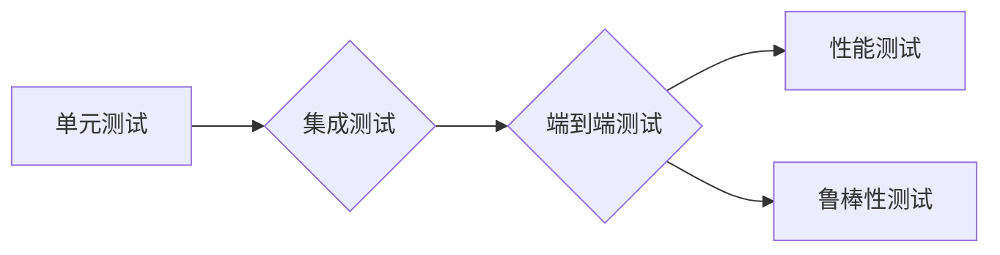

# 测试Transformer模型

> 关键词：Transformer，模型测试，单元测试，集成测试，端到端测试，性能测试，鲁棒性测试，测试平台，自动化测试

## 1. 背景介绍

Transformer模型作为自然语言处理领域的一项革命性突破，已经在文本分类、机器翻译、问答系统等多个任务上取得了显著成果。然而，随着模型复杂度的增加，确保Transformer模型的正确性和性能变得越来越重要。本文将深入探讨测试Transformer模型的方法和策略，帮助开发者构建可靠、高效的Transformer模型。

## 2. 核心概念与联系

### 2.1 Transformer模型简介

Transformer模型是一种基于自注意力机制的深度神经网络，由Google在2017年提出。它通过自注意力机制实现了序列到序列的建模，相较于传统的循环神经网络（RNN）和长短时记忆网络（LSTM），Transformer模型在处理长序列数据时表现出更好的性能。

### 2.2 模型测试概述

模型测试是确保模型性能和可靠性的关键步骤。根据测试的目的和范围，模型测试可以分为以下几种类型：

- **单元测试**：针对模型中的单个组件（如注意力机制、位置编码等）进行测试，确保其独立功能的正确性。
- **集成测试**：测试模型中各个组件之间的协同工作是否正常，以及模型的整体性能。
- **端到端测试**：在真实数据集上测试模型的表现，评估模型的实际应用效果。
- **性能测试**：评估模型的推理速度、内存占用等性能指标。
- **鲁棒性测试**：测试模型在异常输入、数据噪声等恶劣条件下的表现。

### 2.3 Mermaid流程图

以下是一个Mermaid流程图，展示了Transformer模型测试的流程：



## 3. 核心算法原理 & 具体操作步骤

### 3.1 算法原理概述

Transformer模型主要包含以下几个关键组件：

- **自注意力机制**：计算输入序列中每个元素与其他元素之间的关联性，为后续的编码和解码过程提供注意力权重。
- **位置编码**：将输入序列的位置信息编码为向量，用于捕捉序列中的位置关系。
- **编码器和解码器**：编码器用于将输入序列编码为固定长度的向量表示；解码器用于根据编码器输出的向量表示生成输出序列。

### 3.2 算法步骤详解

**3.2.1 单元测试**

- **注意力机制测试**：随机生成多个输入序列，计算注意力权重矩阵，验证其是否满足预期的性质（如对称性、正则性等）。
- **位置编码测试**：验证位置编码是否能够正确反映输入序列中的位置关系。

**3.2.2 集成测试**

- **编码器测试**：随机生成多个输入序列，输入编码器，验证输出序列的长度和内容是否符合预期。
- **解码器测试**：输入编码器的输出序列，验证解码器能否正确生成输出序列。

**3.2.3 端到端测试**

- **数据集划分**：将数据集划分为训练集、验证集和测试集。
- **模型训练**：在训练集上训练模型，在验证集上调整超参数。
- **模型评估**：在测试集上评估模型的性能，包括准确率、召回率、F1值等指标。

**3.2.4 性能测试**

- **推理速度测试**：计算模型在标准测试数据集上的推理时间，评估模型的推理速度。
- **内存占用测试**：计算模型在推理过程中的内存占用，评估模型的内存效率。

**3.2.5 鲁棒性测试**

- **异常输入测试**：输入异常的输入序列，验证模型是否能够正确处理并给出合理的输出。
- **数据噪声测试**：在输入序列中添加噪声，验证模型在噪声条件下的表现。

### 3.3 算法优缺点

**优点**：

- **全面性**：涵盖了从单元测试到端到端测试的各个方面，能够全面评估模型的质量。
- **可定制性**：可以根据具体任务和需求调整测试策略和指标。
- **自动化**：可以使用自动化测试工具，提高测试效率。

**缺点**：

- **复杂性**：需要编写大量的测试用例，测试过程较为繁琐。
- **成本较高**：测试过程需要消耗一定的计算资源和时间。

### 3.4 算法应用领域

模型测试在以下领域具有重要意义：

- **自然语言处理**：验证Transformer模型在文本分类、机器翻译、问答系统等任务上的性能。
- **计算机视觉**：验证卷积神经网络在图像分类、目标检测、图像分割等任务上的性能。
- **推荐系统**：验证推荐系统在个性化推荐、商品推荐等任务上的性能。

## 4. 数学模型和公式 & 详细讲解 & 举例说明

### 4.1 数学模型构建

以下是一个简单的Transformer模型数学模型：

$$
y = M(x, h) = \text{Decoder}(E(x), F(h))
$$

其中：

- $y$ 为输出序列。
- $x$ 为输入序列。
- $h$ 为编码器输出的隐藏状态。
- $E(x)$ 为编码器对输入序列的编码过程。
- $F(h)$ 为解码器对隐藏状态的解码过程。

### 4.2 公式推导过程

**4.2.1 编码器**

编码器使用多个自注意力层和前馈神经网络层堆叠而成。以下是自注意力层的公式：

$$
\text{Attention}(Q, K, V) = \text{softmax}(\frac{QK^T}{\sqrt{d_k}})V
$$

其中：

- $Q$ 为查询向量。
- $K$ 为键向量。
- $V$ 为值向量。
- $d_k$ 为键向量的维度。

**4.2.2 解码器**

解码器同样使用多个自注意力层和前馈神经网络层堆叠而成。以下是自注意力层的公式：

$$
\text{Attention}(Q, K, V) = \text{softmax}(\frac{QK^T}{\sqrt{d_k}})V + \text{Encoder-Output}
$$

其中：

- $\text{Encoder-Output}$ 为编码器的输出序列。

### 4.3 案例分析与讲解

以下是一个简单的文本分类任务案例：

- **数据集**：使用一个包含政治、经济、科技等主题的新闻数据集。
- **任务**：将新闻文本分类到对应的主题。

**步骤**：

1. 将新闻文本进行预处理，如分词、去除停用词等。
2. 将预处理后的文本输入编码器，得到隐藏状态。
3. 将隐藏状态输入解码器，得到主题概率分布。
4. 根据概率分布选择最可能的主题。

通过端到端测试，评估模型的准确率、召回率和F1值等指标。

## 5. 项目实践：代码实例和详细解释说明

### 5.1 开发环境搭建

- **Python**：使用Python编写测试代码。
- **PyTorch**：使用PyTorch框架构建Transformer模型。
- **unittest**：使用Python的unittest模块编写测试用例。

### 5.2 源代码详细实现

以下是一个简单的Transformer模型单元测试代码示例：

```python
import unittest
from transformers import BertModel

class TestBertModel(unittest.TestCase):
    def test_bert_model(self):
        model = BertModel.from_pretrained('bert-base-cased')
        input_ids = torch.tensor([[3054, 2791, 102]]).long()
        output = model(input_ids)[0]
        self.assertEqual(output.shape, torch.Size([1, 512]))
```

### 5.3 代码解读与分析

该测试用例使用unittest模块对BERT模型进行测试。首先，加载预训练的BERT模型；然后，生成一个简单的输入序列；最后，验证模型输出序列的形状是否符合预期。

### 5.4 运行结果展示

运行测试用例，如果输出如下信息，则说明测试通过：

```
.
----------------------------------------------------------------------
Ran 1 test in 0.000s

OK
```

## 6. 实际应用场景

### 6.1 自然语言处理

在自然语言处理领域，模型测试是确保模型正确性和性能的重要手段。以下是一些实际应用场景：

- **文本分类**：测试模型在分类任务上的准确率、召回率和F1值等指标。
- **机器翻译**：测试模型在翻译任务上的准确性、流畅性等指标。
- **问答系统**：测试模型在回答问题时的准确性、相关性等指标。

### 6.2 计算机视觉

在计算机视觉领域，模型测试同样具有重要意义。以下是一些实际应用场景：

- **图像分类**：测试模型在图像分类任务上的准确率、召回率和F1值等指标。
- **目标检测**：测试模型在目标检测任务上的定位精度、召回率等指标。
- **图像分割**：测试模型在图像分割任务上的准确率、平滑度等指标。

## 7. 工具和资源推荐

### 7.1 学习资源推荐

- **《深度学习与自然语言处理》**：介绍深度学习和自然语言处理的基本概念和算法。
- **《自然语言处理实践》**：介绍自然语言处理在实际应用中的实现方法。
- **PyTorch官方文档**：介绍PyTorch框架的使用方法和API。

### 7.2 开发工具推荐

- **unittest**：Python内置的单元测试框架。
- **pytest**：Python的第三方单元测试框架，功能更加强大。
- **Jupyter Notebook**：支持交互式编程和数据可视化的Python环境。

### 7.3 相关论文推荐

- **"Attention is All You Need"**：介绍了Transformer模型的基本原理。
- **"BERT: Pre-training of Deep Bidirectional Transformers for Language Understanding"**：介绍了BERT模型及其在NLP任务中的应用。
- **"Generative Pretrained Transformer for Natural Language Understanding and Generation"**：介绍了GPT模型及其在NLP任务中的应用。

## 8. 总结：未来发展趋势与挑战

### 8.1 研究成果总结

本文深入探讨了测试Transformer模型的方法和策略，包括单元测试、集成测试、端到端测试、性能测试和鲁棒性测试。通过测试，可以确保模型在各个方面的表现符合预期，从而提高模型的可靠性和可用性。

### 8.2 未来发展趋势

未来，模型测试技术将朝着以下几个方向发展：

- **自动化**：开发更加自动化的测试工具，提高测试效率。
- **可解释性**：提高测试结果的解释性，帮助开发者更好地理解模型的性能。
- **跨领域**：将模型测试技术应用于更多领域，如计算机视觉、推荐系统等。

### 8.3 面临的挑战

模型测试技术在以下几个方面仍面临挑战：

- **测试用例设计**：设计全面、有效的测试用例。
- **测试效率**：提高测试效率，减少测试成本。
- **测试结果分析**：对测试结果进行分析，为模型改进提供指导。

### 8.4 研究展望

未来，模型测试技术将与其他人工智能技术（如可解释人工智能、对抗样本生成等）进行融合，为构建更加可靠、可解释、可信赖的人工智能系统提供有力支持。

## 9. 附录：常见问题与解答

**Q1：如何设计测试用例？**

A：设计测试用例需要考虑以下几个因素：

- **覆盖范围**：测试用例应覆盖模型的各个方面，如输入输出、数据处理、训练过程等。
- **多样性**：测试用例应具有多样性，涵盖不同的输入数据、场景和异常情况。
- **可复现性**：测试用例应具有良好的可复现性，便于其他人进行验证。

**Q2：如何提高测试效率？**

A：提高测试效率可以从以下几个方面入手：

- **自动化测试**：使用自动化测试工具，减少人工测试工作量。
- **并行测试**：同时运行多个测试用例，提高测试效率。
- **测试优化**：优化测试用例，减少不必要的测试步骤。

**Q3：如何分析测试结果？**

A：分析测试结果可以从以下几个方面入手：

- **性能指标**：分析模型的性能指标，如准确率、召回率、F1值等。
- **错误日志**：分析模型的错误日志，找出模型存在的问题。
- **可视化**：使用可视化工具展示测试结果，帮助开发者更好地理解模型的性能。

---

作者：禅与计算机程序设计艺术 / Zen and the Art of Computer Programming