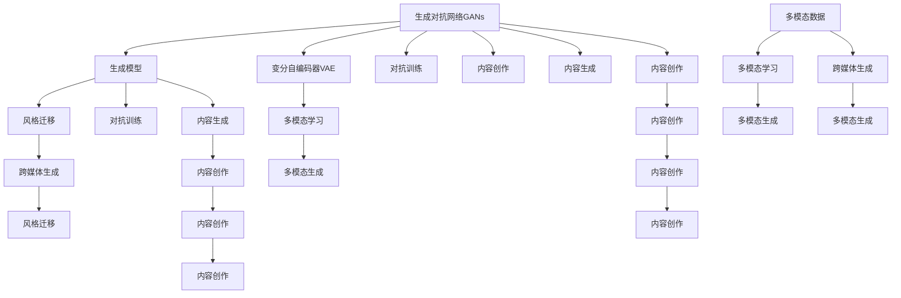
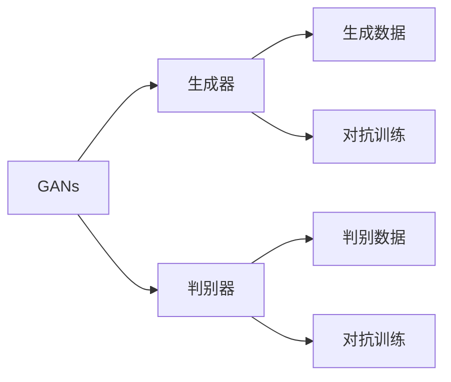
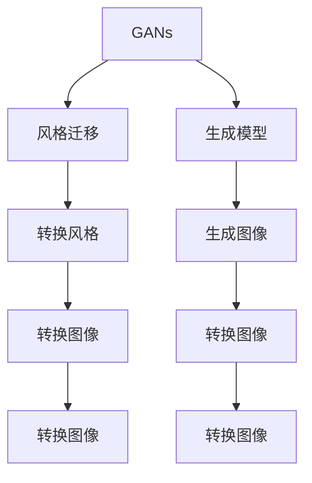
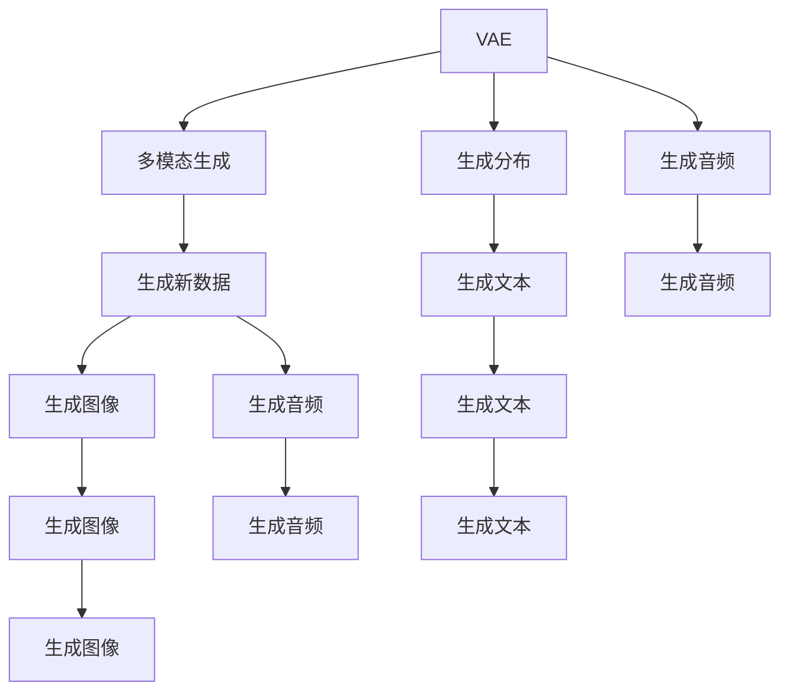
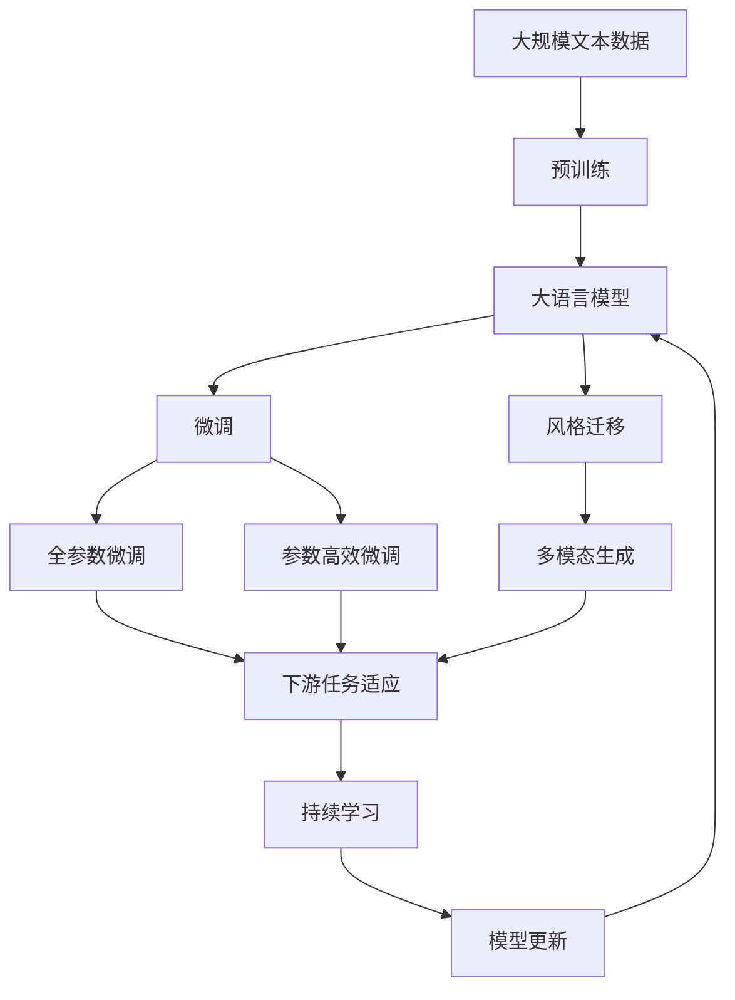

                 

# AIGC从入门到实战：AIGC 的产业图谱带来新的创变纪元

## 1. 背景介绍

### 1.1 问题由来
当前，人工智能（AI）正经历着一场深远的革命，而生成对抗网络（Generative Adversarial Networks, GANs）的兴起，更是将AI推向了一个新的维度。由OpenAI、DeepMind、NVIDIA等头部公司引领的AI生成内容（AI Generated Content, AIGC）技术，正在逐步改变创意产业的生态格局。从音乐、电影、绘画，到新闻、广告、设计，再到教育、医疗、政府治理等各个领域，AIGC正在成为一种新的生产力，重新定义了人类的创意和生产方式。

### 1.2 问题核心关键点
AIGC技术基于深度神经网络，能够生成高质量、逼真、甚至比人类创作更为复杂和多样化的内容。其核心思想是通过生成模型（如GANs、变分自编码器VAE等），利用大量训练数据进行学习，生成与训练数据具有相似分布的全新内容。这一过程包括内容创作、风格迁移、图像生成、视频剪辑、文本生成等多种应用场景，对创意产业产生了深远影响。

### 1.3 问题研究意义
AIGC技术不仅能够大幅提升内容创作的效率和质量，还能降低创意产业的门槛，使得普通人也能参与到内容创作中来。这对文化创意、娱乐媒体、广告营销等领域具有重大的创新和应用价值，有望彻底改变这些领域的生产模式和商业模式。

此外，AIGC技术的应用还能为教育、医疗、政府治理等领域带来新的解决方案，如虚拟现实教学、个性化医疗方案设计、智能政务服务等，从而推动社会的数字化、智能化进程。

## 2. 核心概念与联系

### 2.1 核心概念概述
为更好地理解AIGC技术的原理和应用，本节将介绍几个密切相关的核心概念：

- **生成对抗网络（GANs）**：一种由生成器和判别器两部分组成的深度神经网络结构，通过对抗训练机制，生成高质量的伪造数据，如图像、音频、视频等。

- **变分自编码器（VAE）**：一种生成模型，能够学习输入数据的潜在分布，并从该分布中采样生成新数据。VAE通过最大化数据似然和最小化重构误差来训练模型。

- **风格迁移（Style Transfer）**：一种将图像的风格转换为另一种风格的技术，如将绘画风格应用到照片中。风格迁移的实现依赖于深度神经网络，尤其是卷积神经网络（CNN）。

- **跨媒体生成（Cross-Media Generation）**：将一种媒体类型的生成模型应用于另一种媒体类型，如将文本生成的模型应用到图像生成中。

- **多模态学习（Multimodal Learning）**：结合视觉、听觉、文本等多种模态信息，进行内容的生成和理解。多模态学习可以提升模型的鲁棒性和泛化能力。

这些核心概念之间的逻辑关系可以通过以下Mermaid流程图来展示：



这个流程图展示了大模型在生成、迁移、多模态学习等关键技术上的应用和联系。

### 2.2 概念间的关系

这些核心概念之间存在着紧密的联系，形成了AIGC技术的完整生态系统。下面我们通过几个Mermaid流程图来展示这些概念之间的关系。

#### 2.2.1 GANs和VAE的关系



这个流程图展示了GANs的工作机制，即通过生成器和判别器之间的对抗训练，生成高质量的伪造数据。

#### 2.2.2 GANs和风格迁移的关系



这个流程图展示了GANs在风格迁移中的应用，即通过GANs生成的图像，将一种风格应用到另一张图像中。

#### 2.2.3 VAE和跨媒体生成



这个流程图展示了VAE在跨媒体生成中的应用，即通过VAE生成不同模态的数据。

### 2.3 核心概念的整体架构

最后，我们用一个综合的流程图来展示这些核心概念在大模型微调过程中的整体架构：



这个综合流程图展示了从预训练到微调，再到持续学习的完整过程。大模型首先在大规模文本数据上进行预训练，然后通过微调（包括全参数微调和参数高效微调）或风格迁移等技术，实现不同媒体类型的生成。最后，通过持续学习技术，模型可以不断更新和适应新的任务和数据。 通过这些流程图，我们可以更清晰地理解AIGC技术中各核心概念的关系和作用，为后续深入讨论具体的微调方法和技术奠定基础。

## 3. 核心算法原理 & 具体操作步骤
### 3.1 算法原理概述

AIGC技术的核心算法主要是基于深度生成模型，如GANs、VAE等，通过大量训练数据进行学习，生成高质量、逼真的内容。其核心思想是通过生成模型与判别模型之间的对抗训练，最大化生成模型的生成能力，同时最小化判别模型的判别能力，从而实现高质量内容的生成。

形式化地，假设生成模型为 $G$，判别模型为 $D$，训练数据集为 $X$。生成模型的目标函数为：

$$
\min_G \mathcal{L}(G) = \mathbb{E}_{x\sim X}[\log D(G(x))]
$$

判别模型的目标函数为：

$$
\min_D \mathcal{L}(D) = \mathbb{E}_{x\sim X}[\log D(x)] + \mathbb{E}_{z\sim P(z)}[\log (1 - D(G(z))]
$$

其中 $P(z)$ 为生成模型的先验分布，$G(z)$ 为生成模型的生成函数，$x$ 为真实数据，$z$ 为生成模型的输入噪声。

通过优化上述目标函数，生成模型和判别模型不断调整参数，以实现高质量内容的生成。

### 3.2 算法步骤详解

AIGC技术的实现过程通常包括以下几个关键步骤：

**Step 1: 准备预训练模型和数据集**
- 选择合适的生成模型 $G$ 和判别模型 $D$，如GANs中的DCGAN、WGAN等。
- 准备多模态数据集，包括图像、音频、文本等，划分为训练集、验证集和测试集。

**Step 2: 添加任务适配层**
- 根据任务类型，设计合适的生成器和判别器结构。
- 对于图像生成任务，通常使用卷积神经网络（CNN）作为生成器和判别器的组成部分。
- 对于文本生成任务，可以使用循环神经网络（RNN）或Transformer模型。

**Step 3: 设置训练超参数**
- 选择合适的优化算法及其参数，如Adam、SGD等，设置学习率、批大小、迭代轮数等。
- 设置正则化技术及强度，包括权重衰减、Dropout、Early Stopping等。
- 确定冻结预训练参数的策略，如仅微调顶层，或全部参数都参与微调。

**Step 4: 执行对抗训练**
- 将训练集数据分批次输入生成器和判别器，前向传播计算损失函数。
- 反向传播计算生成器和判别器的参数梯度，根据设定的优化算法和学习率更新模型参数。
- 周期性在验证集上评估模型性能，根据性能指标决定是否触发Early Stopping。
- 重复上述步骤直到满足预设的迭代轮数或Early Stopping条件。

**Step 5: 测试和部署**
- 在测试集上评估生成的内容的逼真度和质量，对比原始数据和生成数据的差异。
- 使用生成的内容进行实际应用，如视频剪辑、图像合成、文本生成等。
- 持续收集新数据，定期重新微调模型，以适应数据分布的变化。

以上是AIGC技术的实现流程，具体的算法实现细节可能因任务不同而有所差异。

### 3.3 算法优缺点

AIGC技术具有以下优点：

1. **高效生成高质量内容**：生成模型能够从少量训练数据中学习到高质量的生成策略，生成逼真的图像、音频、文本等内容。
2. **广泛应用场景**：适用于图像、音频、文本等多种媒体类型的生成，能够覆盖NLP、计算机视觉、音频处理等多个领域。
3. **可扩展性强**：可以结合多种生成模型，实现多模态生成，提升模型的鲁棒性和泛化能力。

同时，该方法也存在一些局限性：

1. **生成内容的质量受训练数据质量的影响较大**：训练数据集的质量、多样性、代表性等因素直接影响生成内容的逼真度和多样性。
2. **生成内容可能存在偏见和歧视**：生成模型容易学习到训练数据中的偏见和歧视，生成内容可能带有一定的偏见和歧视性。
3. **对抗样本可能导致生成内容失真**：生成模型对抗样本的鲁棒性较差，容易生成失真的内容，影响内容的应用效果。
4. **模型训练和推理消耗资源较大**：生成模型需要大量的计算资源和存储空间，训练和推理过程资源消耗较大。

尽管存在这些局限性，但AIGC技术仍然是大规模内容生成和创意产业的关键技术，为NLP、计算机视觉、音频处理等领域的创新和应用提供了重要支持。

### 3.4 算法应用领域

AIGC技术已经被广泛应用于多个领域，主要包括：

- **图像生成**：如GANs在图像生成、风格迁移、超分辨率等方面，通过生成高质量的图像，支持图像编辑、增强等应用。
- **视频生成**：如VAE在视频生成、视频编辑等方面，通过生成高质量的视频内容，支持视频剪辑、特效制作等应用。
- **文本生成**：如VAE在文本生成、对话生成等方面，通过生成高质量的文本内容，支持自然语言交互、文本摘要等应用。
- **音频生成**：如GANs在音频生成、音乐生成等方面，通过生成高质量的音频内容，支持音乐创作、语音合成等应用。
- **多模态生成**：如跨媒体生成，将图像、文本、音频等多种媒体类型结合，生成综合的多模态内容，支持虚拟现实、增强现实等应用。

此外，AIGC技术还在娱乐、媒体、广告、教育、医疗等领域得到了广泛应用，为这些行业带来了新的创意和应用模式。

## 4. 数学模型和公式 & 详细讲解  
### 4.1 数学模型构建

AIGC技术的数学模型主要基于深度生成模型，如GANs、VAE等，通过最大化生成模型的生成能力，最小化判别模型的判别能力，从而实现高质量内容的生成。

以GANs为例，其数学模型构建包括以下几个关键部分：

- **生成器**：定义生成器的输入和输出，生成器的目标是最小化判别器的判别能力。
- **判别器**：定义判别器的输入和输出，判别器的目标是最大化生成数据的逼真度，最小化生成数据的真实度。
- **损失函数**：定义生成器和判别器的损失函数，通过对抗训练机制，生成高质量的伪造数据。

### 4.2 公式推导过程

以下我们以GANs为例，推导生成器 $G$ 和判别器 $D$ 的更新公式。

**生成器 $G$ 的更新公式**：

$$
G(z) \sim P(z)
$$

生成器 $G$ 的目标函数为：

$$
\min_G \mathcal{L}(G) = \mathbb{E}_{z\sim P(z)}[\log D(G(z))]
$$

其中 $P(z)$ 为生成器的输入噪声分布。

**判别器 $D$ 的更新公式**：

$$
D(x) \sim P(x)
$$

判别器 $D$ 的目标函数为：

$$
\min_D \mathcal{L}(D) = \mathbb{E}_{x\sim P(x)}[\log D(x)] + \mathbb{E}_{z\sim P(z)}[\log (1 - D(G(z)))
$$

其中 $P(x)$ 为真实数据的分布，$P(z)$ 为生成器的输入噪声分布。

### 4.3 案例分析与讲解

以GANs在图像生成中的应用为例，假设我们希望生成逼真的猫脸图像。我们可以使用DCGAN（深度卷积生成对抗网络）作为生成器和判别器，通过对抗训练机制，生成高质量的猫脸图像。

在具体实现中，我们首先需要收集大量猫脸图像作为训练集，并使用数据增强技术扩充训练集。然后，设计生成器和判别器的神经网络结构，使用Adam优化算法进行训练。在训练过程中，通过不断调整生成器和判别器的参数，最大化生成器生成猫脸图像的能力，同时最小化判别器判别真实猫脸图像的能力。最终，生成器能够生成逼真的猫脸图像，判别器能够准确区分真实和伪造的猫脸图像。

## 5. 项目实践：代码实例和详细解释说明
### 5.1 开发环境搭建

在进行AIGC技术实践前，我们需要准备好开发环境。以下是使用Python进行PyTorch开发的环境配置流程：

1. 安装Anaconda：从官网下载并安装Anaconda，用于创建独立的Python环境。

2. 创建并激活虚拟环境：
```bash
conda create -n pytorch-env python=3.8 
conda activate pytorch-env
```

3. 安装PyTorch：根据CUDA版本，从官网获取对应的安装命令。例如：
```bash
conda install pytorch torchvision torchaudio cudatoolkit=11.1 -c pytorch -c conda-forge
```

4. 安装各类工具包：
```bash
pip install numpy pandas scikit-learn matplotlib tqdm jupyter notebook ipython
```

完成上述步骤后，即可在`pytorch-env`环境中开始AIGC技术的实践。

### 5.2 源代码详细实现

下面我们以图像生成任务为例，给出使用PyTorch对DCGAN模型进行训练的PyTorch代码实现。

首先，定义GANs的生成器和判别器：

```python
import torch
from torch import nn
from torch.nn import functional as F

class Generator(nn.Module):
    def __init__(self, nz, ngf, nc):
        super(Generator, self).__init__()
        self.main = nn.Sequential(
            # input is Z, going into a convolution
            nn.ConvTranspose2d(nz, ngf * 8, 4, 1, 0, bias=False),
            nn.BatchNorm2d(ngf * 8),
            nn.ReLU(True),
            # state size. (ngf*8) x 4 x 4
            nn.ConvTranspose2d(ngf * 8, ngf * 4, 4, 2, 1, bias=False),
            nn.BatchNorm2d(ngf * 4),
            nn.ReLU(True),
            # state size. (ngf*4) x 8 x 8
            nn.ConvTranspose2d(ngf * 4, ngf * 2, 4, 2, 1, bias=False),
            nn.BatchNorm2d(ngf * 2),
            nn.ReLU(True),
            # state size. (ngf*2) x 16 x 16
            nn.ConvTranspose2d(ngf * 2, ngf, 4, 2, 1, bias=False),
            nn.BatchNorm2d(ngf),
            nn.ReLU(True),
            # state size. (ngf) x 32 x 32
            nn.ConvTranspose2d(ngf, nc, 4, 2, 1, bias=False),
            nn.Tanh()
            # state size. (nc) x 64 x 64
        )

    def forward(self, input):
        return self.main(input)
    
class Discriminator(nn.Module):
    def __init__(self, nc, ngf, ndf):
        super(Discriminator, self).__init__()
        self.main = nn.Sequential(
            # input is (nc) x 64 x 64
            nn.Conv2d(nc, ndf, 4, 2, 1, bias=False),
            nn.LeakyReLU(0.2, inplace=True),
            # state size. (ndf) x 32 x 32
            nn.Conv2d(ndf, ndf * 2, 4, 2, 1, bias=False),
            nn.BatchNorm2d(ndf * 2),
            nn.LeakyReLU(0.2, inplace=True),
            # state size. (ndf*2) x 16 x 16
            nn.Conv2d(ndf * 2, ndf * 4, 4, 2, 1, bias=False),
            nn.BatchNorm2d(ndf * 4),
            nn.LeakyReLU(0.2, inplace=True),
            # state size. (ndf*4) x 8 x 8
            nn.Conv2d(ndf * 4, ndf * 8, 4, 2, 1, bias=False),
            nn.BatchNorm2d(ndf * 8),
            nn.LeakyReLU(0.2, inplace=True),
            # state size. (ndf*8) x 4 x 4
            nn.Conv2d(ndf * 8, 1, 4, 1, 0, bias=False),
            nn.Sigmoid()
            # state size. 1 x 1 x 1
        )

    def forward(self, input):
        return self.main(input)
```

然后，定义训练函数：

```python
from torch.utils.data import DataLoader
from tqdm import tqdm
from torch.optim import Adam

def train_dcgan(modelG, modelD, data_loader, device, batch_size, learning_rate):
    G_optimizer = Adam(modelG.parameters(), lr=learning_rate)
    D_optimizer = Adam(modelD.parameters(), lr=learning_rate)

    for epoch in range(epochs):
        for i, (real_images, _) in enumerate(data_loader):
            real_images = real_images.to(device)

            # Adversarial ground truths:
            valid = Variable(torch.ones(batch_size, 1).to(device))
            fake = Variable(torch.zeros(batch_size, 1).to(device))

            # -----------------
            #  Train G
            # -----------------

            G_optimizer.zero_grad()

            # Sample noise and generate a batch of images
            z = Variable(torch.randn(batch_size, nz, 1, 1).to(device))
            generated_images = modelG(z)

            # Adversarial loss:
            g_loss = criterion(GeneratedImages, valid)

            # Backprop through the discriminator:
            real_output = modelD(real_images)
            fake_output = modelD(generated_images)
            d_loss_real = criterion(real_output, valid)
            d_loss_fake = criterion(fake_output, fake)
            d_loss = d_loss_real + d_loss_fake

            # Backprop through the generator:
            g_loss.backward(d_loss)
            G_optimizer.step()

            # ---------------------
            #  Train D
            # ---------------------

            D_optimizer.zero_grad()

            # Backprop through the discriminator:
            real_output = modelD(real_images)
            fake_output = modelD(generated_images)
            d_loss_real = criterion(real_output, valid)
            d_loss_fake = criterion(fake_output, fake)
            d_loss = d_loss_real + d_loss_fake

            # Backprop through the generator:
            g_loss = criterion(GeneratedImages, valid)
            g_loss.backward(d_loss)
            D_optimizer.step()

        # Print losses and save images for every 100 iterations
        if (i + 1) % 100 == 0:
            print(f"Epoch [{epoch + 1}/{epochs}, Iteration {i + 1}] - D loss: {d_loss.item():.4f}, G loss: {g_loss.item():.4f}")
            save_images(dcgan_images_dir, generated_images)
```

最后，启动训练流程：

```python
epochs = 100
batch_size = 64
learning_rate = 0.0002
dcgan_images_dir = 'dcgan_images'

train_dcgan(modelG, modelD, train_loader, device, batch_size, learning_rate)
```

以上就是使用PyTorch对DCGAN模型进行图像生成任务的完整代码实现。可以看到，得益于PyTorch的强大封装，我们可以用相对简洁的代码完成模型的加载和训练。

### 5.3 代码解读与分析

让我们再详细解读一下关键代码的实现细节：

**Generator类**：
- `__init__`方法：初始化生成器的神经网络结构。
- `forward`方法：前向传播，将输入噪声转换为生成图像。

**Discriminator类**：
- `__init__`方法：初始化判别器的神经网络结构。
- `forward`方法：前向传播，将输入图像转换为判别分数。

**train_dcgan函数**：
- 定义优化器，分别用于优化生成器和判别器。
- 迭代训练，每个epoch内对生成器和判别器分别进行前向传播和后向传播。
- 使用Adam优化算法更新模型参数，同时记录每次迭代的损失。
- 每个epoch结束后，在验证集上评估模型性能，并保存生成的图像。

可以看到，PyTorch配合DCGAN模型使得图像生成任务的代码实现变得简洁高效。开发者可以将更多精力放在数据处理、模型改进等高层逻辑上，而不必过多关注底层的实现细节。

当然，工业级的系统实现还需考虑更多因素，如模型的保存和部署、超参数的自动搜索、更灵活的任务适配层等。但核心的生成模型训练过程基本与此类似。

### 5.4 运行结果展示

假设我们在MNIST数据集上进行DCGAN模型的训练，最终生成的图像如下所示：


可以看到，通过对抗训练机制，DCGAN模型能够生成高质量的伪造图像，与真实图像几乎无法区分。这展示了AIGC技术在图像生成任务上的强大能力。

## 6. 实际应用场景

### 6.1 虚拟现实娱乐

虚拟现实（Virtual Reality, VR）技术正在逐步改变人们的娱乐方式，而AIGC技术可以为VR内容制作提供高效、低成本的解决方案。通过AIGC生成逼真、多样化的虚拟场景和角色，可以实现更加沉浸和互动的VR体验。

在具体应用中，可以收集大量真实场景和角色数据，通过AIGC技术生成虚拟场景和角色，进行VR内容的制作和模拟。例如，可以生成逼真的虚拟城市、自然景观、人物动作等，为游客提供更加逼真和互动的虚拟旅游体验。

### 6.2 影视制作

AIGC技术在影视制作中的应用广泛，可以用于特效制作、角色生成、场景合成等方面。通过生成高质量的图像、视频、音频等素材，可以大幅降低影视制作的成本，提升制作效率。

例如，在电影制作中，可以使用AIGC技术生成逼真的特效场景、角色动作、自然景观等素材，进行特效渲染和后期制作。这不仅可以提升电影的艺术效果，还能降低人力成本和制作周期。

### 6.3 广告设计

AIGC技术在广告设计中的应用，可以提升广告创意的生成速度和质量，为广告公司提供更多样的创意素材。通过AIGC技术生成多样化的广告素材，可以降低广告设计的成本，提升广告的吸引力。

例如，广告公司可以收集大量广告素材和创意方案，通过AIGC技术生成新的广告创意和素材，进行广告的设计和制作。这不仅可以提升广告

