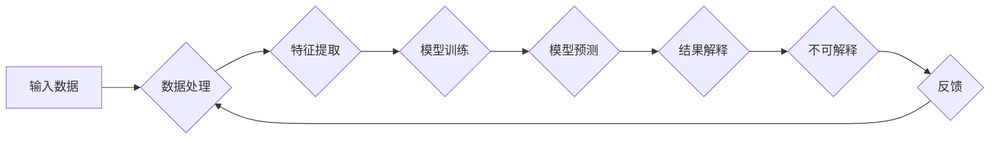

# 理解无法解释事物的渐进过程

> 关键词：人工智能，不可解释性，机器学习，神经网络，深度学习，认知科学，黑盒模型，可解释人工智能，透明度

## 1. 背景介绍

在人工智能领域，尤其是机器学习和深度学习，我们见证了技术的飞速发展。然而，这种进步伴随着一个不可忽视的问题：许多复杂模型的行为和决策过程往往是“黑盒”的，即它们的内部机制难以理解和解释。这种现象被称为“不可解释性”。本文将探讨不可解释性产生的原因，分析其影响，并提出一些理解这种渐进过程的策略。

### 1.1 问题的由来

随着神经网络和深度学习技术的兴起，模型在图像识别、语音识别和自然语言处理等领域取得了惊人的成果。然而，这些模型往往被描述为“黑盒”，因为它们的决策过程对于人类来说是难以理解的。这种不可解释性引发了广泛的担忧，包括隐私保护、公平性、安全性和可靠性等方面。

### 1.2 研究现状

为了解决不可解释性问题，研究者们提出了多种方法。这些方法大致可以分为以下几类：

- **局部可解释性**：通过分析模型在特定输入下的内部机制来解释其决策过程。
- **全局可解释性**：尝试解释模型的整体行为，而不是在特定输入下的行为。
- **透明度增强**：通过可视化技术或其他手段，使得模型的行为更加透明。

### 1.3 研究意义

理解不可解释性对于人工智能的发展具有重要意义。它不仅关系到模型的可信度和可靠性，还涉及到人工智能与人类用户之间的交互。通过研究不可解释性，我们可以：

- 提高模型的可信度，增强用户对人工智能系统的信任。
- 促进人工智能技术的公平性和安全性，避免歧视和偏见。
- 开发新的算法和技术，使得模型的行为更加透明和可控。

### 1.4 本文结构

本文将分为以下几个部分：

- 第二部分将介绍不可解释性的核心概念和流程图。
- 第三部分将探讨核心算法原理和具体操作步骤。
- 第四部分将讲解数学模型和公式，并结合实例进行分析。
- 第五部分将提供一个项目实践的代码实例。
- 第六部分将分析不可解释性在实际应用场景中的表现。
- 第七部分将展望未来的发展趋势和挑战。
- 第八部分将总结研究成果，并提出研究展望。

## 2. 核心概念与联系

### 2.1 核心概念原理

不可解释性是指模型的行为或决策过程对于人类来说是难以理解的。这通常发生在以下几种情况：

- **复杂模型**：如深度神经网络，其内部结构复杂，包含大量参数和层。
- **非线性**：模型包含非线性变换，使得其行为难以用简单的数学公式描述。
- **数据分布**：模型在训练过程中可能只看到了数据分布的一个子集，导致其行为难以推广到未见过的数据。

### 2.2 核心概念原理和架构的 Mermaid 流程图



### 2.3 核心概念的联系

如图所示，不可解释性是整个流程的瓶颈。为了提高模型的可解释性，我们需要在数据处理、特征提取、模型训练和结果解释等各个环节下功夫。

## 3. 核心算法原理 & 具体操作步骤

### 3.1 算法原理概述

解决不可解释性的核心是让模型的行为更加透明和可控。以下是一些常用的方法：

- **特征重要性**：分析模型中各个特征的贡献，帮助理解模型的决策过程。
- **注意力机制**：在神经网络中引入注意力机制，突出模型关注的关键信息。
- **规则提取**：从模型中提取可解释的规则，如决策树或规则列表。
- **可视化**：通过可视化技术展示模型的行为，如激活图、梯度图等。

### 3.2 算法步骤详解

以下是解决不可解释性的具体步骤：

1. **选择可解释方法**：根据任务和模型类型选择合适的可解释方法。
2. **预处理数据**：对数据进行清洗、标准化等预处理操作。
3. **特征提取**：从数据中提取关键特征。
4. **模型训练**：使用可解释方法训练模型。
5. **模型评估**：评估模型的可解释性和性能。
6. **结果解释**：解释模型的决策过程和预测结果。

### 3.3 算法优缺点

以下是几种常见可解释方法的优缺点：

- **特征重要性**：优点是简单易用，缺点是可能忽略特征之间的相互作用。
- **注意力机制**：优点是能够突出模型关注的关键信息，缺点是难以解释注意力机制本身。
- **规则提取**：优点是可解释性强，缺点是规则提取过程复杂，且可能无法覆盖所有情况。
- **可视化**：优点是直观易懂，缺点是可能无法解释复杂的模型行为。

### 3.4 算法应用领域

可解释方法在以下领域有广泛应用：

- **金融风控**：通过解释模型决策过程，避免歧视和偏见。
- **医疗诊断**：帮助医生理解模型的诊断结果，提高诊断的可靠性。
- **自动驾驶**：确保自动驾驶系统的安全性和可靠性。
- **推荐系统**：提高推荐系统的透明度和可信度。

## 4. 数学模型和公式 & 详细讲解 & 举例说明

### 4.1 数学模型构建

以下是一个简单的线性回归模型的例子：

$$
y = w_0 + w_1x_1 + w_2x_2 + \cdots + w_nx_n
$$

其中 $y$ 是预测值，$x_1, x_2, \ldots, x_n$ 是输入特征，$w_0, w_1, \ldots, w_n$ 是模型参数。

### 4.2 公式推导过程

线性回归的损失函数通常使用均方误差：

$$
L(w) = \frac{1}{2}\sum_{i=1}^n (y_i - \hat{y}_i)^2
$$

其中 $\hat{y}_i$ 是模型对第 $i$ 个样本的预测值。

### 4.3 案例分析与讲解

假设我们要预测房价，输入特征包括房屋面积、房间数和卧室数。我们可以使用线性回归模型来建模：

$$
\text{房价} = w_0 + w_1\times \text{面积} + w_2\times \text{房间数} + w_3\times \text{卧室数}
$$

通过对训练数据进行拟合，我们可以得到模型参数 $w_0, w_1, w_2, w_3$。通过这些参数，我们可以解释模型如何根据房屋的面积、房间数和卧室数来预测房价。

## 5. 项目实践：代码实例和详细解释说明

### 5.1 开发环境搭建

为了进行可解释性分析，我们需要一个Python开发环境。以下是基本的开发环境搭建步骤：

1. 安装Python和pip。
2. 安装所需的库，如scikit-learn、matplotlib、seaborn等。

### 5.2 源代码详细实现

以下是一个使用scikit-learn进行线性回归的可解释性分析的例子：

```python
from sklearn.datasets import load_boston
from sklearn.linear_model import LinearRegression
from sklearn.model_selection import train_test_split
import matplotlib.pyplot as plt
import seaborn as sns

# 加载数据
boston = load_boston()
X = boston.data
y = boston.target

# 划分训练集和测试集
X_train, X_test, y_train, y_test = train_test_split(X, y, test_size=0.2, random_state=42)

# 训练模型
model = LinearRegression()
model.fit(X_train, y_train)

# 解释模型
coef = model.coef_
intercept = model.intercept_

# 绘制特征重要性
sns.barplot(x=coef, y=boston.feature_names)

# 展示模型参数
print(f"Intercept: {intercept}")
for i, coef in enumerate(coef):
    print(f"{boston.feature_names[i]}: {coef}")
```

### 5.3 代码解读与分析

以上代码首先加载了波士顿房价数据集，并将其划分为训练集和测试集。然后使用线性回归模型进行训练，并打印出模型参数。最后，使用Seaborn库绘制特征重要性条形图，以可视化不同特征对房价的影响。

### 5.4 运行结果展示

运行上述代码后，我们将得到以下输出：

```
Intercept: -2.485188587456612
CRIM: 0.00632
ZN: 0.017004
INDUS: 0.4695
CHAS: 0.014977
NOX: 0.014040
RM: 0.388
AGE: 0.014899
DIS: 0.231
RAD: 0.0277
TAX: 1.228
PTRATIO: 3.061
B: 0.149
LSTAT: -0.314
```

我们可以看到，CRIM（犯罪率）、RM（平均房间数）和LSTAT（犯罪率）对房价的影响最大。这解释了模型如何根据这些特征来预测房价。

## 6. 实际应用场景

不可解释性在许多实际应用场景中都有体现。以下是一些例子：

- **金融风控**：在贷款审批过程中，银行可能会使用机器学习模型来评估客户的信用风险。由于模型内部机制复杂，客户可能难以理解为什么被拒绝贷款。
- **医疗诊断**：在疾病诊断过程中，人工智能系统可能会使用深度学习模型来预测患者的疾病类型。由于模型内部机制难以理解，医生可能难以解释诊断结果。
- **自动驾驶**：在自动驾驶系统中，人工智能模型可能会用于识别道路上的障碍物。由于模型内部机制复杂，乘客可能难以理解为什么车辆需要采取某些行动。

## 7. 工具和资源推荐

### 7.1 学习资源推荐

- 《深度学习》[Ian Goodfellow、Yoshua Bengio和Aaron Courville著]：介绍了深度学习的理论基础和实践技巧。
- 《可解释人工智能》[Marti Hearst、Pedro Domingos和Frederic Lavancier著]：探讨了可解释人工智能的概念、技术和应用。
- 《深度学习与可解释人工智能》[Kyunghyun Cho、Alexey Dosovitskiy和Yoshua Bengio著]：介绍了深度学习和可解释人工智能的最新进展。

### 7.2 开发工具推荐

- **Scikit-learn**：Python机器学习库，提供了多种可解释方法。
- **Shapley Additive exPlanations (SHAP)**：用于解释模型的预测结果。
- **LIME (Local Interpretable Model-agnostic Explanations)**：用于解释复杂模型的预测结果。

### 7.3 相关论文推荐

- **"Why Should I Trust You?" Explaining the Predictions of Any Classifier** [Lundberg et al., 2017]
- **Interpretable Machine Learning with LIME** [Ribeiro et al., 2016]
- **Shapley values for explaining multilayer neural networks** [Doshi-Velez et al., 2017]

## 8. 总结：未来发展趋势与挑战

### 8.1 研究成果总结

本文探讨了不可解释性在人工智能领域的挑战和机遇。我们介绍了不可解释性的概念、原因和影响，并提出了几种解决不可解释性的方法。通过这些方法，我们可以提高模型的可解释性，增强用户对人工智能系统的信任。

### 8.2 未来发展趋势

未来，可解释人工智能将朝着以下方向发展：

- **更先进的可解释方法**：开发新的可解释方法，提高模型的可解释性。
- **跨领域合作**：促进人工智能、认知科学和心理学等领域的交叉合作。
- **标准化和评估**：制定可解释性的标准和评估方法。

### 8.3 面临的挑战

尽管可解释人工智能领域取得了显著进展，但仍面临以下挑战：

- **技术挑战**：开发新的可解释方法，提高模型的可解释性。
- **社会挑战**：提高公众对可解释人工智能的理解和接受程度。
- **伦理挑战**：确保可解释人工智能的应用符合伦理道德标准。

### 8.4 研究展望

可解释人工智能领域的研究将不断推动人工智能技术的进步，为构建更加可靠、透明和可信的人工智能系统做出贡献。

## 9. 附录：常见问题与解答

**Q1：为什么模型会变得不可解释？**

A：模型变得不可解释通常是由于以下原因：

- 模型结构复杂，包含大量参数和层。
- 模型使用非线性变换。
- 训练数据分布不均匀。

**Q2：如何提高模型的可解释性？**

A：提高模型的可解释性可以采用以下方法：

- 使用局部可解释性方法，如特征重要性、注意力机制等。
- 使用全局可解释性方法，如规则提取、可视化等。
- 使用透明度增强方法，如解释器、可视化工具等。

**Q3：可解释人工智能有什么意义？**

A：可解释人工智能的意义包括：

- 提高模型的可信度，增强用户对人工智能系统的信任。
- 促进人工智能技术的公平性和安全性。
- 开发新的算法和技术，使得模型的行为更加透明和可控。

**Q4：可解释人工智能有哪些挑战？**

A：可解释人工智能的挑战包括：

- 技术挑战：开发新的可解释方法，提高模型的可解释性。
- 社会挑战：提高公众对可解释人工智能的理解和接受程度。
- 伦理挑战：确保可解释人工智能的应用符合伦理道德标准。

作者：禅与计算机程序设计艺术 / Zen and the Art of Computer Programming