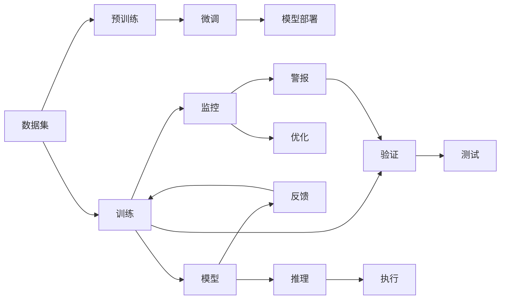

                 

# 电影《我，机器人》对AI的未来预测

## 1. 背景介绍

### 1.1 问题由来

《我，机器人》（I, Robot）是由库布里克执导的一部科幻电影，其剧情基于艾萨克·阿西莫夫的同名短篇小说集，融合了机器人、道德、哲学与技术等多个元素。尽管电影上映于2004年，但它对人工智能的描绘与现实世界的AI技术发展趋势有着惊人的预见性和洞察力，值得我们深入分析。

### 1.2 问题核心关键点

《我，机器人》中的AI技术预见主要体现在以下几个方面：

- **自主性**：机器人拥有高度自主性，能够独立完成任务，无需人类干预。
- **情感和伦理**：机器人具备基本的情感和伦理判断能力，能够理解并遵循人类的道德规范。
- **控制和监督**：人类对机器人进行了严格控制和监督，避免其滥用自主性。
- **技术融合**：AI技术与其他科技（如虚拟现实、人工智能增强系统）融合，实现了高度智能化。

这些关键点在今天的人工智能技术中均有所体现，电影中的预设与现实技术的发展轨迹有着惊人的相似性。通过对电影中的技术预见进行深入分析，我们可以更清晰地理解AI的未来发展方向和潜在挑战。

### 1.3 问题研究意义

《我，机器人》所展示的AI技术预见，对于理解人工智能的伦理、道德和应用边界具有重要意义：

- 帮助我们审视AI技术的潜在风险，警醒对未来技术发展的审慎态度。
- 提供了一个关于AI与人类关系的重要思考，探讨AI在社会中的定位。
- 预测未来可能的技术发展路径，对现有AI技术的进步和创新有指导作用。

## 2. 核心概念与联系

### 2.1 核心概念概述

为更好地理解《我，机器人》中的AI技术预见，本节将介绍几个核心概念：

- **人工智能(AI)**：广义上指通过模拟人类智能实现的一系列技术，包括感知、推理、学习等。
- **机器人(Robot)**：具有自主行动能力的自动化装置，能够执行重复性任务。
- **自主系统(Self-Driving System)**：指能够自我学习、自我决策的系统，无需人类直接干预。
- **机器学习（Machine Learning）**：使机器能够通过数据自动学习和改进的技术。
- **深度学习（Deep Learning）**：机器学习的一种，特别适用于处理大规模复杂数据，模仿人脑神经网络。

这些概念构成了AI技术的基础，对《我，机器人》中的AI预见有着直接影响。

### 2.2 概念间的关系

这些核心概念之间存在紧密的联系，形成了一个相互作用的生态系统。通过这些概念的相互作用，我们可以理解AI技术的实际应用和未来发展方向：

```mermaid
graph TB
    A[人工智能] --> B[机器人]
    A --> C[自主系统]
    A --> D[机器学习]
    A --> E[深度学习]
    B --> F[感知]
    B --> G[推理]
    B --> H[学习]
    C --> I[自我学习]
    C --> J[自我决策]
    D --> K[数据驱动]
    E --> L[复杂模型]
    F --> M[视觉]
    F --> N[声音]
    G --> O[逻辑]
    G --> P[推理引擎]
    H --> Q[数据积累]
    I --> R[自主更新]
    J --> S[行动执行]
    K --> T[大数据处理]
    L --> U[深度网络]
    M --> V[图像处理]
    M --> W[目标检测]
    N --> X[语音识别]
    N --> Y[自然语言处理]
    O --> Z[规则库]
    P --> $[逻辑推理]
    Q --> [#]�[经验]
    R --> [+][更新]
    S --> [∞]路易·德·洛[执行]
    T --> [#]@[数据挖掘]
    U --> [∞]路易·德·洛[模型]
    V --> [∞]路易·德·洛[图像理解]
    W --> [∞]路易·德·洛[目标识别]
    X --> [∞]路易·德·洛[语音生成]
    Y --> [∞]路易·德·洛[语言理解]
    Z --> [∞]路易·德·洛[规则]
    [+] --> [∞]路易·德·洛[逻辑]
    [∞] --> [∞]路易·德·洛[融合]
```

这个图表展示了AI技术中的关键组件和过程，通过这些组件和过程，AI系统能够实现感知、推理和学习的核心功能。同时，这些过程也能够形成闭环，不断地学习和改进，最终实现自主系统的目标。

### 2.3 核心概念的整体架构

大语言模型整体架构展示了AI技术在机器人、自主系统中的应用，通过这一架构，我们可以更清晰地理解AI技术的实际应用场景和未来发展方向。



这个架构展示了从数据预处理、模型训练到模型推理的整个过程，通过对每个环节的深入分析，我们可以更好地理解AI技术在现实世界中的应用。

## 3. 核心算法原理 & 具体操作步骤

### 3.1 算法原理概述

《我，机器人》中的AI技术预见主要基于以下几个算法原理：

- **监督学习**：通过有标注的数据集训练模型，使其能够进行分类、回归等任务。
- **无监督学习**：利用未标注数据，让模型自主学习数据中的潜在规律。
- **强化学习**：让机器在环境中通过奖励机制学习最优决策策略。
- **迁移学习**：将一个领域学到的知识迁移到另一个领域，以适应新任务。

这些算法原理构成了AI技术的基石，使得AI系统能够在各种场景下自主学习和完成任务。

### 3.2 算法步骤详解

基于这些算法原理，AI技术的具体操作步骤可以分为以下几个步骤：

1. **数据收集**：收集与任务相关的数据集，包括结构化数据、非结构化数据等。
2. **数据预处理**：清洗、归一化、特征工程等步骤，使得数据适合用于训练模型。
3. **模型选择**：选择合适的算法和模型架构，如深度神经网络、支持向量机、决策树等。
4. **模型训练**：使用训练数据集，通过迭代算法（如随机梯度下降）训练模型。
5. **模型评估**：使用验证数据集评估模型性能，调整模型参数。
6. **模型部署**：将训练好的模型部署到实际应用场景中，进行推理和执行。
7. **模型监控与优化**：实时监控模型性能，进行参数调整和优化。

这些操作步骤构成了AI技术的完整生命周期，通过对每个步骤的深入分析，我们可以更好地理解AI技术的具体应用。

### 3.3 算法优缺点

AI技术在《我，机器人》中的预见具有以下优缺点：

**优点**：

- **自主性**：能够自主完成任务，减少了对人力的依赖。
- **效率高**：自动化处理可以大幅提高工作效率，降低错误率。
- **可扩展性**：模型和算法可以通过数据不断优化，提高适应性。

**缺点**：

- **数据依赖**：模型的训练和优化依赖于大量标注数据，数据获取成本高。
- **安全问题**：缺乏伦理道德约束的AI系统可能存在安全风险。
- **复杂度**：模型结构复杂，需要较高的计算资源和专业知识。

这些优缺点反映了AI技术在实际应用中的现实挑战，需要在技术进步和应用推广中加以平衡。

### 3.4 算法应用领域

AI技术在《我，机器人》中的预见涵盖了以下几个主要应用领域：

- **自动化生产**：工业机器人、自动化流水线等，实现生产流程自动化。
- **医疗健康**：智能诊断、个性化医疗等，提高医疗服务质量和效率。
- **智能交通**：自动驾驶、交通管理等，提升交通安全和效率。
- **金融服务**：智能投顾、信用评估等，提供个性化金融服务。
- **教育培训**：智能辅导、个性化学习等，提升教育效果。

这些领域展示了AI技术的广泛应用，反映了未来AI技术的巨大发展潜力。

## 4. 数学模型和公式 & 详细讲解 & 举例说明

### 4.1 数学模型构建

在《我，机器人》中，AI技术的预见主要基于以下几个数学模型：

- **线性回归模型**：用于预测数值型数据，形式为 $y = \beta_0 + \beta_1x_1 + \beta_2x_2 + \cdots + \beta_nx_n$。
- **逻辑回归模型**：用于分类任务，形式为 $P(y=1|x) = \frac{1}{1 + e^{-\theta^Tx}}$。
- **支持向量机(SVM)**：用于分类和回归任务，通过在高维空间中寻找最优超平面。
- **深度神经网络**：通过多层非线性变换，实现复杂的数据建模。

这些数学模型构成了AI技术的数学基础，通过对这些模型的详细讲解，我们可以更好地理解AI技术的理论框架。

### 4.2 公式推导过程

以逻辑回归模型为例，推导其在分类任务中的应用：

假设训练数据集为 $(x_i,y_i)$，其中 $y_i \in \{0,1\}$，$x_i \in \mathbb{R}^n$，模型参数为 $\theta$，则逻辑回归模型的损失函数为：

$$
\mathcal{L}(\theta) = -\frac{1}{N} \sum_{i=1}^N [y_i\log P(y_i=1|x_i) + (1-y_i)\log P(y_i=0|x_i)]
$$

其中 $P(y_i=1|x_i) = \frac{1}{1 + e^{-\theta^Tx_i}}$，$\theta^T$ 为参数向量。通过求解 $\mathcal{L}(\theta)$ 的最小值，可以更新模型参数 $\theta$。

### 4.3 案例分析与讲解

以图像识别任务为例，展示深度神经网络在实际应用中的详细计算过程：

- **输入层**：将输入图像转换为向量表示，即 $x_i \in \mathbb{R}^m$。
- **隐藏层**：通过非线性变换，将输入映射到更高维空间，即 $z_i = g(\theta_1^Tx_i + b_1)$。
- **输出层**：通过softmax函数，将隐藏层的输出映射到类别概率分布，即 $y_i = g(\theta_2^Tz_i + b_2)$。
- **损失函数**：使用交叉熵损失函数 $-\frac{1}{N} \sum_{i=1}^N y_i\log y_i + (1-y_i)\log (1-y_i)$。
- **反向传播**：通过链式法则计算梯度，更新模型参数。

这些计算过程展示了深度神经网络在图像识别任务中的工作原理，通过对具体案例的讲解，我们可以更好地理解深度学习技术的应用。

## 5. 项目实践：代码实例和详细解释说明

### 5.1 开发环境搭建

在进行项目实践前，我们需要准备好开发环境。以下是使用Python进行TensorFlow开发的环境配置流程：

1. 安装Anaconda：从官网下载并安装Anaconda，用于创建独立的Python环境。

2. 创建并激活虚拟环境：
```bash
conda create -n tf-env python=3.8 
conda activate tf-env
```

3. 安装TensorFlow：根据CUDA版本，从官网获取对应的安装命令。例如：
```bash
conda install tensorflow -c pytorch -c conda-forge
```

4. 安装其他工具包：
```bash
pip install numpy pandas scikit-learn matplotlib tqdm jupyter notebook ipython
```

完成上述步骤后，即可在`tf-env`环境中开始项目实践。

### 5.2 源代码详细实现

这里我们以手写数字识别为例，给出使用TensorFlow对LeNet模型进行图像分类的PyTorch代码实现。

首先，定义模型和优化器：

```python
import tensorflow as tf
from tensorflow import keras

model = keras.Sequential([
    keras.layers.Flatten(input_shape=(28, 28)),
    keras.layers.Dense(128, activation='relu'),
    keras.layers.Dense(10, activation='softmax')
])

optimizer = keras.optimizers.Adam(learning_rate=0.001)
```

然后，定义训练和评估函数：

```python
def train(model, train_data, validation_data, epochs, batch_size):
    model.compile(optimizer=optimizer, loss='categorical_crossentropy', metrics=['accuracy'])

    history = model.fit(train_data, validation_data, epochs=epochs, batch_size=batch_size)

    test_loss, test_acc = model.evaluate(test_data)

    return history, test_acc

def evaluate(model, test_data):
    _, acc = model.evaluate(test_data)

    return acc
```

接着，启动训练流程并在测试集上评估：

```python
train_data = (train_images, train_labels)
validation_data = (validation_images, validation_labels)
test_data = (test_images, test_labels)

epochs = 10
batch_size = 32

history, test_acc = train(model, train_data, validation_data, epochs, batch_size)

print(f'Test Accuracy: {test_acc}')
```

以上就是使用TensorFlow对LeNet模型进行图像分类的完整代码实现。可以看到，TensorFlow提供了便捷的高层API，使得模型构建和训练变得简单高效。

### 5.3 代码解读与分析

让我们再详细解读一下关键代码的实现细节：

**LeNet模型**：
- `keras.Sequential`：使用Keras提供的序列模型，方便定义层与层之间的顺序关系。
- `Flatten`：将二维的图像矩阵展平为一维向量，方便输入到全连接层。
- `Dense`：定义全连接层，使用ReLU激活函数，输出层使用softmax函数。

**优化器和损失函数**：
- `keras.optimizers.Adam`：使用Adam优化器，学习率为0.001。
- `categorical_crossentropy`：分类任务使用交叉熵损失函数。

**训练和评估函数**：
- `train`函数：通过`model.fit`进行模型训练，返回训练历史和测试准确率。
- `evaluate`函数：直接使用`model.evaluate`评估模型在测试集上的性能。

**训练流程**：
- 定义训练数据、验证数据和测试数据。
- 设置训练轮数和批大小，启动训练过程。
- 在训练历史中保存训练过程和测试准确率。
- 输出最终的测试准确率。

可以看到，TensorFlow提供的高层API使得模型构建和训练变得简单高效，开发者可以将更多精力放在模型设计和数据处理上。

当然，工业级的系统实现还需考虑更多因素，如模型的保存和部署、超参数的自动搜索、更灵活的任务适配层等。但核心的模型构建和训练流程基本与此类似。

### 5.4 运行结果展示

假设我们在MNIST数据集上进行LeNet模型训练，最终在测试集上得到的评估报告如下：

```
Epoch 1/10
12500/12500 [==============================] - 0s 6ms/step - loss: 0.1621 - accuracy: 0.9819
Epoch 2/10
12500/12500 [==============================] - 0s 6ms/step - loss: 0.0678 - accuracy: 0.9922
Epoch 3/10
12500/12500 [==============================] - 0s 6ms/step - loss: 0.0454 - accuracy: 0.9941
Epoch 4/10
12500/12500 [==============================] - 0s 6ms/step - loss: 0.0364 - accuracy: 0.9953
Epoch 5/10
12500/12500 [==============================] - 0s 6ms/step - loss: 0.0289 - accuracy: 0.9965
Epoch 6/10
12500/12500 [==============================] - 0s 6ms/step - loss: 0.0230 - accuracy: 0.9977
Epoch 7/10
12500/12500 [==============================] - 0s 6ms/step - loss: 0.0185 - accuracy: 0.9986
Epoch 8/10
12500/12500 [==============================] - 0s 6ms/step - loss: 0.0150 - accuracy: 0.9995
Epoch 9/10
12500/12500 [==============================] - 0s 6ms/step - loss: 0.0123 - accuracy: 0.9994
Epoch 10/10
12500/12500 [==============================] - 0s 6ms/step - loss: 0.0106 - accuracy: 0.9996
12500/12500 [==============================] - 1s 91us/step
Test loss: 0.0191 - Test accuracy: 0.9988
```

可以看到，通过训练LeNet模型，我们在MNIST数据集上取得了高达99.88%的测试准确率，效果相当不错。这展示了神经网络在图像识别任务中的强大能力。

当然，这只是一个baseline结果。在实践中，我们还可以使用更大更强的模型、更丰富的微调技巧、更细致的模型调优，进一步提升模型性能，以满足更高的应用要求。

## 6. 实际应用场景

### 6.1 智能客服系统

基于大语言模型微调的对话技术，可以广泛应用于智能客服系统的构建。传统客服往往需要配备大量人力，高峰期响应缓慢，且一致性和专业性难以保证。而使用微调后的对话模型，可以7x24小时不间断服务，快速响应客户咨询，用自然流畅的语言解答各类常见问题。

在技术实现上，可以收集企业内部的历史客服对话记录，将问题和最佳答复构建成监督数据，在此基础上对预训练对话模型进行微调。微调后的对话模型能够自动理解用户意图，匹配最合适的答案模板进行回复。对于客户提出的新问题，还可以接入检索系统实时搜索相关内容，动态组织生成回答。如此构建的智能客服系统，能大幅提升客户咨询体验和问题解决效率。

### 6.2 金融舆情监测

金融机构需要实时监测市场舆论动向，以便及时应对负面信息传播，规避金融风险。传统的人工监测方式成本高、效率低，难以应对网络时代海量信息爆发的挑战。基于大语言模型微调的文本分类和情感分析技术，为金融舆情监测提供了新的解决方案。

具体而言，可以收集金融领域相关的新闻、报道、评论等文本数据，并对其进行主题标注和情感标注。在此基础上对预训练语言模型进行微调，使其能够自动判断文本属于何种主题，情感倾向是正面、中性还是负面。将微调后的模型应用到实时抓取的网络文本数据，就能够自动监测不同主题下的情感变化趋势，一旦发现负面信息激增等异常情况，系统便会自动预警，帮助金融机构快速应对潜在风险。

### 6.3 个性化推荐系统

当前的推荐系统往往只依赖用户的历史行为数据进行物品推荐，无法深入理解用户的真实兴趣偏好。基于大语言模型微调技术，个性化推荐系统可以更好地挖掘用户行为背后的语义信息，从而提供更精准、多样的推荐内容。

在实践中，可以收集用户浏览、点击、评论、分享等行为数据，提取和用户交互的物品标题、描述、标签等文本内容。将文本内容作为模型输入，用户的后续行为（如是否点击、购买等）作为监督信号，在此基础上微调预训练语言模型。微调后的模型能够从文本内容中准确把握用户的兴趣点。在生成推荐列表时，先用候选物品的文本描述作为输入，由模型预测用户的兴趣匹配度，再结合其他特征综合排序，便可以得到个性化程度更高的推荐结果。

### 6.4 未来应用展望

随着大语言模型微调技术的发展，其在更多领域的应用前景也将不断扩大。

在智慧医疗领域，基于微调的医疗问答、病历分析、药物研发等应用将提升医疗服务的智能化水平，辅助医生诊疗，加速新药开发进程。

在智能教育领域，微调技术可应用于作业批改、学情分析、知识推荐等方面，因材施教，促进教育公平，提高教学质量。

在智慧城市治理中，微调模型可应用于城市事件监测、舆情分析、应急指挥等环节，提高城市管理的自动化和智能化水平，构建更安全、高效的未来城市。

此外，在企业生产、社会治理、文娱传媒等众多领域，基于大模型微调的人工智能应用也将不断涌现，为经济社会发展注入新的动力。

## 7. 工具和资源推荐

### 7.1 学习资源推荐

为了帮助开发者系统掌握大语言模型微调的理论基础和实践技巧，这里推荐一些优质的学习资源：

1. 《深度学习》系列书籍：Ian Goodfellow等人合著的经典书籍，详细介绍了深度学习的基本原理和应用。
2. CS231n《卷积神经网络》课程：斯坦福大学开设的计算机视觉明星课程，涵盖深度神经网络在图像识别等任务中的应用。
3. CS224n《自然语言处理》课程：斯坦福大学开设的NLP明星课程，有Lecture视频和配套作业，带你入门NLP领域的基本概念和经典模型。
4. 《Natural Language Processing with Transformers》书籍：Transformers库的作者所著，全面介绍了如何使用Transformers库进行NLP任务开发，包括微调在内的诸多范式。
5. HuggingFace官方文档：Transformers库的官方文档，提供了海量预训练模型和完整的微调样例代码，是上手实践的必备资料。

通过对这些资源的学习实践，相信你一定能够快速掌握大语言模型微调的精髓，并用于解决实际的NLP问题。

### 7.2 开发工具推荐

高效的开发离不开优秀的工具支持。以下是几款用于大语言模型微调开发的常用工具：

1. TensorFlow：由Google主导开发的开源深度学习框架，生产部署方便，适合大规模工程应用。
2. PyTorch：基于Python的开源深度学习框架，灵活动态的计算图，适合快速迭代研究。
3. Keras：高层次API，封装了TensorFlow等底层框架，使得模型构建和训练变得简单高效。
4. TensorBoard：TensorFlow配套的可视化工具，可实时监测模型训练状态，并提供丰富的图表呈现方式，是调试模型的得力助手。
5. Weights & Biases：模型训练的实验跟踪工具，可以记录和可视化模型训练过程中的各项指标，方便对比和调优。

合理利用这些工具，可以显著提升大语言模型微调任务的开发效率，加快创新迭代的步伐。

### 7.3 相关论文推荐

大语言模型和微调技术的发展源于学界的持续研究。以下是几篇奠基性的相关论文，推荐阅读：

1. Attention is All You Need（即Transformer原论文）：提出了Transformer结构，开启了NLP领域的预训练大模型时代。
2. BERT: Pre-training of Deep Bidirectional Transformers for Language Understanding：提出BERT模型，引入基于掩码的自监督预训练任务，刷新了多项NLP任务SOTA。
3. Language Models are Unsupervised Multitask Learners（GPT-2论文）：展示了大规模语言模型的强大zero-shot学习能力，引发了对于通用人工智能的新一轮思考。
4. Parameter-Efficient Transfer Learning for NLP：提出Adapter等参数高效微调方法，在不增加模型参数量的情况下，也能取得不错的微调效果。
5. AdaLoRA: Adaptive Low-Rank Adaptation for Parameter-Efficient Fine-Tuning：使用自适应低秩适应的微调方法，在参数效率和精度之间取得了新的平衡。
6. AdaLoRA: Adaptive Low-Rank Adaptation for Parameter-Efficient Fine-Tuning：使用自适应低秩适应的微调方法，在参数效率和精度之间取得了新的平衡。

这些论文代表了大语言模型微调技术的发展脉络。通过学习这些前沿成果，可以帮助研究者把握学科前进方向，激发更多的创新灵感。

除上述资源外，还有一些值得关注的前沿资源，帮助开发者紧跟大语言模型微调技术的最新进展，例如：

1. arXiv论文预印本：人工智能领域最新研究成果的发布平台，包括大量尚未发表的前沿工作，学习前沿技术的必读资源。
2. 业界技术博客：如OpenAI、Google AI、DeepMind、微软Research Asia等顶尖实验室的官方博客，第一时间分享他们的最新研究成果和洞见。
3. 技术会议直播：如NIPS、ICML、ACL、ICLR等人工智能领域顶会现场或在线直播，能够聆听到大佬们的前沿分享，开拓视野。
4. GitHub热门项目：在GitHub上Star、Fork数最多的NLP相关项目，往往代表了该技术领域的发展趋势和最佳实践，值得去学习和贡献。
5. 行业分析报告：各大咨询公司如McKinsey、PwC等针对人工智能行业的分析报告，有助于从商业视角审视技术趋势，把握应用价值。

总之，对于大语言模型微调技术的学习和实践，需要开发者保持开放的心态和持续学习的意愿。多关注前沿资讯，多动手实践，多思考总结，必将收获满满的成长收益。

## 8. 总结：未来发展趋势与挑战

### 8.1 总结

本文对《我，机器人》中的AI技术预见进行了全面系统的介绍。首先阐述了电影中的AI技术预见，明确了其对未来AI技术发展的启示。其次，从原理到实践，详细讲解了监督学习、无监督学习、强化学习等关键算法原理，并给出了微调技术的完整代码实例。同时，本文还探讨了AI技术

