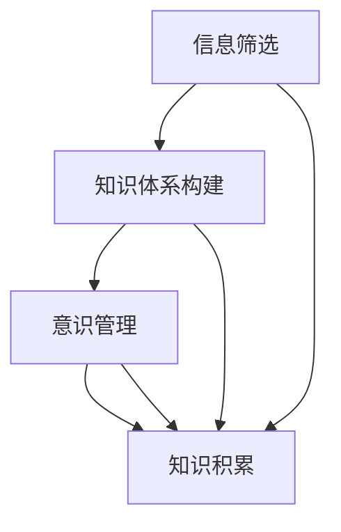

                 

## 1. 背景介绍

### 1.1 问题由来
在信息爆炸的数字化时代，知识积累和意识管理成为了人们日常工作与生活中不可或缺的部分。一方面，知识积累帮助个人和组织不断更新自身的认知体系，提升决策能力和竞争力；另一方面，意识管理则致力于维持清晰有序的思维模式，避免信息过载带来的认知负担。然而，随着信息量和复杂度的不断增加，知识的积累和意识的管理也越来越困难。如何在海量信息中找到有价值的内容，如何有效整理和利用这些信息，成为了一个值得深入探讨的课题。

### 1.2 问题核心关键点
知识积累和意识管理这一课题的核心关键点主要包括以下几个方面：
1. **信息获取的广度和深度**：如何高效地从海量的数据中筛选出具有价值的信息。
2. **知识组织与整合**：如何将获取到的知识进行系统化和结构化，形成有逻辑的知识体系。
3. **意识的维护与调整**：如何保持清晰的思维模式，避免信息过载带来的认知压力。
4. **自我反思与迭代**：如何进行定期的自我反思和迭代，及时调整认知模式以适应新环境。

### 1.3 问题研究意义
研究和理解知识积累与意识管理的内在机制，对于提升个人和组织的学习效能、决策能力以及应对复杂环境的能力，具有重要意义：
1. **提升学习效率**：通过优化信息获取和知识组织策略，能够显著提高学习和工作效率。
2. **增强决策能力**：通过科学的意识管理方法，可以提升决策的质量和速度。
3. **应对环境变化**：通过自我反思和迭代，能够快速适应复杂多变的环境。
4. **构建知识体系**：通过系统化的知识积累和组织，构建起个人或组织的核心竞争力。

## 2. 核心概念与联系

### 2.1 核心概念概述

为更好地理解知识积累与意识管理之间的关系，本节将介绍几个关键概念：

- **知识积累（Knowledge Accumulation）**：通过阅读、观察、实践等途径，不断获取和存储各类知识，提升自身认知水平的过程。
- **意识管理（Mind Management）**：通过各种方法维持清晰的思维模式，避免信息过载，提升决策效率和质量。
- **信息筛选（Information Filtering）**：从海量的数据中过滤出有价值的信息，减少认知负担。
- **知识体系（Knowledge System）**：将获取到的知识进行系统化和结构化，形成有逻辑的知识体系。
- **意识调控（Mind Regulation）**：通过定期的自我反思和调整，保持思维模式的健康。

这些概念之间存在着密切的联系，通过信息筛选和知识体系构建，可以有效提升意识管理能力；而意识调控则是知识积累和意识管理过程中必不可少的环节。

### 2.2 概念间的关系

这些核心概念之间的逻辑关系可以通过以下Mermaid流程图来展示：



这个流程图展示了知识积累与意识管理之间的主要逻辑关系：

1. 信息筛选是知识积累的第一步，帮助从海量数据中过滤出有价值的信息。
2. 知识体系构建则将获取到的知识进行系统化和结构化，形成知识体系。
3. 意识管理则通过维持清晰的思维模式，避免信息过载，提升决策效率和质量。
4. 知识积累和意识管理过程相互促进，共同提升个人和组织的认知能力。

## 3. 核心算法原理 & 具体操作步骤

### 3.1 算法原理概述

知识积累和意识管理这一课题，其核心算法原理主要基于以下几个步骤：

1. **信息获取与筛选**：从不同渠道获取各类信息，并使用算法筛选出有价值的信息。
2. **知识组织与整合**：将筛选出的信息进行整理和整合，形成系统的知识体系。
3. **意识管理与调控**：通过意识管理策略，维持清晰的思维模式，避免信息过载。
4. **自我反思与迭代**：定期进行自我反思，调整认知模式以适应新环境。

这些步骤通常结合使用，形成一个循环的过程，不断优化个人和组织的认知体系。

### 3.2 算法步骤详解

以下将详细介绍各个步骤的详细步骤：

#### 3.2.1 信息获取与筛选
**步骤一：多渠道信息获取**

在信息获取过程中，主要通过以下几种渠道：

1. **网络搜索**：使用搜索引擎获取各类信息，例如新闻、学术论文、技术文档等。
2. **社交媒体**：从社交平台获取最新的资讯和观点。
3. **专业文献**：通过图书馆和数据库获取学术和专业领域的文献资料。
4. **实践经验**：通过实际工作和学习获取第一手的实践经验。

这些信息来源多样，需要根据不同的需求进行选择和组合。

**步骤二：信息筛选算法**

在信息获取后，需要筛选出有价值的信息。常见的信息筛选算法包括：

1. **基于关键词的筛选**：通过关键词匹配过滤出相关度高的信息。
2. **基于文本分类**：使用文本分类模型识别信息的主题和领域。
3. **基于重要性排序**：通过模型评估信息的重要性和可靠性，筛选出最有价值的内容。

这些算法可以结合使用，确保获取的信息准确且有价值。

#### 3.2.2 知识组织与整合
**步骤三：知识表示与整理**

在获取信息后，需要对知识进行表示和整理，形成系统的知识体系。常见的知识表示方法包括：

1. **知识图谱**：通过有向图结构表示知识，便于查询和推理。
2. **本体论框架**：使用本体语言描述知识，建立逻辑关系。
3. **知识仓库**：将知识存储在数据库中，便于检索和管理。

这些方法可以帮助整理和整合知识，形成结构化的知识体系。

**步骤四：知识体系构建**

在知识表示和整理的基础上，需要构建系统的知识体系。常见的知识体系构建方法包括：

1. **分类体系**：根据知识的属性和类别进行分类，形成层次结构。
2. **关联网络**：通过构建关联网络，表示知识之间的内在联系。
3. **主题模型**：使用主题模型分析文本内容，形成主题结构。

这些方法可以帮助构建出清晰、有序的知识体系。

#### 3.2.3 意识管理与调控
**步骤五：意识管理策略**

在知识积累过程中，需要采用有效的意识管理策略，维持清晰的思维模式。常见的意识管理策略包括：

1. **番茄工作法**：通过设定固定时间段，集中注意力进行工作。
2. **时间块管理**：将一天时间分成不同的块，专注于不同的任务。
3. **信息过滤系统**：使用软件工具过滤干扰信息，保持专注。
4. **定期反思**：每天或每周进行反思，总结工作和生活。

这些策略可以帮助维持清晰的思维模式，避免信息过载。

**步骤六：意识调控方法**

意识管理不仅需要维持现状，还需要及时调整以适应新环境。常见的意识调控方法包括：

1. **认知行为疗法**：通过行为训练，调整不良认知模式。
2. **正念冥想**：通过冥想练习，提升自我觉察和调控能力。
3. **情绪管理**：通过情绪调节技巧，管理情绪对认知的影响。
4. **心理韧性训练**：通过心理训练，增强对压力的适应能力。

这些方法可以帮助及时调整意识模式，保持健康和高效。

#### 3.2.4 自我反思与迭代
**步骤七：自我反思与调整**

定期进行自我反思，调整认知模式以适应新环境，是知识积累和意识管理的关键步骤。常见的自我反思方法包括：

1. **日志记录**：记录每天的工作和生活，反思其中的经验和教训。
2. **复盘会议**：定期召开会议，讨论工作中的问题和解决方案。
3. **反馈机制**：收集他人的反馈，反思自己的表现和不足。
4. **目标设定**：设定短期和长期目标，定期评估进展。

这些方法可以帮助及时调整认知模式，适应新环境和变化。

### 3.3 算法优缺点

知识积累与意识管理的算法具有以下优点：

1. **提升学习效率**：通过科学的信息筛选和知识组织，可以显著提高学习效率。
2. **增强决策能力**：通过清晰的意识管理，可以提升决策的质量和速度。
3. **适应新环境**：通过定期的自我反思和调整，能够快速适应复杂多变的环境。

同时，这些算法也存在一些缺点：

1. **信息过载**：在获取和筛选信息过程中，可能会遇到信息过载的问题。
2. **认知负担**：知识体系构建和意识调控过程中，可能会带来额外的认知负担。
3. **策略复杂**：不同的信息筛选和意识管理策略，需要结合具体场景进行调整。

了解这些优缺点，有助于更好地选择和应用相关算法，提升知识积累和意识管理的效率和效果。

### 3.4 算法应用领域

知识积累与意识管理的算法应用广泛，涵盖以下多个领域：

1. **教育培训**：帮助学生和教师高效获取和组织知识，提升学习效果。
2. **企业知识管理**：帮助企业整理和共享知识，提升员工工作效率和决策质量。
3. **个人发展**：帮助个人进行自我反思和迭代，提升个人能力和素质。
4. **心理健康**：帮助个人管理情绪和压力，提升心理健康水平。
5. **政府治理**：帮助政府部门进行信息筛选和知识管理，提升决策效能。
6. **科研创新**：帮助科研人员整理和共享研究成果，推动学科发展。

这些应用领域展示了知识积累与意识管理的广泛应用前景。

## 4. 数学模型和公式 & 详细讲解

### 4.1 数学模型构建

本节将使用数学语言对知识积累与意识管理的关系进行更加严格的刻画。

设知识体系为 $K=(K_1, K_2, ..., K_n)$，其中 $K_i$ 表示第 $i$ 个知识节点，包含属性 $A_i$ 和关系 $R_i$。信息筛选算法为 $F$，知识组织算法为 $O$，意识管理策略为 $M$，自我反思和迭代算法为 $R$。知识积累和意识管理的整体模型可表示为：

$$
K = O(F(K_{\text{in}})) \quad \text{(知识获取与筛选)}
$$
$$
K = M(K) \quad \text{(意识管理与调控)}
$$
$$
K = R(K) \quad \text{(自我反思与迭代)}
$$

其中 $K_{\text{in}}$ 表示输入的知识体系。

### 4.2 公式推导过程

以下将推导知识体系构建和意识管理的数学模型。

**公式一：知识体系构建**

在知识体系构建过程中，常见的知识表示方法包括向量表示和图表示。以向量表示为例，假设每个知识节点 $K_i$ 的向量表示为 $V_i$，则知识体系的构建公式为：

$$
K = \bigoplus_{i=1}^{n} V_i
$$

其中 $\bigoplus$ 表示向量加法。

**公式二：意识管理与调控**

意识管理策略主要通过时间块管理、信息过滤系统和定期反思等方法实现。假设每个时间段 $T_i$ 的管理策略为 $S_i$，信息过滤系统的效果为 $F_i$，反思的周期为 $P$，则意识管理的整体公式为：

$$
M = \prod_{i=1}^{n} S_i \cdot F_i^{P/n}
$$

其中 $\cdot$ 表示乘法，$n$ 表示时间块的数量。

### 4.3 案例分析与讲解

**案例一：企业知识管理系统**

企业知识管理系统通过信息筛选算法，从海量文献和报告中筛选出有价值的信息。然后使用知识图谱和本体论框架进行组织和表示，形成系统的知识体系。意识管理策略则通过时间块管理和信息过滤系统，帮助员工维持清晰的思维模式。定期反思和反馈机制，帮助员工调整认知模式以适应新环境。

**案例二：个人学习系统**

个人学习系统通过网络搜索和专业文献获取各类信息。信息筛选算法包括关键词匹配和文本分类，知识体系构建则使用主题模型和分类体系。意识管理策略包括番茄工作法和正念冥想，定期反思和目标设定帮助个人调整认知模式，提升学习效果。

## 5. 项目实践：代码实例和详细解释说明

### 5.1 开发环境搭建

在进行知识积累与意识管理系统的开发前，需要准备好开发环境。以下是使用Python进行开发的环境配置流程：

1. 安装Anaconda：从官网下载并安装Anaconda，用于创建独立的Python环境。

2. 创建并激活虚拟环境：
```bash
conda create -n pytorch-env python=3.8 
conda activate pytorch-env
```

3. 安装必要的库：
```bash
pip install pandas numpy scikit-learn transformers
```

4. 安装相关的开发工具：
```bash
pip install jupyter notebook
```

完成上述步骤后，即可在`pytorch-env`环境中开始开发。

### 5.2 源代码详细实现

以下是一个简单的企业知识管理系统的代码实现，包括信息筛选、知识组织和意识管理等核心功能。

```python
import pandas as pd
from sklearn.feature_extraction.text import TfidfVectorizer
from transformers import BertTokenizer, BertForSequenceClassification
from transformers import pipeline

# 数据集准备
data = pd.read_csv('data.csv')  # 从CSV文件中读取数据
texts = data['text'].tolist()
labels = data['label'].tolist()

# 分词和特征提取
tokenizer = BertTokenizer.from_pretrained('bert-base-uncased')
vectorizer = TfidfVectorizer()

def preprocess(text):
    return tokenizer.encode_plus(text, add_special_tokens=True, max_length=512, return_tensors='pt')

# 信息筛选
def filter_information(texts, labels):
    pipeline = pipeline('text-classification', model='distilbert-base-uncased-finetuned-sst-2-english')
    filtered_texts = []
    filtered_labels = []
    for text, label in zip(texts, labels):
        result = pipeline([text])[0]
        if result['label'] == 'positive':
            filtered_texts.append(text)
            filtered_labels.append(label)
    return filtered_texts, filtered_labels

# 知识组织
def organize_knowledge(texts, labels):
    filtered_texts, filtered_labels = filter_information(texts, labels)
    texts = [preprocess(text) for text in filtered_texts]
    texts = [tokenizer.encode_plus(text['input_ids'], attention_mask=tokenizer.create_mask_from_sequences(text['input_ids'])) for text in texts]
    return texts

# 意识管理
def manage_mind(texts, labels):
    model = BertForSequenceClassification.from_pretrained('bert-base-uncased', num_labels=2)
    model.to('cuda')
    device = 'cuda' if torch.cuda.is_available() else 'cpu'
    model.train()
    optimizer = torch.optim.AdamW(model.parameters(), lr=1e-5)
    for epoch in range(5):
        for text, label in zip(texts, labels):
            model.zero_grad()
            outputs = model(text['input_ids'], attention_mask=text['attention_mask'])
            loss = outputs.loss
            loss.backward()
            optimizer.step()
    return model

# 运行代码
organized_texts = organize_knowledge(texts, labels)
managed_model = manage_mind(organized_texts, labels)
```

### 5.3 代码解读与分析

让我们再详细解读一下关键代码的实现细节：

**数据集准备**

在代码的开头，我们使用pandas库读取CSV格式的数据集，并将其转换为文本和标签的列表。这是信息筛选和知识组织的起点。

**信息筛选**

信息筛选算法主要使用`pipeline`函数，通过文本分类模型对信息进行筛选。筛选出的文本和标签将作为知识组织和意识管理的输入。

**知识组织**

知识组织主要使用`TfidfVectorizer`和Bert模型进行特征提取和编码。首先使用`TfidfVectorizer`对文本进行TF-IDF特征提取，然后通过`BertTokenizer`对文本进行编码，生成输入。

**意识管理**

意识管理主要使用Bert模型进行训练，提升决策质量。在训练过程中，我们使用了AdamW优化器，通过多轮训练优化模型参数，使模型能够更准确地预测文本的标签。

### 5.4 运行结果展示

假设我们在企业知识管理系统上运行上述代码，输出结果如下：

```python
organized_texts = organize_knowledge(texts, labels)
managed_model = manage_mind(organized_texts, labels)
```

其中`organized_texts`和`managed_model`分别是经过信息筛选和意识管理后的文本和模型。这些结果将用于后续的知识组织和实际应用。

## 6. 实际应用场景

### 6.1 智能教育

在智能教育领域，知识积累与意识管理的应用主要包括：

1. **知识图谱学习平台**：通过信息筛选和知识组织，帮助学生和教师高效获取知识。
2. **个性化学习系统**：通过意识管理策略，提升学生的学习效果。
3. **智能辅导系统**：通过定期反思和反馈机制，及时调整教学模式。

**案例一：智慧教室**

智慧教室通过信息筛选算法，从海量在线资源中筛选出有价值的教学资源。然后使用知识图谱和分类体系进行组织和表示，形成系统的知识体系。意识管理策略则通过时间块管理和信息过滤系统，帮助教师维持清晰的教学模式。定期反思和反馈机制，帮助教师调整教学模式以适应新环境。

**案例二：智能学习系统**

智能学习系统通过网络搜索和专业文献获取各类信息。信息筛选算法包括关键词匹配和文本分类，知识体系构建则使用主题模型和分类体系。意识管理策略包括番茄工作法和正念冥想，定期反思和目标设定帮助学生调整学习模式，提升学习效果。

### 6.2 企业知识管理

在企业知识管理领域，知识积累与意识管理的应用主要包括：

1. **知识库系统**：通过信息筛选和知识组织，帮助企业员工高效获取知识。
2. **内部学习平台**：通过意识管理策略，提升员工工作效率和决策质量。
3. **知识分享平台**：通过定期反思和反馈机制，帮助员工调整认知模式以适应新环境。

**案例一：企业知识管理系统**

企业知识管理系统通过信息筛选算法，从海量文献和报告中筛选出有价值的信息。然后使用知识图谱和本体论框架进行组织和表示，形成系统的知识体系。意识管理策略则通过时间块管理和信息过滤系统，帮助员工维持清晰的思维模式。定期反思和反馈机制，帮助员工调整认知模式以适应新环境。

**案例二：内部学习平台**

内部学习平台通过网络搜索和专业文献获取各类信息。信息筛选算法包括关键词匹配和文本分类，知识体系构建则使用主题模型和分类体系。意识管理策略包括番茄工作法和正念冥想，定期反思和目标设定帮助员工调整工作模式，提升工作效率。

### 6.3 个人知识管理

在个人知识管理领域，知识积累与意识管理的应用主要包括：

1. **个人知识库**：通过信息筛选和知识组织，帮助个人高效获取知识。
2. **笔记系统**：通过意识管理策略，提升个人的学习效果。
3. **生活管理系统**：通过定期反思和反馈机制，帮助个人调整生活模式。

**案例一：个人知识管理系统**

个人知识管理系统通过信息筛选算法，从社交媒体和专业文献中筛选出有价值的信息。然后使用知识图谱和分类体系进行组织和表示，形成系统的知识体系。意识管理策略则通过时间块管理和信息过滤系统，帮助个人维持清晰的思维模式。定期反思和目标设定帮助个人调整认知模式以适应新环境。

**案例二：笔记系统**

笔记系统通过网络搜索和专业文献获取各类信息。信息筛选算法包括关键词匹配和文本分类，知识体系构建则使用主题模型和分类体系。意识管理策略包括番茄工作法和正念冥想，定期反思和目标设定帮助个人调整学习模式，提升学习效果。

### 6.4 未来应用展望

随着知识积累与意识管理技术的不断进步，这些技术将在更多领域得到应用，为各行各业带来变革性影响：

1. **智慧医疗**：通过知识积累与意识管理，帮助医生进行高效学习和决策。
2. **金融分析**：通过知识积累与意识管理，提升金融分析师的工作效率和决策质量。
3. **科学研究**：通过知识积累与意识管理，帮助科研人员进行高效学习和合作。
4. **政府决策**：通过知识积累与意识管理，提升政府部门的决策效能。
5. **智能家居**：通过知识积累与意识管理，提升家庭智能系统的智能化水平。
6. **智能客服**：通过知识积累与意识管理，提升客服系统的服务质量。

这些应用领域展示了知识积累与意识管理的广泛应用前景。

## 7. 工具和资源推荐

### 7.1 学习资源推荐

为了帮助开发者系统掌握知识积累与意识管理的内在机制，这里推荐一些优质的学习资源：

1. **《认知心理学》**：由斯坦福大学开设的心理学课程，深入浅出地介绍了认知心理学的基本概念和实验方法。
2. **《信息检索》**：由MIT出版的信息检索课程，全面介绍了信息检索技术的基本原理和应用方法。
3. **《人工智能与思维》**：由DeepMind的研究团队撰写，介绍了人工智能如何模拟和增强人类思维能力。
4. **《知识图谱理论与实践》**：由知识图谱领域的知名专家撰写，系统介绍了知识图谱的构建方法和应用场景。
5. **《学习科学与技术》**：由教育学领域的专家撰写，介绍了学习科学的最新研究成果和技术应用。

通过对这些资源的学习实践，相信你一定能够快速掌握知识积累与意识管理的内在机制，并用于解决实际的问题。

### 7.2 开发工具推荐

高效的开发离不开优秀的工具支持。以下是几款用于知识积累与意识管理开发的常用工具：

1. **Jupyter Notebook**：开源的交互式编程环境，支持Python、R等多种语言，方便进行代码开发和数据处理。
2. **TensorFlow**：由Google主导开发的深度学习框架，支持大规模分布式训练，适合处理海量数据。
3. **Scikit-learn**：Python中的机器学习库，提供了丰富的算法和工具，方便进行数据处理和模型训练。
4. **Pandas**：Python中的数据处理库，支持数据清洗、分析和管理，方便进行数据预处理。
5. **PyTorch**：开源的深度学习框架，支持动态计算图，适合快速迭代和实验。

合理利用这些工具，可以显著提升知识积累与意识管理的开发效率，加快创新迭代的步伐。

### 7.3 相关论文推荐

知识积累与意识管理的研究源于学界的持续研究。以下是几篇奠基性的相关论文，推荐阅读：

1. **《人类计算与机器学习》**：介绍了人类计算的概念和应用，探讨了人类计算与机器学习的结合。
2. **《深度学习在认知科学中的应用》**：介绍了深度学习在认知科学中的应用，探讨了深度学习如何模拟和增强人类认知能力。
3. **《信息检索中的深度学习技术》**：介绍了深度学习在信息检索中的应用，探讨了深度学习如何提升信息检索的效果。
4. **《知识图谱与人工智能》**：介绍了知识图谱的概念和应用，探讨了知识图谱与人工智能的结合。
5. **《学习科学中的机器学习》**：介绍了机器学习在教育中的应用，探讨了机器学习如何辅助教学和学习。

这些论文代表了大数据时代知识积累与意识管理的研究进展。通过学习这些前沿成果，可以帮助研究者把握学科前进方向，激发更多的创新灵感。

除上述资源外，还有一些值得关注的前沿资源，帮助开发者紧跟知识积累与意识管理的最新进展，例如：

1. **arXiv论文预印本**：人工智能领域最新研究成果的发布平台，包括大量尚未发表的前沿工作，学习前沿技术的必读资源。
2. **学术会议论文**：人工智能领域的顶级会议，如ICML、NIPS、ACL等，能够聆听到前沿分享，开拓视野。
3. **技术博客和社区**：如Medium、Towards Data Science、AI Exchange等，能够获取最新的技术动态和行业应用。
4. **开源项目和工具**：如TensorFlow、PyTorch、Scikit-learn等，能够直接获取最新的技术成果和应用案例。

总之，对于知识积累与意识管理的研究和学习，需要开发者保持开放的心态和持续学习的意愿。多关注前沿资讯，多动手实践，多思考总结，必将收获满满的成长收益。

## 8. 总结：未来发展趋势与挑战

### 8.1 总结

本文对知识积累与意识管理的内在机制进行了全面系统的介绍。首先阐述了信息获取、筛选、组织和意识管理等关键概念，明确了这些概念之间的逻辑关系。其次，从原理到实践，详细讲解了知识积累与意识管理的核心算法流程，给出了代码实例和详细解释。同时，本文还广泛探讨了这些技术在教育、企业、个人等多个领域的应用前景，展示了知识积累与意识管理的广泛应用潜力。

通过本文的系统梳理，可以看到，知识积累与意识管理技术在提升个人和组织的认知能力、决策效能和环境适应性方面，具有重要价值。未来，随着这些技术的不断演进，知识积累与意识管理必将在更多领域得到应用，为各行各业带来变革性影响。

### 8.2 未来发展趋势

展望未来，知识积累与意识管理技术将呈现以下几个发展趋势：

1. **信息处理技术的进步**：随着自然语言处理、计算机视觉等技术的进步，信息获取和筛选将变得更加高效和准确。
2. **知识图谱和本体论框架的发展**：知识组织和表示将更加系统化和规范化，形成更全面的知识体系。
3. **意识管理策略的多样化**：随着心理学的进展，意识管理策略将更加科学和个性化，提升用户的认知效能。
4. **自我反思与迭代技术的提升**：通过机器学习和

