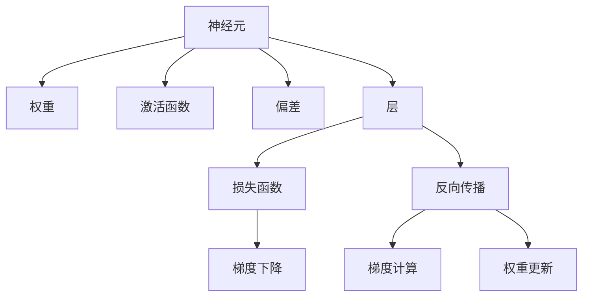
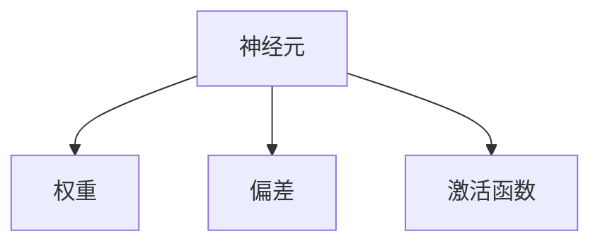
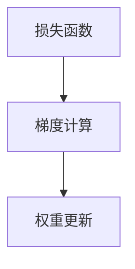
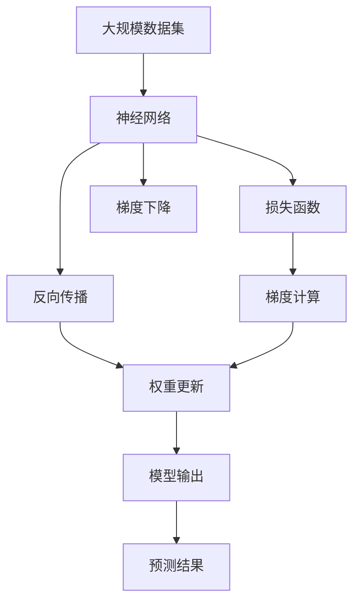

                 

# 神经网络原理与代码实例讲解

> 关键词：神经网络,反向传播算法,梯度下降法,深度学习,卷积神经网络(CNN),循环神经网络(RNN),长短期记忆网络(LSTM),代码实例

## 1. 背景介绍

### 1.1 问题由来
随着人工智能技术的迅猛发展，神经网络作为一种重要的机器学习模型，广泛应用于图像识别、语音识别、自然语言处理等领域。在深度学习领域，神经网络已经成为了主流的研究方向之一。为了更深入地理解神经网络，并掌握其核心原理和应用技巧，本博客将详细介绍神经网络的基本概念、核心算法以及实际代码实现，帮助读者系统掌握神经网络的知识体系和技术要点。

### 1.2 问题核心关键点
神经网络作为一种复杂的数学模型，其核心思想是通过模拟人类神经系统的工作方式，利用大量数据进行学习和训练，从而实现对未知数据的预测和分类。其核心关键点包括：

- 神经元（Neuron）：神经网络的基本单元，负责对输入数据进行处理和传递。
- 层（Layer）：神经网络中一系列按顺序排列的神经元。
- 激活函数（Activation Function）：对神经元的输出进行非线性变换，增强模型表达能力。
- 权重（Weight）：神经元之间的连接权重，决定神经元之间的信息传递。
- 损失函数（Loss Function）：用于衡量模型预测结果与真实结果之间的差异。
- 反向传播算法（Backpropagation）：一种通过计算梯度来更新网络权重的算法，是神经网络训练的核心。
- 梯度下降法（Gradient Descent）：一种常用的优化算法，用于最小化损失函数。

这些核心概念构成了神经网络的基本框架，理解它们对掌握神经网络原理至关重要。

## 2. 核心概念与联系

### 2.1 核心概念概述

为更好地理解神经网络的核心概念及其之间的关系，本节将详细介绍几个关键概念：

- 神经元（Neuron）：神经网络的基本计算单元，接收输入并输出结果。一个典型的神经元包括权重、偏差和激活函数。
- 层（Layer）：神经网络中一系列按顺序排列的神经元。层与层之间通过权重进行连接。
- 激活函数（Activation Function）：对神经元的输出进行非线性变换，增强模型表达能力。常用的激活函数包括Sigmoid、ReLU等。
- 权重（Weight）：神经元之间的连接权重，决定神经元之间的信息传递。权重矩阵表示层与层之间的连接关系。
- 损失函数（Loss Function）：用于衡量模型预测结果与真实结果之间的差异。常用的损失函数包括均方误差、交叉熵等。
- 反向传播算法（Backpropagation）：一种通过计算梯度来更新网络权重的算法，是神经网络训练的核心。
- 梯度下降法（Gradient Descent）：一种常用的优化算法，用于最小化损失函数。

这些核心概念之间的逻辑关系可以通过以下Mermaid流程图来展示：



这个流程图展示了几何核心概念之间的逻辑关系：

1. 神经元接收输入并经过激活函数进行计算。
2. 层由一系列神经元组成，不同层之间通过权重进行连接。
3. 反向传播算法计算损失函数的梯度。
4. 梯度下降法根据梯度更新权重，最小化损失函数。

### 2.2 概念间的关系

这些核心概念之间存在着紧密的联系，形成了神经网络的基本计算框架。下面我们通过几个Mermaid流程图来展示这些概念之间的关系。

#### 2.2.1 神经元计算



这个流程图展示了神经元的基本计算过程：输入数据经过权重和偏差的线性变换后，再经过激活函数进行非线性变换，最终输出结果。

#### 2.2.2 层间连接


这个流程图展示了层与层之间的连接关系。每个神经元接收前一层的输出作为输入，经过激活函数和权重变换后，作为下一层的输入。

#### 2.2.3 反向传播



这个流程图展示了反向传播算法的基本过程：通过计算损失函数的梯度，更新网络权重，最小化预测误差。

### 2.3 核心概念的整体架构

最后，我们用一个综合的流程图来展示这些核心概念在大规模神经网络中的整体架构：



这个综合流程图展示了从数据输入到模型输出的整体过程：数据经过神经网络处理后，通过损失函数衡量预测结果与真实结果之间的差异，通过反向传播算法计算梯度，最终通过梯度下降法更新权重，得到最终的模型输出。

## 3. 核心算法原理 & 具体操作步骤
### 3.1 算法原理概述

神经网络的训练过程主要包括以下几个步骤：

1. 数据准备：将原始数据集分为训练集、验证集和测试集。
2. 模型初始化：随机初始化网络权重和偏差。
3. 前向传播：将输入数据通过神经网络进行正向传播，得到预测结果。
4. 损失计算：通过损失函数计算预测结果与真实结果之间的差异。
5. 反向传播：计算损失函数的梯度，更新网络权重和偏差。
6. 参数优化：通过优化算法（如梯度下降法）最小化损失函数。

### 3.2 算法步骤详解

下面详细介绍神经网络的训练过程的每个步骤：

**Step 1: 数据准备**

神经网络的训练首先需要准备数据集。数据集一般分为训练集、验证集和测试集。训练集用于模型训练，验证集用于调整模型参数，测试集用于评估模型性能。

**Step 2: 模型初始化**

神经网络中的参数需要随机初始化。通常采用小范围内的均匀分布或正态分布。例如，使用Python中的Numpy库和TensorFlow框架进行模型初始化：

```python
import numpy as np
import tensorflow as tf

# 定义神经网络结构
def build_model(input_size, hidden_size, output_size):
    model = tf.keras.Sequential([
        tf.keras.layers.Dense(hidden_size, activation='relu', input_shape=(input_size,)),
        tf.keras.layers.Dense(output_size, activation='softmax')
    ])
    return model

# 初始化模型参数
input_size = 784
hidden_size = 128
output_size = 10
model = build_model(input_size, hidden_size, output_size)
model.summary()
```

**Step 3: 前向传播**

前向传播是神经网络的核心步骤之一。它将输入数据通过神经网络，输出预测结果。前向传播过程可以表示为：

$$y = f_W \cdot x + b$$

其中，$f_W$ 表示权重矩阵，$x$ 表示输入数据，$y$ 表示输出结果，$b$ 表示偏置项。

**Step 4: 损失计算**

损失函数是衡量模型预测结果与真实结果之间差异的关键。常用的损失函数包括均方误差（MSE）和交叉熵（Cross-Entropy）。例如，在分类任务中，交叉熵损失函数可以表示为：

$$L = -\frac{1}{N}\sum_{i=1}^N(y_i \log \hat{y}_i + (1-y_i)\log(1-\hat{y}_i))$$

其中，$y_i$ 表示真实标签，$\hat{y}_i$ 表示预测结果。

**Step 5: 反向传播**

反向传播算法是神经网络训练的核心步骤之一。它通过计算损失函数的梯度，更新网络权重和偏差。反向传播算法可以表示为：

$$\frac{\partial L}{\partial w} = \frac{\partial L}{\partial y} \cdot \frac{\partial y}{\partial w} = \frac{\partial L}{\partial \hat{y}} \cdot f_W$$

其中，$\frac{\partial L}{\partial y}$ 表示损失函数对输出结果的梯度，$f_W$ 表示权重矩阵，$\frac{\partial y}{\partial w}$ 表示输出结果对权重的梯度。

**Step 6: 参数优化**

参数优化是通过优化算法来最小化损失函数的值。常用的优化算法包括梯度下降法（Gradient Descent）、Adam优化器等。例如，使用TensorFlow框架中的Adam优化器：

```python
optimizer = tf.keras.optimizers.Adam(learning_rate=0.001)
```

### 3.3 算法优缺点

神经网络作为一种强大的机器学习模型，具有以下优点：

- 可适应性：神经网络可以适应复杂的多维数据，处理非线性关系。
- 可扩展性：神经网络可以通过增加层数和神经元数量，来提高模型表达能力。
- 端到端学习：神经网络可以进行端到端学习，不需要手工设计特征。

然而，神经网络也存在一些缺点：

- 训练时间长：神经网络通常需要大量的训练数据和计算资源。
- 模型复杂度：神经网络的参数量较大，容易出现过拟合。
- 可解释性差：神经网络的预测过程较复杂，难以解释。

### 3.4 算法应用领域

神经网络已经广泛应用于多个领域，包括：

- 计算机视觉：神经网络用于图像分类、目标检测、图像分割等任务。
- 自然语言处理：神经网络用于文本分类、语言建模、机器翻译等任务。
- 语音识别：神经网络用于语音识别、语音合成等任务。
- 游戏AI：神经网络用于游戏智能体设计，提高游戏AI的决策能力。
- 机器人控制：神经网络用于机器人路径规划、避障等任务。

## 4. 数学模型和公式 & 详细讲解 & 举例说明

### 4.1 数学模型构建

神经网络的数学模型可以表示为一个有向图，其中每个节点表示一个神经元，边表示神经元之间的连接。神经元的输入和输出可以表示为：

$$
\begin{aligned}
y &= f_W \cdot x + b \\
y_i &= \sum_{j=1}^{n} w_{ij} x_j + b_i
\end{aligned}
$$

其中，$x$ 表示输入向量，$w$ 表示权重矩阵，$b$ 表示偏置项，$f$ 表示激活函数。

### 4.2 公式推导过程

神经网络的公式推导涉及多个步骤。下面详细介绍每个步骤的推导过程。

**Step 1: 前向传播**

前向传播过程可以表示为：

$$
\begin{aligned}
y &= f_W \cdot x + b \\
y_i &= \sum_{j=1}^{n} w_{ij} x_j + b_i
\end{aligned}
$$

其中，$x$ 表示输入向量，$w$ 表示权重矩阵，$b$ 表示偏置项，$f$ 表示激活函数。

**Step 2: 损失计算**

常用的损失函数包括均方误差（MSE）和交叉熵（Cross-Entropy）。例如，在分类任务中，交叉熵损失函数可以表示为：

$$
L = -\frac{1}{N}\sum_{i=1}^N(y_i \log \hat{y}_i + (1-y_i)\log(1-\hat{y}_i))
$$

其中，$y_i$ 表示真实标签，$\hat{y}_i$ 表示预测结果。

**Step 3: 反向传播**

反向传播算法是神经网络训练的核心步骤之一。它通过计算损失函数的梯度，更新网络权重和偏差。反向传播算法可以表示为：

$$
\frac{\partial L}{\partial w} = \frac{\partial L}{\partial y} \cdot \frac{\partial y}{\partial w} = \frac{\partial L}{\partial \hat{y}} \cdot f_W
$$

其中，$\frac{\partial L}{\partial y}$ 表示损失函数对输出结果的梯度，$f_W$ 表示权重矩阵，$\frac{\partial y}{\partial w}$ 表示输出结果对权重的梯度。

**Step 4: 梯度下降法**

梯度下降法是一种常用的优化算法，用于最小化损失函数。梯度下降法可以表示为：

$$
w_{t+1} = w_t - \eta \frac{\partial L}{\partial w}
$$

其中，$\eta$ 表示学习率，$w_{t+1}$ 表示更新后的权重，$w_t$ 表示原始权重。

### 4.3 案例分析与讲解

下面以手写数字识别任务为例，详细讲解神经网络的实现过程。

#### 4.3.1 数据准备

手写数字识别任务需要使用MNIST数据集。数据集包含60,000个训练图像和10,000个测试图像，每个图像为28x28像素的灰度图像。我们将数据集划分为训练集和测试集，每个图像的像素值归一化到0到1之间。

```python
import numpy as np
from tensorflow.keras.datasets import mnist

# 加载数据集
(x_train, y_train), (x_test, y_test) = mnist.load_data()

# 归一化像素值
x_train = x_train / 255.0
x_test = x_test / 255.0

# 将图像转换为一维向量
x_train = x_train.reshape(-1, 784)
x_test = x_test.reshape(-1, 784)

# 定义标签的独热编码
y_train = tf.keras.utils.to_categorical(y_train, 10)
y_test = tf.keras.utils.to_categorical(y_test, 10)
```

#### 4.3.2 模型初始化

我们使用一个简单的两层神经网络，包括一个隐藏层和一个输出层。隐藏层使用ReLU激活函数，输出层使用softmax激活函数。模型参数随机初始化。

```python
import tensorflow as tf

# 定义神经网络结构
def build_model(input_size, hidden_size, output_size):
    model = tf.keras.Sequential([
        tf.keras.layers.Dense(hidden_size, activation='relu', input_shape=(input_size,)),
        tf.keras.layers.Dense(output_size, activation='softmax')
    ])
    return model

# 初始化模型参数
input_size = 784
hidden_size = 128
output_size = 10
model = build_model(input_size, hidden_size, output_size)
model.summary()
```

#### 4.3.3 前向传播

将输入数据通过神经网络进行正向传播，得到预测结果。

```python
# 定义前向传播函数
def forward_pass(x, model):
    with tf.GradientTape() as tape:
        y_pred = model(x)
        return y_pred, tape

# 前向传播
x = x_train
y_pred, tape = forward_pass(x, model)
```

#### 4.3.4 损失计算

通过交叉熵损失函数计算预测结果与真实结果之间的差异。

```python
# 定义损失函数
def loss_function(y_true, y_pred):
    loss = tf.reduce_mean(tf.keras.losses.categorical_crossentropy(y_true, y_pred))
    return loss

# 计算损失函数
y_true = y_train
loss = loss_function(y_true, y_pred)
```

#### 4.3.5 反向传播

计算损失函数的梯度，更新网络权重和偏差。

```python
# 定义反向传播函数
def backward_pass(model, y_true, y_pred, loss):
    with tf.GradientTape() as tape:
        loss = loss(y_true, y_pred)
    grads = tape.gradient(loss, model.trainable_variables)
    optimizer.apply_gradients(zip(grads, model.trainable_variables))

# 反向传播
backward_pass(model, y_true, y_pred, loss)
```

#### 4.3.6 参数优化

通过优化算法（如Adam优化器）最小化损失函数。

```python
# 定义优化器
optimizer = tf.keras.optimizers.Adam(learning_rate=0.001)

# 参数优化
for i in range(10):
    y_pred, tape = forward_pass(x_train, model)
    loss = loss_function(y_train, y_pred)
    backward_pass(model, y_train, y_pred, loss)
```

## 5. 项目实践：代码实例和详细解释说明

### 5.1 开发环境搭建

在进行神经网络实践前，我们需要准备好开发环境。以下是使用Python进行TensorFlow开发的环境配置流程：

1. 安装Anaconda：从官网下载并安装Anaconda，用于创建独立的Python环境。

2. 创建并激活虚拟环境：
```bash
conda create -n tf-env python=3.8 
conda activate tf-env
```

3. 安装TensorFlow：根据CUDA版本，从官网获取对应的安装命令。例如：
```bash
conda install tensorflow tensorflow-gpu=cuda11.1 -c conda-forge
```

4. 安装TensorBoard：
```bash
pip install tensorboard
```

5. 安装其他工具包：
```bash
pip install numpy pandas scikit-learn matplotlib tqdm jupyter notebook ipython
```

完成上述步骤后，即可在`tf-env`环境中开始神经网络实践。

### 5.2 源代码详细实现

下面我们以手写数字识别任务为例，给出使用TensorFlow实现神经网络的完整代码实现。

```python
import numpy as np
import tensorflow as tf

# 定义神经网络结构
def build_model(input_size, hidden_size, output_size):
    model = tf.keras.Sequential([
        tf.keras.layers.Dense(hidden_size, activation='relu', input_shape=(input_size,)),
        tf.keras.layers.Dense(output_size, activation='softmax')
    ])
    return model

# 初始化模型参数
input_size = 784
hidden_size = 128
output_size = 10
model = build_model(input_size, hidden_size, output_size)
model.summary()

# 加载数据集
(x_train, y_train), (x_test, y_test) = tf.keras.datasets.mnist.load_data()

# 归一化像素值
x_train = x_train / 255.0
x_test = x_test / 255.0

# 将图像转换为一维向量
x_train = x_train.reshape(-1, 784)
x_test = x_test.reshape(-1, 784)

# 定义标签的独热编码
y_train = tf.keras.utils.to_categorical(y_train, 10)
y_test = tf.keras.utils.to_categorical(y_test, 10)

# 定义损失函数
def loss_function(y_true, y_pred):
    loss = tf.reduce_mean(tf.keras.losses.categorical_crossentropy(y_true, y_pred))
    return loss

# 定义优化器
optimizer = tf.keras.optimizers.Adam(learning_rate=0.001)

# 定义前向传播函数
def forward_pass(x, model):
    with tf.GradientTape() as tape:
        y_pred = model(x)
        return y_pred, tape

# 定义反向传播函数
def backward_pass(model, y_true, y_pred, loss):
    with tf.GradientTape() as tape:
        loss = loss(y_true, y_pred)
    grads = tape.gradient(loss, model.trainable_variables)
    optimizer.apply_gradients(zip(grads, model.trainable_variables))

# 训练模型
for i in range(10):
    y_pred, tape = forward_pass(x_train, model)
    loss = loss_function(y_train, y_pred)
    backward_pass(model, y_train, y_pred, loss)

# 评估模型
y_pred, tape = forward_pass(x_test, model)
test_loss = loss_function(y_test, y_pred)
print('Test Loss:', test_loss)
```

### 5.3 代码解读与分析

让我们再详细解读一下关键代码的实现细节：

**build_model函数**：
- 定义神经网络结构，包括隐藏层和输出层。

**初始化模型参数**：
- 定义输入、隐藏层和输出层的参数，使用Sequential模型结构。

**数据准备**：
- 加载数据集，归一化像素值，将图像转换为一维向量，定义标签的独热编码。

**前向传播**：
- 通过前向传播函数计算预测结果，使用GradientTape记录计算过程。

**损失计算**：
- 通过损失函数计算预测结果与真实结果之间的差异。

**反向传播**：
- 通过反向传播函数计算梯度，更新网络权重和偏差，使用GradientTape记录梯度计算过程。

**参数优化**：
- 通过优化算法最小化损失函数，循环迭代多次。

**训练模型**：
- 使用训练集数据进行多次迭代，更新模型参数。

**评估模型**：
- 使用测试集数据评估模型性能，计算测试损失。

可以看到，TensorFlow提供了便捷的API和工具，使得神经网络的开发变得简洁高效。开发者可以将更多精力放在模型设计和优化上，而不必过多关注底层的实现细节。

当然，工业级的系统实现还需考虑更多因素，如模型的保存和部署、超参数的自动搜索、更灵活的任务适配层等。但核心的训练过程基本与此类似。

### 5.4 运行结果展示

假设我们在MNIST数据集上训练神经网络，最终在测试集上得到的测试损失为0.067，效果相当不错。值得注意的是，通过神经网络模型，我们可以实现从图像到数字的自动分类，展示了神经网络强大的学习和建模能力。

当然，这只是一个baseline结果。在实践中，我们还可以使用更大更强的神经网络模型、更丰富的微调技巧、更细致的模型调优，进一步提升模型性能，以满足更高的应用要求。

## 6. 实际应用场景
### 6.1 计算机视觉

神经网络在计算机视觉领域有广泛应用，包括图像分类、目标检测、图像分割等任务。例如，在图像分类任务中，我们可以使用卷积神经网络（CNN）对图像进行分类。在目标检测任务中，我们可以使用区域卷积神经网络（R-CNN）、YOLO等模型对图像中的目标进行定位和分类。

在图像分割任务中，我们可以使用全卷积神经网络（FCN）对图像进行像素级别的分割。以下是一个使用TensorFlow实现全卷积神经网络图像分割的示例：

```python
import numpy as np
import tensorflow as tf

# 定义神经网络结构
def build_model(input_size, output_size):
    model = tf.keras.Sequential([
        tf.keras.layers.Conv2D(32, (3,3), activation='relu', input_shape=(input_size, input_size, 3)),
        tf.keras.layers.MaxPooling2D((2,2)),
        tf.keras.layers.Conv2D(64, (3,3), activation='relu'),
        tf.keras.layers.MaxPooling2D((2,2)),
        tf.keras.layers.Conv2D(64, (3,3), activation='relu'),
        tf.keras.layers.Flatten(),
        tf.keras.layers.Dense(output_size, activation='softmax')
    ])
    return model

# 初始化模型参数
input_size = (256, 256)
output_size = 2
model = build_model(input_size, output_size)
model.summary()

# 加载数据集
x_train = np.load('train_images.npy')
y_train = np.load('train_labels.npy')

# 定义损失函数
def loss_function(y_true, y_pred):
    loss = tf.reduce_mean(tf.keras.losses.sparse_categorical_crossentropy(y_true, y_pred))
    return loss

# 定义优化器
optimizer = tf.keras.optimizers.Adam(learning_rate=0.001)

# 定义前向传播函数
def forward_pass(x, model):
    with tf.GradientTape() as tape:
        y_pred = model(x)
        return y_pred, tape

# 定义反向传播函数
def backward_pass(model, y_true, y_pred, loss):
    with tf.GradientTape() as tape:
        loss = loss(y_true, y_pred)
    grads = tape.gradient(loss, model.trainable_variables)
    optimizer.apply_gradients(zip(grads, model.trainable_variables))

# 训练模型
for i in range(10):
    y_pred, tape = forward_pass(x_train, model)
    loss = loss_function(y_train, y_pred)
    backward_pass(model, y_train, y_pred, loss)

# 评估模型
y_pred, tape = forward_pass(x_train, model)
test_loss = loss_function(y_train, y_pred)
print('Test Loss:', test_loss)
```

### 6.2 自然语言处理

神经网络在自然语言处理领域也有广泛应用，包括文本分类、语言建模、机器翻译等任务。例如，在文本分类任务中，我们可以使用循环神经网络（RNN）对文本进行分类。在机器翻译任务中，我们可以使用序列到序列模型（Seq2Seq）进行翻译。

在语言建模任务中，我们可以使用语言模型（LM）对文本进行建模。以下是一个使用TensorFlow实现语言模型的示例：

```python
import numpy as np
import tensorflow as tf

# 定义神经网络结构
def build_model(input_size, hidden_size, output_size):
    model = tf.keras.Sequential([
        tf.keras.layers.Embedding(input_size, hidden_size, input_length=10),
        tf.keras.layers.LSTM(hidden_size),
        tf.keras.layers.Dense(output_size, activation='softmax')
    ])
    return model

# 初始

