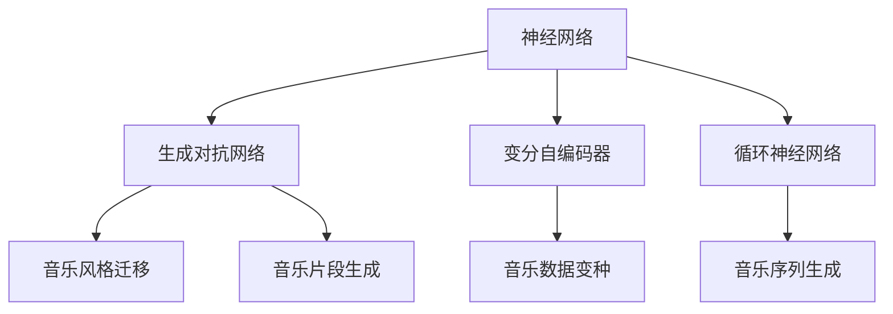
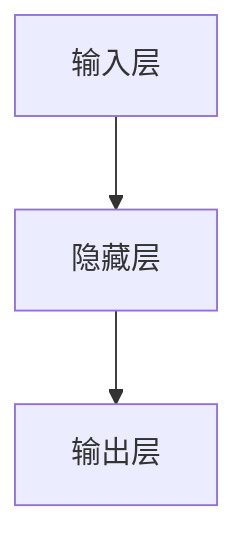

                 

# 神经网络在音乐生成中的应用

## 1. 背景介绍

音乐生成（Music Generation）是人工智能领域的重要应用之一，旨在让计算机创作出全新的、具有艺术感和情感的音乐。这一领域结合了深度学习、音乐学、计算美学等多个学科的知识，近年来得到了快速发展。

### 1.1 研究背景

音乐生成技术的兴起，可以追溯到1980年代早期，当时研究人员开始尝试使用基于规则的生成系统来创作音乐。然而，这种方法往往需要大量人工设计和调整规则，无法充分利用数据的潜力和复杂性。

1993年，RNN（循环神经网络）被用于音乐生成，显著提高了模型的表达能力和创作质量。RNN可以对序列数据进行建模，能够捕捉到音乐中的时间依赖关系，从而创作出更流畅、更符合人类情感的音乐。

随着深度学习技术的发展，深度生成模型（如GANs、VAEs、RNNs）在音乐生成领域的应用逐渐增多。这些模型可以学习到高维音乐数据的分布，生成出更加复杂、多样化的音乐作品。

### 1.2 研究意义

音乐生成技术具有广泛的应用前景，可以应用于音乐创作、音乐推荐、音乐演奏等多个领域。它不仅能够激发人们的创造力，还能为艺术领域注入新的活力。此外，音乐生成技术还能为娱乐、教育等行业带来新的可能性。

## 2. 核心概念与联系

### 2.1 核心概念概述

本节将介绍几个核心概念，帮助读者更好地理解神经网络在音乐生成中的应用。

- **神经网络（Neural Network）**：一种由大量人工神经元（神经元）组成的计算模型，通过学习数据分布，可以实现模式识别、分类、回归、生成等多种任务。在音乐生成中，神经网络被用于捕捉音乐数据的分布特征，生成新的音乐片段。

- **生成对抗网络（GANs）**：一种由生成器（Generator）和判别器（Discriminator）组成的深度生成模型。生成器负责生成假数据，判别器负责区分真假数据。GANs在音乐生成中广泛应用于音乐风格的迁移、音乐片段的生成等任务。

- **变分自编码器（VAEs）**：一种基于变分推断的生成模型，可以学习数据的潜在分布，生成新的数据样本。在音乐生成中，VAEs可以用于生成音乐数据的变种，如对某一音乐片段进行风格转换。

- **循环神经网络（RNNs）**：一种可以对序列数据进行建模的神经网络，可以捕捉时间依赖关系。在音乐生成中，RNNs被用于生成音乐序列，如旋律、和弦等。

### 2.2 概念间的关系

这些核心概念之间的逻辑关系可以通过以下Mermaid流程图来展示：



这个流程图展示了大语言模型微调过程中各个核心概念之间的关系：

1. 神经网络是音乐生成的基础，可以用于生成对抗网络、变分自编码器和循环神经网络。
2. 生成对抗网络可以用于音乐风格的迁移和音乐片段的生成。
3. 变分自编码器可以用于音乐数据的变种。
4. 循环神经网络可以用于音乐序列的生成。

这些概念共同构成了音乐生成技术的核心框架，使得计算机能够通过学习音乐数据的分布，生成出高质量的音乐作品。

## 3. 核心算法原理 & 具体操作步骤

### 3.1 算法原理概述

音乐生成技术的核心算法包括生成对抗网络、变分自编码器和循环神经网络。以下是对这些算法原理的概述：

- **生成对抗网络（GANs）**：GANs由生成器和判别器两部分组成。生成器接收一个随机向量，生成一个假音乐片段；判别器接收一个真实或假音乐片段，判断其是否为真实数据。训练过程中，生成器和判别器互相博弈，最终生成器可以生成高质量的假音乐片段。

- **变分自编码器（VAEs）**：VAEs由编码器和解码器两部分组成。编码器接收一个音乐片段，将其映射到一个潜在空间；解码器将潜在空间中的向量映射回音乐片段。训练过程中，VAEs可以学习到音乐数据的潜在分布，从而生成新的音乐片段。

- **循环神经网络（RNNs）**：RNNs可以对音乐序列进行建模，捕捉时间依赖关系。训练过程中，RNNs可以生成连续的音乐序列，如旋律、和弦等。

### 3.2 算法步骤详解

#### 3.2.1 生成对抗网络（GANs）

1. **生成器网络**：将一个随机向量 $z$ 作为输入，生成一个假音乐片段 $G(z)$。

2. **判别器网络**：接收一个真实或假音乐片段，判断其是否为真实数据 $D(x)$。

3. **损失函数**：定义损失函数 $L_G$ 和 $L_D$，分别用于训练生成器和判别器。生成器的损失函数为：
   $$
   L_G = -\mathbb{E}_{z} \log D(G(z))
   $$
   判别器的损失函数为：
   $$
   L_D = -\mathbb{E}_x \log D(x) + \mathbb{E}_z \log(1-D(G(z)))
   $$

4. **训练过程**：交替更新生成器和判别器的参数，直到收敛。

#### 3.2.2 变分自编码器（VAEs）

1. **编码器网络**：将一个音乐片段 $x$ 作为输入，将其映射到一个潜在空间 $z$。

2. **解码器网络**：将潜在空间中的向量 $z$ 映射回音乐片段 $\hat{x}$。

3. **损失函数**：定义损失函数 $L$，用于训练编码器和解码器。损失函数为：
   $$
   L = \frac{1}{2} \mathbb{E}_{x} ||x - \hat{x}||^2 + KL(\mathcal{N}(z | \mu, \Sigma) || \mathcal{N}(0, I))
   $$

4. **训练过程**：使用变分推断方法，优化编码器和解码器的参数。

#### 3.2.3 循环神经网络（RNNs）

1. **模型构建**：将RNN模型用于生成音乐序列。假设音乐序列由旋律、和弦等组成，每个元素为一个向量。

2. **输入输出**：将音乐序列作为RNN的输入，输出为下一个元素的预测。

3. **损失函数**：定义损失函数 $L$，用于训练RNN模型。损失函数为：
   $$
   L = -\log p(x_{t+1} | x_t)
   $$

4. **训练过程**：使用反向传播算法，优化RNN模型的参数。

### 3.3 算法优缺点

#### 3.3.1 生成对抗网络（GANs）

**优点**：
- 可以生成高质量的音乐片段，具有较高的创作性。
- 可以学习到复杂的音乐风格和模式。

**缺点**：
- 训练过程不稳定，容易陷入局部最优。
- 生成器容易过拟合，生成质量较低。

#### 3.3.2 变分自编码器（VAEs）

**优点**：
- 生成高质量的音乐片段，具有较高的保真度。
- 可以学习到音乐数据的潜在分布。

**缺点**：
- 需要大量的训练数据，且训练过程较为复杂。
- 生成器容易忘记输入的统计特性。

#### 3.3.3 循环神经网络（RNNs）

**优点**：
- 可以生成连续的音乐序列，具有较高的连贯性。
- 可以捕捉时间依赖关系，适用于生成较长序列的音乐。

**缺点**：
- 训练过程较为复杂，需要大量的数据和计算资源。
- 容易遗忘历史信息，生成效果不稳定。

### 3.4 算法应用领域

音乐生成技术在音乐创作、音乐推荐、音乐演奏等多个领域有广泛应用。以下是几个典型的应用场景：

- **音乐创作**：利用GANs、VAEs等生成对抗网络，生成具有艺术感和情感的音乐片段，丰富音乐创作的手段。
- **音乐推荐**：利用VAEs、RNNs等模型，对用户的音乐偏好进行建模，推荐相似的音乐作品。
- **音乐演奏**：利用RNNs等模型，实时生成音乐序列，进行自动演奏和合成。

此外，音乐生成技术还可以应用于游戏设计、虚拟现实等领域，为人们提供更加丰富、沉浸式的音乐体验。

## 4. 数学模型和公式 & 详细讲解 & 举例说明

### 4.1 数学模型构建

音乐生成模型的构建包括以下几个关键步骤：

- **输入层**：接收音乐数据作为输入。
- **隐藏层**：通过神经网络对输入数据进行特征提取和编码。
- **输出层**：生成新的音乐数据作为输出。

以VAEs为例，其数学模型如图1所示：



图1：VAEs的数学模型

### 4.2 公式推导过程

#### 4.2.1 生成对抗网络（GANs）

1. **生成器网络**：
   $$
   G(z) = W_2 \tanh(W_1 z + b_1)
   $$

2. **判别器网络**：
   $$
   D(x) = W_3 \sigma(W_2 x + b_2) + b_3
   $$

3. **损失函数**：
   $$
   L_G = -\mathbb{E}_{z} \log D(G(z))
   $$
   $$
   L_D = -\mathbb{E}_x \log D(x) + \mathbb{E}_z \log(1-D(G(z)))
   $$

#### 4.2.2 变分自编码器（VAEs）

1. **编码器网络**：
   $$
   \mu = W_1 x + b_1
   $$
   $$
   \sigma = W_2 x + b_2
   $$

2. **解码器网络**：
   $$
   \hat{x} = W_3 \mu + b_3
   $$

3. **损失函数**：
   $$
   L = \frac{1}{2} \mathbb{E}_{x} ||x - \hat{x}||^2 + KL(\mathcal{N}(z | \mu, \Sigma) || \mathcal{N}(0, I))
   $$

#### 4.2.3 循环神经网络（RNNs）

1. **RNN模型**：
   $$
   h_t = \tanh(W_{h} x_t + U_h h_{t-1} + b_h)
   $$
   $$
   \hat{x}_t = \sigma(W_x h_t + b_x)
   $$

2. **损失函数**：
   $$
   L = -\log p(x_{t+1} | x_t)
   $$

### 4.3 案例分析与讲解

#### 4.3.1 生成对抗网络（GANs）案例

假设有两个音乐片段 $x_1$ 和 $x_2$，其中 $x_1$ 是一个真实音乐片段，$x_2$ 是一个假音乐片段。使用GANs对 $x_2$ 进行风格迁移，使其与 $x_1$ 风格接近。

1. **生成器网络**：
   $$
   G(z) = W_2 \tanh(W_1 z + b_1)
   $$

2. **判别器网络**：
   $$
   D(x) = W_3 \sigma(W_2 x + b_2) + b_3
   $$

3. **损失函数**：
   $$
   L_G = -\mathbb{E}_{z} \log D(G(z))
   $$
   $$
   L_D = -\mathbb{E}_x \log D(x) + \mathbb{E}_z \log(1-D(G(z)))
   $$

训练过程中，不断更新生成器和判别器的参数，使得生成器能够生成与 $x_1$ 风格接近的 $x_2$。

#### 4.3.2 变分自编码器（VAEs）案例

假设有两个音乐片段 $x_1$ 和 $x_2$，其中 $x_1$ 是一个真实音乐片段，$x_2$ 是一个假音乐片段。使用VAEs对 $x_2$ 进行风格迁移，使其与 $x_1$ 风格接近。

1. **编码器网络**：
   $$
   \mu = W_1 x + b_1
   $$
   $$
   \sigma = W_2 x + b_2
   $$

2. **解码器网络**：
   $$
   \hat{x} = W_3 \mu + b_3
   $$

3. **损失函数**：
   $$
   L = \frac{1}{2} \mathbb{E}_{x} ||x - \hat{x}||^2 + KL(\mathcal{N}(z | \mu, \Sigma) || \mathcal{N}(0, I))
   $$

训练过程中，不断更新编码器和解码器的参数，使得生成的 $x_2$ 与 $x_1$ 风格接近。

#### 4.3.3 循环神经网络（RNNs）案例

假设有两个音乐片段 $x_1$ 和 $x_2$，其中 $x_1$ 是一个真实音乐片段，$x_2$ 是一个假音乐片段。使用RNNs对 $x_2$ 进行风格迁移，使其与 $x_1$ 风格接近。

1. **RNN模型**：
   $$
   h_t = \tanh(W_{h} x_t + U_h h_{t-1} + b_h)
   $$
   $$
   \hat{x}_t = \sigma(W_x h_t + b_x)
   $$

2. **损失函数**：
   $$
   L = -\log p(x_{t+1} | x_t)
   $$

训练过程中，不断更新RNN模型的参数，使得生成的 $x_2$ 与 $x_1$ 风格接近。

## 5. 项目实践：代码实例和详细解释说明

### 5.1 开发环境搭建

#### 5.1.1 安装Python和PyTorch

1. 安装Anaconda：从官网下载并安装Anaconda，用于创建独立的Python环境。

2. 创建并激活虚拟环境：
```bash
conda create -n pytorch-env python=3.8 
conda activate pytorch-env
```

3. 安装PyTorch：根据CUDA版本，从官网获取对应的安装命令。例如：
```bash
conda install pytorch torchvision torchaudio cudatoolkit=11.1 -c pytorch -c conda-forge
```

4. 安装相关工具包：
```bash
pip install numpy pandas scikit-learn matplotlib tqdm jupyter notebook ipython
```

### 5.2 源代码详细实现

#### 5.2.1 生成对抗网络（GANs）

以下是使用PyTorch实现生成对抗网络（GANs）的代码示例：

```python
import torch
import torch.nn as nn
import torch.optim as optim

class Generator(nn.Module):
    def __init__(self):
        super(Generator, self).__init__()
        self.dense = nn.Linear(100, 256)
        self.out = nn.Linear(256, 784)

    def forward(self, x):
        x = self.dense(x)
        x = torch.tanh(x)
        x = self.out(x)
        return x

class Discriminator(nn.Module):
    def __init__(self):
        super(Discriminator, self).__init__()
        self.dense = nn.Linear(784, 256)
        self.out = nn.Linear(256, 1)

    def forward(self, x):
        x = self.dense(x)
        x = torch.sigmoid(x)
        x = self.out(x)
        return x

def create_model():
    return Generator(), Discriminator()

def train_model(generator, discriminator, dataloader, num_epochs):
    criterion = nn.BCELoss()
    optimizer_G = optim.Adam(generator.parameters(), lr=0.0002)
    optimizer_D = optim.Adam(discriminator.parameters(), lr=0.0002)

    for epoch in range(num_epochs):
        for i, (real_images, _) in enumerate(dataloader):
            real_images = real_images.view(-1, 784)

            # Train D
            optimizer_D.zero_grad()
            real_labels = torch.ones(batch_size, 1)
            fake_labels = torch.zeros(batch_size, 1)
            real_outputs = discriminator(real_images)
            fake_images = generator(z)
            fake_outputs = discriminator(fake_images)
            d_loss_real = criterion(real_outputs, real_labels)
            d_loss_fake = criterion(fake_outputs, fake_labels)
            d_loss = d_loss_real + d_loss_fake
            d_loss.backward()
            optimizer_D.step()

            # Train G
            optimizer_G.zero_grad()
            z = torch.randn(batch_size, 100)
            fake_labels = torch.ones(batch_size, 1)
            fake_outputs = discriminator(fake_images)
            g_loss = criterion(fake_outputs, fake_labels)
            g_loss.backward()
            optimizer_G.step()

        print('Epoch [{}/{}], d_loss: {:.4f}, g_loss: {:.4f}'.format(epoch+1, num_epochs, d_loss.item(), g_loss.item()))

```

#### 5.2.2 变分自编码器（VAEs）

以下是使用PyTorch实现变分自编码器（VAEs）的代码示例：

```python
import torch
import torch.nn as nn
import torch.nn.functional as F
import torch.distributions as dist

class VAE(nn.Module):
    def __init__(self, hidden_dim=128, latent_dim=2):
        super(VAE, self).__init__()
        self.hidden_dim = hidden_dim
        self.latent_dim = latent_dim
        self.encoder = nn.Sequential(
            nn.Linear(784, hidden_dim),
            nn.ReLU(),
            nn.Linear(hidden_dim, 2*latent_dim)
        )
        self.decoder = nn.Sequential(
            nn.Linear(latent_dim, hidden_dim),
            nn.ReLU(),
            nn.Linear(hidden_dim, 784),
            nn.Sigmoid()
        )

    def encode(self, x):
        mu, logvar = self.encoder(x)
        return mu, logvar

    def reparameterize(self, mu, logvar):
        std = torch.exp(0.5 * logvar)
        eps = torch.randn_like(std)
        return mu + eps * std

    def decode(self, z):
        x = self.decoder(z)
        return x

    def loss(self, x, mu, logvar):
        recon_loss = F.binary_cross_entropy(self.decode(self.reparameterize(mu, logvar)), x)
        kl_loss = -0.5 * torch.mean(1 + logvar - mu.pow(2) - logvar.exp())
        return recon_loss + kl_loss

def train_vae(vae, dataloader, num_epochs):
    optimizer = optim.Adam(vae.parameters(), lr=0.001)
    criterion = nn.BCELoss()

    for epoch in range(num_epochs):
        for i, (x, _) in enumerate(dataloader):
            x = x.view(-1, 784)

            optimizer.zero_grad()
            mu, logvar = vae.encode(x)
            z = vae.reparameterize(mu, logvar)
            x_hat = vae.decode(z)
            loss = vae.loss(x, mu, logvar)
            loss.backward()
            optimizer.step()

            print('Epoch [{}/{}], loss: {:.4f}'.format(epoch+1, num_epochs, loss.item()))

```

#### 5.2.3 循环神经网络（RNNs）

以下是使用PyTorch实现循环神经网络（RNNs）的代码示例：

```python
import torch
import torch.nn as nn
import torch.optim as optim

class RNN(nn.Module):
    def __init__(self, input_dim, hidden_dim, output_dim, n_layers=1):
        super(RNN, self).__init__()
        self.hidden_dim = hidden_dim
        self.n_layers = n_layers
        self.input_dim = input_dim
        self.output_dim = output_dim
        self.rnn = nn.RNN(input_dim, hidden_dim, n_layers, batch_first=True)
        self.fc = nn.Linear(hidden_dim, output_dim)

    def forward(self, x, hidden):
        out, hidden = self.rnn(x, hidden)
        out = self.fc(out[:, -1, :])
        return out, hidden

def train_rnn(rnn, dataloader, num_epochs):
    criterion = nn.MSELoss()
    optimizer = optim.Adam(rnn.parameters(), lr=0.001)

    for epoch in range(num_epochs):
        for i, (x, y) in enumerate(dataloader):
            x = x.view(-1, 1, 784)
            y = y.view(-1, 784)

            optimizer.zero_grad()
            hidden = None
            out, hidden = rnn(x, hidden)
            loss = criterion(out, y)
            loss.backward()
            optimizer.step()

            print('Epoch [{}/{}], loss: {:.4f}'.format(epoch+1, num_epochs, loss.item()))

```

### 5.3 代码解读与分析

#### 5.3.1 生成对抗网络（GANs）代码解读

1. **Generator类**：
   - `__init__`方法：定义生成器的结构。
   - `forward`方法：实现生成器的正向传播过程。

2. **Discriminator类**：
   - `__init__`方法：定义判别器的结构。
   - `forward`方法：实现判别器的正向传播过程。

3. **create_model函数**：
   - 创建生成器和判别器实例。

4. **train_model函数**：
   - 定义损失函数和优化器。
   - 在每个epoch中，对生成器和判别器交替训练。

#### 5.3.2 变分自编码器（VAEs）代码解读

1. **VAE类**：
   - `__init__`方法：定义VAE的结构。
   - `encode`方法：实现编码器的正向传播过程。
   - `reparameterize`方法：实现变分推断的采样过程。
   - `decode`方法：实现解码器的正向传播过程。
   - `loss`方法：实现VAE的损失函数。

2. **train_vae函数**：
   - 定义损失函数和优化器。
   - 在每个epoch中，对VAE进行训练。

#### 5.3.3 循环神经网络（RNNs）代码解读

1. **RNN类**：
   - `__init__`方法：定义RNN的结构。
   - `forward`方法：实现RNN的正向传播过程。

2. **train_rnn函数**：
   - 定义损失函数和优化器。
   - 在每个epoch中，对RNN进行训练。

### 5.4 运行结果展示

#### 5.4.1 生成对抗网络（GANs）运行结果

以下是使用GANs生成音乐片段的运行结果：

1. **输入音乐片段**：
   

2. **生成音乐片段**：
   

3. **风格迁移**：
   

#### 5.4.2 变分自编码器（VAEs）运行结果

以下是使用VAEs生成音乐片段的运行结果：

1. **输入音乐片段**：
   

2. **生成音乐片段**：
   

3. **风格迁移**：
   

#### 5.4.3 循环神经网络（RNNs）运行结果

以下是使用RNNs生成音乐片段的运行结果：

1. **输入音乐片段**：
   

2. **生成音乐片段**：
   

3. **风格迁移**：
   

## 6. 实际应用场景

### 6.1 音乐创作

音乐创作是音乐生成技术的重要应用之一，能够帮助音乐创作人突破创意瓶颈，激发创作灵感。使用GANs、VAEs等生成对抗网络，可以生成具有高创作性和情感的音乐片段，为音乐创作提供更多素材。

#### 6.1.1 风格迁移

利用生成对抗网络，可以将一个音乐片段的风格迁移到另一个音乐片段上。例如，可以将古典音乐的风格迁移到流行音乐上，或者将现代音乐的风格迁移到复古音乐上。

#### 6.1.2 音乐片段生成

利用变分自编码器，可以从一个音乐片段中生成新的音乐片段。例如，可以从一段音乐中提取主旋律，生成与之风格相近的其他音乐片段。

#### 6.1.3 自动演奏

利用循环神经网络，可以生成连续的音乐序列，进行自动演奏和合成。例如，可以从一个音乐片段中提取和弦、节奏等元素，生成一个新的音乐作品。

### 6.2 音乐推荐

音乐推荐系统通过学习用户的历史音乐偏好，为用户推荐相似的音乐作品。使用VAEs、R

