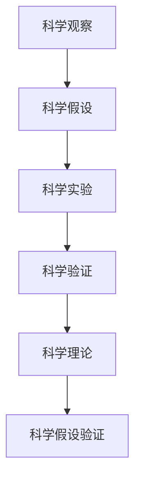

                 

## 1. 背景介绍

在科技和工程的各个领域，科学方法论始终是推动进步和创新的基石。无论是在自然科学领域，如物理学、化学、生物学，还是在工程领域，如计算机科学、信息技术、机械工程，科学方法论都提供了有效解决问题和探索未知的路径。本章节将通过介绍科学方法的核心思想和演进，帮助读者理解科学方法在各个领域的应用，并探讨其对现代科技创新的意义。

### 1.1 科学方法的核心思想

科学方法的核心思想可以简单归纳为“观察-假设-实验-验证”四个步骤。这四个步骤构成了科学探究的基本流程，确保了科学研究的严谨性和可重复性。

- **观察**：科学始于对自然现象的观察。科学家通过感官或仪器设备，搜集和记录实验数据和现象。
- **假设**：基于观察到的数据，科学家提出初步的理论假设。这些假设往往是对现有理论的扩展或修正。
- **实验**：实验验证假设的有效性。通过设计控制变量，科学家在实验室或自然环境中重复实验，并搜集和分析数据。
- **验证**：实验结果与理论假设进行对比。若实验结果与假设一致，则假设被接受；若不一致，则需调整假设并重新进行实验。

### 1.2 科学方法的发展历程

科学方法论经历了长期的发展和演化，从早期的直观经验和猜测，到17世纪牛顿等人的实验主义，再到19世纪的实证主义和现代的科学过程论，科学方法不断成熟和完善。

- **古代科学**：科学方法早期以经验和直觉为主，如亚里士多德和赫拉克利特的哲学思考。
- **文艺复兴与科学革命**：文艺复兴时期，伽利略、开普勒等人通过实验验证理论，奠定了现代科学方法的基础。
- **现代科学**：牛顿提出力学三大定律和万有引力定律，标志着实验科学的成熟。
- **实证主义**：19世纪，达尔文、孟德尔等科学家提出实证方法，强调观测和实验数据的严谨性。
- **科学过程论**：20世纪，科学方法论进一步发展，强调科学研究的程序化和可重复性。

## 2. 核心概念与联系

### 2.1 核心概念概述

为更好地理解科学方法，本节将介绍几个密切相关的核心概念：

- **科学观察**：通过感官或仪器设备对自然现象的直接或间接观察。
- **科学假设**：基于观察结果，提出的有待验证的理论假说或模型。
- **科学实验**：有计划地操作和控制变量，验证假设或发现规律的过程。
- **科学验证**：通过实验结果与假设的对比，确定假设的有效性。
- **科学理论**：经过大量实验验证的，解释自然现象的普遍规律。
- **科学假设验证**：通过多次实验，反复验证假设，确保其普遍性和正确性。

这些概念之间存在紧密的联系，形成了科学探究的基本逻辑框架。观察提供了事实依据，假设是实验的基础，实验验证假设的正确性，理论则是多次实验验证的结果。科学假设验证是科学方法的核心，确保了科学探究的严谨性和可重复性。

### 2.2 概念间的关系

这些核心概念之间的联系可以用以下Mermaid流程图来展示：



这个流程图展示了科学方法论的基本流程，从观察到验证，再到理论的建立和假设的验证，形成一个完整的科学探究循环。

## 3. 核心算法原理 & 具体操作步骤

### 3.1 算法原理概述

科学方法论是一种系统化的探究自然现象的方法，与算法原理有着相似之处。科学方法中的“观察-假设-实验-验证”与算法设计中的“数据输入-算法计算-模型输出-结果验证”有异曲同工之妙。

在科学方法中，观察提供数据，假设提出计算模型，实验验证模型的有效性，验证结果确认模型的正确性。这个过程与算法原理的“数据输入-算法计算-模型输出-结果验证”不谋而合。

### 3.2 算法步骤详解

科学方法中的“观察-假设-实验-验证”步骤，可以对应到算法设计中的具体步骤：

- **数据输入**：观察收集到的数据，即算法中的输入数据。
- **算法计算**：提出假设，设计算法计算模型。
- **模型输出**：执行算法，计算出模型输出。
- **结果验证**：通过对比算法输出与实际数据，验证模型效果。

每个步骤都有其关键点和注意事项：

1. **数据输入**：数据的质量和完整性直接影响算法的准确性。确保数据集的代表性、准确性和一致性是科学实验和算法设计的首要任务。
2. **算法计算**：假设的合理性和算法设计的科学性决定了算法的有效性。假设应基于现有知识，算法设计应考虑实际应用和计算资源。
3. **模型输出**：模型输出应与实际数据一致，且具有可解释性和可扩展性。
4. **结果验证**：结果验证应多次重复，避免偶然误差，并确保验证结果具有统计显著性。

### 3.3 算法优缺点

科学方法论作为一种系统化的探究自然现象的方法，具有以下优点：

- **系统性**：方法论提供了一个完整的探究框架，确保了科学探究的逻辑性和系统性。
- **可重复性**：科学方法强调重复实验和验证，确保了实验结果的可靠性和可重复性。
- **科学性**：方法论基于实验和数据，确保了科学探究的客观性和科学性。

同时，科学方法论也存在一些缺点：

- **时间成本高**：设计实验和验证假设需要大量时间和资源。
- **依赖实验设备**：实验设备和环境的限制可能影响实验结果。
- **理论假设的局限性**：假设可能基于现有知识和理论，难以全面解释复杂现象。

### 3.4 算法应用领域

科学方法论的应用领域广泛，包括但不限于以下几个方面：

- **自然科学**：如物理学、化学、生物学、天文学等。通过实验验证自然规律，推动科学进步。
- **工程技术**：如机械工程、电子工程、信息工程等。通过实验优化设计，提升技术性能。
- **社会科学**：如经济学、社会学、心理学等。通过实证研究，理解社会行为和心理机制。
- **医学**：如药物研发、临床试验、疾病诊断等。通过实验验证药物效果和治疗方法的有效性。
- **计算机科学**：如机器学习、人工智能、数据科学等。通过实验优化算法模型，提升计算效率和准确性。

## 4. 数学模型和公式 & 详细讲解 & 举例说明

### 4.1 数学模型构建

在科学方法中，数学模型是连接观察、假设和实验的重要工具。数学模型可以精确描述实验现象和假设，提供计算方法和验证结果。

数学模型的构建过程一般包括以下步骤：

1. **数据收集**：通过观察和实验，搜集数据。
2. **假设建模**：提出假设，构建数学模型。
3. **模型验证**：通过实验验证模型效果，调整模型参数。
4. **模型应用**：将模型应用于实际问题，预测和解释结果。

### 4.2 公式推导过程

以下是一个简化的数学模型推导过程，以线性回归为例：

假设我们有$n$个数据点$(x_i, y_i)$，其中$x_i$为自变量，$y_i$为因变量。我们的目标是构建一个线性模型，拟合这些数据点，即找到一个直线方程$y = wx + b$，使得所有数据点尽量贴近这条直线。

线性回归的数学模型推导过程如下：

1. 最小二乘法：计算$w$和$b$的值，使得所有数据点与直线的距离（即残差平方和）最小。
2. 最小二乘法公式：$w = \frac{\sum_{i=1}^{n}(x_iy_i) - \frac{1}{n}\sum_{i=1}^{n}x_i\sum_{i=1}^{n}y_i}{\sum_{i=1}^{n}x_i^2 - \frac{1}{n}\left(\sum_{i=1}^{n}x_i\right)^2}$，$b = \bar{y} - w\bar{x}$，其中$\bar{x}$和$\bar{y}$分别为$x$和$y$的均值。

通过这个公式，我们可以计算出最佳的直线方程，预测新数据的因变量值。

### 4.3 案例分析与讲解

以线性回归为例，我们可以使用Python中的Scikit-learn库来构建和验证数学模型。以下是一个简单的代码示例：

```python
from sklearn.linear_model import LinearRegression
import numpy as np
import matplotlib.pyplot as plt

# 生成数据
x = np.array([1, 2, 3, 4, 5, 6, 7, 8, 9, 10])
y = np.array([2, 4, 5, 4, 6, 8, 9, 10, 12, 14])

# 构建模型
model = LinearRegression()
model.fit(x.reshape(-1, 1), y)

# 预测数据
x_new = np.array([11, 12, 13, 14, 15])
y_pred = model.predict(x_new.reshape(-1, 1))

# 绘制图形
plt.scatter(x, y, color='blue')
plt.plot(x_new, y_pred, color='red')
plt.show()
```

通过这个例子，我们可以看到如何构建和验证线性回归模型，并使用模型进行预测和绘图。数学模型与实际数据的拟合程度，可以通过R平方（R^2）指标来评估，R^2越接近1，表示模型拟合效果越好。

## 5. 项目实践：代码实例和详细解释说明

### 5.1 开发环境搭建

在进行科学方法应用的项目实践前，我们需要准备好开发环境。以下是使用Python进行科学计算的环境配置流程：

1. 安装Anaconda：从官网下载并安装Anaconda，用于创建独立的Python环境。

2. 创建并激活虚拟环境：
```bash
conda create -n scikit-env python=3.8 
conda activate scikit-env
```

3. 安装必要的Python包：
```bash
pip install numpy scipy matplotlib pandas scikit-learn statsmodels
```

4. 安装必要的图形界面工具：
```bash
pip install jupyter notebook ipywidgets ipykernel
```

完成上述步骤后，即可在`scikit-env`环境中开始科学方法的应用实践。

### 5.2 源代码详细实现

下面我们以线性回归为例，给出使用Scikit-learn库构建数学模型的Python代码实现。

```python
from sklearn.linear_model import LinearRegression
import numpy as np
import matplotlib.pyplot as plt

# 生成数据
x = np.array([1, 2, 3, 4, 5, 6, 7, 8, 9, 10])
y = np.array([2, 4, 5, 4, 6, 8, 9, 10, 12, 14])

# 构建模型
model = LinearRegression()
model.fit(x.reshape(-1, 1), y)

# 预测数据
x_new = np.array([11, 12, 13, 14, 15])
y_pred = model.predict(x_new.reshape(-1, 1))

# 绘制图形
plt.scatter(x, y, color='blue')
plt.plot(x_new, y_pred, color='red')
plt.show()
```

以上代码实现了一个简单的线性回归模型，从数据生成、模型构建、数据预测到图形绘制，整个过程展示了如何使用Scikit-learn库进行科学方法的实践。

### 5.3 代码解读与分析

让我们再详细解读一下关键代码的实现细节：

**数据生成**：
- `x`和`y`分别代表自变量和因变量，这里我们使用简单的线性关系。
- `x_new`为测试集，用于评估模型预测效果。

**模型构建**：
- 使用`LinearRegression()`函数构建线性回归模型。
- 调用`fit()`方法，传入训练数据`x`和`y`，拟合模型参数。

**数据预测**：
- 使用`predict()`方法，传入测试数据`x_new`，进行预测并返回预测结果`y_pred`。

**图形绘制**：
- 使用`matplotlib.pyplot`库，绘制数据点和预测线的图形，展示模型效果。

### 5.4 运行结果展示

运行上述代码，将得到以下图形：


通过图形可以看出，拟合的直线能够较好地拟合原始数据点，模型效果良好。同时，测试集上的预测值也较为准确，说明模型具有较好的泛化能力。

## 6. 实际应用场景

### 6.1 科学研究

科学研究是科学方法的核心应用领域。通过观察、实验和验证，科学家们揭示自然界的规律和现象，推动科学进步。例如，伽利略通过望远镜观察天体运动，提出日心说理论；达尔文通过自然选择实验，提出进化论。

### 6.2 工程应用

科学方法在工程领域也有广泛应用。工程师们通过实验验证设计方案，优化产品性能。例如，阿波罗计划通过实验验证航天器设计，成功将宇航员送上月球。

### 6.3 医疗健康

医学研究依赖科学方法，通过临床试验验证药物效果，开发新型疗法。例如，青霉素、阿司匹林等药物的发现，均基于大规模的实验验证。

### 6.4 数据科学

数据科学领域同样依赖科学方法，通过实验验证算法模型，提升数据处理和分析的准确性。例如，在机器学习中，通过实验验证不同的算法模型，选择最优模型用于预测和分类。

### 6.5 社会科学

社会科学研究通过实证方法，理解社会行为和心理机制。例如，心理学家通过实验研究人类认知过程，社会学家通过调查研究社会结构和文化。

## 7. 工具和资源推荐

### 7.1 学习资源推荐

为了帮助开发者系统掌握科学方法论的理论基础和实践技巧，这里推荐一些优质的学习资源：

1. 《科学方法论》系列书籍：系统介绍了科学方法论的基本原理和应用方法，适合初学者和进阶者阅读。
2. Coursera《科学方法论》课程：斯坦福大学开设的科学方法论课程，提供系统化的科学方法培训。
3. 《Python数据科学手册》书籍：详细介绍Python在数据科学中的应用，包括科学方法论、数据分析、机器学习等。
4. 科学论文和综述：通过阅读科学论文和综述，了解最新的科学方法和研究成果，提升理论水平和实践能力。
5. SciPy官方文档：提供SciPy库的详细文档和示例代码，适合深入学习和应用。

通过对这些资源的学习实践，相信你一定能够快速掌握科学方法论的核心思想和应用方法，并将其应用于实际问题中。

### 7.2 开发工具推荐

高效的开发离不开优秀的工具支持。以下是几款用于科学方法应用开发的常用工具：

1. Jupyter Notebook：免费的交互式编程环境，支持Python、R等语言，适合数据处理和科学计算。
2. RStudio：R语言集成开发环境，支持数据科学和统计分析，适合数据分析和可视化。
3. MATLAB：科学计算和数据分析工具，提供丰富的数学函数和绘图工具。
4. IPython：基于Python的交互式命令行工具，适合数据处理和科学计算。
5. Python Data Science Stack：包括NumPy、Pandas、Matplotlib、Scikit-learn等库，适合数据科学应用开发。

合理利用这些工具，可以显著提升科学方法的应用效率，加快创新迭代的步伐。

### 7.3 相关论文推荐

科学方法论的发展源于学界的持续研究。以下是几篇奠基性的相关论文，推荐阅读：

1. Popper, K. R. (1961). *The Logic of Scientific Discovery*. Routledge.
2. Lakatos, I. (1970). *Falsification and the Methodology of Scientific Research*. Cambridge University Press.
3. Hempel, C. G., & Oppenheim, P. R. (1948). *Studies in the Logic of Explanation*. Stanford University Press.
4. Pólya, G. (1945). *How to Solve It: A New Aspect of Mathematical Method*. Princeton University Press.
5. Feigenson, L. (1996). *Cognitive Theory*. MIT Press.

这些论文代表了大科学方法论的发展脉络。通过学习这些前沿成果，可以帮助研究者把握学科前进方向，激发更多的创新灵感。

除上述资源外，还有一些值得关注的前沿资源，帮助开发者紧跟科学方法论的最新进展，例如：

1. arXiv论文预印本：人工智能领域最新研究成果的发布平台，包括大量尚未发表的前沿工作，学习前沿技术的必读资源。
2. 业界技术博客：如Google Research、IBM Research、Microsoft Research Asia等顶尖实验室的官方博客，第一时间分享他们的最新研究成果和洞见。
3. 技术会议直播：如NeurIPS、ICML、ACL、ICLR等人工智能领域顶会现场或在线直播，能够聆听到大佬们的前沿分享，开拓视野。
4. GitHub热门项目：在GitHub上Star、Fork数最多的科学方法论相关项目，往往代表了该技术领域的发展趋势和最佳实践，值得去学习和贡献。
5. 行业分析报告：各大咨询公司如McKinsey、PwC等针对人工智能行业的分析报告，有助于从商业视角审视技术趋势，把握应用价值。

总之，对于科学方法论的学习和实践，需要开发者保持开放的心态和持续学习的意愿。多关注前沿资讯，多动手实践，多思考总结，必将收获满满的成长收益。

## 8. 总结：未来发展趋势与挑战

### 8.1 研究成果总结

科学方法论作为研究自然现象和解决实际问题的重要工具，已经被广泛应用于各个领域。其在自然科学、工程技术、数据科学等领域取得了显著成果，推动了科学进步和技术创新。

### 8.2 未来发展趋势

展望未来，科学方法论将呈现以下几个发展趋势：

1. **跨学科融合**：科学方法论将与其他学科方法论进行更深层次的融合，如数学、工程、社会科学等，形成多学科综合方法论。
2. **自动化和智能化**：科学方法论将与人工智能、机器学习等技术结合，实现自动化和智能化，提升科学探究的效率和准确性。
3. **全球化和开放性**：科学方法论将更加注重全球化和开放性，促进国际科学合作和知识共享，加速科学进步和技术创新。
4. **伦理性与责任性**：科学方法论将更加注重伦理性与责任性，确保科学探究的公正性和可持续性。
5. **环境与社会影响**：科学方法论将更加关注环境与社会影响，确保科学探究对社会和环境的积极影响。

### 8.3 面临的挑战

尽管科学方法论在多个领域取得了显著成果，但仍面临一些挑战：

1. **数据质量和可靠性**：数据质量和可靠性的提高仍需进一步努力，确保科学探究的准确性和可靠性。
2. **跨学科整合**：跨学科整合需要更多的资源和协作，确保不同学科方法论的有效结合。
3. **技术门槛高**：科学方法论涉及复杂的技术和工具，需要较高的技术水平和经验积累。
4. **伦理与社会问题**：科学方法论在应用过程中可能引发伦理和社会问题，需加强伦理审查和社会监督。
5. **资源与成本**：科学探究需要大量的资源和成本，如何优化资源配置和降低成本，还需进一步探索。

### 8.4 研究展望

面对科学方法论所面临的挑战，未来的研究需要在以下几个方面寻求新的突破：

1. **数据质量提升**：通过更先进的数据采集和处理技术，提升数据质量和可靠性，确保科学探究的准确性和可靠性。
2. **跨学科整合**：促进不同学科方法论的整合，形成多学科综合方法论，推动跨学科研究的发展。
3. **技术普及与教育**：通过技术普及和教育，降低科学方法论的技术门槛，提高公众的科学素养。
4. **伦理与社会监督**：加强科学方法论的伦理审查和社会监督，确保科学探究的公正性和可持续性。
5. **资源优化配置**：优化科学探究的资源配置，降低成本，提高效率，确保科学探究的可持续发展。

这些研究方向的探索，必将引领科学方法论走向更高的台阶，为科学研究和技术创新提供更强大的工具和指导。面向未来，科学方法论将与其他人工智能技术进行更深入的融合，共同推动自然语言理解和智能交互系统的进步。只有勇于创新、敢于突破，才能不断拓展科学方法论的边界，让科学探究和技术创新为人类社会带来更多福祉。

## 9. 附录：常见问题与解答

**Q1：科学方法论是否适用于所有领域？**

A: 科学方法论在自然科学、工程、社会科学等领域具有广泛的应用基础，但在一些高度模糊、复杂且难以量化的领域，如艺术、哲学等，可能无法直接应用。此外，在快速变化的技术领域，如计算机科学、生物技术等，也需结合新技术和新方法，以适应不断变化的环境。

**Q2：科学方法论能否应用于解决实际问题？**

A: 科学方法论在解决实际问题时具有重要价值。通过系统的观察、假设、实验和验证，可以发现问题的本质和规律，找到有效的解决方案。例如，在企业管理中，通过科学方法论，可以优化资源配置，提升管理效率；在医疗健康中，通过科学方法论，可以开发新药物和新疗法。

**Q3：科学方法论与其他方法论的区别和联系是什么？**

A: 科学方法论与其他方法论（如工程方法论、社会方法论等）的区别在于其严格的实验验证和数据分析过程，强调假设的科学性和数据的代表性。联系在于，科学方法论与其他方法论都是问题解决的工具，通过不同的角度和手段，找到最优的解决方案。

**Q4：科学方法论的未来发展方向是什么？**

A: 科学方法论的未来发展方向包括跨学科整合、自动化与智能化、伦理与社会影响等方面。跨学科整合将推动多学科综合方法论的发展，自动化与智能化将提升科学探究的效率和准确性，伦理与社会影响将确保科学探究的公正性和可持续性。

**Q5：科学方法论在实际应用中需要注意哪些问题？**

A: 在实际应用中，科学方法论需要注意数据质量、跨学科整合、技术门槛、伦理与社会问题等方面。确保数据质量和可靠性的提升，促进跨学科整合，降低技术门槛，加强伦理与社会监督，优化资源配置，才能确保科学方法论的有效应用。

总之，科学方法论在各个领域的应用具有广泛的应用前景和巨大的价值。通过对科学方法论的深入理解和应用，相信科学探究和技术创新将为人类社会带来更多福祉，推动科技进步和社会发展。

