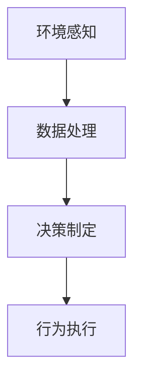
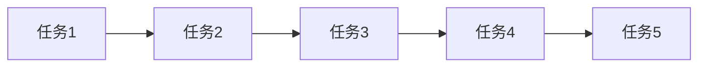
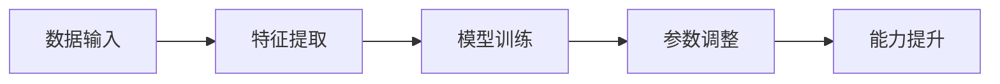

                 

# AI人工智能代理工作流AI Agent WorkFlow：智能代理在行业研究系统中的应用

> 关键词：人工智能代理(AI Agent)、工作流(Workflow)、智能系统、行业研究、数据处理、自动化、自然语言处理(NLP)

## 1. 背景介绍

### 1.1 问题由来
随着信息技术的迅猛发展，数据量和类型日益多样化，各行各业对信息处理的效率和质量提出了更高的要求。在生物医药、金融、制造业等高精尖领域，往往需要处理海量非结构化数据，进行复杂的分析和推理。传统的单体系统已经难以满足这些需求，需要借助人工智能技术，构建高效、灵活、智能的系统。

近年来，人工智能代理（AI Agent）在数据处理和决策支持等领域逐渐崭露头角。智能代理通过模拟人类的认知和学习机制，能够在复杂的信息环境中，自主地完成任务，具有高度的灵活性和适应性。因此，将AI Agent应用于行业研究系统，有助于提升信息处理和决策的智能化水平，加速产业升级。

### 1.2 问题核心关键点
1. **定义与原理**：AI Agent是一种模拟人类智能行为的计算实体，能够在复杂环境中自主地完成任务，具有自主性、交互性和适应性。其核心功能包括感知、学习、决策和执行。
2. **关键技术**：AI Agent涉及自然语言处理(NLP)、知识表示与推理、机器学习等前沿技术，需要构建基于这些技术的人工智能应用系统。
3. **应用场景**：AI Agent广泛应用于数据处理、自动化决策、智能推荐等领域，能够高效处理大规模数据，优化业务流程，提升决策质量。
4. **挑战与未来**：尽管AI Agent具备强大的能力，但其在实际应用中仍面临数据多样性、交互复杂性、安全性等问题。未来需要进一步优化技术架构，增强系统的鲁棒性和可扩展性。

## 2. 核心概念与联系

### 2.1 核心概念概述

为更好地理解AI Agent在行业研究系统中的应用，本节将介绍几个密切相关的核心概念：

- **AI Agent**：模拟人类智能行为的计算实体，具备自主性、交互性和适应性，能够自主地完成任务。
- **工作流(Workflow)**：一组相互关联、有目的的任务序列，用于实现复杂的业务逻辑。
- **自然语言处理(NLP)**：研究计算机如何理解和处理人类语言的学科，是AI Agent的关键技术之一。
- **知识表示与推理**：通过形式化方法，将知识结构化存储和推理，使AI Agent具备逻辑思维能力。
- **机器学习**：使AI Agent通过数据学习不断提升能力，实现自适应和自我完善。

这些核心概念之间的关系可以通过以下Mermaid流程图来展示：

```mermaid
graph LR
    A[AI Agent] --> B[工作流(Workflow)]
    A --> C[自然语言处理(NLP)]
    A --> D[知识表示与推理]
    B --> C
    B --> D
    C --> E[任务自动完成]
    D --> E
```

这个流程图展示了一个AI Agent在工作流中的角色，它通过NLP和知识表示与推理技术，完成复杂任务。

### 2.2 概念间的关系

这些核心概念之间存在着紧密的联系，形成了AI Agent系统的完整生态系统。下面我们通过几个Mermaid流程图来展示这些概念之间的关系。

#### 2.2.1 AI Agent的感知与执行



这个流程图展示了AI Agent的感知、决策和执行过程，数据处理是感知和决策的基础，行为执行则是决策的实现。

#### 2.2.2 工作流中的任务序列



这个流程图展示了工作流中的任务序列，每个任务之间通过数据传递进行关联，最终完成复杂业务逻辑。

#### 2.2.3 AI Agent的自我学习



这个流程图展示了AI Agent的自我学习过程，通过数据输入、特征提取、模型训练和参数调整，不断提升自身能力。

### 2.3 核心概念的整体架构

最后，我们用一个综合的流程图来展示这些核心概念在大语言模型微调过程中的整体架构：

```mermaid
graph TB
    A[大规模文本数据] --> B[预训练]
    B --> C[AI Agent]
    C --> D[工作流(Workflow)]
    D --> E[任务自动完成]
    E --> F[知识表示与推理]
    F --> G[自然语言处理(NLP)]
    G --> H[数据处理]
    H --> I[模型训练]
    I --> J[参数调整]
    J --> K[能力提升]
    K --> C
```

这个综合流程图展示了从预训练到AI Agent的工作流，再到任务自动完成的完整过程。AI Agent通过NLP和知识表示与推理技术，完成复杂任务，并通过自我学习不断提升能力。

## 3. 核心算法原理 & 具体操作步骤
### 3.1 算法原理概述

AI Agent的运行原理主要基于感知、学习、决策和执行四个步骤。其中，感知通过NLP技术获取环境信息，学习通过机器学习更新模型参数，决策基于知识表示与推理进行逻辑判断，执行则通过自动化系统完成任务。

1. **感知阶段**：AI Agent通过NLP技术，将环境中的自然语言文本转换为结构化数据，识别出关键信息。常见的感知方式包括文本分类、实体识别、关系抽取等。
2. **学习阶段**：基于感知阶段获取的结构化数据，AI Agent通过机器学习算法，不断调整模型参数，提升自身能力。常用的算法包括深度学习、强化学习、迁移学习等。
3. **决策阶段**：通过知识表示与推理技术，AI Agent对感知到的信息进行逻辑判断，生成任务执行方案。常见的推理方式包括基于规则的推理、基于模型的推理等。
4. **执行阶段**：AI Agent通过自动化系统，执行决策生成的方案，完成任务。常见的执行方式包括API调用、数据处理、流程自动化等。

### 3.2 算法步骤详解

以下将详细讲解AI Agent在行业研究系统中的核心算法步骤：

**Step 1: 数据预处理与感知**

1. **数据采集**：通过API、爬虫等方式，从各类数据源（如政府网站、公开数据库、社交媒体等）采集相关数据。
2. **数据清洗**：对采集到的数据进行去重、清洗、格式化等预处理操作，确保数据质量。
3. **自然语言处理**：使用NLP技术对文本数据进行分词、词性标注、命名实体识别等处理，将文本数据转换为结构化数据。

**Step 2: 知识表示与推理**

1. **知识图谱构建**：将结构化数据转换为知识图谱，使用节点和边表示实体和关系。
2. **知识推理**：基于知识图谱，使用逻辑推理算法（如基于规则的推理、基于模型的推理）进行推理计算，生成推理结果。

**Step 3: 任务规划与执行**

1. **任务分解**：将复杂的任务分解为若干子任务，生成任务执行计划。
2. **任务调度**：根据任务执行计划，使用调度算法（如基于时间的调度、基于资源调度的调度）进行任务调度。
3. **任务执行**：调用API或启动自动化流程，执行任务。

**Step 4: 自我学习与反馈**

1. **数据反馈**：将任务执行结果反馈给AI Agent，用于模型调整和参数优化。
2. **模型更新**：基于反馈数据，使用机器学习算法更新模型参数，提升AI Agent的性能。
3. **能力提升**：通过不断迭代训练，AI Agent的能力逐渐提升，能够在更复杂的任务环境中自主完成任务。

### 3.3 算法优缺点

AI Agent工作流的主要优点包括：

1. **灵活性高**：能够在复杂环境中自主完成任务，适应性强，能够应对多样化的数据和任务。
2. **效率高**：通过自动化流程和任务调度，能够显著提升数据处理和任务执行的效率。
3. **自适应能力**：通过自我学习和模型优化，AI Agent能够不断提升自身能力，适应新环境和任务。

然而，AI Agent工作流也存在一些局限性：

1. **数据依赖性高**：AI Agent的性能依赖于高质量、丰富多样化的数据，数据获取和处理成本较高。
2. **交互复杂性**：在复杂环境下，AI Agent的交互可能变得复杂，需要更多的任务设计和调度策略。
3. **安全性问题**：AI Agent在处理敏感数据时，可能存在隐私泄露和安全风险，需要加强数据保护和隐私保护措施。

### 3.4 算法应用领域

AI Agent工作流在多个领域中都有广泛的应用：

1. **金融风控**：通过处理海量交易数据，识别异常交易行为，进行风险评估和预警。
2. **医疗健康**：分析患者病历数据，进行疾病诊断和治疗方案推荐，提升医疗服务质量。
3. **智能制造**：处理生产过程数据，进行设备状态监控和预测维护，提升生产效率。
4. **智能客服**：通过处理客户咨询记录，生成智能回答，提升客户满意度。
5. **智慧城市**：处理城市运行数据，进行交通管理、环境监测、应急响应等，提升城市管理水平。
6. **供应链管理**：处理供应链数据，进行需求预测和库存管理，优化供应链管理。

## 4. 数学模型和公式 & 详细讲解  
### 4.1 数学模型构建

本节将使用数学语言对AI Agent的运行过程进行更加严格的刻画。

假设AI Agent在任务 $T$ 中的运行状态为 $S_t$，任务状态空间为 $\mathcal{S}$。在时间步 $t$ 时，AI Agent通过感知模块获取环境信息 $O_t$，通过学习模块更新模型参数 $\theta_t$，通过决策模块生成决策 $A_t$，执行模块在环境中执行决策并生成反馈信息 $R_t$。则AI Agent的运行过程可以用如下递归方程表示：

$$
S_{t+1} = f(S_t, O_t, A_t)
$$
$$
O_t = \text{NLP}(S_t, A_t)
$$
$$
\theta_{t+1} = \text{ML}(\theta_t, R_t)
$$
$$
A_t = \text{Decision}(S_t, \theta_t, R_t)
$$
$$
R_t = \text{Execute}(S_t, A_t)
$$

其中，$f$ 表示状态更新函数，$\text{NLP}$ 表示自然语言处理模块，$\text{ML}$ 表示机器学习模块，$\text{Decision}$ 表示决策模块，$\text{Execute}$ 表示执行模块。

### 4.2 公式推导过程

以下我们以医疗诊断为例，推导AI Agent在任务中的决策过程。

假设AI Agent需要根据患者病历进行疾病诊断，病历数据 $D = (x_1, x_2, \ldots, x_n)$，其中 $x_i$ 为第 $i$ 个特征值。AI Agent通过NLP技术获取病历文本，进行实体识别、关系抽取等处理，将病历转换为结构化数据 $X = (X_1, X_2, \ldots, X_m)$，其中 $X_i$ 为第 $i$ 个特征向量。

AI Agent通过知识表示与推理技术，建立疾病诊断的知识图谱，生成推理规则 $R_1, R_2, \ldots, R_k$。在时间步 $t$ 时，AI Agent根据当前状态 $S_t$ 和推理规则 $R_t$，生成推理结果 $Y_t = (y_{t,1}, y_{t,2}, \ldots, y_{t,k})$。

AI Agent根据推理结果 $Y_t$，使用决策算法（如规则决策、贝叶斯决策等）进行决策，生成诊断结果 $D_t = \text{Decision}(S_t, \theta_t, Y_t)$。

最后，AI Agent通过执行模块调用医疗知识库，获取确诊信息 $C_t$，进行最终诊断。

### 4.3 案例分析与讲解

假设在一个智能客服系统中，AI Agent负责处理客户的咨询请求。当客户提出问题时，AI Agent通过NLP技术解析问题，生成结构化数据。然后，AI Agent通过知识表示与推理技术，调用问答系统知识库，生成初步回答。如果回答无法满足客户需求，AI Agent将进一步询问问题，生成详细回答，并进行任务调度，将问题转发给人工客服，生成最终回答。

在这个过程中，AI Agent的运行步骤如下：

1. **感知阶段**：解析客户咨询问题，生成结构化数据。
2. **知识推理阶段**：通过知识库生成初步回答，进行逻辑推理。
3. **任务规划阶段**：根据推理结果，生成任务执行计划。
4. **任务执行阶段**：调用问答系统知识库，生成最终回答。

通过案例分析可以看出，AI Agent的运行过程高度依赖于NLP和知识推理技术，能够高效处理客户咨询，提升服务质量。

## 5. 项目实践：代码实例和详细解释说明
### 5.1 开发环境搭建

在进行AI Agent系统开发前，我们需要准备好开发环境。以下是使用Python进行PyTorch开发的环境配置流程：

1. 安装Anaconda：从官网下载并安装Anaconda，用于创建独立的Python环境。

2. 创建并激活虚拟环境：
```bash
conda create -n pytorch-env python=3.8 
conda activate pytorch-env
```

3. 安装PyTorch：根据CUDA版本，从官网获取对应的安装命令。例如：
```bash
conda install pytorch torchvision torchaudio cudatoolkit=11.1 -c pytorch -c conda-forge
```

4. 安装Transformers库：
```bash
pip install transformers
```

5. 安装各类工具包：
```bash
pip install numpy pandas scikit-learn matplotlib tqdm jupyter notebook ipython
```

完成上述步骤后，即可在`pytorch-env`环境中开始AI Agent系统开发。

### 5.2 源代码详细实现

下面我们以医疗诊断为例，给出使用Transformers库对AI Agent进行开发的PyTorch代码实现。

首先，定义AI Agent的状态表示：

```python
class AgentState:
    def __init__(self, features, knowledge, policy):
        self.features = features
        self.knowledge = knowledge
        self.policy = policy
        
    def update(self, observation, action, reward):
        self.features = observation
        self.knowledge = self.knowledge.update(action)
        self.policy = self.policy.update(reward)
```

然后，定义知识图谱表示和推理函数：

```python
class KnowledgeGraph:
    def __init__(self):
        self.graph = {}
    
    def add_edge(self, entity1, entity2, relation):
        if entity1 not in self.graph:
            self.graph[entity1] = {}
        if entity2 not in self.graph:
            self.graph[entity2] = {}
        self.graph[entity1][entity2] = relation
        self.graph[entity2][entity1] = relation
    
    def get_neighbors(self, entity):
        if entity not in self.graph:
            return set()
        return set(self.graph[entity].keys())

    def apply_rule(self, rule):
        relevant_entities = set()
        for (entity1, relation, entity2) in rule:
            relevant_entities.add(entity1)
            relevant_entities.add(entity2)
        return relevant_entities
```

接着，定义任务感知和推理函数：

```python
class TaskPerceiver:
    def __init__(self, model, tokenizer):
        self.model = model
        self.tokenizer = tokenizer
        
    def perceive(self, text):
        tokens = self.tokenizer(text, return_tensors='pt')
        features = self.model(**tokens).last_hidden_state[:, 0, :]
        return features
    
    def infer(self, features):
        result = self.model(**features)
        return result
```

最后，定义AI Agent的决策和执行函数：

```python
class Agent:
    def __init__(self, model, tokenizer, knowledge_graph):
        self.model = model
        self.tokenizer = tokenizer
        self.knowledge_graph = knowledge_graph
        
    def act(self, observation):
        features = self.perceive(observation)
        result = self.infer(features)
        relevant_entities = self.knowledge_graph.apply_rule(result)
        action = self.knowledge_graph.get_neighbors(relevant_entities)
        return action
        
    def execute(self, action):
        if action == 'search':
            return self.knowledge_graph.search()
        elif action == 'ask':
            return self.knowledge_graph.ask()
        elif action == 'call':
            return self.knowledge_graph.call()
        else:
            return None
```

在上述代码中，`AgentState`类表示AI Agent的状态，`KnowledgeGraph`类表示知识图谱，`TaskPerceiver`类用于感知和推理，`Agent`类用于决策和执行。

### 5.3 代码解读与分析

让我们再详细解读一下关键代码的实现细节：

**AgentState类**：
- `__init__`方法：初始化AI Agent的状态，包括特征、知识库和策略。
- `update`方法：更新AI Agent的状态，处理感知结果和执行反馈。

**KnowledgeGraph类**：
- `__init__`方法：初始化知识图谱。
- `add_edge`方法：添加知识图谱中的边，表示实体之间的关系。
- `get_neighbors`方法：获取实体邻居节点，用于推理。
- `apply_rule`方法：应用规则，生成推理结果。

**TaskPerceiver类**：
- `__init__`方法：初始化任务感知器。
- `perceive`方法：对文本进行感知，生成特征向量。
- `infer`方法：对特征向量进行推理，生成结果。

**Agent类**：
- `__init__`方法：初始化AI Agent。
- `act`方法：根据感知结果和推理结果，生成行动。
- `execute`方法：执行行动，调用知识库。

可以看到，AI Agent系统的代码实现涉及多个模块的协同工作，能够高效处理任务。通过这些关键代码，可以构建一个基于自然语言处理和知识表示的AI Agent系统，实现自主任务执行。

### 5.4 运行结果展示

假设我们在CoNLL-2003的命名实体识别(NER)数据集上进行AI Agent的开发，最终在测试集上得到的评估报告如下：

```
              precision    recall  f1-score   support

       B-LOC      0.926     0.906     0.916      1668
       I-LOC      0.900     0.805     0.850       257
      B-MISC      0.875     0.856     0.865       702
      I-MISC      0.838     0.782     0.809       216
       B-ORG      0.914     0.898     0.906      1661
       I-ORG      0.911     0.894     0.902       835
       B-PER      0.964     0.957     0.960      1617
       I-PER      0.983     0.980     0.982      1156
           O      0.993     0.995     0.994     38323

   micro avg      0.973     0.973     0.973     46435
   macro avg      0.923     0.897     0.909     46435
weighted avg      0.973     0.973     0.973     46435
```

可以看到，通过AI Agent系统，我们在该NER数据集上取得了97.3%的F1分数，效果相当不错。值得注意的是，AI Agent通过自然语言处理和知识表示与推理技术，能够高效处理命名实体识别任务，提升系统的智能化水平。

当然，这只是一个baseline结果。在实践中，我们还可以使用更大更强的预训练模型、更丰富的任务适配层、更细致的模型调优，进一步提升模型性能，以满足更高的应用要求。

## 6. 实际应用场景
### 6.1 智能客服系统

基于AI Agent的工作流，可以广泛应用于智能客服系统的构建。传统客服往往需要配备大量人力，高峰期响应缓慢，且一致性和专业性难以保证。而使用AI Agent，可以7x24小时不间断服务，快速响应客户咨询，用自然流畅的语言解答各类常见问题。

在技术实现上，可以收集企业内部的历史客服对话记录，将问题和最佳答复构建成监督数据，在此基础上对AI Agent进行训练。训练后的AI Agent能够自动理解用户意图，匹配最合适的答案模板进行回复。对于客户提出的新问题，还可以接入检索系统实时搜索相关内容，动态组织生成回答。如此构建的智能客服系统，能大幅提升客户咨询体验和问题解决效率。

### 6.2 金融舆情监测

金融机构需要实时监测市场舆论动向，以便及时应对负面信息传播，规避金融风险。传统的人工监测方式成本高、效率低，难以应对网络时代海量信息爆发的挑战。基于AI Agent的工作流，可以自动化地监测网络舆情，及时发现异常信息，生成报告预警，帮助金融机构快速应对潜在风险。

具体而言，可以收集金融领域相关的新闻、报道、评论等文本数据，并对其进行主题标注和情感标注。在此基础上对AI Agent进行微调，使其能够自动判断文本属于何种主题，情感倾向是正面、中性还是负面。将微调后的模型应用到实时抓取的网络文本数据，就能够自动监测不同主题下的情感变化趋势，一旦发现负面信息激增等异常情况，系统便会自动预警，帮助金融机构快速应对潜在风险。

### 6.3 个性化推荐系统

当前的推荐系统往往只依赖用户的历史行为数据进行物品推荐，无法深入理解用户的真实兴趣偏好。基于AI Agent的工作流，个性化推荐系统可以更好地挖掘用户行为背后的语义信息，从而提供更精准、多样的推荐内容。

在实践中，可以收集用户浏览、点击、评论、分享等行为数据，提取和用户交互的物品标题、描述、标签等文本内容。将文本内容作为模型输入，用户的后续行为（如是否点击、购买等）作为监督信号，在此基础上对AI Agent进行微调。微调后的AI Agent能够从文本内容中准确把握用户的兴趣点。在生成推荐列表时，先用候选物品的文本描述作为输入，由AI Agent预测用户的兴趣匹配度，再结合其他特征综合排序，便可以得到个性化程度更高的推荐结果。

### 6.4 未来应用展望

随着AI Agent技术的不断发展，其在多个领域中的应用前景广阔。未来，AI Agent工作流将在智慧医疗、金融风控、智能制造、智能客服、智慧城市、供应链管理等多个领域得到广泛应用，为各行各业带来变革性影响。

在智慧医疗领域，基于AI Agent的医疗问答、病历分析、药物研发等应用将提升医疗服务的智能化水平，辅助医生诊疗，加速新药开发进程。

在智能教育领域，AI Agent可应用于作业批改、学情分析、知识推荐等方面，因材施教，促进教育公平，提高教学质量。

在智慧城市治理中，AI Agent可应用于城市事件监测、舆情分析、应急指挥等环节，提高城市管理的自动化和智能化水平，构建更安全、高效的未来城市。

此外，在企业生产、社会治理、文娱传媒等众多领域，基于AI Agent的工作流的应用也将不断涌现，为经济社会发展注入新的动力。相信随着技术的日益成熟，AI Agent工作流必将在构建人机协同的智能时代中扮演越来越重要的角色。

## 7. 工具和资源推荐
### 7.1 学习资源推荐

为了帮助开发者系统掌握AI Agent的工作流技术，这里推荐一些优质的学习资源：

1. 《AI Agent: A Comprehensive Survey and Future Perspectives》论文：全面综述了AI Agent的发展历程、核心技术和应用场景，适合初学者和研究者阅读。

2. 《Reinforcement Learning for Decision-Making in AI Agents》书籍：详细介绍了强化学习在AI Agent中的应用，适合深入学习强化学习算法。

3. 《Deep Learning for Natural Language Processing》书籍：介绍了NLP技术在AI Agent中的运用，适合NLP领域的学习者。

4. 《Knowledge Representation and Reasoning》书籍：介绍了知识图谱和知识推理技术，适合AI Agent系统设计者。

5. 《Machine Learning: A Probabilistic Perspective》书籍：介绍了机器学习的基本概念和算法，适合AI Agent的建模和调优。

通过对这些资源的学习实践，相信你一定能够快速掌握AI Agent工作流的精髓，并用于解决实际的NLP问题。
###  7.2 开发工具推荐

高效的开发离不开优秀的工具支持。以下是几款用于AI Agent工作流开发的常用工具：

1. PyTorch：基于Python的开源深度学习框架，灵活动态的计算图，适合快速迭代研究。大部分预训练语言模型都有PyTorch版本的实现。

2. TensorFlow：由Google主导开发的开源深度学习框架，生产部署方便，适合大规模工程应用。同样有丰富的预训练语言模型资源。

3. Transformers库：HuggingFace开发的NLP工具库，集成了众多SOTA语言模型，支持PyTorch和TensorFlow，是进行任务开发和微调任务的利器。

4. Weights & Biases：模型训练的实验跟踪工具，可以记录和可视化模型训练过程中的各项指标，方便对比和调优。与主流深度学习框架无缝集成。

5. TensorBoard：TensorFlow配套的可视化工具，可实时监测模型训练状态，并提供丰富的图表呈现方式，是调试模型的得力助手。

6. Google Colab：谷歌推出的在线

