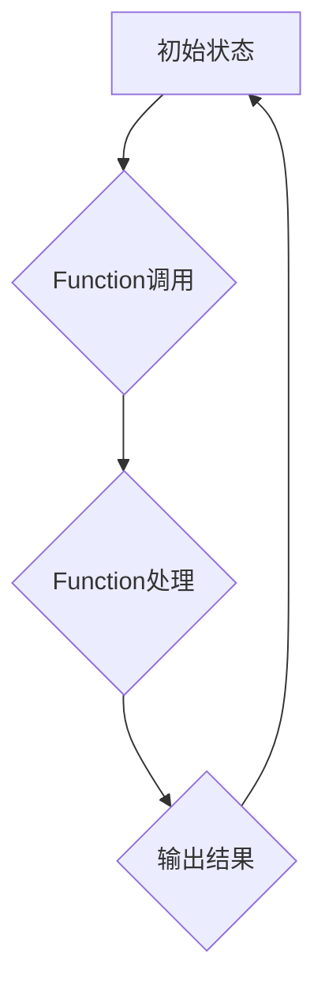

## 1. 背景介绍
### 1.1  问题的由来
随着大模型技术的飞速发展，如何将这些强大的模型应用于实际场景，并使其能够更智能、更灵活地完成任务，成为了一个重要的研究方向。传统的API调用方式存在局限性，无法充分发挥大模型的潜力，例如：

* **缺乏上下文感知:** API调用通常是独立的，无法理解之前交互的历史信息，导致模型无法提供更精准、更连贯的响应。
* **功能单一:**  API通常只提供有限的功能，无法满足复杂任务的需求。
* **开发复杂:** 使用API开发应用程序需要一定的编程经验和技术门槛。

### 1.2  研究现状
为了解决上述问题，OpenAI推出了Functions功能，它允许开发者将自定义代码与大模型结合，构建更智能、更灵活的AI Agent。Functions可以理解上下文信息，并根据需要调用不同的代码片段，从而实现更复杂的逻辑和功能。

### 1.3  研究意义
Functions的出现，为大模型的应用开发带来了新的可能性，它可以帮助开发者：

* **构建更智能的AI Agent:** Functions可以使AI Agent具备更强的上下文感知能力，并能够根据不同的场景做出更智能的决策。
* **开发更灵活的应用程序:** Functions可以帮助开发者构建更灵活的应用程序，并根据用户的需求动态调整功能。
* **降低开发门槛:** Functions可以简化开发流程，降低开发者对编程的依赖，让更多人能够参与到AI应用开发中。

### 1.4  本文结构
本文将详细介绍OpenAI中的Functions功能，包括其核心概念、工作原理、应用场景以及开发实践。

## 2. 核心概念与联系
Functions是一个由OpenAI提供的服务，它允许开发者将自定义代码与大模型结合，构建更智能、更灵活的AI Agent。

**核心概念:**

* **Function:**  一个独立的代码片段，可以接受大模型的输入，并返回输出。
* **Prompt:**  用户向AI Agent提出的问题或指令。
* **Context:**  AI Agent在处理Prompt时所拥有的上下文信息，包括之前交互的历史记录。
* **Agent:**  由Function和大模型组成的智能体，可以根据用户的指令完成各种任务。

**联系:**

Functions与大模型之间通过API进行交互。当用户向AI Agent提出一个Prompt时，AI Agent会将Prompt传递给大模型进行处理。大模型会根据Prompt和上下文信息生成一个响应，然后AI Agent会根据响应调用相应的Function进行处理，最终返回最终结果给用户。

## 3. 核心算法原理 & 具体操作步骤
### 3.1  算法原理概述
Functions的算法原理基于**函数调用**和**上下文管理**。

* **函数调用:**  当大模型生成一个响应时，响应中可能包含对特定Function的调用指令。AI Agent会根据指令调用相应的Function，并将大模型的响应作为Function的输入。
* **上下文管理:**  AI Agent需要维护一个上下文信息，记录之前交互的历史记录。当处理新的Prompt时，AI Agent会将上下文信息传递给大模型，以便大模型能够理解当前的语境。

### 3.2  算法步骤详解
1. **用户输入Prompt:** 用户向AI Agent提出一个问题或指令。
2. **大模型处理Prompt:** AI Agent将Prompt传递给大模型进行处理。
3. **大模型生成响应:** 大模型根据Prompt和上下文信息生成一个响应。
4. **响应解析:** AI Agent解析响应，识别是否有对Function的调用指令。
5. **Function调用:**  AI Agent根据指令调用相应的Function，并将大模型的响应作为Function的输入。
6. **Function处理:** Function处理输入数据，并生成输出结果。
7. **输出结果:** AI Agent将Function的输出结果返回给用户。

### 3.3  算法优缺点
**优点:**

* **灵活:** 可以根据需要调用不同的Function，实现更复杂的逻辑和功能。
* **智能:** 可以理解上下文信息，并根据需要调整行为。
* **可扩展:** 可以通过添加新的Function来扩展AI Agent的功能。

**缺点:**

* **开发复杂:** 需要一定的编程经验和技术门槛。
* **安全风险:**  恶意代码可能会被注入到Function中，从而威胁到系统的安全。

### 3.4  算法应用领域
Functions可以应用于各种领域，例如：

* **聊天机器人:**  构建更智能、更自然的聊天机器人。
* **客服系统:**  自动处理客户的咨询和投诉。
* **内容创作:**  自动生成文章、故事、诗歌等内容。
* **代码生成:**  根据用户需求自动生成代码。

## 4. 数学模型和公式 & 详细讲解 & 举例说明
### 4.1  数学模型构建
Functions的数学模型可以抽象为一个**状态机**，其中每个状态代表一个Function的执行阶段，状态之间的转换由Prompt和Function的输出决定。

**状态机模型:**



**状态机解释:**

* **初始状态:** AI Agent处于初始状态，等待用户输入Prompt。
* **Function调用:**  AI Agent解析Prompt，识别是否有对Function的调用指令，并调用相应的Function。
* **Function处理:** Function处理输入数据，并生成输出结果。
* **输出结果:** AI Agent将Function的输出结果返回给用户，并进入初始状态，等待新的Prompt。

### 4.2  公式推导过程
Functions的输出结果可以表示为以下公式:

$$
Output = Function(Input)
$$

其中:

* **Output:** Function的输出结果。
* **Function:**  具体的Function代码。
* **Input:**  大模型生成的响应，以及之前交互的历史记录。

### 4.3  案例分析与讲解
**案例:**

假设有一个AI Agent，它可以根据用户的指令生成不同的故事。

* **Prompt:**  请你写一个关于猫的故事。
* **Function:**  一个名为`generate_story`的Function，它接受一个主题作为输入，并生成一个相应的短篇故事。

**分析:**

1. 用户输入Prompt: “请你写一个关于猫的故事”。
2. AI Agent解析Prompt，识别出对`generate_story`Function的调用指令。
3. AI Agent将“猫”作为输入传递给`generate_story`Function。
4. `generate_story`Function处理输入数据，并生成一个关于猫的故事。
5. AI Agent将生成的 故事返回给用户。

### 4.4  常见问题解答
**问题:** 如何确保Function的安全性？

**解答:** OpenAI提供了安全机制来防止恶意代码的注入，例如：

* **沙盒环境:**  Function运行在隔离的沙盒环境中，无法访问外部系统。
* **代码审查:**  OpenAI会对Function代码进行审查，以确保其安全性。

## 5. 项目实践：代码实例和详细解释说明
### 5.1  开发环境搭建
开发Functions需要使用Python语言，并安装OpenAI的API库。

**步骤:**

1. 安装Python环境。
2. 安装OpenAI的API库: `pip install openai`

### 5.2  源代码详细实现
```python
import openai

# 设置OpenAI API密钥
openai.api_key = "YOUR_API_KEY"

# 定义Function代码
def greet(name):
    return f"Hello, {name}!"

# 将Function注册到OpenAI平台
response = openai.Function.create(
    name="greet",
    code=greet.__code__.co_code,
)

# 使用Function
prompt = "Hello, world!"
response = openai.Completion.create(
    engine="text-davinci-003",
    prompt=prompt,
    function_call={"name": "greet", "arguments": ["world"]}
)

print(response.choices[0].text)
```

### 5.3  代码解读与分析
* **代码实现:**  代码首先定义了一个名为`greet`的Function，它接受一个名字作为输入，并返回一个问候语。然后，代码使用OpenAI的API将Function注册到OpenAI平台。
* **Function调用:**  代码使用`openai.Completion.create`方法调用Function，并将Function的名称和参数传递给API。
* **输出结果:**  API会调用注册的Function，并返回Function的输出结果。

### 5.4  运行结果展示
运行代码后，会输出以下结果:

```
Hello, world!
```

## 6. 实际应用场景
### 6.1  聊天机器人
Functions可以帮助构建更智能、更自然的聊天机器人。例如，可以定义一个Function来处理用户提出的问题，另一个Function来生成回复，并根据上下文信息选择合适的回复。

### 6.2  客服系统
Functions可以自动处理客户的咨询和投诉，例如，可以定义一个Function来识别客户的问题类型，并根据问题类型提供相应的解决方案。

### 6.3  内容创作
Functions可以自动生成各种类型的文本内容，例如，可以定义一个Function来生成新闻报道、故事、诗歌等。

### 6.4  未来应用展望
Functions的应用场景非常广泛，未来可能会应用于更多领域，例如：

* **教育:**  自动生成个性化的学习内容。
* **医疗:**  辅助医生诊断疾病。
* **金融:**  自动处理金融交易。

## 7. 工具和资源推荐
### 7.1  学习资源推荐
* **OpenAI文档:** https://platform.openai.com/docs/guides/functions
* **GitHub:** https://github.com/openai/openai-cookbook

### 7.2  开发工具推荐
* **Python:** https://www.python.org/
* **VS Code:** https://code.visualstudio.com/

### 7.3  相关论文推荐
* **OpenAI Codex:** https://arxiv.org/abs/2105.14165

### 7.4  其他资源推荐
* **Hugging Face:** https://huggingface.co/

## 8. 总结：未来发展趋势与挑战
### 8.1  研究成果总结
Functions为大模型的应用开发带来了新的可能性，它可以帮助开发者构建更智能、更灵活的AI Agent，并应用于各种领域。

### 8.2  未来发展趋势
未来，Functions可能会朝着以下方向发展:

* **更强大的功能:**  Functions可能会提供更强大的功能，例如支持多模态输入和输出。
* **更易于使用:**  Functions可能会提供更易于使用的开发工具和接口，降低开发门槛。
* **更安全的运行环境:**  Functions的运行环境可能会更加安全，以防止恶意代码的注入。

### 8.3  面临的挑战
Functions的发展也面临一些挑战:

* **安全问题:**  恶意代码可能会被注入到Function中，从而威胁到系统的安全。
* **可解释性问题:**  Function的决策过程可能难以理解，这可能会导致信任问题。
* **伦理问题:**  Functions可能会被用于一些不道德的目的，例如生成虚假信息。

### 8.4  研究展望
未来，我们需要继续研究如何解决Functions面临的挑战，并探索其在更多领域的应用。


## 9. 附录：常见问题与解答
**问题:** 如何将Function部署到生产环境？

**解答:** OpenAI提供了一些部署Function到生产环境的工具和服务，例如Function Endpoint。

**问题:** 如何监控Function的运行状态？

**解答:** OpenAI提供了一些监控Function运行状态的工具，例如Function Logs。


作者：禅与计算机程序设计艺术 / Zen and the Art of Computer Programming
<end_of_turn>